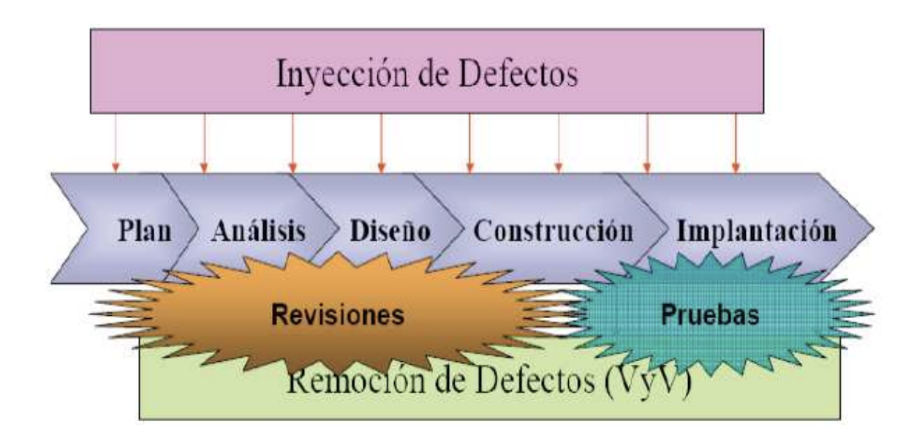

# Ingeniería y Calidad de Software

> Resumen de estudio de las cinco unidades de la materia. Está pensado para leerse de corrido:
> cada capítulo abre explicando por qué el tema existe antes de entrar en las definiciones, y las
> tablas aparecen sólo donde hay algo que comparar. El orden es temático, no el del examen.
> Para el detalle completo de cada tema está la wiki (`ICS.md`); para practicar, el banco de
> preguntas (`banco-preguntas.md`).

## 1. Qué significa calidad en software

La palabra calidad arrastra un problema: todos creen saber qué quiere decir, y cada uno entiende
algo distinto. En la materia se trabaja con una idea central —**calidad es idoneidad de uso**— y
tres definiciones que la precisan desde ángulos diferentes.

La definición **clásica**, de Juran, la plantea en dos mitades: las características del producto
que satisfacen las necesidades del cliente, y la **inexistencia de deficiencias**. Un producto
puede tener todas las funciones pedidas y aun así fallar la segunda mitad.

**CMMI** la define como la capacidad de un conjunto de características inherentes de un producto,
componente o **proceso** de satisfacer por completo los requisitos del cliente. Lo importante acá
es que incluye al proceso: para CMMI, un proceso también tiene calidad.

**ISO** habla del conjunto de propiedades y características que le confieren aptitud para
satisfacer necesidades **explícitas o implícitas**. La palabra que aporta es *implícitas*: hay
expectativas que el cliente nunca escribió y que igual espera que se cumplan.

### 1.1 De qué depende la calidad

Cuatro elementos la determinan: los **procesos y buenas prácticas** que se siguen, las
**herramientas** disponibles, las **personas** que hacen el trabajo, y las **medidas y métricas**
con las que se controla. Ninguno alcanza por sí solo. Un equipo excelente con un proceso caótico
produce resultados irrepetibles, y un proceso impecable no compensa a un equipo sin formación.

### 1.2 Tres tipos de calidad de producto

No toda la calidad se ve desde afuera, y esa distinción explica por qué a veces un sistema que
"anda bien" es un problema.

La **calidad interna** es la que **el cliente no percibe**: facilidad de mantenimiento, claridad
del código, respeto de los estándares, reusabilidad. No la ve, pero la paga: es la que determina
cuánto cuesta cada cambio futuro.

La **calidad externa** es la visible: que el producto cumpla los requerimientos acordados.

La **calidad de uso** es la que algunos llaman *calidad futura*. Es la que no se tuvo en cuenta y
aparece recién cuando el software se usa de verdad: el sistema pasa todas las pruebas, se entrega,
y a la media hora de operación real se nota el problema que nadie había previsto.

### 1.3 Los tres niveles de gestión de la calidad

La calidad se puede gestionar en tres escalas distintas, y cada una tiene sus herramientas.

A nivel de **producto** se gestiona con pruebas ejecutadas en paralelo a cada etapa del
desarrollo. A nivel de **proyecto** se gestiona controlando las fases y las áreas de gestión de
ese proyecto en particular. A nivel de **proceso** se gestionan las áreas de proceso de **toda la
organización** mediante una metodología.

Ese tercer nivel es el que ocupa la mayor parte de la materia, y es donde juega CMMI. La apuesta
de fondo es que **la calidad de un producto está muy influenciada por la calidad del proceso
empleado para desarrollarlo y mantenerlo**: si el proceso es bueno, los productos buenos dejan de
ser casualidad.

## 2. El software como objeto de ingeniería

Antes de hablar de procesos conviene entender por qué el software necesita una ingeniería propia
y no le sirven las de otras disciplinas.

> **Software** = programas + datos + documentos. Es un elemento **lógico**, no físico.

Esa naturaleza lógica trae cuatro consecuencias que condicionan todo lo demás.

**El software se desarrolla, no se fabrica.** No hay línea de producción: cada producto se
construye para los requisitos únicos de un cliente. No se pueden amortizar costos repitiendo
unidades, porque no hay unidades que repetir.

**El recurso principal son las personas, y no son intercambiables con el tiempo.** Agregar gente
no acelera un proyecto de forma lineal: el desarrollo requiere coordinación y comunicación, y cada
integrante nuevo no es productivo de inmediato y además consume tiempo de los que ya están. Por
eso es falso el principio de que "las personas y el tiempo son intercambiables".

**El software no se estropea, pero se deteriora.** Un engranaje se desgasta por uso; el software
no. Lo que lo degrada son los **cambios**: cada modificación de mantenimiento tiene probabilidad
de introducir defectos nuevos, y con los años el producto acumula complejidad y fragilidad.

**La reutilización está lejos de su potencial.** Identificar componentes reutilizables es difícil
justamente porque cada producto se construye para requisitos únicos.

### 2.1 Qué es la ingeniería del software

> **Ingeniería del software (IEEE):** aplicación de un enfoque **sistemático, disciplinado y
> cuantificable** al desarrollo, operación y mantenimiento del software.

Las tres palabras importan. *Sistemático* excluye improvisar; *disciplinado* excluye abandonar el
método cuando aprieta el tiempo; *cuantificable* excluye opinar sin medir.

Se suele representar como una **tecnología multicapa**: sobre una base de **compromiso con la
calidad** se apoyan los **procesos**, sobre ellos los **métodos**, y encima las **herramientas**.
El orden no es decorativo: comprar herramientas sin proceso debajo no produce calidad.

### 2.2 Las etapas y el mantenimiento

Las etapas clásicas son: análisis de requisitos, especificación, diseño y arquitectura,
programación, **prueba** y mantenimiento. La etapa que comprueba que el software realiza
correctamente las tareas indicadas en la especificación es la de **prueba**.

El mantenimiento no es una sola cosa. Distinguir los cuatro tipos es una de las preguntas
recurrentes de la materia:

| Tipo | Qué persigue |
|---|---|
| **Correctivo** | Corregir errores detectados en el producto |
| **Evolutivo (perfectivo)** | Incorporaciones, modificaciones y **eliminaciones** necesarias para cubrir la expansión o el cambio en las necesidades del usuario |
| **Adaptativo** | Modificaciones que responden a cambios del **entorno** donde opera el sistema: hardware, software de base, gestores de base de datos, comunicaciones |
| **Preventivo** | Mejorar la calidad interna y la mantenibilidad, sin cambio funcional visible |

### 2.3 Los principios de la disciplina

De la lista de principios que circula en la materia, dos aparecen una y otra vez como correctos:
**haz de la calidad la razón de trabajar** y **probar, probar y probar**. Y tres aparecen como
distractores porque enuncian exactamente lo contrario de lo que sostiene la disciplina: que las
personas y el tiempo son intercambiables, que conviene hacerlo rápido primero y correcto después,
y que hay que forzar el mismo modelo de ciclo de vida en todos los proyectos.

## 3. CMMI: qué es y para qué sirve

**CMMI** son las siglas de *Capability Maturity Model Integration*: modelo de madurez de
capacidades integrado. No es una metodología ni un manual de procedimientos. Es una **guía de
buenas prácticas** que no dice *cómo* hacer las cosas, sino **qué** hay que lograr.

Esa distinción es la clave para entender el modelo entero. CMMI define objetivos; cada
organización decide con qué prácticas los alcanza, y puede usar prácticas propias distintas de las
que el modelo sugiere, siempre que cumpla el objetivo.

Trabajar con un modelo probado da tres cosas que una organización sola tarda años en construir: la
**experiencia acumulada** de otras empresas, un **lenguaje y una visión común** dentro de la
organización, y un **punto de partida** para no inventar desde cero. Los resultados que se le
atribuyen son menos defectos, menos tiempo de entrega, menor costo, más satisfacción del cliente y
más beneficios.

### 3.1 Área de proceso

> **Área de proceso:** grupo de prácticas relacionadas que, implementadas conjuntamente,
> satisfacen un conjunto de objetivos importantes para la mejora en esa área.

CMMI define **22 áreas de proceso**, repartidas en los niveles de madurez 2 a 5. Cada una cubre un
aspecto del trabajo: planificar proyectos, gestionar requerimientos, verificar productos, formar
gente.

## 4. Anatomía de un área de proceso

Toda área de proceso está construida con las mismas piezas, y esas piezas tienen distinto peso.
Entender cuál es obligatoria y cuál no es probablemente el concepto más preguntado de la materia.

| Categoría | Qué es | Qué incluye |
|---|---|---|
| **Requeridos** | Lo que la organización **debe** lograr para satisfacer el área. Es la base de las evaluaciones | **Metas específicas (SG)** y **metas genéricas (GG)** |
| **Esperados** | Lo que **puede** implementar para lograr lo requerido. Se admiten alternativas propias | **Prácticas específicas (SP)** y **prácticas genéricas (GP)** |
| **Informativos** | Material que ayuda a entender cómo aproximarse a lo requerido y lo esperado | Subprácticas, productos de trabajo típicos, ampliaciones, elaboraciones de prácticas genéricas, notas, ejemplos, referencias, declaración de propósito, áreas relacionadas |

> ⚠️ Lo **requerido son sólo las metas**. Las prácticas —aunque el modelo las liste y las
> explique— son **esperadas**, no obligatorias. Una organización puede sustituir una práctica por
> otra si con ella alcanza la misma meta.

### 4.1 Qué significa "genérico"

Un componente es **genérico** cuando la misma declaración se aplica a **múltiples áreas de
proceso**. Las metas y prácticas específicas son propias de un área; las genéricas se repiten en
todas.

El papel de las genéricas es tratar la **institucionalización**: que el proceso no dependa de la
buena voluntad de quien lo ejecuta, sino que esté incorporado a la manera de trabajar de la
organización. Esa es la respuesta cuando preguntan qué componentes tratan la institucionalización.

### 4.2 La numeración

Las metas se numeran secuencialmente: `SG1`, `SG2`, `GG1`. Las prácticas llevan dos números,
`SP x.y`, donde **x es el número de la meta** a la que pertenecen e **y el número de secuencia**
dentro de esa meta. Así, `SP 2.3` es la tercera práctica de la segunda meta específica.

Saber leer la numeración sirve para descartar opciones: si un área tiene dos metas específicas,
una opción que diga `SP 3.1` es imposible.

## 5. Los niveles de madurez

CMMI organiza la mejora en cinco escalones. Cada uno describe un estado de la organización, no una
lista de tareas cumplidas.

| Nivel | Nombre | Cómo se reconoce |
|---|---|---|
| **1** | Inicial | Caos: se hace lo que se puede. Hay intentos de normalizar, pero **bajo estrés se abandonan**. Predomina la *gestión del héroe*: alguien salva el proyecto a pulmón. El éxito no es repetible |
| **2** | Gestionado | Los procesos se **planifican y se monitorizan**, y se **institucionalizan**: no se abandonan bajo presión. Hay planes, indicadores, seguimiento. Los procedimientos pueden ser **distintos en cada proyecto** |
| **3** | Definido | Existe un **conjunto de procesos estándar de la organización** y cada proyecto **adapta** el suyo desde ahí, siguiendo **guías de adaptación**. Todos trabajan de la misma manera. El rendimiento es predecible, pero sólo **cualitativamente** |
| **4** | Gestionado cuantitativamente | Se gestiona con **datos históricos y estadística**. Se tratan las **causas especiales** de variación. El rendimiento pasa a ser predecible **cuantitativamente** |
| **5** | En optimización | **Mejora continua**. Se atacan las **causas comunes** de variación y se **cambia el proceso** para mejorar su rendimiento |

### 5.1 Las dos comparaciones que hay que poder explicar

**Nivel 2 frente a nivel 3: el alcance de los estándares.** En nivel 2 cada proyecto puede tener
sus propios procedimientos; lo que se exige es que los tenga, los siga y los sostenga. En nivel 3
los procedimientos **se adaptan desde el conjunto estándar de la organización**, y por lo tanto
son consistentes entre proyectos salvo por las diferencias que las guías de adaptación permitan.
Además, en nivel 3 los procesos se gestionan más proactivamente, usando la comprensión de las
interrelaciones entre actividades.

**Nivel 4 frente a nivel 5: el tipo de variación que se trata.** El nivel 4 ataca las **causas
especiales** —las anomalías puntuales— y logra predictibilidad estadística. El nivel 5 ataca las
**causas comunes**, las que están incorporadas al proceso mismo, y para eliminarlas **cambia el
proceso**.

### 5.2 Cómo se avanza: las reglas del modelo escalonado

De estas tres reglas salen casi todos los ejercicios de niveles.

**Primera: para estar en un nivel hay que satisfacer todas las áreas de ese nivel y de los
anteriores.** Si falta una sola área, no se está en ese nivel. Una organización que cumple
perfectamente las áreas de nivel 3 pero incumple una de nivel 2 no está en nivel 3 ni en nivel 2:
está en **nivel 1**, que es el nivel por defecto porque no exige nada.

**Segunda: los niveles son acumulativos.** Alcanzar un nivel superior no exime de las metas de los
anteriores. Una organización nivel 5 sigue planificando y monitorizando proyectos todos los días.
Si dejara de hacerlo, se caería hasta nivel 1.

**Tercera: se puede instanciar un área de nivel superior al propio** si el contexto de negocio lo
justifica, pero se corre el riesgo de intentar prácticas **sin la base institucional que las
soporte**. Eso funciona hasta que aparece el estrés, que es justamente cuando más se las necesita.

### 5.3 Madurez y capacidad

CMMI admite dos formas de mirar el progreso.

La **madurez**, que es la representación **por etapas**, mide a la **organización entera** contra
los conjuntos fijos de áreas de cada nivel. Es la que se certifica y la que usan todos los
ejercicios de la materia.

La **capacidad**, que es la representación **continua**, mide el nivel alcanzado en **un área de
proceso puntual**, con independencia del resto. Sirve para que la organización elija en qué área
quiere crecer primero, según lo que le duela al negocio.

## 6. La gestión de procesos de la organización

Tres áreas de nivel 3 se ocupan de los procesos de la organización como un todo, y son las que más
se confunden entre sí porque sus nombres se parecen. La forma más rápida de separarlas es por el
verbo que las define.

> **OPF diagnostica y despliega. OPD define y guarda. OT capacita.**

### 6.1 OPF — Enfoque en procesos de la organización

Su propósito se basa en la **comprensión de las fortalezas y debilidades actuales** de los
procesos de la organización. Es el área del **diagnóstico y la planificación de la mejora**:
evalúa dónde está parada la organización, incluso comparándose con otras, y arma el plan para
moverse.

Sus prácticas características son establecer las necesidades de procesos de la organización,
**evaluar los procesos**, **establecer planes de acción de procesos**, desplegar los activos y los
procesos estándar, monitorizar la implementación, e **incorporar las experiencias relativas al
proceso en los activos de proceso de la organización**.

### 6.2 OPD — Definición de procesos de la organización

Es el área que **define y mantiene los activos**: el conjunto de procesos estándar, la
arquitectura de proceso, los **modelos de ciclo de vida**, los **criterios y guías de adaptación**,
el **repositorio de medición de la organización**, la **biblioteca de activos** y los estándares
del entorno de trabajo.

> ⚠️ Cuando un enunciado menciona un **repositorio de medidas ligado a los procesos estándar de la
> organización**, la respuesta es **OPD**, no MA. MA es nivel 2 y mide **el proyecto**; el
> repositorio organizacional es un **activo**, y los activos son de OPD.

### 6.3 OT — Formación organizativa

Su propósito es que **las personas puedan desempeñar sus roles de manera eficaz y eficiente**.
Trabaja sobre las necesidades estratégicas de formación, el plan táctico de formación y la
evaluación de la eficacia de lo que se enseñó.

### 6.4 El par de prácticas que se cruza

En los exámenes aparece la misma lista de prácticas preguntada dos veces, una pidiendo las de OPF
y otra las de OPD. Conviene tenerlas separadas:

| Práctica | Área |
|---|---|
| Establecer el repositorio de medición de la organización | **OPD** |
| Establecer las descripciones de los modelos de ciclo de vida | **OPD** |
| Establecer los criterios y las guías de adaptación | **OPD** |
| Evaluar los procesos de la organización | **OPF** |
| Establecer planes de acción de procesos | **OPF** |
| Incorporar las experiencias relativas al proceso en los activos de proceso | **OPF** |

## 7. Activos de proceso y productos de trabajo

Esta distinción es corta de explicar y sorprendentemente fácil de errar, porque los dos conceptos
se refieren a documentos que a veces tienen nombres casi idénticos.

> Un **activo** es un artefacto que la organización produce **para ser usado en las tareas de los
> proyectos**. Un **producto de trabajo** es el resultado concreto de una tarea **de un proyecto**.

La pregunta que resuelve cualquier caso es: *¿esto existe para ser usado en muchos proyectos, o
salió de uno?*

Las señales de **activo** son las palabras plantilla, guía, directriz, modelo y estándar. También
son activos las **herramientas que la organización adquiere** en lugar de desarrollar, junto con
su documentación: el manual de usuario del compilador Java es un activo, porque no es producto de
ningún proyecto.

Las señales de **producto de trabajo** son las referencias a un proyecto concreto: "del cliente",
"del sistema desarrollado". Una minuta, el código fuente, una regla de negocio, la descripción del
proceso de negocio del cliente.

El par que fija el criterio es este: la **plantilla de manual de instalación** es un activo —es el
molde, y pertenece a la organización—, mientras que el **manual de instalación del sistema
desarrollado para el cliente** es un producto de trabajo —es lo moldeado, y pertenece al proyecto.

## 8. El proyecto y su planificación

### 8.1 Qué es un proyecto

> **Proyecto:** conjunto de actividades coordinadas y controladas, con **inicio y fin definidos**,
> que crea un producto o servicio **único** conforme a requisitos específicos, dentro de límites de
> tiempo, coste y recursos. Se desarrolla **en pasos**, en lo que se llama elaboración gradual.

Tres precisiones que se derivan de la definición. Un proyecto **siempre tiene fin**: lo que no
termina no es un proyecto sino una operación. Los proyectos de software **no son sólo de
desarrollo**: existen los de **mantenimiento** y los de **despliegue o implantación**, y la
categoría cambia qué tareas entran en la planificación. Y tener un diagrama de Gantt **no es tener
un plan de proyecto**: el Gantt es una vista del cronograma, mientras que el plan incluye alcance,
estimaciones, recursos, riesgos, calidad y comunicación.

La contracara del proyecto es el **proceso**, que es **repetitivo y reiterativo y produce siempre
el mismo producto**. Esa repetibilidad es exactamente lo que el proyecto no tiene.

### 8.2 PP — Planificación de proyecto

Es un área de **nivel 2** y se encarga de cuatro cosas: desarrollar el plan, interactuar con las
partes interesadas, **obtener el compromiso** con el plan, y mantenerlo.

La planificación arranca **con los requerimientos**, que son los que definen producto y proyecto.
A partir de ahí se estiman los atributos de los productos de trabajo y de las tareas, se
determinan los recursos, se elabora el calendario y se **identifican y tratan los riesgos**.

Un punto que suele pasarse por alto: **el plan necesitará corregirse** a lo largo del proyecto, y
eso no es un fracaso de la planificación. Cambian los requerimientos, cambian los compromisos y
las estimaciones resultan inexactas.

Sus tres metas son **establecer estimaciones** (alcance, atributos, ciclo de vida, esfuerzo y
coste), **desarrollar un plan de proyecto** (presupuesto y calendario, riesgos, gestión de datos,
recursos, conocimientos y habilidades, involucración de los interesados) y **obtener el compromiso
con el plan** (revisar los planes que lo afectan, reconciliar niveles de trabajo y recursos,
obtener el compromiso).

> ⚠️ La planificación **incluye** estimar las tareas, determinar los recursos e identificar los
> riesgos. **No incluye** el pago a los recursos ni la especificación detallada de la arquitectura
> del software, que corresponde a **TS** (Solución técnica).

### 8.3 PMC — Monitorización y control del proyecto

También es de **nivel 2**, y su propósito es proporcionar una comprensión del progreso del
proyecto para poder tomar **acciones correctivas apropiadas** cuando el rendimiento se desvía
significativamente del plan.

El progreso se mide comparando la calidad de los productos de trabajo, el esfuerzo, el coste y el
calendario **reales contra el plan**, en los **hitos o niveles de control** definidos en la EDT. Si
hay desvío, las acciones correctivas posibles son la **replanificación**, el establecimiento de
**nuevos acuerdos**, o la inclusión de **actividades adicionales de mitigación** dentro del plan
actual.

> **Desvío significativo:** aquel que, si se deja sin resolver, **impide al proyecto cumplir sus
> objetivos**. Por eso es falso que cualquier desvío deba resolverse: el modelo pide criterio, no
> reacción automática.

Los **puntos de control y monitoreo se definen durante la planificación**, no durante la
ejecución. En ejecución se usan.

> ⚠️ Para distinguir PP de PMC en un enunciado, fijate dónde está la reunión respecto del momento
> narrado. Si la reunión está **en el futuro** —"para informarlo en la reunión donde se juntará por
> primera vez todo el equipo"— todavía se está planificando: es **PP**. Si la reunión **ya
> ocurrió** —"en la última reunión de avance…"— se está monitorizando: es **PMC**.

### 8.4 Los diez grupos de procesos de gestión

La guía práctica de gestión de proyectos organiza el trabajo en diez grupos. Vale la pena tener
presente a cuál pertenece cada proceso, porque los ejercicios juegan con procesos que suenan a un
grupo y pertenecen a otro.

| Grupo | Procesos |
|---|---|
| **Coordinación** | Iniciar el proyecto · Desarrollar el plan · Gestionar la ejecución · Supervisar el trabajo · Control integrado de cambios · Cerrar el proyecto |
| **Alcance** | Definir el alcance · **Definir las actividades** · Controlar y verificar el alcance |
| **Tiempo** | Establecer la secuencia de actividades · Estimar la duración · Desarrollar el cronograma · Controlar el cronograma |
| **Costes** | Estimar los costos · Elaborar los presupuestos · Controlar los costos |
| **Calidad** | Planificar la calidad · Aseguramiento de calidad · Control de calidad |
| **Recursos** | Planificar los recursos · Controlar los recursos |
| **Personal** | Definir el equipo del proyecto · Gestionar el equipo |
| **Comunicación** | Planificar las comunicaciones · Gestionar la información y los interesados |
| **Riesgos** | Planificar la gestión · Identificar · Analizar · Planificar la respuesta · Controlar |
| **Adquisiciones** | Planificar las adquisiciones · Planificar la contratación · Solicitar respuesta a proveedores · Seleccionar proveedores · Administrar el contrato · Cerrar el contrato |

Tres detalles que se preguntan. **Definir las actividades** pertenece a **Alcance**, no a Tiempo,
aunque suene a cronograma. **Desarrollar el cronograma** debe identificar explícitamente el
**camino crítico**, que es el de mayor duración en la red de actividades, y de ahí salen las
actividades críticas y los hitos. Y **definir el equipo del proyecto** consiste en determinar
**roles y responsabilidades**; no incluye estimar el esfuerzo por rol ni controlar el cronograma.

### 8.5 La EDT, las precedencias y el esfuerzo

La secuencia de trabajo es siempre la misma: se arma la **EDT**, se identifican las **tareas
típicas** del ciclo de vida elegido, y se establecen las **órdenes de precedencia** entre ellas.

Dos cosas a tener claras al leer una red de tareas.

Una **predecesora directa** es la inmediatamente anterior. Si A precede a B y B precede a C,
entonces A **no** es predecesora directa de C, aunque tenga que ocurrir antes.

Los **módulos independientes arrancan en paralelo**. Si un producto se compone de tres módulos
independientes X, Y y Z, las tareas que dan inicio al proyecto son **tres**: analizar X, analizar
Y y analizar Z.

> ⚠️ **Esfuerzo y duración no son lo mismo y no se suman igual.** El **esfuerzo** se mide en
> días-persona u horas-persona y **se suma**. La **duración** se mide en días o meses y **no se
> suma**, porque las tareas de módulos independientes corren en paralelo. Una tarea puede durar 2
> días y consumir 3 días-persona, si hay dos personas trabajando parte del tiempo. Cuando un
> ejercicio pide esfuerzo, hay que leer la columna de esfuerzo y convertir: 1 día-persona = 8
> horas.

## 9. La estimación del esfuerzo

Estimar es decidir cuánto va a costar algo que todavía no existe. La materia presenta cuatro
métodos, que no compiten entre sí: se usan en momentos distintos y con información distinta.

El **valor esperado**, o **técnica de tres puntos**, estima cada tarea en tres escenarios
—optimista, normal y pesimista— y los combina en un único valor. La fórmula estándar pondera el
escenario normal por cuatro: `(O + 4N + P) / 6`. Es rápida y sirve cuando la incertidumbre está
acotada.

**Delphi** es una estimación **grupal e independiente de expertos**: cada uno vuelca su
perspectiva en números sin ver la del resto. Es **iterativa**, y en cada vuelta se suma
información buscando la **convergencia**. Sirve cuando no hay datos históricos pero sí gente con
experiencia.

Los **puntos de función** miden el tamaño del software desde una perspectiva funcional,
independiente de la tecnología. Se parte de la lista de requerimientos, se categoriza la
funcionalidad y se aplica la metodología que se detalla abajo. Son una medida **indirecta del
tamaño**, no del esfuerzo: el esfuerzo se deriva después.

Los **puntos de historia** son la estimación relativa de las metodologías ágiles.

Un consejo que la cátedra repite: **tomar nota de las decisiones tomadas**, sobre todo en la etapa
de estimación. Es lo que después permite explicar un desvío en PMC en lugar de improvisar una
justificación.

### 9.1 La distribución 40-20-40

Es una regla de reparto del esfuerzo total de un proyecto: **40 % análisis y diseño** —de los
cuales 10 a 15 puntos van al análisis y 25 a 30 al diseño—, **20 % codificación** y **40 %
pruebas**.

La lectura que importa no es el número exacto sino su consecuencia: **codificar es apenas la
quinta parte del proyecto**, y se prueba tanto como se analiza y diseña junto.

### 9.2 Análisis de puntos función

El método tiene tres etapas.

**Primero se identifican y clasifican los componentes**, después de fijar el **límite del
sistema**, que determina qué queda adentro y qué es externo. Los componentes son cinco:
**entradas** (datos que cruzan el límite hacia adentro), **salidas** (datos que lo cruzan hacia
afuera), **consultas** (combinación de entrada y salida para obtener datos), **ficheros lógicos
internos** o FLI (datos que residen dentro de la aplicación y son actualizados por las entradas) y
**ficheros de interfaz externos** o FIE (datos que residen fuera y son mantenidos por otra
aplicación).

**Segundo se pondera cada componente** según su complejidad, que se establece por la diversidad de
atributos en tipo y cantidad:

| Componente | Baja | Media | Alta |
|---|:---:|:---:|:---:|
| Entradas | 3 | 4 | 6 |
| Salidas | 4 | 5 | 7 |
| Consultas | 3 | 4 | 6 |
| Ficheros internos (FLI) | 7 | 10 | 15 |
| Ficheros externos (FIE) | 5 | 7 | 10 |

La suma da los **PFD**, puntos función sin ajustar.

**Tercero se aplica el factor de ajuste**, que incorpora características no funcionales del
entorno. Se califican **14 características** de 0 a 5 —comunicaciones de datos, procesamiento
distribuido, rendimiento, utilización masiva, tasa de transacción, entrada de datos on-line,
eficiencia para el usuario, actualización on-line, procesamiento complejo, reutilización,
facilidad de instalación, facilidad de operación, puestos múltiples y facilidad de cambio—. La
suma de los 14 valores es el **TDI**, que va de 0 a 70:

```
Factor de ajuste = 0,65 + (TDI / 100)
PF ajustados     = PFD × Factor de ajuste
```

Con el TDI entre 0 y 70, el factor va de **0,65 a 1,35**: el ajuste puede mover el tamaño estimado
hasta un 35 % para cada lado.

## 10. Los ciclos de vida

Elegir un ciclo de vida es decidir **cuándo** se hace cada cosa, y esa decisión determina cuándo
se detectan los defectos y cuánto cuesta corregirlos.

| Ciclo | Cómo funciona | Cuándo conviene |
|---|---|---|
| **Cascada** | Cada etapa espera a que termine la anterior. Las pruebas van al final | Requerimientos **conocidos y estables**; mantenimiento correctivo corto. Es **el que menos sirve con requerimientos inestables**: cerrado el análisis, los cambios no se contemplan hasta terminar las pruebas |
| **Modelo en V** | Integra verificación y validación **desde las primeras fases**, en paralelo al desarrollo: cada etapa tiene su nivel de prueba asociado | Cuando se quiere detectar defectos temprano sin abandonar la estructura secuencial |
| **Incremental** | Secuencias lineales escalonadas; cada una produce un **incremento**. Cada incremento es una mini-cascada completa con análisis, diseño, código y prueba | Cuando hay que **salir a producción antes** de tener todo terminado |
| **Iterativo** | Pasadas sucesivas sobre el producto, más flexible que el incremental: no espera a terminar una fase para empezar otra | **Requerimientos no estabilizados** |
| **Espiral** | Las características **evolucionan**: prototipo, prueba, rediseño y prototipado continuos | Cuando el equipo **no puede especificar por adelantado**. Riesgo: entregar como final un prototipo que no está listo |
| **Prototipado** | Recolección de requisitos, **diseño rápido** de lo visible para el usuario, construcción, evaluación del cliente, refinamiento | El cliente define objetivos generales pero **no los requisitos detallados**. Reduce el riesgo de **subestimar el esfuerzo** |

La desventaja crítica de la cascada es que concentra las pruebas al final, de modo que los
defectos se detectan cerca de la implementación, que es donde más caro sale corregirlos. El modelo
en V nace como respuesta a esa limitación.

En un ciclo **incremental** vale la pena subrayar algo que se pregunta seguido: como cada
incremento es una cascada completa, **el análisis se hace en todos los incrementos** y **las
pruebas de sistema también**, no solamente en el último.

## 11. Verificación y validación

### 11.1 La distinción

Es la pareja de conceptos más importante de la unidad y la más fácil de confundir, porque ambos
son procesos de evaluación de productos, se ejecutan frecuentemente **de forma concurrente** y
pueden compartir parte del entorno.

| | **Verificación (VER)** | **Validación (VAL)** |
|---|---|---|
| Qué asegura | Que los productos de trabajo seleccionados **cumplen sus requerimientos especificados** | Que el producto **se ajusta a su uso previsto cuando se sitúa en su entorno previsto** |
| La pregunta | ¿Estoy construyendo **correctamente** el producto? | ¿Estoy construyendo el producto **correcto**? |
| Contra qué contrasta | La **especificación** | La **necesidad del usuario** |
| Quién interviene | Es una cuestión **interna** | Involucra al **cliente o usuario** |
| Nivel CMMI | 3 | 3 |

> ⚠️ El criterio que resuelve cualquier caso es **contra qué se contrasta**, no quién lo hace ni en
> qué fase ocurre. Unas pruebas de sistema ejecutadas por el equipo de QA sobre el producto
> terminado son **verificación**, porque se contrastan contra la especificación. Unas pruebas de
> aceptación con clientes reales son **validación**. Las inspecciones y revisiones son
> **verificación**.

### 11.2 Qué se valida y cómo

La validación se aplica a los productos de trabajo —requerimientos, diseños, prototipos— y al
producto y sus componentes. Se hace **temprana e incrementalmente**, no al final.

El entorno debe **representar el entorno previsto**, y puede usarse completo o sólo en parte. Los
métodos posibles son la discusión con usuarios, las demostraciones de prototipos, las
demostraciones funcionales, los **pilotos** de materiales de formación, las pruebas realizadas por
los usuarios finales y el análisis mediante simulaciones o modelado.

Es validable más de lo que se suele pensar: requerimientos y diseños, el producto y sus
componentes, las **interfaces de usuario**, los **manuales de usuario**, los **materiales de
formación** y la documentación del proceso.

La **verificación es incremental**: empieza por la verificación de los requerimientos, sigue con
los productos de trabajo a medida que evolucionan, y culmina con la verificación del producto
terminado.

### 11.3 Metas y prácticas

| Verificación (VER) | Validación (VAL) |
|---|---|
| **SG1 Preparar la verificación** — SP1.1 Seleccionar los productos de trabajo a verificar · SP1.2 Establecer el entorno · SP1.3 Establecer procedimientos y criterios | **SG1 Preparar la validación** — SP1.1 Seleccionar los productos a validar · SP1.2 Establecer el entorno · SP1.3 Establecer procedimientos y criterios |
| **SG2 Realizar revisiones entre pares** — SP2.1 Preparar · SP2.2 Llevar a cabo · SP2.3 Analizar los datos | *(VAL no tiene esta meta)* |
| **SG3 Verificar los productos seleccionados** — SP3.1 Realizar la verificación · SP3.2 Analizar los resultados | **SG2 Validar el producto o los componentes** — SP2.1 Realizar la validación · SP2.2 Analizar los resultados |

> ⚠️ Las **revisiones entre pares existen sólo en VER**. Si una opción atribuye a VAL la práctica
> "preparar las revisiones entre pares", esa opción es falsa aunque todo lo demás encaje.

### 11.4 El grado de confianza

Verificar y validar no busca la ausencia total de defectos —que es inalcanzable— sino que el
software sea **suficientemente bueno para su uso previsto**. Cuánta confianza hace falta depende
de tres factores.

La **criticidad del sistema**: un sistema crítico exige confianza alta; un prototipo, mucho menos.
Las **expectativas del usuario**, que vienen subiendo porque la tolerancia a fallos decrece. Y el
**entorno de mercado**: con pocos competidores una empresa puede lanzar antes de estar
completamente probada para llegar primero, y con un precio bajo los clientes toleran más defectos.

Conviene recordar que V&V son **procesos costosos**: en ciertos sistemas superan **la mitad del
presupuesto total** de desarrollo. Por eso se planifican desde etapas tempranas.

### 11.5 Inyección y remoción de defectos



Los defectos **se inyectan en todas las fases** —plan, análisis, diseño, construcción e
implantación—, no sólo al programar. Verificación y validación son el conjunto de actividades de
**remoción**, y se reparten en dos franjas que se solapan: las **revisiones**, que son estáticas,
cubren desde el plan hasta la construcción; las **pruebas**, que son dinámicas, cubren desde la
construcción hasta la implantación.

De ahí la regla económica que ordena toda la unidad: **corregir un defecto en mantenimiento cuesta
alrededor de cien veces más que corregirlo en la etapa de requisitos**. Cuanto antes empiece V&V,
más barato sale cada defecto.

## 12. La organización de las pruebas

### 12.1 Qué es un caso de prueba

> **Caso de prueba:** conjunto de **entradas, condiciones de ejecución y resultados esperados**,
> desarrollado para un objetivo o condición particular.

En su forma mínima se escribe como un par ordenado: **(valor de entrada → resultado esperado)**.
Sin resultado esperado no hay caso de prueba, porque no habría forma de saber si pasó o falló.

Nunca se prueba en producción: el entorno de pruebas debe estar **físicamente separado** y recrear
las condiciones de producción.

### 12.2 Los cuatro niveles de prueba

| Nivel | Qué prueba | Quién y cómo |
|---|---|---|
| **Unitarias** | Cada módulo o componente aislado, antes de integrar | El **propio desarrollador**, junto con el diseño y la construcción. Usa **stubs y drivers** para aislar el módulo |
| **Integración** | La interacción entre módulos ya integrados: defectos de **interconexión** | Se apoya en los documentos de análisis y sobre todo de **diseño** |
| **Sistema** | El comportamiento **global** contra la especificación funcional, incluyendo requisitos no funcionales | Un equipo **independiente**, con técnicas de **caja negra** y un entorno lo más parecido a producción |
| **Aceptación** | Que el producto satisface las **necesidades del usuario** | Lo realiza **un usuario o cliente** |

**Ningún nivel reemplaza a otro.** Que haya pruebas de integración no quita que se hagan las
unitarias, y viceversa.

Para armar la integración hay tres estrategias. **Big-bang** ensambla todo de una vez: no requiere
simular nada, pero consume mucho tiempo rastreando causas y descubre los problemas al final.
**Bottom-up** avanza desde los módulos inferiores: necesita **drivers** en cada nivel y no
encuentra problemas de diseño hasta muy avanzado. **Top-down** avanza desde los componentes
superiores: necesita **stubs** que simulen los inferiores, pero **descubre rápidamente los errores
de arquitectura**.

Las pruebas de aceptación admiten tres modalidades: **alfa**, con un conjunto acotado de clientes
preseleccionados en un entorno controlado; **beta**, con un conjunto más amplio; y **piloto**, con
un conjunto reducido de departamentos del cliente y en **ambiente de producción**.

### 12.3 Tipos de prueba

El **nivel** indica cuándo y sobre qué parte se prueba; el **tipo** indica con qué objetivo. Los
tipos que se nombran en la materia son las pruebas funcionales, las de prestaciones, las de
usabilidad, las de seguridad o acceso, las de configuración, las de instalación y carga inicial de
datos, y las de migración de datos.

Dentro de las de **prestaciones** conviene distinguir cuatro que se confunden. Las de **carga**
validan los requisitos de prestaciones definidos con escenarios realistas. Las de **capacidad**
buscan el **punto umbral** a partir del cual las prestaciones se degradan, incrementando la carga
hasta la saturación. Las de **estrés** estudian el comportamiento **en sobrecarga**, excediendo
los límites, con foco en la integridad. Las de **estabilidad** miran el comportamiento **en el
tiempo** bajo carga normal, para detectar mala liberación de recursos.

### 12.4 Regresión y confirmación

Son dos actividades distintas que se ejecutan juntas después de cada corrección.

La **confirmación** verifica que **el defecto corregido realmente se solucionó**: misma prueba,
mismas condiciones, mismos datos. La **regresión** verifica que **el arreglo no rompió otra cosa**.

La regresión puede detectar tres situaciones: que el cambio **creó un error nuevo** (regresión
local), que el cambio **reveló errores que ya existían** (de exposición), o que el cambio en un
área **rompió otra área** del sistema (remota). La estrategia más simple es la **fuerza bruta**,
repetir todas las pruebas, y por eso la regresión es el mejor candidato a automatizarse.

### 12.5 Los diez principios de Myers

Son el marco de actitud con el que se encara el testing, y condensan buena parte de lo anterior.

1. Una parte **necesaria** de un caso de prueba es la definición de la **salida prevista**.
2. Un desarrollador debe evitar **probar su propio programa**.
3. El personal de prueba **no debería depender** del área de desarrollo.
4. **Inspeccionar los resultados** de la prueba.
5. Escribir casos **tanto para las condiciones de entrada esperadas como para las no esperadas**.
6. Examinar un programa para comprobar **que no hace lo que no se supone** que haga.
7. Evitar casos de prueba **desechables y sin documentar**: hay que guardarlos para reejecutarlos.
8. **No planificar** el esfuerzo de pruebas suponiendo que no se encontrarán errores.
9. La probabilidad de encontrar errores adicionales en una sección es **proporcional al número de
   errores ya encontrados** en esa misma sección.
10. Las pruebas son una tarea **altamente creativa** y un desafío intelectual.

Los principios 2 y 3 merecen desarrollo, porque suelen preguntarse. Hay tres razones por las que
quien desarrolla no debe probar su propio código. La primera es de actitud: **desarrollar es un
proceso creativo y probar es un proceso destructivo**, y cuesta cambiar de una mentalidad a la
otra sobre el trabajo propio. La segunda es la **visión de túnel**: quien desarrolló entiende su
código de raíz y tiende a probar los caminos que ya sabe que funcionan. La tercera es la más
grave: si el error está en **cómo se entendió el requerimiento**, quien lo entendió mal va a
probar según su propio malentendido; por eso se prueba también **con el cliente**.

El principio 9 tiene una consecuencia práctica directa: conviene concentrar el esfuerzo de
corrección **en los módulos donde más defectos aparecieron**, porque es donde es más probable que
sigan apareciendo.

## 13. Las técnicas dinámicas

Las técnicas dinámicas ejecutan el código y buscan **fallos**. Existen porque **no se puede probar
exhaustivamente**: las combinaciones de entradas posibles son inabarcables. Cada técnica es una
forma sistemática de elegir un subconjunto de casos con alta probabilidad de encontrar defectos.

Antes de ver cada una, conviene tener el criterio de selección, porque los enunciados suelen
describir la situación y pedir la técnica:

| Lo que dice el enunciado | Técnica |
|---|---|
| Un campo con rango, longitud o formato; "valores válidos e inválidos" | **Partición de equivalencia** o **valores límite** |
| "Todas las combinaciones", una matriz, reglas de negocio que se cruzan | **Tablas de decisión** |
| Una secuencia de estados, "pasa de X a Y" | **Transición de estados** |
| Flujo básico y flujos alternativos, escenarios de punta a punta | **Pruebas de casos de uso** |
| Se dispone del código, cobertura de sentencias o decisiones | **Caja blanca** |
| Volver a probar lo que ya funcionaba después de un cambio | **Regresión** |

### 13.1 Particionamiento de equivalencia

La idea es agrupar las condiciones de entrada que **el sistema trata igual**. Si el programa
funciona para un valor de la partición, se asume que funciona para todos; si falla para uno, se
asume que falla para todos. Por eso alcanza con probar **un representante por partición**.

Las particiones se dividen en **válidas** —las que el sistema debe aceptar— e **inválidas** —las
que debe rechazar—. Las directrices habituales son: un rango como "10 a 100" da una partición
válida y **dos inválidas** (por debajo y por encima); un conjunto discreto como "ROJO, BLANCO,
NEGRO" da una válida y una inválida; una condición de obligación como "letras mayúsculas" da una
de cada una. También existen las **particiones de salida**, que agrupan por resultado en vez de
por entrada.

El formato con el que se trabaja en la materia tiene dos tablas encadenadas. La primera declara
el **atributo**, su **dominio** y las particiones válidas e inválidas. Para un campo "día del mes"
con dominio entero positivo entre 1 y 31, y un recargo que cambia cada diez días:

| | Particiones |
|---|---|
| **Válidas** | PV1) 1 ≤ X ≤ 10 · PV2) 11 ≤ X ≤ 20 · PV3) 21 ≤ X ≤ 31 |
| **Inválidas** | PI1) letras · PI2) X ≤ 0 · PI3) X > 31 · PI4) vacío · PI5) imagen · PI6) carácter especial · PI7) cadena de caracteres |

La segunda lista los casos de prueba, con un representante por partición y una fila por caso:
`Caso | Partición | Entrada | Salida esperada`. Con las particiones de arriba serían diez casos:
tres válidos (1, 12, 30) y siete inválidos, uno por cada forma de entrada rechazable.

> ⚠️ Dos errores arruinan este ejercicio. El primero es **olvidar las particiones intermedias**: si
> un sistema se activa "por encima de 25" y se apaga "por debajo de 20", entre 20 y 25 hay una
> zona donde no pasa nada, y esa zona **es una partición válida**. El segundo es **dejar que las
> particiones se pisen**: si la válida llega hasta 31, la inválida empieza en 32, o sea `X > 31`,
> no `X ≥ 31`.

### 13.2 Análisis de valor de frontera

Es una **mejora** del particionamiento, no una alternativa. En vez de un solo representante por
partición, prueba **más de un caso en cada una**, concentrados en los **extremos**, porque es
donde se agrupan los errores.

Para un rango de 10 a 100 se prueban **9, 10, 100 y 101**. Para conjuntos ordenados, el primer y
el último elemento. Hay valores especiales que conviene no olvidar: en minutos siempre 0 y 59; en
fechas, los límites de mes y los **años bisiestos y no bisiestos**.

Para campos no numéricos el criterio cambia. Si el campo admite **una letra cualquiera**, alcanza
un caso. Si admite un **conjunto cerrado** de N valores, va un caso por valor. Si es una **cadena
de longitud fija**, se prueba con esa longitud exacta. Si acepta **hasta N caracteres**, van casos
para las longitudes relevantes alrededor de N.

> Cuando una consigna pide "cubrir todas las particiones válidas", pide **representantes**, no
> bordes. Cuando pide valores límite, pide los **extremos**. Es la diferencia entre las dos
> técnicas y es lo que se evalúa.

### 13.3 Tablas de decisión

Se usan cuando **múltiples combinaciones de entradas** producen resultados distintos. A diferencia
de las anteriores, que miran un campo por vez, esta técnica se centra en **la lógica y las reglas
de negocio** que cruzan varios campos.

La tabla tiene filas de **condición** y filas de **acción**, y **cada columna es una regla de
negocio**, es decir, un caso de prueba.

Armarla tiene cuatro pasos. Se identifican las **condiciones**, que son los atributos que deciden
el resultado. Se identifican las **acciones**, que son los resultados distintos que el sistema
puede ejecutar. Se generan las **columnas**, combinando los valores posibles de cada condición. Y
se **reduce** la tabla, eliminando las combinaciones imposibles y colapsando las indiferentes.

Un ejemplo que aclara el conteo. Un gimnasio tiene socios de categoría Coulson, IronMan (10 % de
descuento) o Hulk (15 %), y quien tiene la cuota al día recibe un 5 % adicional acumulable. Las
condiciones son dos: la categoría y el estado de la cuota. Pero la categoría **no es binaria**:
tiene tres valores mutuamente excluyentes. Entonces las columnas son 3 × 2 = **6**, y las acciones
son **cuatro**: aplicar 0 %, 10 %, 15 % y el 5 % adicional.

> ⚠️ El error típico es contar toda condición como binaria y calcular 2ⁿ columnas. Una condición
> puede tener tres o más valores, y en ese caso el producto cambia. Y a la inversa: cuando hay
> **condiciones incompatibles** —si el usuario no existe, la contraseña es irrelevante—, las
> combinaciones se colapsan y quedan menos casos de los que sugiere la potencia de dos.

### 13.4 Transición de estados

Se aplica a sistemas modelables como **máquina de estados finitos**, donde la salida ante la misma
entrada **depende del estado anterior**. El ejemplo canónico es un trámite que pasa de Inscripto a
Cursando y de ahí a Aprobado o Desaprobado.

Partiendo de la máquina de estados, la técnica permite revisar qué hace falta para llegar a cada
estado y detectar incompatibilidades: **transiciones que faltan**, o estados de los que no se
puede salir.

Una prueba completa no se limita al camino feliz: debe incluir las **transiciones no válidas**
—intentos fallidos, timeouts— y los **eventos no especificados**, como cancelar a mitad de camino.

### 13.5 Pruebas de casos de uso

Ejercitan el sistema **de punta a punta**, siguiendo el recorrido real de un usuario.

El proceso es: definir el **flujo básico**, que es el camino feliz, y los **flujos alternativos**;
**derivar los escenarios**, donde cada escenario es el flujo básico más uno de los caminos
alternativos; y escribir **un caso de prueba por escenario**, con identificador, condiciones de
entrada y resultado esperado. Después se suman las especificaciones complementarias:
rendimiento, seguridad, configuración e instalación.

Estos casos son de **mejor calidad** que los armados campo por campo, porque ejercitan el sistema
como se usa de verdad: validar una tarjeta en un cajero contempla muchas más cosas que probar tres
números sueltos en un formulario.

### 13.6 Caja negra y caja blanca

La distinción es qué información tiene quien prueba.

En **caja negra** sólo se ven entradas y salidas. Es rápida y no requiere acceso al código, pero
cuando algo falla **no se sabe dónde está el error**. Todas las técnicas anteriores son de caja
negra.

En **caja blanca** se dispone del **código fuente**, lo que permite saber cuántas sentencias y
condiciones se ejecutaron y sacar un porcentaje de cobertura. Trabaja sobre tres estructuras:
secuencia, selección e iteración.

| Técnica | Objetivo |
|---|---|
| **Pruebas de sentencia** | Ejecutar cada sentencia ejecutable al menos una vez |
| **Pruebas de decisión** | Evaluar cada decisión (IF-THEN-ELSE, DO-WHILE) en **verdadero y falso** |
| **Pruebas de caminos** | Recorrer cada camino de ejecución independiente. **No** prueba todas las combinaciones: con bucles serían infinitas |

Conviene notar que un defecto puede manifestarse **aunque todas las sentencias se hayan ejecutado
al menos una vez**, porque el problema aparece recién al **combinarse** ciertos caminos. La
cobertura del 100 % de sentencias no garantiza ausencia de defectos.

### 13.7 Técnicas basadas en la experiencia

Se usan cuando **no hay una especificación adecuada** o **no hay tiempo**. La **adivinación de
errores** complementa a las técnicas formales y depende de la habilidad e intuición del técnico.
Las **pruebas exploratorias** consisten en recorrer el software para entender qué hace, qué no
hace y dónde está débil, diseñando las pruebas mientras se ejecutan.

## 14. Las técnicas estáticas: revisiones

### 14.1 Por qué existen

Las técnicas dinámicas necesitan el sistema andando, y eso limita cuándo se pueden aplicar. Las
**estáticas** analizan documentos —requisitos, diseños, código, historias de usuario— **sin
ejecutar nada**, y por eso se pueden aplicar en **cualquier momento** del ciclo de vida. Buscan
**defectos**, no fallos.

Son la **primera forma de prueba aplicable** en un proyecto, y están vinculadas principalmente a
la **verificación**.

| | Estáticas (revisiones) | Dinámicas (pruebas) |
|---|---|---|
| Qué encuentran | **Defectos** | **Fallos** |
| Qué necesitan | Documentos | **El sistema ejecutable** |
| Cuándo se aplican | En cualquier momento | Sólo con el producto andando |
| Ventaja | Se sabe **dónde** está el problema; se encuentran varios a la vez; se corrige temprano | Más rápidas de ejecutar |
| Desventaja | Más lentas | **No se sabe dónde** está el error |

Son **complementarias**: ninguna reemplaza a la otra.

### 14.2 Beneficios y costo

Las revisiones mejoran la calidad y la comprensión de los entregables, validan que soportan la
solución final, gestionan las expectativas del negocio, identifican tareas de alto riesgo y forman
al equipo. Al reducir los errores que llegan a la etapa de pruebas, **acortan los períodos de
prueba y bajan sus costos**.

Aun así, muchas organizaciones no las implementan, y la explicación que da la materia es que
tienden a **sobreestimar su costo y subestimar sus beneficios**.

### 14.3 Formalidad

Una revisión puede ser informal o formal, y la diferencia está en si hay proceso.

Las **informales** no tienen proceso definido, no tienen roles y habitualmente no se planean.
Cualquier intercambio entre pares cuenta: preguntarle a un compañero si le parece bien un pedazo
de código es una revisión informal.

Las **formales** tienen objetivos definidos, proceso documentado, roles asignados a personas
entrenadas, checklists y reglas, **reporte de resultados** y recolección de datos para el control
del proceso.

La formalidad importa porque deja **trazabilidad documentada** de las acciones y decisiones, lo
que permite demostrar después que los procedimientos se cumplieron.

### 14.4 El proceso y los tipos

El proceso básico es común a todas: se identifican los entregables a revisar, se arma la lista de
participantes, los revisores **estudian** el documento por su cuenta, identifican problemas y se
los **comunican al autor**, y el autor **responde y actualiza**.

| Tipo | Quién lo dirige | Foco | Formalidad |
|---|---|---|---|
| **Revisión informal** | — | Encontrar defectos; documentar es opcional | Mínima |
| **Walkthrough** | **El propio autor** | Entendimiento común, evaluar contenidos, discutir alternativas | Media |
| **Revisión técnica** | Un moderador capacitado o experto técnico | **Consenso técnico**, con revisores expertos; no es búsqueda de defectos | Variable |
| **Revisión entre pares** | Colegas del mismo proyecto | Identificar y eliminar defectos **temprano**, de forma incremental | Media |
| **Inspección** | **Un moderador formado, nunca el autor** | **Registrar defectos** eficientemente: las discusiones se posponen. Seguimiento formal con criterios de salida | **Máxima** |

### 14.5 Los cinco roles

El **moderador** dirige el proceso, determina junto con el autor el tipo de revisión y la
composición del equipo, y hace el seguimiento. El **autor** creó el documento y busca mejorar su
calidad. El **documentador** anota cada defecto y sugerencia. El **revisor** valida el material
buscando defectos **antes** de la reunión. El **supervisor** decide destinar tiempo del proyecto a
las revisiones y determina si se cumplieron los objetivos.

Las guías para que una revisión entre pares funcione son concretas: crear un **entorno seguro y no
amenazante**, capacitar al personal en sus roles, **documentar los defectos** con ubicación y
descripción, **enfocarse en el producto y no en la persona**, y **incluir las revisiones en la
planificación del proyecto** para que tengan tiempo asignado.

### 14.6 Análisis estático

Es la variante automatizada: busca defectos **sin ejecutar** el programa, pero **una vez escrito
el código**, con herramientas llamadas analizadores estáticos.

Detecta variables **no inicializadas**, variables **no utilizadas**, **código inalcanzable**,
inconsistencias entre módulos, vulnerabilidades de seguridad y violaciones de los estándares de
programación. Encuentra además inconsistencias en los modelos, algo que las pruebas dinámicas no
pueden hacer.

Entre las métricas de código que produce, la más usada es la **complejidad ciclomática**, que se
calcula como el número de sentencias de decisión binarias más uno y sirve para **estimar cuántas
pruebas** necesita un componente.

## 15. El aseguramiento de la calidad en la práctica

PPQA es el área de **nivel 2** que evalúa **objetivamente** los procesos y los productos de
trabajo contra las descripciones de proceso, **los estándares y los procedimientos de la
organización**.

La palabra clave es **objetivamente**, y la objetividad se logra con **independencia**.
Tradicionalmente con un grupo de QA independiente del proyecto; en organizaciones con cultura
abierta orientada a la calidad, puede hacerse parcial o totalmente **por pares**. En todos los
casos se **excluye** de evaluar un producto de trabajo a quien participó en armarlo.

> **No conformidad:** problema identificado en la evaluación que refleja falta de adherencia a los
> estándares, descripciones de proceso o procedimientos.

Una no conformidad se trata **primero dentro del proyecto**. Si no puede resolverse ahí, se
**escala** al nivel de gerencia apropiado. Se sigue hasta su resolución y se **establecen
registros**. Hay tres formas de resolverla: corregir el producto, **cambiar la descripción de
proceso o el estándar incumplido**, u **obtener una excepción**.

En la operación diaria, esto se organiza alrededor del rol de **SQA** (Software Quality
Assurance). Antes del inicio del proyecto se designa a la persona que lo ocupará, que colabora con
el jefe de proyecto para planificar las actividades de QA y **documentarlas en la EDT y el
calendario**. Durante la ejecución hace **auditorías periódicas** al proyecto y a las
configuraciones, clasifica lo que encuentra en **no conformidades** y **mejoras**, arma un informe
y escala lo que no se resolvió. Al cierre asegura que se genere el **informe retrospectivo** y que
se envíe al histórico de la organización.

> ⚠️ PPQA y VER se confunden porque ambos "controlan". La diferencia es contra qué: si se contrasta
> contra un **estándar o procedimiento de la organización**, es PPQA; si se contrasta contra **la
> especificación del producto**, es VER. Que el control lo haga el equipo de QA no lo convierte en
> PPQA.

## 16. Las áreas de soporte del proyecto

Además de PP y PMC, hay cuatro áreas que acompañan a la gestión de proyectos y que se preguntan
junto con ellas.

**REQM — Gestión de requerimientos (nivel 2).** Gestiona requerimientos **ya capturados**:
documenta los cambios y su razón, y mantiene la **trazabilidad bidireccional** entre los
requerimientos fuente y todos los requerimientos de producto y de componentes. Sus prácticas son
obtener una comprensión de los requerimientos, obtener el compromiso sobre ellos, **gestionar los
cambios**, **mantener la trazabilidad bidireccional** e **identificar las inconsistencias** entre
el trabajo del proyecto y los requerimientos.

Conviene no confundirla con **RD — Desarrollo de requerimientos (nivel 3)**, que es la que
**captura**: la elicitación de las necesidades, expectativas y restricciones del cliente pertenece
a RD. REQM gestiona lo que RD ya obtuvo.

> ⚠️ Ante un cambio pedido por el cliente, el área depende del momento. Si todavía **se está
> evaluando cómo afecta**, es **REQM**. Si **ya se decidió aceptarlo** y ahora se tramita, es
> **CM**, en la práctica de seguir las peticiones de cambio.

**CM — Gestión de configuración (nivel 2).** Asegura que todo el equipo trabaje sobre la **misma
línea base**, da capacidad de **controlar los cambios**, reduce los sobreesfuerzos por problemas
de integridad y permite saber **qué versión se entregó al cliente**. Sus tres metas son establecer
líneas base, seguir y controlar los cambios, y establecer la integridad mediante registros y
**auditorías de configuración**.

Desde la perspectiva del testing, CM sirve para controlar **la versión de los casos de prueba**,
**identificar qué versión del software se está probando** y seguir los cambios a los casos. No
sirve para desarrollar casos nuevos ni para detectar que hacen falta.

**MA — Medición y análisis (nivel 2).** Mide **el proyecto**. La distinción que se pregunta es
entre las **métricas de proyecto**, que evalúan progreso, esfuerzo, costo y planificación —por
ejemplo el porcentaje de cumplimiento de hitos o el costo de horas por iteración—, y las
**métricas de producto**, que evalúan calidad o desempeño del software —por ejemplo la tasa de
defectos encontrados en producción o la cobertura de pruebas unitarias—.

**RSKM — Gestión de riesgos.** El orden correcto de las actividades es **identificar, analizar y
priorizar**, en ese orden; es falso que el análisis preceda a la identificación. Los riesgos se
identifican **desde la planificación**. Sus parámetros son la **probabilidad** de ocurrencia, la
**consecuencia** y los **umbrales** que disparan las actividades de gestión. Un riesgo puede ser
**aceptado**, cuando es demasiado bajo para una mitigación formal o no hay forma viable de
reducirlo —documentando la razón—, o **vigilado**, cuando hay límites objetivos que activan el
plan de mitigación. Por eso no es cierto que cualquier variación en un riesgo dispare tratamiento:
depende del umbral.

## 17. Confusiones frecuentes

Para cerrar, las doce confusiones que más se repiten. No son trucos de examen: cada una es un
concepto mal entendido.

**Sobre CMMI.** Creer que las prácticas son obligatorias, cuando lo requerido son **sólo las
metas**. Creer que alcanzar un nivel superior exime de las metas de los niveles anteriores, cuando
los niveles son **acumulativos**. Atribuir a MA el repositorio de medidas de la organización, que
es de **OPD** porque es un activo organizacional. Confundir OPF con OPD: **OPF diagnostica y
despliega, OPD define y guarda**.

**Sobre verificación y validación.** Clasificar como validación todo lo que se hace sobre el
producto terminado: unas pruebas de sistema son **verificación**, porque se contrastan contra la
especificación. Atribuir a VAL las **revisiones entre pares**, que existen sólo en VER. Confundir
PPQA con VER: PPQA contrasta contra **estándares de la organización**, VER contra **la
especificación del producto**.

**Sobre las pruebas.** Olvidar las **particiones intermedias**, la zona donde el sistema no hace
nada. Confundir partición de equivalencia con valores límite: la primera pide **un representante
por partición**, la segunda pide los **bordes**. Contar toda condición de una tabla de decisión
como **binaria**, cuando puede tener tres o más valores.

**Sobre la gestión de proyectos.** Sumar **duración** donde se pide **esfuerzo**: el esfuerzo se
suma, la duración no. Olvidar que los **módulos independientes arrancan en paralelo**, y que por
lo tanto puede haber varias tareas de inicio. Y creer que **cualquier desvío** debe resolverse,
cuando lo que exige el modelo es actuar sobre los **significativos**.
