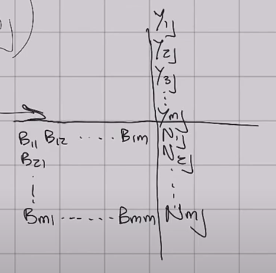
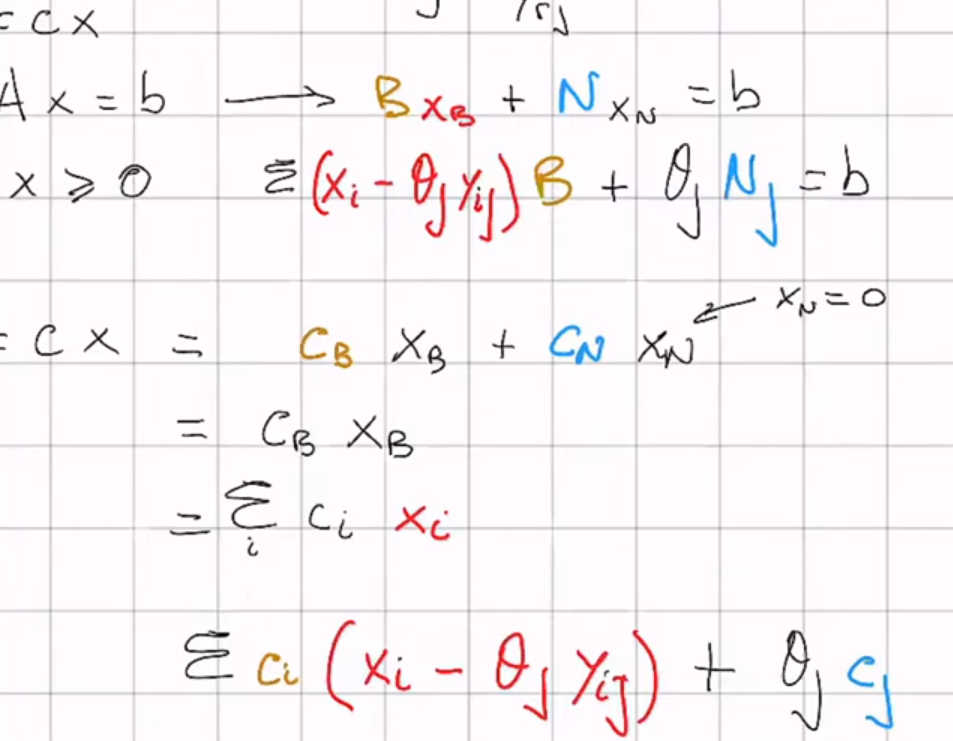
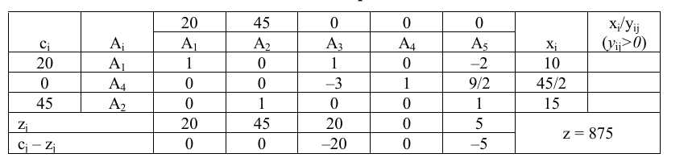
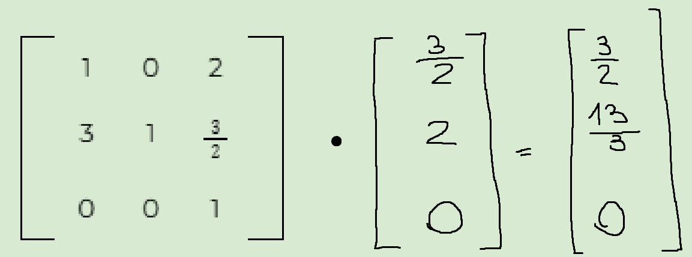
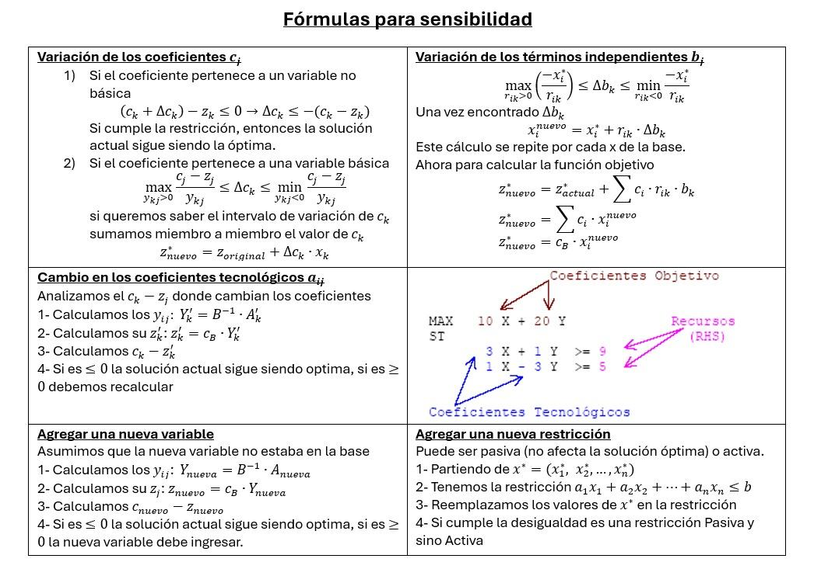
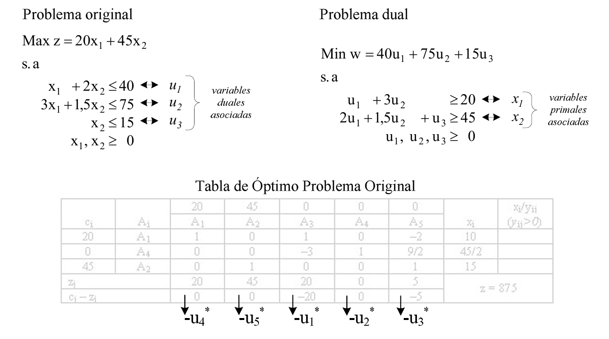
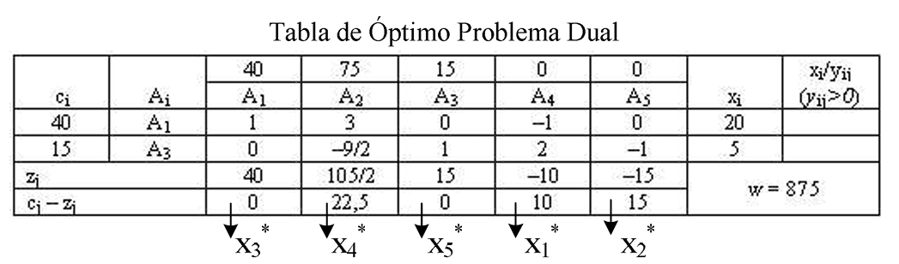

# Investigación Operativa — Wiki

## Índice

1. Unidad 1 — Introducción a la Programación Lineal, modelización y método gráfico
2. Unidad 2 — Conceptos básicos: convexidad, soluciones básicas factibles y teoremas
3. Unidad 3 — Método Simplex
4. Unidad 4 — Análisis de sensibilidad
5. Unidad 5 — Dualidad
6. Unidad 6 — Resolución por software: LINDO y Solver _(sin desarrollar)_
7. Unidad 7 — Modelos especiales: transporte, transbordo y asignación _(sin desarrollar)_
8. Unidad 8 — Programación lineal entera y mixta _(sin desarrollar)_
9. Unidad 9 — Modelos de redes _(sin desarrollar)_
10. Unidad 10 — Administración de proyectos: CPM y PERT _(sin desarrollar)_
11. Unidad 11 — Gestión de stocks _(sin desarrollar)_
12. Unidad 12 — Programación no lineal _(sin desarrollar)_

> **Primer parcial:** entra de la Unidad 1 a la 5 inclusive (según el alcance del
> resumen de primer parcial, que cierra en Dualidad).

---

## Desarrollo

### Unidad 1 — Introducción a la Programación Lineal, modelización y método gráfico

#### Conceptos clave

- **Investigación Operativa:** dado un conjunto de decisiones posibles, elegir la mejor. Dicho de otra forma: asignar recursos escasos a actividades de forma eficaz.
- **Modelo:** representación simplificada de la realidad. El equilibrio es el punto: si simplificás de más perdés información, si copiás la realidad con total fidelidad sumás complejidad inútil.
- **Programa lineal:** una función objetivo a optimizar más un conjunto de restricciones que la condicionan, siendo **todas** funciones lineales.
- **Variables de decisión ($x_j$):** las actividades o acciones sobre las que se decide. También llamadas variables concretas o actividades del sistema.
- **Función objetivo (o económica, o funcional):** la función lineal a maximizar o minimizar. Solo se puede optimizar **un** parámetro.
- **Restricciones:** ecuaciones o inecuaciones lineales que limitan los valores de las variables.
- **Condición de no negatividad:** $x_j \geq 0$. Le da significado económico a las variables y es **requisito del método de resolución**, no un detalle.
- **$c_j$:** coeficiente de la variable $j$ en la función económica; cuánto aporta cada unidad de $x_j$ al objetivo.
- **$b_i$:** término independiente de la restricción $i$; cantidad disponible del recurso, o cantidad total del requerimiento exigido.
- **$a_{ij}$ (coeficiente tecnológico):** cuánto del recurso $i$ consume cada unidad de la actividad $j$.
- **Región factible:** conjunto de puntos que satisfacen todas las restricciones y la no negatividad. Es un **conjunto convexo**.
- **Recta de nivel (o de isobeneficio):** lugar geométrico de los puntos con el mismo valor de $z$. Al variar $z_0$ se obtiene una familia de rectas paralelas.
- **Restricción activa (u obligatoria):** al reemplazar el óptimo, su lado izquierdo **iguala** al término independiente. Su holgura o exceso es nula. Geométricamente, pasa por el punto de óptimo.
- **Restricción pasiva (o no obligatoria):** su holgura o exceso es positiva. Puede ser **necesaria** (si la sacás cambia la región factible) o **redundante** (si la sacás no cambia nada).
- **Forma canónica:** máximo con todas las restricciones $\leq$, o mínimo con todas $\geq$; variables no negativas.
- **Forma estándar:** todas las restricciones son **ecuaciones**, con $b_i \geq 0$ y variables no negativas.

#### Desarrollo

##### Los tres parámetros típicos

$$\text{Ingresos} - \text{Egresos} = \text{Beneficios}$$
$$\text{Ventas} - \text{Costos} = \text{Contribución Marginal}$$

Se trabaja en **unidades monetarias (u.m.)**. Maximizás si hablás de ganancias, minimizás si hablás de costos.

##### Pasos para modelizar

1. Definir las **variables de decisión** con precisión: qué mide cada una y en qué unidad y período. "$x_1$: cantidad de piezas A a producir por semana", no "$x_1$: piezas A".
2. Escribir la **función objetivo**.
3. Escribir `s.a.` y abrir una llave con **todas** las restricciones.
4. No olvidar la **condición de no negatividad**.

##### Modelo general

$$\text{Max (o Min) } z = c_1x_1 + c_2x_2 + \dots + c_nx_n$$

sujeto a

$$
\begin{aligned}
a_{11}x_1 + a_{12}x_2 + \dots + a_{1n}x_n &\ (\leq;=;\geq)\ b_1\\
a_{21}x_1 + a_{22}x_2 + \dots + a_{2n}x_n &\ (\leq;=;\geq)\ b_2\\
&\ \ \vdots\\
a_{m1}x_1 + a_{m2}x_2 + \dots + a_{mn}x_n &\ (\leq;=;\geq)\ b_m\\
x_j &\geq 0,\quad j = 1, 2, \dots, n
\end{aligned}
$$

En forma matricial: $\text{Max } z = cx$ s.a. $Ax \leq b$, $x \geq 0$, donde $c$ es vector fila de $n$ elementos, $x$ vector columna de $n$, $b$ vector columna de $m$, y $A$ la matriz $m \times n$ de coeficientes tecnológicos. $A_j$ denota la $j$-ésima columna de $A$.

Los parámetros $c_j$, $b_i$ y $a_{ij}$ pueden asumir **cualquier valor real**; sobre ellos no se formula ninguna hipótesis.

##### Método gráfico

Sirve solo con **dos variables** (con tres es posible pero poco recomendable; con más de tres, impracticable).

1. Dibujar el plano y asociar un eje a cada variable.
2. Representar cada restricción como recta. Dos formas de despejarla:
   - **Ecuación segmentaria:** $\frac{x_1}{p} + \frac{x_2}{q} = 1$, donde $p$ y $q$ son directamente las intersecciones con los ejes.
   - Hacer $x_1 = 0$ y despejar $x_2$; después $x_2 = 0$ y despejar $x_1$.
3. Determinar el semiplano de cada restricción: reemplazar un punto cualquiera, típicamente $(0;0)$, y ver si cumple. Si cumple, el semiplano es el que contiene al origen.
4. Identificar la **región factible** como intersección de todos los semiplanos, limitada al primer cuadrante por la no negatividad.
5. Determinar la dirección de las líneas de nivel y su sentido de crecimiento. Toda recta $c_1x_1 + c_2x_2 = z$ tiene asociado un **vector normal $n$ de componentes $(c_1; c_2)$**, que marca la dirección de crecimiento de $z$.
6. Desplazar la recta de nivel hasta el último punto de la región factible en el sentido de crecimiento (max) o decrecimiento (min).
7. Hallar las coordenadas resolviendo el sistema de las dos restricciones que se cruzan en ese vértice.

Este procedimiento se llama **método de las rectas de nivel**. La alternativa es el **método de los vértices**: obtener las coordenadas de todos los vértices y evaluar $z$ en cada uno. Funciona porque si el problema tiene solución, el óptimo se alcanza en **al menos un punto extremo**.

##### Tipos de solución

Los programas lineales se clasifican primero en **factibles** (conjunto de soluciones admisibles no vacío) o **no factibles**. La solución óptima de un problema factible puede ser **única**, **múltiple** o **no acotada**.

| Caso | Cómo se reconoce gráficamente | Comentario |
|---|---|---|
| **Solución única** | La recta de nivel toca la región factible en un solo vértice | El caso normal |
| **Soluciones múltiples / alternativas** | La recta de nivel es **paralela a una restricción activa** | El óptimo se da en dos vértices y en todo el segmento que los une |
| **No acotada** | La región factible es abierta en la dirección de crecimiento de $z$ | Generalmente indica un **error de formulación** |
| **No factible / incompatible** | No hay región factible: las restricciones se contradicen | El sistema de restricciones es incompatible |

> **Ojo con la distinción que más se toma:** una **región factible no acotada** no implica **solución no acotada**. Podés tener una región abierta y aun así óptimo finito (pasa cuando minimizás sobre una región abierta hacia arriba).

En el caso de **soluciones múltiples**, todo punto del segmento entre los dos vértices óptimos es también óptimo. Los dos vértices son soluciones **básicas** factibles; los puntos intermedios del segmento son óptimos pero **no básicos**, y se expresan por su ecuación paramétrica:

$$P = \alpha P_1 + (1-\alpha)P_2, \qquad 0 \leq \alpha \leq 1$$

##### Formas canónica y estándar

**Forma canónica** — útil para dualidad e interpretación:

- Función de **maximización**, todas las restricciones $\leq$, variables $\geq 0$; **o bien**
- Función de **minimización**, todas las restricciones $\geq$, variables $\geq 0$.

**Forma estándar** — la que necesita el Simplex:

- Función de maximización **o** minimización.
- Todas las restricciones son **ecuaciones**.
- Todo $b_i \geq 0$.
- Todas las variables $\geq 0$.

##### Transformaciones para pasar de una forma a otra

| Situación | Qué hacer |
|---|---|
| Restricción $\leq$ → ecuación | **Sumar** una variable de **holgura**: $3x_1 + 2x_2 + x_3 = 600$ |
| Restricción $\geq$ → ecuación | **Restar** una variable de **exceso**: $x_1 + x_2 - x_7 = 150$ |
| $b_i$ negativo | Multiplicar toda la restricción por $-1$ |
| Invertir el sentido de una desigualdad | Multiplicar ambos lados por $-1$ |
| Igualdad → dos desigualdades | $ax = b$ equivale a $ax \leq b$ **y** $ax \geq b$ |
| Variable irrestricta en signo $x_5$ | Reemplazar por $x_5 = x_{51} - x_{52}$, con $x_{51}, x_{52} \geq 0$ |
| Variable no positiva $x_7 \leq 0$ | Reemplazar por $x_7' = -x_7$, con $x_7' \geq 0$ |
| Cambiar el objetivo | Min $w$ equivale a Max $z = -w$. Cambia el signo del funcional, **no** el valor óptimo de las variables |

**Las variables de holgura y exceso entran en la función objetivo con coeficiente cero** y son no negativas, igual que las de decisión.

##### Qué significan económicamente las holguras y excesos

El apunte lo explica con una imagen muy útil: la variable de holgura $x_3$ puede leerse como **la cantidad a fabricar de una pieza ficticia que consume solo una unidad del recurso $i$ y no aporta nada al beneficio**. Por eso su $c_j$ es cero.

En la práctica:

- **Holgura** = cantidad **sobrante** (no utilizada) del recurso, al ejecutar la solución óptima.
- **Exceso** = cantidad en la que el lado izquierdo **supera** al mínimo exigido.

En el Ejemplo 1-1 del apunte (alfarería: 10 vasijas, 15 cántaros, $z = 875$): $x_3^* = 0$ significa que la mano de obra se usa a pleno; $x_4^* = 22{,}5$ significa que sobran 22,5 kg de arcilla; $x_5^* = 0$ significa que se produce exactamente la demanda máxima de cántaros.

##### Clasificación de restricciones

- **Activa (obligatoria):** pasa por el óptimo; holgura/exceso nula.
- **Pasiva (no obligatoria):** holgura/exceso positiva. Se subdivide en:
  - **Necesaria:** al suprimirla cambia la región factible.
  - **Redundante:** al suprimirla la región factible no cambia.
    - **Redundante geométricamente:** no toca la región factible.
    - **Redundante analíticamente:** toca la región factible en un vértice, y puede expresarse como **combinación lineal** de las otras restricciones que pasan por ese vértice.

Las redundantes podrían eliminarse, pero en general se conservan: son difíciles de detectar, y una restricción redundante en un período puede dejar de serlo en otro si cambian los parámetros. El único costo es aumentar la dimensión del problema.

##### Solución redondeada

El modelo lineal supone variables **continuas**. Se admite redondear cuando el redondeo no tiene importancia práctica: da igual 14.145 que 14.145,39, más aún sabiendo que la mayoría de los parámetros son estimaciones.

El redondeo es aceptable **cuanto más grandes son los valores** de las variables en el óptimo. Con valores chicos, redondear puede dar una solución **no factible** o muy alejada del óptimo. Para esos casos existe la Programación Entera (Unidad 8).

#### Ejercicios resueltos tipo

##### Tipo A — Modelización + método gráfico (Práctica 1, Ejercicio 1)

Taller que fabrica piezas A y B, con tres procesos:

| | Estampado | Soldado | Pintado |
|---|---|---|---|
| A | 4 | 2 | 8 |
| B | 4 | 4 | 4 |
| Disponible | 320 | 240 | 560 |

Contribución marginal: 2 u.m. por A, 3 u.m. por B.

**Variables:** $x_1$ = unidades de pieza A por semana; $x_2$ = unidades de pieza B por semana.

$$\text{Max } z = 2x_1 + 3x_2$$
$$
\begin{aligned}
4x_1 + 4x_2 &\leq 320 \quad \text{(estampado)}\\
2x_1 + 4x_2 &\leq 240 \quad \text{(soldado)}\\
8x_1 + 4x_2 &\leq 560 \quad \text{(pintado)}\\
x_1, x_2 &\geq 0
\end{aligned}
$$

Evaluando los vértices de la región factible:

| Vértice | Origen | $z$ |
|---|---|---|
| $(0;60)$ | soldado ∩ eje $x_2$ | 180 |
| $(40;40)$ | estampado ∩ soldado | **200** |
| $(60;20)$ | estampado ∩ pintado | 180 |
| $(70;0)$ | pintado ∩ eje $x_1$ | 140 |

**Óptimo:** $x_1^* = 40$, $x_2^* = 40$, $z^* = 200$. Estampado y soldado quedan **activas**; pintado queda **pasiva** con holgura $560 - 480 = 80$.

##### Tipo B — El mismo problema con otro $c_j$ (Práctica 1, Ejercicio 3)

Mismas restricciones, pero $\text{Max } z = 2x_1 + 4x_2$.

Ahora $(40;40)$ y $(0;60)$ dan **ambos** $z = 240$. La recta de nivel quedó **paralela a la restricción de soldado**. Hay **soluciones alternativas**: todo el segmento entre esos dos vértices es óptimo.

Las dos soluciones básicas completas (en forma estándar, con $x_3, x_4, x_5$ holguras de estampado, soldado y pintado):

| | $x_1$ | $x_2$ | $x_3$ | $x_4$ | $x_5$ | $z$ | |
|---|---|---|---|---|---|---|---|
| $P_1$ | 40 | 40 | 0 | 0 | 80 | 240 | Básica |
| $P_2$ | 0 | 60 | 80 | 0 | 320 | 240 | Básica |
| $\alpha = 0{,}5$ | 20 | 50 | 40 | 0 | 200 | 240 | **No** básica |

Cualquier punto intermedio se obtiene con $P = \alpha P_1 + (1-\alpha)P_2$ y sigue valiendo $z = 240$, pero **no es solución básica**.

##### Tipo C — Sistema incompatible (Práctica 1, Ejercicio 4)

Cajas reductoras Z1 y Z2. Recursos: 1.700 kg de hierro, 100 hs de montaje, 70 hs de maquinado, 90 hs de embalaje. Deben producirse **al menos 300 unidades** semanales.

Primero **unificar unidades**: los insumos vienen en minutos y los recursos en horas.

$$
\begin{aligned}
10x_1 + 10x_2 &\leq 1700 &&\text{(hierro, kg)}\\
40x_1 + 50x_2 &\leq 6000 &&\text{(montaje, 100 hs = 6000 min)}\\
20x_1 + 30x_2 &\leq 4200 &&\text{(maquinado, 70 hs = 4200 min)}\\
30x_1 + 40x_2 &\leq 5400 &&\text{(embalaje, 90 hs = 5400 min)}\\
x_1 + x_2 &\geq 300 &&\text{(mínimo de producción)}
\end{aligned}
$$

**El sistema es incompatible.** La forma rápida de demostrarlo sin graficar: de $x_1 + x_2 \geq 300$ y como todos los coeficientes de montaje son $\geq 40$, resulta $40x_1 + 50x_2 \geq 40(x_1+x_2) \geq 12000 > 6000$. Ningún punto satisface las dos a la vez, así que el polígono de soluciones no queda definido.

#### Dudas / pendientes

- Los signos de desigualdad de los **ejercicios 6, 7 y 8** de la Práctica 1 se perdieron en la conversión del PDF. El **8** está confirmado: es el **Ejemplo 1-17 del apunte** (Max $105x_1 + 78x_2$) y es **no factible**. Los del 6 y el 7 hay que verificarlos contra el PDF original antes de resolverlos.
- La **resolución oficial** `PL1UTNresol.pdf` corresponde a una **versión anterior** de la guía: solo coinciden los ejercicios 1 a 4. Del 5 al 8 resuelve otros enunciados (torta de lino, bodegas de carga). No hay respuesta oficial para los ejercicios 5 a 8 de la guía vigente.
- En la resolución oficial del ejercicio 2 figura $4x_1 + 1x_2 \leq 600$; por el enunciado debe ser $4x_1 + 2x_2 \leq 600$ (con ese coeficiente el resultado oficial $x^* = (120;60)$, $z^* = 960$ cierra; con el otro, no). Error de transcripción en la resolución.
- Las figuras de la sección 1.4 del apunte (ejemplos de aplicación) no se ingirieron todavía.

#### Fuentes

- `Material de cursado (2023)/Teoría/PLC1.pdf` — capítulo 1 completo del apunte de cátedra
- `Material de cursado (2023)/Práctica/PL1UTN.pdf`
- `Material de cursado (2023)/Práctica/PL2UTN.pdf`
- `Material de cursado (2023)/Práctica/Resuelta/PL1UTNresol.pdf`
- `resumen-primer-parcial.docx`

---

### Unidad 2 — Conceptos básicos: convexidad, soluciones básicas factibles y teoremas

#### Conceptos clave

- **Hiperplano:** $H = \{x : c^Tx = z\}$. Generaliza la recta en $\mathbb{R}^2$ y el plano en $\mathbb{R}^3$. El vector $c$ es su **normal**.
- **Semiespacio:** un hiperplano divide el espacio en semiespacio inferior ($c^Tx < z$), el propio hiperplano, y superior ($c^Tx > z$). Con desigualdad estricta son **abiertos**; unidos al hiperplano son **cerrados**.
- **Polítopo:** intersección de un número **finito** de semiespacios cerrados. Si además está acotado, se llama **poliedro**.
- **Combinación lineal convexa:** $x = \sum \lambda_i x_i$ con $\lambda_i \geq 0$ y $\sum \lambda_i = 1$.
- **Conjunto convexo:** dados dos puntos cualesquiera del conjunto, el segmento que los une está **totalmente contenido** en él.
- **Punto extremo (vértice):** punto que **no** puede expresarse como combinación lineal convexa de otros dos puntos del conjunto.
- **Solución:** toda $n$-upla que satisface $Ax = b$.
- **Solución factible:** solución que además cumple $x \geq 0$.
- **Solución básica:** solución con a lo sumo $m$ componentes distintas de cero (o sea, al menos $n-m$ nulas).
- **Solución básica factible (SBF):** solución básica con todas sus variables básicas **no negativas**.
- **SBF no degenerada:** tiene **exactamente** $m$ componentes estrictamente positivas. Si tiene menos, es **degenerada**.
- **Hipótesis de rango completo:** $A$ es de orden $m \times n$ con $m < n$ y rango máximo $m$. Equivale a que las $m$ ecuaciones sean linealmente independientes.
- **Región de factibilidad:** conjunto de todas las soluciones factibles.

#### Desarrollo

##### Por qué importa la convexidad

Toda la teoría descansa en un hecho geométrico: **la región factible de un programa lineal es siempre un conjunto convexo cerrado**. Como cada restricción es la intersección de dos semiespacios cerrados, y la no negatividad también lo es, la región factible es la intersección de un número finito de semiespacios cerrados — es decir, un polítopo, que es convexo por construcción.

Propiedades que se usan sin decirlo:

- La intersección (finita o infinita) de convexos es convexa. **La unión, en general, no.**
- El conjunto vacío es convexo. Un conjunto de un solo punto también.
- Los hiperplanos y los semiespacios (abiertos o cerrados) son convexos.

La región factible puede ser: **vacía** (programa no factible), **un único punto** (solución trivial), o **un conjunto con infinitos puntos** (el caso que interesa).

##### Partición en base y no base

Si $m < n$ y se cumple la hipótesis de rango completo, $Ax = b$ tiene **infinitas** soluciones. Se extraen $m$ columnas de $A$ linealmente independientes formando una submatriz cuadrada $B$ (la **base**). Entonces:

$$Bx_B + Nx_N = b$$

- $B$: base de vectores de $A$ (cuadrada, inversible).
- $x_B$: vector de **variables básicas**.
- $N$: matriz de la "no base", con los $n-m$ vectores restantes.
- $x_N$: vector de **variables no básicas**.

Haciendo $x_N = 0$ queda $Bx_B = b$, sistema compatible determinado con solución

$$x_B = B^{-1}b$$

Esa es la **solución básica**: las $m$ componentes de $x_B$ más $n-m$ ceros.

##### Los cuatro teoremas

**Teorema 1.** El conjunto de todas las soluciones factibles de un programa lineal es un **conjunto convexo cerrado**.

**Teorema 2 — Teorema fundamental de la PL.** Dado un PL en forma estándar que verifica la hipótesis de rango completo:

1. Si hay una solución factible, también hay una **solución básica factible**.
2. Si hay una solución factible **óptima**, también hay una **solución básica factible óptima**.

**Teorema 3 — Teorema de equivalencia.** Sea $K$ el conjunto convexo de soluciones factibles (polítopo). Un punto $x$ es **punto extremo** de $K$ **si y solo si** es una **solución básica factible**.

> Este es el teorema bisagra de toda la materia: conecta lo **geométrico** (vértice) con lo **algebraico** (SBF). Es lo que permite que el Simplex, que solo hace álgebra, esté en realidad recorriendo vértices.

**Teorema 4.** La función objetivo alcanza su óptimo en **al menos un punto extremo** del conjunto de soluciones factibles. Si el óptimo se produce en **más de un** punto extremo, entonces también se produce en **todo punto que sea combinación convexa de ellos**.

La consecuencia práctica: **la solución óptima está entre los puntos extremos, nunca en el interior** del conjunto convexo.

##### Consecuencias inmediatas

- Si el conjunto de soluciones factibles es no vacío, tiene **al menos un** punto extremo.
- Cada SBF corresponde a un punto extremo, **y viceversa**.
- El conjunto de soluciones factibles tiene un número **finito** de puntos extremos.
- El número **máximo** de puntos extremos con $n$ variables y $m$ restricciones es:

$$C_{n,m} = \binom{n}{m} = \frac{n!}{(n-m)!\,m!}$$

- Si hay solución óptima finita, se produce en al menos un punto extremo.

##### Solución conceptual

Es el método "de fuerza bruta" que se deduce de los teoremas: calcular $z$ en cada punto extremo y quedarse con el mejor.

1. Expresar el programa lineal en su **forma estándar**.
2. De la matriz $A$, seleccionar una **base**: $m$ vectores columna linealmente independientes (verificar con $\det \neq 0$).
3. Resolver por **Cramer** el sistema que resulta de anular las $n-m$ incógnitas que no acompañan a la base.
4. Si **todas** las incógnitas resultantes son no negativas, esa solución (más los $n-m$ ceros) es un **punto extremo**.
5. Repetir hasta agotar las $C_{n,m}$ combinaciones.

**Ejemplo (alfarería, Ejemplo 2-4 del apunte).** Con $n = 5$ y $m = 3$ hay $C_{5,3} = 10$ combinaciones:

| Base | $x_1$ | $x_2$ | $x_3$ | $x_4$ | $x_5$ | Observación | $z$ |
|---|---|---|---|---|---|---|---|
| $A_1A_2A_3$ | 17,5 | 15 | −7,5 | 0 | 0 | No factible | — |
| $A_1A_2A_4$ | 10 | 15 | 0 | 22,5 | 0 | **Factible óptima** | **875** |
| $A_1A_2A_5$ | 20 | 10 | 0 | 0 | 5 | Factible | 850 |
| $A_1A_3A_4$ | — | — | — | — | — | No son base | — |
| $A_1A_3A_5$ | 25 | 0 | 15 | 0 | 15 | Factible | 500 |
| $A_1A_4A_5$ | 40 | 0 | 0 | −45 | 15 | No factible | — |
| $A_2A_3A_4$ | 0 | 15 | 10 | 52,5 | 0 | Factible | 675 |
| $A_2A_3A_5$ | 0 | 50 | −60 | 0 | −35 | No factible | — |
| $A_2A_4A_5$ | 0 | 20 | 0 | 45 | −5 | No factible | — |
| $A_3A_4A_5$ | 0 | 0 | 40 | 75 | 15 | Factible (trivial) | 0 |

Observá dos cosas: la base $A_3A_4A_5$ (todas holguras) da la **SBF trivial** de forma inmediata — es el punto de partida natural del Simplex; y de las 10 combinaciones, una **no es base** y cuatro dan soluciones **no factibles**.

##### Por qué hace falta el Simplex

Conceptualmente el problema está resuelto. El problema es la escala: una aplicación chica con **20 variables y 10 restricciones** tiene

$$C_{20,10} = 184.756$$

puntos extremos. Resolver 184.756 sistemas de ecuaciones es inadmisible incluso con computadoras modernas. Por eso Dantzig desarrolla en 1947 el **Simplex**, que llega al óptimo **sin** evaluar todos los puntos extremos.

#### Ejercicios resueltos tipo

Este capítulo es fundamentalmente teórico y su práctica está integrada en la Práctica 1 (formas canónica y estándar) y en la Práctica 3 (Simplex). El ejercicio tipo es el de la tabla de arriba: llevar a forma estándar, enumerar bases, descartar las no factibles y quedarse con el mejor $z$.

#### Dudas / pendientes

- Las secciones 2.2 (vectores), 2.3 (matrices) y 2.4 (sistemas de ecuaciones lineales) del apunte son repaso de álgebra lineal y no están resumidas acá. Si en el parcial entra determinante, rango o Cramer explícitamente, hay que desarrollarlas.
- Las demostraciones formales de los teoremas 2, 3 y 4 están en el apunte (PLC2, pp. 37-40). Acá figuran solo los enunciados y las consecuencias. Verificar con la cátedra si en el parcial se pide demostrar o solo enunciar.
- La Figura 2-1 del apunte ("Elementos fundamentales de la teoría de PL") se perdió en la conversión y sería el mejor mapa conceptual de la unidad.

#### Fuentes

- `Material de cursado (2023)/Teoría/PLC2.pdf` — capítulo 2 completo del apunte
- `resumen-primer-parcial.docx`

---

### Unidad 3 — Método Simplex

#### Conceptos clave

- **Método Simplex:** procedimiento **iterativo** que parte de un punto extremo y se mueve sucesivamente hacia otros puntos extremos, mejorando en cada paso el valor de la función objetivo (o en el peor caso manteniéndolo), hasta llegar al óptimo o concluir que la solución no está acotada.
- **Condición de factibilidad:** garantiza que partiendo de una SBF, solo se generen sucesivas SBF. Es la que decide **qué variable sale**.
- **Condición de optimización:** permite reconocer cuándo se llegó al óptimo y asegura que cada nueva solución no empeore $z$. Es la que decide **qué variable entra**.
- **Hipótesis de no degeneración:** se supone que todas las SBF son no degeneradas.
- **$Y_j$ (coeficientes de sustitución):** vector de escalares tal que $A_j = B\,Y_j$, es decir $Y_j = B^{-1}A_j$. Dice cuánto de cada variable básica hay que sacrificar por cada unidad de $x_j$ que entre.
- **$z_j$:** $z_j = \sum_i c_i\,y_{ij} = c_B\,Y_j$.
- **$c_j - z_j$ (costo reducido):** criterio de entrada. En **maximización**, el óptimo se alcanza cuando **todos** los $c_j - z_j \leq 0$.
- **$\theta_j$ (razón mínima):** criterio de salida.

> **Convención de la cátedra:** se trabaja con la fila $c_j - z_j$, y en **maximización** el óptimo es cuando todos son $\leq 0$. Si en algún material ves $z_j - c_j \geq 0$, es la misma condición con el signo invertido.

#### Desarrollo

##### El punto de partida algebraico

Partimos de la forma estándar $\text{Max } z = cx$ s.a. $Ax = b$, $x \geq 0$, y de la partición en base y no base:

$$A\,x = b \quad\Longrightarrow\quad B\,x_B + N\,x_N = b$$

##### Los coeficientes de sustitución $Y_j$

Cada columna $A_j$ de la no base puede generarse como combinación lineal de los vectores de la base:

$$A_j = y_{1j}B_1 + y_{2j}B_2 + \dots + y_{mj}B_m$$

o en forma compacta:

$$A_j = B\,Y_j \qquad\text{con}\qquad Y_j = (y_{1j}, y_{2j}, \dots, y_{mj})^T$$

Despejando, y esto es lo que se usa todo el tiempo:

$$B^{-1}A_j = B^{-1}B\,Y_j = I\,Y_j \quad\Longrightarrow\quad \boxed{Y_j = B^{-1}A_j}$$

> **Nota de notación:** el subíndice $j$ siempre refiere a la **no base**; el subíndice $i$ siempre refiere a la **base**.

##### Cómo se pasa de una SBF a otra

Con $x_N = 0$ resulta $Bx_B = b$. Introduciendo la variable $x_j$ con un valor $\theta_j \geq 0$ y restando lo correspondiente, se llega a:

$$(x_1 - \theta_j y_{1j})B_1 + (x_2 - \theta_j y_{2j})B_2 + \dots + (x_m - \theta_j y_{mj})B_m + \theta_j A_j = b$$

Es decir: por cada unidad de $x_j$ que entra, cada variable básica $x_i$ se reduce en $y_{ij}$.

##### Condición de factibilidad — quién sale

Para que la nueva solución siga siendo factible, ninguna variable básica puede volverse negativa. El límite lo pone:

$$\theta_j = \min_i \left\{ \frac{x_i}{y_{ij}} \;:\; y_{ij} > 0,\ i = 1,\dots,m \right\}$$

Si el mínimo se alcanza en el índice $r$, entonces $\theta_j = \dfrac{x_r}{y_{rj}}$ y la variable **$x_r$ sale de la base**, porque su nuevo valor es

$$x_r - \frac{x_r}{y_{rj}}\,y_{rj} = 0$$

**Solo se consideran los $y_{ij} > 0$.** Si todos los $y_{ij} \leq 0$, la variable puede crecer indefinidamente sin violar ninguna restricción: **solución no acotada**.

##### Condición de optimización — quién entra

Separando la función objetivo en básicas y no básicas:

$$z = c\,x = c_B\,x_B + c_N\,x_N$$

Con $x_N = 0$: $z_0 = c_B x_B = \sum_i c_i x_i$. Aplicando la condición de factibilidad y reagrupando:

$$z = \sum_i c_i x_i + \theta_j\left(c_j - \sum_i c_i\,y_{ij}\right) = z_0 + \theta_j\,(c_j - z_j)$$

donde $z_j = \sum_i c_i\,y_{ij}$. Entonces, en **maximización**:

$$
\begin{aligned}
(c_j - z_j) > 0 &\ \Longrightarrow\ z > z_0 \quad \text{mejora, conviene que entre}\\
(c_j - z_j) \leq 0 &\ \Longrightarrow\ z \leq z_0 \quad \text{no mejora}
\end{aligned}
$$

**Óptimo alcanzado cuando todos los $c_j - z_j \leq 0$.**

##### El algoritmo, forma matricial

1. Llevar a **forma estándar**: $\text{Max } z = cx$, s.a. $Ax = b$, $x \geq 0$.
2. Identificar $B$, $N$, $x_B$, $x_N = 0$, $c_B$, $c_N$. (La base inicial natural es la de las holguras.)
3. Calcular $Y = B^{-1}N$, es decir $Y_j = B^{-1}A_j$ para cada $j$ no básica.
4. Calcular $z_j = \sum_i c_i y_{ij} = c_B\,Y$ para todo $j$.
5. Evaluar $c_j - z_j$ para todo $j \in N$:
   - Si **todos** son $\leq 0$ → **óptimo**, terminar.
   - Si existe algún $c_j - z_j > 0$ → **entra** el de mayor valor.
6. Calcular $\theta_j = \min\left\{\dfrac{x_i}{y_{ij}} : y_{ij} > 0,\ i \in B\right\}$. El que da el mínimo (índice $r$) **sale**.
7. Nueva solución:
   $$x_i' = x_i - \theta_j\,y_{ij}, \qquad x_r' = 0, \qquad x_j' = \theta_j = \frac{x_r}{y_{rj}}$$
   Nuevo valor: $z = c_B x_B$.
8. Volver al paso 3.

##### Cómo leer la tabla

La tabla del ejemplo de la alfarería en el óptimo:

| $c_i$ | $A_i$ | $A_1$ (20) | $A_2$ (45) | $A_3$ (0) | $A_4$ (0) | $A_5$ (0) | $x_i$ |
|---|---|---|---|---|---|---|---|
| 20 | $A_1$ | 1 | 0 | 1 | 0 | −2 | 10 |
| 0 | $A_4$ | 0 | 0 | −3 | 1 | 9/2 | 45/2 |
| 45 | $A_2$ | 0 | 1 | 0 | 0 | 1 | 15 |
| | $z_j$ | 20 | 45 | 20 | 0 | 5 | **z = 875** |
| | $c_j - z_j$ | 0 | 0 | −20 | 0 | −5 | |

Tres lecturas que hay que tener automatizadas:

1. **$z_j$ bajo una columna básica da su propio $c_j$.** Chequeo de 5 segundos: $z_1 = 20 = c_1$ ✓, $z_2 = 45 = c_2$ ✓, $z_4 = 0 = c_4$ ✓.
2. **$c_j - z_j$ de las variables básicas es siempre 0.**
3. **La $B^{-1}$ está debajo de las columnas de las variables que formaban la base inicial** (las holguras). Acá: $B^{-1} = \begin{pmatrix} 1 & 0 & -2 \\ -3 & 1 & 9/2 \\ 0 & 0 & 1\end{pmatrix}$, leyendo las columnas $A_3$, $A_4$, $A_5$.

> Si el problema tiene restricciones $\geq$, la base inicial usa variables **artificiales**. **No borres la columna de la artificial** aunque salga de la base: es la única forma de leer esa columna de $B^{-1}$.

#### Ejercicios resueltos tipo

La Práctica 3 (`PL3UTN.pdf`) es la de Simplex: pide resolver aplicando el algoritmo **matricial** y el algoritmo de **tablas** sobre el mismo problema, para ver que son lo mismo. Ejercicio 1: Max $z = 2x_1 + 3x_2$ s.a. $4x_1+4x_2 \leq 320$, $2x_1+4x_2 \leq 240$, $8x_1+4x_2 \leq 560$ — el mismo del Ejercicio 1 de la Práctica 1, para contrastar el resultado gráfico ($x^* = (40;40)$, $z^* = 200$) con el del Simplex.

#### Dudas / pendientes

- **El resumen no cubre las variables artificiales.** No aparecen ni el método de la **M grande** ni el de las **dos fases**, y son imprescindibles apenas hay una restricción $\geq$ o $=$. Está en el apunte (PLC3) — falta ingerirlo.
- Tampoco cubre los **casos especiales durante la iteración**: empate en la entrada, empate en la salida (degeneración), ciclado, cómo se detecta la infactibilidad con una artificial en base con valor positivo, ni cómo se reconocen los **óptimos alternativos** en la tabla ($c_j - z_j = 0$ en una columna no básica).
- Falta el **Simplex para minimización** (si se invierte el criterio o si se convierte a máximo).
- El desarrollo del resumen para la condición de factibilidad tiene el paso algebraico intermedio con notación confusa (mezcla $N_j$ y $A_j$). Está reescrito acá con $A_j$, que es la notación del apunte.

#### Fuentes

- `Material de cursado (2023)/Teoría/PLC3.pdf` — **pendiente de ingerir**
- `Material de cursado (2023)/Teoría/Método Simplex.pdf` — **pendiente de ingerir**
- `Material de cursado (2023)/Práctica/PL3UTN.pdf`
- `resumen-primer-parcial.docx`

---

### Unidad 4 — Análisis de sensibilidad

#### Conceptos clave

- **Análisis de sensibilidad (postoptimización):** estudiar cómo afectan al óptimo los cambios en los parámetros, **sin volver a resolver** el problema desde cero.
- **Hipótesis fundamental:** los coeficientes varían **solo uno a la vez**, manteniendo todos los demás como en la formulación original.
- **Los cinco casos:** cambios en $c_j$, cambios en $b_i$, cambios en los coeficientes tecnológicos $a_{ij}$, agregado de una nueva variable, agregado de una nueva restricción.
- **$r_{ik}$:** elemento $(i,k)$ de $B^{-1}$, que se lee en la tabla óptima debajo de la columna de la holgura de la restricción $k$.

#### Desarrollo

##### Caso 1 — Cambio en un coeficiente de la función objetivo $c_k$

Sea $\Delta c_k$ la cantidad en que varía $c_k$. Hay que distinguir dos casos.

**Si $x_k$ es NO básica**, el único efecto es sobre su propio $c_k - z_k$. Para que la tabla siga siendo óptima:

$$c_k + \Delta c_k - z_k \leq 0 \quad\Longrightarrow\quad \Delta c_k \leq -(c_k - z_k)$$

El valor de $z$ **no cambia**, porque $x_k = 0$.

**Si $x_k$ es básica**, el cambio afecta a **todos** los $c_j - z_j$ no básicos. El rango es:

$$\max_{y_{kj} > 0} \frac{c_j - z_j}{y_{kj}} \ \leq\ \Delta c_k\ \leq\ \min_{y_{kj} < 0} \frac{c_j - z_j}{y_{kj}}$$

Dentro de ese rango la base permanece óptima y **el punto de óptimo no varía**; lo único que cambia es el valor del funcional:

$$z^* = z_{\text{actual}} + \Delta c_k \cdot x_k$$

**Procedimiento operativo:**

1. Recorrer la **fila** de la variable básica $x_k$ en la tabla óptima y anotar los $y_{kj}$ de las columnas **no básicas**.
2. Agrupar según $y_{kj} > 0$ y $y_{kj} < 0$.
3. Calcular $\dfrac{c_j - z_j}{y_{kj}}$ en cada grupo.
4. Tomar el **máximo** entre los positivos (cota inferior) y el **mínimo** entre los negativos (cota superior).
5. Si no hay $y_{kj} > 0$, la cota inferior es $-\infty$. Si no hay $y_{kj} < 0$, la cota superior es $+\infty$.

**Ejemplo (alfarería, variando $c_1$).** Fila de $A_1$: los $y_{1j}$ no básicos son $y_{13} = 1$ y $y_{15} = -2$; los $c_j - z_j$ son $-20$ y $-5$.

$$y_{kj} > 0 \to \max\left[\tfrac{-20}{1}\right] = -20 \qquad y_{kj} < 0 \to \min\left[\tfrac{-5}{-2}\right] = 2{,}5$$

$$-20 \leq \Delta c_1 \leq 2{,}5 \quad\Longrightarrow\quad 0 \leq c_1 \leq 22{,}5$$

##### Caso 2 — Cambio en un término independiente $b_k$

Geométricamente equivale a **desplazar paralelamente** la restricción hasta que se satisfaga con el nuevo valor.

$$\max_{r_{ik} > 0} \frac{-x_i^*}{r_{ik}} \ \leq\ \Delta b_k\ \leq\ \min_{r_{ik} < 0} \frac{-x_i^*}{r_{ik}}$$

Dentro de ese rango la base se mantiene óptima, y:

- los nuevos valores de las básicas son $x_i^* + r_{ik}\,\Delta b_k$;
- el nuevo funcional es $z = z_{\text{actual}} + \sum_{i \in I_B} c_i\,r_{ik}\,\Delta b_k$.

**Procedimiento operativo:**

1. Anotar los $x_i^*$ actuales.
2. Obtener $B^{-1}$ de la tabla óptima (**está debajo de las columnas de las holguras**).
3. Tomar la **columna $k$ de $B^{-1}$**, la que corresponde a la restricción que se modifica.
4. Calcular $\dfrac{-x_i^*}{r_{ik}}$ fila por fila y agrupar según el signo de $r_{ik}$.
5. Máximo entre los de $r_{ik} > 0$ (cota inferior), mínimo entre los de $r_{ik} < 0$ (cota superior). Si $r_{ik} = 0$, esa fila no restringe.

**Ejemplo (alfarería, variando $b_1$).** $x^* = (10;\ 45/2;\ 15)$ y la primera columna de $B^{-1}$ es $(1;\ -3;\ 0)$:

$$\frac{-10}{1} = -10 \qquad \frac{-45/2}{-3} = \frac{15}{2} \qquad \frac{-15}{0} = \text{no restringe}$$

$$-10 \leq \Delta b_1 \leq \frac{15}{2}$$

##### Caso 3 — Cambio en un coeficiente tecnológico $a_{ij}$

Si el coeficiente pertenece a una variable **básica**, el cambio puede afectar **toda** la tabla, y la solución actual puede volverse inadmisible, no óptima o no básica. Por eso el estudio se limita a los coeficientes de variables **no básicas**.

Para una variable no básica $x_k$ con nuevo vector de coeficientes $A_k'$:

$$Y_k' = B^{-1}A_k' \qquad z_k' = c_B\,Y_k'$$

- Si $c_k - z_k' \leq 0$ → la solución actual **sigue siendo óptima**.
- Si $c_k - z_k' > 0$ → $x_k$ **ingresa a la base** y se continúa iterando normalmente.

##### Caso 4 — Agregado de una nueva variable

La pregunta es si la variable nueva formaría parte de la base o no. Con coeficientes tecnológicos $A_{\text{nueva}}$ y coeficiente económico $c_{\text{nueva}}$:

$$Y_{\text{nueva}} = B^{-1}A_{\text{nueva}} \qquad z_{\text{nueva}} = c_B\,Y_{\text{nueva}}$$

$$c_{\text{nueva}} - z_{\text{nueva}}
\begin{cases}
> 0 & \text{conviene: entra a la base y hay que seguir iterando}\\
= 0 & \text{no mejora, pero existe óptimo alternativo que la incluye}\\
< 0 & \text{no conviene: el óptimo actual no cambia}
\end{cases}
$$

##### Caso 5 — Agregado de una nueva restricción

Una restricción nueva puede afectar la factibilidad del óptimo actual **solo si resulta activa**. El procedimiento es de dos pasos:

1. **Reemplazar** los valores del óptimo actual en la restricción nueva.
2. Decidir:
   - Si la restricción **se satisface** (queda inactiva) → la solución óptima actual **permanece invariable**. No hay nada que hacer.
   - Si **no se satisface** (queda activa) → la solución actual deja de ser óptima; hay que incorporar la restricción al sistema y volver a iterar.

##### Cuadro resumen

#### Ejercicios resueltos tipo

La práctica de esta unidad es `PL4UTN.pdf` (Análisis de sensibilidad – Dualidad – Parametrización), que combina las Unidades 4 y 5.

#### Dudas / pendientes

- **Error en el resumen (Caso 2):** la fórmula del rango de $b_k$ figura con `max` en **los dos** extremos. El extremo superior es un **mínimo**: de $x_i^* + \Delta b_k\,r_{ik} \geq 0$, cuando $r_{ik} < 0$ se despeja $\Delta b_k \leq -x_i^*/r_{ik}$, y hay que tomar el más restrictivo, es decir el **mínimo**. En el ejemplo no se nota porque hay un solo $r_{ik}$ negativo.
- **Error en el resumen (Caso 4):** concluye "$c_{\text{nueva}} - z_{\text{nueva}} = 30 - 30 = 0 \geq 0 \Rightarrow$ entra en la base". Con $c_j - z_j = 0$ la variable **no mejora** el funcional: la solución actual sigue siendo óptima y lo que existe es un **óptimo alternativo**. El criterio de entrada es estrictamente $> 0$.
- **Error en la figura del resumen (Caso 4):** la $B^{-1}$ dibujada a mano aparece como $\begin{pmatrix}1&0&2\\3&1&3/2\\0&0&1\end{pmatrix}$, sin los signos negativos. La correcta, leída de la tabla óptima, es $\begin{pmatrix}1&0&-2\\-3&1&9/2\\0&0&1\end{pmatrix}$, y da $Y_{\text{nueva}} = (3/2;\ -5/2;\ 0)$, no $(3/2;\ 13/3;\ 0)$. El resultado final ($z_{\text{nueva}} = 30$) no se ve afectado **solo porque** el $c_i$ de esa fila es 0.
- Falta la **parametrización** de $c$ y de $b$, que el título de la Práctica 4 menciona explícitamente y el resumen no cubre.
- Falta el **Simplex dual** (cómo recuperar la factibilidad tras un cambio en $b$ que saque una básica fuera de rango).

#### Fuentes

- `Material de cursado (2023)/Teoría/PLC4.pdf` — **pendiente de ingerir**
- `Material de cursado (2023)/Práctica/PL4UTN.pdf`
- `resumen-primer-parcial.docx`

---

### Unidad 5 — Dualidad

#### Conceptos clave

- **Dualidad:** a todo programa lineal (**primal**) le corresponde otro programa lineal (**dual**), y la tabla óptima de cualquiera de los dos **revela la solución óptima del otro**.
- **Costo reducido:** para una variable **no básica**, indica **cuánto hay que mejorar su coeficiente económico** para que tenga oportunidad de integrar una nueva solución óptima.
- **Costo marginal:** también llamado **precio sombra**, **valor implícito** o **precio dual**. Es la **cantidad máxima que estaríamos dispuestos a pagar** por una unidad adicional de un determinado recurso.

#### Desarrollo

##### Costos reducidos vs. costos marginales

Es la distinción que más se confunde:

| | Costo reducido | Costo marginal / precio sombra |
|---|---|---|
| Se asocia a | una **variable** (columna de decisión) | una **restricción** (recurso) |
| Se lee en | $c_j - z_j$ de la columna de $x_j$ | $c_j - z_j$ de la columna de la **holgura** de esa restricción |
| Qué dice | cuánto falta mejorar $c_j$ para que $x_j$ entre | cuánto vale al margen una unidad más del recurso |
| Vale 0 cuando | $x_j$ es **básica** (se produce) | la restricción es **pasiva** (sobra recurso) |

##### Lectura de la solución dual en la tabla óptima del primal

Los valores óptimos de las variables duales están en la fila $c_j - z_j$, bajo las columnas de holgura, **con el signo cambiado según el tipo de problema**:

$$\text{Primal de MAXIMIZACIÓN} \ \longrightarrow\ S_j^* = -(c_j - z_j)$$

$$\text{Primal de MINIMIZACIÓN con restricciones } \geq \ \longrightarrow\ S_j^* = (c_j - z_j)$$

##### Correspondencia primal ↔ dual

La estructura del apareamiento (holguras complementarias):

| Primal | ↔ | Dual |
|---|---|---|
| Holgura/exceso de la restricción $i$ | ↔ | Variable dual $U_i$ (precio sombra del recurso $i$) |
| Variable de decisión $x_j$ | ↔ | Holgura de la restricción dual $j$ (costo reducido de $x_j$) |

**La propiedad que define la tabla:** en cada fila, **al menos uno de los dos lados vale cero**. Si sobra recurso, no vale nada al margen; si vale algo al margen, es porque se agotó. Sirve como verificación: una fila con los dos lados no nulos indica error.

##### Reglas de construcción del dual

Con primal de **máximo**:

| Primal (max) | Dual (min) |
|---|---|
| Restricción $\leq$ | Variable $U_i \geq 0$ |
| Restricción $\geq$ | Variable $U_i \leq 0$ |
| Restricción $=$ | Variable $U_i$ libre |
| Variable $x_j \geq 0$ | Restricción $\geq$ |
| Coeficiente $c_j$ | Término independiente de la restricción $j$ |
| Término independiente $b_i$ | Coeficiente de $U_i$ en el funcional |

Alternativa: multiplicar las restricciones $\geq$ por $-1$ para dejarlas todas $\leq$, con lo cual todas las $U_i$ quedan $\geq 0$ y el coeficiente en $W$ cambia de signo. **Las dos convenciones son válidas; hay que elegir una y sostenerla**, porque el signo de las variables duales depende de cuál se usó.

##### Verificación obligatoria

$$W^* = z^*$$

Si el funcional dual no da igual al primal, el dual está mal planteado. Es el chequeo más rápido que existe y detecta casi todos los errores de signo.

#### Ejercicios resueltos tipo

Práctica 4 (`PL4UTN.pdf`), que integra sensibilidad, dualidad y parametrización.

#### Dudas / pendientes

- **El resumen cubre dualidad muy por encima.** Falta prácticamente todo: la construcción formal del dual a partir del primal con la tabla completa de reglas de transformación (lo de arriba está reconstruido, en parte, desde el apunte y desde trabajo hecho sobre el TPI, no desde el resumen), los **teoremas de dualidad** (débil, fuerte, fundamental), las **condiciones de holguras complementarias** formalizadas, y el **método Simplex dual**.
- Las dos últimas imágenes del resumen (`dualidad-lectura-tabla`, `dualidad-correspondencia`) contienen material que no está transcripto en el texto. Habría que leerlas y volcarlas.
- Falta ingerir PLC5, que es el capítulo de dualidad del apunte.
- Verificar si el **primer parcial** llega hasta dualidad completa o solo hasta la interpretación de precios sombra.

#### Fuentes

- `Material de cursado (2023)/Teoría/PLC5.pdf` — **pendiente de ingerir**
- `Material de cursado (2023)/Práctica/PL4UTN.pdf`
- `resumen-primer-parcial.docx`

---

## Log

- 2026-08-13: Se ingirió el **Material de cursado 2023** completo a `fuentes/IO/` (44 archivos: apunte PLC1–PLC9, PPTs de cátedra, prácticas PL1–PL6 con resoluciones, CPM/PERT, stock, PNL). Convertidos a markdown; **todavía sin volcar a la wiki** salvo PLC1 y PLC2.
- 2026-08-13: Se ingirió el **TPI 2026** (enunciado + Etapa 1 del Grupo 1, comisión 402) a `fuentes/IO/TPI/`.
- 2026-08-13: Se generó el derivado de estudio [[resumen-hasta-simplex]] (Unidades 1 y 2 en formato machete, con checklist de parcial y banco de 10 preguntas de teoría).
- 2026-08-13: Se ingirió `resumen-primer-parcial.docx`. Las fórmulas venían como ecuaciones OMML y se perdían con markitdown; se extrajeron del XML del `.docx` (183 ecuaciones) y las 12 figuras se volcaron a `figs/`. Se creó el índice de 12 unidades y se desarrollaron las **Unidades 1 a 5** (alcance del primer parcial), fusionando el resumen con los capítulos 1 y 2 del apunte. Quedaron marcados tres errores del resumen en la Unidad 4.
