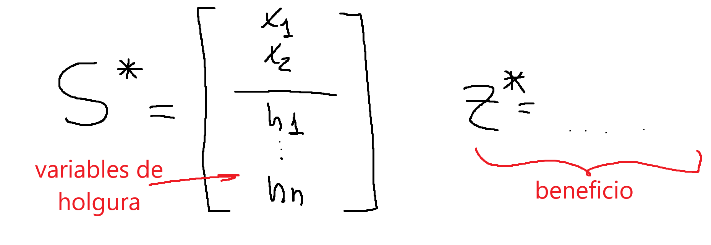
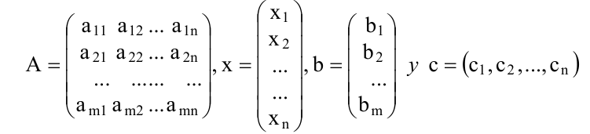
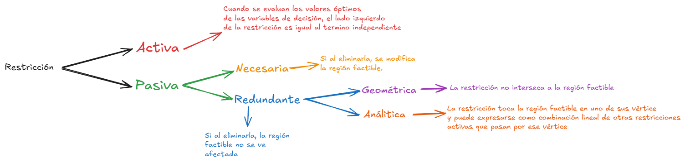
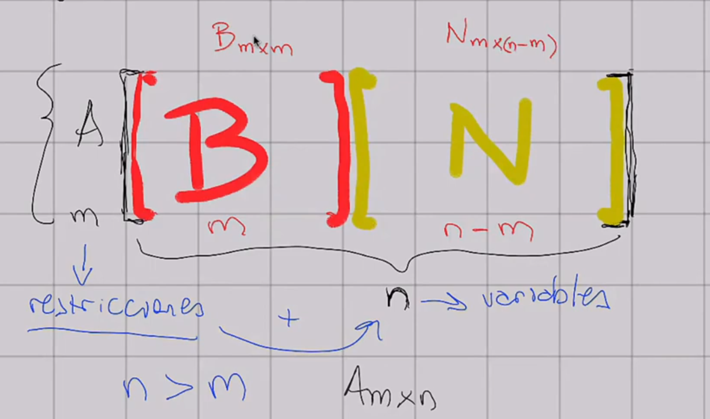
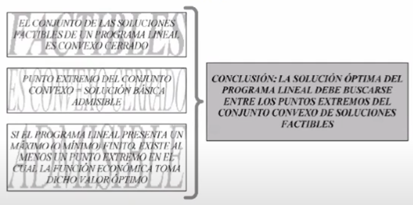

# IO — Teoría hasta antes del Simplex

Cubre las Unidades 1 y 2 de la wiki: todo lo necesario para la **Práctica 1**
(método gráfico, formas canónica y estándar) y para la primera mitad del primer parcial.

Fuentes: apunte de cátedra PLC1 y PLC2 (Norma Torrent) + resumen de primer parcial.
Versión formal con LaTeX en [[IO]]. Esta es la versión machete.

## Índice

1. [Las tres piezas de un programa lineal](#1-las-tres-piezas-de-un-programa-lineal)
2. [Modelizar](#2-modelizar)
3. [Método gráfico](#3-método-gráfico)
4. [Los cuatro tipos de solución](#4-los-cuatro-tipos-de-solución)
5. [Formas canónica y estándar](#5-formas-canónica-y-estándar)
6. [Qué significan las holguras](#6-qué-significan-las-holguras)
7. [Clasificación de restricciones](#7-clasificación-de-restricciones)
8. [Convexidad](#8-convexidad--por-qué-todo-esto-funciona)
9. [Soluciones básicas factibles](#9-soluciones-básicas-factibles--el-corazón-de-la-unidad-2)
10. [Solución conceptual](#10-solución-conceptual--y-por-qué-muere)
11. [Checklist de parcial](#11-checklist-de-parcial)

---

```
EJEMPLO BASE — Taller de alfarería
Produce vasijas y cántaros. Dispone de 40 hs de mano de obra y 75 kg de arcilla por dia.
  Vasija:  contribucion marginal $20,  usa 1 h y 3 kg
  Cantaro: contribucion marginal $45,  usa 2 h y 1,5 kg
La demanda de cantaros nunca supera las 15 unidades.
```

Es el ejemplo que la cátedra reusa en todos lados: aparece en PLC1 (método gráfico),
en la solución conceptual de PLC2, y en los ejemplos de sensibilidad. Vale la pena
tenerlo memorizado.

---

## 1. Las tres piezas de un programa lineal

Todo PL tiene exactamente tres componentes. Si te falta uno, no es un PL:

- **Variables de decisión** (`x1, x2, ...`) — las acciones sobre las que se decide. También se les dice *actividades del sistema*.
- **Función objetivo** (o económica, o funcional) — una función **lineal** a maximizar o minimizar.
- **Restricciones** — ecuaciones o inecuaciones **lineales** que limitan las variables.

Más la **condición de no negatividad** `xj >= 0`, que no es una restricción más: le da
sentido económico a las variables y es **requisito del método de resolución**. Sin ella
el Simplex no funciona.

En PL se optimiza **un solo parámetro**. No podés maximizar ganancia y minimizar costo a la vez.

```
Ingresos - Egresos = Beneficios
Ventas   - Costos  = Contribucion Marginal
```

**Los cuatro símbolos del modelo general**, que te pueden pedir nombrar:

```
xj   variables de decision
cj   cuanto aporta cada unidad de xj al objetivo
bi   cantidad disponible del recurso i (o cantidad exigida del requerimiento i)
aij  coeficiente tecnologico: cuanto del recurso i consume una unidad de la actividad j
```

Los tres parámetros (`cj`, `bi`, `aij`) pueden ser **cualquier número real**. Sobre ellos
no hay ninguna hipótesis. La no negatividad aplica a las **variables**, no a los parámetros.

**Modelo general:**

```
Max (o Min) z = c1x1 + c2x2 + ... + cnxn

s.a.
   a11x1 + a12x2 + ... + a1nxn   (<=;=;>=)  b1
   a21x1 + a22x2 + ... + a2nxn   (<=;=;>=)  b2
     ...     ...          ...               ...
   am1x1 + am2x2 + ... + amnxn   (<=;=;>=)  bm
   xj >= 0,   j = 1, 2, ..., n
```

En forma matricial: `Max z = c·x` s.a. `A·x <= b`, `x >= 0`, donde `c` es vector fila de
`n` elementos, `x` vector columna de `n`, `b` vector columna de `m`, y `A` la matriz
`m x n` de coeficientes tecnológicos. `Aj` es la columna `j` de `A`.

## 2. Modelizar

El paso que más puntos hace perder, y no por la matemática.

**Definí las variables con precisión quirúrgica.** Mal: "`x1`: vasijas". Bien:
"`x1`: cantidad de vasijas a producir **por día**". La unidad y el período son parte de
la definición. Si el enunciado da recursos semanales y vos definís producción diaria,
todo el modelo queda mal y no te vas a dar cuenta.

**Unificá unidades antes de escribir nada.** El ejercicio 4 de la Práctica 1 te da los
recursos en **horas** y los insumos en **minutos**. Si no convertís, el modelo da cualquier cosa.

Del ejemplo:

```
x1: produccion diaria de vasijas
x2: produccion diaria de cantaros

Max z = 20 x1 + 45 x2

s.a.
   1 x1 + 2   x2 <=  40     (mano de obra, horas)
   3 x1 + 1,5 x2 <=  75     (arcilla, kg)
          1   x2 <=  15     (demanda maxima)
        x1, x2   >=   0
```

Regla práctica para el sentido de la desigualdad:

```
recurso disponible                        ->  <=
requerimiento minimo / contrato / cuota   ->  >=
```

## 3. Método gráfico

Sirve con **dos variables**. Con tres es posible (cada inecuación define un semiespacio,
la intersección es un poliedro, y la función objetivo una familia de planos paralelos)
pero poco recomendable. Con más de tres, impracticable.

**Paso 1 — graficar cada restricción.** Dos formas de despejar la recta:

```
a) Ecuacion segmentaria:   x1/p + x2/q = 1
   p y q son DIRECTAMENTE donde corta cada eje. Es la mas rapida.

   1 x1 + 2 x2 = 40   ->   x1/40 + x2/20 = 1   ->   corta en (40;0) y (0;20)

b) Hacer x1 = 0 y despejar x2; despues x2 = 0 y despejar x1.
```

**Paso 2 — determinar el semiplano.** Reemplazás un punto cualquiera, en general `(0;0)`
porque es el más fácil, y ves si cumple. Si cumple, el semiplano es el que contiene al origen.

**Paso 3 — región factible.** La intersección de todos los semiplanos, limitada al primer
cuadrante por la no negatividad.

**Paso 4 — dirección de crecimiento.** Acá está lo que se olvida: la recta
`c1·x1 + c2·x2 = z` tiene un **vector normal `n` de componentes `(c1; c2)`**. Ese vector
apunta en la dirección en que `z` crece. En el ejemplo, `n = (20; 45)`.

**Paso 5 — desplazar la recta de nivel** en el sentido de `n` (si maximizás) hasta el
último punto que toque la región factible.

**Paso 6 — hallar coordenadas** resolviendo el sistema de las **dos restricciones que se
cruzan** en ese vértice.

```
x1 + 2 x2 = 40
       x2 = 15      ->   x1 = 10,  x2 = 15,  z = 20(10) + 45(15) = 875
```



**Dos métodos, mismo resultado:**

| Método | Cómo |
|---|---|
| **Rectas de nivel** | Desplazar la recta de `z` hasta el último punto factible |
| **Vértices** | Calcular las coordenadas de todos los vértices y evaluar `z` en cada uno |

El de los vértices funciona por un motivo que no es obvio y que es todo el punto de la
unidad 2: **si el problema tiene solución, el óptimo se alcanza en al menos un vértice**.
Nunca en el interior.

## 4. Los cuatro tipos de solución

Pregunta fija de parcial. Primero se clasifica en **factible** / **no factible**; después,
si es factible, el óptimo puede ser **único**, **múltiple** o **no acotado**.

| Tipo | Cómo se reconoce en el gráfico |
|---|---|
| **Única** | La recta de nivel toca la región en **un solo vértice** |
| **Múltiple / alternativas** | La recta de nivel queda **paralela a una restricción activa** |
| **No acotada** | La región es abierta **en la dirección de crecimiento de z** |
| **No factible / incompatible** | No hay región factible: las restricciones se contradicen |

> **La trampa clásica:** *región factible no acotada* ≠ *solución no acotada*. Podés tener
> una región abierta y óptimo finito perfectamente. Pasa siempre que minimizás sobre una
> región abierta hacia arriba. Son dos cosas distintas y el apunte lo marca explícitamente.

> **Otra que preguntan:** una solución no acotada casi siempre indica un **error de
> formulación**, no un hallazgo. Ninguna fábrica gana infinito.

En el caso de **soluciones múltiples**, los dos vértices óptimos son soluciones **básicas**,
y todos los puntos intermedios del segmento son óptimos pero **NO básicos**. Se escriben
con la paramétrica:

```
P = alfa·P1 + (1 - alfa)·P2       con  0 <= alfa <= 1
```

La Práctica 1 lo pide así en el ejercicio 3.

## 5. Formas canónica y estándar

Dos formatos distintos, para dos usos distintos:

```
CANONICA  (para dualidad e interpretacion)
  Max con TODAS las restricciones <=,  variables >= 0
  o bien
  Min con TODAS las restricciones >=,  variables >= 0

ESTANDAR  (la que necesita el Simplex)
  Max o Min, da igual
  TODAS las restricciones son ECUACIONES
  Todo bi >= 0
  Todas las variables >= 0
```

**Las siete transformaciones.** Esto se toma tal cual:

| Situación | Qué hacés |
|---|---|
| `<=` → ecuación | **Sumás** una variable de **holgura** |
| `>=` → ecuación | **Restás** una variable de **exceso** |
| `bi` negativo | Multiplicás toda la restricción por `-1` |
| Invertir una desigualdad | Multiplicás ambos lados por `-1` |
| Igualdad → dos desigualdades | `ax = b` equivale a `ax <= b` **y** `ax >= b` |
| Variable irrestricta `x5` | `x5 = x51 - x52`, con ambas `>= 0` |
| Variable no positiva `x7 <= 0` | `x7' = -x7`, con `x7' >= 0` |
| Cambiar objetivo | `Min w` equivale a `Max z = -w`. Cambia el signo del funcional, **no** el valor óptimo de las variables |

Sobre la variable irrestricta: al obtener el óptimo, si `x51 > x52` entonces `x5` es
positiva; si `x51 < x52` es negativa; si son iguales, `x5 = 0`.

El ejemplo llevado a estándar:

```
Max z = 20 x1 + 45 x2 + 0 x3 + 0 x4 + 0 x5

   1 x1 + 2   x2 + x3           = 40
   3 x1 + 1,5 x2      + x4      = 75
          1   x2           + x5 = 15
   xj >= 0,  j = 1...5
```



Las holguras y excesos entran en la función objetivo con **coeficiente cero** y son
**no negativas**, igual que las de decisión.

## 6. Qué significan las holguras

El apunte lo explica con una imagen que conviene tener: **la holgura `x3` es la cantidad
a fabricar de una "pieza ficticia" que consume solo una unidad del recurso y no aporta
nada al beneficio.** Por eso su `cj` es cero.

En la práctica:

- **Holgura** = cuánto **sobra** del recurso al ejecutar el óptimo.
- **Exceso** = en cuánto el lado izquierdo **supera** al mínimo exigido.

Con el óptimo `x1 = 10, x2 = 15`:

```
x3 = 0      la mano de obra se usa a pleno
x4 = 22,5   sobran 22,5 kg de arcilla
x5 = 0      se produce exactamente la demanda maxima de cantaros
```

El ejercicio 2 de la Práctica 1 pide justo esto: calcular las holguras e **interpretar el
significado específico de cada una**. No alcanza con el número.

## 7. Clasificación de restricciones

```
ACTIVA (u obligatoria)
  Al reemplazar el optimo, el lado izquierdo IGUALA al termino independiente.
  Su holgura/exceso es NULA. Geometricamente: pasa por el punto de optimo.

PASIVA (o no obligatoria)
  Su holgura/exceso es POSITIVA. Se subdivide:

  |-- NECESARIA:   si la sacas, la region factible CAMBIA
  |-- REDUNDANTE:  si la sacas, la region factible NO cambia
        |-- redundante GEOMETRICAMENTE: no toca la region factible
        |-- redundante ANALITICAMENTE:  toca la region en un vertice, y es
                                        combinacion lineal de las otras
                                        restricciones que pasan por ese vertice
```



Por qué no se eliminan las redundantes aunque se podría: son difíciles de detectar, y
**una restricción redundante hoy puede dejar de serlo mañana** si cambian los parámetros.
El único costo de dejarlas es aumentar la dimensión del problema.

## 8. Convexidad — por qué todo esto funciona

Acá arranca la Unidad 2, y es la parte que explica *por qué* el método gráfico y el
Simplex son válidos.

```
HIPERPLANO       c1x1 + c2x2 + ... + cnxn = z
                 generaliza la recta (R2) y el plano (R3). El vector c es su NORMAL.

SEMIESPACIO      un hiperplano parte el espacio en tres: inferior (<), el propio
                 hiperplano, y superior (>). Con desigualdad estricta son ABIERTOS;
                 unidos al hiperplano son CERRADOS.

POLITOPO         interseccion de un numero FINITO de semiespacios cerrados.
                 Si ademas esta acotado, se llama POLIEDRO.

COMB. LINEAL     x = SUMA(lambda_i · x_i)  con  lambda_i >= 0  y  SUMA(lambda_i) = 1
CONVEXA

CONJUNTO CONVEXO dados dos puntos cualesquiera del conjunto, el segmento que los une
                 esta TOTALMENTE contenido en el.

PUNTO EXTREMO    punto que NO puede expresarse como combinacion lineal convexa de
(vertice)        otros dos puntos del conjunto.
```

**El razonamiento clave, en una línea:** cada restricción es la intersección de dos
semiespacios cerrados, la no negatividad también lo es, entonces **la región factible es
la intersección de un número finito de semiespacios cerrados = un polítopo = un conjunto
convexo cerrado**. Siempre. Ese es el Teorema 1.

Propiedades que se usan sin decirlo:

- La intersección (finita o infinita) de convexos es convexa. **La unión, en general, NO.**
- El conjunto vacío es convexo. Un conjunto de un solo punto también.
- Hiperplanos y semiespacios (abiertos o cerrados) son convexos.
- Todo polítopo es convexo, por ser intersección de semiespacios cerrados.

La región factible puede ser: **vacía** (no factible), **un punto** (solución trivial) o
**con infinitos puntos** (el caso interesante).

## 9. Soluciones básicas factibles — el corazón de la Unidad 2

**Las cinco definiciones, en orden.** Cada una agrega una condición a la anterior:

```
SOLUCION                 toda n-upla que satisface  A·x = b
SOLUCION FACTIBLE        ...que ademas cumple  x >= 0
SOLUCION BASICA          ...con a lo sumo m componentes distintas de cero
                            (o sea, al menos n-m nulas)
SOLUCION BASICA FACTIBLE (SBF)  solucion basica con todas sus basicas >= 0
SBF NO DEGENERADA        SBF con EXACTAMENTE m componentes estrictamente positivas
                         Si tiene menos -> SBF DEGENERADA
```

**La partición base / no base.** Si `m < n` y se cumple la **hipótesis de rango completo**
(rango de `A` = `m`, o sea las `m` ecuaciones son linealmente independientes), el sistema
tiene infinitas soluciones. Se eligen `m` columnas linealmente independientes formando la
matriz cuadrada `B`:

```
A·x = b        ->        B·xB + N·xN = b

B    la BASE (cuadrada, inversible)
xB   variables BASICAS
N    la "no base" (los n-m vectores restantes)
xN   variables NO BASICAS

haciendo xN = 0:   B·xB = b   ->   xB = B^-1 · b
```



Esa es la solución básica: las `m` componentes de `xB` más `n-m` ceros.

### Los cuatro teoremas

```
T1  El conjunto de soluciones factibles es un CONJUNTO CONVEXO CERRADO.

T2  TEOREMA FUNDAMENTAL DE LA PL
    Si hay una solucion factible, tambien hay una SBF.
    Si hay una solucion factible OPTIMA, tambien hay una SBF OPTIMA.

T3  TEOREMA DE EQUIVALENCIA
    x es PUNTO EXTREMO  <==>  x es SOLUCION BASICA FACTIBLE

T4  La funcion objetivo alcanza su optimo en AL MENOS UN punto extremo.
    Si el optimo se da en mas de un punto extremo, tambien se da en toda
    combinacion convexa de ellos.
```



> **T3 es el teorema bisagra de toda la materia.** Conecta lo geométrico (vértice) con lo
> algebraico (SBF). Es lo que hace que el Simplex, que solo hace álgebra con matrices,
> esté en realidad **caminando por los vértices del poliedro**. Si entendés solo un
> teorema de la unidad, que sea este.

**T4 es lo que justifica el método de los vértices** que usaste en el gráfico: la solución
óptima está entre los puntos extremos, **nunca en el interior**.

### Consecuencias

- Si el conjunto de soluciones factibles es no vacío, tiene al menos un punto extremo.
- Cada SBF es un punto extremo, **y viceversa**.
- El número de puntos extremos es **finito**.
- El máximo con `n` variables y `m` restricciones:

```
C(n,m) = n! / [ (n-m)! · m! ]
```

## 10. Solución conceptual — y por qué muere

Es el método de fuerza bruta que se deduce de los teoremas: si el óptimo está en un
vértice y los vértices son finitos, **calculá `z` en todos y quedate con el mejor**.

```
1. Llevar a FORMA ESTANDAR
2. De la matriz A, elegir una BASE: m columnas linealmente independientes
   (verificar con determinante != 0)
3. Resolver por CRAMER el sistema que queda al anular las n-m incognitas
   que no acompanan a la base
4. Si TODAS las incognitas resultantes son >= 0, esa solucion (mas los n-m
   ceros) es un PUNTO EXTREMO
5. Repetir hasta agotar las C(n,m) combinaciones
```

En el ejemplo, `n = 5` y `m = 3`, así que hay `C(5,3) = 10` combinaciones:

| Base | x1 | x2 | x3 | x4 | x5 | | z |
|---|---|---|---|---|---|---|---|
| A1 A2 A3 | 17,5 | 15 | −7,5 | 0 | 0 | No factible | — |
| A1 A2 A4 | 10 | 15 | 0 | 22,5 | 0 | **Factible óptima** | **875** |
| A1 A2 A5 | 20 | 10 | 0 | 0 | 5 | Factible | 850 |
| A1 A3 A4 | — | — | — | — | — | No son base | — |
| A1 A3 A5 | 25 | 0 | 15 | 0 | 15 | Factible | 500 |
| A1 A4 A5 | 40 | 0 | 0 | −45 | 15 | No factible | — |
| A2 A3 A4 | 0 | 15 | 10 | 52,5 | 0 | Factible | 675 |
| A2 A3 A5 | 0 | 50 | −60 | 0 | −35 | No factible | — |
| A2 A4 A5 | 0 | 20 | 0 | 45 | −5 | No factible | — |
| A3 A4 A5 | 0 | 0 | 40 | 75 | 15 | Factible (trivial) | 0 |

Dos cosas para notar:

1. De las 10 combinaciones, **una no llega a ser base** (columnas linealmente
   dependientes) y **cuatro dan soluciones no factibles**. Solo 5 son vértices reales.
2. La base `A3 A4 A5` — todas holguras — da la **SBF trivial** de forma inmediata:
   `x1 = x2 = 0`, `z = 0`. Es el origen. **Ese es el punto de partida natural del Simplex.**

**Por qué muere el método:** una aplicación chica con **20 variables y 10 restricciones** tiene

```
C(20,10) = 184.756  puntos extremos
```

Resolver 184.756 sistemas de ecuaciones es inadmisible aún con computadoras modernas.
Por eso Dantzig desarrolla el **Simplex** en 1947: llega al óptimo **sin evaluar todos los
vértices**, moviéndose solo entre vértices adyacentes y siempre mejorando.

## 11. Checklist de parcial

Lo que hay que poder hacer sin pensar:

- [ ] Definir variables con unidad y período explícitos
- [ ] Unificar unidades antes de escribir el modelo
- [ ] Pasar de forma canónica a estándar y al revés, con las siete transformaciones
- [ ] Decir cuántas holguras, excesos y artificiales lleva un modelo, mirando solo los signos de las restricciones
- [ ] Graficar por ecuación segmentaria
- [ ] Dibujar el vector normal `(c1; c2)` y saber para dónde crece `z`
- [ ] Reconocer los cuatro tipos de solución en el gráfico
- [ ] **No confundir región no acotada con solución no acotada**
- [ ] Escribir la paramétrica de las soluciones alternativas
- [ ] Calcular holguras en el óptimo e **interpretar cada una en el contexto del problema**
- [ ] Clasificar restricciones: activa / pasiva necesaria / redundante geométrica / redundante analítica
- [ ] Enunciar los cuatro teoremas, sobre todo el de **equivalencia**
- [ ] Distinguir solución / factible / básica / básica factible / degenerada
- [ ] Calcular `C(n,m)` y saber qué cuenta
- [ ] Explicar **por qué** hace falta el Simplex (el argumento de las 184.756 bases)

## Preguntas de teoría que salen de acá

1. ¿Por qué la condición de no negatividad no es "una restricción más"?
2. ¿Qué diferencia hay entre forma canónica y forma estándar, y para qué sirve cada una?
3. ¿Qué significa económicamente una variable de holgura? ¿Y una de exceso?
4. Una región factible no acotada, ¿implica solución no acotada? Justificar.
5. ¿Qué es una restricción redundante analíticamente y en qué se diferencia de una redundante geométricamente?
6. ¿Por qué la región factible de un PL es siempre un conjunto convexo?
7. Enunciar el teorema de equivalencia. ¿Por qué es importante?
8. ¿Puede el óptimo de un PL estar en el interior de la región factible? Justificar.
9. ¿Qué es una solución básica factible degenerada?
10. ¿Por qué no se resuelve todo con la solución conceptual?
