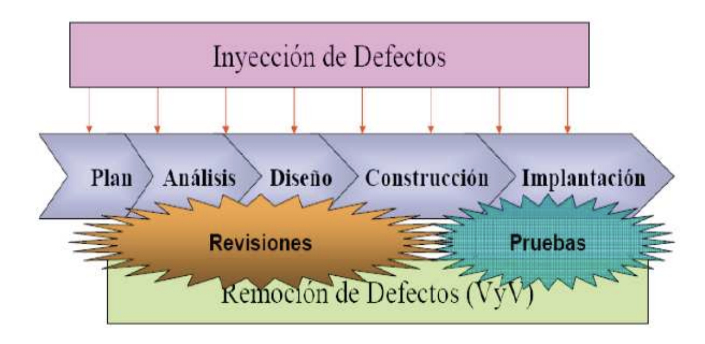

# Ingeniería y Calidad de Software — Wiki

## Índice

1. Unidad 1 — Modelos de calidad de software y CMMI
2. Unidad 2 — Gestión de procesos (OPF, OPD, OT, RUP, SPEM)
3. Unidad 3 — Gestión de proyectos de software (PP, PMC, APF, RSKM)
4. Unidad 4 — Gestión de requerimientos y de solicitudes de cambio (REQM, RD)
5. Unidad 5 — Verificación y Validación
6. Unidad 6 — Gestión de configuración (CM)
7. Unidad 7 — Aseguramiento de la calidad de proceso y producto (PPQA)
8. Unidad 8 — Medición y análisis (MA)
9. Unidad 9 — Pericias informáticas
- Anexo — Gestión efectiva de la calidad del producto (complementario de U5, no entra)

> **Numeración** (actualizada el 2026-10-05). La wiki sigue la numeración del **programa de
> cátedra**, que tiene **9 unidades**: U1 Modelos de calidad · U2 Gestión de procesos · U3 Gestión
> de proyectos · U4 Gestión de requerimientos y de solicitudes de cambio · U5 Verificación y
> validación · U6 Gestión de configuración · U7 Aseguramiento de calidad (PPQA) · U8 Medición y
> análisis · U9 Pericias informáticas. La antigua "Unidad 4 — Gestión efectiva de la calidad del
> producto" de esta wiki no es una unidad del programa: quedó como **Anexo** al final.

> **Alcance del parcial de Regularización** (`fuentes/temario-parcial-regularizacion.md`):
> entran **U1, U2, U3 y U5**, sólo de los documentos y páginas que lista el temario. En concreto:
> - **U1:** Introducción a la Calidad (págs. 1-8) · Guía de Ingeniería del Software (págs. 8-23) ·
>   CMMI: niveles de madurez (págs. 52-57 y 63) y componentes de un área de proceso (págs. 31-42).
> - **U2:** OPD, OPF y OT **sin subprácticas ni IPPD** · PPT de Proceso y RUP, **págs. 1 a 46**
>   (SPEM y elementos del proceso; **no** entran los objetivos de las fases ni los propósitos de
>   las disciplinas, que están en las págs. 52-74).
> - **U3:** PP y PMC (2 págs. cada una: propósito y metas/prácticas) · Guía práctica de Gestión de
>   Proyectos (págs. 1-24) · APF: metodología y glosario (págs. 19-25). **No** entra la Guía
>   avanzada de Gestión de Proyectos.
> - **U5:** VAL y VER (3 págs. cada una) · Guía de V&V de INTECO (págs. 16-67) · PPT de Myers ·
>   derivar casos de prueba de casos de uso y directriz de caso de prueba (sólo para ejercicios).
>   **No** entra la Guía de mejores prácticas de calidad de producto.
> - **No entran:** el Anexo, y las áreas REQM, PPQA, CM, MA, RSKM y RD más allá de saber a qué
>   nivel de madurez pertenecen.

> **Alcance del parcial de Aprobación Directa (AD)**
> (`fuentes/IS-CAT-GRAL15_Parciales_ISW_ciclo-lectivo_2025.pdf`): **temario completo de la
> asignatura, las 9 unidades**, sin recorte por páginas. Opción múltiple, 15-20 preguntas
> aprox., **a libro abierto sólo en papel** (sin dispositivos), presencial; se aprueba con el
> 60 %. Para **promocionar** hay que aprobar Regularización + AD y entregar los TPs de clase (en
> 2025, el 60 % en fecha antes del fin del cuatrimestre); si se desaprueba el AD queda el
> **Globalizador AD**. Fecha 2026: **24/10** (según el alumno).
> - En los AD reales (`fuentes/parciales-ad/`, 2024 y 2025) el peso estuvo en **CM (U6), PPQA
>   (U7), REQM/RD (U4) y MA (U8)**, más alguna de PP y V&V. Mucho formato **"BP"**: se describe
>   una práctica de una software factory y hay que decir si genera problemas de calidad y por
>   qué (no se pueden mezclar opciones del "sí" con las del "no").
> - Riesgos (RSKM, en U3) y Pericias (U9) no aparecieron en 2024-2025, pero entran.

---

## Desarrollo

### Unidad 1 — Modelos de calidad de software y CMMI

#### Conceptos clave

- **Calidad** = *idoneidad de uso*. Definiciones que conviven en la materia (INT01, págs. 2-3):
  - **Juran / clásica:** características del producto que satisfacen las necesidades del
    cliente + **inexistencia de deficiencias**.
  - **Deming:** se define desde el punto de vista del **cliente**, como cualquier cosa que
    aumenta su satisfacción.
  - **ANSI:** totalidad de características de un producto o servicio con capacidad de satisfacer
    necesidades **explícitas o implícitas**.
  - **ISO 9000:2000:** nivel al que una serie de **características inherentes** satisfacen los
    **requisitos**.
  - **ISO 8402:** conjunto de propiedades y características que le confieren aptitud para
    satisfacer necesidades **explícitas o implícitas**.
  - **CMMI (SEI):** capacidad de un conjunto de características inherentes de un producto,
    componente o **proceso** de satisfacer **por completo** los requisitos del cliente.
- **Elementos que influyen en la calidad:** procesos y buenas prácticas · herramientas ·
  personas · medidas y métricas.
- **Tres niveles de gestión de la calidad:** producto (pruebas en paralelo a cada etapa) ·
  proyecto (controlar fases y áreas de gestión) · **proceso** (gestionar las áreas de
  proceso de toda la organización mediante una metodología → es el nivel donde juega CMMI).
- **QA vs QC:** QA = **aseguramiento**, preventivo/proactivo, orientado a **proceso**, nivel
  organización · QC = **control**, reactivo, orientado a **producto**, nivel equipo de control.
- **Verificación** = ¿construyo el producto **correctamente** (según el proceso/especificación)? ·
  **Validación** = ¿construyo el producto **correcto** (el que necesita el cliente)?
- **Software = programas + datos + documentos.** Es un elemento **lógico**: se **desarrolla**,
  no se fabrica; **no se estropea pero se deteriora** (por los cambios del mantenimiento).
- **Ingeniería del software (IEEE, 1993):** aplicación de un enfoque **sistemático, disciplinado
  y cuantificable** al desarrollo, operación y mantenimiento del software. **Objetivo primario:**
  construir un producto de **alta calidad** de manera **oportuna**.
- **Tecnología multicapa:** sobre una base de **compromiso con la calidad** se apoyan
  **Procesos** → **Métodos** → **Herramientas**.
- **Ciclo de vida:** conjunto de fases por las que pasa el sistema **desde que nace la idea
  inicial hasta que el software es retirado o reemplazado** (frase textual que aparece en los
  ejercicios de OPD/PP/PPQA).
- **CMMI: 5 niveles de madurez** (1 Inicial · 2 Gestionado · 3 Definido · 4 Gestionado
  cuantitativamente · 5 En optimización) y **22 áreas de proceso** en 4 categorías (gestión de
  procesos · gestión de proyectos · ingeniería · soporte).
- **Madurez** = de la organización, por conjunto de áreas (representación **por etapas**) ·
  **Capacidad** = por área de proceso individual (representación **continua**).
- **Componentes de un área de proceso:** requeridos (metas SG/GG) · esperados (prácticas
  SP/GP) · informativos (todo lo demás).

#### Desarrollo

**Metodología y por qué sirve un modelo.** Una guía de buenas prácticas aporta un punto de
partida, la experiencia acumulada de otras empresas, un lenguaje y visión común, y técnicas
para crear un modelo. Al crear un modelo se crea una **visión simplificada** de la situación
real, más sencilla de controlar y mejorar. Trabajar con un modelo probado permite predecir mejor
el comportamiento y el rendimiento de la empresa, y — al tener más control sobre el proyecto y
los procesos — produce: menos defectos totales, menos tiempo de entrega, menor costo, más
satisfacción del cliente, más beneficios.

**Niveles de gestión de la calidad (INT01, pág. 8), en detalle:**

| Nivel | En qué se centra |
|---|---|
| **Producto** | El proceso de desarrollo, haciendo **pruebas en paralelo con cada etapa** para detectar y corregir defectos |
| **Proyecto** | Controlar **todas las fases y áreas de gestión de proyecto**, implantando metodologías y mejores prácticas |
| **Proceso** | Gestionar **todas las áreas de proceso de la organización** mediante una metodología → más información de los procesos para controlarlos y mejorarlos |

**Componentes y definiciones de software.** IEEE Std. 610: "**programas, procedimientos y
documentación y datos asociados**, relacionados con la operación de un sistema informático".
Webster (1975): conjunto de programas, procedimientos y documentación relacionada. La guía
INTECO lo reduce a **tres componentes**: **programas** (instrucciones que dan la funcionalidad
y el rendimiento), **datos** (para manejar y probar los programas, y sus estructuras) y
**documentos** (operación y uso; también los necesita quien mantiene el software). Una
percepción común —y errónea— es que el software son sólo programas.

**Características del software (por qué necesita ingeniería).**

- Se **desarrolla**, no se fabrica: no hay línea de producción, cada producto es distinto
  porque se construye para requisitos únicos de un cliente.
- El recurso principal son **las personas**, y no son intercambiables con tiempo: agregar
  gente no acelera linealmente porque el desarrollo requiere coordinación y comunicación.
  Un nuevo integrante no es productivo de inmediato y consume tiempo de los que ya están.
- **No se estropea, se deteriora:** los defectos no detectados hacen fallar el programa en las
  primeras etapas de su vida; una vez corregidos los fallos disminuyen, pero cada cambio de
  mantenimiento tiene probabilidad de introducir defectos nuevos.
- La **reutilización** existe pero está lejos de su potencial: identificar componentes
  reutilizables es difícil justamente porque cada producto es único. El hardware, en cambio,
  usa componentes estándar (menor costo y tiempo, buena calidad, ingeniería rápida, fácil
  mantenimiento y mejora); el software se crea normalmente **desde cero / a medida**.

**Tipos y aplicaciones del software.** Dos grandes categorías: **de aplicaciones** (dan
servicio al negocio) y **de sistemas** (operan y mantienen el sistema informático: SO,
compiladores, utilidades). Por aplicación: sistemas, tiempo real, gestión (SIG),
ingeniería/científico, empotrado, computadoras personales, basado en web, inteligencia
artificial. Dos factores definen la naturaleza de una aplicación: el **contenido** (significado y
forma de la información de E/S) y el **determinismo de la información**: predictibilidad del
orden y momento de llegada de los datos (un análisis de ingeniería es determinado; un SO
multiusuario es **indeterminado**).

**Historia (para descartar opciones).** El término "ingeniería del software" aparece en la
**conferencia de la OTAN de 1968**, para provocar la reflexión sobre la **crisis del software**.
Otras definiciones de la guía: Zelkovitz 1978 (estudio de principios y metodologías), Boehm
1976 (aplicación práctica del conocimiento científico al diseño y construcción de programas y
su documentación), Bauer 1972 (principios y métodos de ingeniería para obtener software
**rentable, fiable** y que trabaje en máquinas reales).

**Etapas de la ingeniería del software.** Análisis de requisitos → Especificación → Diseño y
arquitectura → Programación → Prueba → Mantenimiento. Detalles que se preguntan: el resultado
del análisis se plasma en la **Especificación de Requisitos** (normalizada por **IEEE Std.
830-1998**); la especificación es más importante para las **interfaces externas**, que deben
permanecer estables; en prueba, es **buena práctica que pruebe alguien distinto** al
desarrollador que programó.

**Tipos de mantenimiento** (entra seguido en examen):

| Tipo | Qué hace | Actividades que predominan (resumen 99 págs.) |
|---|---|---|
| **Perfectivo** | Mejorar la calidad **interna** del sistema | Diseño, codificación y prueba |
| **Evolutivo** | Altas/bajas/modificaciones por expansión o cambio de necesidades del usuario | Todas (es casi un desarrollo nuevo) |
| **Adaptativo** | Cambios por el **entorno** (hardware, software de base, DBMS, comunicaciones) | Diseño, codificación y prueba |
| **Correctivo** | Corrección de errores | Re-codificación y prueba |

**Objetivo primario, relevancia y principios.** Para construir productos de alta calidad dentro
de la planificación, la IS emplea prácticas para: **entender el problema · diseñar una solución
· implementarla correctamente · probarla · gestionar** lo anterior. Abarca además métodos de
gestión de proyectos para el **aseguramiento de la calidad** y la **gestión de la
configuración**. La IS es **adaptativa, no una metodología rígida**: "no es una religión y no hay
verdades absolutas"; procesos, métodos y herramientas se adaptan al producto, a la gente y al
negocio. Principios citables (lista completa en INT02 pág. 18): haz de la calidad la razón de
trabajar · una buena gestión es más importante que una buena tecnología · las personas y el
tiempo no son intercambiables · seleccionar el ciclo de vida adecuado · las técnicas son
anteriores a las herramientas · primero hazlo correcto, luego hazlo rápido · probar, probar y
probar · la entropía del software es creciente · **el compromiso del cliente es el factor más
crítico en la calidad** · haz que los errores los encuentre un colaborador, no un cliente ·
**iterar en todas las fases excepto en la codificación** · la gestión de errores y solicitudes
de cambio es esencial · si mides lo que haces puedes aprender a hacerlo mejor · no puedes
cambiar todo de una vez.

**Las tres capas.**

- **Proceso** — marco de trabajo que permite al jefe de proyecto controlar la gestión y las
  actividades de ingeniería. Es el **fundamento** de la IS y "la unión que mantiene juntas las
  capas". Un proceso definido responde: quién se comunica con quién, cómo se coordinan las
  actividades interdependientes, quién es responsable de qué, quién produce qué producto de
  trabajo y cómo se evalúa. Un proceso debe: identificar actividades y tareas, definir el flujo
  entre ellas, identificar los productos de trabajo, y **especificar los puntos de control de
  calidad**. Todos los enfoques tienen un proceso, pero muchas veces es **ad hoc, invisible y
  caótico**. La capa abarca: marco de proceso común (CPF) · actividades y tareas · puntos de
  control de calidad · definiciones de productos de trabajo · gestión de proyectos ·
  aseguramiento de la calidad · gestión de la configuración · monitorización de proyectos ·
  medidas y métricas.
- **Métodos** — el "**cómo**" técnico: análisis, diseño, codificación, pruebas, mantenimiento;
  más actividades de soporte (revisiones técnicas, soporte de métricas). El equipo elige el
  método según el problema, el entorno y la experiencia de sus miembros.
- **Herramientas** — automatización de soporte a las dos capas anteriores (gestión de
  proyectos, control de cambios, análisis y diseño, generación de código, pruebas,
  reingeniería, documentación, prototipos). Cuando se usan herramientas, la documentación pasa
  a ser parte integral del trabajo en vez de una actividad adicional.

---

##### Calidad: QA vs QC, verificación y validación, métricas

*Fuente: INT01 (INTECO), slides posteriores a la pág. 8 — fuera del rango de páginas del temario
de regularización, pero son la base de U5 y de las preguntas de "concepto".*

**Actividades de prueba a nivel de producto:** deben **comenzar pronto y continuar a lo largo de
todo el ciclo de vida**.

| | **QA — Aseguramiento de la calidad** | **QC — Control de la calidad** |
|---|---|---|
| Naturaleza | **Preventivo y proactivo** | **Reactivo** |
| Orientación | **Proceso** | **Producto** o servicio |
| Responsabilidad | Nivel **organización** | Nivel del **equipo de control** |
| Qué hace | Evalúa si QC funciona; identifica debilidades de los procesos y las mejora | Verifica si los atributos especificados están presentes en el producto |
| Ejemplos | Auditorías de proceso · definiciones de procesos · selección de herramientas · **formación** | Revisiones · inspecciones · ejecución de pruebas |

Ejemplo de clase (resumen 99 págs.): fabrico 1000 tazas, al final controlo "peso < 150 g" y
descarto las 10 que no cumplen → **QC**. Si salen 500 defectuosas y reviso el proceso productivo
para bajar ese número → **QA**.

| | **Verificación** | **Validación** |
|---|---|---|
| Pregunta | ¿Se construye el producto **de manera correcta** según el proceso definido? | ¿Se construye el **producto correcto/adecuado** que satisface al cliente? |
| Orientación | Detectar y corregir errores **en cada fase** | Que el producto final no tenga errores, **tampoco de concepto** |
| La slide la asocia a | **QA** | **QC** |
| Cuándo | **Antes y durante** el desarrollo | Cuando la **mayor parte del desarrollo se completó** |
| Método | **Revisiones, análisis e inspecciones** | **Pruebas de caja negra** |

> ⚠️ Esta tabla de INTECO **no coincide con CMMI**: en CMMI, VER incluye pruebas (unitarias, de
> integración, de sistema) y revisiones entre pares, y VAL puede hacerse desde temprano
> (requerimientos, prototipos). Para los ejercicios de áreas, usar CMMI. Ver Dudas.

**Tareas de asesoramiento de QA:** definir procesos eficientes (→ **añadir valor**) · entender y
evaluar objetivamente las buenas prácticas del proyecto (→ **trabajo inteligente, prevención**) ·
verificar y asegurar la calidad del producto (→ **mejorar**) · contribuir al repositorio de
información (→ **reutilizar la experiencia**).

**Entorno de gestión de la calidad:** procesos de gestión de la calidad (objetivos de calidad,
gestión de requisitos, estrategia de pruebas, activos de prueba, desarrollo y ejecución de
pruebas, gestión de defectos y de entregas) + informes y análisis + soporte y gestión del entorno
(entorno, herramientas, servicios comunes).

**Medidas vs métricas.** **Medida** = da el valor de un atributo · **Métrica** = da información
significativa del producto o proceso y **suele relacionar varias medidas** ("si no se puede
medir, no se puede controlar; si no se puede controlar, no se puede mejorar"). Se recogen para
evaluar esfuerzo estimado vs real, evolución del proyecto, % de defectos. Una buena métrica: se
relaciona con los objetivos · es concreta y está bien definida · es sencilla de entender e
implementar · ayuda a **entender el pasado, controlar el presente y predecir el futuro**.
**KPI** = medida que refleja los **factores críticos de éxito**; representa el progreso hacia
los objetivos; se visualiza en **cuadros de mando**. Si hay desvío → acciones **preventivas y
correctoras**.

**Comprender los defectos.** La mayoría se **introducen en requisitos y diseño**, pero la
mayoría se **detectan en pruebas de aceptación y en producción**.

**Algunas metodologías (tabla INT01):** mejora de **proceso** → CMMI-DEV v1.2 (evaluado por el
SEI; grande y PYME), ISO/IEC 15504:2003, SwTQM (EFQM + CMMI), ITMark (basado en CMMI, del ESI),
MoProsoft (evaluable con EvalProSoft), TPI/TMAP (sólo proceso de **testeo**) · mejora de
**producto** → ISO 9126 (requiere adaptación), XP (satisfacción y confianza del cliente).

##### Tipos de calidad de un producto

Distinción de las anotaciones de clase (Rozas) que no aparece en los resúmenes largos:

| Tipo | Qué es (Rozas) | Ejemplos | Lectura ISO 9126 (resumen 99 págs.) |
|---|---|---|---|
| **Interna** | La que **el cliente no percibe** | Facilidad de mantenimiento · claridad del código · respeto de estándares · reusabilidad | Se mide **antes de la prueba, sin el código funcionando**: mantenibilidad, documentación, adherencia |
| **Externa** | La que se ve desde afuera | Cumplimiento de los requerimientos · accesibilidad | Las **pruebas** propiamente dichas, en un entorno **artificial** (no el del cliente) |
| **De uso** | "Calidad futura": la que **no se tuvo en cuenta** y aparece recién cuando el software se usa de verdad | El sistema anda, pero a la media hora de uso real se nota el problema | La **satisfacción del cliente** usando el software en su entorno real |

**Proceso vs. proyecto** (definiciones de clase):

- **Proyecto:** conjunto de tareas diseñadas y organizadas para cumplir un objetivo **bajo
  ciertas restricciones**. Tipos: **desarrollo · mantenimiento · implementación (despliegue)**.
  El resumen de 99 págs. llama al tercero **operación** (instalar, configurar, capacitar,
  migrar) y aclara que en Argentina suele ir junto con desarrollo, pero CMMI los separa.
- **Proceso:** conjunto de tareas diseñadas y organizadas para cumplir un objetivo. Es
  **repetitivo y reiterativo, y produce siempre el mismo producto**. Esa repetibilidad es la
  diferencia con el proyecto, que es único y tiene inicio y fin.

| Proceso | Proyecto |
|---|---|
| **Genérico** (se adapta a muchos casos) | **Concreto**: una instanciación de procesos |
| Etapas en orden, **sin fechas** | Fecha de inicio y fin de cada etapa |
| Sin incertidumbre: conocido y **repetible**; se puede reiniciar | Alta **incertidumbre**, **único** e irrepetible |
| — | Tiene **restricciones** (tiempo, dinero, recursos) |

La calidad de un proyecto está muy influenciada por los **procesos elegidos** para llevarlo a
cabo.

> ⚠️ **Contradicción entre fuentes.** El resumen largo y la guía INTECO definen
> **software = programas + datos + documentos**, y las anotaciones de clase agregan un cuarto
> componente: **procedimientos**. La variante de clase tiene respaldo: la definición **IEEE
> Std. 610** citada en la propia guía dice "programas, **procedimientos**, documentación y datos".
> En los parciales viejos (2012) la respuesta esperada fue **programas, datos y documentos**
> (los "tres componentes" de INTECO). Usar esa, y tener presente la variante IEEE/clase.

---

##### Ciclos de vida y modelos de proceso

*Fuente: INT02 secciones 3 a 5 (págs. 24-51). Es bibliografía oficial de la cátedra, pero **fuera
del rango de páginas del temario de regularización** (que pide sólo la sección 2, págs. 8-23).
Sirve para OPD SP 1.2 / PP SP 1.3 y para las BP sobre elección del ciclo de vida.*

**Ciclo de vida** = conjunto de fases desde que nace la idea hasta que el software es retirado o
reemplazado (también llamado **paradigma**). Funciones: determinar el **orden de las fases** ·
establecer los **criterios de transición** entre fases · definir **entradas y salidas** de cada
fase · describir los **estados** del producto · describir las actividades · servir de base para
planificar, organizar y coordinar. **Fase** = conjunto de actividades con un objetivo,
agrupando tareas en un tramo de tiempo. **Entregables** = productos intermedios de las fases;
permiten evaluar la marcha del proyecto. Los modelos difieren en: **alcance** del ciclo,
**contenido** de las fases, y **estructura/sucesión** (si hay realimentación e iteración).

| Modelo | Idea | Ventajas | Inconvenientes | Cuándo |
|---|---|---|---|---|
| **Cascada** (Royce 1970, "lineal secuencial") | Cada fase empieza cuando termina la anterior | Simple, ordenado, fácil de gestionar (entregables y revisión por fase) | El cliente rara vez fija todo al inicio; **no hay resultados visibles hasta el final**; volver atrás es caro | Proyectos estables, **requisitos no cambiantes**, pequeños y bien entendidos |
| Variante **Sashimi** (DeGrace) | Cascada con **fases solapadas** / con retroalimentación | Problemas de implementación se descubren antes | — | — |
| **En V** | Cada fase de diseño tiene su **homóloga de prueba**; las pruebas (V&V) empiezan lo antes posible | Planes de prueba tempranos; entregables por fase; más éxito que cascada | Rígido como cascada; **sin prototipos**; sin camino claro ante problemas en pruebas | Proyectos pequeños con requisitos claros |
| **Iterativo** | Varias cascadas; al final de cada una se entrega una **versión mejorada** que el cliente evalúa | Requisitos se refinan en cada iteración; mejor gestión de riesgos | Problemas de **arquitectura** por no tener todo definido | Requisitos **poco claros** para el usuario (prototipos para conformidad) |
| **Incremental** | Secuencias lineales escalonadas; cada una entrega un **incremento operativo** (el 1º, el núcleo) | Software operativo temprano; más flexible; más fácil probar; cada iteración es un hito | Requiere experiencia para definir incrementos; fases rígidas sin solape | Se **conoce el problema** y se lo divide |
| **Espiral** (Boehm, 1985/88) | Ciclos de: **determinar objetivos → analizar riesgos → desarrollar y probar → planificar** | **Análisis de riesgos explícito**; incorpora objetivos de calidad; integra desarrollo y mantenimiento | Costoso, exige experiencia en riesgos; malo para proyectos chicos | Proyectos **largos, caros, complejos, de misión crítica**; gestiona la **incertidumbre** |
| **Prototipos** | Escuchar al cliente → construir/revisar maqueta → el cliente la prueba | Visibilidad temprana; el cliente reacciona mejor a un prototipo que a un texto; reduce el riesgo de no satisfacer | Puede ser lento; se invierte en algo **desechable**; tentación de **ampliar el prototipo** como sistema final sin calidad | Cliente con objetivos generales pero sin requisitos detallados; dudas técnicas |

> **Trampa espiral vs incremental:** el incremental **parte de que no hay incertidumbre** en los
> requisitos iniciales (conozco el problema y lo divido); el espiral **asume alta incertidumbre**
> y la gestiona.

**ISO/IEC 12207** — marco común de **procesos del ciclo de vida del software** (adquisición,
suministro, desarrollo, operación, mantenimiento). Agrupa actividades en **5 procesos
principales** (adquisición · suministro · desarrollo · operación · mantenimiento), **8 de apoyo**
(documentación · gestión de la configuración · verificación · validación · revisiones conjuntas ·
auditoría · solución de problemas · *aseguramiento de la calidad*, ver Dudas) y **4
organizativos** (gestión · infraestructura · mejora · formación). Cada proceso → actividades →
tareas.

**Metodología** = conjunto integrado de técnicas y métodos para abordar de forma homogénea
cada actividad del ciclo de vida; "un proceso de software detallado y completo". Se basa en una
combinación de **modelos de proceso genéricos** (cascada, incremental…) y define **artefactos,
roles y actividades**. Elementos: **fases** (tareas de cada fase) · **productos** (E/S de cada
fase) · **procedimientos y herramientas** · **criterios de evaluación** (del proceso y del
producto). Ventajas: para la **gestión** (planificar, controlar, costo/beneficio, comunicación
usuario-desarrollador) · para los **ingenieros** (comprender el problema, mantenimiento,
reutilización) · para el **cliente** (garantía de calidad, confianza en los plazos).

| Metodologías **ágiles** | Metodologías **tradicionales** ("pesadas") |
|---|---|
| Heurísticas de prácticas de producción de código | Normas de estándares |
| Preparadas para el **cambio** | Cierta **resistencia** al cambio |
| Impuestas **internamente** (equipo) | Impuestas **externamente** |
| Proceso menos controlado, pocos principios | Proceso muy controlado, muchas normas |
| Contrato **flexible** o inexistente | Contrato **prefijado** |
| El cliente **es parte del equipo** | El cliente interactúa mediante **reuniones** |
| Grupos **pequeños (<10)**, mismo sitio | Grupos **grandes**, posiblemente distribuidos |
| Pocos artefactos, pocos roles | Más artefactos, más roles |
| Menos énfasis en la arquitectura | Arquitectura **esencial**, expresada en modelos |

Tradicionales = énfasis en **planificación** y documentación exhaustiva; ágiles = énfasis en la
**adaptabilidad** (retrasar decisiones, planificación adaptativa).

**Desarrollo iterativo e incremental.** Respuesta a la debilidad de la cascada; base de RUP,
DSDM y XP. **Incremental** = las partes se desarrollan en distintos momentos y se integran al
completarse (la salida de un incremento no necesariamente se refina después). **Iterativo** =
se reserva tiempo para **revisar y mejorar** partes (la salida de una iteración se examina para
modificar y replanificar las siguientes). Pasos: **inicialización** (versión base ante la que el
usuario reacciona) → **iteración** (rediseño e implementación de una tarea de la **lista de
control del proyecto**) → análisis con la realimentación del usuario. Debilidades: avances
lentos por depender del usuario; poco apto para desarrollos grandes y largos; costo extra por el
tiempo de los usuarios. En proyecto liviano el código puede ser la documentación; en uno de
misión crítica hace falta documento de diseño formal.

**RAD** (James Martin, IBM, formalizado en 1991): desarrollo iterativo + prototipos + **CASE**,
flujo: planificación de requisitos → diseño de usuario → construcción rápida → transición.
Ventajas: velocidad, calidad por implicación del usuario, visibilidad temprana, ciclos cortos.
Inconvenientes: características y **escalabilidad reducidas**, difícil evaluar el progreso (**no
hay hitos clásicos**), riesgo de una sucesión de prototipos que nunca llega a producción.

**RUP en la guía INTECO** (detalle en [Unidad 2 → RUP y SPEM](#rup-y-spem)): marco de proceso
**iterativo y adaptable** (no prescriptivo), de Rational/IBM, basado en UML. Bloques: **roles
(quién) · productos de trabajo (qué) · tareas (cómo)**. 4 fases con un **hito** al final de cada
una; 9 disciplinas = **6 de ingeniería** (modelado de negocio, requisitos, análisis y diseño,
implementación, pruebas, despliegue) + **3 de soporte** (gestión de configuración y cambio,
gestión de proyectos, entorno).

##### Desarrollo ágil (XP, Scrum, DSDM, TDD)

> **Fuera de la bibliografía del temario.** Está en la guía INTECO INT02 (secciones 5.5 y 6,
> págs. 51-79), que es bibliografía oficial, pero **fuera del rango de págs. 8-23** que fija el
> temario. El detalle de abajo sale del *Resumen ISW (116 págs.)*. Sirve como contexto para BP
> ("el equipo no documenta porque es ágil…").

- **Rasgos generales:** incrementos pequeños con **planificación mínima**; iteraciones
  (**timeboxes**) de **1 a 4 semanas**, cada una un ciclo completo (planificación → pruebas de
  aceptación); equipos **multidisciplinarios y autoorganizados** de **5-9 personas** en un mismo
  lugar; reunión diaria (qué hice ayer, qué haré hoy, obstáculos); **representante del cliente**
  en el equipo; **software operativo como medida principal del progreso**; menos documentación.
- **Manifiesto ágil** (Utah, 2001): **individuos e interacciones** sobre procesos y herramientas
  · **software funcionando** sobre documentación extensa · **colaboración con el cliente** sobre
  negociación contractual · **respuesta al cambio** sobre seguir un plan. 12 principios (entrega
  temprana y continua, cambios bienvenidos, cara a cara, ritmo sostenible, simplicidad,
  autoorganización, reflexión periódica).
- **XP:** adaptabilidad sobre previsibilidad; requisitos imprecisos y cambiantes. Roles:
  programador · cliente · tester · tracker · coach · consultor · gestor (big boss). Fases:
  exploración → planificación de la entrega → iteraciones → producción → mantenimiento →
  muerte. Prácticas: planificación, entregas pequeñas, metáfora, diseño simple, pruebas,
  **refactorización**, **programación en parejas**, **propiedad colectiva** del código,
  **integración continua**, **40 h/semana**, **cliente in situ**, estándares de programación.
  Valores: simplicidad, comunicación, retroalimentación, valentía.
- **Scrum:** roles **Scrum Master · Product Owner · Team**; **sprints de 2-4 semanas**;
  **backlog** priorizado; durante el sprint **los requisitos están congelados**; reuniones:
  daily, planificación, revisión y retrospectiva.
- **DSDM:** basado en **RAD**; plazos y presupuestos estrictos; las variables no son
  tiempo/recursos sino **los requisitos**; todos los cambios son **reversibles**; línea base de
  alto nivel antes de empezar; pruebas durante todo el ciclo.
- **Otros:** Crystal Clear (equipos de 6-8, sistemas no críticos) · AUP (RUP simplificado).
- **TDD:** se escribe la **prueba unitaria antes del código**: añadir prueba → ver que falla →
  implementar → ver que pasa → **refactorizar**. Es un método de **diseño**, no sólo de pruebas.
  Limitación: **no maneja pruebas funcionales**.
- **Integración continua:** construir y probar automáticamente desde el repositorio en cada
  cambio; prácticas: repositorio, build automático con un único comando, pruebas en el build,
  probar en un **clon de producción**, resultados visibles para todos.
- **Pair programming:** **driver** escribe, **observer** revisa línea a línea; se rotan. Pros:
  mejor diseño, menos defectos, difusión del conocimiento. Contras: costo (dos sueldos), egos.
- **Críticas:** falta de estructura y documentación, sólo funciona con gente experimentada,
  diseño insuficiente, contratos más difíciles.

---

##### CMMI — Niveles de madurez

Un **nivel de madurez** es una **meseta evolutiva** definida para la mejora de procesos: consta
de prácticas específicas y genéricas para un **conjunto predefinido de áreas de proceso**. Cada
nivel madura un subconjunto importante de procesos y prepara a la organización para el
siguiente. Se miden por el **logro de las metas específicas y genéricas** de ese conjunto.

| Nivel | Nombre | Núcleo |
|---|---|---|
| 1 | **Inicial** | Procesos ad-hoc y caóticos; **no hay un entorno estable** que dé soporte a los procesos. El éxito depende de la competencia y **heroicidad** del personal, no de procesos probados. Producen productos que funcionan, pero **exceden presupuesto y no cumplen calendario**. Se comprometen en exceso, **abandonan los procesos en crisis**, e **incapaces de repetir sus éxitos**. |
| 2 | **Gestionado** | Los proyectos planifican y realizan según **políticas**; personal con habilidad y recursos para **resultados controlados**; se involucran las partes interesadas; se **monitoriza, controla y revisa**, y se **evalúa la adherencia** a las descripciones de proceso. Estado visible para la dirección en **hitos**. Compromisos con las partes interesadas establecidos y revisados. La disciplina se mantiene incluso bajo estrés. Orden **a nivel de proyecto**. |
| 3 | **Definido** | Procesos **bien caracterizados y comprendidos**, descritos en estándares, procedimientos, herramientas y métodos. Existe el **conjunto de procesos estándar de la organización**; los proyectos lo **adaptan** según guías de adaptación. Procesos descritos con más **rigor** (propósito, entradas, **criterios de entrada**, actividades, roles, medidas, verificación, salidas, **criterios de salida**). Orden **a nivel de organización**. |
| 4 | **Gestionado cuantitativamente** | La organización y los proyectos fijan **objetivos cuantitativos** de calidad y rendimiento del proceso. Medidas analizadas **estadísticamente** e incorporadas al **repositorio de medición** (decisiones basadas en hechos). Se identifican y corrigen las **causas especiales** de variación. |
| 5 | **En optimización** | **Mejora continua** basada en comprensión cuantitativa de las **causas comunes** de variación. Mejoras **incrementales e innovadoras**, de proceso y tecnológicas, con objetivos cuantitativos de mejora como criterio de gestión. |

**Definiciones de variación** (resumen de niveles de un alumno, glosario CMMI):
**causa especial** = específica de una **circunstancia transitoria**, no parte inherente del
proceso · **causa común** = variación por las **interacciones normales y esperadas** entre los
componentes del proceso.

**Las dos distinciones que se preguntan siempre:**

- **2 vs 3** — *alcance y consistencia*. En nivel 2 los estándares, descripciones de proceso y
  procedimientos pueden ser **bastante distintos en cada instancia** del proceso. En nivel 3
  se **adaptan desde el conjunto estándar de la organización**, y por lo tanto son
  **consistentes**, salvo las diferencias que permitan las **guías de adaptación**. Además, en
  nivel 3 los procesos se gestionan más proactivamente usando la comprensión de las
  interrelaciones entre actividades y medidas detalladas.
- **4 vs 5** — *tipo de variación tratada*. Nivel 4 trata las **causas especiales** y provee
  **predictibilidad estadística**. Nivel 5 trata las **causas comunes** y **cambia el proceso**
  para mejorar su rendimiento. Complementariamente: en nivel 4 el rendimiento es predecible
  **cuantitativamente**; en nivel 3, sólo **cualitativamente**.

**Reglas operativas del modelo escalonado (clave para los ejercicios):**

- Para estar en un nivel hay que satisfacer **TODAS** las áreas de proceso de ese nivel **y de
  los anteriores**. Si falta una sola, no se está en ese nivel.
- Lo que se evalúa son las **metas** (SG y GG, requeridas). No importa si se aplican
  literalmente las prácticas recomendadas: si se alcanzan todas las metas de todas las áreas del
  nivel, se cumple el nivel (resumen 99 págs., coherente con "las prácticas son esperadas").
- En la representación por etapas sólo se usan **GG 2** (en nivel 2) y **GG 3** (en niveles 3 a
  5) (CMMI, pág. 62).
- Los niveles son **acumulativos**: una organización nivel 5 sigue ejecutando PP y PMC
  (nivel 2) todos los días.
- **Saltar niveles es generalmente contraproducente**: cada nivel es la base necesaria del
  siguiente (CMMI, pág. 56).
- Se puede instanciar un área de nivel superior al propio si el contexto de negocio lo
  justifica, pero se corre el riesgo de intentar prácticas **sin la base institucional que las
  soporte** — funciona hasta que aparece el estrés, que es justo cuando más se la necesita.
  Ejemplos del libro (págs. 56-57):
  - Para pasar de 1 a 2 se suele crear un **grupo de procesos** (que es de **OPF, nivel 3**):
    no es requisito del nivel 2, pero ayuda a lograrlo.
  - Un proceso definido (nivel 3) está en **gran riesgo si las prácticas de gestión de nivel 2
    son deficientes** (calendario mal planificado, cambios a la línea base de requisitos sin
    control).
  - Recoger prematuramente datos detallados de nivel 4 da **datos no interpretables** por
    inconsistencias en las definiciones de procesos y medidas.
  - Una organización nivel 1 **sí hace** análisis de requisitos, diseño, integración y
    verificación; esas actividades recién se **describen** en nivel 3 como procesos de
    ingeniería coherentes e integrados.

**Madurez vs. capacidad.** El profesor las separó explícitamente en clase. La **madurez** es
de la **organización entera** y se razona **por etapas**: para estar en un nivel hay que cumplir
las metas de *todas* las áreas de proceso de ese nivel y de los anteriores. La **capacidad** se
mide **por área de proceso individual**, independientemente del resto. Los niveles de madurez
2-5 usan **los mismos nombres** que los niveles de capacidad 2-5, a propósito: son conceptos
complementarios (CMMI, pág. 53).

| Representación **continua** (capacidad) | Representación **por etapas** (madurez) |
|---|---|
| Por **área individual**; la organización elige qué áreas mejorar y hasta qué nivel (**perfil objetivo**) | Camino **predeterminado** de mejora: conjuntos fijos de áreas por nivel |
| Niveles de capacidad (CMMI-DEV v1.2): **0 Incompleto · 1 Realizado · 2 Gestionado · 3 Definido · 4 Gestionado cuantitativamente · 5 En optimización** | Niveles de madurez 1 a 5 |
| Punto de partida: **"incompleto"** (no se satisfacen las metas específicas) | Punto de partida: **"inicial"** |
| CL1 exige lograr **todas las metas específicas** del área; de CL2 en adelante se suma la **institucionalización** (GG/GP) | — |
| Pensada para quien ya certificó otro estándar (resumen 116 págs.) | La que se usa normalmente para certificar |

> Los ejercicios del parcial razonan **siempre por etapas**. La nota de clase sólo deja el
> título "Capacidad" seguido de los elementos de CMMI (metas, prácticas, productos típicos de
> trabajo); la tabla de niveles de capacidad sale del índice y la pág. 62 del CMMI-DEV v1.2. Ver
> Dudas por la versión 0-3 del resumen de 116 págs.

---

##### CMMI — Componentes de un área de proceso

Un **área de proceso** es un grupo de prácticas relacionadas que, implementadas conjuntamente,
satisfacen un conjunto de objetivos importantes para la mejora en esa área.

| Categoría | Qué es | Componentes |
|---|---|---|
| **Requeridos** | Lo que la organización **debe** realizar para satisfacer el área. Base de las evaluaciones. | **Metas específicas (SG)** · **Metas genéricas (GG)** |
| **Esperados** | Lo que la organización **puede** implementar para lograr un componente requerido. Guían a implementadores y evaluadores. | **Prácticas específicas (SP)** · **Prácticas genéricas (GP)** |
| **Informativos** | Detalles que ayudan a pensar cómo aproximarse a lo requerido y esperado. | Subprácticas · productos de trabajo típicos · ampliaciones · elaboraciones de GP · títulos y notas de metas y prácticas · referencias · declaración de propósito · notas introductorias · áreas de proceso relacionadas · ejemplos |

- **"Genérico"** significa que la **misma declaración se aplica a múltiples áreas de proceso**.
  Las **metas y prácticas genéricas son las que tratan la institucionalización** del proceso
  (pregunta directa de examen).
- **Ampliación** = nota o ejemplo relevante para una **disciplina particular** (ingeniería del
  hardware, de sistemas, del software).
- **Productos de trabajo típicos** = componente **informativo**: ejemplos de resultados de una
  SP; se llaman "típicos" porque suele haber otros igual de eficaces no enumerados.
- **Numeración:** `SG n` / `GG n` (secuencial) · `SP x.y` y `GP x.y`, donde **x = número de la
  meta** a la que pertenece e **y = número de secuencia** de la práctica dentro de esa meta.

##### Las 22 áreas de proceso

| Sigla | Nombre | Categoría | Nivel |
|---|---|---|---|
| REQM | Gestión de requerimientos | Ingeniería | 2 |
| PP | Planificación de proyecto | Gestión de proyectos | 2 |
| PMC | Monitorización y control del proyecto | Gestión de proyectos | 2 |
| SAM | Gestión de acuerdos con proveedores | Gestión de proyectos | 2 |
| MA | Medición y análisis | Soporte | 2 |
| PPQA | Aseguramiento de la calidad de proceso y de producto | Soporte | 2 |
| CM | Gestión de configuración | Soporte | 2 |
| RD | Desarrollo de requerimientos | Ingeniería | 3 |
| TS | Solución técnica | Ingeniería | 3 |
| PI | Integración de producto | Ingeniería | 3 |
| VER | Verificación | Ingeniería | 3 |
| VAL | Validación | Ingeniería | 3 |
| OPF | Enfoque en procesos de la organización | Gestión de procesos | 3 |
| OPD (+IPPD) | Definición de procesos de la organización | Gestión de procesos | 3 |
| OT | Formación organizativa | Gestión de procesos | 3 |
| IPM (+IPPD) | Gestión integrada del proyecto | Gestión de proyectos | 3 |
| RSKM | Gestión de riesgos | Gestión de proyectos | 3 |
| DAR | Análisis de decisiones y resolución | Soporte | 3 |
| OPP | Rendimiento del proceso de la organización | Gestión de procesos | 4 |
| QPM | Gestión cuantitativa de proyecto | Gestión de proyectos | 4 |
| OID | Innovación y despliegue en la organización | Gestión de procesos | 5 |
| CAR | Análisis causal y resolución | Soporte | 5 |

> ✅ **Columna "Nivel" confirmada (2026-10-05)** con la **Tabla 3.2 del CMMI-DEV v1.2, pág. 63**
> (página que el temario incluye en "Comprendiendo los niveles de madurez"): todos los niveles de
> arriba coinciden. Antes la tabla estaba completada con conocimiento general para los niveles 4
> y 5 (las fuentes de clase sólo confirmaban PP/PMC/REQM/PPQA/CM/MA = 2 y OPD/OPF/VER/VAL/RD = 3;
> los nombres y siglas sí salían de las fuentes). **Ojo con la columna "Categoría" de esa tabla:** en la traducción figura "Gestión de
> proyectos" para OPF, OPD, OT, OPP y OID, que es una **errata** (las carátulas de esas áreas
> dicen "área de proceso de **gestión de procesos**", y la PPT de Proceso y RUP las lista como
> áreas de gestión de procesos básicas/avanzadas). También pone "Gestión de requerimientos — RD"
> en vez de REQM.

**Básicas vs avanzadas.** Cada categoría se divide en áreas **básicas** (deberían implementarse
primero, porque son prerrequisito) y **avanzadas**. Hay dos dimensiones de relación entre áreas:
**interacciones de áreas individuales** (cómo fluyen información y artefactos entre pares de
áreas) e **interacciones de grupos de áreas** (básicas vs avanzadas de cada categoría) (resumen
99 págs.).

##### Metas y prácticas por área de proceso (tabla de consulta)

Consolidada del resumen del alumno 2025 y verificada contra CMMI-DEV v1.2. Sirve para las
preguntas del tipo *"son metas específicas del área X"* o *"son prácticas específicas del área
Y"*, que aparecen todos los años.

**REQM — Gestión de requerimientos (nivel 2)**
`SG1 Gestionar los requerimientos`: SP1.1 Obtener una comprensión de los requerimientos ·
SP1.2 Obtener el compromiso sobre los requerimientos · SP1.3 Gestionar los cambios ·
SP1.4 Mantener la trazabilidad bidireccional · SP1.5 Identificar las inconsistencias entre el
trabajo del proyecto y los requerimientos.

**PP — Planificación de proyecto (nivel 2)**
`SG1 Establecer estimaciones`: SP1.1 Estimar el alcance · SP1.2 Establecer las estimaciones de
los atributos de los productos de trabajo y de las tareas · SP1.3 Definir el ciclo de vida del
proyecto · SP1.4 Determinar las estimaciones de esfuerzo y coste.
`SG2 Desarrollar un plan de proyecto`: SP2.1 Establecer el presupuesto y el calendario ·
SP2.2 Identificar los riesgos · SP2.3 Planificar la gestión de los datos · SP2.4 Planificar los
recursos · SP2.5 Planificar el conocimiento y las habilidades necesarias · SP2.6 Planificar la
involucración de las partes interesadas · SP2.7 Establecer el plan de proyecto.
`SG3 Obtener el compromiso con el plan`: SP3.1 Revisar los planes que afectan al proyecto ·
SP3.2 Reconciliar los niveles de trabajo y de recursos · SP3.3 Obtener el compromiso con el plan.
*La WBS (EDT) se arma en SP1.1 y se extiende en SP2.4 con la disponibilidad de recursos.*

**PMC — Monitorización y control del proyecto (nivel 2)**
`SG1 Monitorizar el proyecto frente al plan`: SP1.1 Monitorizar los parámetros de planificación ·
SP1.2 Monitorizar los compromisos · SP1.3 Monitorizar los riesgos · SP1.4 Monitorizar la gestión
de datos · SP1.5 Monitorizar la involucración de las partes interesadas · SP1.6 Llevar a cabo
revisiones de progreso · SP1.7 Llevar a cabo revisiones de hitos.
`SG2 Gestionar las acciones correctivas hasta su cierre`: SP2.1 Analizar (los) problemas ·
SP2.2 Llevar a cabo las acciones correctivas · SP2.3 Gestionar las acciones correctivas.
*Una desviación es **significativa** si, sin resolver, impide al proyecto cumplir sus objetivos.*

**MA — Medición y análisis (nivel 2)**
`SG1 Alinear las actividades de medición y análisis`: SP1.1 Establecer los objetivos de medición ·
SP1.2 Especificar (las) medidas · SP1.3 Especificar los procedimientos de recogida y almacenamiento
de datos · SP1.4 Especificar los procedimientos de análisis.
`SG2 Proporcionar los resultados de medición`: SP2.1 Recoger los datos (de la medición) ·
SP2.2 Analizar los datos · SP2.3 Almacenar los datos y los resultados · SP2.4 Comunicar los
resultados.

**PPQA — Aseguramiento de la calidad de proceso y producto (nivel 2)**
`SG1 Evaluar objetivamente los procesos y los productos de trabajo`: SP1.1 Evaluar objetivamente
los procesos · SP1.2 Evaluar objetivamente los productos de trabajo y los servicios.
`SG2 Proporcionar una visión objetiva`: SP2.1 Comunicar y asegurar la resolución de las no
conformidades · SP2.2 Establecer registros.

**CM — Gestión de configuración (nivel 2)**
`SG1 Establecer líneas base`: SP1.1 Identificar los elementos de configuración · SP1.2 Establecer
un sistema de gestión de configuración · SP1.3 Crear o liberar líneas base.
`SG2 Seguir y controlar los cambios`: SP2.1 Seguir las peticiones de cambio · SP2.2 Controlar los
elementos de configuración.
`SG3 Establecer la integridad`: SP3.1 Establecer registros de gestión de configuración ·
SP3.2 Realizar auditorías de configuración.

**RD — Desarrollo de requerimientos (nivel 3)**
`SG1 Desarrollar los requerimientos de cliente`: SP1.1 Obtener las necesidades · SP1.2 Desarrollar
los requerimientos de cliente.
`SG2 Desarrollar los requerimientos de producto`: SP2.1 Establecer los requerimientos de producto
y de componentes · SP2.2 Asignar los requerimientos de componentes · SP2.3 Identificar los
requerimientos de interfaz.
`SG3 Analizar y validar los requerimientos`: SP3.1 Establecer los conceptos operativos y los
escenarios · SP3.2 Establecer una definición de la funcionalidad requerida · SP3.3 Analizar los
requerimientos · SP3.4 Analizar los requerimientos para alcanzar el equilibrio · SP3.5 Validar
los requerimientos.

**RSKM — Gestión de riesgos (nivel 3)**
`SG1 Preparar la gestión de riesgos`: SP1.1 Determinar las fuentes y las categorías de los
riesgos · SP1.2 Definir los parámetros de los riesgos · SP1.3 Establecer una estrategia de
gestión de riesgos.
`SG2 Identificar y analizar los riesgos`: SP2.1 Identificar los riesgos · SP2.2 Evaluar,
categorizar y priorizar los riesgos.
`SG3 Mitigar los riesgos`: SP3.1 Desarrollar los planes de mitigación de riesgos · SP3.2
Implementar los planes de mitigación de riesgos.

**VER y VAL (nivel 3)** — ver la tabla completa en
[Unidad 5 → VER vs VAL](#ver-vs-val--metas-y-prácticas-específicas).

**OPF, OPD y OT (nivel 3)** — ver [Unidad 2](#unidad-2--gestión-de-procesos-opf-opd-ot-rup-spem).

> ⚠️ **Erratas corregidas de la fuente.** El resumen del alumno numera mal dos bloques: en PP
> pone `SP2.2` y `SP3.3` dentro de SG1 (van `SP1.2` y `SP1.3`), y en PPQA repite `SP2.2` dos
> veces (la primera es `SP2.1`). Arriba está corregido. Además, en MA la fuente escribe
> "SP1.1 Proporcionar los resultados de la medición", que es el nombre de **SG2**: la SP1.1 real
> es **Establecer los objetivos de medición**.

##### Guía de discriminación entre áreas (el ejercicio estrella del parcial)

El formato recurrente es: *"relacione la actividad descripta con el área de proceso (y la
práctica específica) que corresponda, o indique NINGUNA"*. El secreto está en las **palabras
clave** del enunciado y en buscar la **subpráctica** que justifica la respuesta (CMMI-Explicación).
Tres ejes deciden casi todo:

**Eje 0 — ¿Alcance proyecto u organización?**

| Alcance | Áreas |
|---|---|
| **Un proyecto** concreto ("en el proyecto X…") | PP, PMC, REQM, RD, CM, VER, VAL, RSKM, PPQA (evalúa *en* el proyecto) |
| **Toda la organización / todos los proyectos** ("en la software factory", "para todos los proyectos") | OPD, OPF, OT, MA (cuando define cómo medir para la SF) |

Si el enunciado plantea un problema **de un proyecto específico**, difícilmente sea OPD, OPF u
OT. Excepción típica: seguimiento de un proceso nuevo en un **proyecto piloto** → OPF. Y al
revés: "registrar X **en el proyecto Y**" es PP SP 2.3, no MA.

**Eje 1 — ¿Contra qué se compara y quién participa?**

| Situación | Área |
|---|---|
| Se compara un producto de trabajo contra **artefactos internos del propio proyecto** (CU vs. minutas, etiquetas vs. glosario del proyecto) | **VER** |
| Participa el **cliente / usuario** y se chequea si es lo que necesita (prueba de aceptación, revisar etiquetas con el usuario) | **VAL** |
| Se compara contra un **estándar o plantilla de la organización**, y lo hace **personal externo al proyecto** | **PPQA** |
| Se compara contra **convenciones definidas dentro del proyecto** (nomenclatura de archivos, líneas base, versiones) | **CM** |
| Reunión entre **pares** (mismo rol) revisando el trabajo de otro | **VER** — revisiones entre pares (SP 2.x) |
| Reunión entre pares revisando un **procedimiento / ciclo de vida / guía de la organización aún no publicado** | **OPD** — subpráctica "llevar a cabo revisiones entre pares" (SP 1.1 subp. 8, SP 1.2 subp. 3, SP 1.3 subp. 5, SP 1.4 subp. 5) |

Ejemplo del prof. Ripani para **PPQA vs VER** sobre el mismo CU: *"en el alternativo 2.a **no se
usó** la etiqueta de tiempo"* → **PPQA** (no respeta el estándar) · *"en el alternativo 2.a se usó
`<durante>` cuando **correspondía** `<reemplaza>`"* → **VER** (el contenido no satisface lo
especificado). CMMI: "PPQA asegura que los **procesos planificados se implementan**; VER asegura
que **se satisfacen los requerimientos especificados**. Pueden tratar los mismos productos de
trabajo desde distintas perspectivas."

**Eje 2 — ¿En qué momento estoy?**

| Tiempo verbal del enunciado | Práctica |
|---|---|
| "se distribuirá / será chequeada / se determinará que se controlará" (futuro) | **Preparar** (SP 1.x o 2.1) |
| "está chequeando / realiza un control / se está revisando" (presente) | **Realizar / Llevar a cabo** |
| "ya se documentó, ahora se está almacenando la información" | **Analizar los datos / almacenar para futura referencia** (y si se ocultan identidades: VER SP 2.3 subp. 3 *Proteger los datos*) |
| "previo al inicio del desarrollo" / reunión de lanzamiento futura | **PP** |
| "durante el proyecto" / "en la última reunión de avance" / "respecto a lo planificado" | **PMC** |

**Cadena PMC SG2 (el tiempo decide la SP):** "analizando la situación se concluyó que la causa
es…" → **SP 2.1 Analizar los problemas** · "en este momento se determinó reemplazar al usuario
clave" → **SP 2.2 Llevar a cabo las acciones correctivas** · "el cambio se hizo hace 2 semanas;
ahora se evalúa si las dudas se subsanaron" → **SP 2.3 Gestionar las acciones correctivas**
(subp. 2: analizar la eficacia).

**Pares de áreas que se confunden (y cómo cortarlos):**

| Par | Criterio |
|---|---|
| **PPQA vs VER/VAL** | PPQA = cumple el **estándar** de la organización; VER/VAL = el producto es **correcto** |
| **PPQA vs OPF** | PPQA **evalúa e informa** (no conformidades, tendencias); OPF **analiza** esos informes y propone la mejora |
| **OPF vs OPD** | OPF **propone, pilotea y despliega** mejoras; OPD **deja asentado** el activo en la biblioteca y define estándares. Cadena: PPQA emite no conformidades → OPF las revisa y propone → OPD actualiza el activo |
| **OPF SG2 vs SG3** | SG2 = mejora **todavía no aprobada**, se **planifica y prueba en pilotos**; SG3 = mejora **ya aceptada**, se **despliega** a toda la organización |
| **OT vs PP SP 2.5** | OT = capacidades para **la organización** (roles, procesos estándar); PP SP 2.5 = conocimiento y habilidades **para un proyecto** (cursos obligatorios para los del proyecto X) |
| **PP SP 1.2 vs SP 1.4** | **Tamaño** (puntos función) = SP 1.2; **esfuerzo, horas, costo, duración** derivados del tamaño = SP 1.4 |
| **PP SP 2.3 vs MA** | Qué datos se registran **en un proyecto** = PP SP 2.3; cómo y cuándo se mide **para la SF** = MA SP 1.3 |
| **MA vs OPD SP 1.4** | MA = especificar medidas y procedimientos de recogida; OPD SP 1.4 = **estructura del repositorio** de medición de la organización |
| **REQM vs CM** | Cambio pedido por el **cliente** (requerimiento) = **REQM**; cambio pedido por el **equipo** (técnico, interno) = **CM** |
| **REQM vs RD** | RD = **obtener, desarrollar y analizar** los requerimientos (bien formulados, traducidos a lenguaje técnico); REQM = **gestionarlos** durante la vida del proyecto (compromiso, cambios, trazabilidad, inconsistencias) |
| **PP SP 2.2 / PMC SP 1.3 vs RSKM** | Identificar y acordar riesgos **en el plan** = PP SP 2.2; seguirlos y comunicar su estado = PMC SP 1.3; **estrategia, categorías, parámetros y planes de mitigación** = RSKM |
| **Sector SQA vs PPQA** | El **sector** SQA de una empresa aplica **PPQA y OPF** a la vez; no confundir el departamento con el área de proceso |

**Producto de trabajo vs activo** (Notas cmmi): **producto de trabajo** = artefacto del
proyecto actual (CU, manual de usuario, código) · **activo** = describe **cómo trabajar**
(plantilla, checklist, guía, apunte de cómo calcular puntos función, estándar de etiquetas).
"No es lo mismo decir **CU** que **plantilla de CU**." VER controla **productos de trabajo**,
nunca activos de la organización.

**Cómo reconocer RSKM** (las fuentes advierten que **casi nunca es la respuesta** en los finales,
porque se mezcla con PP/PMC): palabras clave → **fuentes y categorías** de riesgo, **parámetros**
(umbrales, probabilidad/impacto para clasificar), **estrategia** de gestión de riesgos,
**priorizar** riesgos, **planes de mitigación** y su implementación.

**Trampas frecuentes registradas en el cuestionario:**

- Si la respuesta correcta es VER pero la opción ofrecida dice **VAL/SP 2.1 Preparar las
  revisiones entre pares**, la respuesta es **NINGUNA**: "revisiones entre pares" es de VER, no
  de VAL. Leer la sigla, no sólo el texto de la práctica.
- **Prueba de aceptación → VAL. Prueba de sistema → VER.** Pruebas unitarias, de integración y
  de stress hechas por la SF → **VER**. Prueba alfa/beta con el cliente → **VAL**.
- **Inspección** es un tipo de revisión → técnica **estática** → vinculada a **VER**.
- PMC vs PP se decide por **dónde está la reunión de avance**: si la reunión de lanzamiento/
  avance está **en el futuro**, todavía estoy planificando (**PP**); si **ya pasó**, estoy
  monitorizando (**PMC**). "Todo lo que sean cambios durante el proyecto es seguimiento."
- Si el enunciado plantea un problema **de un proyecto específico**, difícilmente sea OPD, OPF
  u OT (que son organizacionales). Excepción típica: seguimiento de un proceso nuevo en un
  **proyecto piloto** → OPF.
- Un informe de PPQA que **escala** algo sobre requerimientos sigue siendo **PPQA SP 2.1**, no
  REQM: el área la define la actividad (escalar una no conformidad), no el tema.
- Un **checklist definido según estándar** aplicado antes de entregar al cliente es **PPQA SP
  1.2** (subp. 4), no VAL: el checklist evalúa adherencia al estándar, el cliente no participa.

**Subprácticas que deciden ejercicios** (verificadas en CMMI-DEV v1.2; las subprácticas no se
toman, pero son la justificación):

| Área / SP | Subpráctica | Palabra clave del enunciado |
|---|---|---|
| OPD SP 1.1 | 1. Descomponer en elementos de proceso (p. ej. **plantilla para estimar tamaño**) · 8. **Revisiones entre pares** del conjunto estándar · 9. Corregir el conjunto | "plantilla de PF para la SF", "reunión para analizar el procedimiento redactado por otro" |
| OPD SP 1.3 | 1. Criterios de selección (p. ej. del **ciclo de vida** entre los aprobados) · 3. Procedimiento para **excepciones** | "en base a qué características se elige…", "pedir la excepción" |
| OPD SP 1.5 | 1. Diseñar la biblioteca · 7. **Corregir** la biblioteca | "sitio de Intranet", "eliminar links", "insertar referencias" |
| OPF SP 1.1 | 3. Objetivos de **rendimiento** de procesos (p. ej. **tasa de eliminación de defectos**) | "objetivos de performance de los procesos" |
| OPF SP 1.2 | 1. **Patrocinio** de la dirección · 5. Llevar a cabo la evaluación | "conseguir el apoyo del Presidente", "puntos fuertes y débiles" |
| OPF SP 2.2 | 5. Planificar los **proyectos piloto** | "qué proyectos se precisan para verificar la efectividad de la propuesta" |
| OPF SP 3.1 | 4. Guía y **consultoría** sobre el uso de los activos | "atender las consultas por la nueva plantilla" |
| OPF SP 3.2 | 2 y 7. Identificar qué proyectos deberían implementar los cambios | "qué proyectos en curso deben incorporar la modificación" |
| OT SP 1.1 | 3. **Roles y habilidades** para el conjunto de procesos estándar | "capacidades para ejercer el rol de analista" |
| OT SP 1.2 | 2. **Negociar** con los proyectos cómo cubrir sus necesidades específicas | "acordar con el PM si la propuesta de curso es adecuada" |
| OT SP 1.4 | 4. Desarrollar u obtener **instructores** cualificados | "conseguir una persona capaz de capacitar" |
| PP SP 2.2 | 3. Revisar y obtener **acuerdo** sobre los riesgos documentados | "previo al inicio, revisar con el cliente el impacto de los riesgos" |
| PP SP 2.4 | 2. Determinar los requerimientos de **personal** | "cantidad de personas y dedicación del equipo" |
| PMC SP 1.3 | 1. Revisar periódicamente los riesgos · 3. **Comunicar el estado** (prioridad, probabilidad) | "informar a los stakeholders el aumento…" |
| PMC SP 1.5 | 1. Revisar el estado de la involucración · 3. Documentar los resultados | "asistencia de los usuarios clave", "responden los mails" |
| PPQA SP 1.2 | 4. Evaluar **antes de entregar al cliente** | "previo a la entrega del modelo de CU" |
| PPQA SP 2.1 | 3. **Escalar** no conformidades · 5. Informar **tendencias de calidad** | "elevar al Director", "comunicar las tendencias" |
| PPQA SP 2.2 | 1. Registrar las actividades de QA | "informe con los CU con problemas, responsables y fechas" |
| REQM SP 1.1 | 2. **Criterios objetivos** de evaluación y aceptación | "requisito indispensable para aprobar", "toda solicitud que no cumpla será devuelta" |
| REQM SP 1.2 | 1. Evaluar impacto sobre **compromisos** · 2. **Negociar y registrar** compromisos | "si se afecta la fecha de entrega", "acordar con el Sponsor" |
| REQM SP 1.5 | 3. Identificar cambios a planes y productos por cambios a la **línea base de requerimientos** | "determinan qué artefactos deben modificarse" |
| CM SP 1.1 | 2. **Identificadores únicos** · 5. **Propietario** responsable | "códigos de CU", "responsable de cada artefacto" |
| CM SP 1.2 | 7. **Preservar** (respaldo y recuperación) | "back up" |
| CM SP 3.1 | 5. **Diferencias entre líneas base** sucesivas | "qué hay de distinto entre una compilación y la siguiente" |
| CM SP 3.2 | 5. Cumplimiento de estándares y procedimientos **de CM** | "nombres de archivos del repositorio" |
| VER SP 1.1 | 1. Identificar productos a verificar · 4. Definir **métodos** de verificación | "qué clases entran en la prueba de integración", "se controlarán mediante inspección" |
| VER SP 1.2 | 4. Adquirir el **entorno** de verificación | "cargar la BD de pruebas" |
| VER SP 2.1 | 1. **Tipo** de revisión entre pares · 8. **Distribuir** el producto con antelación | "será mediante un walkthrough", "distribuir entre los analistas" |
| VER SP 2.3 | 3. **Proteger** los datos de la revisión | "identidades en una parte restringida del repositorio" |
| VAL SP 1.1 | 3. Seleccionar productos a validar | "CU que entran en la prueba de aceptación / workshop" |
| VAL SP 1.2 | 4. **Equipamiento** de prueba · 6. **Disponibilidad** de recursos | "servidor del cliente", "agenda de horarios del server" |

##### Preguntas "BP": cómo decidir si una práctica genera problemas de calidad

**Qué es una pregunta BP.** Se describe cómo trabaja una software factory (una política, un
procedimiento, una plantilla, un hallazgo de auditoría) y hay que decidir si **puede generar
problemas de calidad** y **por qué**. La cátedra la tomó en dos formatos:

| Formato | Dónde | Qué se pide | Cómo se corrige |
|---|---|---|---|
| **Opción múltiple** ("BP -->") | Parcial AD 2024 y 2025 | Elegir una o varias afirmaciones "No genera… porque…" / "Sí podría generar… porque…", o NINGUNA | Cuenta la **razón**, no sólo el sí/no |
| **Práctica ausente** | Finales 2012-2015 | "¿Qué problemas de calidad tendría una SF que **no aplicase** la SP X?" + nivel de madurez si sólo falta esa | Cadena causa → efecto razonada, *"no es mera copia del CMMI"* |
| **Hallazgos** | Finales 2013-2015 | Situaciones relevadas por un consultor → problemas de calidad + recomendaciones con su área de proceso | Recomendación **concreta**, *"NO alcanza con mencionar el nombre de una práctica específica"* |

Los tres se resuelven con el mismo razonamiento: **identificar qué área de CMMI se está
implementando, qué le falta, y qué consecuencia tiene esa falta.**

**Método para el formato de opción múltiple (AD).**

1. **Leer la práctica como un proceso**: quién hace qué, contra qué criterio, cuándo, y **qué pasa
   al final** (¿alguien cierra el circuito? ¿qué pasa si no se cumple?). El problema casi siempre
   está en el final del enunciado: el escalamiento, el archivo, el registro, quién aprueba.
2. **Identificar el área de proceso** con la **Guía de discriminación entre áreas** (U1)
   (quién participa, contra qué se compara, proyecto vs. organización).
3. **Contrastar contra las SP de esa área** y buscar el **eslabón faltante** (tabla de señales de
   abajo). Si falta uno → **Sí** hay problema. "No genera problemas" sólo si la práctica cumple lo
   que pide el área y lo que agrega el enunciado es un detalle sin consecuencia.
4. **Evaluar cada razón por separado.** Un "Sí… porque X" es correcto sólo si X es (a) **cierto**,
   (b) **ataca el eslabón faltante** del enunciado y (c) es **del área correcta**. Un "Sí" con una
   razón falsa es tan incorrecto como un "No".
5. **Regla de no mezclar.** Pueden marcarse varias opciones, pero **nunca combinar un "Sí" con un
   "No"**. Si hay problema y ninguna razón ofrecida lo describe → **NINGUNA**.

**Distractores que se repitieron en el AD 2024-2025:**

| Patrón del distractor | Ejemplo real | Por qué es falso |
|---|---|---|
| "No genera… es una implementación **correcta/completa de X**" | "implementación completa de SQA", "correcta de CM", "correcta de PP/PMC" | Justo le falta un eslabón de X. Además, si X **no es el área** que se está implementando (p. ej. "correcta de OPD" para un versionado de producto), es falsa por sí sola |
| Razón **de otra área** | "SQA no está verificando que se cumplan los requisitos" (eso es **VER**) · "pruebas dinámicas de no conformidad" (mezcla VER y PPQA) · "no se almacenan en un repositorio **organizacional**" (eso es OPD) | Cada área tiene su responsabilidad; la razón tiene que atacar la falla del área en juego |
| Razón **inventada** o que agrega un requisito que nadie pide | "faltan almacenar métricas de las NC escaladas al área de testing" · "SQA debería participar de los relevamientos" | No es lo que pide el modelo ni lo que falla en el enunciado |
| **Sanción o castigo** como mecanismo de resolución | "si no las resuelve es sancionado en su legajo" | Sancionar no resuelve la no conformidad; además usar medidas para evaluar personas es uso **inapropiado** (MA) |
| "La **buena comunicación** / la confianza" reemplaza el mecanismo | "con quien se tiene buena comunicación" | No reemplaza la **independencia** ni el registro |
| "**No es necesario** definir X en cada proyecto" / "eso está en los manuales de la empresa" | Roles del plan de proyecto (AD 2025) | CMMI sí lo pide **por proyecto** (PP SP 2.6) |

**Método para los formatos de desarrollo (finales).** La guía de alumnos de 2015 lo resume así
(orientativo, coincide con cómo corrigieron los finales):

- Partir del **problema directo** (lo que deja de existir si no se aplica la práctica: no hay LB,
  no hay registro, no se sabe X) y **escalarlo** por niveles: **producto** (no cumple las
  expectativas, tiene errores) → **proyecto** (retrasos, aumento de costos por retrabajo) →
  **organización** (pérdida de imagen, de competitividad). El punto de llegada casi siempre es el
  mismo; lo que se evalúa es **el camino** hasta llegar.
- **Escribir en potencial** ("podría", "se corre el riesgo"): no se asume que el problema va a
  ocurrir.
- **No transcribir CMMI**: Rozas en consulta, *"no transcriban del CMMi, tienen que razonar"*. Lo
  que suma es una consecuencia concreta para esa SF.
- **Nivel de madurez si sólo falta esa práctica:** área de **nivel 2** → la organización queda en
  **nivel 1**; área de **nivel 3** → **como máximo nivel 2** (y sólo si cumple todas las de nivel 2).
  Ver "Reglas operativas del modelo escalonado" (U1, Niveles de madurez).
- **Recomendaciones:** actividad concreta, "bajada a tierra" para alguien que no conoce CMMI, +
  área de proceso. Basta el área; la SP no es obligatoria.
- **Por defecto y por exceso.** Una práctica puede fallar por **ausencia** (no se mide nada) o por
  **mala aplicación / exceso** (se mide todo sin objetivo, se aceptan cambios sin control, un
  proyecto chico completa la plantilla de uno grande por falta de guías de adaptación). Las dos
  generan problemas de calidad.

**Señales de problema por área** (qué buscar en el enunciado):

| Área | Señal de problema | Lo que falta (SP) |
|---|---|---|
| **PPQA** | Evaluador dentro del equipo o bajo **la misma gerencia** que decide sobre el proyecto · NC informada que **nadie sigue hasta el cierre** · **no hay escalamiento**, o se escala a quien es juez y parte · se **archiva** o se **sanciona** en vez de resolver · controla sólo producto o sólo proceso · evalúa sin criterios definidos · sin registro de evaluaciones | **SP 1.1/1.2** (objetividad, criterios) · **SP 2.1** (comunicar, **escalar**, **seguir hasta la resolución**) · **SP 2.2** (registros). Ver U7 — Objetividad e independencia |
| **CM** | Cada artefacto versionado **sin relación** con los demás (no hay LB) · sólo se guarda **la última versión** · documentos en **carpetas personales** · nombres sin convención · cambios aceptados **sin petición de cambio** ni autorización · CR **cerradas sin actualizar** la documentación · pase a producción **verbal y sin registro** · no se sabe qué versión tiene el cliente | **SP 1.1** identificar EC · **SP 1.2** sistema de GC/repositorio · **SP 1.3** LB · **SP 2.1/2.2** seguir y controlar cambios · **SP 3.1** registros · **SP 3.2** auditorías |
| **PP** | Estimar **sólo por experiencia** o con factores de mercado · tareas agregadas (diseño y prueba "dentro" de análisis) → sin EDT · propuesta armada **sin técnicos** · no se distinguen **entregables** · no se planifica la **involucración ni los roles del cliente** · perfiles no definidos · riesgos no identificados | **SP 1.1** alcance/EDT · **SP 1.2/1.4** estimaciones con **datos históricos** · **SP 2.2** riesgos · **SP 2.3** datos (entregables y no entregables) · **SP 2.5** habilidades · **SP 2.6** involucración · **SP 3.3** compromiso |
| **PMC** | Reuniones de avance **sin el cliente** · compromisos sin seguimiento · riesgos que no se reevalúan · desvíos que no se analizan · sin revisiones de hito | **SP 1.1-1.7** monitorizar · **SP 2.1-2.3** acciones correctivas hasta el cierre |
| **REQM** | Cambio pedido **por mail directo al programador**, que lo acepta solo · cambio **sin análisis de impacto** · sin trazabilidad (p. ej., se prueba sólo lo modificado) · requisitos aceptados sin criterio · sin compromiso del equipo | **SP 1.1** criterios de aceptación · **SP 1.2** compromiso · **SP 1.3** gestionar cambios · **SP 1.4** trazabilidad · **SP 1.5** inconsistencias |
| **RD** | Requisitos **verbales o informales** · el cliente no revisa nada hasta que se instala · relevamiento sin técnicos | **SP 1.1/1.2** · **SP 3.5** validar los requerimientos |
| **MA** | Se mide **sin objetivo** (o no se mide) · factor de productividad **de mercado** nunca recalibrado · 15 años sin datos históricos · métricas usadas para **evaluar personas** · se recolecta sin procedimiento | **SP 1.1** objetivos · **SP 1.3** procedimientos de recogida · **SP 2.3** almacenar (y uso apropiado). Ver U8 |
| **VER** | El **programador prueba su propio programa** · los datos de prueba se deciden **al ejecutar** · casos sin documentar ni resultado esperado · resultados sin registro · en mantenimiento se prueba **sólo lo modificado** (sin regresión) · sin revisiones entre pares | **SP 1.1** seleccionar · **SP 1.3** procedimientos y criterios · **SP 2.x** revisiones entre pares · **SP 3.1/3.2** realizar y analizar (registrar resultados). Ver U5, principios de Myers |
| **VAL** | La **única** prueba es la del usuario, y la diseña el usuario · primer feedback del cliente con el sistema terminado · sin criterios de aceptación acordados | **SP 1.1** seleccionar · **SP 1.3** criterios (incluye *"criterios de aceptación del cliente"*) · **SP 2.1** validar |
| **OPF** | Mejoras **comunicadas por mail** y nada más · nadie controla si los proyectos las adoptan · **lecciones aprendidas archivadas** sin consultar · mejoras sin plan ni piloto | **SP 2.1/2.2** planes de acción · **SP 3.1** desplegar activos · **SP 3.3** monitorizar la implementación · **SP 3.4** incorporar experiencias |
| **OPD** | Cada grupo usa **su propia estructura** de documento · nivel de detalle "según el autor" · sin guías de adaptación (proyecto chico con plantilla de grande) · sin biblioteca de activos · sin repositorio de medición · entornos distintos entre desarrollo y testing | **SP 1.1** procesos estándar · **SP 1.2** ciclos de vida · **SP 1.3** guías de adaptación · **SP 1.4** repositorio de medición · **SP 1.5** biblioteca · **SP 1.6** estándares de entorno |
| **OT** | Personal **sin formación** en las técnicas que usa la SF · no hay registro de quién sabe qué · se asigna gente **sin evaluar su legajo** · no se mide si la capacitación sirvió | **SP 1.1-1.4** necesidades y plan · **SP 2.1** entregar formación · **SP 2.2** registros · **SP 2.3** eficacia |
| **RSKM** | Los riesgos se tratan **cuando ya ocurrieron** | Ver U3, ejercicio 15 |

**Lo que NO es un problema (trampas del lado del "Sí"):** testers **dedicados exclusivamente** a
probar (es la independencia que pide Myers; el problema, si lo hay, está en otro lado) · que la NC
se intente resolver **primero en el proyecto** (CMMI lo pide) · que el líder de proyecto sea
responsable de corregir (es cierto; lo que no puede faltar es que **QA siga y escale**) · QA
embebido o por pares en una organización chica, si los evaluadores están formados, separados del
producto evaluado y con canal independiente · que el repositorio sea **por proyecto** (no es lo
que exige CM) · que un supervisor revise las estimaciones.

---

**Casos resueltos.** Numerados BP-1 en adelante y agrupados por formato y área. "Nivel" = nivel
de madurez máximo si **sólo** faltara esa práctica. Las resoluciones de alumnos de las fuentes
son orientativas: lo que sigue está verificado contra `cmmi.md` y las unidades de la wiki, y las
correcciones están marcadas con ⚠️.

**A. Formato opción múltiple (parciales AD)**

- **BP-1. AD 2024 — SQA escala al Gerente de Desarrollo del que dependen PMs y SQA.** → Ver U7,
  ejercicio 3. Sí: falta **independencia** en el escalamiento.
- **BP-2. AD 2025 — SQA revisa a los 15 y 30 días y archiva en el legajo del LP.** → Ver U7,
  ejercicio 4. Sí: no hay **seguimiento hasta el cierre ni escalamiento**.
- **BP-3. AD 2024 — Política de versionado sin relación entre versiones de artefactos.** → Ver
  U6, ejercicio 4. Sí: falta la **línea base**.
- **BP-4. AD 2025 — Plantilla del Plan de Proyecto: sólo roles de la SF + responsabilidades de
  OT, OPF y OPD.** *"En la plantilla del Plan de Proyecto está claramente indicado que al
  describir el equipo del proyecto, solo deben incluirse roles y responsabilidades por parte de la
  software factory. Y se hace explícita mención que deben incorporarse las responsabilidades de las
  áreas de OT, OPF y OPD ya que sin ellas no sería una correcta implementación de CMMi."*

  → **"Sí podría generar problemas de calidad, porque no contempla que los miembros de proyecto
  por parte del cliente no conozcan bien lo que deben hacer en el proyecto."** (Confirmado: única
  opción marcada, 1/1.)

  Paso a paso:
  1. Área: el **plan de proyecto** → **PP**. La práctica que se toca es **SP 2.6 Planificar la
     involucración de las partes interesadas**, cuyo plan incluye *"roles y responsabilidades de
     las partes interesadas relevantes con respecto al proyecto, por fase del ciclo de vida"*. Las
     partes interesadas relevantes incluyen al **cliente** (sponsor, usuarios clave). La plantilla
     de la cátedra pide en "Organización" los roles **del equipo y del cliente** (ver
     U3 — El artefacto Plan de Proyecto).
  2. Eslabón faltante: excluir los roles del cliente. Consecuencia: el usuario clave no sabe que
     tiene que estar en los relevamientos ni que tiene que aprobar el prototipo → requisitos mal
     relevados o validados tarde → retrabajo. Tampoco se puede **monitorizar** su involucración
     (PMC SP 1.5 compara **contra el plan**: si el plan no la dice, no hay contra qué comparar).
  3. Lo de OT, OPF y OPD es el segundo error: son áreas **organizacionales**, no roles de un
     proyecto. Ninguna opción "Sí" lo ataca, por eso no cambia la respuesta.
  4. Descartes: "correcta de PP / de PMC" → justo falla PP · "es buena práctica… OPD, OPF y OT son
     esenciales" → no son roles del proyecto · "la validación de NO conformidades incluye a los
     roles del cliente" → mezcla PPQA, inventado · "no es necesario definir en cada proyecto roles
     y responsabilidades" → falso, PP lo pide por proyecto · "no… está el LP del cliente y los
     manuales de la empresa" → los manuales describen puestos de la empresa, no qué hace cada
     interesado **en este proyecto** · "deberían citarse los manuales de procedimiento… a esto se
     refiere CMMI" → no, CMMI se refiere a los roles de las partes interesadas en el proyecto.

- **Casos BP elaborados (no de parcial) ya resueltos en otras unidades:** riesgos registrados
  recién cuando el problema aparece → U3, ejercicio 15 · lista de
  problemas de calidad típicos en requisitos → U4 · "productividad por desarrollador" para evaluar personas → U8, ejercicio 3.

**B. Formato "práctica ausente" (finales 2012-2015)** — ¿qué pasa si la SF **no** aplica la SP?

*PP — Planificación de proyecto (nivel 2 → si falta, nivel 1)*

| # | Práctica ausente | Problema directo → consecuencias | Fuente |
|---|---|---|---|
| BP-5 | **PP SP 1.2** Establecer las estimaciones de los atributos (p. ej., **calcular los PF**) | Sin tamaño no hay base para esfuerzo, costo y calendario (el tamaño es la entrada de SP 1.4) → compromisos con plazos imposibles o con gente de más → atrasos o sobrecosto, pérdida de competitividad | Final 6 (C); BP (2); CMMI-BP |
| BP-6 | **PP SP 1.3** Definir el ciclo de vida del proyecto | No hay secuencia ni interdependencias definidas → se codifica sin análisis ni diseño, o se omiten las pruebas → módulos incompatibles al integrar, errores que encuentra el cliente → retrabajo, atraso | BP (2); CMMI-BP |
| BP-7 | **PP SP 2.2** Identificar los riesgos del proyecto (incluye revisar con el cliente si la probabilidad/impacto documentados son correctos) | No hay plan de mitigación ni de contingencia → cuando el riesgo ocurre se improvisa → atrasos, costos para recuperar, en el peor caso el proyecto no se puede terminar | Final 7; Final 6 (D); BP (1)(3) |
| BP-8 | **PP SP 2.5** Planificar el conocimiento y las habilidades necesarias | Se asigna gente sin el perfil → poco capacitado: lentitud y retrabajo por mala ejecución; sobrecalificado: **costo de oportunidad** (falta en otro proyecto) | Final 43; BP (2); CMMI-BP |
| BP-9 | **PP SP 3.3** Obtener el compromiso con el plan | Partes que no saben qué se espera de ellas → expectativas desalineadas, discusiones y demoras durante todo el proyecto | CMMI-BP |

*PMC — Monitorización y control (nivel 2 → si falta, nivel 1)*

| # | Práctica ausente | Problema directo → consecuencias | Fuente |
|---|---|---|---|
| BP-10 | **PMC SP 1.2** Monitorizar los compromisos | No se sabe qué compromisos se cumplieron → atrasos que se detectan tarde. Y si el que incumplió fue **el cliente**, sin registro la culpa recae en la SF → pérdida de imagen injustificada | Final 31; BP (2)(3) |
| BP-11 | **PMC SP 1.3** Monitorizar los riesgos (p. ej., **informar a los stakeholders** que aumentó la probabilidad respecto de lo planificado) | Los cambios de probabilidad/impacto pasan inadvertidos → los planes de acción quedan **obsoletos** → reacción improvisada cuando el riesgo ocurre | Final 6 (A); BP (2)(3); CMMI-BP |
| BP-12 | **PMC SP 1.4** Monitorizar la gestión de datos | Datos desalineados con lo planificado, versiones duplicadas o sin saber cuál es la correcta → confusión, actividades repetidas, atraso | BP (1)(2)(3); CMMI-BP |
| BP-13 | **PMC SP 1.5** Monitorizar la involucración de las partes interesadas (p. ej., controlar a cuántas reuniones asistieron los usuarios del equipo) | Un usuario clave que no va a los relevamientos pasa inadvertido → requisitos omitidos que aparecen al entregar → retrabajo, cliente insatisfecho | Final 8; Final 5 (D); BP (1)(2)(3); CMMI-BP |
| BP-14 | **PMC SP 1.6** Llevar a cabo revisiones de progreso | No se detecta que el proyecto está estancado o desviado → partes interesadas desinformadas, desvíos que se ven al final | Final 7; BP (1)(2)(3) |
| BP-15 | **PMC SP 1.7** Llevar a cabo revisiones de hitos | No se sabe si el proyecto va según el plan en los puntos clave → atraso no detectado, riesgos que no se revisan → incumplimiento de la fecha | Final 24; BP (2)(3); CMMI-BP |
| BP-16 | **PMC SP 2.1** Analizar los problemas | Sin análisis no hay acción correctiva (un retraso sigue creciendo) y no hay **lecciones aprendidas** → se repiten los errores en los proyectos siguientes | Finales 20, 41; BP (2)(3); CMMI-BP |

*REQM — Gestión de requerimientos (nivel 2 → si falta, nivel 1)*

| # | Práctica ausente | Problema directo → consecuencias | Fuente |
|---|---|---|---|
| BP-17 | **REQM SP 1.1** Obtener una comprensión (criterios de aceptación, p. ej., que todo CU tenga **código único** y sea **consistente** con los demás) | Entran requisitos ambiguos, duplicados o contradictorios → inconsistencias que aparecen en diseño o pruebas → retrabajo | Final 6 (B) |
| BP-18 | **REQM SP 1.2** Obtener el compromiso sobre los requerimientos | Quienes implementan no asumen los requisitos ni su impacto en el plan → atrasos, costos | BP (3) |
| BP-19 | **REQM SP 1.3** Gestionar los cambios (incluye **evaluar el impacto**: p. ej., estimar con el arquitecto cuántas clases cambiar por la nueva política de descuentos) | No se registra ni se evalúa el impacto → cambios incompatibles que hay que deshacer, un usuario que pide lo mismo una y otra vez sin que se note, se trabaja sobre requisitos desactualizados | Finales 9, 40; Final 5 (E); BP (1)(2)(3); CMMI-BP |
| BP-20 | **REQM SP 1.4** Mantener la trazabilidad bidireccional | No se puede saber si **todos** los requisitos fuente se cubrieron ni **qué afecta un cambio** → requisitos no implementados, documentos desactualizados, impacto mal evaluado | Finales 8, 35; BP (1)(2)(3); CMMI-BP |
| BP-21 | **REQM SP 1.5** Identificar las inconsistencias entre el trabajo y los requerimientos | Planes y productos de trabajo que se apartan de los requisitos sin que nadie lo note → el producto no satisface al cliente, retrabajo para alinearlo | CMMI-BP |

*RD, VAL y VER (nivel 3 → si falta, como máximo nivel 2)*

| # | Práctica ausente | Problema directo → consecuencias | Fuente |
|---|---|---|---|
| BP-22 | **RD SP 3.5** Validar los requerimientos | Un requisito mal comprendido no se detecta hasta que el producto llega al cliente → no cumple sus expectativas, retrabajo en todas las fases, el cliente siente que "no lo escuchan" | Finales 9, 20, 36, 40; BP (1)(2)(3); CMMI-BP |
| BP-23 | **VAL SP 1.1** Seleccionar los productos a validar (p. ej., qué CU entran al workshop con el cliente) | No se revisa con el cliente la validez de los CU → desarrollo sobre requisitos incorrectos, retraso para corregirlos | Final 5 (B) |
| BP-24 | **VAL SP 1.3** Establecer procedimientos y criterios (p. ej., acordar con el cliente los puntos de control con los que se considera cumplido el contrato) | Sin criterios de aceptación acordados, cada parte tiene su idea de cuándo termina el contrato → discusiones, entregas que el cliente no acepta. ⚠️ Área discutida: las resoluciones de alumnos la ubican en REQM SP 1.1, en PP SP 2.6 (CMMI_FINALES.xlsx) o en VAL SP 1.3 (ISW_Finales_CMMIEnFinales); VAL SP 1.3 es la más defendible porque CMMI cita *"criterios de aceptación del cliente"* como fuente de los criterios de validación | Final 6 (E) |
| BP-25 | **VER SP 2.2** Llevar a cabo las revisiones entre pares | Defectos de documentos que se arrastran al código y se descubren tarde, cuando corregir es más caro (inyección y remoción, U5), o los descubre el cliente → atraso, costo, imagen | Final 35; BP (2)(3); CMMI-BP |

*MA — Medición y análisis (nivel 2 → si falta, nivel 1)*

| # | Práctica ausente | Problema directo → consecuencias | Fuente |
|---|---|---|---|
| BP-26 | **MA SP 1.1** Establecer los objetivos de medición | **Por defecto:** no se mide nada → no se conoce el estado propio, se estima con factores de mercado. **Por exceso:** se mide todo sin propósito → datos que nadie usa, costo de medir mayor que el beneficio | Finales 9, 40; BP (1)(2)(3); CMMI-BP |
| BP-27 | **MA SP 1.3** Especificar los procedimientos de recogida y almacenamiento | Datos recogidos de forma distinta cada vez o en repositorios poco confiables → datos sesgados o incompletos → análisis y mejoras inútiles | CMMI-BP |

*PPQA — Aseguramiento de la calidad (nivel 2 → si falta, nivel 1)*

| # | Práctica ausente | Problema directo → consecuencias | Fuente |
|---|---|---|---|
| BP-28 | **PPQA SP 1.1** Evaluar objetivamente los procesos (p. ej., comparar cómo se ejecutaron las tareas con los criterios de OPD) | No se sabe si los proyectos siguen el proceso → se saltean pasos (un cambio codificado sin que lo vea un analista) → impacto en otras partes, vuelta atrás | Final 36; Final 5 (A); BP (1)(2)(3); CMMI-BP |
| BP-29 | **PPQA SP 1.2** Evaluar objetivamente los productos de trabajo (p. ej., checklist de CU antes de entregar al cliente) | Productos fuera de estándar llegan al cliente; las mejoras invertidas en plantillas no se controlan; no surgen lecciones aprendidas | Final 43; Final 5 (F); BP (1)(2); CMMI-BP |
| BP-30 | **PPQA SP 2.1** Comunicar y asegurar la resolución de las NC (incluye comunicar las **tendencias de calidad** a quienes mejoran los procesos) | Quien no cumple el estándar lo sigue haciendo; el costo de definir estándares y controlar se vuelve **gasto**; OPF no recibe las tendencias para mejorar | Final 41; Final 5 (C); BP (2); CMMI-BP |

*CM — Gestión de configuración (nivel 2 → si falta, nivel 1)*

| # | Práctica ausente | Problema directo → consecuencias | Fuente |
|---|---|---|---|
| BP-31 | **CM SP 1.1** Identificar los elementos de configuración | Productos sin identificador ni convención → búsquedas lentas, duplicados con distinto nombre, versión y autor desconocidos | BP (3) |
| BP-32 | **CM SP 1.3** Crear o liberar líneas base | No se sabe qué artefactos y versiones componen cada release → soporte que asiste al cliente sobre otra versión; sin constancia de qué requisitos entran en el release → cambios en cualquier momento, release atrasado | Final 24; BP (2)(3); CMMI-BP |
| BP-33 | **CM SP 2.1** Seguir las peticiones de cambio (hasta su cierre) | Cambios sin análisis de impacto, prioridades invertidas (uno menor entra, uno crítico se posterga), cambios **olvidados o duplicados** → retrabajo, el cliente siente que no lo escuchan | Final 32; Final 6 (G); BP (1)(2)(3); CMMI-BP |

*OPF — Enfoque en procesos de la organización (nivel 3 → si falta, como máximo nivel 2)*

| # | Práctica ausente | Problema directo → consecuencias | Fuente |
|---|---|---|---|
| BP-34 | **OPF SP 1.1** Establecer las necesidades de proceso | Mejoras sin rumbo ni recursos → no se cumplen los objetivos de proceso | BP (3) |
| BP-35 | **OPF SP 1.2** Evaluar los procesos de la organización | No se conocen fortalezas y debilidades → errores de proceso que nadie detecta, mejoras que salen sólo de opiniones; tampoco se sabe si una mejora fue adoptada | Final 31; BP (2)(3); CMMI-BP |
| BP-36 | **OPF SP 2.1** Establecer planes de acción de procesos | La mejora no se despliega o se despliega mal; el piloto que se discutió no se hace porque no quedó escrito | BP (2)(3); CMMI-BP |
| BP-37 | **OPF SP 3.1** Desplegar los activos (p. ej., decidir cómo se pone a disposición de los analistas la nueva plantilla de CU) | La plantilla nueva no llega a quien la necesita o llega sin guía → se sigue usando la vieja | Final 5 (G) |
| BP-38 | **OPF SP 3.3** Monitorizar la implementación | Tres escenarios: la mejora **no se adopta** (se pagó y no se usa) · se adopta **mal** (retrabajo) · se adopta bien pero **es defectuosa** y nadie lo detecta → los problemas de calidad que motivaron la mejora siguen | Finales 20, 32, 41; BP (1)(2)(3); CMMI-BP |

*OPD — Definición de procesos de la organización (nivel 3 → si falta, como máximo nivel 2)*

| # | Práctica ausente | Problema directo → consecuencias | Fuente |
|---|---|---|---|
| BP-39 | **OPD SP 1.1** Establecer los procesos estándar | Cada área hace el proceso a su manera → productos incompatibles entre áreas, tiempo perdido adaptándolos | CMMI-BP; BP (3) |
| BP-40 | **OPD SP 1.2** Establecer las descripciones de los modelos de ciclo de vida | Cada proyecto elige un ciclo de vida sin criterio (cascada con requisitos poco claros) → errores detectados al final; no se aprovechan prácticas que ya funcionaron | Final 56; BP (2)(3) |
| BP-41 | **OPD SP 1.3** Establecer los criterios y las guías de adaptación (p. ej., cuál de las 3 plantillas de Visión usar según el proyecto) | **Por defecto:** proyecto chico con plantilla de proyecto grande → tiempo de más; ciclo de vida mal elegido. **Rigidez:** todos ejecutan partes del proceso que no necesitan → burocracia, pérdida de competitividad | Finales 20, 41; Final 6 (F); BP (2)(3); CMMI-BP |
| BP-42 | **OPD SP 1.4** Establecer el repositorio de medición | No hay datos comparables entre proyectos → cada proyecto redefine sus métricas, no hay base histórica para estimar ni para mejorar | Final 7; BP (1)(2)(3); CMMI-BP |
| BP-43 | **OPD SP 1.5** Establecer la biblioteca de activos de proceso | No hay un lugar central → plantillas obsoletas, guías inaccesibles, cambios de política que no llegan → se repiten problemas viejos (imagen de "estancamiento") | Finales 9, 40; BP (1)(2)(3); CMMI-BP |
| BP-44 | **OPD SP 1.6** Establecer los estándares del entorno de trabajo | Desarrollo y testing con hardware/software distintos → la aplicación falla o anda lenta en un entorno y no en el otro; se pierden ahorros por volumen y formación común | Final 8; BP (1)(2)(3) |

*OT — Formación organizativa (nivel 3 → si falta, como máximo nivel 2)*

| # | Práctica ausente | Problema directo → consecuencias | Fuente |
|---|---|---|---|
| BP-45 | **OT SP 1.1** Establecer las necesidades estratégicas de formación | No se sabe qué capacidades necesita la organización → tareas más lentas, retrabajo por personal no preparado | BP (3) |
| BP-46 | **OT SP 1.2** Determinar qué necesidades de formación son responsabilidad de la organización | La formación **común** a todos los proyectos (p. ej., las técnicas de testing de la SF, el entorno de trabajo) queda a cargo de cada proyecto → cada uno capacita por su cuenta (costo repetido), o nadie lo hace → personal con niveles dispares. *Resolución propia sobre `cmmi.md`: la de las fuentes está mal rotulada (ver erratas)* | Final 56 |
| BP-47 | **OT SP 2.2** Establecer los registros de formación | No se sabe quién tiene qué habilidad → asignaciones erróneas (sobre o subcalificados), no se puede revisar el éxito de los cursos | Final 8; BP (1)(2)(3) |
| BP-48 | **OT SP 2.3** Evaluar la eficacia de la formación | No se sabe si la capacitación sirvió → materiales que no se corrigen, personal que sigue sin saber hacer la tarea | Final 7; BP (1)(3) |

*RSKM — Gestión de riesgos (nivel 3 → si falta, como máximo nivel 2)*

| # | Práctica ausente | Problema directo → consecuencias | Fuente |
|---|---|---|---|
| BP-49 | **RSKM SP 2.2** Evaluar, categorizar y priorizar los riesgos | Esfuerzo de mitigación puesto en riesgos de bajo impacto mientras los graves quedan sin plan → materialización tardía y costosa | BP (3) |

**C. Formato "hallazgos" (finales 2011-2015)** — ¿la práctica descripta genera problemas? En
todas las de las fuentes la respuesta es **Sí** salvo donde se aclara.

*Planificación y estimación (PP, MA)*

- **BP-50. Requisitos casi verbales; malentendidos, retrabajo y estimaciones que se exceden**
  (Final 3, dic-2011). **Sí.** Nivel **1**: no hay requisitos documentados ni estimación con base.
  Recomendaciones: estimar con PF o técnica explícita y armar una EDT (**PP**); documentar y acordar
  los requisitos con el cliente (**RD**, **REQM SP 1.1/1.2**); establecer una **línea base** de
  requisitos (**CM SP 1.3**).
- **BP-51. Las estimaciones las hacen los analistas en base a su experiencia, revisadas por el
  supervisor** (Final 22 d). **Sí**, pero no por la revisión del supervisor (eso está bien): el
  analista estima tareas de otros roles sin datos → estimación alejada de la realidad. CMMI pide
  estimaciones **razonadas, con modelos o datos históricos** (PP SP 1.4) y que participen quienes
  hacen el trabajo. Recomendación: técnica explícita + datos históricos de la SF (**PP**, **MA**).
  ⚠️ La resolución de las fuentes propone *"que la estime el líder de proyecto en base a su
  experiencia"*: repite el mismo problema.
- **BP-52. La propuesta comercial la arma el equipo comercial sin nadie de sistemas; desarrollo
  recién se entera con el contrato firmado** (Final 23 a). **Sí.** Sin factibilidad técnica ni
  estimación con base → se vende algo inviable o con plazos imposibles → renegociar el contrato,
  incumplimiento, problemas legales; el relevamiento sin técnicos agrega malentendidos (RD SP 1.2:
  las partes interesadas *"deberían incluir las funciones del negocio así como las técnicas"*).
  Recomendación: un líder técnico participa de la propuesta y de las reuniones exploratorias, estima
  alcance, esfuerzo, costo y riesgos (**PP SP 1.x, 2.2**) y releva necesidades (**RD SP 1.1**).
- **BP-53. Sólo se estiman análisis y programación; diseño y prueba quedan "dentro" del análisis**
  (Final 24 c). **Sí.** Tareas agregadas → estimación inexacta y, en ejecución, hitos que no se
  pueden controlar → atraso detectado tarde. Recomendación: **EDT** detallada que separe todas las
  actividades y estimación por cada una (**PP SP 1.1/1.4**).
- **BP-54. 15 años en el mercado y no hay información histórica propia para estimar** (Final 36 a).
  **Sí.** Se estima con estándares de mercado → **sobreestimación** (pierde competitividad) o
  **subestimación** (atrasos). Recomendación: definir qué medir para estimar y recolectarlo (**MA**),
  guardarlo en el **repositorio de medición** (OPD SP 1.4) y usarlo al planificar (IPM SP 1.2 en
  nivel 3).
- **BP-55. Hace 5 años que se estima con PF usando el mismo factor de productividad de mercado**
  (Finales 43 c y 56 c). **Sí.** El factor no es el de la SF y además envejeció → costos y plazos
  mal calculados (en más o en menos). Recomendación: medir tiempos reales por proyecto y recalibrar
  el factor de forma continua (**MA**; uso en PP SP 1.4).
- **BP-56. El plan de proyecto no distingue qué productos de trabajo son entregables** (Final 36 b).
  **Sí.** El cliente espera documentos que nunca recibirá (incumplimiento percibido), o se le
  entregan documentos internos (confidencialidad: p. ej., estructura de costos), o se sobreinvierte
  en documentos que no se entregan. Recomendación: identificar entregables en la EDT y en el plan de
  gestión de datos (**PP SP 2.3**: los datos pueden ser *"entregables"* o *"no entregables"*).
- **BP-57. Personas con el mismo rol y habilidades muy distintas; no se evalúa el legajo antes de
  asignar** (Final 24 a). **Sí.** Personal no preparado → lentitud, retrabajo, capacitación informal
  durante el proyecto; personal sobrecalificado → desperdicio. Recomendaciones: definir perfiles y
  capacidades por rol y capacitar (**OT**, con registros de formación SP 2.2); en cada proyecto
  determinar los perfiles necesarios y asignar según legajo (**PP SP 2.5**).

*Requisitos y cambios (RD, REQM, VAL)*

- **BP-58. La especificación tiene distinto nivel de detalle según el analista; distintos grupos
  usan estructuras distintas para el mismo tipo de proyecto** (Final 22 a y b). **Sí.**
  Especificaciones desparejas → módulos con distinta riqueza funcional, más tiempo para entender
  documentos ajenos, errores de interpretación. Recomendaciones: plantilla estándar y guía de cómo
  completarla en la biblioteca de activos (**OPD SP 1.1/1.5**); control de adherencia (**PPQA SP 1.2**);
  capacitación en la plantilla (**OT**).
- **BP-59. Hay una plantilla de CU para todos, pero unos escriben CU resumen y otros no, unos lo
  estructuran y otros no** (Final 36 c). **Sí.** Queda a criterio de cada uno qué tipos de CU
  escribir → proyectos sin CU resumen que comprenden peor los requisitos; desacuerdos cuando dos
  criterios conviven. Recomendación: proceso estándar que diga qué tipos de CU escribir y guías de
  adaptación para los desvíos avalados (**OPD SP 1.1/1.3**); evaluar adherencia (**PPQA**).
- **BP-60. Documentación de requisitos informal, no revisada por el cliente; primer feedback al
  instalar en los servidores de capacitación** (Final 23 b). **Sí.** Los errores de requisitos se
  detectan al final → retrabajo en análisis, diseño, código y pruebas → costo y fecha, cliente
  insatisfecho. Recomendaciones: documentar formalmente (**RD**), obtener el compromiso (**REQM SP
  1.2**) y validar temprano con el cliente: prototipos, workshops de CU (**RD SP 3.5**, **VAL**).
- **BP-61. Para cambiar un requisito, el responsable del cliente manda un mail directo al
  programador del módulo; ese mail basta y no se actualiza otro documento** (Final 23 d). **Sí.**
  Sin registro único no se conoce el estado de los cambios ni qué tiene implementado el sistema;
  el programador acepta sin evaluar el impacto en otros módulos (vuelta atrás) y sin priorizar; la
  documentación queda desactualizada. Recomendación: circuito formal de solicitud de cambio con
  análisis de impacto, priorización, aprobación (CCB) y actualización de artefactos y trazabilidad
  (**REQM SP 1.3/1.4**, **CM SP 2.1/2.2**).

*Pruebas (VER, VAL)*

- **BP-62. El testing lo hacen sólo los analistas; deciden los datos al ejecutar; no queda registro**
  (Final 22 c). **Sí.** Sin diseño previo se cubren pocos casos; sin registro no hay evidencia ni
  regresión posible. Recomendación: casos diseñados con técnicas (particiones de equivalencia,
  valores límite, CU), con **resultado esperado**, y registro de resultado esperado vs. real (**VER
  SP 1.3, 3.1, 3.2**).
- **BP-63. Testers dedicados exclusivamente, pero deciden los datos al momento de ejecutar, incluso
  en mantenimiento** (Final 24 b). **Sí, por los datos, no por los testers.** Que haya personal
  dedicado es **bueno** (independencia, Myers 2 y 3). El problema es el diseño improvisado: se pasan
  por alto casos importantes, cada prueba se repiensa (retrabajo) y en mantenimiento no se pueden
  repetir las pruebas anteriores → **errores de regresión**. Recomendación: casos documentados
  antes de ejecutar, revisados entre pares, reutilizables (**VER SP 1.3, 2.x**).
- **BP-64. En mantenimiento sólo se prueban los programas modificados** (Finales 31 a y 56 a).
  **Sí.** Un cambio puede romper un programa que antes andaba → **fallos de regresión** que encuentra
  el cliente → baja la confianza, el cambio vuelve a mantenimiento. Recomendaciones: trazabilidad
  para saber qué afecta el cambio (**REQM SP 1.4**) y planificar regresión, idealmente automatizada
  (**VER SP 1.1/1.3**).
- **BP-65. La única prueba es la del programador, sin técnica ni casos documentados** (Final 56 b).
  **Sí.** Myers: *un desarrollador debe evitar probar su propio programa* (probar es destructivo,
  desarrollar es constructivo; y si entendió mal el requisito, prueba según su malentendido). Sin
  técnica se omiten casos; sin documentación no hay regresión. Recomendación: prueba por personas
  distintas del autor con casos diseñados y documentados (**VER**).
- **BP-66. La única prueba es la del usuario y el diseño de las pruebas queda a su criterio**
  (Final 43 b). **Sí.** No hay verificación interna → el cliente encuentra los defectos (imagen); un
  usuario que no conoce de pruebas pasa errores por alto. Recomendaciones: pruebas internas
  seleccionadas y planificadas de antemano (**VER**); la prueba de aceptación sigue existiendo pero
  con procedimientos y criterios acordados (**VAL SP 1.3**).
- **BP-67. No se documentan los resultados de los casos de prueba ejecutados** (Final 35 c). **Sí.**
  No hay registro para reevaluar ni para saber qué ya pasó → se re-prueba lo ya probado o se omite lo
  que falló; no hay datos de defectos. Recomendación: registrar resultado por caso y analizarlo
  (**VER SP 3.1/3.2**). ⚠️ La resolución de las fuentes lo pone en VAL SP 1.3: es fase de testing
  interno y es **registrar** resultados, no establecer criterios.

*Configuración (CM)*

- **BP-68. Cada analista/programador guarda la documentación en su carpeta de red personal, con
  nombres a su criterio** (Final 23 c). **Sí.** Documentos duplicados y trabajados en paralelo,
  búsquedas lentas, sin versión identificable, dependencia del autor. Recomendación: repositorio
  único con control de acceso y convención de nombres (**CM SP 1.1/1.2**).
- **BP-69. Al modificar un programa se guarda sólo la última versión** (Final 31 b). **Sí.** Ante un
  error en producción no hay **vuelta atrás**: hay que reprogramar el estado anterior y el cliente
  puede quedar sin sistema; no se puede dar soporte a quien tiene una versión anterior.
  Recomendación: el código como EC con versionado y líneas base (**CM SP 1.1, 1.3, 2.2**).
- **BP-70. El pase a producción se hace a pedido verbal del analista al administrador del server,
  sin registro** (Final 43 a). **Sí.** No se sabe qué versión está instalada → soporte sobre la
  versión equivocada, imposible reconstruir qué se liberó. Recomendación: liberación autorizada y
  registrada (**CM SP 1.3**, registros SP 3.1). ⚠️ La resolución de las fuentes agrupa este hallazgo
  con el siguiente bajo VER: es **CM**.

*Aseguramiento de la calidad y procesos (PPQA, OPF, OPD, OT)*

- **BP-71. SQA propone plantillas nuevas (por lecciones aprendidas) pero analistas y desarrolladores
  las ignoran y siguen con las históricas** (Final 32 b). **Sí.** Se repiten los errores que la
  mejora corregía y se desperdicia lo invertido en detectarlos. Recomendación (**PPQA**): evaluar
  periódicamente los productos, registrar NC por uso de plantillas viejas y, **si persiste, escalar
  a la gerencia con el registro respaldatorio**. Según la nota del Prof. Ripani sobre este final,
  sin la frase del escalamiento *"la respuesta es incorrecta"*. Complemento: **OPF SP 3.3**
  (monitorizar la implementación).
- **BP-72. Hay un procedimiento aceptado de no programar sin documentación de análisis y diseño,
  pero hay solicitudes de cambio cerradas sin ninguna documentación** (Final 32 c). **Sí.** El
  proceso existe pero no se cumple → cambios mal comprendidos, rastro perdido, documentación obsoleta
  para el próximo cambio. Recomendación: **PPQA** controla y registra la adherencia y escala si no se
  revierte (el profesor indicó que b y c se resuelven igual). Complemento: no cerrar una CR sin los
  artefactos actualizados (**CM SP 2.1/2.2**).
- **BP-73. SQA cambia artefactos y plantillas de relevamiento/análisis y avisa cada novedad por mail;
  los analistas están confundidos** (Final 31 c). **Sí.** Un mail suelto no es un despliegue: no hay
  guía, formación ni momento definido → plantillas mal completadas, errores de comprensión,
  retrabajo. Recomendación: desplegar las mejoras en forma planificada, agrupadas, con guías de
  llenado y capacitación (**OPF SP 3.1**, apoyo de **OT**), publicadas en la biblioteca (**OPD SP 1.5**).
- **BP-74. Se hacen reuniones de lecciones aprendidas, pero los informes se archivan y nadie los
  consulta** (Final 35 a). **Sí.** Se desperdicia el esfuerzo y se repiten errores ya conocidos.
  Recomendación: incorporar las lecciones a los activos de proceso y ponerlas a disposición (**OPF SP
  3.4**: *"poner disponibles las lecciones aprendidas al personal"*), y consultarlas al planificar
  (**IPM SP 1.2**). ⚠️ Las fuentes proponen OPF SP 3.2 Desplegar los procesos estándar: SP 3.4 es
  la práctica que habla de lecciones aprendidas.
- **BP-75. En las reuniones de avance nunca participan representantes del cliente** (Final 35 b).
  **Sí.** Sin retroalimentación del cliente no se sabe si se construye lo correcto hasta tarde →
  corrección costosa. Recomendación: planificar la participación del cliente en las revisiones de
  avance (**PP SP 2.6**) y controlarla (**PMC SP 1.5**). ⚠️ En las fuentes el texto de esta
  recomendación es una copia de la del hallazgo a (lecciones aprendidas); sólo el área (PP SP 2.6)
  es correcta.
- **BP-76. Los testers que ingresaron en los últimos 4 años no recibieron formación en las técnicas
  de testing que usa la SF** (Final 32 a). **Sí.** Pocos defectos detectados (los encuentra el
  cliente) y pruebas más lentas. Recomendación: identificar la necesidad como **organizacional**
  (común a todos los proyectos) y dar un taller de técnicas de testing al ingresar (**OT SP 1.2,
  2.1**).

**Erratas y dudas de las fuentes de BP** (resueltas arriba):

- **Final 9 b), práctica 3:** la resolución dice *"como máximo nivel 2, pues RD pertenece al nivel
  3"*, pero la práctica 3 es **REQM SP 1.3** (nivel 2) → la organización queda en **nivel 1**. El
  Final 40, con las mismas prácticas, lo resuelve bien.
- **CMMI - Buenas Practicas.pdf:** los párrafos rotulados **"OT / SP 1.2"** y **"OPD / SP 1.2"** no
  hablan de esas prácticas: son las respuestas a los hallazgos b (testing sin técnica) y c (factor de
  productividad) del Final 56, pegados bajo el título equivocado. Además, en **"OPD / SP 1.4"** el
  texto habla de *"un repositorio centralizado donde almacenar un conjunto común de los procesos
  estándar"*: eso es la **biblioteca** (SP 1.5); el SP 1.4 es el **repositorio de medición**.
- **Buenas prácticas (2):** las entradas de OT SP 1.2, OT SP 2.3, PP SP 2.2, PP SP 2.3, REQM SP 1.2
  y VER SP 1.2 están vacías o remiten a "documento de romina" (no incluido).
- **Buenas prácticas (3)** escribe "1. Obtener el compromiso sobre los requerimientos (VER)" en
  REQM: la SP es **REQM SP 1.2**; el "(VER)" parece un "ver" de "revisar", no el área.
- **Guía de resolución de exámenes (2015):** cita *"SP2.2 Planificar la gestión de los datos"* (es
  **PP SP 2.3**) y *"SP2.4 de PP"* para la planificación de habilidades (es **PP SP 2.5**).
- **Finales 5 y 6:** la consigna original (lista de actividades A-G a relacionar con un área) está
  como imagen en el .docx; las actividades se transcribieron de la imagen y su área se tomó de las
  resoluciones de alumnos de `cmmi--ISW_Finales_CMMIEnFinales.pdf` (VAL SP 1.1, VAL SP 1.3, PPQA SP
  1.1/1.2/2.1, REQM SP 1.1, OPF SP 3.1), verificadas contra `cmmi.md`.

*Fuentes de esta sección:* `fuentes/practica-ad/buenas-practicas/` — BuenasPracticasEnFinales.docx
(Finales 3, 5, 6, 7, 8, 9, 20, 22, 23, 24, 31, 32, 35, 36, 40, 41, 43, 56; imágenes de los Finales 5
y 6), Buenas prácticas (1), (2) y (3).docx, CMMI - Buenas Practicas.pdf ·
`fuentes/resumenes-alumnos/Guía de resolución exámenes.pdf` §5 (págs. 15-16) ·
`fuentes/parciales-ad/parcial-ad-2025-11-08.pdf` pág. 5 (BP del Plan de Proyecto) ·
`fuentes/cmmi-dev-v12-spanish.pdf` (PP SP 1.4, 2.3, 2.6; PMC SP 1.5; OPF SP 3.4; OT SP 1.2; IPM SP
1.2; VAL SP 1.3).

#### Ejercicios resueltos tipo

**1. ¿Qué componentes tratan la institucionalización de un proceso?**
→ **Metas genéricas** y **prácticas genéricas**. (Las específicas tratan lo particular del
área; las genéricas son las que se repiten en todas las áreas y son las que institucionalizan).

**2. ¿Cuáles son componentes *requeridos* de un área de proceso?**
→ **Metas genéricas** y **metas específicas**. (Las sub-prácticas son informativas; las
herramientas ni siquiera son componentes del modelo).

**3. La software factory "ATodooNada" tiene todas las áreas de nivel 3 implementadas, sólo le
falta PMC, que no es de nivel 3. ¿En qué nivel está?**
→ **Nivel 1.** PMC es de **nivel 2**. Como para estar en un nivel hay que cumplir **todas** las
áreas de ese nivel y de los anteriores, al fallar un área de nivel 2 no alcanza ni el nivel 2 —
queda en nivel 1, por más que tenga completo el nivel 3.

**4. ¿Qué áreas son necesarias para alcanzar el nivel 2? (PP · PMC · OPD · VER)**
→ **PP y PMC**. OPD y VER son de nivel 3.

**5. Estoy en una software factory de nivel 2. ¿Qué voy a encontrar en cada proyecto?**

| Elemento | Área | Nivel | ¿Está en una SF nivel 2? |
|---|---|---|---|
| Cronograma del proyecto | PP | 2 | ✅ |
| Plan de proyecto | PP | 2 | ✅ |
| Lista de puntos de control del cronograma | PP / PMC | 2 | ✅ |
| Proceso de prueba definido **a nivel organización** | OPD | 3 | ❌ |
| Estándares | OPD | 3 | ❌ |

**6. "El nivel de madurez al que corresponde el aseguramiento de calidad, y en el cual nace, es
el nivel 3."**
→ **Falso.** **PPQA** es un área de **soporte de nivel 2**.

**7. Tarea 1 — Contrastes y similitudes entre una organización nivel 1 y una nivel 5 en un
proyecto de desarrollo.**

*Escenario común:* **AdHoc S.A.** (nivel 1) y **Optima S.A.** (nivel 5) reciben el mismo
encargo (sistema de gestión académica, 19 requerimientos en 4 módulos, ~77 h, 3 meses) y sufren
el mismo imprevisto a mitad de proyecto: el server de producción llega 10 días tarde y el
cliente pide cambiar la regla de correlatividades.

| Momento | AdHoc (nivel 1) | Optima (nivel 5) |
|---|---|---|
| **Estimación** | A ojo del líder, sin dato histórico (nadie midió). Se compromete con lo que el cliente quiere oír | PP calibrado con el **repositorio de medición** (OPP): entrega un rango con confianza estadística, no un número |
| **Seguimiento** | "Vamos bien" hasta que se prueba y no anda | PMC + QPM: control estadístico de subprocesos; el desvío salta **antes** de impactar el cronograma |
| **El server tarde** | Horas extra y fin de semana; se saltean las pruebas de sistema. *Abandona el proceso en crisis*. Se salva por **heroicidad** | El riesgo ya estaba en RSKM con contingencia; se dispara **PMC/SP 2.1 Analizar problemas** y acción correctiva documentada. **El proceso no se abandona: se ejecuta** |
| **El cambio de requerimiento** | Se acuerda por teléfono; no se actualiza CU ni diseño. El código queda como única documentación | REQM (trazabilidad bidireccional) + CM (petición de cambio) + PPQA (audita la propagación) |
| **Prueba y entrega** | Se prueba lo que el tiempo permite, sin criterios de salida. Los defectos los encuentra el cliente | VER/VAL con entorno, procedimientos y **criterios** definidos de antemano; defectos contados por fase contra objetivo cuantitativo |
| **Cierre** | No pasa nada. Lo aprendido se va con la gente. *Incapacidad para repetir sus éxitos* | **CAR** busca **causas comunes** ("nuestra estimación subestima los requerimientos con reglas de negocio complejas"); **OID** pilotea la mejora, la mide y la despliega a toda la organización |

*Similitudes (la parte que se olvida):*

1. **Las dos pueden entregar software que funciona** — el modelo dice explícitamente que las
   organizaciones nivel 1 *a menudo producen productos y servicios que funcionan*. El problema
   es que llegan tarde, caras y sin poder repetirlo.
2. **Hacen las mismas actividades técnicas.** CMMI no agrega actividades: cambia si están
   definidas, institucionalizadas, medidas y mejoradas.
3. **Ambas pueden tener gente excelente.** El nivel califica al **proceso**, no al talento.
4. **Enfrentan los mismos riesgos.** Difiere la respuesta (improvisada vs. planificada), no el
   evento.
5. **Ambas pueden fallar.** Nivel 5 no garantiza éxito ni cero defectos: garantiza que la
   desviación se detecta, se mide, se explica y alimenta una mejora.
6. **Las áreas de niveles inferiores siguen vigentes** — el nivel 5 no las reemplaza, las
   contiene.

*Conclusión:* la diferencia no está en si el proyecto sale bien, sino en **si la organización
sabe por qué salió como salió y si el próximo va a salir mejor**.

---

**Ejercicios de finales: relacionar actividad → área / práctica específica.**
*Fuentes: `practica-ad/cmmi/` (CMMI Frecuentes, Resolución Finales CMMI, ISW_Finales_CMMIEnFinales
con número de examen "EXAMnn", CMMI_FINALES.xlsx, CMMi anotaciones, Palabras claves). Cada
respuesta se verificó contra el texto de CMMI-DEV v1.2; cuando las resoluciones de alumnos no
coinciden, se indica. Formato: enunciado resumido → respuesta → por qué. Los de OPD/OPF/OT de los
que ya hay versión en U2 (ejercicios 1-8 de U2) se citan como variante y no se repiten.*

**REQM — Gestión de requerimientos**

**8.** Reunión con el **Sponsor** para acordar fehacientemente que la implementación se
posterga 3 semanas respecto del plan aprobado, para incorporar los cambios del Gerente de Ventas
al cálculo de comisiones; sin su aprobación, el cambio no entra. (EXAM22, EXAM43)
→ **REQM / SP 1.2 Obtener el compromiso sobre los requerimientos** (subp. 2 *Negociar y registrar
los compromisos*). El cambio de requerimiento obliga a renegociar un compromiso (fecha) antes de
aceptarlo. No es PMC: no se está monitorizando el plan, se está comprometiendo un requerimiento.

**9.** Ante el pedido del cliente de modificar un CU, el PM y el analista **calculan si se
afectaría la fecha de entrega** de la primera versión. (EXAM9, EXAM15, EXAM31)
→ **REQM / SP 1.2** (subp. 1 *Evaluar el impacto de los requerimientos sobre los compromisos
existentes*: fecha de entrega = compromiso). Según la Resolución, el profesor pensó el enunciado
para REQM SP 1.2, pero aceptaba **REQM SP 1.3** (subp. 3, evaluar el impacto del cambio) o **CM SP
2.1** (analizar el impacto de la petición de cambio). La respuesta "1.5" que aparece en el xlsx
no tiene sustento.

**10.** Un mes después de aprobado el modelo de CU se acuerda incorporar un CU nuevo (+15 días);
el **analista y el diseñador determinan qué artefactos deben modificarse** y qué cambios hacer.
(EXAM9, EXAM17, EXAM31)
→ **REQM / SP 1.5 Identificar las inconsistencias entre el trabajo del proyecto y los
requerimientos** (subp. 3 *Identificar los cambios a planes y productos de trabajo resultantes de
cambios a la línea base de requerimientos*). Una fila del xlsx propone SP 1.3; el resto de las
fuentes, SP 1.5.

**11.** Establecer que, cuando el usuario pida **nuevos reportes**, deberá adjuntar el formato
(columnas, agrupaciones, totales, orden); toda solicitud incompleta **será devuelta**. (EXAM35)
→ **REQM / SP 1.1 Obtener una comprensión de los requerimientos** (subp. 2 *Establecer los
criterios objetivos para la evaluación y la aceptación de los requerimientos*). Si el enunciado
lo planteara como regla **para todos los proyectos de la SF**, el alumno de CMMIEnFinales lo
mandaría a **OPD SP 1.1**; como está redactado (un usuario, un proyecto), es REQM.

**12.** Definir como **requisito indispensable para aprobar** la descripción de un CU que tenga
**código único** y no tenga inconsistencias con otros CU. (EXAM6, EXAM40)
→ **REQM / SP 1.1** (subp. 2: criterios de aceptación; CMMI lista entre ellos "identificados de
forma única" y "consistentes"). El xlsx anota OPD SP 1.3 y "CM SP 1.1", que no corresponden: no
se está adaptando un proceso ni identificando elementos de configuración, sino fijando criterios
para aceptar requerimientos.

**13.** Documentar en una **tabla CRUD** la relación entre los CU y las tablas de la base de
datos. (EXAM36)
→ **REQM / SP 1.4 Mantener la trazabilidad bidireccional de los requerimientos** (subp. 2:
trazabilidad del requerimiento a funciones, objetos, productos de trabajo). Alternativas que
anota CMMIEnFinales: RD SP 2.3 *Identificar los requerimientos de interfaz*; la respuesta
unánime de las resoluciones es REQM SP 1.4.

**14.** En la última reunión de avance el cliente pidió una **nueva variante de descuento** no
prevista; en este momento se **documenta la modificación** clasificándola como "Modificación por
Mejora — Agregado de nueva variante funcional". (Resolución Finales)
→ **REQM / SP 1.3 Gestionar los cambios de los requerimientos** (subp. 1-2: documentar los
cambios y mantener la historia con la razón del cambio). Es pedido del cliente → REQM, no CM.

**15.** Reunión con el **Arquitecto de Software** para **estimar la cantidad de clases** que
habría que modificar para implementar la nueva política de descuentos de ventas. (EXAM5)
→ **Discutible.** CMMIEnFinales da dos lecturas: **REQM SP 1.3** (subp. 3, evaluar el impacto del
cambio de requerimiento, visión funcional) o **CM SP 2.1** (subp. 2, analizar el impacto de la
petición de cambio, visión técnica); el xlsx pone REQM SP 1.2. Como la política de descuentos es
un cambio del **cliente**, la lectura más consistente con la guía de discriminación es **REQM SP
1.3**. Si aparece, buscar cuál de las tres ofrecen las opciones.

**PP — Planificación de proyecto**

**16.** **Calcular los puntos función** del sistema a construir. (EXAM6, EXAM32)
→ **PP / SP 1.2 Establecer las estimaciones de los atributos de los productos de trabajo y de las
tareas** (los PF son medida de **tamaño**). Variante: **calcular las horas totales** del proyecto
**a partir del tamaño** en PF (EXAM36) → **PP / SP 1.4 Determinar las estimaciones de esfuerzo y
de coste** (subp. 3, estimar con modelos y datos históricos). Trampa clásica: tamaño ≠ esfuerzo.

**17.** **Establecer las fases** del proyecto "Aplicación Android…" / determinar que las tareas
del proyecto se encuadrarán en **Inicio, Elaboración, Construcción y Transición**. (EXAM35,
EXAM41)
→ **PP / SP 1.3 Definir el ciclo de vida del proyecto.** Contraste: definir las **opciones** de
ciclos de vida **para toda la SF** es **OPD SP 1.2** (ej. 47); controlar que las fases de un
proyecto sean consistentes con un modelo aprobado es **PPQA SP 1.2** (ej. 34).

**18.** **Determinar los datos a recolectar** durante el proyecto X / obligar a registrar en
todos los documentos **autor, aprobador y tipo** / registrar tiempo insumido, clases modificadas
y CU afectados **cada vez que se corrige un defecto de testing** en el proyecto Y. (EXAM3,
EXAM15, EXAM31, EXAM32, EXAM43)
→ **PP / SP 2.3 Planificar la gestión de los datos** (subp. 3 *Determinar los datos del proyecto
que serán identificados, recogidos y distribuidos*). Para el último, un alumno puso **MA SP 1.2
Especificar medidas** y el profesor dijo que "podía pasar, pero lo ideal es PP": es un proyecto
concreto.

**19.** **Previo al inicio del desarrollo**, revisar con el Gerente de Sistemas del cliente si
está de acuerdo con el **impacto documentado de los riesgos**. (EXAM40)
→ **PP / SP 2.2 Identificar los riesgos del proyecto** (subp. 3 *Revisar y obtener el acuerdo con
las partes interesadas sobre la completitud y corrección de los riesgos documentados*). Variante
sin marca temporal: "revisar con el Gerente si la **probabilidad** de ocurrencia de los riesgos
documentados es correcta" (EXAM6) → **PP SP 2.2** si es antes de empezar; **PMC SP 1.3** (subp. 1,
revisar periódicamente los riesgos) si el proyecto ya está en curso. El xlsx anota "PMC SP 1.1
monitorizar parámetros", que no corresponde.

**20.** Escoger qué **cursos de auto-estudio** serán obligatorios para los programadores Java
**que participen en el proyecto** X (usarán por primera vez la nueva versión del framework).
→ **PP / SP 2.5 Planificar el conocimiento y las habilidades necesarios** (subp. 3, seleccionar
los mecanismos: formación interna o externa, contratación). No es OT: el alcance es un proyecto.

**21.** Determinar en una **tabla de roles y responsabilidades** la **dedicación de los
representantes de los stakeholders** en las fases del proyecto. (EXAM9, EXAM31)
→ **PP / SP 2.6 Planificar la involucración de las partes interesadas** (CMMI pág. 416 lista
"roles y responsabilidades de las partes interesadas relevantes, por fase del ciclo de vida").

**22.** Determinar **cantidad de personas y dedicación** de cada una para el equipo del proyecto,
en base al cálculo de PF. (EXAM3)
→ **PP / SP 2.4 Planificar los recursos del proyecto** (subp. 2 *Determinar los requerimientos de
personal*).

**23.** Proyecto "Fila de espera virtual": el responsable de TI del cliente avisó que el equipo
para los monitores no estará hasta el tercer mes; el PM **está modificando las fechas** de
capacitación e implementación en el documento que se presentará **la semana que viene** en la
reunión donde se informará al equipo las actividades del proyecto. (Resolución Finales)
→ **PP / SP 3.2 Reconciliar los niveles de trabajo y de recursos** (producto: calendario
corregido). La reunión de lanzamiento está **en el futuro** → todavía se planifica (PP, no PMC).

**PMC — Monitorización y control del proyecto**

**24.** El PM hace **reuniones periódicas** para verificar si la **dedicación de los
stakeholders** se cumple según la tabla de roles / **controlar a cuántas reuniones asistieron**
los usuarios en el último mes / al cerrar el 2º mes de relevamiento, **revisar en las minutas el %
de ausencias** de cada usuario clave / **corroborar si los usuarios clave responden los mails**
del analista sobre las minutas. (EXAM5, EXAM7, EXAM17, EXAM23)
→ **PMC / SP 1.5 Monitorizar la involucración de las partes interesadas** (subp. 1 *Revisar
periódicamente el estado de la involucración*). Variante: el PM **registra en un informe al
Comité Directivo** los retrasos en Análisis porque el key user no dedica el tiempo previsto
(EXAM32) → **PMC SP 1.5** (subp. 3 *Documentar los resultados*). Contraste: **planificar** esa
dedicación es PP SP 2.6 (ej. 21).

**25.** **Informar a los stakeholders el aumento en la prioridad** del riesgo de que el analista
senior abandone / el **aumento de las chances** de que el módulo no pueda hacerse para Firefox
("aún es posible resolverlo") / informar al Sponsor el **aumento de probabilidad** de un riesgo,
**respecto a lo planificado**. (EXAM6, EXAM15, EXAM16, EXAM31, EXAM40)
→ **PMC / SP 1.3 Monitorizar los riesgos del proyecto** (subp. 3 *Comunicar el estado de los
riesgos a las partes interesadas relevantes*; un cambio de prioridad o probabilidad **es** un
cambio de estado). "Aún es posible resolverlo" no cambia la respuesta: sigue siendo un riesgo, no
un problema ocurrido.

**26.** **Detallar en un documento inconvenientes, adelantos o demoras** de las últimas x
semanas, según el **intervalo de control** definido en la planificación. (EXAM20)
→ **PMC / SP 1.6 Llevar a cabo revisiones de progreso** (subp. 3 *Identificar y documentar
problemas y desviaciones significativas del plan*).

**27.** Realizar **controles de inconvenientes, riesgos y situación general al finalizar cada
fase** del cronograma. (EXAM38)
→ **PMC / SP 1.7 Llevar a cabo revisiones de hitos** (subp. 1-2: revisiones en puntos
significativos del calendario, revisando compromisos, plan, estado y riesgos). Fin de fase =
hito; si fuera "cada x semanas" sería SP 1.6.

**28.** En la última reunión de avance quedó claro un retraso en el relevamiento de Ventas; se
concluyó que la causa es el desconocimiento del usuario clave, y **en este momento se determinó
reemplazarlo**. Variante: el reemplazo se hizo **hace 2 semanas** y el PM se reúne con el analista
para **evaluar si las dudas se subsanaron**. (CMMI Frecuentes)
→ Primera: **PMC / SP 2.2 Llevar a cabo las acciones correctivas** (CMMI Frecuentes cita la subp.
2, acordar con las partes; la subp. 1 *determinar y documentar las acciones* también encaja).
Segunda: **PMC / SP 2.3 Gestionar las acciones correctivas** (subp. 2 *Analizar los resultados
para determinar su eficacia*). Ver la cadena PMC SG2 en la guía de discriminación.

**MA — Medición y análisis**

**29.** Redactar un documento explicando **en qué situaciones las horas se registran como
"retrabajo"** y cómo deben medirse / definir la **frecuencia y en qué pasos** se contabilizan las
clases finalizadas por un programador, **para calcular la productividad media** de la SF /
definir una **guía para todos los proyectos** de cómo registrar las horas insumidas por día
(categorías, frecuencia, sistema, a quién pedir usuario). (xlsx, Resolución, CMMI Frecuentes)
→ **MA / SP 1.3 Especificar los procedimientos de recogida y de almacenamiento de datos** (subp. 3
*Especificar cómo recoger y almacenar los datos para cada medida*; para la guía, subp. 4 *Crear
mecanismos y guías de proceso de recogida de datos*). Es **MA** porque define cómo medir para la
SF; si fuera "qué registrar en el proyecto X" sería PP SP 2.3 (ej. 18).

**CM — Gestión de configuración**

**30.** Establecer que un **conjunto de artefactos** (especificación de requisitos y
planificación), revisados y acordados formalmente, constituyen **el basamento** sobre el que se
hará el resto del desarrollo del proyecto. (CMMI Frecuentes, varios EXAM)
→ **CM / SP 1.3 Crear o liberar líneas base** ("basamento" = línea base).

**31.** **Definir el procedimiento de back up** de los productos de trabajo de los proyectos
durante el desarrollo.
→ **CM / SP 1.2 Establecer un sistema de gestión de configuración** (subp. 7 *Preservar los
contenidos*: respaldo y recuperación).

**32.** Determinar **cómo se asignarán los códigos de CU** (letras por tipo Resumen/Usuario/
Subfunción + número unívoco) / **identificar quién será el responsable de cada artefacto** a
generar en el proyecto.
→ **CM / SP 1.1 Identificar los elementos de configuración** (subp. 2 *Asignar identificadores
únicos*; subp. 5 *Identificar al propietario responsable*). El segundo enunciado aparece en el
xlsx sin respuesta; la subp. 5 lo resuelve.

**33.** **Verificar que los pedidos de modificación hechos por integrantes del grupo de
desarrollo** se hayan cumplido o estén avanzando / **controlar que las solicitudes de cambio
sigan su curso hasta cerrarse**.
→ **CM / SP 2.1 Seguir las peticiones de cambio** (subp. 4 *Seguir el estado de las peticiones de
cambio hasta su cierre*). Los pedidos son **del equipo** → CM; si fueran del cliente, REQM.

**34.** Revisar el **repositorio** de artefactos del proyecto para verificar que **los nombres
de archivo respetan el formato** establecido.
→ **CM / SP 3.2 Realizar auditorías de configuración** (subp. 5 *Confirmar el cumplimiento con
los estándares y procedimientos de gestión de configuración*). No es PPQA: se audita la
convención de CM del proyecto.

**35.** En el proyecto "Gestión Mensual de Crédito Hipotecario", **cada nueva compilación**
genera un documento con las **modificaciones respecto a la compilación anterior**. (Resolución
Finales)
→ **CM / SP 3.1 Establecer registros de gestión de configuración** (subp. 5 *Describir las
diferencias entre líneas base sucesivas*).

**PPQA — Aseguramiento de la calidad de proceso y de producto**

**36.** En el proyecto "Alta de denuncias por celular", **controlar que en las condiciones de los
caminos alternativos se usen las etiquetas** [previo], [durante], etc., **según el estándar de la
SF**. (EXAM41)
→ **PPQA / SP 1.2 Evaluar objetivamente los productos de trabajo y los servicios.** Contra un
estándar de la organización → PPQA (ver ejemplo de Ripani).

**37.** Controlar si las **fases** definidas (y ya en uso) para el proyecto "Aplicación móvil…"
**son consistentes con algún modelo aprobado** por la organización. (EXAM38)
→ **PPQA / SP 1.2** según todas las resoluciones (el ciclo de vida del proyecto es un producto de
trabajo que se evalúa contra los activos aprobados). Contraste: definir esos modelos es OPD SP
1.2; definir las fases del proyecto es PP SP 1.3.

**38.** **Aplicar el checklist definido según estándar** al modelo de CU **antes de entregarlo
al cliente** / controlar que los pasos de los CU se redactaron con las **directrices de escritura
del estándar**, antes de entregarlos a los usuarios clave. (EXAM5, EXAM7, Resolución)
→ **PPQA / SP 1.2** (subp. 4 *Evaluar los productos de trabajo antes de que sean entregados al
cliente*). El xlsx registra como respuesta "VAL — Realizar la validación", pero el propio alumno
anota que es PPQA: el checklist evalúa adherencia al estándar y el cliente no participa. **VAL es
incorrecto.**

**39.** **Evaluar cómo se ejecutaron las tareas** dentro de un proyecto, **comparándolas con
criterios establecidos en OPD**. (EXAM5)
→ **PPQA / SP 1.1 Evaluar objetivamente los procesos** (subp. 3 *Usar los criterios definidos
para evaluar la adherencia de los procesos ejecutados*). El xlsx pone "PMC — revisiones de
progreso": **incorrecto**, PMC compara contra el plan, no contra los estándares de OPD.

**40.** **Elevar al Director** un informe porque las **observaciones reiteradas** (4 semanas) al
grupo de móviles por no cumplir la plantilla de Casos de Prueba **no se subsanaron** / en
"Turnos de Clínica Online" se cambiaron requerimientos **sin el workflow de REQM** que exige la
política; tras **tres informes** sin cambios, se eleva un informe al **Gerente General**. (EXAM36,
Resolución)
→ **PPQA / SP 2.1 Comunicar y asegurar la resolución de las no conformidades** (subp. 3 *Escalar
las no conformidades que no puedan resolverse en el proyecto*). Trampa del segundo: menciona REQM,
pero la actividad es escalar una no conformidad.

**41.** **Comunicar las tendencias de calidad** a los responsables de detectar mejoras a
introducir en los procesos. (EXAM5)
→ **PPQA / SP 2.1** (subp. 5 *Asegurar que las partes interesadas relevantes son informadas de los
resultados de las evaluaciones y de las tendencias de calidad*; "tendencias de calidad" es
producto típico de SP 2.1). El xlsx pone "OPF SP 1.1": **incorrecto**; OPF es quien **recibe y
analiza** esas tendencias (ej. 58).

**42.** Ayer hubo una reunión para controlar que los CU respetan las directrices de la SF; los
analistas ya fueron informados; **en este momento se hace el informe** con los CU con problemas,
responsables, fechas de corrección comprometidas y puntos pendientes. (Resolución Finales)
→ **PPQA / SP 2.2 Establecer registros** (subp. 1 *Registrar las actividades de aseguramiento de
la calidad con suficiente detalle para conocer estado y resultados*). El tiempo decide: el control
(SP 1.2) y la comunicación (SP 2.1) ya pasaron.

**VER — Verificación**

**43.** En el proyecto "Autoconsulta…", **distribuir entre los analistas elegidos** la
descripción del último CU terminado por otro analista, **que será chequeada en la reunión**.
(EXAM22, EXAM43)
→ **VER / SP 2.1 Preparar las revisiones entre pares** (subp. 8 *Distribuir el producto de
trabajo con suficiente antelación*). Futuro + pares → preparar.

**44.** Establecer que los diagramas de secuencia del proyecto se controlarán **mediante un
walkthrough** / determinar que los diagramas de secuencia **se controlarán mediante inspección**
/ establecer **qué técnica de control estática** se aplicará al modelo de CU. (EXAM7, EXAM35,
EXAM41)
→ Walkthrough: **VER / SP 2.1** (subp. 1 *Determinar qué tipo de revisión entre pares será
llevada a cabo*). Inspección y técnica estática: **VER / SP 1.1 Seleccionar los productos de
trabajo a verificar** (subp. 4 *Definir los métodos de verificación a usar para cada producto*).
Para la técnica estática el xlsx pone VER SP 1.3; las demás fuentes, SP 1.1. Ver Dudas: las
fuentes no son coherentes entre "walkthrough" (SP 2.1) e "inspección" (SP 1.1), aunque ambas son
revisiones entre pares.

**45.** Determinar **las clases que formarán parte de la prueba de integración** de la iteración
actual. (EXAM41)
→ **VER / SP 1.1 Seleccionar los productos de trabajo a verificar** (subp. 1). La integración la
hace la SF y verifica contra lo especificado. En *Palabras claves* figura bajo VAL SP 1.1:
**incorrecto**.

**46.** **Previo a la prueba de integración**, cargar la BD de pruebas con los datos definidos
como **precondiciones** de los casos de prueba / **previo a una prueba de stress** del personal
de la SF, cargar la BD con el **98 % de la carga máxima** prevista. (EXAM32, Resolución)
→ **VER / SP 1.2 Establecer el entorno de verificación** (subp. 1 requerimientos del entorno;
subp. 4 *Adquirir el equipamiento de soporte y un entorno de verificación*). El xlsx pone "1.3"
para el de stress: no corresponde, se está armando el entorno, no definiendo procedimientos.

**47.** Ayer, 2 analistas controlaron los CU de otro analista contra las minutas y las reglas de
negocio aprobadas; los hallazgos ya se documentaron y enviaron al autor; **en este momento se
almacenan las identidades** de los participantes en una parte del repositorio a la que sólo
accede Calidad. (CMMI Frecuentes)
→ **VER / SP 2.3 Analizar los datos de la revisión entre pares** (subp. 3 *Proteger los datos
para asegurar que no se usan de forma inapropiada*). Pares + contra artefactos del proyecto →
VER; el momento (ya revisado y documentado) → SP 2.3.

**VAL — Validación**

**48.** Determinar los **CU (ya desarrollados) que formarán parte de la prueba de aceptación**
con el cliente / los CU que entrarán en el **Workshop de CU con el cliente** para revisar su
validez. (EXAM5, EXAM15, EXAM31, EXAM40)
→ **VAL / SP 1.1 Seleccionar los productos a validar** (subp. 3).

**49.** **Previo a la prueba de aceptación**, acordar con el cliente **qué servidor** de sus
instalaciones se usará / **coordinar la agenda de horarios** en que puede usarse ese server.
(EXAM35, CMMI Frecuentes)
→ **VAL / SP 1.2 Establecer el entorno de validación** (subp. 4 *Identificar el equipamiento y las
herramientas de prueba*; para la agenda, subp. 6 *Planificar en detalle la disponibilidad de los
recursos*).

**50.** Confirmar con los responsables del cliente que **el contrato se considerará cumplido** si
se superan: workshop de CU con key users, aprobación del prototipo al final de Elaboración y
pruebas de aceptación de cada iteración de Construcción. (EXAM6)
→ **VAL / SP 1.3 Establecer los procedimientos y los criterios de validación** (criterios de
aceptación del cliente), según CMMIEnFinales. El xlsx da **REQM SP 1.1** y otro alumno anota **PP
SP 2.6**. Elijo **VAL SP 1.3**: lo que se acuerda son los **criterios** con los que el cliente da
por bueno el producto; PP SP 2.6 sólo cubriría el calendario de participación del cliente.

**OPD — Definición de procesos de la organización** *(variantes ya en U2: ejercicios 1, 4 y 8)*

**51.** Definir **cuál es la plantilla** que usará la SF cada vez que deba calcularse el número de
**puntos función**. (EXAM20)
→ **OPD / SP 1.1 Establecer los procesos estándar** (subp. 1: descomponer en elementos de
proceso; CMMI da como ejemplo "plantilla para generar estimaciones de tamaño", pág. 296).

**52.** **Diseñar el sitio de la Intranet** para consultar los documentos que describen el
proceso de desarrollo de la SF / **cada vez que se saque de vigencia una plantilla**, revisar el
sitio para **eliminar los links** / al poner en vigencia un checklist nuevo, **insertar
referencias** en el sitio. (EXAM22, EXAM32, CMMI Frecuentes)
→ **OPD / SP 1.5 Establecer la biblioteca de activos de proceso** (diseño: subp. 1; mantenimiento:
subp. 7 *Corregir la biblioteca según sea necesario*). En *Palabras claves* el diseño del sitio
figura bajo PMC SP 1.5: **incorrecto** (la palabra "procesos de la organización" lo lleva a OPD).

**53.** Determinar **las opciones de conjuntos de fases** por las que pasarán los sistemas
**desde que nace la idea hasta que el software es retirado** / reunión formal con Líderes de
Proyecto para **analizar el documento de ciclos de vida** (redactado por otro LP) buscando
inconsistencias. (EXAM23, EXAM24, EXAM36)
→ **OPD / SP 1.2 Establecer las descripciones de los modelos de ciclo de vida** (subp. 1
*Seleccionar los modelos de ciclo de vida*; para la reunión, subp. 3 *Revisiones entre pares de
los modelos de ciclo de vida*). La frase "desde que nace la idea… hasta que es retirado" es la
**definición de ciclo de vida** de INT02.

**54.** Reunión formal con **analistas** para analizar el procedimiento definido para la
**especificación de requerimientos** (redactado por otro analista que colabora con la redacción
de procedimientos). (EXAM24)
→ **OPD / SP 1.1** (subp. 8 *Llevar a cabo revisiones entre pares sobre el conjunto de procesos
estándar*). Es la misma estructura que el ej. 8 de U2 (con PMs): pares revisando un **activo
organizacional**, no un producto de proyecto → OPD, no VER.

**55.** Definir la **herramienta de software predefinida para documentar CU** en los proyectos de
la SF y criterios para adecuar su uso / elegir el **ambiente Java** (software y versión) a
instalar en todas las PC de los programadores / definir el **cliente de mail** de las PC de los
analistas con un documento de diferencias Windows/Linux. (EXAM32, EXAM38)
→ **OPD / SP 1.6 Establecer los estándares del entorno de trabajo** (subp. 2 adoptar estándares
existentes y desarrollar nuevos; CMMI pág. 303: pueden incluir guías de adaptación y excepciones
del entorno). Para la herramienta CASE, un alumno propone OPD SP 1.3 o SP 1.1 ("es muy fina la
diferencia"); con "herramienta predefinida", SP 1.6 es la lectura de las resoluciones.

**56.** Establecer **en base a qué características** del proyecto se decide si se trabajará con
enfoque **incremental sin prototipos, iterativo con prototipos** o ambos (cascada no autorizada) /
cuándo usar la plantilla **Breve o Completa** del Plan de Proyecto / cuál de las **3 plantillas
del documento Visión** usar en cada proyecto. (EXAM40)
→ **OPD / SP 1.3 Establecer los criterios y las guías de adaptación** (subp. 1 *Especificar los
criterios de selección y procedimientos para adaptar el conjunto de procesos estándar*; CMMI pone
como ejemplo "criterios para seleccionar los modelos de ciclo de vida entre los aprobados").

**57.** Definir la **estructura de la base de datos** donde se registrarán métricas de cómo se
ejecutan los procesos **en todos los proyectos** (para evaluar mejoras). (EXAM43)
→ **OPD / SP 1.4 Establecer el repositorio de medición de la organización** (subp. 3 *Diseñar e
implementar el repositorio*). Varias fuentes de alumnos la numeran "SP 1.3": **errata**, el
repositorio es SP 1.4. Variante de U2 ej. 1.

**OPF — Enfoque en procesos de la organización** *(variantes ya en U2: ejercicios 3, 5, 6 y 7)*

**58.** Analizar **tendencias en los informes de QA** / en los informes de **lecciones
aprendidas** para detectar mejoras a introducir en los procesos. (EXAM3, EXAM15, EXAM20)
→ **OPF / SP 1.3 Identificar las mejoras de procesos de la organización** (subp. 1 *Determinar las
mejoras candidatas*, subp. 3 identificar y documentar las que se implementarán).

**59.** **Conseguir el apoyo del Presidente** de la SF para comparar las actividades de la SF con
las prácticas de CMMI / **comparar las actividades de Gestión de Requerimientos** con CMMI / revisar
las actividades de **Diseño Detallado** para descubrir **puntos fuertes y débiles**. (EXAM9,
EXAM16, EXAM17, EXAM24)
→ **OPF / SP 1.2 Evaluar los procesos de la organización** (el del Presidente: subp. 1 *Obtener el
patrocinio de la dirección*; los otros: subp. 5 *Llevar a cabo la evaluación*).

**60.** Definir los **objetivos de performance de los procesos** (para los proyectos) en base al
**coeficiente de eliminación de errores**. (EXAM7)
→ **OPF / SP 1.1 Establecer las necesidades de procesos de la organización** (subp. 3 *Determinar
los objetivos de rendimiento de procesos*; ejemplo CMMI: tasa de eliminación de defectos). El xlsx
lo pone bajo OPD "repositorio de medición": **incorrecto**, no se define dónde guardar medidas sino
qué rendimiento se espera de los procesos.

**61.** **Identificar un proyecto piloto** para introducir mejoras / definir **cuáles proyectos se
precisan para verificar la efectividad** de la propuesta de modificación al procedimiento de
Planificación del Testing. (EXAM3, EXAM38, EXAM41)
→ **OPF / SP 2.2 Implementar los planes de acción de procesos** (subp. 5 *Planificar los proyectos
piloto necesarios para probar las mejoras seleccionadas*). Clave: "propuesta" + "verificar la
efectividad" = mejora todavía no aprobada → SG2.

**62.** Definir **cuáles proyectos en curso deben incorporar la reciente modificación** introducida
al procedimiento de Planificación del Testing. (EXAM22)
→ **OPF / SP 3.2 Desplegar los procesos estándar** (subp. 2/7: identificar qué proyectos deberían
implementar los cambios). Clave: "reciente modificación introducida al procedimiento" = ya
aprobada → SG3. La Resolución lo remarca: "no se habla de probar la modificación (sino sería SG2)".
El xlsx lo lista además bajo VER: **error de carga**.

**63.** **Coordinar cómo se atenderán las consultas de los PMs** por la entrada en vigencia de la
nueva plantilla de estimaciones por PF / **decidir cómo se disponibilizará a los analistas** la
nueva plantilla de CU definida para implementar una mejora. (EXAM5, EXAM43)
→ **OPF / SP 3.1 Desplegar los activos de proceso de la organización** (subp. 4 *Proporcionar guía
y consultoría sobre el uso de los activos*; para disponibilizar, subp. 1 *Desplegar los activos en
toda la organización*). El xlsx da "CM SP 1.2" para el de la plantilla de CU: **incorrecto**, no es
un elemento de configuración de un proyecto sino un activo que se despliega.

**64.** Revisar los **informes de no conformidad de procesos** de SQA para diseñar posibles cambios
al **checklist usado para revisar el Plan de Proyecto**. (EXAM23)
→ **OPF**; la SP varía según la fuente: **SP 3.4 Incorporar las experiencias relativas al proceso
en los activos** (CMMIEnFinales: subp. 8 *Gestionar las propuestas de mejora*; Resolución: subp. 2
*Obtener realimentación sobre el uso de los activos*). La variante con "plantilla de casos de uso"
(U2 ej. 6) aparece resuelta como **SP 1.3**. El área no se discute; si las opciones ofrecen ambas
SP, preferir la que coincida con la fuente del enunciado. Ver Dudas.

**65.** Establecer que **de ahora en más todos los procedimientos** de la SF deberán documentarse
**con un Diagrama de Actividad** (además del texto). (EXAM35)
→ **OPF / SP 1.3** (subp. 3 *Identificar y documentar las mejoras de proceso que serán
implementadas*) según la Resolución y las anotaciones (marcado "OPF*", dudoso). CMMIEnFinales lo da
como **OPD / SP 1.1** (subp. 9 *Corregir el conjunto de procesos estándar*). Ver Dudas.

**OT — Formación organizativa**

**66.** Definir las **capacidades que deben poseer las personas para ejecutar los procesos
estándar** / determinar que para ejercer el **rol de analista** en la SF hay que comunicarse bien,
ser atento a los detalles y dominar CU y análisis de meta. (EXAM16, EXAM38)
→ **OT / SP 1.1 Establecer las necesidades estratégicas de formación** (subp. 3 *Determinar los
roles y las habilidades necesarias para realizar el conjunto de procesos estándar*).

**67.** **Conseguir una persona** capaz de capacitar a los analistas en estimación por PF / **enviar
a un miembro de QA a un posgrado** para que luego entrene a los PMs en nuevas técnicas de gestión.
(EXAM20, EXAM40)
→ **OT / SP 1.4 Establecer la capacidad de formación** (subp. 4 *Desarrollar u obtener instructores
cualificados*). Es OT (organización) aunque luego lo apliquen en los proyectos.

**68.** La SF abre una línea bancaria; el PM del primer proyecto pidió un **curso de Préstamos
Financieros** para sus analistas; el área de la SF **contactó a un especialista y envía ahora el CV
y la propuesta al PM para acordar** si es adecuada. (CMMI Frecuentes, Resolución)
→ **OT**, con SP discutida: **SP 1.4** (subp. 4, obtener instructores cualificados) según *CMMI
Frecuentes*; **SP 1.2 Determinar qué necesidades de formación son responsabilidad de la
organización** (subp. 2 *Negociar con los proyectos cómo satisfacer sus necesidades específicas*)
según la Resolución. Lo que ocurre "en este momento" es **acordar con el PM**, lo que favorece SP
1.2; si las opciones sólo traen SP 1.4, es esa.

#### Dudas / pendientes

- **Nivel de OT.** El resumen dice textualmente que Formación Organizativa "es un área de
  proceso de gestión del proceso en el **nivel de madurez 4**" (`Resumen Unidad 1,2y3.md:666`).
  Eso **se contradice con la propia fuente**, que dos páginas después lista OT entre las "áreas
  de gestión de procesos **básicas**" junto a OPF y OPD (ambas nivel 3), y separa OPP y OID
  como "avanzadas". En CMMI-DEV **OT es nivel 3**. Tratarlo como nivel 3 y confirmar con la
  cátedra — si en el parcial aparece "OT nivel 4", es un error del resumen, no del modelo.  **Confirmado (2026-09-21):** la PPT oficial de Proceso y RUP (pág. 8) lista OT entre las áreas
  de gestión de procesos **básicas**, junto a OPF y OPD, y deja OPP y OID como **avanzadas**.
  OT es **nivel 3**.
  **De dónde sale el "nivel 4":** es una **errata de la traducción castellana del propio CMMI**
  (`fuentes/cmmi-dev-v12-spanish.pdf`). La carátula del área (pág. 342 del PDF) dice "un área de
  proceso de gestión del proceso en el nivel de madurez 4", pero las dos tablas de áreas por nivel
  del mismo libro (págs. 85 y 90 del PDF) ponen **OT = 3**. La misma edición tiene otras dos
  carátulas mal: **OID** figura como nivel 3 (es 5) y **RSKM** como nivel 2 (es 3). Ante la duda,
  valen las tablas. **Refuerzo (2026-10-05):** la Tabla 3.2 (pág. 63 impresa) también da OT = 3. El
  *Resumen Areas CMMI* de alumnos reproduce las erratas de carátula: marca OT como "(P4)" y RSKM
  como "(I2)".
- ~~La tabla de nivel por área para los niveles **4 y 5** (OPP/QPM y OID/CAR) la completé yo;
  no está explícita en las fuentes.~~ **Resuelto (2026-10-05):** la Tabla 3.2 del CMMI (pág. 63,
  dentro del temario) los confirma: OPP 4, QPM 4, OID 5, CAR 5.
- ~~El resumen remite a "ver ejemplo página 62 y 63 del PDF del apunte de CMMI"
  (`Resumen Unidad 1,2y3.md:509`) — falta ingerir ese PDF.~~ **Resuelto:** la pág. 62 explica
  perfil objetivo, CL1 = todas las metas específicas y GG2/GG3 en la representación por etapas; la
  pág. 63 es la Tabla 3.2 de áreas, categorías y niveles. Ambas integradas arriba.
- **Errata de categoría en la Tabla 3.2 (pág. 63):** pone "Gestión de proyectos" para OPF, OPD,
  OT, OPP y OID (son de **gestión de procesos**) y "Gestión de requerimientos — RD" (es REQM). Si un
  parcial pregunta "categoría de OPF", la respuesta es gestión de procesos.
- **Niveles de capacidad 0-5 vs 0-3.** El *Resumen ISW (116 págs.)* describe la representación
  continua con niveles **0 Incompleto, 1 Realizado, 2 Gestionado, 3 Definido** y habla de
  **constelaciones** (DEV, SVC, ACQ) con 16 áreas "core": eso es **CMMI v1.3**. El libro de la
  cátedra (v1.2) tiene niveles de capacidad **0 a 5** (índice, págs. 47-48) y 22 áreas. Para el
  parcial vale v1.2. — *la distinción de versiones es conocimiento general, no de las fuentes*.
- **Corrección (2026-10-05):** la wiki decía que la representación continua tenía "niveles 0–3" y
  que eso era conocimiento propio, no de las fuentes. El CMMI-DEV v1.2 de la cátedra lista
  **niveles de capacidad 0 a 5** (índice, págs. 47-48; CL1-CL5 en la Figura 3.2, pág. 61). El
  "0–3" coincide con v1.3. Corregido en la tabla de representaciones.
- **INTECO vs CMMI en V&V.** La slide de INT01 asocia **Verificación → QA** (revisiones,
  inspecciones) y **Validación → QC** (pruebas de caja negra al final). Pero la misma presentación,
  en la tabla QA vs QC, pone **revisiones e inspecciones como ejemplos de QC**: es inconsistente
  consigo misma. Y en CMMI, VER incluye pruebas unitarias/integración/sistema (Notas cmmi). Regla
  práctica: pregunta de concepto INTECO → usar la tabla de INTECO; ejercicio de áreas → CMMI.
- **ISO/IEC 12207:** la guía dice "**ocho** procesos de apoyo" pero lista **siete**; falta
  **aseguramiento de la calidad** (*conocimiento general, no de las fuentes*: la versión 1995 de
  la norma lo incluye). Verificar en el PDF original si es error de la conversión.
- **"Otros objetivos de la IS"** (mejorar la calidad, aumentar la productividad, dar bases para
  construir software de calidad, garantizar plazo y costo) figuran en el resumen de 99 págs. como
  parte de la sección 2.2.3, pero **no están** en el texto de INT02 convertido. No los incorporo como
  oficiales.
- **Tipos de proyecto:** las anotaciones de clase dicen "desarrollo · mantenimiento ·
  implementación (despliegue)"; el resumen de 99 págs. dice "desarrollo · **operación** ·
  mantenimiento". Parecen la misma división con distinto nombre; confirmar cuál usa la cátedra.
- **Desacuerdos entre resoluciones de alumnos** (detallados en cada ejercicio): ej. 9 (REQM SP
  1.2 vs 1.3 vs CM SP 2.1), 15 (REQM SP 1.3 / 1.2 / CM SP 2.1), 44 (walkthrough SP 2.1 vs
  inspección SP 1.1, ambas revisiones entre pares), 50 (VAL SP 1.3 / REQM SP 1.1 / PP SP 2.6), 64
  (OPF SP 3.4 vs SP 1.3 para la misma actividad sobre informes de no conformidad), 65 (OPF SP 1.3
  vs OPD SP 1.1), 68 (OT SP 1.4 vs SP 1.2). Consultar en clase.
- **Respuestas de alumnos que considero incorrectas** (verificadas contra CMMI): xlsx "VAL —
  Realizar la validación" para el checklist estándar (es PPQA SP 1.2, ej. 38) · xlsx "PMC
  revisiones de progreso" para evaluar tareas vs criterios de OPD (es PPQA SP 1.1, ej. 39) · xlsx
  "OPF SP 1.1" para comunicar tendencias de calidad (es PPQA SP 2.1, ej. 41) · xlsx "OPD
  repositorio" para objetivos de performance (es OPF SP 1.1, ej. 60) · xlsx "CM SP 1.2" para
  disponibilizar la plantilla de CU (es OPF SP 3.1, ej. 63) · *Palabras claves* "VAL SP 1.1" para
  clases de la prueba de integración (es VER SP 1.1, ej. 45) y "PMC SP 1.5" para el sitio de
  Intranet (es OPD SP 1.5, ej. 52).
- **Erratas de numeración en fuentes de alumnos:** *CMMI-Explicación* dice "PP SP 2.2 Planificar
  la gestión de los datos" (es **SP 2.3**) y "no confundir OT con la SP 2.4 de PP" (es **SP 2.5**,
  conocimiento y habilidades); *CMMIEnFinales* corre en uno algunas subprácticas (escalar no
  conformidades es **PPQA SP 2.1 subp. 3**, no 4; evaluar impacto del cambio es **REQM SP 1.3 subp.
  3**, no 4); varias fuentes numeran el repositorio de medición como "OPD SP 1.3" (es **SP 1.4**).
- **RSKM**: ninguno de los finales recopilados tiene a RSKM como respuesta. El resumen de 99 págs.
  anota "RSKM (se da en ADR, no lo damos)". Confirmar si entra en el AD.
- La *Resolución Finales CMMI* trae un fragmento de respuesta tipo BP para **RD SP 3.5 Validar los
  requerimientos** ("no aplicar esta práctica hará que los requerimientos mal comprendidos no se
  detecten hasta que el producto llegue al cliente… retrabajo, más costo y tiempo") **sin el
  enunciado**: no se puede reconstruir el ejercicio.
- Material ágil (XP, Scrum, DSDM, TDD) y ciclos de vida: en la guía oficial INT02 pero **fuera del
  rango de páginas del temario** (págs. 8-23). Confirmar si entra en el AD (temario completo).

#### Fuentes

- `fuentes/Resumen Unidad 1,2y3.md` — secciones "U1 – Modelos de Calidad de Software",
  "Comprender los niveles de madurez", "Componentes del área de proceso".
- `fuentes/Preguntas de Cuestionario.md` — sección "CMMI" y las secciones por área de
  proceso.
- `fuentes/clases-2026/clase-2-rosas.md` — madurez vs. capacidad, niveles 4 y 5, elementos de
  CMMI.
- `fuentes/resumen-isw-alumno-2025.docx` — resumen de un alumno de la cursada 2025 (merge de
  todo el material): tipos de calidad de producto, anotaciones de clase de Rozas, tabla de metas
  y prácticas por área.
- `fuentes/bibliografia/U1/IS-TEOR-INT01_Introduccion_a_la_Calidad_v1_01.pdf` — **oficial
  (INTECO)**: definiciones de calidad, elementos, ventajas de un modelo, niveles de gestión (págs.
  1-8, temario); QA vs QC, V&V, tareas de QA, métricas y KPIs, defectos, tabla de metodologías
  (slides siguientes).
- `fuentes/bibliografia/U1/IS-TEOR-INT02_Guia_de_Ingenieria_del_Software_v1_01.pdf` — **oficial
  (INTECO)**: sección 2 (págs. 8-23, temario: software, componentes, características, tipos,
  aplicaciones, IS, historia, etapas, objetivo, relevancia, principios, capas); secciones 3-6
  (págs. 24-79, fuera del rango del temario: ciclos de vida, ISO 12207, metodologías, iterativo e
  incremental, RAD, RUP, ágil).
- `fuentes/cmmi-dev-v12-spanish.pdf` (vía conversión `conv/cmmi.md`) — "Comprender los niveles
  de madurez" (págs. 52-57 impresas), pág. 62 (perfil objetivo, GG2/GG3), **pág. 63 Tabla 3.2**
  (áreas, categorías y niveles); subprácticas usadas para verificar los ejercicios 8-68.
- ~~Pendiente: PDF del apunte de CMMI de cátedra (referenciado por número de página en ambas
  fuentes).~~ Resuelto: es `fuentes/cmmi-dev-v12-spanish.pdf` (entrada anterior).
- `fuentes/practica-ad/cmmi/CMMI Frecuentes.pdf` — enunciados de finales con área, SP y
  subpráctica (ejs. 28, 29, 47, 49, 68, entre otros).
- `fuentes/practica-ad/cmmi/Resolución Finales CMMI.pdf` — resoluciones con subpráctica
  justificativa (ejs. 14, 23, 35, 40, 42 son exclusivos de esta fuente).
- `fuentes/practica-ad/cmmi/ISW_Finales_CMMIEnFinales.pdf` — por área: propósito, SG/SP y
  ejemplos de finales numerados EXAM3-EXAM43.
- `fuentes/practica-ad/cmmi/CMMI_FINALES.xlsx` — tabla actividad → práctica por área, con
  comentarios de alumnos (varias respuestas discutidas en Dudas).
- `fuentes/practica-ad/cmmi/CMMi anotaciones.pdf` — lista de enunciados con respuesta (OPF* marca
  dudosa en ej. 65).
- `fuentes/practica-ad/cmmi/CMMI-Explicacion.pdf` — método de resolución (alcance, tiempo,
  subprácticas, PPQA vs VER con ejemplo de Ripani) y resumen de funciones por área.
- `fuentes/practica-ad/cmmi/Notas cmmi.docx` — propósitos, CM vs REQM, producto de trabajo vs
  activo, ejemplos de métricas.
- `fuentes/practica-ad/cmmi/Palabras claves para las áreas de CMMI.docx` — palabras clave por
  área (dos asignaciones erróneas, ver Dudas).
- `fuentes/resumenes-alumnos/Resumen Areas CMMI.pdf` — tabla área → meta → SP → subprácticas
  (usada para la tabla de subprácticas que deciden ejercicios).
- `fuentes/resumenes-alumnos/Resumen de Niveles de madurez.docx` — niveles 1-5 con causas
  especiales y comunes definidas.
- `fuentes/resumenes-alumnos/Resumen ISW (116 páginas).pdf` — "Unidad 1: Ingeniería de software"
  (ciclos de vida, metodologías, ágil: XP, Scrum, DSDM, Crystal, AUP, TDD, CI, pair programming) y
  "Unidad 2" (CMMI: representaciones, niveles, componentes, constelaciones, resumen por área, EDT).
- `fuentes/resumenes-alumnos/Resumen ISW (99 páginas).pdf` — "Unidad 1": calidad (ISO 9126
  interna/externa/de uso, ejemplo de las tazas), tipos de proyecto y mantenimiento, proceso vs
  proyecto, niveles de madurez, básicas vs avanzadas.

---


---

### Unidad 2 — Gestión de procesos (OPF, OPD, OT, RUP, SPEM)

#### Conceptos clave

- **Tres dimensiones críticas** de una organización: personas · métodos y procedimientos ·
  herramientas y equipamiento. **Los procesos sustentan el conjunto.**
- **CMMI** (SEI): modelo de madurez de **mejora de procesos** para el desarrollo de productos y
  servicios; buenas prácticas que cubren el ciclo de vida del producto, desde la concepción hasta
  la entrega y el mantenimiento. Dice **qué** hacer, no **cómo**.
- **Activos de proceso de la organización** (glosario CMMI): artefactos relativos a la
  **descripción, implementación y mejora** de procesos (políticas, medidas, descripciones de
  procesos, herramientas de soporte). Se llaman "activos" porque son **inversiones** de la
  organización que se espera den valor actual y futuro. Los que define OPD: descripciones de
  procesos y de elementos de proceso, descripciones de modelos de ciclo de vida, guías de
  adaptación, documentación y datos.
- **Producto de trabajo** (glosario CMMI): **resultado útil de un proceso** (ficheros,
  documentos, productos, partes de producto, servicios, especificaciones, facturas). No es
  necesariamente parte del producto final. **Activo ≠ producto de trabajo:** el activo describe
  **cómo trabajar** (plantilla de CU); el producto de trabajo es lo que sale **del proyecto** (el
  CU).
- **Jerarquía de definición:** conjunto de procesos estándar → **procesos estándar** →
  **elementos de proceso** (unidad fundamental, atómica), conectados según una **arquitectura de
  proceso**.
- **Las tres áreas básicas de gestión de procesos:** **OPF** (enfoque) · **OPD** (definición) ·
  **OT** (formación). Las **avanzadas**: **OPP** y **OID**.
- **Resumen de una línea:** **OPD define y guarda** los activos · **OPF evalúa, mejora y
  despliega** · **OT forma** a la gente para usarlos.
- **RUP:** 4 fases (Inicial/Concepción, Elaboración, Construcción, Transición) × 9 disciplinas,
  con iteraciones dentro de cada fase.

#### Desarrollo

**Qué abarca la gestión de procesos.** Las áreas de gestión de procesos contienen las
**actividades transversales a los proyectos**: definición (pensar cuál debería ser el proceso) ·
planificación (cómo implementarlo) · despliegue e implementación · monitorización, control y
evaluación (cómo se está ejecutando) · medición · **mejora** — y vuelta a definir, en un **ciclo de
mejora** de procesos (resumen 99 págs.).

**Biblioteca de activos vs. repositorio de medición.** Son dos cosas distintas y se preguntan
por separado:

- **Biblioteca de activos de proceso** — colección de elementos que la organización mantiene
  para uso del personal y los proyectos: políticas, descripciones del proceso definido,
  procedimientos (p. ej. de estimación), planes de desarrollo y de adquisición, planes de
  aseguramiento de la calidad, material de formación, ayudas al proceso (checklists), informes
  de **lecciones aprendidas**. El glosario agrega **plantillas y estándares**, y entre otros
  artefactos **documentos de ejemplo** y **modelos de estimación**. Da soporte al aprendizaje y
  la mejora al permitir compartir mejores prácticas. Se establece en **OPD / SP 1.5**; en la
  práctica es, por ejemplo, el **sitio de Intranet** donde se consultan los documentos del proceso
  (ver U1 ej. 52).
- **Repositorio de medición de la organización** — contiene medidas de **producto y de
  proceso** relacionadas con el conjunto de procesos estándar, más la información necesaria
  para entenderlas e interpretarlas. La **definición operativa** de cada medida especifica el
  procedimiento de recolección y **en qué punto del proceso** se recogen los datos.
  Se establece en **OPD / SP 1.4**. Ejemplo: registra esfuerzo, defectos, duración y tamaño de
  cada proyecto, y luego se usa para estimar o comparar desempeño (resumen 99 págs.).

**Ejemplos de activos** (resumen 99 págs.): procesos estándar documentados · modelos de ciclo de
vida documentados · guías de adaptación · plantillas, guías, políticas y checklists · lecciones
aprendidas · datos históricos de desempeño de proyectos · métricas de proceso y resultados de
evaluación.

**Documentar los cambios a los activos** sirve para dos cosas (glosario/OPF SP 3.1): **facilitar
la comunicación** de los cambios y **comprender la relación** entre los cambios en los activos y
los cambios en el rendimiento y los resultados del proceso.

**Elemento de proceso — atributos críticos.** Roles · estándares aplicables · procedimientos,
métodos, herramientas y recursos · objetivos de rendimiento · **criterios de entrada** ·
entradas · medidas a recoger · puntos de verificación · salidas · interfaces · **criterios de
salida**.

**Criterios y guías de adaptación.** Describen cómo usar los activos para crear los procesos
definidos, qué requerimientos son obligatorios, qué opciones existen y con qué criterio
elegir, y qué procedimientos seguir para documentar la adaptación. Deben equilibrar
**flexibilidad** (adaptarse al contexto) con **consistencia** (que se respeten estándares,
objetivos y estrategias de la organización). Ejemplos de acciones de adaptación: modificar un
modelo de ciclo de vida, combinar elementos de modelos distintos, modificar / reemplazar /
reordenar elementos del proceso.

**Estándares del entorno de trabajo.** Permiten beneficiarse de herramientas, formación y
mantenimiento comunes, y ahorrar por volumen de compra: procedimientos de operación/
protección/seguridad del entorno, hardware y software de puesto estándar, software de
aplicación estándar y guías de adaptación, equipo de producción y calibración, y el proceso
para **solicitar y aprobar excepciones**. Ejemplo (resumen 99 págs.): todos los desarrolladores
usan Ubuntu 22.04, VS Code con ciertas extensiones y GitLab; cualquier excepción se justifica y
aprueba.

---

##### OPF — Enfoque en procesos de la organización (nivel 3)

> **Propósito (CMMI-DEV v1.2):** planificar, implementar y desplegar las mejoras de procesos de la
> organización, basadas en una comprensión completa de las **fortalezas y debilidades actuales**
> de los procesos y de los activos de proceso de la organización.

**Metas y prácticas específicas** (texto oficial; las subprácticas no entran en el parcial):

- **SG 1 Determinar las oportunidades de mejora de procesos** — SP 1.1 Establecer las necesidades
  de procesos de la organización · SP 1.2 **Evaluar los procesos** de la organización · SP 1.3
  Identificar las mejoras de procesos de la organización.
- **SG 2 Planificar e implementar las mejoras de procesos** — SP 2.1 **Establecer planes de acción
  de procesos** · SP 2.2 Implementar los planes de acción de procesos.
- **SG 3 Desplegar los activos de proceso de la organización e incorporar las lecciones
  aprendidas** — SP 3.1 Desplegar los activos de proceso · SP 3.2 Desplegar los procesos estándar ·
  SP 3.3 Monitorizar la implementación · SP 3.4 **Incorporar las experiencias relativas al proceso
  en los activos de proceso** de la organización.

Trata la **planificación, implementación y despliegue de las mejoras** de procesos, basadas en
la comprensión de las fortalezas y debilidades actuales. No es un proyecto: busca elevar la
madurez de **toda la organización**, trabajando **sobre los activos de proceso** (los analiza, los
mejora y los actualiza).

**Qué hace cada SP, en criollo** (resumen 99 págs. + CMMI; palabras clave de los finales en U1):

| SP | Qué hace | Palabra clave típica |
|---|---|---|
| 1.1 | Qué necesita la organización de sus procesos: políticas, modelos de referencia, **objetivos de rendimiento** de procesos | "objetivos de performance de los procesos" |
| 1.2 | **Evaluar** procesos periódicamente (patrocinio de la dirección, alcance, método, ejecución, hallazgos) | "apoyo del Presidente", "puntos fuertes y débiles", "comparar con CMMI" |
| 1.3 | Proponer, analizar y **priorizar** mejoras candidatas | "tendencias en lecciones aprendidas / informes de QA" |
| 2.1 | Armar los **planes de acción** (estrategias, equipos de acción, responsabilidades, calendario) | "plan de acción" |
| 2.2 | Ejecutar los planes, seguir compromisos, **planificar pilotos** | "qué proyectos se precisan para verificar la efectividad de la propuesta" |
| 3.1 | **Desplegar activos** a toda la organización, documentar cambios, dar **guía y consultoría** | "entrada en vigencia de la nueva plantilla", "atender consultas" |
| 3.2 | Desplegar el conjunto estándar en proyectos **nuevos** e identificar qué **proyectos en curso** deben incorporar los cambios | "qué proyectos en curso deben incorporar la modificación" |
| 3.3 | **Monitorizar** que los proyectos usen los activos actualizados | "verificar el uso de los procesos estándar" |
| 3.4 | Incorporar lecciones aprendidas, medidas y **propuestas de mejora** a los activos | "realimentación sobre el uso de los activos" |

**SG 2 vs SG 3 (se pregunta siempre):** SG 2 trabaja con mejoras **todavía no aprobadas**, que se
planifican y **prueban en proyectos piloto**; SG 3 **despliega** a toda la organización una mejora
**ya aceptada**. Buscar en el enunciado si se habla de una **propuesta** o de un **proceso
definitivo / reciente modificación introducida** (CMMI-Explicación).

**De dónde salen las mejoras candidatas:** medición de procesos · lecciones aprendidas ·
resultados de evaluaciones de procesos · resultados de evaluación de productos · **evaluación
comparativa (benchmarking) frente a otras organizaciones** · recomendaciones de otras
iniciativas. Dos formas de detectarlas (CMMI-Explicación): **revisión activa** (OPF recorre los
proyectos y observa cómo trabajan) y **revisión pasiva** (a partir de las **lecciones aprendidas**
que registra PMC y de los **informes de no conformidad** de PPQA).

**Cadena de planes** (ojo con distinguirlos):

1. **Plan de mejora de procesos** — resultado de la planificación general.
2. **Plan de evaluación** — cronología, alcance, recursos, **modelo de referencia** contra el
   que se evalúa, logística.
3. **Plan de acción de procesos** — resulta de la evaluación; documenta cómo se implementarán
   las mejoras que atacan las debilidades detectadas.
4. **Plan piloto** — si la mejora se prueba primero en un grupo acotado.
5. **Plan de despliegue** — cuándo y cómo se despliega la mejora a toda la organización.

> La aceptación que se gana durante una evaluación **se deteriora rápido si no la sigue un plan
> de acción**.

**Roles en los planes de acción:** comités de dirección de gerencia (estrategia y supervisión)
· personal del grupo de procesos (facilitar y gestionar) · equipos de acción de procesos
(definir e implementar) · propietarios del proceso (gestionar el despliegue) · profesionales
(ejecutar).

**Relación con PPQA y OPD.** PPQA **evalúa e informa** (no conformidades, tendencias de calidad);
OPF **analiza** esos informes y propone la mejora (p. ej., si varios informes dicen que los
proyectos completan mal la plantilla de casos de prueba, OPF puede proponer una **guía de
llenado**); OPD **deja asentada** la mejora en la biblioteca. El **sector SQA** de una empresa
aplica a la vez PPQA y OPF.

**Grupo de procesos y madurez.** Para pasar de nivel 1 a 2 se suele crear un **grupo de procesos**,
que es de OPF (nivel 3): no es requisito de nivel 2 pero ayuda a lograrlo (CMMI pág. 56; ver U1).

##### OPD — Definición de procesos de la organización (nivel 3)

> **Propósito (CMMI-DEV v1.2):** establecer y mantener un conjunto **usable** de **activos de
> proceso** de la organización y de **estándares del entorno de trabajo**.

**Metas y prácticas específicas** (texto oficial):

- **SG 1 Establecer los activos de proceso de la organización** — SP 1.1 Establecer los procesos
  estándar · SP 1.2 Establecer las descripciones de los **modelos de ciclo de vida** · SP 1.3
  Establecer los **criterios y las guías de adaptación** ← la de las "excepciones" · SP 1.4
  Establecer el **repositorio de medición** de la organización · SP 1.5 Establecer la **biblioteca
  de activos de proceso** de la organización · SP 1.6 Establecer los **estándares del entorno de
  trabajo**.
- *SG 2 Facilitar la gestión IPPD* (SP 2.1 a 2.3) — es la extensión IPPD: **no entra en el
  parcial**.

**Revisiones entre pares dentro de OPD (trampa de VER).** Varias SP de OPD tienen como
subpráctica **llevar a cabo revisiones entre pares** del activo: SP 1.1 (subp. 8, sobre el
conjunto de procesos estándar), SP 1.2 (subp. 3, modelos de ciclo de vida), SP 1.3 (subp. 5, guías
de adaptación), SP 1.4 (subp. 5, definiciones de medidas). La revisión entre pares de **VER**
aplica a **productos de un proyecto**; la de OPD, a **activos de la organización**. Estos
enunciados suelen aclarar que el procedimiento **aún no fue publicado** o que lo redactó alguien
"que colabora con la redacción de procedimientos" (CMMI-Explicación).

**Ejemplos por SP** (resumen 99 págs.):

| SP | Ejemplo |
|---|---|
| 1.1 | La organización define su "proceso estándar de desarrollo" (fases, actividades, roles, entregables, métricas, herramientas) y cada proyecto lo adapta |
| 1.2 | Se aprueban tres modelos: cascada (contratos fijos), incremental (desarrollos en evolución), ágil (mantenimiento y mejora continua) |
| 1.4 | Repositorio con esfuerzo, defectos, duración y tamaño de cada proyecto, para estimar y comparar |
| 1.6 | Ubuntu 22.04 + VS Code + GitLab para todos; excepciones justificadas y aprobadas |

*Conclusión del resumen:* OPD **crea la arquitectura del sistema de procesos** (define todos los
procesos y activos disponibles); OPF **usa y mejora** los activos de la biblioteca. En OPD también
se toman medidas, pero para medir el **desempeño de los procesos** (repositorio), no para definir
estándares (Notas cmmi: "OPD establece estándares, no métricas").

##### OT — Formación organizativa (nivel 3)

> **Propósito (CMMI-DEV v1.2):** desarrollar las **habilidades y el conocimiento** de las personas
> para que puedan realizar sus **roles** eficaz y eficientemente.

**Metas y prácticas específicas** (texto oficial):

- **SG 1 Establecer una capacidad de formación organizativa** — SP 1.1 Establecer las necesidades
  de formación **estratégicas** · SP 1.2 Determinar qué necesidades de formación son
  **responsabilidad de la organización** · SP 1.3 Establecer un **plan táctico** de formación
  organizativa · SP 1.4 Establecer la capacidad de formación.
- **SG 2 Proporcionar la formación necesaria** — SP 2.1 Impartir la formación · SP 2.2 Establecer
  los **registros** de formación · SP 2.3 Evaluar la **eficacia** de la formación.

**Un programa de OT implica:** identificar las necesidades de formación de la organización ·
obtener y proporcionar formación para cubrirlas · establecer y mantener la capacidad y los
registros de formación · evaluar la eficacia. Incluye un programa, planes documentados, personal
con dominio de las disciplinas y mecanismos para medir la eficacia (CMMIEnFinales).

**Reparto de responsabilidades (se pregunta):** la organización trata las necesidades de
formación **comunes** a proyectos y grupos de soporte; los **proyectos y grupos de soporte**
identifican y tratan sus necesidades **específicas**. Que la organización cubra alguna
necesidad particular de un proyecto es posible, pero **debe acordarse** (SP 1.2, subp. 2
*negociar con los proyectos*). Ejemplo del resumen de 99 págs.: seguridad de la información o uso
de Jira/Git → **organización**; un framework puntual (React, FastAPI) → **proyecto**.

**OT vs PP SP 2.5.** OT define capacidades y forma para **la organización** (roles, procesos
estándar); **PP SP 2.5** *Planificar el conocimiento y las habilidades necesarios* es para **un
proyecto** (cursos obligatorios para los de ese proyecto). No confundir (CMMI-Explicación lo cita
erróneamente como "SP 2.4 de PP").

**Tipos de habilidades:** **técnicas** (usar equipo, herramientas, datos y procesos) ·
**de la organización** (comportamiento según la estructura, rol, responsabilidades, principios
y métodos) · **de contexto** (auto-gestión, comunicación, habilidades interpersonales).

**Necesidades estratégicas:** miran **2 a 5 años** hacia adelante, para introducir nuevas
tecnologías o cambios organizativos importantes.

---

##### RUP y SPEM

> **Alcance en el parcial:** entran las **págs. 1 a 46** de la PPT oficial
> (`IS-PRES-PROC01_PPT_Introduccion_a_Proceso_y_RUP_v1_03.pdf`): gestión de procesos, SPEM y los
> elementos del proceso según RUP, hasta "Informe". Las tablas de **objetivos de las fases** y
> **propósitos de las disciplinas** de más abajo vienen de las págs. 52-74 y **no entran**.

**Por qué procesos (págs. 4-8).** Las organizaciones mejoran sobre **tres dimensiones críticas**
—personas · métodos y procedimientos · herramientas y equipamiento— y **los procesos sustentan
el conjunto**: permiten alinear el modo de operar, incorporar el conocimiento de cómo hacer
mejor las cosas, explotar mejor los recursos y comprender las tendencias de la actividad. Las
áreas de gestión de procesos de CMMI contienen las **actividades transversales a los
proyectos**: definición, planificación, despliegue, implementación, monitorización, control,
evaluación, medición y mejora de los procesos. Se dividen en **básicas** (OPF, OPD + IPPD, OT) y
**avanzadas** (OPP, OID). La **calidad de un producto está muy influenciada por la calidad del
proceso** empleado para desarrollarlo y mantenerlo.

**Marco conceptual** (resumen 116 págs.): **método** = guía detallada que muestra secuencial y
ordenadamente cómo una persona realiza un trabajo · **proceso** = conjunto de elementos que
interactúan para transformar insumos en productos. Un proceso define **quién hace qué, cuándo y
cómo** para alcanzar un objetivo.

**SPEM (Software Process Engineering Meta-Model)** — estándar de la **OMG** (el mismo consorcio de
UML) que establece los elementos clave para representar métodos, ciclos de vida, técnicas, roles,
actividades, procesos, metodologías y plantillas. Sirve para definir procesos de desarrollo de
software y sistemas; su alcance se limita a los **elementos mínimos** necesarios, sin agregar
características de un dominio o disciplina particular, y sirve para procesos de distintos estilos,
culturas, niveles de formalismo y ciclos de vida. **No es un lenguaje de modelado de procesos en
general**: está orientado a procesos de software.

Capacidades que proporciona: facilitar la **comprensión y comunicación humana** · facilitar la
**reutilización** · dar soporte a la **mejora** y a la **gestión** de procesos · guiar la
**automatización** de procesos · dar soporte para la **ejecución automática**.

**Representación del proceso según SPEM: quién, qué y cómo** (pregunta del parcial 2015):

| Elemento | Responde | Representa |
|---|---|---|
| **Rol** | **Quién** | Quién hace el trabajo |
| **Producto de trabajo** | **Qué** | Las entradas que usan las tareas y las salidas que producen |
| **Tarea** | **Cómo** | El esfuerzo a realizar |

La guía INTECO (INT02 §5.4.1) usa la misma tríada para los **módulos (building blocks) de RUP**:
roles (quién) · productos de trabajo (qué) · tareas (cómo).

**Niveles de detalle para representar el esfuerzo:**

| Elemento SPEM | Qué es |
|---|---|
| **Delivery Process** | Un proceso completo, tan complejo como se necesite |
| **Capability Pattern** | Fragmento de proceso **reutilizable** más de una vez dentro de un delivery process |
| **Activity** | Elemento central para organizar los elementos básicos de proceso |
| **Task** | **Unidad elemental de trabajo** del modelo |

Ejemplo de los cuatro niveles en RUP (pág. 17): ciclo vital de RUP típico → disciplina
**Entorno** → actividad **Preparar el entorno para el proyecto** → tarea **Personalizar el
proceso de desarrollo para el proyecto**.

**Proceso Unificado (UP) y RUP** (resumen 99 págs.). El UP es una estructura genérica con
**disciplinas** (el contenido del método: todo lo que hay que hacer), **fases** (división del
esfuerzo en el tiempo) e **iteraciones** (cada una con fecha de inicio y fin **inamovibles** y
objetivos propios; al final se evalúa si se alcanzaron y se realimenta). En **cada iteración** se
hacen actividades **de todas las disciplinas**, pero el **esfuerzo** dedicado a cada una depende de
la **fase**. La estructura se adapta: se puede, por ejemplo, tercerizar una disciplina; lo que sí
hay que definir siempre son las iteraciones. **RUP** es el UP de **Rational** (hoy IBM): marco de
trabajo **adaptable, no prescriptivo**, que trae roles, actividades, plantillas y guías
prearmadas. Cada fase termina en un **hito** que indica que se logró su objetivo, y RUP
proporciona un **prototipo al final de cada iteración** (INT02 §5.4.2). **IBM Rational Method
Composer (RMC)** es la herramienta para crear, configurar, visualizar y publicar métodos y procesos
(resumen 116 págs.).

**Elementos del proceso según RUP (págs. 20-46).** RUP está basado en SPEM.

- **Fase:** el ciclo de vida se descompone en fases; cada una es un **período de tiempo entre dos
  objetivos importantes**. Son cuatro: **Concepción (Inicial)**, **Elaboración**,
  **Construcción** y **Transición**.
- **Disciplina:** **categorización de tareas** basada en la similitud de las preocupaciones y la
  cooperación del esfuerzo de trabajo. Son nueve: modelado de negocio · requisitos · análisis y
  diseño · implementación · prueba · despliegue · configuración y gestión de cambios · gestión de
  proyectos · entorno. **Una disciplina tiene una o más actividades.** INT02 las agrupa en **6 de
  ingeniería** (las seis primeras) y **3 de soporte** (configuración y cambios, gestión de
  proyectos, entorno).
- **Actividad:** da soporte al anidado y la **agrupación lógica** de elementos de proceso
  relacionados (elementos de desglose); puede contener referencias a tareas, roles y productos de
  trabajo. **Una actividad tiene una o más tareas.**
- **Tarea:** describe una **unidad de trabajo**. La llevan a cabo **roles específicos**, su
  granularidad oscila entre **unas horas y unos días**, suele afectar a uno o pocos productos de
  trabajo, y puede desglosarse en **pasos**. Elementos de una tarea (pág. 32): **rol responsable**
  · **productos de trabajo de entrada y de salida** · **listas de comprobación** · **directriz** ·
  **plantilla**. Ejemplo: *Desarrollar la visión* — rol analista de sistemas, entrada solicitudes
  del interesado, salida visión.
- **Rol:** conjunto de **habilidades, competencias y responsabilidades** relacionadas. Ej.:
  analista de sistemas, arquitecto de software, diseñador, revisor técnico.
- **Producto de trabajo:** **resultado significativo de un proceso**: los roles los usan para
  realizar tareas y los producen al realizarlas.

**Tipos de producto de trabajo:** **artefacto** (producto **tangible**, no trivial) ·
**resultado** (producto **intangible**: un resultado o un estado) · **entregable** (empaquetado
de otros productos de trabajo, que puede entregarse a una parte interna o externa).

**Guías.** La guía es un concepto abstracto que generaliza todo contenido cuyo objetivo principal
es **explicar otros elementos**. Tipos:

| Guía | Qué es |
|---|---|
| **Plantilla** | Especifica la **estructura** de un producto de trabajo: tabla de contenidos, secciones, formato estandarizado y cómo completarlas |
| **Directriz** | Datos adicionales sobre **cómo manejar** un elemento concreto; suele aplicarse a tareas y productos de trabajo (ej.: directriz *Entrevista*) |
| **Lista de comprobación** | Serie de elementos que deben **completarse o verificarse**; se usa en **revisiones** (ensayos, inspecciones) |
| **Ejemplo** | Instancia de muestra, **parcialmente completa**, de uno o más elementos; suele darse para productos de trabajo |
| **Concepto** | Esboza una **idea fundamental**; más general que una directriz, abarca varios productos, tareas o actividades |
| **Guía de herramientas** | Cómo usar una **herramienta específica** para crear parte de un producto de trabajo |
| **Documentación** | Documentos publicados **externamente** a los que RUP hace referencia |
| **Informe** | Plantilla predefinida de un resultado **generado automáticamente** por una herramienta a partir de otros productos |

Los resúmenes de alumnos agregan **materiales de soporte** a la lista de tipos de guía.

*El material que sigue (objetivos de fases, propósitos de disciplinas, cascada vs RUP) está en las
págs. 47-79 de la PPT: **fuera del temario del parcial**.*

**Las 4 fases y sus objetivos:**

| Fase | Objetivos |
|---|---|
| **Inicial / Concepción** | Establecer el ámbito y los límites (visión operativa, criterios de aceptación, contenido del producto **y lo que no debe contener**) · identificar los **casos de uso más importantes** · definir una arquitectura posible · **estimar coste global y planificación total** · estimar riesgos potenciales · preparar el entorno de soporte |
| **Elaboración** | Garantizar que arquitectura, requisitos y planes son **estables** y los riesgos están mitigados, para poder determinar coste y fin del desarrollo · tratar todos los riesgos **arquitectónicamente significativos** · **demostrar que la arquitectura soporta los requisitos** a costo y plazo razonables · establecer el entorno de soporte |
| **Construcción** | Minimizar costes optimizando recursos y evitando reconstrucciones · conseguir la calidad adecuada · conseguir versiones útiles (**alfa, beta**) · **completar análisis, diseño, desarrollo y prueba de toda la funcionalidad** · decidir si software, sitios y usuarios están listos para el despliegue |
| **Transición** | Prueba **beta** para validar contra las expectativas del usuario (y **operación en paralelo** con el sistema heredado) · convertir bases de datos operativas · **formación de usuarios** · realizar el despliegue · corregir defectos y mejorar rendimiento y usabilidad · lograr que el usuario sea **autosuficiente** en el soporte |

**Las 9 disciplinas y su propósito (resumido):**

| Disciplina | Propósito clave |
|---|---|
| Modelado de negocio | Entender problemas actuales e identificar mejoras; evaluar impacto del cambio; comprensión común de la organización; obtener los requisitos necesarios |
| Requisitos | Acordar con el cliente qué debe hacer **y qué NO debe hacer** el sistema; informar a los desarrolladores; definir los **límites** del sistema; base para planificar las iteraciones y estimar costo y tiempo; definir la interfaz de usuario |
| Análisis y diseño | Transformar requisitos en diseño; evolucionar la arquitectura; ajustar al entorno de implementación |
| Implementación | Organizar el código en subsistemas; implementar los elementos de diseño; probar componentes **como unidades**; integrar |
| Prueba | Buscar y documentar defectos; validar suposiciones de diseño y requisitos; validar que funciona según lo diseñado y que los requisitos se implementaron adecuadamente |
| Despliegue | Garantizar disponibilidad para los usuarios; definir modalidades (instalación personalizada, producto comercializable, acceso por internet) |
| Configuración y gestión de cambios | Controlar los productos de trabajo; evitar confusiones por **actualización simultánea**, **notificación limitada** y **versiones múltiples** |
| Gestión de proyectos | Infraestructura para gestionar proyectos y **riesgos**; directrices de planificación, personal, ejecución y supervisión |
| Entorno | Proveer al equipo el entorno de desarrollo: **procesos y herramientas** |

**Cascada vs RUP.** Cada fase RUP se desglosa en **iteraciones**; una iteración es un bucle de
desarrollo completo que resulta en una **versión ejecutable**. La diferencia con cascada es que
el ciclo iterativo e incremental **produce resultados visibles para el usuario** desde temprano.
INT02 agrega: las 4 fases permiten presentar el proceso a alto nivel **parecido a una cascada**,
pero la clave está en las iteraciones dentro de cada fase; las iteraciones se agrupan **por
tiempo** más que por característica, y arquitectos y analistas trabajan **una iteración por
delante** de desarrolladores y testers. Más sobre modelos de ciclo de vida en
[U1 → Ciclos de vida](#ciclos-de-vida-y-modelos-de-proceso).

#### Ejercicios resueltos tipo

**1. ¿Qué área se encarga de mantener el repositorio de medidas de producto y proceso
relacionadas con el conjunto de procesos estándar? (OPF · OPD · OPP · MA)**
→ **OPD**, práctica **SP 1.4 Establecer el repositorio de medición de la organización**.
Igual respuesta para "cuando se almacenan las métricas de un proyecto en el repositorio de
mediciones de la software factory" y para "definir la **estructura de la base de datos** donde se
registrarán métricas de todos los proyectos" (EXAM43; subp. 3 *Diseñar e implementar el
repositorio*; ver U1 ej. 57).

**2. ¿Qué área se encarga de verificar y almacenar los *productos de trabajo* a nivel
organizacional?**
→ **NINGUNA.** Trampa: "verificar", "almacenar" y "nivel organizacional" empujan hacia OPD,
pero los **productos de trabajo** son los que surgen de cada proyecto (código fuente, minutas).
Si dijera **activos**, sí sería OPD.

**3. ¿Qué área evalúa los procesos de la organización contra los de otras organizaciones?**
→ **OPF** (benchmarking está listado entre sus fuentes de mejoras candidatas).

**4. "Escribir el procedimiento por el cual deberá pedirse la excepción, con motivos
justificados, para no incluir Testing Automatizado en un proyecto particular."**
→ **OPD / SP 1.3 Establecer los criterios y las guías de adaptación.** Misma respuesta para la
variante "no incluir un Diseñador Gráfico" y para "detallar en qué proyectos puede no
realizarse el Modelado de Negocio". Subpráctica que lo justifica: **subp. 3** *Especificar los
procedimientos para proponer y obtener la aprobación de excepciones a partir de los requerimientos
del conjunto de procesos estándar* (CMMI Frecuentes).

**5. "Analizar tendencias en los informes de lecciones aprendidas de proyectos terminados para
detectar cambios que podrían introducirse en los procesos."**
→ **OPF.** Práctica: **SP 1.3 Identificar las mejoras de procesos de la organización** (subp. 1
*Determinar las mejoras de procesos candidatas*, revisando lecciones aprendidas). Las lecciones
aprendidas las registra cada proyecto (PMC); OPF las analiza.

**6. "Revisar los informes de no conformidad generados por SQA para diseñar posibles cambios a
la plantilla de casos de uso."**
→ **OPF.** Cadena: **PPQA** emite y documenta las no conformidades → **OPF** las revisa y
propone la mejora → **OPD** materializa el cambio en el activo. Práctica según las resoluciones:
**SP 1.3**. Ojo: la variante "cambios al **checklist** para revisar el Plan de Proyecto" aparece
resuelta como **SP 3.4** (U1 ej. 64).

**7. "El gerente de QA impulsa una evaluación de cómo trabaja la SF para determinar puntos
sólidos y endebles, y presenta objetivos, dedicación y plazos en la reunión de gerencia para
lograr consenso."**
→ **OPF** (evaluar los procesos de la organización, comprensión de fortalezas y debilidades).
Práctica: **SP 1.2 Evaluar los procesos de la organización**, subp. 1 *Obtener el patrocinio de
la dirección para la evaluación de procesos* (CMMI Frecuentes, Resolución).

**8. "Reunión con 3 Project Managers para analizar un procedimiento definido y aún no
publicado, para encontrar y eliminar inconsistencias, redactado por otro PM."**
→ **OPD** (establecer y mantener los activos de proceso de la organización). Práctica: **SP 1.1
Establecer los procesos estándar**, subp. 8 *Llevar a cabo revisiones entre pares sobre el
conjunto de procesos estándar de la organización* (CMMIEnFinales EXAM23/EXAM41, Resolución,
anotaciones).

**9. ¿Es lo mismo "caso de uso" que "plantilla de caso de uso"? ¿Qué área controla cada uno?**
→ **No.** El **CU** es un **producto de trabajo** del proyecto: lo verifican **VER** (contra lo
especificado) y **VAL** (con el cliente), y PPQA lo evalúa contra el estándar. La **plantilla de
CU** es un **activo de proceso** de la organización: la define y mantiene **OPD** (biblioteca),
OPF la mejora y despliega, y **VER nunca la controla** (Notas cmmi: "VER no controla activos de la
organización, sí controla productos de trabajo").

*Más ejercicios de OPD, OPF y OT tomados de finales (con SP y subpráctica): [U1 → ejercicios
51 a 68](#ejercicios-resueltos-tipo).*

#### Dudas / pendientes

- El nivel de OT — ver [Unidad 1 → Dudas](#dudas--pendientes).
- El ejercicio 8 está clasificado como OPD en la fuente, pero es discutible: revisar un
  documento entre pares para encontrar defectos encaja también con **VER / revisiones entre
  pares**. La fuente resuelve por el **contenido** del artefacto (un activo organizacional, no
  un producto de trabajo de proyecto). Consultar en clase. **Actualización (2026-10-05):** todas
  las resoluciones de finales (CMMIEnFinales, Resolución Finales CMMI, CMMi anotaciones, xlsx)
  coinciden en **OPD SP 1.1 subp. 8**, y CMMI-Explicación explica la regla (pares sobre activos
  "aún no publicados" → OPD). Lo doy por resuelto salvo que la cátedra diga otra cosa.
- Falta el detalle de **IPM** y **DAR**: aparecen en la lista de 22 áreas pero ninguna fuente
  las desarrolla.
- **SPEM: ¿lenguaje de modelado o no?** La PPT oficial dice que SPEM **no es un lenguaje de
  modelado de procesos en general** (está orientado a procesos de software). El resumen de 99
  págs. lo describe como "un **lenguaje universal** de modelado de procesos de software genéricos
  (como UML pero para procesos)". No son del todo incompatibles (es un metamodelo para procesos
  **de software**), pero ante una opción "SPEM es un lenguaje de modelado de procesos en general",
  la respuesta según la PPT es **falso**.
- **Guías de adaptación:** el resumen de 99 págs. las describe como "para el despliegue de mejoras
  en procesos existentes". Según CMMI (OPD SP 1.3) sirven para **adaptar el conjunto de procesos
  estándar a cada proyecto**; el despliegue de mejoras es OPF SG 3. Prevalece CMMI.
- **OPF SP 1.3 vs SP 3.4** para "revisar informes de no conformidad de SQA y diseñar cambios a un
  activo": las resoluciones usan SP 1.3 para la plantilla de CU y SP 3.4 para el checklist del
  Plan de Proyecto. No hay criterio explícito que los distinga. Consultar.

#### Fuentes

- `fuentes/IS-PRES-PROC01_PPT_Introduccion_a_Proceso_y_RUP_v1_03.pdf` — **PPT oficial** del
  temario (págs. 1-46): gestión de procesos, SPEM, elementos del proceso según RUP.
- `fuentes/temario-parcial-regularizacion.md` — alcance del parcial por unidad.
- `fuentes/cmmi-dev-v12-spanish.pdf` — **CMMI-DEV v1.2 en castellano**, el libro que cita el
  temario. De acá salen los propósitos y las metas/prácticas oficiales de OPF, OPD y OT. Ojo: las
  páginas del temario son las **impresas**; en este PDF, las áreas están 7 páginas antes
  (OPD 286, OPF 308, OT 342, PMC 380, PP 394, VAL 558, VER 572).
- `fuentes/Resumen Unidad 1,2y3.md` — "U2: Gestión de procesos", "Enfoque de procesos de la
  organización (OPF)", "Formación Organizativa (OT)", "Introducción a procesos y RUP".
- `fuentes/Resumen de ISW.md` — "U2: Introducción a procesos y RUP" (elementos del proceso
  según RUP, con más detalle en fase/disciplina/guías).
- `fuentes/Preguntas de Cuestionario.md` — secciones OPD y OPF.
- `fuentes/practica-ad/gestion-proyectos/Los activos de proceso de la organización.docx` —
  definiciones de glosario CMMI: activos de proceso, biblioteca de activos (contenido), producto
  de trabajo, productos de trabajo típicos; propósitos de documentar cambios a los activos.
- `fuentes/bibliografia/U1/IS-TEOR-INT02_Guia_de_Ingenieria_del_Software_v1_01.pdf` — §5.1 (UP:
  fases agrupan iteraciones por tiempo) y §5.4 (RUP: building blocks, fases con hito, 6+3
  disciplinas, prototipo por iteración).
- `fuentes/practica-ad/cmmi/CMMI-Explicacion.pdf` — OPF revisión activa/pasiva, SG2 vs SG3,
  revisiones entre pares de OPD vs VER, relación OPD-OPF-PPQA, OT vs PP.
- `fuentes/practica-ad/cmmi/ISW_Finales_CMMIEnFinales.pdf` — fichas de OPD, OPF y OT (propósito,
  alcance, programa de OT) y subprácticas justificativas de los ejercicios 1, 7 y 8.
- `fuentes/practica-ad/cmmi/CMMI Frecuentes.pdf` y `Resolución Finales CMMI.pdf` — subprácticas
  de los ejercicios 4, 7 y 8.
- `fuentes/practica-ad/cmmi/Notas cmmi.docx` — activo vs producto de trabajo (ejercicio 9), "OPD
  establece estándares, no métricas".
- `fuentes/resumenes-alumnos/Resumen ISW (99 páginas).pdf` — "Áreas de proceso de Gestión de
  Procesos": ciclo de gestión de procesos, OPF por SP, OPD con ejemplos por SP, OT con ejemplo
  organización vs proyecto; UP (iteraciones, esfuerzo por fase), ejemplos de activos.
- `fuentes/resumenes-alumnos/Resumen ISW (116 páginas).pdf` — "Unidad 2: Proceso de desarrollo de
  Software": SPEM, método vs proceso, RUP (fases, disciplinas, guías con materiales de soporte),
  RMC.

---


---

### Unidad 3 — Gestión de proyectos de software (PP, PMC, APF, RSKM)

#### Conceptos clave

- **Proyecto:** conjunto de actividades coordinadas y controladas, con **inicio y fin
  definidos**, que crea un **producto o servicio único** conforme a requisitos específicos,
  dentro de límites de tiempo, coste y recursos. **Se desarrolla en pasos** (elaboración
  gradual).
- **Proceso** (práctica): conjunto de actividades **planificadas** que consumen recursos y
  tiempo, organizadas para cumplir un objetivo. El proyecto es **único y temporal**; el proceso
  es la forma de trabajo que se repite de proyecto en proyecto — *esta última oposición es
  conocimiento general, no de las fuentes*.
- **Gestión de proyectos** (INTECO): aplicación de **conocimientos, habilidades, herramientas y
  técnicas** a las actividades del proyecto para satisfacer sus requisitos.
- **Ciclo de vida del proyecto:** conjunto de **fases** que conectan el inicio con el fin; el paso
  de una fase a otra suele estar definido por alguna forma de **transferencia técnica**.
- **PP (nivel 2):** establecer y mantener planes que definan las actividades del proyecto.
- **PMC (nivel 2):** comprender el progreso para tomar **acciones correctivas** cuando el
  rendimiento se desvía del plan.
- **Desviación significativa:** aquella que, si se deja sin resolver, **impide al proyecto
  cumplir sus objetivos**.
- **EDT / WBS:** descomposición del proyecto en **paquetes de trabajo** manejables; base para
  asignar esfuerzo, calendario y responsables (PP **SP 1.1**).
- **Camino crítico:** el camino **de mayor duración** en la red de actividades; fija la duración
  del proyecto.
- **Hito:** evento que requiere entradas específicas o toma de decisiones, o en el que se planea
  una entrega relevante.
- **Esfuerzo vs duración:** esfuerzo = **horas de trabajo** que consume (se suma); duración =
  **tiempo de calendario** que transcurre (sale del camino crítico).
- **APF (Análisis de Puntos Función):** medir el tamaño del software desde una perspectiva
  **funcional**, independiente de la tecnología.

#### Desarrollo

##### Proyecto y gestión de proyectos (guía práctica INTECO, §1)

**Características de un proyecto** (las seis de la guía):

1. Pueden ser de **larga duración** y estar sujetos a **influencias externas e internas**.
2. Frecuentemente tienen **restricciones de coste y recursos**.
3. Conllevan cierto grado de **riesgo e incertidumbre**.
4. Crean **productos entregables únicos** (productos, servicios o resultados).
5. **Se desarrollan en pasos:** se definen de forma general al comienzo y se hacen más
   explícitos a medida que el equipo entiende mejor objetivos y entregables.
6. Tienen **duración limitada**. El final llega cuando se **logran los objetivos** o cuando se
   **cancela** (los objetivos no pueden alcanzarse o la necesidad deja de existir).

**Ciclo de vida del proyecto dentro del ciclo de vida del producto** (Figura 1): el producto
arranca en un **plan de negocio** → **idea** → el **proyecto** (fases inicial, intermedia y
final) → **producto** → **operaciones** → **disposición**. Desde la operación, una
**actualización** vuelve a generar una idea, es decir, un nuevo proyecto. Un producto tiene
muchos proyectos a lo largo de su vida.

**Por qué gestionar.** Los proyectos llegan a buen puerto con una gestión **integral** que
abarque todo el ciclo de vida, desde la idea hasta el cierre formal. No se aplica por: la
**inversión inicial**, la **falta de compromiso y conocimiento** de la organización, o la
**desconfianza y aversión al control** del equipo.

⚠️ Gestionar **no** elimina problemas, riesgos ni sorpresas: lo que cambia es **cómo se gestionan
los eventos** con el proyecto en curso (un proceso estandarizado para las contingencias). El
tiempo/coste/esfuerzo dedicado a gestionar **nunca es una pérdida**: es imprescindible para la
calidad del resultado. Tampoco es un proceso perfectamente definido: cada profesional tiene su
enfoque (más control y seguimiento, o más liderazgo y gestión de personas).

**Beneficios** (8): ahorro de tiempo y coste · resolución de problemas más rápida · optimización
en la resolución de riesgos · comunicación y gestión de expectativas más efectivas · mayor
calidad de productos y servicios · optimización de la gestión financiera · mejor toma de
decisiones · mejor ambiente laboral.

**Participantes** (grupos de interés):

| Participante | Quién es |
|---|---|
| **Director del proyecto** | Responsable de dirigir el proyecto |
| **Cliente/Usuario** | Persona u organización que **utilizará** el producto |
| **Equipo del proyecto** | Grupo que realiza el trabajo |
| **Equipo de dirección del proyecto** | Miembros del equipo que participan en las actividades de dirección |
| **Patrocinador** | Persona o grupo que provee los **recursos financieros** (monetarios o en especie) |
| **Influyentes** | **No están directamente relacionados** con el proyecto, pero pueden influir **positiva o negativamente** |

##### Procesos de gestión de proyectos (guía práctica INTECO, §2)

Son procesos reconocidos como **buenas prácticas** (hay acuerdo general en que aumentan las
posibilidades de éxito). **No todos tienen que estar presentes**: las características del
proyecto y de la organización deciden cuáles incluir. Se agrupan en **10 categorías**:

| Grupo | Para qué sirve | Procesos |
|---|---|---|
| **Coordinación** | Identificar, definir, combinar, unificar y coordinar procesos y actividades | Iniciar el proyecto · Desarrollar el plan · Gestionar la ejecución · Supervisar el trabajo · Control integrado de cambios · Cerrar el proyecto |
| **Alcance** | Que el proyecto incluya **todo el trabajo requerido y sólo ese** | Definir el alcance · **Definir las actividades** · Verificar y controlar el alcance |
| **Tiempo** | Dependencias, duración, plazos, **hitos o puntos de control**; terminar a tiempo | Establecer la secuencia de actividades · **Estimar la duración** · Desarrollar el cronograma · Controlar el cronograma |
| **Costes** | Completar dentro del presupuesto aprobado y tener la información de costes disponible | Estimar los costes · **Elaborar los presupuestos** · Controlar los costes |
| **Calidad** | Políticas, objetivos y responsabilidades de calidad | Planificar la calidad · Realizar **aseguramiento** de calidad · Realizar **control** de calidad |
| **Recursos** | Planificar y controlar personal, equipamiento, finanzas, información, materiales, software, espacio | Planificar los recursos · Controlar los recursos |
| **Personal** | Ambiente en el que las personas contribuyan efectiva y eficazmente | **Definir el equipo del proyecto** · Gestionar el equipo del proyecto |
| **Comunicación** | Generar, recoger, distribuir, almacenar, recuperar y entregar la información en tiempo y forma | Planificar las comunicaciones · Gestionar la información y los interesados |
| **Riesgos** | **Aumentar** probabilidad e impacto de los eventos **positivos** y **disminuir** los de los adversos | Planificar la gestión · Identificar · Analizar · Planificar la respuesta · Controlar |
| **Adquisiciones** | Comprar o adquirir **fuera del equipo** productos, servicios o resultados | Planificar las adquisiciones · Planificar la contratación · Solicitar respuesta a proveedores · Seleccionar proveedores · Administrar el contrato · Cerrar el contrato |

**Qué hace cada proceso (lo que se pregunta):**

| Proceso | Qué hace / qué produce |
|---|---|
| Iniciar el proyecto | **Definición, autorización y apertura formal**. Documenta necesidades de negocio, **justificación**, requisitos del cliente, patrocinador e interesados, y una descripción de alto nivel del producto |
| Desarrollar el plan | Define, integra y coordina **todos los planes subsidiarios** en el plan de gestión, que dice cómo se ejecuta, supervisa, controla y cierra el proyecto |
| Gestionar la ejecución | Ejecutar el plan: dotar de personal, obtener presupuestos y ofertas, seleccionar proveedores, usar recursos, aplicar métodos y normas, gestionar riesgos, verificar y validar entregables, recoger datos y **documentar lecciones aprendidas** |
| Supervisar el trabajo | Seguimiento de **todas** las actividades (inicio, planificación, ejecución y cierre); acciones **correctivas o preventivas**; medir y difundir el rendimiento y evaluar tendencias |
| Control integrado de cambios | Mantener actualizados plan, alcance y entregables **aprobando o rechazando** cambios |
| Cerrar el proyecto | Aceptación formal de entregables, transferencia del proyecto **completado o cancelado**, **balance** de éxito o fracaso, registros y lecciones aprendidas para la organización |
| Definir el alcance | Detalla entregables y trabajo; convierte necesidades en **requisitos**; verifica **asunciones y restricciones**. Sale el **enunciado del alcance** (objetivos, requisitos, entregables, **criterios de aceptación**, restricciones, asunciones, organización inicial, **riesgos iniciales**, **hitos**) |
| Definir las actividades | **Lista de actividades** con atributos: identificador, descripción, relaciones lógicas, requisitos de recursos, fechas impuestas, restricciones y asunciones |
| Verificar y controlar el alcance | Revisar entregables, obtener la **aceptación formal**, gestionar cambios y su impacto en el alcance |
| Establecer la secuencia | Relaciones lógicas e interdependencias (**precedencias**, adelantos y retrasos), con software o a mano |
| Estimar la duración | **Períodos laborables** por actividad, a partir del **esfuerzo** y de la cantidad de **recursos** aplicados. Ayuda el **juicio de expertos guiado por información histórica** |
| Desarrollar el cronograma | Fechas de inicio y fin por un proceso **iterativo**; el cronograma aprobado es la **línea base** para medir el avance. Identifica el **camino crítico**, las actividades críticas, las que **fácilmente pueden llegar a serlo**, y los **hitos** |
| Controlar el cronograma | Estado actual, factores que lo cambian; identificar y analizar desviaciones (**favorables y desfavorables**) y su impacto en presupuesto, recursos y calidad |
| Estimar los costes | Coste de los recursos de cada actividad (mano de obra, materiales, equipos, servicios, instalaciones, **inflación**, **contingencia**), considerando incertidumbres y **riesgos**; contrastable con experiencias pasadas |
| Elaborar los presupuestos | Sumar costes → **línea base de coste**. Debe incluir las **reservas para contingencias de gestión** (presupuesto para **cambios no planificados**) |
| Controlar los costes | Influir sobre lo que cambia la línea base, registrar y comunicar cambios, mantener sobrecostes en límites aceptables |
| Planificar la calidad | Identificar las **normas** relevantes y cómo cumplirlas, con balance **coste/beneficio** (beneficio: menos reproceso; coste: prevenir y evaluar) |
| Aseguramiento de calidad | Actividades **planificadas y sistemáticas** para garantizar que el proyecto cumple los requisitos; revisa políticas y procesos de la organización para mejorarla |
| Control de calidad | **Supervisar resultados** contra las normas y eliminar causas de resultados insatisfactorios; el **muestreo estadístico** abarata el control |
| Planificar los recursos | Qué recursos, cuánto y **cuándo** estarán disponibles. Si no se pueden fijar con confianza, **se descompone la actividad** y se suman las partes |
| Controlar los recursos | Supervisar si alcanzan; acciones correctivas o preventivas |
| Definir el equipo | **Roles y responsabilidades** + **plan de gestión de personal** (organigramas y descripciones, para que cada actividad tenga un **propietario no ambiguo**). El plan puede incluir cómo y cuándo se incorporan miembros, criterios para liberarlos, necesidades de formación, recompensas |
| Gestionar el equipo | Mejorar competencias e interacciones, seguir el desempeño, dar retroalimentación, resolver polémicas, **reconocer y recompensar** |
| Planificar las comunicaciones | **Quién** necesita **qué** información, **cuándo**, **cómo** y **por quién** → **plan de gestión de las comunicaciones** |
| Gestionar información e interesados | Información oportuna a los interesados; resolver polémicas con ellos |
| Planificar la gestión de riesgos | Decidir **cómo** abordar los riesgos → **plan de gestión de riesgos** (metodología, roles, presupuesto, periodicidad) |
| Identificar los riesgos | → **registro de riesgos** (lista, **causas** y posibles respuestas), que se completa durante el proyecto y es parte del plan de gestión |
| Analizar los riesgos | Probabilidad, impacto, **impacto acumulativo** de varios riesgos y **prioridad** |
| Planificar la respuesta | Opciones para **mejorar oportunidades y reducir amenazas**, por prioridad, metiendo recursos y actividades en presupuesto y cronograma → **plan de respuesta**: estrategia, acciones y **responsable** por riesgo |
| Controlar los riesgos | Controlar **disparadores**, seguir **residuales**, descubrir **nuevos**, ejecutar respuestas y evaluar su efectividad. Da **avisos tempranos** |
| Planificar las adquisiciones | Qué conviene comprar afuera; los requisitos se plasman en un documento que será la **base funcional del contrato** |
| Planificar la contratación | Documentos para las respuestas de proveedores y **criterios de evaluación y selección** |
| Solicitar respuesta a proveedores | Ofertas y propuestas; el esfuerzo recae en los **proveedores**, normalmente sin coste directo |
| Seleccionar proveedores | Aplicar criterios con **ponderaciones predefinidas** → puntuación ponderada total; siempre con algo de juicio de expertos |
| Administrar el contrato | Negociación y puesta en marcha, monitorizar resultados, control de cambios del contrato, riesgos. El **adquiriente** responde de que llegue a tiempo y conforme |
| Cerrar el contrato | Verificar el cumplimiento (sobre todo la **aceptación de los entregables**); actualizar registros y archivar. Si termina antes, documentar el **grado completado** |

**Criterios de evaluación de soluciones a adquirir** (Figura 13):

| Productos | Servicios | Intangibles |
|---|---|---|
| Tiempo · coste · **permanencia del proveedor** · riesgo · fiabilidad | Responsabilidades · **acuerdos de nivel de servicio** · términos y condiciones | Confianza · recursos · flexibilidad · entendimiento · idoneidad · **calidad de las referencias** |

**Detalles que se preguntan:**

- **Desarrollar el cronograma** debe identificar **explícitamente el camino crítico** (el de
  mayor duración en la red de actividades), y de ahí salen las **actividades críticas** y los
  **hitos**.
- **Elaborar los presupuestos** debe incluir las **reservas para contingencias de gestión**.
- **Definir el equipo del proyecto** = determinar **roles y responsabilidades** y crear el plan
  de gestión de personal (organigramas + descripciones de responsabilidades). **No** incluye
  estimar el esfuerzo por rol ni controlar el cronograma.
- La **duración** se estima a partir del **esfuerzo** y de los **recursos**: no son lo mismo.
- Aseguramiento (proceso, **planificado y sistemático**) ≠ control de calidad (**supervisar
  resultados**).

**Modelos de referencia** (§3, fuera del rango de páginas del temario pero breve):

| Modelo | Lo distintivo |
|---|---|
| **PMBOK®** (PMI, acreditado por ANSI) | 3 secciones: marco conceptual · norma (grupos de procesos **inicio, planificación, ejecución, control y cierre**) · **9 áreas de conocimiento**: integración, alcance, tiempo, costes, calidad, RR.HH., comunicación, riesgo, adquisiciones |
| **ISO 10006:2003** | Familia **ISO 9000**; directrices de calidad en proyectos. Define **los procesos pero no las técnicas** (quedan a juicio del equipo) |
| **MÉTRICA V3** (Ministerio de Administraciones Públicas, España) | Procesos de planificación, desarrollo y mantenimiento de SI + **interfaces** (gestión de proyectos, seguridad, aseguramiento de calidad, gestión de configuración). La interfaz de gestión de proyectos tiene actividades de **inicio, seguimiento y control, y finalización** |
| **PRINCE2®** (gobierno del Reino Unido) | Orientado a **productos**; componentes: caso de negocio, organización, planes, controles, riesgo, calidad, configuración y cambios |

##### PP — Planificación de proyecto (nivel 2)

Se encarga de: **desarrollar el plan** · interactuar con las partes interesadas · **obtener el
compromiso con el plan** · **mantener el plan**.

La planificación arranca **con los requerimientos** que definen producto y proyecto. Incluye
estimar atributos de los productos de trabajo y las tareas, determinar recursos, elaborar
calendario, e **identificar y tratar riesgos**. El plan **necesitará corregirse** a lo largo del
proyecto: cambios en requerimientos, cambios en compromisos y estimaciones inexactas. PP cubre
tanto la planificación como la **replanificación**.

**Metas y prácticas** (`cmmi.md`; en negrita las que aparecen en los ejercicios):

| Meta | Práctica | Palabras clave para reconocerla |
|---|---|---|
| **SG 1** Establecer estimaciones | **SP 1.1** Estimar el alcance del proyecto | **WBS de alto nivel**, paquetes de trabajo, descripción de tareas |
| | SP 1.2 Establecer las estimaciones de los atributos de los productos de trabajo y de las tareas | **Tamaño** y complejidad: **puntos de función**, líneas de código, nº de requerimientos, nº de páginas; planteamiento técnico |
| | **SP 1.3** Definir el ciclo de vida del proyecto | **Fases** (cascada, incremental, espiral), puntos de decisión |
| | **SP 1.4** Determinar las estimaciones de esfuerzo y de coste | **Horas y coste** a partir del tamaño con **datos históricos** o modelos; juicio de expertos (**Delphi**); esfuerzos **sin precedentes** → más riesgo y contingencia |
| **SG 2** Desarrollar un plan de proyecto | **SP 2.1** Establecer el presupuesto y el calendario | **Hitos** (por evento o por calendario), supuestos, restricciones, **dependencias de tareas** (CPM, PERT), criterios de acción correctiva |
| | **SP 2.2** Identificar los riesgos del proyecto | Identificar, analizar y **acordar los riesgos con los interesados** |
| | SP 2.3 Planificar la gestión de los datos | Qué datos se registran, formatos, almacenamiento, privacidad |
| | **SP 2.4** Planificar los recursos del proyecto | Personal, instalaciones, equipamiento; WBS detallada con disponibilidad de recursos |
| | SP 2.5 Planificar el conocimiento y las habilidades necesarios | Inventario de habilidades; formación **para este proyecto** (no es OT) |
| | SP 2.6 Planificar la involucración de las partes interesadas | Matriz interesados × actividades |
| | **SP 2.7** Establecer el plan de proyecto | El plan global que une todo |
| **SG 3** Obtener el compromiso con el plan | SP 3.1 Revisar los planes que afectan al proyecto | Planes de otras áreas (CM, QA…) compatibles con el global |
| | SP 3.2 Reconciliar los niveles de trabajo y de recursos | Renegociar presupuestos, calendarios, requerimientos cuando estimado ≠ disponible |
| | **SP 3.3** Obtener el compromiso con el plan | Compromisos internos y externos documentados |

⚠️ **Trampa: tamaño ≠ esfuerzo/coste.** Estimar el **tamaño** (p. ej. en puntos función) es
**SP 1.2**; convertirlo en **horas o coste** (p. ej. PF ÷ productividad de la empresa) es
**SP 1.4** (Guía de resolución de exámenes, verificado contra `cmmi.md`).

⚠️ **Trampa: alcance del enunciado.** Si se planifica formación o datos **para un proyecto
puntual**, es PP (SP 2.5 / SP 2.3), no OT ni MA, que son de alcance **organizacional**.

**Áreas relacionadas:** REQM (gestión de los requerimientos para planificar y replanificar) ·
RSKM (identificación y gestión de riesgos) · TS (transformar requerimientos en soluciones) · RD
(los requerimientos de los que parte el plan).

##### PMC — Monitorización y control del proyecto (nivel 2)

Se analiza frecuentemente el **plan documentado**. Las áreas comunican su estado en momentos
definidos y, si hay desvío, se toman acciones correctivas.

El progreso se mide comparando **calidad de los productos de trabajo, esfuerzo, coste y
calendario reales** contra el plan, en los **hitos o niveles de control** definidos en la
**WBS/EDT**.

**Acciones correctivas posibles:** **replanificación** (con o sin corrección del plan original)
· establecimiento de **nuevos acuerdos** · inclusión de **actividades adicionales de
mitigación** dentro del plan actual.

**Metas y prácticas** (`cmmi.md`; en negrita las de los ejercicios):

| Meta | Práctica | Palabras clave |
|---|---|---|
| **SG 1** Monitorizar el proyecto frente al plan | SP 1.1 Monitorizar los parámetros de planificación del proyecto | Real vs plan en **calendario, coste y esfuerzo, atributos (tamaño), recursos, conocimiento y habilidades**; registrar desviaciones significativas |
| | **SP 1.2** Monitorizar los compromisos | Compromisos no cumplidos o en riesgo |
| | **SP 1.3** Monitorizar los riesgos del proyecto | Revisar riesgos contra el plan, actualizar su documentación, **comunicar su estado** |
| | SP 1.4 Monitorizar la gestión de los datos | Contra el plan de gestión de datos |
| | **SP 1.5** Monitorizar la involucración de las partes interesadas | ¿Participan como estaba previsto? |
| | SP 1.6 Llevar a cabo revisiones de progreso | Revisiones **periódicas** del estado |
| | SP 1.7 Llevar a cabo revisiones de hitos | Revisiones en **hitos** seleccionados |
| **SG 2** Gestionar las acciones correctivas hasta su cierre | **SP 2.1** Analizar problemas | Recoger y analizar problemas, determinar acciones correctivas |
| | SP 2.2 Llevar a cabo las acciones correctivas | Acordar y ejecutar (replanificar, renegociar, sumar recursos) |
| | **SP 2.3** Gestionar las acciones correctivas | Seguirlas hasta el cierre y analizar sus resultados; **lecciones aprendidas** |

**Áreas relacionadas:** PP y **MA**.

> **PP vs PMC — la regla de oro del parcial.** Fijarse dónde está la reunión de lanzamiento /
> de avance respecto del momento narrado:
> - Reunión **en el futuro** ("de manera de informarlo en la reunión donde se reunirá por
>   primera vez a todo el equipo") → todavía estoy planificando → **PP**.
> - Reunión **ya ocurrida** ("en la última reunión de avance…", "respecto a lo acordado en la
>   reunión de lanzamiento") → **PMC**.
>
> La Guía de resolución de exámenes (alumnos) lo dice igual: revisar riesgos con el cliente
> **previo al comienzo** → PP; revisarlos **durante** el proyecto → PMC. **Todo cambio durante
> el proyecto es seguimiento.** Además, PP y PMC son de alcance **proyecto**; OPD, OPF y OT, de
> alcance **organización**.

##### Áreas de soporte que se preguntan junto con la gestión de proyectos

Las áreas que los ejercicios mezclan con PP y PMC tienen ahora su propia unidad: **REQM y RD** →
Unidad 4 · **CM** → Unidad 6 · **PPQA** → Unidad 7 · **MA** → Unidad 8. Los ejercicios de
discriminación entre áreas (5 a 12, más abajo) siguen acá porque comparan varias a la vez. Lo que
queda en esta unidad es la gestión de riesgos, que la cátedra da como material de U3.

##### RSKM — Gestión de riesgos (nivel 3)

**Por qué existe.** Detectar un riesgo temprano es **más fácil, más barato y menos perjudicial**
que corregir en fases tardías. En nivel 2 el proyecto ya **identifica** riesgos (PP) y los
**monitoriza** (PMC), pero en general **reacciona** cuando se materializan. RSKM es la evolución
para **planificar, prevenir y mitigar sistemáticamente**, es decir, para minimizar el impacto de
forma **proactiva**.

**Propósito (CMMI):** *identificar los problemas potenciales **antes de que ocurran**, para que
las actividades de tratamiento de riesgos puedan planificarse e invocarse según sea necesario a lo
largo de la vida del producto o del proyecto, para mitigar los impactos adversos para alcanzar los
objetivos.* Es un proceso **continuo** y orientado al futuro. Considera fuentes **internas y
externas** de riesgos de **coste, calendario y rendimiento**. Necesita un entorno de **divulgación
libre** de los riesgos. El énfasis está en el proyecto, aunque también aplica a la organización.

CMMI divide la gestión de riesgos en **tres partes**, que son sus tres metas:

| Meta | Práctica | Qué se hace / producto típico |
|---|---|---|
| **SG 1** Preparar la gestión de riesgos | **SP 1.1** Determinar las fuentes y las categorías de los riesgos | Listas de **fuentes** (internas y externas) y de **categorías**. Fuentes típicas: requerimientos incompletos, esfuerzos sin precedentes, diseño inviable, tecnología no disponible, estimaciones irreales, personal inadecuado, financiación, subcontratista o vendedor, mala comunicación con el cliente, interrupción de operaciones |
| | **SP 1.2** Definir los parámetros de los riesgos | **Probabilidad** · **consecuencia** (impacto y gravedad) · **umbrales** que disparan las actividades de gestión. Criterios comunes para **comparar** riesgos. Ejemplos de umbral: costes más de 10 % sobre el objetivo, **CPI o SPI < 0,95**, rendimiento mayor al 125 % del diseño |
| | **SP 1.3** Establecer una estrategia de gestión de riesgos | Alcance, métodos y herramientas, fuentes, cómo categorizar, parámetros, **técnicas de mitigación** (prototipos, pilotos, simulación, diseños alternativos, desarrollo evolutivo), medidas e **intervalos de revisión**. Suele documentarse en un **plan de gestión de riesgos** y se revisa con los interesados |
| **SG 2** Identificar y analizar los riesgos | **SP 2.1** Identificar los riesgos | Lista de riesgos con **contexto, condiciones y consecuencias**. Métodos: revisar cada elemento de la **WBS**, taxonomía de riesgos, entrevistar expertos, proyectos similares, **lecciones aprendidas**, especificaciones y contrato. **Se identifican riesgos, no culpables**: no sirve para evaluar el rendimiento individual |
| | **SP 2.2** Evaluar, categorizar y priorizar los riesgos | Lista de riesgos **con prioridad**. Escalas de 3 a 5 valores. Probabilidad × consecuencia = **exposición**. Este conjunto de actividades se llama "evaluación" o "**análisis de riesgos**" |
| **SG 3** Mitigar los riesgos | **SP 3.1** Desarrollar los planes de mitigación de riesgos | Sólo para los riesgos **más importantes**. Opciones de tratamiento, planes de **mitigación** y de **contingencia**, **responsable** de cada riesgo, relación coste/beneficio |
| | **SP 3.2** Implementar los planes de mitigación de riesgo | **Monitorizar periódicamente** el estado e **invocar** el tratamiento **cuando se exceden los límites**. Seguir las acciones hasta su cierre |

⚠️ **Orden correcto: identificar → analizar (evaluar, categorizar) → priorizar.** Es falso que "el
análisis de riesgos es previo a su identificación": los riesgos deben **identificarse y
describirse** antes de poder analizarse. La **preparación** (fuentes, parámetros y estrategia,
SG 1) sí va antes que todo eso.

**Riesgos en PP, PMC y RSKM: dónde cae cada actividad.** Los tres hablan de riesgos, y esto se
pregunta.

| Actividad del enunciado | Área / práctica |
|---|---|
| Identificar y analizar riesgos **para armar el plan** del proyecto (impacto, probabilidad, marco temporal, prioridad) · **revisar con los interesados y obtener su acuerdo** sobre los riesgos documentados | **PP / SP 2.2** Identificar los riesgos del proyecto (nivel 2) |
| Revisar periódicamente los riesgos **contra los del plan**, corregir su documentación y **comunicar su estado** a los interesados (por ejemplo, "aumentó la probabilidad") | **PMC / SP 1.3** Monitorizar los riesgos del proyecto (nivel 2) |
| Definir **fuentes, categorías, parámetros o umbrales**, la **estrategia**, los **planes de mitigación o contingencia**, o **ejecutarlos al superarse un umbral** | **RSKM** (nivel 3) |
| Evaluar **alternativas** de mitigación con un proceso formal de evaluación | **DAR** (relacionada) |

Esta tabla es una **inferencia a partir de los textos de las tres prácticas en `cmmi.md`**; la
cátedra no la presenta así. La Guía de resolución de exámenes (alumnos) agrega que RSKM "suele
estar muy relacionada con las otras áreas, por lo que es **difícil encontrarla** en los ejercicios
de CMMI": ante la duda entre RSKM y PP/PMC, mirar si el enunciado habla de **planificar o
preparar la gestión** (RSKM) o de **un riesgo concreto del plan** (PP/PMC).

**Parámetros y umbrales.** Los umbrales son lo que separa "anotar el riesgo" de "actuar". Un
riesgo puede quedar:

- **Aceptado:** cuando es **demasiado bajo** para una mitigación formal o **no hay forma viable**
  de reducirlo. **Debe documentarse la razón.**
- **Vigilado:** cuando hay **límites objetivos, verificables y documentados** (de rendimiento, de
  tiempo o de exposición) que **activan** el plan de mitigación o invocan el de contingencia.

→ Por eso es **falso** que "cualquier desvío en un riesgo habilita actividades de tratamiento":
se actúa al **superar el umbral**. Normalmente los límites de mitigación se fijan para usarse
**antes** que los de contingencia, y muchas veces sólo se tratan los riesgos "alto" y "medio".

**Mitigación vs contingencia.**

- **Mitigación:** actúa **antes** de que ocurra el riesgo, para **reducir su probabilidad o su
  impacto**.
- **Contingencia:** responde **después**, cuando el riesgo **ocurre a pesar de todo**; limita el
  daño.

En ambos casos se gestiona el riesgo proactivamente, porque ambos se **planifican** de antemano.
Si el riesgo no puede mitigarse, se invoca el plan de contingencia.

**Opciones de tratamiento.** Las dos fuentes no usan la misma lista:

| CMMI (SP 3.1) | Guía avanzada de INTECO (Anexo III) |
|---|---|
| **Evitar:** cambiar o reducir requerimientos, siempre que sigan cumpliendo las necesidades del usuario | **Amenazas:** **Evitar** (eliminar la causa: reducir alcance, sumar recursos, extender plazos, tecnología estable) · **Transferir** (trasladar impacto y responsabilidad a un **tercero**: seguros, garantías, contratos; el riesgo no se elimina y casi siempre se paga una prima) · **Mitigar** (bajar probabilidad o impacto **a un umbral aceptable**; ej. redundancia, más pruebas, proveedor más estable) |
| **Controlar:** dar pasos activos para minimizar | **Oportunidades:** **Explotar** (asegurar que ocurra) · **Compartir** (con un tercero mejor capacitado) · **Mejorar** (aumentar probabilidad o impacto positivo) |
| **Transferir:** **reasignar requerimientos** | **Común a ambas:** **Aceptar**, que puede ser **pasiva** (sin acción) o **activa** (reserva para contingencias) |
| **Monitorizar:** vigilar los cambios de parámetros | **Contingencia:** plan que se ejecuta sólo ante condiciones predefinidas (disparadores) |
| **Aceptar:** reconocer el riesgo **sin tomar acción** | |

**Conceptos de la guía práctica (INTECO).**

- **Activo:** cualquier recurso (SW, HW, datos, personal, etc.).
- **Vulnerabilidad:** debilidad que puede "activarse"; es un factor de riesgo **interno**.
- **Amenaza:** posibilidad de que una vulnerabilidad se active. Sin vulnerabilidad, la amenaza
  no plantea riesgo.
- **Impacto:** la **materialización** del riesgo; el grado de daño sobre un activo.
- **Suposición:** algo aceptado como real sin prueba. Se analizan porque pueden convertirse en
  riesgos.
- **Riesgo de un proyecto:** evento o condición **incierto** que, si ocurre, tiene un efecto
  **positivo o negativo** sobre al menos un objetivo (tiempo, coste, alcance, calidad). ⚠️ Un
  riesgo **también puede ser una oportunidad**.
- **Componentes del riesgo:** evento definible + probabilidad + consecuencia (impacto).
- **Riesgos conocidos** (identificados y analizados; se planifican) vs **desconocidos** (no se
  gestionan proactivamente; se cubren con una **reserva**).
- **Riesgos internos** (controlables por el equipo) vs **externos** (fuera de la organización:
  regulación, desastres, inflación, tipo de cambio, huelgas).

**Proceso INTECO: 6 actividades** (todas se actualizan durante el proyecto).

1. **Desarrollar el plan de gestión de riesgos** — lo hace el **jefe de proyecto**. El plan
   describe la estrategia, el alcance, *cómo* se identifica, analiza, responde y monitoriza, el
   presupuesto, el calendario y los roles. ⚠️ **No contiene los planes de respuesta ni trata
   riesgos concretos.**
2. **Identificar riesgos** — salida: el **registro de riesgos** (riesgos, **disparadores**,
   suposiciones). Debe fomentarse que participe **todo el personal**. Técnicas: tormenta de
   ideas, **Delphi** (expertos **anónimos**, varias rondas, sin influencias indebidas),
   entrevistas, diagramas de afinidad, **listas de control** (nunca exhaustivas), análisis de
   suposiciones, diagramas causa-efecto.
3. **Analizar riesgos** — puede ser:
   - **Cualitativo:** impacto bajo, medio, alto o muy alto. Probabilidad baja < 35 % (0,15) ·
     media 35-65 % (0,45) · alta 65-85 % (0,70) · muy alta ≥ 85 % (0,90). Se cruzan en la
     **matriz probabilidad-impacto**, que da prioridad baja, media o alta.
   - **Cuantitativo:** **Valor esperado = Impacto × Probabilidad** (en $ o en días).
   - **Priorización.**
4. **Planificar la respuesta** — estrategia, acciones y **propietario del riesgo** (puede ser
   externo al equipo). Se determinan los **riesgos residuales** (lo que queda tras la respuesta,
   que se analiza como cualquier otro riesgo) y la **reserva de riesgos**.
5. **Controlar y monitorizar** — vigilar disparadores y residuales, descubrir riesgos nuevos,
   ejecutar respuestas y evaluar su efectividad. Se revisa en reuniones con el equipo y con el
   cliente, en los hitos y dentro del control de cambios.
6. **Cierre** — **lecciones aprendidas**, que deben capturarse **durante todo** el proyecto y no
   sólo al final.

En todas, la **responsabilidad final es del jefe de proyecto**, aunque delegue. La guía práctica
de **gestión de proyectos** (PP01 §2.9) usa sólo **5 procesos** (planificar la gestión ·
identificar · analizar · planificar la respuesta · controlar): no tiene el "cierre" como proceso
aparte.

**Reserva de riesgos** (guía avanzada).

- **Reserva de contingencia** = suma de los valores esperados de los riesgos **aceptados** más
  los de los **residuales**.
- **Reserva de gestión:** cubre la incertidumbre de los riesgos **desconocidos**.
- ⚠️ El coste de las respuestas **evitar, transferir y mitigar** va al **presupuesto del
  proyecto** (dentro de la WBS), **no a la reserva**: se sabe cuánto cuestan y cuándo se gastan.
- Ejemplo de la guía: una entrada única "Riesgos desconocidos" con probabilidad media (0,45) e
  impacto de $75.000 da un valor esperado de **$33.750**, con estrategia de aceptación.

**Modelos.** CMMI y SPICE tratan la gestión de riesgos dentro de la gestión de proyectos. En
SPICE es el proceso **MAN.5**. PMBOK la trata como un área de conocimiento; PRINCE2 la trabaja por
procesos del ciclo de vida.

**Riesgos típicos de software** (práctica "Riesgos en el desarrollo de un software", tablas de
un apunte):

| Riesgo | Tipo | Estrategia propuesta |
|---|---|---|
| **Rotación de personal** (personal con experiencia se va antes de terminar) | Proyecto, producto y negocio | — |
| **Cambios de requisitos** (más de los previstos) | Proyecto y producto | Rastrear la información para valorar el impacto de los cambios |
| **Retrasos en la especificación** de interfaces esenciales | Proyecto y producto | — |
| **Subestimación del tamaño** (de la ERS / tiempo de ingeniería de requisitos) | Proyecto y producto | **Alertar al cliente** de las dificultades y posibles retrasos |
| **Bajo rendimiento de la herramienta CASE** | Producto | — |
| Problemas financieros de la organización | — | Documento breve a la dirección mostrando cuánto aporta el proyecto al negocio |
| Problemas de reclutamiento | — | Capacitar al personal existente; buscar en otras regiones |
| Enfermedad del personal | — | Reorganizar el equipo para que **se solapen** los trabajos y cada uno entienda el de los demás |

Otra clasificación del mismo apunte, **por tipo**: personal · organizativos · herramientas ·
requerimientos · estimación. Y **por requisito** (ej. para R1): de personal (falta de
conocimiento, miembros no disponibles en momentos críticos), de requisitos, de estimación, de
comunicación (el cliente no puede participar en revisiones).

---

##### Tipos de proyecto y de mantenimiento

**Tipos de proyecto.** Se clasifican en **DES** (desarrollo), **MANT** (mantenimiento) y
**DESPL** (despliegue/implantación) (clase 3, Rosas). La práctica los nombra **Desarrollo,
Mantenimiento y Operación** (una vez instalado: instalación y configuración, excluye manuales).
La clasificación importa porque cambia qué tareas típicas entran en la EDT y cómo se estima.

**Tipos de mantenimiento** (práctica; las mismas definiciones aparecen en tres apuntes):

| Tipo | Qué cubre | Señal en el enunciado |
|---|---|---|
| **Correctivo** | **Corrección de errores** | "se detectaron errores", "falla" |
| **Evolutivo** | Incorporaciones, modificaciones y eliminaciones para cubrir la **expansión o cambio en las necesidades del usuario** | Nueva funcionalidad, **nuevo módulo**, ajustes pedidos por el cliente |
| **Adaptativo** | Modificaciones que afectan a los **entornos** en que opera el sistema: configuración de hardware, software de base, gestores de BD, comunicaciones | Cambio de **arquitectura**, de plataforma, distribución geográfica; en las soluciones de finales también **traducir a otro idioma** (ver Dudas) |
| **Perfectivo** | Mejorar la **calidad interna** del sistema | Refactorizar, optimizar sin cambiar funcionalidad |

##### Ciclos de vida del proyecto: cuál elegir

Elegir el ciclo de vida es **PP / SP 1.3** y en los finales casi siempre hay que **justificarlo
con elementos del enunciado**. Resumen de los apuntes de práctica ("Ciclos de vida",
"Proyectos", "Hitos-CiclosdeVida"):

| Ciclo | Cómo es | Cuándo conviene | Contras |
|---|---|---|---|
| **Cascada** | Secuencial: cada etapa espera que termine la anterior | Proyectos **pequeños o cortos**, **requisitos claros que no cambian**, estables. Simple; fácil de gestionar (entregables y revisión por fase) | El cliente **no ve nada hasta el final**; requisitos tardíos obligan a volver atrás; malo para proyectos largos, complejos o con requisitos cambiantes |
| **Modelo en V** | Cascada con cada fase de diseño **emparejada con una de prueba**; pruebas planificadas temprano | Proyectos pequeños con requisitos fáciles de entender; más chances de éxito que cascada | Rígido; ajustar el alcance es caro; **sin prototipos**; sin camino claro ante problemas en pruebas |
| **Iterativo** | Varias **cascadas repetidas**; al final de cada iteración el cliente evalúa una versión mejorada | **Requisitos poco claros** para el usuario; se refinan iteración a iteración; mejor gestión de riesgos y entregas | Pueden surgir problemas de **arquitectura** por no tener todos los requisitos al inicio |
| **Incremental** | Secuencias lineales **escalonadas**; cada una entrega un **incremento operativo** (el primero, el núcleo) | El cliente quiere **software operativo pronto**; reduce el coste de cambiar alcance; más fácil probar y gestionar riesgos; cada incremento es un hito | Requiere experiencia para repartir incrementos; fases rígidas dentro de cada incremento; problemas de arquitectura |
| **Espiral** | Bucles cuyas actividades se eligen por **análisis de riesgos** explícito; combina prototipos y cascada | Proyectos **largos, caros, complicados**, de misión crítica | Mucho trabajo adicional; exige expertos en riesgos; costoso; malo para proyectos chicos |
| **Prototipos** | Recolección de requisitos → diseño rápido de lo visible → prototipo que el cliente evalúa → refinar | Cliente que no sabe bien lo que quiere; visibilidad desde el inicio; reduce el riesgo de no satisfacer al usuario | Lento; se invierte en algo **desechable**; el cliente puede creer que el producto ya está; tentación de estirar el prototipo hasta producto |

**Criterio rápido para los finales:**

- "Requisitos **conocidos y claros**, no cambian" + "proyecto **corto**" → **cascada**.
- "El cliente quiere **ver resultados lo antes posible**" / "reconocer el avance pronto" →
  **iterativo o incremental** (proceso unificado: iteraciones por caso de uso).
- "Requisitos **incompletos o poco claros**" → **prototipos** o **iterativo**; la **cascada es el
  menos adecuado**, porque exige conocer todos los requisitos al inicio, y el riesgo recién se
  materializa cuando el cliente ve el producto al final.
- "Proyecto **largo, caro, riesgoso**" → **espiral**.
- El ciclo elegido **condiciona el camino crítico**: en cascada ninguna tarea de la etapa N+1
  arranca hasta que terminó **toda** la etapa N.

**Iteración vs incremento en la EDT** (Hitos-CiclosdeVida): en el **incremental** cada
incremento es un pedazo distinto (incremento 1 = R1, incremento 2 = R2) que se pone en
funcionamiento por partes; en el **iterativo** cada iteración vuelve a pasar por los mismos
requerimientos refinándolos (iteración 2 = R1 + R2, iteración 3 = R1 + R2 de nuevo). Si se
conocen duraciones, el requerimiento **más largo** puede repartirse en más iteraciones.

**Hitos (ejemplo de práctica).** Un documento de plan (PBS v1.0, sistema para un hotel) define
18 hitos. Patrón de redacción: cada hito es **un producto terminado o una aprobación**, y se dice
**qué habilita**. Ejemplos: H1 *Definición del proyecto terminada* (primer hito) · H2
*Especificación de requisitos aprobada* (hasta que no esté, **no se asignan recursos**) · H3
*Distribución de recursos aprobada* · H4 *Tecnología fijada* (habilita definir la arquitectura)
· H6 *Aprobación del presupuesto* (empieza a correr el tiempo estimado) · H7-H9 *Subsistema X
terminado* (habilita redactar la formación) · H10-H12 *Aprobación del subsistema X por el
cliente* · H13 *Aprobación del sistema* · H16 *Sistema instalado y aceptado* (empieza la
**garantía**) · H17 *Usuarios formados* · H18 *Sistema implantado correctamente* (hito final).

##### Estimación del esfuerzo (clase 3 — Rosas)

**De la EDT al cronograma.** La secuencia es: **EDT** → **tareas típicas** del ciclo de vida o
proceso genérico de desarrollo → **órdenes de precedencia** entre esas tareas. Sobre la
estructura se trabaja con **descomposición modular** (partir el sistema en módulos) y
**composición modular** (agruparlos de nuevo para asignar esfuerzo y recursos).

**Aproximación a la estimación.** Se estima primero un proyecto *ideal* (sin contingencias) y
después se ajusta. Cuatro métodos vistos:

| Método | Cómo funciona | Cuándo conviene |
|---|---|---|
| **Valor esperado** ("técnica de 3 puntos") | Se estima cada tarea en tres escenarios: **optimista, normal y pesimista**, y se combinan en un único valor | Tareas con incertidumbre acotada; es rápido |
| **Delphi** | Estimación **grupal e independiente de expertos**, que vuelcan su perspectiva en números. Es **iterativo**: en cada vuelta se suma información y se busca la **convergencia** | Cuando no hay datos históricos y sí gente con experiencia |
| **Puntos de función** | Se parte de la **lista de requerimientos**, se categoriza la funcionalidad (entradas, salidas, consultas) y los ficheros, se evalúa la complejidad (baja/media/alta) **según la diversidad de atributos en tipo y cantidad**, se aplica la fórmula → **puntos de función sin ajustar**, y después el ajuste **no funcional** → PF del software. Es una **medida indirecta del tamaño** | Cuando hay requerimientos escritos. Ver el detalle completo abajo en APF |
| **Puntos de historia** | *(No quedó registrado en la nota de clase.)* | — |

> **Fórmula del valor esperado.** La nota de clase sólo enumera los tres escenarios. La fórmula
> estándar es **VE = (Optimista + 4 × Normal + Pesimista) / 6** — **conocimiento mío, no de las
> fuentes**. Confirmar si la cátedra usa esa ponderación o el promedio simple.

**Productividad e históricos.** Del tamaño se pasa al esfuerzo con un **indicador de
productividad** (PF por mes, horas por PF) sacado de **proyectos similares** (PP **SP 1.4**:
modelos o **datos históricos**). Promediar proyectos **no similares** da un indicador poco
confiable (ver ejercicio 18). Para plantear el esfuerzo en horas/hombre hace falta conocer el
**tamaño** del producto y la **productividad** del equipo; si la productividad está por mes, también
las **horas hábiles** por mes (ejercicio 23).

**Consejo de cátedra:** *tomar nota de las decisiones tomadas*, especialmente en la etapa de
estimación. Es lo que después permite explicar un desvío en PMC.

**Distribución 40-20-40.** Regla de reparto del esfuerzo total del proyecto:

| Bloque | % | Detalle |
|---|:---:|---|
| Análisis y diseño | **40 %** | 10-15 % análisis · 25-30 % diseño |
| Codificación | **20 %** | — |
| Pruebas | **40 %** | — |

La lectura que importa: **codificar es la quinta parte del proyecto**. Se prueba tanto como se
analiza y diseña.

##### Plan de proyecto en los finales: EDT, Gantt, riesgos y puntos de control

Los ejercicios de "Gestión de proyecto" de los finales piden casi siempre una combinación de
esto. Criterios de la **Guía de resolución de exámenes** (alumnos, 2015, con consejos del prof.
Rozas) contrastados con CMMI y con las resoluciones de práctica.

**EDT (PP SP 1.1).**

- Es una **lista indentada**: **etapas** (o iteraciones / incrementos / módulos) y, dentro, las
  **tareas**. También vale en **forma de árbol** (Rozas).
- Etapas como **sustantivo** ("Análisis"), tareas como **verbo en infinitivo** y **concretas**:
  "Analizar módulo A", no "Análisis".
- La EDT **lista** tareas: el **orden y las dependencias van en el Gantt o en la red**, no en la
  EDT (nota de una resolución, final 24).
- El primer nivel se elige según lo que hay que **mostrar**: por fases (cascada), por
  iteraciones/incrementos (iterativo), por módulos o sub-módulos si se pide ver el avance por
  módulo. Las **adquisiciones también son tareas** ("Adquirir componente D").
- Según CMMI la WBS es normalmente **orientada al producto**, cada paquete de trabajo lleva un
  **identificador único**, puede basarse en requerimientos, actividades, productos de trabajo o
  una combinación, y debería permitir identificar: **riesgos y sus tareas de mitigación** ·
  tareas de entregables y de soporte · tareas de **adquisición de habilidades** · tareas de los
  **planes de soporte** (CM, QA, verificación) · integración de elementos no desarrollados.
  Arranca **de alto nivel** y evoluciona; se extiende en **SP 2.4** con la disponibilidad de
  recursos.

**Gantt y camino crítico (PP SP 2.1).**

- Se arma con **duraciones y precedencias**; el **camino crítico** es la cadena más larga y
  determina la duración. Las tareas fuera de él tienen **holgura**.
- **Esfuerzo vs duración** (el error más común):

  | Situación | Esfuerzo | Duración |
  |---|---|---|
  | Tarea 1 (4 sem) y Tarea 2 (5 sem) **en secuencia** | 9 sem | 9 sem |
  | Las mismas **en paralelo** | 9 sem | 5 sem |

  - El esfuerzo es **la suma**: no cambia por cómo se distribuyan las tareas (por eso, si piden
    el esfuerzo con y sin restricciones, la respuesta es la misma — ejercicio 27). Excepción:
    cuando el **orden cambia el trabajo** de una tarea (ejercicio 30, el análisis de un módulo
    cuesta menos si otro ya está hecho).
  - Para **reducir la duración** tiene que haber **superposición** de tareas (y más recursos).
  - La duración puede ser **mayor** que el esfuerzo si hay inactividad (vacaciones).
  - Duración en días, semanas o meses; esfuerzo en horas de trabajo (o horas/hombre).
- **Estrategias para ajustar un Gantt** (apunte de práctica): **aprovechar la holgura** · **dividir
  tareas** · **incorporar recursos** · **quitar recursos**.
- Recursos necesarios = **máximo de tareas del mismo rol que se superponen** (ej. dos análisis
  en paralelo → 2 analistas).

**Riesgos.**

- Siempre **sacados del enunciado y justificados**. Si la empresa tiene 20 años de experiencia,
  no va "falta de experiencia" (salvo que incursione en una tecnología nueva).
- Cubrir tipos distintos: **internos, de producto y de proyecto**; no plantear sólo riesgos de
  proyecto.
- Tablas V/F de "¿es un riesgo posible en este proyecto?": un riesgo con **impacto positivo**
  también es riesgo (usar el producto antes de terminarlo → **oportunidad**), y uno de **baja
  probabilidad o bajo impacto sigue siendo un riesgo posible**. Es **falso** cuando el enunciado
  lo **descarta** (una sola base de datos → no hay riesgo de interfaces entre bases; la
  programación es interna → no hay "proveedor que no programa").

**Puntos de control (PMC; se planifican en PP SP 2.1).**

- Se ubican **en función de los riesgos**: más controles donde la probabilidad es alta (p. ej.,
  durante el análisis de un requisito poco claro).
- Sin riesgos explícitos: según duración y etapas; en un proyecto mediano, **semanal**.
- Controlar una etapa **ya avanzada** (no al día siguiente de empezar: no hay artefactos) y
  **antes de que termine**, con margen (≈ 1 semana) para aplicar acciones correctivas — esto
  último es nota de un resumen de alumno.
- Decir **qué se controla** y con qué medida: % de casos de uso terminados, % de DSD
  confeccionados, horas gastadas vs presupuesto, entorno instalado.

**Entradas y salidas de actividades.** Productos de trabajo **concretos**: "Informe de pruebas de
unidad del módulo Ventas", no "Informe de pruebas".

**Relaciones de dependencia.** Varias soluciones válidas; se resuelven con sentido común. El
error grave es invertir el orden lógico (diseñar antes de analizar).

**Productos de trabajo** (apunte de práctica, terminología SPEM/RUP): representan las **entradas
y salidas** de las tareas. Tres clases: **artefacto** (producto **tangible**, no trivial),
**resultado** (producto **intangible**: un estado) y **entregable** (empaqueta otros productos de
trabajo para entregarlos a una parte interna o externa: reporte, documento, paquete de trabajo,
actualización de servidor).

Artefactos típicos que se piden como entrada o salida (lista de práctica): bosquejos de
interfaces · casos de uso · diagrama de clases · diagramas de secuencia · diccionario de datos ·
diseño de interfaces / especificación de GUI · estándares de diseño · lista de perfiles de
usuario · lista de requerimientos · mapa de navegación · máquina de estados · **matriz CRUD o de
trazabilidad** · mini-especificaciones / contratos · **modelo de dominio** · storyboards · tabla de
actores · reglas de negocio · tablas usuarios-roles y roles-permisos. Las pruebas producen
**informe de pruebas**, **informe de errores** y **módulo probado**.

##### El artefacto Plan de Proyecto y el informe de avance

De las anotaciones de clase. Todo artefacto de la software factory arranca con las mismas
secciones **1.1 a 1.5**: propósito del documento · alcance · definiciones, abreviaturas y
acrónimos · documentos relacionados · visión general. Recién desde la sección 2 viene lo
específico.

| Sección | Contenido |
|---|---|
| **2** Alcance | Propósito, alcance y objetivos · **supuestos y restricciones** (vacaciones de los usuarios, trabajo remoto, cantidad de visitas al cliente) · lista de artefactos a entregar · condiciones bajo las cuales la planificación podría modificarse |
| **3** Organización | Roles del equipo **y del cliente**, con nombre y contacto · **fuentes externas de consulta** (estudios impositivos o legales, típico en negocios regulados: bancos, aseguradoras, alimenticia) · responsabilidades de cada rol —más útil del lado del cliente que de la SF |
| **4** Proceso de gestión | **Estimaciones** (horas → costo; horas + personas → duración) · planificación de fases según el ciclo de vida · iteraciones y versiones (**una iteración no siempre genera una versión**) · cronograma/Gantt con responsable por tarea · **incorporación escalonada de personas** · compras (licencias, servidores) · presupuesto al cliente con margen · monitoreo (PMC), control de horas gastadas vs. previstas, **aplicación de PPQA**, plan de comunicación, **métricas** · gestión de riesgos · **lecciones aprendidas** |

> **Duración vs. esfuerzo:** la **duración** se expresa en días o meses; el **esfuerzo**, en
> horas de trabajo. Es la misma distinción que decide el ejercicio de esfuerzo del parcial 2022.

**Informe de avance (PMC).** Se produce en cada evaluación y contiene: proyecto y período ·
**desvíos** de cronograma o presupuesto · **tareas realizadas** hasta ese avance · **tareas a
realizar** hasta el próximo. Las tareas atrasadas van explicitadas. Si una tarea se atrasa se
intenta **compensar** (otra tarea, horas extras); si el desfasaje se descontrola, hay que
**replanificar**.

**Lecciones aprendidas y criterio de aceptación.** Al cierre se reflexiona sobre lo bien y lo
mal hecho, y queda un **listado de pendientes** que se negocia con el sponsor. Según la gravedad
de lo no resuelto se decide si se sale a producción o no (no es lo mismo un cálculo de IVA mal
hecho que una equivalencia de códigos).

##### APF — Análisis de Puntos Función

Mide el tamaño del software desde una perspectiva **funcional**, independiente de la
tecnología. Lo definió **Allan Albrecht** (la guía dice 1970) para medir el software entregado al
usuario de forma independiente de la tecnología y útil en **cualquier fase** del ciclo de vida.

**Por qué sirve** (guía avanzada, Apéndice §10):

- Los PF de un sistema **no cambian** con el lenguaje, el método o la plataforma: la **única
  variable es el esfuerzo** para entregarlos. Por eso permite **comparar productividad** entre
  herramientas, entornos o lenguajes, dentro de una organización o entre organizaciones (su valor
  más importante).
- Permite **seguir y controlar los cambios de alcance**: se comparan los PF al final de
  requisitos, análisis, diseño, codificación y pruebas, o los PF especificados contra los
  entregados. Si **crecen**, hubo cambios de alcance; el **volumen** del crecimiento indica qué
  tan bien se tomaron o comunicaron los requisitos; si **disminuye** con el tiempo, mejoró la
  comunicación con el usuario.
- La medición **se planifica como parte del proyecto**, y una **primera medición** se usa como
  **base para la estimación**.
- En CMMI, medir el tamaño en PF es **PP SP 1.2**; pasarlo a horas, **SP 1.4**.

El proceso tiene **dos etapas**: (1) identificar las funciones y organizarlas en **cinco
componentes**; (2) clasificar y ponderar cada función por **complejidad** y, por último,
**ajustar** el total con características del entorno.

**Etapa 1 — Identificar y clasificar componentes.** Primero se establece el **límite del
sistema** desde el punto de vista del **usuario** (qué queda adentro y qué es externo). Luego,
cinco tipos:

| Componente | Definición |
|---|---|
| **Entradas** | Datos que cruzan el límite **hacia adentro** (desde una pantalla o desde otra aplicación); pueden **actualizar un FLI**; información de control o de negocio |
| **Salidas** | Datos que cruzan el límite **hacia afuera**: informes o ficheros enviados a otras aplicaciones |
| **Consultas** | Combinación de entrada + salida para **obtener datos** de uno o más FLI y FIE |
| **Ficheros lógicos internos (FLI)** | Datos relacionados lógicamente que residen **dentro** de la aplicación y son actualizados por las entradas |
| **Ficheros de interfaz externos (FIE)** | Datos que residen **fuera** y son mantenidos por **otra** aplicación |

Entradas, salidas y consultas son **funciones de transacción**; FLI y FIE, **funciones de datos**.

**Etapa 2 — Complejidad y ponderación.** A cada componente se le asigna complejidad
baja/media/alta (guía, Tablas 3 y 4, presentadas como ejemplo):

*Entradas, salidas y consultas* — según **tipos de ficheros referenciados** × **tipos de datos**:

| Ficheros referenciados ↓ / Tipos de datos → | 1-5 | 6-19 | 20 o más |
|---|:---:|:---:|:---:|
| **0 o 1** | Baja | Baja | Media |
| **2** | Baja | Media | Alta |
| **3 o más** | Media | Alta | Alta |

*Ficheros (FLI y FIE)* — según **tipos de elementos de registro** × **tipos de datos**:

| Elementos de registro ↓ / Tipos de datos → | 1-19 | 20-50 | 51 o más |
|---|:---:|:---:|:---:|
| **1** | Baja | Baja | Media |
| **2-5** | Baja | Media | Alta |
| **6 o más** | Media | Alta | Alta |

Y se multiplica (Tabla 5):

| Componente | Baja | Media | Alta |
|---|:---:|:---:|:---:|
| Entradas | ×3 | ×4 | ×6 |
| Salidas | ×4 | ×5 | ×7 |
| Consultas | ×3 | ×4 | ×6 |
| Ficheros internos (FLI) | ×7 | ×10 | ×15 |
| Ficheros externos (FIE) | ×5 | ×7 | ×10 |

La suma da los **PFD (puntos función sin ajustar)**.

**Factor de ajuste.** Se califican **14 características del entorno** de 0 a 5
(0 ninguna · 1 insignificante · 2 moderada · 3 media · 4 significativa · 5 fuerte):

1. Comunicaciones de datos · 2. Datos o procesamiento distribuidos · 3. Objetivos de
rendimiento · 4. Configuración para utilización masiva · 5. Tasa de transacción · 6. Entrada de
datos on-line · 7. Eficiencia para el usuario · 8. Actualización on-line · 9. Procesamiento
complejo · 10. Reutilización · 11. Facilidad de instalación · 12. Facilidad de operación ·
13. Puestos múltiples · 14. Facilidad de cambio.

La suma de los 14 valores es el **TDI** (grado de influencia total, 0–70), y (guía, pág. 25):

```
Factor de ajuste = (65 + TDI) / 100        (= 0,65 + TDI/100)
PF ajustados     = PFD × Factor de ajuste
```

Con TDI entre 0 y 70, el factor va de **0,65 a 1,35**: el ajuste puede mover el tamaño ±35 %.
Ejemplo (mío): PFD = 200 y TDI = 42 → FA = 107/100 = 1,07 → **214 PF**.

**APF de proyectos de mejora** (guía avanzada §3-§8, es el cuerpo de la guía; el resumen de
alumno de 116 págs. lo da como parte de U3).

- **Prerrequisitos:** APF de la parte del sistema afectada · documentación de esa parte · una
  **propuesta de mejora** (con detalle suficiente para eliminar ambigüedades; si no lo tiene, se
  refina) y un **plan de pruebas**. Sin los PF del sistema actual (al menos de la parte
  afectada) **no se puede** medir la mejora.
- El método es **objetivo** (no depende de quién lo aplique) y **repetible** (mismo resultado en
  aplicaciones sucesivas).
- Tamaño de la mejora por función = **PFD × factor de impacto (FI)** → **PFM**.

| Tipo de función afectada | Factor de impacto | Fórmula |
|---|---|---|
| **Añadida** | **1** | PFDM_añadido = PFD_añadido |
| **Eliminada** | **0,4** | PFDM_borrado = PFD_borrado × 0,4 (borrar una función de 6 PF → **2,4 PF**) |
| **Datos modificada** (FLI/FIE) | Por % de tipos de datos cambiados (Tabla 1); si **cambia el tipo** (FLI ↔ FIE), 0,4; se toma el **mayor** | PFDM_mod = PFD_modificado (después del cambio) × FI |
| **Transacción modificada** (mismo nombre y propósito) | Por % de tipos de datos y % de ficheros referenciados cambiados (Tabla 2) | PFDM_mod = PFD_modificado × FI |

```
% cambio = (tipos añadidos + borrados + modificados) × 100 / tipos originales
```

Se cuentan **todos** los tipos tocados: si se añaden 2 tipos de datos, se borra 1 y se modifican
3, cuentan **6**.

*Tabla 1 — funciones de datos modificadas:*

| % cambio tipos de datos | ≤ 33 % | ≤ 67 % | ≤ 100 % | > 100 % |
|---|:---:|:---:|:---:|:---:|
| **FI** | 0,25 | 0,50 | 0,75 | 1,00 |

*Tabla 2 — transacciones modificadas:*

| % ficheros referenciados ↓ / % tipos de datos → | ≤ 67 % | ≤ 100 % | > 100 % |
|---|:---:|:---:|:---:|
| **≤ 33 %** | 0,25 | 0,50 | 0,75 |
| **≤ 67 %** | 0,50 | 0,75 | 1,00 |
| **≤ 100 %** | 0,75 | 1,00 | 1,25 |
| **> 100 %** | 1,00 | 1,25 | 1,50 |

Si el FI da **1 o más**, quizá conviene tratarlo como **eliminar** la función y **crear** una
sustituta.

Una transacción se ve afectada si cambió un tipo de datos que usa, un FLI/FIE que referencia, su
**interfaz de usuario** o su **lógica de negocio**. Agregar un FIE nuevo obliga a reevaluar las
transacciones que lo usan.

*Ejemplo de la guía:* un informe (salida, 5 PF) muestra 16 tipos de datos; se añaden 3, se
modifican 3 y se eliminan 2 → 8/16 = **50 %** de tipos de datos. Usa 2 ficheros referenciados y
cambian los dos → 2/2 = **100 %**. Tabla 2: fila ≤ 100 %, columna ≤ 67 % → **FI = 0,75**.
PFM = 5 × 0,75 = 3,75 ≈ **3,8**.

```
PFDM_proyecto = Σ PFDM_añadido + Σ PFDM_modificado + Σ PFDM_borrado
PFM_proyecto  = (Σ PFDM_añadido × FA_después) + (Σ PFDM_modificado × FA_después)
              + (Σ PFDM_borrado × FA_antes)
PFD_después   = PFD_antes + (Σ PFD_añadido + Σ PFD_después cambio)
              − (Σ PFD_antes cambio + Σ PFD_borrado)
PF_después    = PFD_después × FA_después
PFP           = Σ PFD_a probar
Esfuerzo total de la mejora = PFM × (horas/PFM) + PFP × (horas/PFP)
```

⚠️ El FA **después** de la mejora se aplica a lo **añadido y modificado**; el FA **antes**, a lo
**eliminado**.

**Pruebas (PFP).** El rango a probar puede ser **mucho mayor** que el alcance de la mejora. Se
miden con APF estándar las funciones (transacciones + datos) **involucradas directamente en una
prueba**, del **sistema mejorado**: acá **no importa** si la función fue añadida, modificada o
borrada. Con PFM y PFP se obtienen métricas de productividad (**horas por PFM**, **horas por
PFP**).

**Glosario APF** (guía §9): **APF** análisis de puntos función · **factor de ajuste** = medida
del grado de influencia de las **14 características del entorno** · **factor de impacto** =
grado de cambio en una función · **fichero referenciado** = un FLI leído o modificado por una
transacción, o un FIE leído por una transacción · **función** = entrada, salida, consulta, FLI o
FIE · **función de datos** = FLI o FIE · **función de transacción** = entrada, salida o consulta
· **mejora** = trabajo necesario para implementar un cambio en un sistema · **PF** puntos función
· **PFD** sin ajustar · **PFDM** sin ajustar de la mejora · **PFM** puntos función de la mejora ·
**PFP** puntos función de las pruebas · **propuesta de mejora** = petición formal, con detalle
suficiente para comprender alcance e impacto.

#### Ejercicios resueltos tipo

**1. "El cliente informa que el server llegará con 10 días de retraso respecto a lo acordado en
la **reunión de lanzamiento**. El equipo está determinando si tomar medidas para compensarlo."**
→ **PMC / SP 2.1 Analizar problemas.** La reunión de lanzamiento **ya ocurrió** → estoy
monitorizando. "Recoger y analizar los problemas y determinar las acciones correctivas".

**2. Mismo enunciado, pero: "…de manera de informarlo en la reunión donde se reunirá a todo el
equipo por primera vez para establecer compromiso sobre roles, objetivos y plazos."**
→ **PP / SP 2.4 Planificar los recursos del proyecto.** La reunión está **en el futuro** →
todavía estoy planificando; estoy retocando el Gantt por el retraso.

**3. "El responsable de TI informa que hasta el 3er mes no estará el equipo; el PM está
modificando las fechas de capacitación e implementación, y lo documenta en el producto que se
presentará la semana que viene en la reunión donde se informará al equipo las actividades."**
→ **PP / SP 2.4 Planificar los recursos.** Mismo criterio: la reunión es **futura**.

**4. "Hay retraso en el relevamiento porque el usuario clave desconoce el proceso; se está
reuniendo con el usuario clave y el jefe de sector para confirmar el reemplazo y que el jefe
participe de las reuniones semanales."**
→ **PMC.** Se apoya en **GP 2.7 Identificar e involucrar a las partes interesadas relevantes**
y **SP 1.5 Monitorizar la involucración de las partes interesadas**.

**5. "El cliente pide una nueva variante de descuento no acordada. En este momento se está
chequeando con el contador cómo afecta al esquema impositivo."**
→ **REQM / SP 1.3 Gestionar los cambios de los requerimientos** (todavía se evalúa el impacto).

**6. Mismo caso, pero "ya se ha decidido aceptar esta variante; ahora se chequean las
modificaciones a hacer en los C.U."**
→ **CM / SP 2.1 Seguir las peticiones de cambio.**

**7. "Reunión con el Sponsor para acordar posponer 3 semanas la implementación, para incorporar
los cambios del Gerente de Ventas; sin su aprobación el proyecto sigue como estaba."**
→ **REQM / SP 1.2 Obtener el compromiso sobre los requerimientos.**

**8. "Personal de la SF **externo al equipo de proyecto** controla si los C.U. cumplen con las
directrices de escritura de C.U. **de la software factory**."**
→ **PPQA / SP 1.2 Evaluar objetivamente los productos de trabajo y los servicios.** Dos señales:
externo al proyecto (independencia) + estándar **organizacional**.

**9. "Controlar si los nombres de los archivos de los artefactos cumplen las reglas de nombres
definidas **en el proyecto**."**
→ **CM / SP 2.2 Controlar los elementos de configuración.** La nomenclatura es **del proyecto**,
no un estándar organizacional → no es PPQA.

**10. "A pesar de tres informes observando que se introdujeron cambios sin ejecutar el workflow
de REQM, la situación no cambió, y se eleva un informe al Gerente General."**
→ **PPQA / SP 2.1 Comunicar y asegurar la resolución de las no conformidades** (mecanismo de
**escalado**).

**11. "Establecer que un conjunto de artefactos, luego de revisados y acordados formalmente,
constituyen el basamento sobre el cual se realizará el resto del desarrollo."**
→ **CM / SP 1.3 Crear o liberar líneas base.**

**12. "Cada vez que se genera una compilación se genera un documento con las modificaciones
respecto de la anterior."**
→ **CM / SP 3.1 Establecer registros de gestión de configuración.**

**13. Riesgos — verdadero o falso.**

| Afirmación | |
|---|---|
| La actividad de hacer análisis de riesgos es previa a su identificación | **Falso** — primero identificar, después analizar, después priorizar |
| La probabilidad de un riesgo es un parámetro de riesgo | **Verdadero** (SP 1.2) |
| Cualquier desvío en un riesgo habilita actividades de tratamiento | **Falso** — hay riesgos aceptados y vigilados; se dispara al superar el **umbral** |
| Los riesgos se identifican desde la planificación del proyecto | **Verdadero** |

**14. Práctica oficial AD (IS-PRACT-EXAM02), ítems sobre riesgos.** Las opciones eran VER, OPD,
OPF, PP, PMC, OT y VAL; **RSKM no estaba** en la lista. La respuesta oficial no está publicada; lo
que sigue está argumentado sobre el texto de `cmmi.md`.

- **C) "Informar a los stakeholders que aumentaron las chances (respecto a lo planificado) de que
  no pueda desarrollarse para Firefox el módulo de consultas… aún es posible que pueda
  resolverse."**
  → **PMC / SP 1.3 Monitorizar los riesgos del proyecto.** Se compara contra lo planificado, el
  riesgo **todavía no ocurrió** (por eso no es SP 2.1 Analizar problemas), y la subpráctica 3 es
  *"comunicar el estado de los riesgos a las partes interesadas relevantes"*, con el ejemplo
  textual *"un cambio en la probabilidad de que el riesgo ocurra"*.
- **D) "Previo al inicio del desarrollo, revisar con el Gerente de Sistemas de la empresa cliente
  si están de acuerdo con el impacto documentado para los riesgos."**
  → **PP / SP 2.2 Identificar los riesgos del proyecto.** Ocurre en la **planificación** ("previo
  al inicio"), y la subpráctica 3 es *"revisar y obtener el acuerdo con las partes interesadas
  relevantes sobre la completitud y correctitud de los riesgos documentados"*. Un distractor
  posible es PP / SP 3.3 Obtener el compromiso con el plan, pero el objeto del enunciado son
  específicamente **los riesgos documentados**.

**15. "En la software factory X los riesgos se registran recién cuando un problema aparece, y
entonces se decide qué hacer." ¿Genera problemas de calidad?** *(Elaborada, no de parcial.)*
→ **Sí.** Es exactamente la postura **reactiva** que RSKM viene a superar. Su propósito es
identificar los problemas **antes de que ocurran** y tener el tratamiento **planificado** (SG 3),
con **umbrales** que lo disparen (SP 1.2). Sin eso no hay plan de mitigación ni de contingencia,
y se improvisa en crisis (comparar con "el server tarde", en el ejercicio de la Unidad 1).

**16. Mitigación vs contingencia.** *(Elaborada, no de parcial.)* "El riesgo 'renuncia del único
DBA' se trata **capacitando desde ahora a un segundo DBA**." → **Mitigación**: actúa antes y
reduce el impacto. "Si el DBA renuncia, **se contrata a la consultora Y** con el presupuesto de
reserva." → **Contingencia**: se ejecuta cuando el riesgo ocurre, y se financia con la **reserva
de contingencia** (aceptación activa).

**17. Valor esperado.** *(Elaborada, no de parcial.)* Un riesgo con probabilidad alta (0,70) e
impacto de $20.000 → VE = 0,70 × 20.000 = **$14.000**. Si se acepta, ese valor suma a la
**reserva de contingencia**. Si se mitiga, el coste de la mitigación va al **presupuesto**, y a la
reserva sólo va el VE del **riesgo residual**.

> **Ejercicios 18 a 35: finales de Ingeniería de Software (2011-2014)**, tomados de
> `practica-ad/gestion-proyectos/Gestion de Proyectos (FINALES).docx`. Los enunciados están como
> imagen en el documento; las resoluciones son **de alumnos** ("no corregidas por profesores",
> algunas con comentarios del prof. Rozas). Las verifiqué y marco dónde corrijo o completo.

**18. Final 22/12/2011 (EX03) — Estimación con indicadores de productividad.** SUSOFT tiene la
productividad histórica: A = 7 PF, B = 8 PF, C = 10 PF. Promedios de a pares: A-B 7,5 · A-C 8,5
· B-C 9; promedio total 8,30. **B y C son similares; A no.** Se pide: (a) qué indicador(es)
usar; (b) otros indicadores y por qué no se recomiendan; (c-e) qué productividad usar para un
proyecto D similar a B, E similar a C, F similar a A.
→ (a) Dos indicadores: **9** (promedio B-C, porque son **similares** y forman una clase) y **7**
(A, que no se parece a ninguno). (b) Los promedios A-B (7,5), A-C (8,5) y el total (8,3) existen
pero **no se recomiendan**: mezclan proyectos **no similares**. (c) D → **9**. (d) E → **9**.
(e) F → **7**.
Criterio de fondo: PP **SP 1.4** — el esfuerzo se estima con **datos históricos de proyectos
pertinentes**; un histórico que no se parece al proyecto no sirve como base.

**19. Final 21/05/2012 (EX06) — Cronograma con red de casos de uso ("YEGUE").** Seis CU con
camino básico y alternativo (semanas de 5 días):

| CU | Básico | Alternativo |
|---|:---:|:---:|
| CU.1 | 2 | 1 |
| CU.2 | 1 | 2 |
| CU.3 | 2 | 2 |
| CU.a | 2 | 3 |
| CU.b | 2 | 1 |
| CU.c | 2 | 3 |
| **Total** | **11** | **12** |

Red pre-post: CU.1 → CU.2 → CU.3; CU.1 → CU.a → CU.3; CU.2 → CU.b; CU.3 → CU.c. Restricciones:
(1) los **básicos no van en paralelo**; (2) ningún alternativo antes que su básico; (3) el
cliente quiere **ver resultados lo antes posible**; (4) ciclo de vida: **proceso unificado**.
Tareas (análisis, diseño, codificación, prueba) proporcionales. Se pide EDT, Gantt, 3 puntos de
control, líneas base y dónde definir los casos de prueba.

→ **EDT:** una **iteración por camino de CU** (Iteración 1 – CU.1 básico, …, Iteración 12 –
CU.c alternativo), cada una con *Analizar / Diseñar / Codificar / Probar CU.x (básico o
alternativo)*. Así cada iteración entrega algo visible (restricción 3, proceso unificado).

→ **Gantt:** los básicos en **secuencia** (11 semanas = 55 días) y cada alternativo **en
paralelo**, apenas termina su básico. La resolución del alumno ordena 1-2-3-a-b-c y llega a
**70 días** (el CU.c básico termina el día 55 y su alternativo dura 15).
⚠️ **Corrección:** ese orden pone CU.a **después** de CU.3, pero la red indica CU.a → CU.3. Un
orden válido es **1 → 2 → a → 3 → c → b**: dejar al final el básico cuyo alternativo es **más
corto** (CU.b, 1 semana) da **12 semanas = 60 días**, el mínimo posible (11 semanas de básicos +
1). Camino crítico: la cadena de básicos + el último alternativo. *(Corrección y optimización
mías.)*

→ **Puntos de control** (alumno): al terminar el CU.2 básico, el CU.a básico y el CU.c básico,
controlando cuando cada análisis está terminando. Criterio general: repartirlos a lo largo de la
cadena crítica.

→ **Líneas base:** al completar los CU básicos o al final de las iteraciones que generan versión.

→ **Casos de prueba:** el **plan de pruebas** se arma en la **planificación** y fija en qué
momento del ciclo se hacen; los **casos de prueba** de cada CU se definen cuando su **análisis
está avanzado** (dato de Rozas citado por el alumno), dentro de cada iteración.

**20. Final 15/02/2013 (EX17) — Nuevos proyectos y tipo de mantenimiento (TUSOFTGUAR).** La
aplicación TUADMPAGOS (módulos PAGOS y DEUDAS) debe soportar que el cliente se divida en al
menos 4 sucursales, una en otra ciudad; **la tecnología actual no resiste la distribución
geográfica**. Se pidió además que el usuario pueda loguearse y ver su plan de pagos y deuda, y
otra empresa-cliente con la misma aplicación quiere **ajustes**. Se pide: proyectos nuevos y su
tipo, formato de identificación de archivos para líneas base, EDT del proyecto de sucursales,
3 RF y 2 RNF, perfil del programador.
→ (1) Dos proyectos (resolución de alumno):
- **Cambio de arquitectura de TUADMPAGOS** (sucursales + nuevas funcionalidades de autogestión)
  → **mantenimiento adaptativo**, porque se cambia la arquitectura para adaptarse al nuevo
  entorno geográfico.
- **Ajustes para la otra empresa-cliente** → **mantenimiento evolutivo**: cubren un cambio en las
  necesidades del usuario.

El resto de los ítems no tiene resolución en la fuente. Para (4): RF = lo que el sistema hace
("el usuario podrá consultar su deuda pendiente"); RNF = restricciones o propiedades emergentes
(fiabilidad, tiempo de respuesta, distribución entre sucursales) — ver Unidad 4.

**21. Final 15/03/2013 (EX20) — Productividad y riesgos (ZAFIRO).** La productividad pasó de
10 a **12 PF/mes** en dos años; la empresa siempre hizo software de administración contable y
de gestión. Se pide: (a) 2 causas del cambio de productividad; (b) 2 riesgos de entrar al rubro
**construcción de propiedades**; (c) 2 riesgos de migrar de cliente-servidor a **web**; (d) 2
prácticas para seguir subiendo la productividad; (e) ¿nueva versión o nuevo producto?
→ (a) **Datos históricos** propios en lugar de coeficientes de mercado · **know-how** del dominio
· **mejora de procesos** · personal más experimentado · nueva tecnología.
(b) Retrasos por **comprensión del nuevo dominio** (la productividad medida es de otro rubro) ·
**mercado saturado** con proveedores mejor posicionados.
(c) **Inexperiencia del personal** en la tecnología · tecnología de **mayor dificultad**.
(d) **OPF / SP 1.3 Identificar las mejoras de procesos de la organización** · **OT / SP 2.1
Impartir la formación**.
(e) **Nueva versión**: cambia la interfaz (tecnología), pero las funcionalidades y los
destinatarios siguen siendo los mismos.

**22. Final 09/08/2013 (EX22) — Proyecto, EDT y riesgos (TUSOFTGUAR II, LAB 4.0).** Hay que
agregar a LAB 4.0 un módulo de facturación para obras sociales (10 meses/hombre, **sin
antecedentes**), con sub-módulo de mantenimiento de obras sociales y otro de facturación; el
primero incluye **sólo dos** obras sociales, se relevan sus operatorias y se firma contrato. La
gerencia quiere **reconocer pronto el avance** para decidir si sigue, y si el flujo de pagos a
desarrolladores supera cierta cifra **se suspende**. Se pide: por qué es un proyecto, EDT, 4
riesgos, 3 productos de trabajo reutilizables.
→ (1) Es un **proyecto**: actividades coordinadas con **duración determinada**, **restricciones**
(el tope de pagos) y **riesgos**, para un **objetivo único** (incorporar la facturación a LAB
4.0).
→ (2) EDT por **sub-módulo** y, dentro, las actividades genéricas: *Sub-módulo de mantenimiento
de obras sociales* (Analizar requerimientos · Diseñar · Codificar · Probar) · *Sub-módulo de
facturación* (ídem). Así se ve el avance por actividad y por sub-módulo.
→ (3) Riesgos: el flujo de pagos supera la cifra tope · el esfuerzo supera la estimación (**no
había datos históricos**) · falta de colaboración de las obras sociales al relevar · no poder
unificar la facturación por la **disparidad de operatorias**.
→ (4) Productos reutilizables: **glosario**, **modelo de dominio**, **casos de uso**.

**23. Final 30/08/2013 (EX23, ej. 1) — EDT de mantenimiento y versiones (MAYO 3.0).**
Componentes A 1.0, B 2.3, C 3.0; formato de versión X.X (2.9 → 3.0). Recomendaciones: (1) los
errores de A no se entienden hasta desarrollar B, pero una parte de A va antes que B; (2) C se
reemplaza por **D, de terceros**; (3) la mayoría de los errores son de **interfaces**. Se pide
EDT, versiones finales, puntos de control contra el riesgo de pasarse de fecha, y qué hace falta
para estimar esfuerzo en horas/hombre.
→ **EDT (alumno):** *Iteración 1:* analizar, diseñar, codificar y probar (unitarias) A ·
*Iteración 2:* ídem B + **pruebas de integración A-B** · *Iteración 3:* ajustes de A + unitarias
de A + integración A-B · *Iteración 4:* **adquirir D** + implementar D + integración A, B y D.
→ **Versiones:** producto **3.4** (sube una vez por iteración); A **1.2** (tocado en dos
iteraciones), B **2.4**, D **1.0** como versión **interna**, con relación bidireccional con la
versión del proveedor (la tabla del alumno dice "C 1.0": es D).
→ **Puntos de control:** al **final** y a la **mitad** de cada iteración.
→ **Esfuerzo:** conocer el **tamaño** del producto y la **productividad** del equipo (y las horas
hábiles por mes si la productividad es mensual).

**24. Final 30/08/2013 (EX23, ej. 2) — Elegir ciclo de vida (SAND, turnos de clínica).** Más de
200 pedidos de turno diarios, 20 % cancelados; se **adquiere un componente** a un proveedor;
**no más de 6 meses** ni más de **$100.000 mensuales**; BD central; **requerimientos conocidos y
claros, no cambiarán**. Elegir entre cascada, incremental y prototipos; EDT; puntos de control y
parámetros; 4 riesgos.
→ (1) **Cascada:** proyecto **corto** y objetivos **conocidos, claros y estables**.
→ (2) EDT: Análisis · Diseño · **Adquisición de componente externo** · Codificación (codificar
aplicación propia · codificar integración con componente) · Pruebas (probar aplicación propia ·
**pruebas de integración con el componente**). Según Rozas alcanza con una tarea "realizar
pruebas" de la aplicación propia: lo importante era la integración con el componente.
→ (3) Control **cada 15 días**: **avance** (productos terminados, estado de tareas) y
**presupuesto gastado**.
→ (4) Riesgos confirmados por Rozas: la duración **excede 6 meses** · se superan los **$100.000
mensuales** · problemas al **integrar el componente** · la demanda de turnos se basó en datos
viejos y el sistema debe soportar **más carga**. Sugeridos por él: el componente no cumple lo
esperado · **retraso en la entrega del componente** · la SF no puede generar **pruebas de carga**.

**25. Final 24/09/2013 (EX24, ej. 1) — Recursos y puntos de control por riesgo.** Requisitos
r1..r4. Precedencias de **análisis**: r1 → r2 → r3 y r1 → r4. De **diseño**: r2 → r1 → r3 y
r2 → r4. Ciclo de vida **cascada**. Esfuerzo de análisis: r1 40, r2 20, r3 10, r4 10. Se pide
EDT de análisis y diseño; cuántos analistas si el análisis debe durar (a) ≤ 70 o (b) ≥ 80;
puntos de control porque **r1 y r4 probablemente no sean claros**; orden de 4 compromisos.
→ **EDT:** *Análisis* (Analizar r1, r2, r3, r4) · *Diseño* (Diseñar r1, r2, r3, r4). La
resolución del alumno repite "Diseñar r1" donde va r3.
→ **(a) ≤ 70 → 2 analistas:** r1 (0-40); después r2 (40-60) **en paralelo** con r4 (40-50); r3
(60-70). Camino crítico r1 → r2 → r3 = **70**. **(b) ≥ 80 → 1 analista**, una tarea a la vez:
40 + 20 + 10 + 10 = **80** (duración = esfuerzo).
→ **Puntos de control:** en el análisis de **r1** (semanas 5, 10 y 15) y **a mitad del análisis
de r4**, donde el riesgo es más probable. Validar con el cliente temprano evita retrabajo.
→ **Compromisos, en orden:** (1) reuniones para **clarificar requerimientos** con el cliente → al
iniciar; (2) **aprobar** requerimientos definidos → al terminar el análisis de cada uno; (3)
**verificar** el análisis → al terminar el de todos; (4) **instalar el entorno del diseñador** →
antes de empezar el diseño, con la anticipación que lleve instalarlo.

**26. Final 24/09/2013 (EX24, ej. 2) — De cascada a incremental (TUSOFTGUAR).** EDT dada: todas
las tareas de análisis, luego diseño (R1-R2, R3-R4), codificación, pruebas unitarias e
integración. Esfuerzos (A/D/C/PU/PI): R1 1/2/1/1/1 · R2 2/3/2/1/1 · R3 1/1/2/1/1 · R4 1/1/2/1/1.
"Rx-Ry" = suma de ambos. Se pide: ciclo de vida de la EDT dada; EDT incremental; Gantt y camino
crítico del incremento 1; recursos; monitoreo de 3 riesgos.
→ (i) **Cascada**: todas las tareas de cada fase antes de la siguiente.
→ (ii) **Incremento 1** = R1 y R2 (análisis, diseño, codificación, unitarias, integración R1-R2);
**incremento 2** = R3 y R4.
→ (iii) Gantt del incremento 1: Analizar R1 (1) ∥ Analizar R2 (2) → Diseñar R1-R2 (2+3 = 5) →
Codificar R1 (1) ∥ Codificar R2 (2) → PU R1, PU R2 → PI R1-R2 (2). Camino crítico: **A-R2 →
D-R1R2 → C-R2 → PU-R2 → PI = 2 + 5 + 2 + 1 + 2 = 12**.
→ (iv) Recursos: **2 analistas**, **1 diseñador**, **2 desarrolladores** (por superposición), **1
tester** (las pruebas no se superponen; 2 si los testers sólo saben un tipo de prueba).
→ (v) "R4 no está claro" → no se controla en el incremento 1 (es del 2) · "entorno del diseñador
no definido" → controlar **antes del diseño** · "aparecen nuevos requerimientos" → van a **otro
incremento**, fuera del alcance del 1.

**27. Final 20/12/2013 (EX31) — Gantt con y sin restricciones.** R1, R2, R3 con (A/D/C/P): R1
2/2/1/2 · R2 2/1/1/2 · R3 3/3/2/2. Restricciones: el **análisis de R2** espera que terminen los
de R1 y R3; el **diseño de R1** espera el de R3. Se pide EDT, Gantt sin y con restricciones
(esfuerzo y camino crítico), y puntos de control para monitoreo, verificación de diseño y línea
base.
→ **EDT:** Análisis (Analizar R1, R2, R3) · Diseño · Codificación · Pruebas (ídem).
→ **Sin restricciones:** cada requisito en su cadena; la más larga es R3 = 3+3+2+2 = **10**.
→ **Con restricciones:** A-R3 (0-3) → A-R2 (3-5); A-R3 → D-R3 (3-6) → D-R1 (6-8) → C-R1 (8-9) →
P-R1 (9-11). Camino crítico **A-R3 → D-R3 → D-R1 → C-R1 → P-R1 = 11**.
→ **Esfuerzo = 23 u.t. en los dos casos** (7 + 6 + 10): el esfuerzo no depende de la
distribución; según Rozas se pedía justamente para ver si se entiende eso.
→ **Puntos de control:** monitoreo **semanal** · verificación de diseño al terminar el diseño de
cada requisito (semanas 6 y 8) · línea base unos días después de cada fecha prevista de línea
base (en general, al fin del análisis, del diseño y de cada entrega).

**28. Final 14/02/2014 (EX32) — Descomponer "Hacer prueba".** EDT: Analizar (3) · Diseñar (3) ·
Codificar (3) · Hacer prueba (7). "Hacer prueba" se descompone en 7 tareas de 1 semana. Se pide
predecesoras, productos de trabajo necesarios y producidos, ubicación en el cronograma y 4
ventajas.

| Tarea | Predecesora | Necesita | Produce |
|---|---|---|---|
| P1 Definir clases equivalentes | Analizar | Modelo de dominio / BD, diccionario de datos, bosquejos de interfaz, reglas de negocio | Definición de clases de equivalencia |
| P2 Definir casos de prueba | P1 | Clases de equivalencia | Casos de prueba |
| P3 Definir pruebas de usabilidad | Diseñar | CU dialogales, bosquejos de interfaz, estándares y criterios de diseño de IU | Lista de comprobación de IU |
| P4 Definir casos de prueba de usabilidad | P3 | Lista de comprobación de IU | Casos de prueba de usabilidad |
| P5 Realizar pruebas de unidad | P2, Codificar | Aplicación en funcionamiento, casos de prueba | Resultado de prueba de unidad, módulo probado |
| P6 Realizar pruebas de integración | P5 | Módulos probados, plan de prueba de integración | Informe de pruebas de integración |
| P7 Realizar pruebas de sistema | P6 | Módulos integrados, plan de prueba de sistema | Informe de pruebas de sistema, sistema probado |

→ **Ventajas** (alumno): estimación de tiempos más precisa · mejor asignación de recursos · más
control · detección de riesgos más temprana. Agrego la más visible: P1-P4 sólo dependen del
análisis o del diseño, así que pueden **correr en paralelo** con diseño y codificación y
**acortar la duración** del proyecto *(observación mía; la resolución del alumno las ubica todas
después de codificar)*.

**29. Final 28/02/2014 (EX35, ej. 1) — Nuevo producto o nueva versión (EL SUR).** Sistema de
ventas para redes LAN; el cliente principal quiere integrar sus sucursales en **una única base**
(stock centralizado y visión global de indicadores). Hay otros 20 clientes, casi todos sin
sucursales. Se pide objetivo, nuevo producto o versión, modelo de desarrollo, EDT, productos de
trabajo de proyectos anteriores para ajustar la estimación, 3 riesgos.
→ **Objetivo:** integrar las ventas de las sucursales para centralizar el stock. **Nuevo
producto** (alumno): por ahora es para un solo cliente y convivirá con la versión anterior.
→ **Modelo iterativo:** primero la visión general de la organización, después refinar y adaptar a
las sucursales. EDT: *Iteración 1* (analizar, diseñar, codificar y probar requerimientos
generales) · *Iteración 2* (analizar requerimientos de sucursales, diseñar, codificar y probar la
adaptación).
→ **Productos para la estimación:** el **APF de la versión anterior** y los **registros
históricos** (para ver si se planificó bien y ajustar).
→ **Riesgos:** **incompatibilidad** entre las operatorias de las sucursales · **volumen de datos**
mayor al previsto (desempeño del servidor) · **acceso concurrente** a la base (integridad).

**30. Final 28/02/2014 (EX35, ej. 2) — Estrategias de planificación: esfuerzo vs duración.**
Análisis de 5 módulos (horas): A 50, B 30, C 90, D 20, E 20. Si A ya está analizado, C lleva **la
mitad**; si B, **2/3**; si C ya está, D y E llevan **1/5**. Los análisis son independientes (no
hay precedencia obligatoria). Sin límite de recursos. Se pide 3 estrategias con esfuerzo,
duración y camino crítico.

| Estrategia | Plan | Esfuerzo | Duración |
|---|---|:---:|:---:|
| 1 | A ∥ B; C después de A (45); D y E después de C (4 c/u) | **133 h** | **99 h** |
| 2 | A ∥ B; C después de B (60); D ∥ E sin esperar a C | **180 h** | **90 h** |
| 3 | Todo en paralelo, sin reducciones | **210 h** | **90 h** |

→ Puntos fuertes: la 1 tiene **menos esfuerzo** (menos presupuesto, menos analistas
superpuestos) pero **más duración**; la 2 baja la duración con menos esfuerzo que la 3; la 3
**valida antes** los requerimientos con el cliente. La lección: **cuando una tarea abarata a otra,
el orden cambia el esfuerzo**; la duración la fija el camino crítico (en la 1: A → C → D/E).
⚠️ Si se aplicaran **las dos** reducciones a C (A y B hechos: 90 × ½ × ⅔ = 30), la estrategia 1
daría 118 h de esfuerzo y 84 h de duración. El enunciado no aclara si se acumulan (ver Dudas).

**31. Final 14/03/2014 (EX36) — Camino crítico, duración y replanificación por presupuesto.**
Mismas restricciones que el ejercicio 27, ahora con un plan semanal en horas (semanas de 5 días ×
8 h; cada tarea con un recurso; cada hora cuesta $1). Plan: R1 A 03-10/nov, D 15-22/dic, C
29/dic, P 05/ene · R2 A 24/nov-01/dic, D 08/dic, C 15/dic, P 22-29/dic · R3 A 03-17/nov, D
24/nov-08/dic, C 15-29/dic, P 05/ene. Se pide camino crítico, duración, replanificación con tope
de **$100 por semana**, ubicación de 2 compromisos de infraestructura (2 semanas cada uno, no
paralelos) y de las tareas de prueba.
→ **Camino crítico:** **A-R3 → D-R3 → C-R3 → P-R3** y, en paralelo de igual largo, **D-R3 →
D-R1 → C-R1 → P-R1**. **Esfuerzo: 880 h** (R1 240 + R2 240 + R3 400; el enunciado dice 960, pero
la tabla suma 880).
→ **Duración: 10 semanas** = **50 días** hábiles = **400 horas** = **2,5 meses** (20 días/mes).
Ojo: se pide **duración**, no esfuerzo.
→ **Replanificación:** las semanas de 120 h superan el tope. Se acorta el análisis de R3 a **2
semanas con 2 recursos** (60 + 60), se adelantan A-R2, D-R2 y C-R2, y la prueba de R2 se parte
(20 + 20 + 40). Ninguna semana pasa de 100 h y se mantiene el fin el 05/ene. (El alumno anota
que no está seguro del camino crítico resultante.)
→ **Compromisos:** entorno de **diseño** listo antes del primer diseño (24/nov) → empezarlo el
**10/nov o antes**; entorno de **codificación** antes del 15/dic → desde el **01/dic** (el 24/nov
como muy temprano, para no superponerse).
→ **Pruebas:** **escenarios** de prueba una vez definidos los CU (se pueden adelantar los de R1 y
R3, cuyo análisis termina antes); **casos de prueba** después de los escenarios y antes de
probar.

**32. Final 04/07/2014 (EX40) — Riesgos V/F (AZUL-Y-BLANCA-CODIGO).** Desarrollo en JAVA y
DELPHI (desarrolladores internos, **no intercambiables**), BD INTERBASE; requisitos de
seguridad (roles) y portabilidad (escritorio, móviles, 4 navegadores). Cascada. **La prueba se
contrata a empresas externas.**

| Riesgo | V/F | Por qué |
|---|:---:|---|
| A. El proveedor se muda de ciudad | **V** | Bajo impacto (hay varios proveedores), pero **sigue siendo un riesgo** |
| B. El proveedor no puede programar algún navegador | **F** | El proveedor **sólo prueba**; la programación es interna |
| C. El cliente quita un navegador | **V** | Cambio de requerimientos posible |
| D. Múltiples interfaces entre bases de datos | **F** | Hay **una sola** base |
| E. El código de un navegador no sirve para otro | **V** | Portabilidad entre navegadores |
| F. El proyecto demanda más programadores JAVA | **V** | Retrasos o una parte JAVA más compleja; no se pueden pasar programadores de DELPHI |

Otros ítems (resolución de alumno): **EDT de pruebas** con unitarias por tipo de módulo,
integración funcional-seguridad y funcional-portabilidad, sistema y aceptación · versionado
**vXX.YY.ZZZ** (mayor: cambio grande o nuevo navegador · menor: corrección de errores · compilación)
· ítems a probar: acceso por permisos, portabilidad web y móvil.

**33. Final 31/07/2014 (EX41) — Riesgos V/F con un riesgo positivo (BLUE & WHITE CODE).** Módulos
VENTAS → COBRANZAS → CONTABILIDAD → INDICADORES (precedencias confirmadas); internacionalización
(gallego, vasco, catalán); **una sola BD y un solo lenguaje**; navegador NAV_UTN; modelo
**incremental**.

| Riesgo | V/F | Por qué |
|---|:---:|---|
| A. El proveedor aumenta el tiempo de programación | **F** | No hay proveedor de programación |
| B. Posibilidad de usar la aplicación antes de terminar el proyecto | **V** | Es un riesgo **positivo (oportunidad)**: el desarrollo incremental por módulos e idiomas lo permite |
| C. Poca claridad en el orden de precedencia | **F** | Fue especificado por el responsable técnico y confirmado |
| D. Múltiples interfaces entre bases de datos | **F** | Una sola base |
| E. Incompatibilidad JAVA-DELPHI | **F** | Un solo lenguaje |
| F. Más programadores JAVA y menos DELPHI | **F** | Un solo lenguaje |

Otros ítems: probar internacionalización = verificar que **todas las etiquetas y contenidos** de
todas las páginas estén traducidos (inspección de cada formulario) y que el **manual de usuario**
también · EDT de prueba del incremento X: confeccionar casos de prueba · unitarias ·
internacionalización · integración con módulos anteriores · casos de uso · perfil del tester de
INDICADORES (mínimo según Rozas): navegación web, al menos uno de los idiomas, conocimiento de la
temática de indicadores.

**34. Final 26/09/2014 (EX43, ej. 1) — Monitoreo y cascada.** Cronograma inicial (semanas): A =
AAA DDD CCC; B = AAA DDDD CCC; C = AA DD C. Se pide reformular en **cascada**, camino crítico,
productos de trabajo por fase, puntos de control, y el riesgo "requerimientos incompletos".
→ **Cascada:** Análisis semanas 1-3 (A y B 3 semanas, C 2) · Diseño 4-7 (B 4 semanas, A 3, C 2) ·
Codificación 8-10 (A y B 3, C 1). Camino crítico: **análisis de A/B → diseño de B → codificación
de A y B** = **10 semanas**.
→ **Productos por fase:** análisis (modelo de dominio, diagrama y casos de uso, diccionario de
datos) · diseño (DSS, diagrama de clases de diseño, DSD, diseño de interfaces) · codificación
(aplicación funcionando, manuales de usuario).
→ **Puntos de control** sobre tareas críticas, con medida: semana 2 (modelo de dominio y > 60 %
de CU de A y B) · semana 6 (75 % de DSD de B **y entorno de codificación instalado**) · semana 8
(avance de la codificación de A y B y comienzo de manuales).
→ **Riesgo de requerimientos incompletos:** (a) la cascada es el ciclo **menos adecuado**, porque
exige todos los requerimientos al inicio; (b) adelantar entregas dentro de la misma etapa sólo
acorta tiempos (adelantar entregas de otras etapas ya no es cascada); (c) se **materializa al
final**, cuando el cliente ve el producto y nota que no se entendieron los requerimientos.

**35. Final 26/09/2014 (EX43, ej. 2) — Dependencias y tipo de mantenimiento (ABA).** Módulos A y
B en castellano, a extender a otros idiomas. Tareas: 1 Analizar A · 2 Analizar B · 3 Diseñar A y
B · 4 Analizar configuración de idiomas · 5 Diseñar configuración · 6 Codificar configuración ·
7 Codificar A · 8 Codificar B · 9 Integrar código de idiomas con módulos · 10 Traducir a ruso ·
11 Prueba de unidad de configuración · 12 Prueba de integración de módulos · 13 Cargar ruso · 14
Cargar castellano · 15/16 Prueba de sistema en ruso / castellano.
→ **Red (una solución válida):** 1, 2 → 3 → 7, 8 → 12 → 9 · 4 → 5 → 6 → 14 → 11 → 9 · 6 → 10 →
13 · 9 → 15, 16. Según Rozas la configuración puede probarse con un solo idioma cargado
(castellano); hay varias soluciones posibles para traducir y cargar ruso.
→ **Agregar un idioma nuevo X:** traducir A y B a X · cargar X · prueba de sistema en X →
**mantenimiento adaptativo** según el alumno ("se adapta el producto a un nuevo tipo de
usuario"; ver Dudas).
→ **Agregar un módulo C:** analizar, diseñar y codificar C · integrarlo con la configuración de
idiomas · cargar castellano · traducir y cargar ruso y X · pruebas de sistema en los tres idiomas
→ **mantenimiento evolutivo**: nueva funcionalidad para la expansión de las necesidades del
usuario.

**36. Discriminar PP SP 1.2 vs SP 1.4.** *(Criterio de la Guía de resolución de exámenes,
verificado en `cmmi.md`.)* "Se cuentan las entradas, salidas, consultas y ficheros del sistema y
se obtienen 320 PF" → **PP / SP 1.2 Establecer las estimaciones de los atributos de los
productos de trabajo y de las tareas** (tamaño; los PF figuran como medida de tamaño). "Con la
productividad histórica de 12 PF/mes se calcula que el desarrollo lleva 26,7 meses-persona" →
**PP / SP 1.4 Determinar las estimaciones de esfuerzo y de coste** (convertir tamaño en horas con
datos históricos).

#### Dudas / pendientes

- **Resuelto — fórmula del factor de ajuste.** El resumen la cortaba como `65+TDI100`
  (`Resumen Unidad 1,2y3.md:1212`) y la había reconstruido como **0,65 + TDI/100**. La guía
  avanzada de puntos función (PP03, pág. 25) la da como **Factor de ajuste = (65 + TDI) / 100**,
  que es lo mismo.
- **Resuelto — criterios de complejidad baja/media/alta.** Están en la guía PP03, Tablas 3
  (transacciones: ficheros referenciados × tipos de datos) y 4 (ficheros: elementos de registro ×
  tipos de datos), pág. 23. Ya están en la sección APF. La guía las presenta como "ejemplo"; los
  rangos coinciden con IFPUG para ficheros, pero IFPUG usa tablas distintas para entradas y para
  salidas/consultas — *conocimiento general*. Para el examen, usar las de la guía.
- Falta desarrollar **SAM** (gestión de acuerdos con proveedores, nivel 2): no aparece en
  ninguna fuente más allá del listado de las 22 áreas. Lo más cercano son los procesos de
  **adquisiciones** de la guía práctica de gestión de proyectos (§2.10).
- Las secciones "Proyecto - EDT - Esfuerzo - Recursos - Mantenimiento" y "BP" del cuestionario
  están **vacías** — quedaron sin completar por quien armó el archivo. Los ejercicios 18 a 35
  cubren en parte ese hueco.
- **Puntos de historia** sigue sin desarrollar: ninguna fuente nueva lo trata.

- **Nivel de RSKM en `cmmi.md`.** La tabla de áreas del modelo dice **Gestión de proyectos ·
  nivel 3**, que coincide con la wiki. Pero el encabezado del área en la traducción dice *"Un área
  de proceso de ingeniería en el nivel de madurez 2"*: es una **errata** de la traducción. Para el
  examen, **RSKM = nivel 3, categoría Gestión de proyectos**.
- **"Aceptar" no significa lo mismo en las dos fuentes.** En CMMI es *"reconocer el riesgo pero
  no tomar ninguna acción"*. En la guía avanzada de INTECO hay aceptación **pasiva** (sin acción)
  y **activa** (reserva y plan de contingencia), e incluso una tarea que se llama *"implementar
  planes de contingencia para los riesgos aceptados"*. Si una opción dice "aceptado = no se hace
  nada", es correcta según CMMI e incompleta según INTECO.
- **"Transferir" tampoco coincide.** En CMMI es *"reasignar requerimientos para reducir los
  riesgos"*; en INTECO, trasladar el impacto a un **tercero** (seguros, contratos). CMMI además
  lista *Controlar* y *Monitorizar* como opciones, mientras que INTECO usa *Mitigar* y separa las
  estrategias para oportunidades.
- En la conversión de la guía avanzada, la Tabla 15 aparece con las columnas cruzadas
  ("Explotar" bajo "amenazas"). El texto del Anexo III es inequívoco: amenazas = evitar,
  transferir, mitigar; oportunidades = explotar, compartir, mejorar.
- La guía práctica (§4) lista como práctica CMMI *"Determinar **recursos** y categorías"*. Es una
  mala traducción de **fuentes**: la SP 1.1 oficial es *"Determinar las fuentes y las categorías
  de los riesgos"*.
- La guía avanzada dice que el análisis cuantitativo "generalmente sigue al cualitativo, aunque
  en ocasiones se lleva a cabo **directamente tras la identificación**". No contradice el orden
  identificar → analizar, pero sí relativiza el orden cualitativo → cuantitativo.

- **Título de la sección de la guía práctica (corrección).** La wiki la llamaba "Guía práctica de
  gestión de proyectos (ISO 10006 / PMBOK-like)". La guía es de **INTECO (mayo 2009)** y sus 10
  categorías son una agrupación propia: **PMBOK** tiene **9 áreas** de conocimiento (no tiene
  "recursos" ni "personal" separados: tiene RR.HH.) e **ISO 10006** lista **11** grupos de
  procesos (estratégicos, recursos, personal, interdependencia, alcance, tiempo, coste,
  comunicación, riesgo, compras, mejora). Renombré la sección.
- **"Reserva" con nombres cruzados.** La guía práctica de gestión de proyectos (§2.4.2) pide
  incluir en el presupuesto las **"reservas para contingencias de gestión"**, para **cambios no
  planificados**. La guía avanzada de riesgos separa **reserva de contingencia** (VE de riesgos
  aceptados y residuales, **conocidos**) y **reserva de gestión** (riesgos **desconocidos**). Lo
  de la guía de proyectos se parece más a la reserva **de gestión**. Si una opción las mezcla,
  leer qué cubre: conocidos → contingencia; no planificado/desconocido → gestión.
- **Albrecht "1970".** La guía PP03 dice que Albrecht definió los puntos función en **1970**; la
  fecha habitual es **1979** — *conocimiento general*. Para el examen, la fuente dice 1970.
- **Numeración de PP en los resúmenes de alumnos (corrección).** La Guía de resolución de
  exámenes y el Resumen de 116 págs. dicen "**SP 2.2** Planificar la gestión de los datos" y
  "no confundir OT con la **SP 2.4** de PP". En `cmmi.md` (v1.2): SP 2.2 es *Identificar los
  riesgos*, **SP 2.3** es *Planificar la gestión de los datos*, SP 2.4 es *Planificar los
  recursos* y la formación del proyecto es **SP 2.5** *Planificar el conocimiento y las
  habilidades necesarios*. El criterio (proyecto vs organización) es correcto; los números no.
- **PPQA en nivel 3 (error de apunte).** "Hitos-CiclosdeVida" lista **PPQA** dos veces: en nivel
  2 y en nivel 3. PPQA es **nivel 2** (la Unidad 2 y `cmmi.md` coinciden).
- **¿RSKM entra?** El Resumen de 99 págs. dice "RSKM (se da en ADR, no lo damos)". La
  bibliografía oficial de la cátedra incluye las dos guías de riesgos (`bibliografia/U3-riesgos/`)
  y la práctica AD tiene ítems de riesgos (ejercicio 14). Manda la bibliografía: **se estudia**.
- **Tipos de proyecto.** La clase de Rosas da DES / MANT / **DESPL** (despliegue); el apunte de
  práctica "Proyectos" da Desarrollo / Mantenimiento / **Operación** (instalación y configuración,
  excluye manuales). Parece el mismo tercer tipo con otro nombre; no hay fuente oficial que lo
  zanje.
- **Traducir a otro idioma: ¿adaptativo o evolutivo?** Dos resoluciones de alumnos (final 56,
  italiano; ejercicio 35, idioma X) lo clasifican como **adaptativo**. Pero la definición de los
  mismos apuntes dice que adaptativo afecta al **entorno** (hardware, software de base, BD,
  comunicaciones), y evolutivo cubre el **cambio en las necesidades del usuario**. Un idioma
  nuevo se puede defender como cualquiera de los dos; si el examen lo pregunta, justificar.
- **Ejercicio 19 (EX06):** la resolución del alumno no respeta la flecha CU.a → CU.3 del diagrama
  pre-post y llega a 70 días. Con un orden válido da 60. La corrección es mía; no hay resolución
  oficial.
- **Ejercicio 25 (EX24):** la resolución dice "control de r4 a mediados de la semana **53**", que
  no existe en un análisis de 70; r4 se analiza entre 40 y 50, así que probablemente sea **45**.
  También repite "Diseñar r1" en lugar de r3.
- **Ejercicio 30 (EX35):** no queda claro si las reducciones de C (½ por A, ⅔ por B) se
  **acumulan**. El alumno aplicó sólo la de A (C = 45 h).
- **Ejercicio 31 (EX36):** el enunciado dice "Total del esfuerzo del proyecto: 960 horas" y la
  tabla suma **880**. La resolución usa 880.
- **Ejercicio 20 (EX17):** la fuente sólo resuelve el ítem 1; EDT, versionado de archivos y perfil
  del programador quedaron sin resolución.
- **Hitos (Hitos-CiclosdeVida):** la tabla tiene una columna "Área" con letras **P, O, T, D, S**
  que el documento no explica (¿Proyecto, Organización, Técnica, Desarrollo, Sistemas?).
- **Clasificaciones de riesgo distintas.** Guía de resolución: **internos, de producto y de
  proyecto**. Apunte "Riesgos en el desarrollo": **proyecto, producto y negocio**, y por tipo
  (personal, organizativos, herramientas, requerimientos, estimación). INTECO: **internos /
  externos** y **conocidos / desconocidos**. No se contradicen: son ejes distintos.
- **"Estrategias-Gantt para esfuerzo".** El apunte las titula "para reducir esfuerzo en una
  semana", pero aprovechar holgura, dividir tareas y sumar o quitar recursos cambian la
  **duración** o la **carga semanal**, no el esfuerzo total (ejercicio 27). Leerlo como
  "reducir la carga o la duración".
- **Fuentes con conversión rota.** "Riesgos en el desarrollo de un software.doc" convertía vacío:
  son 4 tablas como imagen, que leí extrayéndolas del original. En "Gestion de Proyectos
  (FINALES).docx" los enunciados y casi todas las resoluciones son imágenes; las leí desde el
  `.docx`. Las figuras 1 y 13 de la guía práctica PP01 salían ilegibles en la conversión; las leí
  del PDF.

#### Fuentes

- `fuentes/Resumen Unidad 1,2y3.md` — "U3 – Gestión de Proyectos de Software": Áreas CMMi PP
  y PMC, Guía práctica de gestión de proyectos, Guías avanzadas de puntos de función.
- `fuentes/Preguntas de Cuestionario.md` — secciones PMC, REQM, PP, PPQA, CM, RSKM, MA, RD.
- `fuentes/clases-2026/clase-3-rosas.md` — tipos de proyecto (DES/MANT/DESPL), EDT y órdenes de
  precedencia, métodos de estimación (valor esperado, Delphi, puntos de función, puntos de
  historia), distribución 40-20-40.
- `fuentes/resumen-isw-alumno-2025.docx` — "U7 Aseguramiento de calidad" (rol SQA, auditorías,
  hitos) y anotaciones de clase sobre el artefacto Plan de Proyecto y el informe de avance.
- `fuentes/bibliografia/U3/IS-TEOR-PP01_Guia_practica_de_Gestion_de_Proyectos_v1_01.pdf` —
  INTECO (mayo 2009), **ingerida completa contra el original**: §1.1-1.4 proyecto, gestión,
  beneficios y participantes (págs. 7-9) · §2.1 coordinación (págs. 10-11) · §2.2 alcance (págs.
  12-13) · §2.3 tiempo (págs. 13-14) · §2.4 costes (págs. 14-15) · §2.5 calidad (págs. 16-17) ·
  §2.6 recursos (págs. 17-18) · §2.7 personal (págs. 18-19) · §2.8 comunicaciones (págs. 19-20) ·
  §2.9 riesgos (págs. 20-22) · §2.10 adquisiciones y Figura 13 (págs. 22-24) · §3 PMBOK, ISO 10006,
  MÉTRICA y PRINCE2 (págs. 25-26).
- `fuentes/bibliografia/U3/IS-TEOR-PP03_GU_00000_Guia_avanzada_puntos-funcion_v1_01.pdf` —
  INTECO (2008): §1-5 propósito, prerrequisitos y documentación (págs. 5-9) · §6 metodología de
  la mejora, Tablas 1 y 2 de factor de impacto y fórmulas (págs. 10-16, leídas del PDF porque la
  conversión perdió fórmulas y tablas) · §7 pruebas/PFP (pág. 17) · §8 esfuerzo (pág. 18) · §9
  glosario (págs. 19-20) · §10 apéndice APF: componentes, Tablas 3-5 y factor de ajuste (págs.
  21-25).
- Referenciado pero no ingerido: `IS-TEOR-PP02_Guia_avanzada_de_Gestion_de_Proyectos_v1_01.pdf`
  (no está en `fuentes/`). (La guía de CM ya está ingerida en la Unidad 6.)
- `fuentes/bibliografia/U3-riesgos/IS-TEOR-RSKM01_Guia_practica_de_Gestion_de_Riesgos_v1_01.pdf`
  — INTECO (2008): §1.1-1.3 conceptos, riesgo y plan de gestión (págs. 6-9) · §2 roles (págs.
  10-11) · §3.1-3.6 actividades (págs. 12-18) · §4 enfoque CMMI, SPICE, PMBOK y PRINCE2 (págs.
  19-20).
- `fuentes/bibliografia/U3-riesgos/IS-TEOR-RSKM02_Guia_avanzada_de_Gestion_de_Riesgos_v1_01.pdf`
  — INTECO (2008), resumida: §1.2.1 clasificación (págs. 11-14) · §2.2.2.4 disparadores (pág.
  26) · §2.3.1 análisis cualitativo y cuantitativo, matriz P-I y valor esperado (págs. 29-34) ·
  §2.4 respuestas, residuales y reserva (págs. 34-39) · §3 artefactos (pág. 44) · Anexo I técnicas
  de identificación (págs. 50-52) · Anexo III estrategias de respuesta (págs. 59-62).
- CMMI-DEV v1.2 (castellano), área "Gestión de riesgos", págs. 499-513 (propósito, notas, SG/SP).
  Para la discriminación también se usaron PP SP 2.2 (págs. 410-412) y PMC SP 1.3 (págs.
  390-391). Tablas completas de SG/SP de **PP** (págs. 401-419: SP 1.1 WBS, SP 1.2 medidas de
  tamaño, SP 1.4 datos históricos y Delphi, SP 2.1 hitos y dependencias) y **PMC** (págs.
  387-400: SP 1.1 parámetros monitorizados).
- `fuentes/practica-ad/IS-PRACT-EXAM02_Practica_Parcial-1_Aprob-Directa_v1_00` — ítems C y D.
- `fuentes/practica-ad/gestion-proyectos/` (apuntes y resoluciones de práctica, de alumnos):
  - `Gestion de Proyectos (FINALES).docx` — finales EX03, EX06, EX17, EX20, EX22, EX23 (2 ej.),
    EX24 (2 ej.), EX31, EX32, EX35 (2 ej.), EX36, EX40, EX41, EX43 (2 ej.) → ejercicios 18-35.
  - `Hitos-CiclosdeVida.docx` — ciclos de vida con EDT de ejemplo (iterativo vs incremental),
    mantenimiento, productos de trabajo (artefacto, resultado, entregable), niveles de madurez,
    tabla de hitos H1-H18.
  - `Ciclos de vida.docx` — tabla de 6 ciclos (descripción, ventajas, desventajas).
  - `Proyectos.txt` — tipos de proyecto (desarrollo, mantenimiento, operación), tipos de
    mantenimiento y ciclos de vida.
  - `Tipos de mantenimiento del Software.docx` — los 4 tipos.
  - `proyecto-proceso.txt` — definiciones de proyecto y proceso.
  - `Estrategias-Gantt para esfuerzo.txt` — 4 estrategias de ajuste del Gantt.
  - `Artefactos.txt` — artefactos de entrada/salida y productos de las pruebas.
  - `Riesgos en el desarrollo de un software.doc` — tablas 2, 3, 4 y 6 (riesgos, tipos y
    estrategias), leídas de las imágenes del original.
  - `FuncionalyNoFuncional.txt` — RF y RNF (sólo referencia; el tema es de la Unidad 4).
- `fuentes/resumenes-alumnos/Guía de resolución exámenes.pdf` — apunte no oficial (2015), §3
  Plan de proyecto (§3.1 EDT, §3.2 Gantt y esfuerzo vs duración, §3.3 riesgos, §3.4 puntos de
  control, §3.5 entradas y salidas, §3.6 dependencias, págs. 9-10) y §4 CMMI (PP vs PMC por el
  momento; PP SP 1.2 vs SP 1.4, págs. 11-13).
- `fuentes/resumenes-alumnos/Resumen ISW (116 páginas).pdf` — contraste: "Unidad 3: Gestión de
  proyectos" (págs. 51-57, coincide con PP01), "Unidad 3: Puntos por función" (págs. 57-59,
  coincide con PP03) y EDT en PP SP 1.1 extendida en SP 2.4 (pág. 43).
- `fuentes/resumenes-alumnos/Resumen ISW (99 páginas).pdf` — contraste: PP y PMC práctica por
  práctica (págs. 22-35); nota sobre puntos de control con margen para acciones correctivas.

---


---

### Unidad 4 — Gestión de requerimientos y de solicitudes de cambio (REQM, RD)

> **Bibliografía obligatoria de la U4:** *Guía avanzada de Gestión de Requisitos* (INTECO, 2008 —
> `IS-TEOR-REQM01`, la principal) · *Concepto: Gestión de solicitudes de cambio* (RUP —
> `IS-TEOR-CM01`) · *Artefacto: Solicitud de cambio* (RUP — `IS-ARTD-CM02`). Se completa con las
> áreas **REQM** y **RD** del CMMI-DEV v1.2 oficial. Entra en el **parcial de Aprobación Directa**;
> en el de Regularización sólo se pide saber el nivel de cada área.
>
> **Vocabulario:** la guía INTECO dice **requisito**; la traducción oficial del CMMI dice
> **requerimiento**. Son lo mismo. Las prácticas CMMI se citan con el nombre de la traducción
> oficial, que **no coincide palabra por palabra** con el que usa la guía (ver Dudas).

#### Conceptos clave

- **Requisito:** algo que el producto debe hacer o una característica que debe tener; una
  condición o capacidad que el sistema tiene que cumplir y que necesitan los involucrados en el
  negocio. Se escribe en forma **tecnológicamente neutra**: dice *qué*, no *cómo*.
- **Ingeniería de requisitos = desarrollo de requisitos + gestión de requisitos.**
  - **Desarrollo (RD):** entender los requisitos de negocio, obtener los de usuario y
    traducirlos a requisitos de sistema/software. *Producir* requisitos.
  - **Gestión (REQM):** gestionar los **cambios** de requisitos y mantener la **consistencia**
    entre los requisitos y los otros productos de trabajo del proyecto. *Administrar* requisitos
    que ya existen.
- **REQM es nivel 2; RD es nivel 3.** Las dos son áreas de la categoría **Ingeniería** en CMMI
  v1.2.
- **Propósito de REQM (CMMI):** gestionar los requerimientos de los productos y componentes del
  proyecto, e **identificar inconsistencias** entre esos requerimientos y los **planes y productos
  de trabajo** del proyecto. Una sola meta: **SG 1 Gestionar los requerimientos** (SP 1.1 a 1.5).
- **Propósito de RD (CMMI):** **producir y analizar** los requerimientos **de cliente, de
  producto y de componente del producto**. Tres metas: SG 1 de cliente, SG 2 de producto, SG 3
  analizar y validar.
- **Línea base:** conjunto de productos de trabajo **revisado y acordado formalmente**, que sirve
  de base para el desarrollo posterior y que **sólo puede cambiarse mediante control de
  cambios**. Un requisito entra a la línea base por **revisión formal**; una vez adentro, todo
  cambio pasa por el **procedimiento formal de control de cambios**. Cambiar la línea base de
  requisitos = **cambio de alcance**.
- **Trazabilidad bidireccional:** asociación discernible **en ambos sentidos** entre entidades.
  En requisitos: **hacia atrás** (pre-trazabilidad: el requisito hacia su origen, p. ej. requisito
  de software → requisito de usuario) y **hacia adelante** (post-trazabilidad: hacia diseño,
  código, casos de prueba). Sirve sobre todo para **evaluar el impacto de un cambio**.
- **Ante un cambio, el orden es siempre:** registrar → **evaluar el impacto** (con la matriz de
  trazabilidad) → **decidir** (aceptar / rechazar / negociar) → recién ahí modificar los productos
  afectados y **establecer una nueva línea base** → obtener la aprobación del cliente. Toda opción
  que **implemente antes de evaluar** el impacto es la incorrecta.
- **Solicitud de cambio (CR):** producto de trabajo enviado formalmente para rastrear **todas** las
  solicitudes de los interesados: funciones nuevas, mejoras, **defectos**, requisitos cambiados.
  La decide el **CCB** (panel de control de cambios). Es de **CM**, no de REQM.
- **Criterio REQM vs CM ante un cambio del cliente (de la cátedra):** si **todavía se está
  evaluando cómo afecta** el cambio → **REQM / SP 1.3 Gestionar los cambios de los
  requerimientos**. Si **ya se decidió aceptarlo** y ahora se tramita sobre los artefactos →
  **CM / SP 2.1 Seguir las peticiones de cambio**.
- **Criterio RD vs REQM:** RD cuando el requisito **todavía no está bien definido** (vago,
  incompleto, ambiguo, falta elicitar o validar con el usuario). REQM cuando el requisito **ya
  está acordado** y lo que hay es un **cambio, un compromiso, trazabilidad o una inconsistencia**.

#### Desarrollo

##### Por qué importan los requisitos

Según el NIST que cita la guía, los requisitos **incompletos, imprecisos y conflictivos causan
cerca del 70 % de los defectos** de una aplicación. El problema no suele ser que los
desarrolladores no puedan corregir esos errores, sino que **se precipitan o suponen** por falta de
tiempo o presupuesto, y el costo del producto se multiplica. Un buen relevamiento cuesta menos que
reparar productos deficientes, cancelar proyectos o perder la oportunidad de tener el producto
correcto a tiempo.

Dos ideas de la introducción que se usan para justificar respuestas:

- Los requisitos deben ser **entendidos por todas las partes (cliente y desarrollador) antes de
  construir**, o el proyecto fracasa. La decisión final de diseño no se toma hasta que los
  requisitos más relevantes estén claros.
- Los requisitos **no se congelan**: el producto evoluciona y sus requisitos también. La
  evolución hay que **aceptarla y gestionarla**, no negarla.

Pasos genéricos para definir requisitos: **observar y entender** el trabajo desde el punto de
vista del usuario → **interpretarlo** (el usuario es el experto) → **inventar mejores formas** de
hacerlo → **plasmarlo en una especificación** que todos entiendan igual.

##### Tipos de requisitos

**Por nivel** (de más abstracto a más concreto):

| Tipo | Qué describe |
|---|---|
| **De negocio** | Alto nivel: objetivos, estrategia, visión, alcance y valor esperado. Dan la dirección del proyecto y son la base de los de usuario |
| **De usuario** | Las tareas que el sistema ejecuta cuando el usuario opera con él |
| **De sistema / software** | Funcionalidades y características que debe tener el sistema para satisfacer los dos anteriores. Base de arquitectura, diseño y planes de prueba. Contienen funcionales y no funcionales |
| **Restricciones** | Condiciones que **limitan las opciones del diseñador o programador**. Son un tipo de requisito no funcional. Hay que evitar que el cliente imponga restricciones innecesarias |
| **Técnicos / tecnológicos** | Los agrega el **diseñador** por la tecnología elegida; no satisfacen una necesidad directa del cliente. Conviene separarlos de los funcionales de negocio |

**Funcionales vs no funcionales:**

| | Funcionales | No funcionales |
|---|---|---|
| Qué son | **Qué debe hacer** el producto: acciones, comportamiento observable | **Cualidades** que debe tener: rápido, fiable, seguro, usable |
| Imagen de la guía | Hacen que el producto **realice el trabajo** | Le dan **carácter** al trabajo |
| Cuándo se definen | Primero | Normalmente **después** de la funcionalidad |
| Importancia | Forman la mayor parte de la especificación | **Tan importantes como los funcionales**; a veces críticos (usabilidad = aceptación) |

Clasificaciones de no funcionales que da la guía: *look and feel* · usabilidad y humanidad ·
ejecución (velocidad, disponibilidad, exactitud) · operacional · mantenibilidad y soporte ·
seguridad · cultural y político · legal. Agrupadas en tres: **de producto** (usabilidad,
eficiencia, fiabilidad, portabilidad, seguridad, escalabilidad), **organizacionales** (entrega,
implementación, estándares, recursos) y **externos** (interoperabilidad, **legislación,
privacidad**, seguridad).

Otra clasificación que circula en los resúmenes de alumnos es **FURPS+** (de RUP): **F**uncionalidad
(capacidad, reutilización, seguridad) · **U**sabilidad (factores humanos, estética, coherencia,
documentación) · **R** fiabilidad (*reliability*: disponibilidad, frecuencia y duración de fallos,
recuperabilidad, precisión) · **P** rendimiento (*performance*: velocidad, eficiencia, consumo de
recursos, capacidad, escalabilidad) · **S** soporte (*supportability*: mantenibilidad, capacidad de
prueba, flexibilidad, instalación, configuración) · **"+"** = todo lo demás (restricciones de diseño,
implementación, interfaz, físicas). *No está en la guía de la cátedra: sale de un resumen de alumno
(xlsx) y es conocimiento general de RUP. Si aparece, la F es lo funcional y URPS+ lo no funcional.*

**Clasificar lo que dice el cliente (Tabla 3 de la guía).** Lo que surge de "la voz del cliente"
no viene ordenado; el analista lo clasifica en: requisitos de negocio · casos de uso o escenarios ·
**reglas de negocio** (cuando ciertas actividades sólo las pueden hacer ciertos roles bajo ciertas
condiciones) · requisitos funcionales · **atributos de calidad** (no funcionales) · requisitos de
interfaz externa · restricciones · **definiciones de datos** (→ diccionario de datos) · **ideas de
solución**. ⚠️ Si el cliente describe *una forma específica de interactuar* con el sistema, eso es
**una solución sugerida, no un requisito**. Lo que no encaja en ninguna categoría puede ser un
**requisito de proyecto que no es de software** (p. ej., capacitar a los usuarios).

##### Roles y responsabilidades (matriz RACI de la guía)

Roles: **RM** gerente · **PM** jefe de proyecto · **SQA** aseguramiento de calidad · **CCB** equipo
de control de configuración.

| Actividad | Preparación | Revisión | Aprobación | Responsable | Salida |
|---|---|---|---|---|---|
| Identificar proveedores de requisitos y autoridades firmantes | PM | | | PM | |
| Documentar requisitos de usuario y de negocio | Equipo | Cliente/RM | Cliente/RM | PM | Requisitos de usuario y de negocio |
| Documentar requisitos de software/sistema | Equipo | Cliente/RM | Cliente/RM | PM | ERS y especificación de casos de uso |
| Preparar y actualizar la matriz de trazabilidad | Equipo | **SQA** | PM/SQA | PM | Matriz de trazabilidad |
| Analizar los requisitos | | | | Equipo/PM | Matriz de trazabilidad |
| Verificar y validar los requisitos. Obtener acuerdo | | **Cliente** | **Cliente** | PM | Requisitos, ERS, CU |
| Línea base de los requisitos | | SQA | | PM | Línea base de requisitos, ERS y CU |
| **Gestionar cambios a los requisitos** | PM | SQA | **CCB** | PM | **Registro de peticiones de cambio**, matriz de trazabilidad |

Para el examen: el **PM es responsable** de todo; el **cliente aprueba** los requisitos y su
validación; el **CCB aprueba los cambios**; **SQA revisa** (no aprueba los requisitos del cliente).

##### Desarrollo de requisitos según la guía

La guía organiza el desarrollo en cuatro actividades:

| Actividad | Idea central |
|---|---|
| **Obtención** | Búsqueda de requisitos |
| **Definición** | Escribir los requisitos |
| **Verificación** | **Puertas de calidad** (cada requisito, uno por uno) |
| **Revisión de la especificación** | La especificación **en conjunto** + **priorización** |

**Obtención.** Es identificar las necesidades del negocio **resolviendo las disparidades** entre
los involucrados, para destilar requisitos que cumplan las restricciones de cada parte. Un buen
proceso de obtención produce requisitos con estos **atributos**: completos, consistentes y dentro
del alcance · **identificados de forma única** y priorizados · cumplen los objetivos del cliente ·
viables · **claros y no ambiguos** · **"testeables"** (comprobables, para poder verificarlos y
validarlos después).

Factores a tener en cuenta: **organizacionales** (quién da las entradas, quién usa las salidas,
cómo cambia el negocio), **de entorno** (restricciones de hardware/software, madurez del dominio,
rol del sistema en uno mayor) y **de proyecto** (atributos y restricciones de los involucrados).

El **analista de requisitos** es un **traductor**: observa y aprende el trabajo, lo interpreta,
inventa mejores formas de hacerlo y registra los resultados. Además tiene que **sacar a la luz los
requisitos que el usuario no sabe que tiene** (porque los tiene tan internalizados que los olvida,
o porque no conoce la tecnología). Es **más barato** capturarlos en esta fase: los que se escapan
aparecen cuando el usuario opera el producto, y ahí cambiar cuesta mucho más.

Buenas prácticas de obtención:

1. Detectar si el **alcance está mal definido**: muy grande → se relevan requisitos de más; muy
   chico → aparecen necesidades importantes fuera del alcance.
2. Centrarse en el **qué**; se pueden usar "cómos" hipotéticos sólo para aclarar.
3. Usar modelos de análisis, escenarios y prototipos para hacer tangible lo relevado.
4. **Demasiados participantes** vuelven lento el proceso.
5. **Demasiado pocos** hacen pasar por alto requisitos o especificar los de una minoría.

Técnicas de recogida:

| Técnica | Cuándo / para qué |
|---|---|
| **Entrevistas** | Simple y directa. Preguntas **libres de contexto** para no condicionar. Sirve para relevar un sistema existente, determinar uno nuevo, aclarar especificaciones, conocer la organización, obtener feedback de usabilidad |
| **Reuniones** | Resolver problemas en grupo; a mayor tamaño, más formalidad |
| **Formulario de recogida de observaciones** | Analizar un proceso de negocio reuniendo hechos y detectando patrones |
| **Cuestionarios y encuestas** | Por mail si la gente está lejos, son muchos, la información es simple o importa el **anonimato**; en entrevista si se necesita profundidad o más tasa de respuesta |
| **Brainstorming** | Generar y luego reducir ideas; se puede votar para priorizar |
| **Casos de uso** | El quién, qué y cómo del comportamiento. Pasos: identificar **actores** → **escenarios** → **casos de uso** (generalización de varios escenarios). No sirven para sistemas sin interacción con el usuario |
| **Prototipos y escenarios** | Cuando faltan datos (el usuario no da detalle o el producto es muy innovador). Escenario = paso a paso de un CU en lenguaje del negocio; pauta de **3 a 10 pasos** |

**Definición.** Si no se toma el tiempo de definir, se pierde tiempo después. Si falta tiempo, la
**reutilización** de requisitos de proyectos terminados es una buena salida. Reglas de redacción:

- Tecnológicamente neutros; **no ambiguos**.
- **Eliminar pronombres** (reemplazar por el sujeto).
- Cuidado con **adjetivos y adverbios**.
- **Evitar "debería"**: da a entender que el requisito es opcional.
- Leerlos en voz alta; pedir que otro los lea.
- Confirmar que los involucrados entienden lo mismo. Técnica: elegir requisitos al azar y pedir a
  los agentes del negocio que los interpreten; si hay muchas discordancias, **reescribir la
  especificación**.
- Escribirlos en **lenguaje de negocio** (los leen no técnicos).
- **Glosario** que evoluciona con el proyecto + **diccionario** con términos, abreviaturas y
  acrónimos; convención de nombres común en la organización.

Si los usuarios de negocio **no tienen tiempo** para participar (el caso más común), una salida es
poner un **analista de negocio del lado del cliente** que represente su perspectiva. *(Resumen de
alumno de 116 págs., sección "Definición" de la guía.)*

**Verificación: puertas de calidad.** La **puerta de calidad** es el punto por el que pasa **cada
requisito** antes de entrar a la especificación. La custodian una o dos personas (típicamente el
responsable del análisis y el **técnico de pruebas**), que controlan relevancia, coherencia,
trazabilidad y **capacidad de prueba**. En esta fase **el usuario final añade criterios de
aceptación** a cada requisito. Con el criterio de aceptación se busca: validar que el requisito
esté completo y correcto · asociarlo a funciones de negocio · **eliminar ambigüedades** · que sea
fácil de probar · identificar funciones de negocio que cambiaron. Otra función: **prevenir fugas
de requisitos** (requisitos que aparecen en la especificación sin que nadie sepa de dónde vienen ni
qué valor agregan). Si la única vía de entrada es la puerta de calidad, el equipo controla
totalmente los requisitos.

**Revisión de la especificación.** La puerta controla requisitos **individuales**; la revisión
controla **el conjunto**: que no falte ningún **tipo** de requisito (un producto financiero sin
requisitos de seguridad, o uno web sin usabilidad, tiene algo faltante), que haya excepciones y
escenarios alternativos suficientes, que haya no funcionales por caso de uso, y que **no haya
conflictos**. Dos requisitos están **en conflicto** si la solución de uno impide implementar el
otro; se detectan con una **matriz de conflictos** (requisitos × requisitos). El **jefe de
proyecto** es responsable de que no haya inconsistencias, de que no haya fugas, de estimar el costo,
de **evaluar los riesgos asociados a los requisitos** e identificar mejoras. Al terminar, conviene
una retrospectiva (¿qué hicimos bien? ¿mal? ¿qué cambiaríamos?).

**Priorización.** Necesaria cuando las expectativas son altas y los plazos y recursos limitados. El
PM busca **equilibrio entre alcance y restricciones de agenda, presupuesto, recursos y metas de
calidad**. **Cliente y desarrolladores** aportan: el cliente prioriza por **valor**; el
desarrollador informa **costo, dificultad y riesgo**; con eso el cliente revisa si es tan esencial
como creía. Si el cliente no logra priorizar, decide el PM (por eso el cliente debe marcar cuáles
son críticos). La **prioridad es un atributo de cada requisito**.

| Etiqueta | Significado |
|---|---|
| **Alta** | Misión crítica; esencial en la próxima versión |
| **Media** | Necesario eventualmente; puede esperar a una versión posterior |
| **Baja** | Mejora que podría ayudar algún día, si los recursos lo permiten |

Alternativas: "comprometido / permitido en el tiempo / futuras versiones" o "esencial / condicional
/ opcional"; o priorizar por **riesgo**. Factores: costo, valor para el cliente, tiempo, facilidad
técnica y organizacional, objetivos del negocio, **restricciones legales**.

**Evolución.** Es un error pensar que hay que especificar todo antes de diseñar (salvo que la
especificación sea base del **contrato**). Se puede arrancar con los **casos de uso de alta
prioridad**, entregarlos a desarrollo y seguir relevando el resto: así se detectan antes los
errores en los requisitos. El proceso es un **modelo en espiral**: requisitos "en bruto" →
**análisis y negociación** → **documentación** (borrador) → **validación** → punto de decisión:
aceptar la especificación o volver a iterar.

##### Prototipos (Anexo I de la guía)

Un **prototipo** es un borrador o **simulación de los requisitos**. Valen más cuando los usuarios
**no están seguros de los requisitos** o no saben expresarlos, cuando el sistema altera una
operación de negocio básica, o cuando hay que comparar soluciones alternativas. De **alta
fidelidad** (herramientas especializadas) o de **baja fidelidad** (papel; los más usados por
rápidos).

| Tipo | Propósito | Cuándo |
|---|---|---|
| **De concepto** | Visión general de alto nivel (look and feel, alcance, topología) | Definición de concepto |
| **De viabilidad** (técnico) | Probar que los componentes críticos de la arquitectura se integran | Definición de concepto |
| **Horizontal** (de interfaz) | Clarificar alcance y requisitos: **todas** las pantallas, casi sin lógica | Temprano en el análisis |
| **Vertical** | Refinar BD y componentes clave: **pocas funciones, en profundidad** (acceso a datos, seguridad, excepciones) | Tarde en el análisis |
| **Storyboard funcional** | Secuencia de pantallas en el orden en que se verán | Definición de funciones |

Proceso: reunir requisitos preliminares → identificar participantes → elegir herramientas →
construir → **gestionar las expectativas**. Se refina probándolo, demostrándolo y **observando
cómo lo usan**. **Dificultades:** la estructura se corrompe con los cambios; requiere participación
activa del usuario; **no reemplaza la especificación escrita** (la complementa); muchas cuestiones
de diseño no quedan documentadas; **conduce a un acuerdo prematuro del diseño físico**.

##### Gestión de requisitos según la guía

**Por qué existe.** Una vez definidos (e incluso una vez implantado el sistema) aparecen nuevas
necesidades, correcciones y mejoras. La gestión de requisitos es el conjunto de actividades para
**identificar, controlar y seguir los requisitos y sus cambios en cualquier momento**, y asegurar
**la consistencia entre los requisitos y el sistema construido**. Gestiona **todo tipo** de
requisito (funcional, no funcional, técnico, no técnico, de negocio) e incluye los que genera el
propio desarrollo de requisitos.

Objetivos principales:

1. **Gestionar la recogida**: definir los **canales** de los que se obtendrán los requisitos.
2. **Obtener la aprobación** de clientes y desarrolladores → **establecer la línea base** a partir
   de la cual se pueden pedir cambios.
3. **Gestionar los cambios** (la actividad más importante): identificar inconsistencias, el
   **origen** de los cambios, analizar **riesgo e impacto** y **documentar las razones**. Se aplica
   siempre que aparezcan requisitos nuevos o se quiera modificar uno aprobado, y exige mantener la
   **trazabilidad**.

Dura toda la vida del producto; la guía dice que se puede considerar terminada **cuando el cliente
acepta el producto**. Tiene que estar **incluida en el plan del proyecto**, y el PM dispara sus
tareas en función de ese plan.

**Por qué cambian los requisitos:** cambios tecnológicos · cambios de estrategia o prioridades del
negocio · **modificaciones en leyes** · mal análisis de problemas · cambió el problema · los
usuarios cambiaron de percepción · cambió el ambiente de negocios · cambió el mercado.

**Proceso de gestión de cambios** (las peticiones vienen de muchas fuentes, así que hay que
**identificarlas**):

1. **Evaluar el impacto** del cambio: con la **matriz de trazabilidad** se ve qué otros objetos
   (requisitos, módulos, casos de prueba) se afectan. Tiene que quedar claro **cuántos requisitos
   se afectan y cuánto cuesta** (tiempo y recursos).
2. **Valorar el cambio:** si el impacto es asumible se acepta; si no, se **negocia con el cliente**.
3. Hacer el **análisis de requisitos y funcional** de las modificaciones.
4. **Modificar todos los productos afectados**: especificación, **plan de proyecto** (si el número
   o impacto de cambios lo justifica), matriz de trazabilidad.
5. **Obtener la aprobación del cliente** sobre las modificaciones.

Flujo de la Figura 4: cambio solicitado → **análisis y evaluación** (estimar costos, identificar
requisitos afectados **directamente** y requisitos **dependientes**, estudiar viabilidad económica)
→ propuesta de cambio → **valorar** → *rechazado* o *aceptado* → análisis → modificar productos
afectados → **establecer línea base**.

**Trazabilidad.** Un requisito es **trazable** si se pueden identificar todas las partes del
producto relacionadas con él. De cada requisito hay que conocer: **origen** (quién lo propuso),
**necesidad** (por qué existe), relación con otros requisitos y con otros elementos
(**dependencias**).

| | Hacia atrás | Hacia adelante |
|---|---|---|
| Otro nombre | **Pre-trazabilidad** | **Post-trazabilidad** |
| Vincula | El requisito de software con **uno o más requisitos de usuario** (artefactos **anteriores** a la especificación) | El requisito con **diseño, implementación, casos de prueba** (artefactos **posteriores**) |
| Responde | ¿De dónde viene? ¿Tiene una fuente válida? | ¿Qué se rompe si lo cambio? ¿Está cubierto? |

Si mantener la trazabilidad es muy trabajoso, los desarrolladores **cambian el código sin
actualizar el documento de requisitos**, que se vuelve inútil para pruebas y validación (y si no
es confiable, nadie lo mantiene). La relación **requisito ↔ función es muchos a muchos**: antes de
tocar código por un cambio hay que comprobar que **otros requisitos no queden comprometidos**; el
diseño debería acercarla a "pocos a pocos".

Dos matrices que propone la guía:

- **Matriz hacia atrás / hacia adelante** (Tabla 6). Columnas: Req. negocio · Req. usuario · Req.
  sistema/SW · Caso de uso · Diseño de alto nivel · Diseño detallado · Código · ID caso de prueba
  unitario · de integración · de sistema · **Petición de cambio**. Se llena de izquierda a
  derecha: por cada requisito de negocio, sus requisitos de usuario; por cada uno de éstos, sus
  requisitos de sistema, etc. ⚠️ La matriz tiene una columna de **petición de cambio**: es el
  puente entre REQM y CM.
- **Matriz de dependencias** (Tabla 7): requisitos × requisitos, marca qué requisitos (B) dependen
  de cuáles (A). Gestiona la **consistencia** y sirve para analizar el impacto.

**Aceptación del cambio.** Tras el análisis se decide; si se acepta (tras negociar con el cliente)
se implementa, si no, se negocia el siguiente paso. Criterios: impacto en **costo y
funcionalidades**, impacto para el cliente y externos, **desestabilización potencial** del sistema.

**Implementación del cambio.** Reflejar el cambio en **todos los productos afectados** (si es
mínimo, quizás no haga falta tocar el plan) y **generar una nueva línea base de requisitos**. Según
el alcance del cambio aprobado: si implica **un sistema nuevo** → nuevo proceso de ingeniería de
requisitos; si implica **requisitos nuevos** → empezar por la **recogida**; si afecta otras fases →
se implementa en esas fases.

##### Mejores prácticas (capítulo 4 de la guía)

| Desarrollo de requisitos | Gestión de requisitos |
|---|---|
| Documentar **alcance y visión** del proyecto | **Priorizar** requisitos (qué va en la primera versión) |
| Mantener un **glosario** del proyecto (con acrónimos) | Establecer **líneas base** de requisitos (todo cambio sobre ella = cambio de alcance) |
| Usar técnicas de obtención **conocidas y probadas** en la organización | **Comunicación abierta** (a la gente correcta y al conjunto mínimo de personas) |
| **Involucrar** a clientes y usuarios reales en la revisión de todos los productos de requisitos | **Gestión de cambios**: capturar todos los cambios, mantener el **histórico con las razones**, seguir la **volatilidad**, evaluar el impacto, acordar un mecanismo de control de cambios |
| Desarrollo **incremental** de requisitos | Usar **herramientas** de gestión de requisitos (identificación, atributos, líneas base, trazabilidad, histórico) |
| Entender **por quién y para quién** es cada requisito | Mantener la **trazabilidad** (bidireccional, con matrices) |
| Capturar requisitos con **casos de uso** | Plan de **mejora de procesos** para la ingeniería de requisitos |
| **Validar** requisitos (¿son los correctos?) | **Formar** a los analistas (no inventar requisitos por su cuenta) |
| **Verificar** requisitos (corrección y completitud; inspeccionar la especificación; umbral mínimo de completitud) | |

Una especificación **basada en documentos** tiene límites: cuesta mantenerla actualizada,
comunicar cambios, guardar información suplementaria y enlazar requisitos con CU, diseño, código,
pruebas y tareas. Las herramientas **no gestionan los requisitos solas**, ayudan.

##### RD — Desarrollo de requerimientos (CMMI, nivel 3)

**Propósito:** producir y analizar los requerimientos de **cliente**, de **producto** y de
**componente del producto**.

**Por qué los tres tipos.** El cliente habla en sus términos (a veces no técnicos): eso son los
**requerimientos de cliente**. Se refinan y traducen a términos técnicos utilizables para diseñar:
**requerimientos de producto y de componentes**. A esos se suman los **requerimientos derivados**,
que surgen de restricciones, de **problemas implícitos no declarados** por el cliente y de las
decisiones de arquitectura y diseño. Actividades: **educción, análisis, validación y comunicación**
de necesidades, expectativas y restricciones; establecer requerimientos de cliente; establecer los
iniciales de producto y componentes.

| Meta / práctica | Qué hace | La delata en un enunciado |
|---|---|---|
| **SG 1 Desarrollar los requerimientos de cliente** | Las necesidades, expectativas, restricciones e interfaces de las partes interesadas son recogidas y traducidas a requerimientos de cliente | |
| **SP 1.1** Obtener las necesidades | Obtener necesidades, expectativas, restricciones e interfaces **para todas las fases del ciclo de vida**. Va más allá de recoger: identifica **proactivamente** requerimientos que el cliente no dio explícitamente | Entrevistas, cuestionarios, prototipos, brainstorming, casos de uso, observación, ingeniería inversa, encuestas de satisfacción, **consultar expertos** |
| **SP 1.2** Desarrollar los requerimientos de cliente | Transformar lo obtenido en requerimientos de cliente: **consolidar** entradas, **obtener la información perdida** y **resolver conflictos** | Documentar los requerimientos de cliente; definir restricciones para verificación y validación |
| **SG 2 Desarrollar los requerimientos de producto** | Los requerimientos de cliente se refinan y elaboran en requerimientos de producto y de componentes | |
| **SP 2.1** Establecer los requerimientos de producto y de componentes del producto | Expresarlos en **términos técnicos**; derivar requerimientos de las decisiones de diseño | "Traducir al lenguaje técnico", requerimientos derivados |
| **SP 2.2** Asignar los requerimientos de componentes del producto | **Asignar** cada requerimiento a funciones y componentes; dividir el rendimiento entre componentes | Hojas de asignación |
| **SP 2.3** Identificar los requerimientos de interfaz | Interfaces externas e internas | Origen, destino, estímulo, datos |
| **SG 3 Analizar y validar los requerimientos** | Analizar y validar, y desarrollar una definición de la funcionalidad requerida. **Da soporte a SG 1 y SG 2** | |
| **SP 3.1** Establecer los conceptos operativos y los escenarios | Escenarios = secuencias de eventos de uso; concepto operativo = cómo opera según la solución | Casos de uso, escenarios |
| **SP 3.2** Establecer una definición de la funcionalidad requerida | "Análisis funcional": qué se pretende que haga el producto (arquitectura funcional) | Diagramas de actividad y CU |
| **SP 3.3** Analizar los requerimientos | Asegurar que son **necesarios y suficientes**; que sean **completos, factibles, realizables y verificables**; eliminar conflictos; identificar requerimientos clave | Informes de defectos de requerimientos; requisito **vago o no medible** |
| **SP 3.4** Analizar los requerimientos para alcanzar el equilibrio | **Equilibrar** necesidades y restricciones (costo, calendario, rendimiento, riesgos) | Evaluación de riesgos de los requerimientos; modelos, simulaciones, prototipos |
| **SP 3.5** Validar los requerimientos | Validar **temprano y con los usuarios finales** que el producto resultante funcionará según lo previsto **en su entorno** | Análisis, simulaciones, **prototipos**, demostraciones |

Notas de RD que se preguntan:

- Los **cambios a requerimientos ya aprobados**: la **modificación** del requerimiento la cubre la
  función "mantener" de RD SP 2.1, pero **la administración de los cambios es de REQM**.
- RD **documenta** la trazabilidad al refinar, pero **mantenerla** es REQM SP 1.4.
- **RD SP 3.5 vs VAL:** RD valida **los requerimientos** (temprano, sobre representaciones:
  prototipos, simulaciones). **VAL** valida **el producto o sus componentes** (p. ej. **prueba de
  aceptación**). Si el enunciado habla de probar el sistema con el cliente → VAL.
- Áreas relacionadas: REQM (gestión, compromisos, trazabilidad) · TS (usa las salidas de RD) · PI
  (interfaces) · VER · VAL · RSKM (riesgos de requerimientos) · CM.

> Lo que la wiki ya resumía de RD como **ciclo de la cátedra**: **elicitación** (obtener
> información completa y precisa) → **análisis** (dependencias, restricciones, variaciones) →
> **validación** (confirmar con los interesados que los requisitos son correctos). Saltar al
> diseño sin entender bien los requisitos lleva a retrabajo, errores y costos extra.

##### REQM — Gestión de requerimientos (CMMI, nivel 2)

**Propósito:** gestionar los requerimientos de los productos y componentes del proyecto, e
**identificar inconsistencias entre esos requerimientos y los planes y productos de trabajo** del
proyecto.

**Por qué.** REQM gestiona **todos** los requerimientos que recibe o genera el proyecto (técnicos y
no técnicos, y los que impone la organización). Si está RD, los requerimientos que produce RD
también los gestiona REQM. Parte de REQM es **documentar los cambios a los requerimientos y su
razón**, y mantener la **trazabilidad bidireccional** entre los requerimientos fuente y todos los de
producto y componentes. Los cambios pueden llegar como **peticiones de cambio** del cliente o los
usuarios, o como requerimientos nuevos desde RD: **sin importar la fuente, se gestionan**.

**SG 1 Gestionar los requerimientos.** El proyecto mantiene un conjunto **actual y aprobado** de
requerimientos durante toda su vida mediante: la gestión de todos los cambios · el mantenimiento de
las relaciones entre requerimientos, planes y productos de trabajo · la identificación de
inconsistencias · la toma de **acciones correctivas**.

| Práctica | Qué hace | Productos típicos | La delata en un enunciado |
|---|---|---|---|
| **SP 1.1** Obtener una comprensión de los requerimientos | Con el **proveedor de requerimientos**, llegar a una comprensión compartida. Se fijan **canales / fuentes oficiales** y **criterios objetivos de evaluación y aceptación** | Criterios para distinguir proveedores apropiados; criterios de aceptación; conjunto acordado de requerimientos | "Revisar con el cliente qué significa el requerimiento", "definir quién puede pedir requerimientos" |
| **SP 1.2** Obtener el compromiso sobre los requerimientos | Acuerdos y compromisos de **quienes van a implementar** los requerimientos (participantes del proyecto). Evaluar el **impacto sobre los compromisos existentes**; negociar y registrar | Evaluaciones de impacto; compromisos documentados | Reunión con el **Sponsor** para acordar posponer la fecha e incorporar cambios |
| **SP 1.3** Gestionar los cambios de los requerimientos | Documentar todos los requerimientos y sus cambios; **historia de cambios con la razón** (→ volatilidad); **evaluar el impacto** desde el punto de vista de las partes interesadas; poner los datos disponibles | Estado de los requerimientos; base de datos de requerimientos; base de datos de decisiones | "**Se está chequeando cómo afecta** el cambio" |
| **SP 1.4** Mantener la trazabilidad bidireccional de los requerimientos | Desde la fuente hasta el nivel más bajo y de vuelta, en cada nivel de descomposición. Vertical y horizontal (entre interfaces) | **Matriz de trazabilidad**; sistema de seguimiento de requerimientos | "Actualizar la matriz", "¿qué área establece la trazabilidad?" |
| **SP 1.5** Identificar las inconsistencias entre el trabajo del proyecto y los requerimientos | Revisar planes, actividades y productos contra los requerimientos y sus cambios; encontrar fuente y razón; **iniciar acciones correctivas** | Documentación de inconsistencias; acciones correctivas | "El CU / diseño / plan no coincide con el requerimiento vigente" |

Criterios de **evaluación y aceptación** de requerimientos (SP 1.1): claros y correctos ·
completos · consistentes entre sí · **identificados de forma única** · apropiados para implementar ·
**verificables** · **trazables**. Sin criterios: verificación inadecuada, retrabajo costoso o
rechazo del cliente. (Coinciden casi uno a uno con los atributos de la obtención de la guía).

**SP 1.1 vs SP 1.2 — con quién:** SP 1.1 es con el **proveedor** del requerimiento (el que lo pide:
cliente, usuario); SP 1.2 es con los **participantes del proyecto** que lo van a **implementar**
(y con quien aprueba el impacto en el plan, como el Sponsor).

Áreas relacionadas: RD · TS · **PP** (los planes reflejan los requerimientos y se corrigen cuando
cambian) · **CM** (líneas base y control de cambios de la documentación de requerimientos) · **PMC**
(seguimiento y acciones correctivas) · RSKM.

> REQM es **"una secuencia de eventos dinámica y a menudo recursiva"**: cada cambio de
> requerimiento puede afectar a todas las otras áreas de Ingeniería. Es fundamental para un
> proceso de ingeniería controlado y disciplinado (CMMI, cap. 4).

##### SPICE (enfoque comparado, resumen)

SPICE ubica requisitos en la categoría **Ingeniería** (sus categorías: Cliente-Proveedor,
Ingeniería, Proyecto, Soporte, Organización): **ENG.1 Recogida de requisitos** (incluye
establecer la **línea base** y **gestionar los cambios** de los requisitos del cliente), **ENG.2
Análisis de requisitos del sistema** y **ENG.4 Análisis de requisitos del software**. CMMI agrupa en
Gestión de proceso, Gestión de proyecto, Ingeniería y Soporte.

##### Gestión de solicitudes de cambio (RUP)

**Por qué.** La necesidad de cambio es **inherente** al desarrollo y al uso del software. La
gestión de solicitudes de cambio garantiza que se usen **procedimientos estandarizados** para
manejar todos los cambios de forma eficaz y rápida y **minimizar el impacto de los incidentes**.
Las CR dejan un **registro de decisiones** y, con una valoración adecuada, garantizan que **se
considere el impacto** antes de cambiar: los cambios se hacen **de modo controlado y con efecto
predecible**.

**Definiciones:**

- **Solicitud de cambio (CR):** producto de trabajo **enviado formalmente** para rastrear todas las
  solicitudes del interesado: **funciones nuevas, mejoras, defectos, requisitos cambiados** e
  información de estado durante todo el ciclo de vida. Guarda el **historial** (cambios de estado,
  fechas y motivos). También se las llama defectos, errores, incidentes, solicitudes de mejora.
- **CCB (panel de control de cambios o de configuración):** supervisa el proceso de cambio; lo
  integran representantes de **todas las partes interesadas** (clientes, desarrolladores,
  usuarios). En un proyecto chico puede ser **una sola persona** (PM o arquitecto).
- **Reunión de revisión del CCB:** revisa las CR enviadas: primero si es **válida**; si lo es,
  decide si está **dentro o fuera del ámbito del release actual** según prioridad, planificación,
  recursos, esfuerzo, riesgo y gravedad. Típicamente **semanal**; diaria si sube el volumen o se
  acerca el fin del release. Miembros típicos: **gestor de prueba, gestor de desarrollo y alguien de
  marketing**.
- **Formulario de envío** (sólo los campos del emisor) vs **formulario combinado** (todos los
  campos, para revisar).

**Tipos de CR** (artefacto): **solicitudes de mejora** (características futuras que piden los
interesados) y **defectos** (anomalías en un producto entregado: omisiones e imperfecciones de
fases tempranas, errores del software, desvíos del comportamiento esperado como problemas de uso).
El objetivo de un defecto es comunicar el problema para permitir **acción correctiva, resolución y
seguimiento**.

**Quién usa las CR:**

| Rol | Para qué |
|---|---|
| **Analistas** | Definir **cambios significativos de requisitos** de nivel superior y determinar requisitos (sobre todo de las solicitudes de mejora) |
| **Gestores** | Gestionar y controlar la **asignación de trabajo** |
| **Verificadores** | Describir anomalías, omisiones y problemas de calidad hallados en la verificación |
| **Desarrolladores** | Analizar anomalías y buscar la causa para resolver la CR |
| **Analista de pruebas** | Planificar las pruebas que verificarán las CR resueltas y medir **tendencias de calidad** con los defectos |

Responsable del artefacto: **gestor de control de cambios**. Lo modifica **cualquier rol**.

**Tareas del proceso (CRM de ejemplo):**

| Tarea | Qué pasa | Responsable |
|---|---|---|
| **Enviar CR** | **Cualquier interesado** puede enviarla; se registra en el sistema de seguimiento (p. ej. ClearQuest) y va a la cola del CCB → *Enviado* | Emisor |
| **Revisar CR** | ¿Es válida? ¿Dentro o fuera del ámbito del release? | **CCB** |
| **Confirmar duplicado o rechazo** | Si se sospecha duplicada o inválida (error del operador, no reproducible, "así funciona"), un delegado lo confirma y pide más información si hace falta | Delegado del CCB |
| **Actualizar CR** | El emisor agrega información y la reenvía a la cola del CCB | Emisor |
| **Asignar y planificar trabajo** | Asigna según el tipo (mejora, defecto, documentación…) y **actualiza la planificación** | **Gestor de proyectos** |
| **Realizar cambios** | Requisitos, análisis y diseño, implementación, prueba unitaria y revisión normales → *Resuelta* | Miembro asignado |
| **Verificar cambios en la compilación de prueba** | Cola de prueba; un verificador lo prueba | Verificador |
| **Verificar cambios en la compilación del release** | Se verifica en el release, notas del release, **cierre** | Delegado del CCB (integrador) |

**Estados de una CR:**

| Estado | Significado |
|---|---|
| **Enviado** | Nueva, actualizada o pospuesta reconsiderada para un release nuevo. En cola del CCB, **sin propietario** |
| **Pospuesta** | **Válida pero fuera del ámbito** del release actual; se reconsidera en releases futuros |
| **Duplicada** | Duplica otra ya enviada; se registra el número de la original. El emisor debería **buscar duplicados antes de enviar** |
| **Rechazada** | No válida o falta información; una autoridad del CCB confirma |
| **Más información** | No hay datos para confirmar rechazo o duplicado; vuelve al emisor |
| **Abierta** | **En el ámbito** del release actual, espera resolución ("cola de asignación"). **Sólo la reunión del CCB** puede abrirla. Prioridad 2 o superior → avisar ya al gestor de desarrollo o de QE |
| **Asignada** | El gestor de proyectos asigna el trabajo y actualiza la planificación |
| **Resuelta** | Resolución completa, lista para verificar |
| **La prueba ha fallado** | Falló en la compilación de prueba o del release; vuelve a quien la resolvió |
| **Verificada** | Verificada en compilación de prueba; lista para incluir en un release |
| **Cerrada** | Último estado. **Sólo el administrador de revisión del CCB** puede cerrarla. Se cierra cuando: la resolución verificada se validó en el release, se **confirmó el rechazo** o se **confirmó el duplicado**. Para rebatir un cierre, el emisor la actualiza y reenvía |

Transiciones clave (diagrama de estados): Enviado →(en el ámbito) **Abierta** →(asignar y planificar)
**Asignada** →(realizar cambios) **Resuelta** →(verificar en compilación de prueba) **Verificada**
→(verificar en el release) **Cerrada**. Desde Enviado: →(fuera de ámbito) Pospuesta →(ciclo de
release nuevo) Enviado; →(CR no válida) Rechazada; →(duplicado) Duplicada. Resuelta o Verificada
→(falla) **La prueba ha fallado** →(solucionar) Resuelta. Las etiquetas de estado son la base de
las **estadísticas de CR** (antigüedad, distribución, tendencia).

**Formulario de ejemplo de una CR** (7 secciones):

1. **Identificación:** proyecto, número, **tipo (problema o mejora)**, título, fecha, originador,
   **prioridad**.
2. **Problema actual:** descripción, gravedad (anomalía grave / molestia / mejora / solicitud
   nueva), condiciones, entorno, origen, impacto de costo o ahorro.
3. **Cambio propuesto (originador):** descripción y **costo estimado**.
4. **Cambio propuesto (equipo de revisión de cambios):** acción (**aprobado / no aprobado /
   diferido**), descripción, **elementos de configuración afectados**, categoría (arreglo de error /
   mejora / característica nueva / otros).
5. **Resolución:** implementador, tiempo real (análisis, implementación, prueba, documentación),
   líneas de código afectadas.
6. **Valoración:** métodos de prueba (inspección, análisis, demostración, prueba), plataformas y
   guiones de prueba.
7. **Disposición del equipo de revisión de cambios:** cambios aprobados y aceptados.

Dónde guardarlas: lo eficiente es una **base de datos o sistema de gestión de solicitudes** (ordenar
por prioridad, seguir asignaciones y estado). En proyectos chicos alcanza una **lista u hoja de
cálculo**, pero deja de ser manejable cuando crecen las personas y los defectos.

**Relación con CMMI.** Este proceso es la implementación de **CM SG 2 Seguir y controlar los
cambios**: **SP 2.1 Seguir las peticiones de cambio** (iniciar y registrar en la base de peticiones,
analizar el impacto, **revisar con las partes interesadas y registrar la disposición**, **seguir el
estado hasta el cierre**) y **SP 2.2 Controlar los elementos de configuración** (autorización del
CCB/PM/cliente antes de introducir el cambio, check-in/check-out, revisar que no haya efectos
involuntarios en las líneas base). Ojo: en CMMI las peticiones de cambio **no sólo tratan
requerimientos nuevos o cambiados, sino también fallos y defectos**.

##### Cómo discriminar REQM vs RD vs CM ante un enunciado

**Paso 1 — ¿El requisito ya está acordado (en línea base)?**

- **No:** se está relevando, aclarando, completando o validando → **RD**.
- **Sí:** seguí al paso 2.

**Paso 2 — ¿Qué se está haciendo con el requisito acordado?**

| Situación del enunciado | Área / práctica |
|---|---|
| Entender el significado con quien lo pidió; fijar fuentes oficiales o criterios de aceptación de requisitos | **REQM SP 1.1** |
| Acordar con quienes implementan / con el Sponsor que se comprometen (o que se corre la fecha por el cambio) | **REQM SP 1.2** |
| Llega un cambio y **todavía se evalúa** cómo afecta (impacto, costo, consultar al contador / legales) | **REQM SP 1.3** |
| Actualizar / consultar la **matriz de trazabilidad**; "¿qué área mantiene la trazabilidad?" | **REQM SP 1.4** |
| Se detecta que el plan, el diseño o los CU **no coinciden** con los requisitos vigentes | **REQM SP 1.5** |
| El cambio **ya se decidió aceptar** y se tramita: registrar/seguir la **petición de cambio**, ver qué modificar en los CU, cerrar la CR | **CM SP 2.1** |
| Se controla el **check-in/out**, la autorización o la versión del elemento de configuración modificado | **CM SP 2.2** |
| Revisar y acordar formalmente un conjunto de artefactos como base del desarrollo | **CM SP 1.3** (línea base) |
| Alguien **externo al proyecto** detecta que se cambian requisitos **sin seguir el workflow de REQM** y escala | **PPQA SP 2.1** (no es REQM) |

**Paso 3 — dentro de RD, ¿en qué momento?**

| Situación | Práctica |
|---|---|
| Relevar: entrevistas, encuestas, expertos, prototipos para descubrir | **SP 1.1** Obtener las necesidades |
| Consolidar lo relevado, resolver conflictos entre interesados, documentar los requerimientos de cliente | **SP 1.2** |
| Pasar a términos técnicos / derivar | **SP 2.1** |
| Repartir requisitos entre componentes | **SP 2.2** |
| Requisito vago, no medible, incompleto: hay que hacerlo **verificable** | **SP 3.3** Analizar los requerimientos |
| Balancear lo que piden contra costo, plazo, riesgo | **SP 3.4** |
| Confirmar con el usuario, **antes de construir**, que los requisitos son los correctos (prototipo, demo) | **SP 3.5** (si es el **producto** con el cliente → **VAL**) |

**Trampas registradas:**

- ⚠️ El análisis de impacto aparece **en las dos áreas** (REQM SP 1.3 subpráctica 3 y CM SP 2.1
  subpráctica 2). Lo que decide es **el momento**: evaluando si conviene → REQM; ya aceptado y en
  trámite → CM.
- ⚠️ "Registrar el cambio, actualizar la matriz **y comenzar la implementación**" **parece** REQM
  pero es **incorrecto**: se saltea la evaluación de impacto.
- ⚠️ Una opción que dice "**sin** actualizar la matriz de trazabilidad" o "**implementar y después
  ajustar**" nunca es REQM.
- ⚠️ "Pedirle al cliente que **reduzca otros requisitos** para no tocar nada" no es gestión de
  cambios: evade el análisis.
- ⚠️ En RD, toda opción en la que **el equipo decide solo** (elige dispositivos, métricas estándar de
  la industria, "lo resolvemos en pruebas") es incorrecta: RD exige **confirmar con el
  cliente/interesados**.
- ⚠️ Un enunciado que **menciona** la línea base de requerimientos no es automáticamente REQM: si lo
  que se hace es avisar que aumentó la probabilidad de un problema, es **riesgo** (PMC/RSKM).
- ⚠️ **REQM vs CM según el contenido del cambio, no según quién lo pide.** Un cambio **interno** que
  **no altera ningún requisito** (el equipo optimiza una función, refactoriza, corrige un defecto
  de código) no es un cambio de requerimiento → se controla en **CM** (SP 2.1/2.2). Si el cambio
  **sí altera un requisito**, es REQM SP 1.3 aunque lo proponga el equipo. La guía de alumnos de
  2015 lo simplifica como *"REQM se encarga solamente de los cambios que solicita el cliente"*: sirve
  como regla rápida, pero ver Dudas.
- ⚠️ **V&V se prepara desde el relevamiento.** RD SP 1.2 tiene como subpráctica 2 *"Definir las
  restricciones para la verificación y la validación"* y como productos típicos las *"restricciones
  de cliente para llevar a cabo la verificación / la validación"*. Una afirmación del tipo "la
  validación recién empieza al final del proyecto" es **falsa**.

##### Problemas de calidad típicos en una práctica de requisitos (para preguntas BP)

*Lista derivada de las fuentes de esta unidad, para razonar el formato BP ("¿genera o no
problemas de calidad?"); no es una lista oficial de la cátedra.* Sí hay problema de calidad si:

- Se cambian requisitos **sin evaluar impacto** o **sin documentar la razón** del cambio (REQM SP
  1.3; guía 4.2.4).
- No hay **trazabilidad** o la matriz no se actualiza, o los desarrolladores cambian código sin
  tocar la especificación (guía 3.1.1.1).
- Los requisitos entran a la especificación **sin pasar por una puerta de calidad** → fugas de
  requisitos (guía 2.3).
- No hay **línea base** o se modifica sin control de cambios formal (glosario; guía 3.1).
- No hay **CCB** o los cambios los aprueba cualquiera; o las CR **se dejan abiertas** sin seguir
  hasta el cierre (CM SP 2.1 subpráctica 4: generan costos y confusión).
- No hay **canales oficiales** de entrada de requisitos (REQM SP 1.1).
- El equipo **define por su cuenta** detalles que debía confirmar el cliente (RD SP 1.2, 3.3, 3.5).
- Los requisitos se escriben con "debería", pronombres, adjetivos vagos o no son **verificables**
  (guía 2.2.1; REQM SP 1.1).
- No se involucra a los **usuarios reales** en la revisión de los requisitos (guía 4.1.4).
- Las propuestas y el relevamiento los hace **sólo el área comercial**, sin técnicos (RD SP 1.2: las
  partes interesadas *"deberían incluir las funciones del negocio así como las técnicas"*).
- El cliente pide cambios **por mail directo al programador**, que los acepta sin análisis de
  impacto ni actualización de documentos (REQM SP 1.3/1.4; CM SP 2.1).
- El **primer feedback del cliente** llega con el sistema instalado (RD SP 3.5; VAL).
- La especificación tiene **distinto detalle o estructura según el analista** (OPD: plantilla y guía
  estándar; PPQA: control de adherencia).

Estos casos, más los de práctica ausente de REQM y RD (finales 2012-2015), están resueltos paso a
paso en **U1 → Preguntas "BP"**: BP-17 a BP-22, BP-50, BP-52, BP-58 a BP-61 y BP-64.

#### Ejercicios resueltos tipo

**Formato del AD 2024 (dato útil para rendir).** Las preguntas de REQM/RD eran de **casillas
múltiples**: el Google Form **muestra la opción correcta con un tilde verde**. En la de dispositivos
móviles se marcaron tres opciones (una correcta y dos incorrectas) y el puntaje fue **0/2**; en la
de control de acceso, una correcta y una incorrecta → **0/1**. **Marcar una opción incorrecta anula
la pregunta entera**: marcá sólo lo que puedas justificar.

**1. AD 2024 — Acceso móvil sin dispositivos especificados (RD, 2 puntos).** *"En un sistema de
gestión de inventario, el cliente solicita acceso desde dispositivos móviles, pero no especifica
cuáles dispositivos o sistemas operativos deben ser compatibles. Según RD, ¿cómo debería proceder
el equipo de requisitos?"*

- a) Definir una lista de dispositivos y SO estándar y **confirmar esta lista con el cliente** para
  que el requisito sea claro y específico. ✅ **(correcta oficial)**
- b) Documentar el requisito como está y dejar que desarrollo elija los dispositivos. ❌
- c) Ignorar la compatibilidad específica y hacer una interfaz adaptable. ❌
- d) Implementar en una gama amplia y ajustar según pruebas de usuario. ❌

Razonamiento: el requisito está **incompleto/ambiguo**, o sea que todavía no está bien definido →
RD. RD SP 1.1 pide **identificar proactivamente** lo que el cliente no dijo, y SP 3.3 que el
requisito sea **completo y verificable**; "compatible con móviles" sin lista no se puede probar. La
a) además **cierra con el cliente** (SP 1.2/3.5). La b) deja la decisión a desarrollo (requisito
no verificable, decisión unilateral); la c) ignora un requisito; la d) **implementa antes de
definir**, y descubrir requisitos en las pruebas es lo más caro.

**2. AD 2024 — Requisitos de usabilidad vagos (RD, 1 punto).** *"En la especificación de un
sistema de educación en línea, los requisitos de usabilidad son vagos, sin métricas (tiempo de
carga, facilidad de navegación). Según RD, ¿cuál sería el siguiente paso para que sean adecuados y
medibles?"*

- a) **Reunión con el cliente** para definir métricas específicas alineadas con sus expectativas, y
  **actualizar la documentación** de requisitos. ✅ **(correcta oficial)**
- b) Completar con métricas estándar de la industria y seguir con el desarrollo de la UI. ❌
- c) Implementar una UI básica estándar y revisar la usabilidad al terminar. ❌
- d) Agregar métricas según los recursos y ajustar en fases posteriores. ❌
- e) Ninguna. ❌

Razonamiento: es **RD SP 3.3 Analizar los requerimientos** (que sean **verificables**) con la
participación del cliente (SP 1.2 / 3.5). La guía: los **atributos de calidad** son términos
"ambiguos y subjetivos" y "hay que trabajar con los usuarios para definir de forma precisa qué
quieren decir"; el usuario final **añade criterios de aceptación** en la puerta de calidad. La b)
es la trampa: métricas estándar sin el cliente = el equipo decide solo. c) y d) posponen la
definición.

**3. AD 2024 — E-commerce que registra la navegación, con impacto de privacidad (REQM, 2
puntos).** *"En la fase de pruebas de un e-commerce, el cliente quiere registrar automáticamente
la navegación de los usuarios para personalizar recomendaciones. El cambio implica cumplir
normativas de protección de datos. Según REQM, ¿cuál es el primer paso?"*

- a) **Consultar con legal y privacidad** sobre el cumplimiento normativo y **actualizar la matriz
  de trazabilidad** para reflejar los impactos de privacidad del cambio. ✅ **(correcta oficial)**
- b) Incluir el requisito en la matriz y hacer las modificaciones necesarias en el sistema. ❌
- c) Documentar el cambio y solicitar una excepción a las políticas de privacidad. ❌
- d) Implementar el registro y ajustar los términos de uso. ❌

Razonamiento: es un **cambio** sobre requisitos ya acordados (estamos en pruebas) → REQM. El
**primer paso** es **evaluar el impacto** (SP 1.3, "desde el punto de vista de las partes
interesadas relevantes": acá, legal) y reflejarlo en la **trazabilidad** (SP 1.4). Los requisitos
**externos** (legislación, privacidad) y las **modificaciones en leyes** son justamente fuentes de
requisitos y de cambios según la guía. b) y d) implementan sin evaluar; c) pretende saltear la
norma.

**4. AD 2024 — Restricciones horarias en control de acceso (REQM, 1 punto).** *"Durante la
implementación de un control de acceso para una fábrica, el cliente necesita añadir restricciones
horarias para usuarios externos. No fue planteado inicialmente y afecta a varios subsistemas.
¿Qué proceso seguiría el equipo según REQM?"*

- a) **Análisis exhaustivo** de cómo las restricciones afectan a otros subsistemas y **actualizar la
  matriz de trazabilidad** para reflejar los impactos **antes de proceder**. ✅ **(correcta
  oficial)**
- b) Registrar el cambio, actualizar la matriz y **comenzar la implementación**. ❌
- c) Ajustar los requisitos actuales **sin cambiar la matriz**. ❌
- d) Consultar si el cliente acepta **reducir otros requisitos** para no modificar subsistemas. ❌
  (marcada en el examen junto con la a → 0/1)

Razonamiento: "afecta a varios subsistemas" = hay que usar la **trazabilidad hacia adelante y la
matriz de dependencias** para ver los requisitos afectados **directa e indirectamente** (Figura 4
de la guía). La b) es la trampa más fina: registra y traza, pero **no evalúa el impacto** antes de
implementar. La d) puede parecer "negociar con el cliente", pero la guía negocia **después** de
valorar el impacto, y pedirle que resigne requisitos para no tocar subsistemas evade el análisis.

**5. AD 2025.** No tuvo preguntas de REQM ni RD: cargó sobre MA, PPQA, PP, particiones de
equivalencia y VER/VAL. La pregunta de VER/VAL con conjuntos (especificación S, producto P, pruebas
Test) vale como recordatorio de la frontera con RD SP 3.5: probar **el producto con el cliente en
un edificio piloto** es **VAL**, no validación de requerimientos.

**6. Práctica IS-PRACT-EXAM02 (Ejercicio CMMi 1).** Las opciones son VER, OPD, OPF, PP, PMC, OT y
VAL: **ninguna es REQM ni RD**. Dos ítems sirven como trampa de esta unidad:

- **C)** *"Informar a los stakeholders que aumentaron las chances de que no pueda desarrollarse para
  Firefox el módulo de consultas interactivas, con los detalles de GUI acordados al establecer la
  **línea base de requerimientos**. Aún es posible que se resuelva."* Menciona la línea base, pero no
  hay ningún cambio de requerimiento en trámite: es un **riesgo** cuya probabilidad aumentó y se
  comunica → **PMC** (monitorizar los riesgos). No es REQM.
- **E)** *"Determinar los casos de uso (ya desarrollados) que formarán parte de la **Prueba de
  Aceptación** con el cliente."* Es preparar la validación **del producto** → **VAL**, no RD SP 3.5.

**7. Cuestionario — ¿Qué área establece la trazabilidad entre requerimientos y otros productos de
trabajo?** (opciones: RD, VER, REQM, VAL) → **REQM** (SP 1.4). RD documenta relaciones al
refinar, pero remite explícitamente a REQM para **mantener** la trazabilidad bidireccional.

**8. Cuestionario — Variante de descuento (dos versiones).** *"El cliente pidió incorporar una
nueva variante de descuento no acordada…"*

- *"…en este momento se está chequeando con el contador cómo afecta al esquema impositivo"* →
  **REQM / SP 1.3 Gestionar los cambios de los requerimientos** (todavía se evalúa).
- *"…ya se ha decidido aceptar esta variante; ahora se chequean las modificaciones a realizar en los
  C.U."* → **CM / SP 2.1 Seguir las peticiones de cambio.**

(Ya figura en los ejercicios de la Unidad 3, ítems 5 y 6: es **el** ejemplo canónico del
criterio REQM vs CM).

**9. Cuestionario — Reunión con el Sponsor.** *"Acordar fehacientemente con el Sponsor posponer 3
semanas la implementación para incorporar los cambios del Gerente de Ventas; sin su aprobación el
sistema no incluye el nuevo cálculo."* → **REQM / SP 1.2 Obtener el compromiso sobre los
requerimientos**: se negocia el **impacto del cambio sobre compromisos existentes** (subprácticas 1 y
2). No es PMC SP 1.2 Monitorizar los compromisos (no se monitorea, se negocia uno nuevo) ni RD SP
3.4 (no se balancean requisitos). (Unidad 3, ítem 7).

**10. Cuestionario — Cambios sin workflow de REQM, tres informes, se escala al Gerente General.** →
**PPQA / SP 2.1 Comunicar y asegurar la resolución de las no conformidades**, no REQM: lo que se
describe es el **escalado de una no conformidad** al proceso. (Unidad 3, ítem 10).

**11. Cuestionario — Cliente que sigue ajustando requisitos ya aprobados e implementados (REQM,
dos versiones).** *"Sistema de gestión de empleados: el cliente pide varios cambios (reportes de
desempeño, permisos). Algunos ya se aprobaron e implementaron, pero sigue ajustando los mismos
requisitos. ¿Mejor práctica según REQM?"*

- **Versión 1** → *"**Actualizar la matriz de trazabilidad** para reflejar el nuevo requisito y
  **evaluar cómo impacta** a otros requisitos y módulos **antes de continuar** con la
  implementación."* La nota del cuestionario: *"REQM establece que todo cambio debe registrarse,
  evaluarse y comunicarse antes de implementarse."* Las otras opciones (documentar y pasarlo a
  pruebas, implementarlo ya, mandarlo al backlog de la próxima iteración) no evalúan el impacto.
- **Versión 2** → la más defendible es *"Establecer un **control de versiones** para los requisitos
  modificados, **documentando cada cambio y evaluando el impacto** de cada versión."* La nota dice
  que el foco es **trazabilidad y control** de los cambios, y que las demás fallan por no controlar
  el cambio formalmente, no asegurar trazabilidad ni evaluación de impacto, o "esperar al cliente"
  (*"detener las solicitudes hasta que el cliente defina todo en una lista"*). ⚠️ La opción
  *"agregar los cambios a la matriz **para facilitar su implementación** y validar cada cambio con
  el cliente"* también habla de trazabilidad, pero no menciona evaluar el impacto; la respuesta
  oficial no se ve en la fuente (ver Dudas).

**12. Cuestionario — Impuestos multipaís más complejos de lo previsto (RD).** *"Plataforma de
inventarios multipaís; el cálculo de impuestos resulta mucho más complejo por variaciones
regionales y normativas cambiantes. ¿Mejor práctica según RD?"* → **"Identificar y analizar en
detalle las necesidades de cada región, incluyendo entrevistas con expertos fiscales de cada país,
para aclarar y validar los requisitos antes de iniciar el diseño."** Es elicitación (SP 1.1) +
análisis (SP 3.3) + validación (SP 3.5). Descartes: volver opcional los impuestos (recorta un
requisito para esquivar el riesgo), documentar "de inmediato todos los escenarios" (sin analizar ni
validar con expertos), o diseñar con los requisitos iniciales y ajustar después (saltar al diseño
sin entender los requisitos = retrabajo).

#### Dudas / pendientes

- **Numeración en la wiki.** Esta unidad es la **U4 del programa**; la "Unidad 4 — Gestión efectiva
  de la calidad del producto" que hoy ocupa ese número en la wiki es material complementario de V&V.
  Hay que renumerarla o reubicarla al integrar.
- **Requisitos no funcionales: ¿opcionales?** El resumen de alumno de 116 págs. dice que los no
  funcionales *"no son requeridos pero son deseables"*. La guía de la cátedra dice lo contrario: son
  **tan importantes como los funcionales** y a veces críticos (la usabilidad decide la aceptación).
  Manda la guía; si aparece como V/F, "los no funcionales son opcionales" es **falso**.
- **¿Quién origina un cambio de REQM?** La *Guía de resolución de exámenes* (alumnos, 2015) dice que
  REQM trata *"solamente los cambios que solicita el cliente"* y que los cambios del equipo van a CM.
  El resumen de 99 págs. dice que los cambios pueden venir *"del cliente, la organización, el equipo,
  cosas externas"*, y CMMI (REQM SP 1.3) habla de requisitos que cambian *"por diversas razones"* sin
  restringir el origen. Criterio adoptado: decide **si el cambio altera un requisito**, no quién lo
  pide (ver trampas de "Cómo discriminar REQM vs RD vs CM").
- **Categoría de REQM.** En CMMI-DEV **v1.2** (la versión oficial de la cátedra) REQM es un área de
  **Ingeniería**, igual que dice la guía INTECO. La Unidad 3 de la wiki la agrupa entre "áreas de
  soporte que se preguntan junto con gestión de proyectos": es una agrupación didáctica, **no** la
  categoría CMMI. (En CMMI v1.3 REQM pasó a Gestión de proyectos — *conocimiento general, no de las
  fuentes*.) La tabla de áreas de `cmmi.md` tiene una errata: lista "Gestión de requerimientos —
  **RD**" en vez de REQM.
- **Nombres de las prácticas.** La guía INTECO traduce distinto del CMMI oficial: "Obtener un
  entendimiento de requisitos" (= SP 1.1 *Obtener una comprensión de los requerimientos*), "Obtener
  un compromiso con los requisitos", "Mantener una trazabilidad bidireccional", "Recoger las
  necesidades de los involucrados en el negocio" (= RD SP 1.1 *Obtener las necesidades*),
  "Analizar requisitos para conseguir un equilibrio", "Establecer conceptos y escenarios
  operacionales". En el examen las opciones vienen con los nombres **oficiales**.
- **Verificar vs validar requisitos en la guía.** En 4.1.8 la guía dice que la validación responde
  *"¿el sistema se está desarrollando correctamente?"*, que en la formulación clásica de Boehm es la
  pregunta de la **verificación** ("¿construimos el producto correctamente?"); la de validación es
  "¿construimos el producto correcto?" — *conocimiento general, no de las fuentes*. Además, en 2.3
  "Verificación de requisitos" el **usuario final agrega criterios de aceptación**, que en términos
  CMMI suena más a validación. Para el examen conviene usar el criterio CMMI de la Unidad 5 (VER =
  contra lo especificado; VAL = contra lo que necesita el usuario en su entorno).
- **Duración de la gestión de requisitos.** La guía dice en el mismo párrafo que se desarrolla "a lo
  largo de toda la vida del producto" y que "se puede considerar que finaliza cuando el cliente
  acepta el producto". Si se pregunta, la segunda es la afirmación puntual.
- **REQM SP 1.3 vs CM SP 2.1.** Las dos incluyen analizar el impacto del cambio. El criterio
  temporal ("todavía se evalúa" → REQM; "ya se decidió aceptar" → CM) **sale de las notas del
  cuestionario de la cátedra**, no del texto del CMMI. Si un enunciado no da pista temporal, mirar
  el objeto: requisito y su consistencia con planes → REQM; petición de cambio / elemento de
  configuración → CM.
- **Cuestionario, ítem 11 versión 2:** la fuente no marca cuál opción es la oficial; la elegida se
  infiere de la nota. Si es de casillas múltiples, no está claro si también cuenta la de
  "agregar a la matriz y validar con el cliente".
- **Glosario de la guía:** la definición de "requisitos de rendimiento" mezcla rendimiento con
  control de acceso ("especifican quién tiene acceso autorizado…"); parece un error de edición.
- **CM01 (RUP):** los dos diagramas (tareas por rol y estados de la CR) son imágenes; se
  transcribieron leyendo el PDF. El texto llama "Duplicada" al estado y el diagrama "Duplicar".
- El AD 2024 tiene **otras** preguntas (CM, PPQA, MA) que van en sus unidades.

#### Fuentes

- `fuentes/bibliografia/U4/IS-TEOR-REQM01_Guia_avanzada_de_Gestion_de_Requisitos_v1_01.pdf` —
  INTECO, dic. 2008. Introducción y tipos (págs. 7-11) · roles, Tabla 1 (págs. 12-13) · desarrollo
  de requisitos: obtención, técnicas, definición, verificación, revisión, priorización, evolución
  (págs. 14-31) · gestión de requisitos y de cambios, trazabilidad, Tablas 6 y 7, Figura 4 (págs.
  32-40) · mejores prácticas (págs. 41-45) · CMMI vs SPICE (págs. 46-49) · artefactos (págs. 50-51)
  · Anexo I prototipos (págs. 52-58) · glosario (págs. 59-62).
- `fuentes/bibliografia/U4/IS-TEOR-CM01_Concepto_Gestion_Solicitudes_de_Cambio_v1_01.pdf` — RUP
  (IBM): definiciones (pág. 1), tareas y diagrama por rol (págs. 2-4), estados y diagrama de
  transiciones (págs. 4-7).
- `fuentes/bibliografia/U4/IS-ARTD-CM02_Artefacto_Solicitud_de_cambio_v1_01.pdf` — RUP (IBM): roles,
  tipos de CR, usuarios (págs. 1-2), formulario de ejemplo y almacenamiento (págs. 2-3).
- `fuentes/cmmi-dev-v12-spanish.pdf` — CMMI-DEV v1.2: relaciones entre áreas de Ingeniería (cap. 4,
  págs. 82-84) · **RD** (págs. 465-480) · **REQM** (págs. 487-493) · CM SP 2.1 y 2.2 (págs. 198-200)
  · glosario: línea base, trazabilidad bidireccional, trazabilidad de requerimientos.
- `fuentes/parciales-ad/parcial-ad-2024-11-09.pdf` — preguntas de RD (pág. 6 y 10) y REQM (págs.
  11-12); las correctas se leen del tilde verde del formulario.
- `fuentes/parciales-ad/parcial-ad-2025-11-08.pdf` — sin preguntas de REQM/RD.
- `fuentes/practica-ad/IS-PRACT-EXAM02_Practica_Parcial-1_Aprob-Directa_v1_00.pdf` — Ejercicio CMMi 1,
  ítems C y E.
- `fuentes/Preguntas de Cuestionario.md` — secciones REQM, PP, PPQA, CM y RD.
- `fuentes/resumenes-alumnos/Resumen ISW (116 páginas).pdf` — "Unidad 4: Requisitos" (págs. 60-71 del resumen): contrastado con la guía;
  aporta el analista de negocio del lado del cliente y la
  afirmación sobre no funcionales anotada en Dudas.
- `fuentes/resumenes-alumnos/Resumen ISW (99 páginas).pdf` — secciones RD y REQM (págs. 55-67 del
  resumen): subprácticas de CMMI, sin diferencias con `cmmi.md`.
- `fuentes/resumenes-alumnos/IngSofware - Resumen.xlsx` — hojas "Requerimientos" y "FRUPS+".
- `fuentes/resumenes-alumnos/Guía de resolución exámenes.pdf` — §4.1 REQM (pág. 14): regla
  "cambios del cliente → REQM, cambios del equipo → CM".
- `fuentes/practica-ad/buenas-practicas/BuenasPracticasEnFinales.docx` — Finales 22 (a, b), 23 (a,
  b, d), 31 (a), 36 (c): hallazgos de requisitos, resueltos en U1.

---

### Unidad 5 — Verificación y Validación

#### Conceptos clave

- **Verificación (VER, nivel 3):** asegurar que los **productos de trabajo seleccionados
  cumplen sus requerimientos especificados**. Cuestión **interna**.
  → **¿Estoy construyendo *correctamente* el producto?** — "se construye correctamente".
  INTECO: comprobar que el software **está de acuerdo con su especificación**, tanto en
  requisitos **funcionales como no funcionales**.
- **Validación (VAL, nivel 3):** demostrar que un **producto o componente se ajusta a su uso
  previsto cuando se sitúa en su entorno previsto**. Involucra al **cliente/usuario**.
  → **¿Estoy construyendo el producto *correcto*?** — "se construye la cosa correcta".
  INTECO: **va más allá** de comprobar la especificación, porque **las especificaciones no
  siempre reflejan los deseos o necesidades reales** de usuarios y propietarios.
- Las dos preguntas son de **Boehm**. VER y VAL están en la categoría **Ingeniería** de
  CMMI-DEV y son **necesarias pero no suficientes** para el nivel 3 (en CMMI-ACQ están en la
  categoría Adquisición).
- Ambas son **procesos de evaluación de productos**, se ejecutan **frecuentemente de forma
  concurrente** y pueden compartir parte del entorno.
- **Grado de confianza:** V&V no busca ausencia total de defectos, sino que el software sea
  **suficientemente bueno para su uso previsto** ("hecho para un propósito").
- **Técnicas estáticas** (sin ejecutar código, buscan **defectos**) vs **dinámicas** (ejecutan
  el código, buscan **fallos**). Son **complementarias**. INTECO: las dinámicas están **"más
  orientadas a validación"** y las estáticas **"ayudan más a la verificación"** (ver trampa en
  *VER vs VAL — criterio de decisión*).
- *"Las pruebas sólo pueden demostrar la presencia de errores, no su ausencia."* (Dijkstra,
  1972). Las **pruebas exhaustivas son imposibles** (de caja negra **y** de caja blanca).
- **Definición de prueba (Myers):** *"la prueba es el proceso de ejecutar un programa con la
  intención de encontrar errores"*. Un **buen caso de prueba** tiene alta probabilidad de
  encontrar un error aún no descubierto; un **caso de prueba exitoso** es el que **descubre**
  un error aún no descubierto.

#### Desarrollo

##### Inyección y remoción de defectos



Los defectos **se inyectan en todas las fases** —Plan, Análisis, Diseño, Construcción e
Implantación—, no sólo al programar. V&V es el conjunto de actividades de **remoción**, y se
reparte en dos franjas que se solapan: las **revisiones** (estáticas) cubren desde el plan hasta
la construcción, y las **pruebas** (dinámicas) cubren desde la construcción hasta la
implantación. De ahí que cuanto antes empiece V&V, más barato sale el defecto.

INTECO lo plantea igual: **al final de cada fase** se evalúa el producto y se decide si pasa a
la siguiente; un error detectado ahí es más eficiente de corregir que en etapas avanzadas.

##### VER vs VAL — criterio de decisión rápido

| Pregunta | **VER** | **VAL** |
|---|---|---|
| ¿Contra qué se compara? | **Requerimientos especificados** / especificación, diseño, glosario, minutas, estándares técnicos del proyecto | **Uso previsto** / necesidades reales del usuario |
| ¿Quién participa? | Equipo del proyecto (pares, testers, analistas) | **Cliente / usuario** / partes interesadas relevantes |
| ¿Dónde? | Entorno de verificación (pruebas, desarrollo) | **Entorno previsto** (o uno que lo represente) |
| Técnicas típicas | **Revisiones entre pares**, inspecciones, pruebas unitarias/integración/sistema contra la spec | Revisión de requisitos **con el cliente**, demostración de prototipos, **prueba de aceptación**, piloto, beta |
| Niveles de prueba (INTECO) | **Integración y sistema** (+ unitarias) | **Aceptación** (sólo VAL) (+ unitarias) |

**Regla de examen:** si aparece el **cliente/usuario** o el **uso real** → **VAL**. Si se
controla **un artefacto contra otro artefacto** (spec, diseño, minuta, glosario, particiones)
**sin el cliente** → **VER**. Si se controla contra un **estándar organizacional / proceso** →
**PPQA**, no VER (CMMI: *"PPQA asegura que los procesos planificados se implementan; VER
asegura que se satisfacen los requerimientos especificados"*; pueden tratar los mismos
productos de trabajo desde perspectivas distintas).

**Diagramas de conjuntos S / P / Test** (pregunta del AD 2025, ver ejercicio 20). S =
especificación, P = producto implementado, Test = pruebas ejecutadas:

| Planteo | Dónde cae el círculo Test | Área |
|---|---|---|
| Test **dentro de P** (el producto real), rozando S | Se prueba el **comportamiento real del producto en uso**, incluso lo que la spec no dice | **VAL** |
| Test **dentro de S** (la especificación), rozando P | Los casos salen **de la especificación**: se comprueba que P cumple S (lo de S que no está en P = defecto) | **VER** |

> ⚠️ **Trampas VER/VAL:**
> - **"Dinámica = VAL" es falso como regla.** INTECO dice que las dinámicas están *más
>   orientadas* a validación, pero ubica las **pruebas de integración y de sistema en VER** (se
>   comparan contra la especificación) y sólo la **aceptación en VAL**. Las **unitarias** son
>   de **ambas**: VAL porque detectan defectos y ayudan al producto correcto; VER porque
>   comprueban estándares de codificación, reutilización, modularidad y encapsulamiento.
> - **Revisión entre pares → siempre VER.** Una **revisión con el cliente** (estática) → **VAL**.
> - **Prueba de aceptación → VAL; prueba de sistema → VER** (aunque CMMI, en VER SP 1.1, liste
>   "pruebas de aceptación" entre los ejemplos de *métodos de verificación*; ver Dudas).
> - **Inspección** es una técnica (tipo de revisión), no un área: la puede usar VER, pero
>   también PPQA u otros; "las inspecciones sólo las puede hacer VER" es falso.

##### VER vs VAL — metas y prácticas específicas

| **Verificación (VER)** | **Validación (VAL)** |
|---|---|
| **SG 1 Preparar la verificación** — **SP 1.1** Seleccionar los productos de trabajo a verificar · **SP 1.2** Establecer el entorno de verificación · **SP 1.3** Establecer los procedimientos y los criterios de verificación | **SG 1 Preparar la validación** — **SP 1.1** Seleccionar los productos a validar · **SP 1.2** Establecer el entorno de validación · **SP 1.3** Establecer los procedimientos y los criterios de validación |
| **SG 2 Realizar revisiones entre pares** — **SP 2.1** Preparar las revisiones entre pares · **SP 2.2** Llevar a cabo las revisiones entre pares · **SP 2.3** Analizar los datos de la revisión entre pares | *(VAL no tiene revisiones entre pares)* |
| **SG 3 Verificar los productos de trabajo seleccionados** — **SP 3.1** Realizar la verificación · **SP 3.2** Analizar los resultados de la verificación | **SG 2 Validar el producto o los componentes de producto** — **SP 2.1** Realizar la validación · **SP 2.2** Analizar los resultados de la validación |

> ⚠️ **"Revisiones entre pares" existe SÓLO en VER.** Si un enunciado describe pares y la opción
> ofrecida dice `VAL/SP 2.1 Preparar las revisiones entre pares`, la respuesta es **NINGUNA**.

**Actividad → práctica específica (subprácticas oficiales CMMI-DEV v1.2):**

| SP | Qué se hace (subprácticas / productos típicos) |
|---|---|
| **VER SP 1.1** | Identificar los productos de trabajo a verificar · identificar los **requerimientos** que cada uno debe satisfacer · identificar y **definir el método** de verificación de cada uno · enviar todo **al plan del proyecto**. Ejemplos de métodos (ing. de software): cobertura de caminos, carga/esfuerzo/rendimiento, tablas de decisión, descomposición funcional, reutilización de casos de prueba, pruebas de aceptación |
| **VER SP 1.2** | Requerimientos del entorno · recursos reutilizables · equipamiento y **herramientas** · adquirir el entorno. PT: **entorno de verificación** |
| **VER SP 1.3** | Generar el conjunto integrado de **procedimientos** · desarrollar **criterios** · identificar **resultados esperados** y tolerancias. Fuentes de criterios: requerimientos, **estándares**, políticas de la organización, tipo y parámetros de prueba, compromiso calidad/coste, proveedores, acuerdos |
| **VER SP 2.1** | Determinar el **tipo de revisión** (inspección, walkthrough estructurado, revisión activa) · requerimientos de datos a recoger · **criterios de entrada y salida** · criterios para pedir otra revisión · **listas de comprobación** (reglas de construcción, guías de diseño, completitud, corrección, mantenibilidad, defectos comunes) · **calendario** · asegurar criterios de entrada · **distribuir** el producto a los participantes · **asignar roles** (líder, lector, notario, autor) · que cada uno **revise el producto antes** de la reunión |
| **VER SP 2.2** | Desempeñar los roles · **identificar y documentar defectos** · registrar resultados · recoger datos · identificar elementos de acción y **comunicar los problemas** · revisión adicional si el criterio lo pide · asegurar criterios de salida |
| **VER SP 2.3** | Registrar datos de preparación, realización y resultados · **almacenar** los datos para futura referencia y análisis · **proteger** los datos (uso inapropiado = p. ej. evaluar el rendimiento de las personas) · **analizar** (fase de inyección del defecto, velocidad de preparación vs realización, defectos reales vs esperados, tipos, causas, impacto) |
| **VER SP 3.1** | Verificar los productos **frente a sus requerimientos** · registrar resultados · identificar elementos de acción · documentar el método **"tal como se ejecuta"** y sus desviaciones |
| **VER SP 3.2** | **Comparar resultados reales vs esperados** · identificar productos que no cumplen (o problemas con métodos, criterios, entorno) · analizar datos de defectos · **informe** · comparar mediciones con parámetros técnicos de rendimiento · información para resolver defectos e **iniciar acciones correctivas** |
| **VAL SP 1.1** | Principios y fases clave de la validación · qué **categorías de necesidades** se validan (operacional, mantenimiento, formación, soporte) · seleccionar productos · seleccionar **métodos** · **revisar la selección con las partes interesadas**. Productos se eligen por su **relación con las necesidades del usuario** |
| **VAL SP 1.2** | Requerimientos del entorno · **productos suministrados por el cliente** · elementos reutilizables · equipamiento y herramientas · planificar disponibilidad de recursos. Ej.: herramientas de prueba conectadas al producto, software de prueba embebido, subsistemas simulados, instalaciones del cliente, personal cualificado |
| **VAL SP 1.3** | Revisar requerimientos del producto buscando problemas que afecten la validación · documentar **entorno, escenario operacional, procedimientos, entradas, salidas y criterios** · evaluar el diseño a medida que madura. Fuentes de criterios: requerimientos, estándares, **criterios de aceptación del cliente**, rendimiento ambiental, umbrales de desviación. *"Los casos y procedimientos de **pruebas de aceptación** pueden responder a las necesidades de los procedimientos de validación"* |
| **VAL SP 2.1** | Realizar la validación según métodos/procedimientos/criterios; documentar lo ejecutado y las desviaciones. PT: informes y resultados de validación, **matriz de referencias cruzadas**, demostraciones operacionales |
| **VAL SP 2.2** | Comparar real vs esperado · identificar productos que **no funcionan adecuadamente en su entorno operacional previsto** · analizar defectos · registrar · comparar con el uso previsto. Si el problema es de requerimientos/diseño → se deriva a **RD / TS** (o **PMC**) |

**Qué se valida:** productos de trabajo (requerimientos, diseños, prototipos) y el producto y
sus componentes. Se hace **temprana e incrementalmente**, no al final.

**Cómo se valida:** el entorno debe **representar el entorno previsto**; se puede usar el
entorno completo o sólo una parte. Métodos: discusión con usuarios (tal vez en revisión
formal), demostraciones de prototipos, demostraciones funcionales, **pilotos** de materiales de
formación, pruebas por los usuarios finales, análisis (simulaciones, modelado).

**Qué es validable:** requerimientos y diseños · producto y componentes · **interfaces de
usuario** · **manuales de usuario** · **materiales de formación** · documentación del proceso.

**La verificación es incremental:** empieza por la **verificación de los requerimientos**,
sigue con los productos de trabajo a medida que evolucionan, y culmina en la verificación del
**producto finalizado**.

**Áreas relacionadas:** VAL ↔ RD (validación de requerimientos), TS (acción correctiva cuando
el problema afecta al diseño), PMC. VER ↔ VAL, RD, REQM (trazabilidad bidireccional para saber
qué requerimientos debe cumplir cada producto), PP (los productos y métodos de verificación se
integran al plan).

**V&V de la adquisición (CMMI-ACQ, INTECO §2.2):** la validación demuestra que el producto
**adquirido** satisface las necesidades; la hacen el **adquiridor, el proveedor o ambos** según
el **acuerdo con el proveedor** (que lista qué valida cada uno, métricas, entornos y criterios).
La verificación de la adquisición revisa el paquete de solicitud, planes y acuerdos con
proveedores, documentos de requisitos y restricciones de diseño del adquiridor.

##### Grados de confianza

El nivel de confianza requerido depende de:

- **Propósito/criticidad del sistema:** crítico → confianza alta; prototipo → confianza menor.
  Ej.: software que controla un sistema de seguridad crítico vs prototipo para demostrar ideas.
- **Expectativas del usuario:** la tolerancia a fallos está decreciendo. Los usuarios aceptan
  fallos cuando los beneficios superan las desventajas, pero cada vez es menos aceptable
  entregar sistemas no fiables → más esfuerzo de V&V.
- **Entorno de mercado:** con **pocos competidores** se puede lanzar antes de estar
  completamente probado, para llegar primero; con **precio bajo**, los clientes toleran más
  defectos. Se consideran competidores, precio y **plazos** de entrega.

V&V son **procesos costosos** — en ciertos sistemas (p. ej. **tiempo real con restricciones no
funcionales complejas**) superan **la mitad del presupuesto total** de desarrollo. Por eso hay
que planificarlos **desde etapas tempranas**.

##### Ciclos de vida y su relación con V&V

**Cascada.** Cada etapa espera a que termine la anterior. **Desventaja crítica:** las pruebas
van al final, así que los defectos se detectan cerca de la implementación → **costo de
corrección muy elevado**. Es el que **menos colabora cuando los requerimientos son inestables**:
una vez cerrado el análisis, los requisitos no se vuelven a tocar hasta terminar las pruebas.

**Modelo en V.** Nace como respuesta a esa limitación: integra V&V **desde las primeras fases,
en paralelo al desarrollo**. Los técnicos de prueba trabajan junto a desarrolladores y analistas
de negocio, usando los productos de cada etapa como base de un nivel de prueba.

- En **iniciación y planificación** del proyecto ya se definen los **puntos de control**, los
  **productos sobre los que se hará control de calidad** y la **estrategia de esfuerzo** de QC.
- **Validación temprana:** revisión de los requisitos de usuario.
- **Validación tardía:** pruebas de aceptación de usuario.
- Correspondencias: pruebas de **integración** ↔ diseño · pruebas de **sistema y rendimiento**
  ↔ especificación de requisitos software · pruebas de **aceptación** ↔ requisitos de usuario.
- La **parte central** del gráfico es la **planificación y diseño de las pruebas** de cada nivel
  (al especificar requisitos se planifica cómo se validarán; en el diseño, cómo se probará el
  diseño).
- Las **pruebas unitarias** se hacen a medida que se genera el código.
- La validación interviene también en **disponibilidad operativa y despliegue**.
- La **verificación encaja en todas las fases**, porque en todas hay que comprobar que las
  tareas se desarrollan como se planificaron (p. ej. **auditorías** en distintos puntos).

**Validación de requisitos.** Comprueba que los requisitos definen el sistema que el cliente
desea. Es **difícil** para los usuarios (tienen que imaginar el sistema funcionando en su
trabajo), por eso **rara vez se encuentran todos los problemas** en esta etapa; y los errores
del documento de requisitos generan **costes importantes de retrabajo** si aparecen después.
Técnicas: **revisiones de requisitos**, **construcción de prototipos**, **generación de casos de
prueba**.

**Verificaciones sobre el documento de especificación de requisitos** (bloque de examen):

| Verificación | Qué comprueba |
|---|---|
| **Validez** | Que las funciones pedidas sean realmente las necesarias (el análisis puede identificar funciones adicionales o distintas) |
| **Consistencia** | Que los requisitos **no se contradigan** entre sí |
| **Completitud** | Que estén **todas** las funciones y restricciones propuestas |
| **Realismo** | Que se puedan implementar **con la tecnología existente**, considerando **presupuesto y planificación** |
| **Verificabilidad** | Que se pueda construir un conjunto de pruebas que demuestre que cada requisito se cumple. Reduce discusiones cliente–contratista |

**Incremental.** Combina elementos de la **cascada** con la filosofía iterativa de los
**prototipos**. Secuencias lineales escalonadas; cada secuencia produce un **incremento**. El
primer incremento suele ser el **producto esencial** (requisitos básicos): versión incompleta
pero que da funcionalidad y una **plataforma de evaluación**. Cada incremento es una
mini-cascada completa: **análisis, diseño, desarrollo y pruebas**. Las funcionalidades se
prueban a medida que se agregan, sin esperar la implementación completa. Variantes desde
"Programación Extrema" hasta "Desarrollo Rápido de Aplicaciones".

**Incremental vs evolutivo** (se usan casi como sinónimos): en el **incremental** las
características están **definidas de arriba abajo**; en el **evolutivo** van **evolucionando**.

**Espiral.** Las características **evolucionan** en el tiempo. Útil cuando el equipo **no puede
especificar por adelantado** las características del sistema. Se construye un prototipo inicial
y se prueba para identificar características; prueba, rediseño y prototipado son **continuos**
hasta terminar el conjunto de características. Probar el primer prototipo pronto **no significa
que el final esté cerca**: se hacen varios prototipos y al final las pruebas unitarias, de
integración y de sistema. Riesgo: **entregar como producto final un prototipo que no está
listo**, típicamente por presión de tiempo (se debe tener en cuenta el análisis de riesgos).

**Prototipado.** Útil cuando el cliente define **objetivos generales** pero **no identifica los
requisitos detallados** de entrada, proceso o salida (o cuando el desarrollador duda de la
eficiencia de un algoritmo, de la adaptación a un SO o de la interacción hombre–máquina).
Paradigma: recolección de requisitos → **diseño rápido** (centrado en lo visible para el
usuario) → construcción del prototipo → evaluación por el cliente → se refinan los requisitos e
itera. Aquí **VAL y VER están muy presentes**: opinión del cliente + revisiones periódicas.

##### Actividades de V&V — pruebas

INTECO presenta las **pruebas** como "más relacionadas con el proceso de **validación**" y las
**revisiones** como "más orientadas al proceso de **verificación**".

**Caso de prueba:** conjunto de **entradas, condiciones de ejecución y resultados esperados**,
desarrollado para un objetivo o condición particular (p. ej. verificar un requisito). Requiere
definir **precondiciones y postcondiciones**, identificar valores de entrada, y conocer el
comportamiento esperado. Myers: un caso de prueba consta de **dos componentes** — descripción
de los **datos de entrada** y descripción **precisa de la salida correcta** para esas entradas.

**Las pruebas trabajan sobre un subconjunto** de los casos posibles (las exhaustivas son
imposibles). Idealmente la compañía tiene **políticas** para elegir ese subconjunto (p. ej.
"toda sentencia se ejecuta al menos una vez", o basadas en la experiencia de uso).

**Ubicación en el ciclo de vida:** en **planificación** se define la **estrategia de pruebas**
y la estimación; en **diseño**, el **diseño de casos de prueba**; en **codificación y pruebas**,
la ejecución (unitarias, integración, sistema, UAT), con pruebas de rendimiento y seguridad
transversales.

**Nunca se prueba en producción.** El entorno de pruebas debe estar **físicamente separado** y
recrear las condiciones de producción (hay herramientas que reproducen las bases de datos).

**Proceso de pruebas** (INTECO 3.2.1.1). Es un **subproyecto** con su propio plan; su eficacia
se mide desde la perspectiva **del proyecto**. Eficiencia = **evitar redundancias** (sin
abandonar la estrategia ante el primer retraso) y **reducir costes** (herramientas y entornos
sólo si hacen falta y se justifican por costo–beneficio). Engloba **definición, elaboración,
ejecución y evaluación** de pruebas + comunicación y resolución de **casos fallidos** + la
**documentación de usuario** (manuales de usuario y administración; si tienen errores se
corrigen por **revisión entre pares**).

| Salidas del proceso de pruebas | Objetivos del proceso |
|---|---|
| Producto probado y listo para implantar · **planes de prueba** con los casos identificados · **informes de pruebas** (resultados, errores, correcciones, evidencia de superación) · **elementos de prueba** (scripts, programas, datos de prueba) | Participación de roles · alcance, momento y características de cada prueba · contenido de manuales · requisitos de **aceptación** antes de promover · **ciclo de vida de un caso de prueba** · resolución de casos fallidos · técnicas y estrategias · **definir el contenido del plan y del informe de pruebas** |

- **Plan de pruebas:** describe **alcance, enfoque, recursos y planificación** de las pruebas:
  características a probar, tareas, quién hace cada una, entorno, riesgos/contingencia, técnicas
  de diseño, **criterios de entrada y salida**.
- **Informe de pruebas:** lo hacen **los técnicos de pruebas**; recoge objetivo y alcance,
  resultados, evaluación contra criterios de salida, resultado final y **todas las ejecuciones de
  cada caso hasta superarlo**.

**Sistema de pruebas — 4 componentes:** **equipo** de pruebas (ingenieros, técnicos,
responsable) · **recursos** (casos, datos, herramientas) · **procesos** (formales/informales,
documentados o no) · **entorno** (hardware, software, red, oficina y laboratorio). "El mejor
equipo con malas herramientas consigue resultados mediocres".

Se mide su calidad con **ISO 9126**: debe ser funcional (cubrir los riesgos críticos), fiable
(mismos resultados ante la misma prueba), robusto, flexible (ejecutar en distinto orden), útil
(curva de aprendizaje corta), consistente en el registro de resultados si es automatizado,
portable, eficiente y mantenible.

##### Los 10 principios de prueba (Myers)

**Psicología de la prueba.** Las pruebas pobres vienen de una **falsa definición** de prueba.
Las tres definiciones **falsas** (trampa de multiple choice):
- "La prueba es el procedimiento para demostrar que **los errores no están presentes**."
- "El propósito de las pruebas es demostrar que un programa **realiza correctamente** las
  funciones previstas."
- "Las pruebas son el proceso de establecimiento de la **confianza** en que un programa hace lo
  que se supone que debe hacer."

La correcta: **ejecutar un programa con la intención de encontrar errores**.

**Economía de la prueba.** Las pruebas exhaustivas de **caja negra** (el programa del
triángulo necesitaría infinitos casos) y de **caja blanca** (un programa pequeño tiene ≈ **100
trillones** de secuencias lógicas) son **imposibles** → no se puede garantizar un programa libre
de errores y **la economía** es una consideración fundamental.

1. Una parte **necesaria** de un caso de prueba es la definición de la **salida prevista** o
   resultado esperado. Sin resultado esperado no hay caso de prueba.
2. Un **desarrollador debe evitar probar su propio programa** (mirada constructiva vs
   destructiva; falta de comprensión de la especificación; otra persona lo hace con más
   efectividad).
3. El **personal de prueba no debería depender del área de desarrollo** ("una organización de
   programación no debería probar sus propios programas").
4. **Inspeccionar concienzudamente los resultados** de cada prueba (no alcanza con ejecutarla).
5. Los casos de prueba deben escribirse **tanto para las condiciones de entrada esperadas como
   para las no esperadas** (inválidas e inesperadas).
6. Examinar un programa para comprobar **que no hace lo que *no* se supone que haga**, no sólo
   que hace lo que debe → buscar **efectos secundarios**. Ej.: un programa de sueldos que hace
   bien los cheques pero **emite cheques extra** a empleados inexistentes sigue estando mal.
7. Evitar casos de prueba **desechables y sin documentar** (salvo que el programa sea
   desechable) → hay que guardarlos para poder **reejecutarlos** (pruebas de regresión).
8. **No planificar** el esfuerzo de pruebas **suponiendo que no se encontrarán errores** (error
   típico de los jefes de proyecto, que creen que probar es mostrar que funciona).
9. La probabilidad de encontrar **errores adicionales** en una sección de un programa es
   **proporcional al número de errores ya encontrados** en esa misma sección (los errores
   aparecen **en grupos**).
10. Las pruebas son una tarea **altamente creativa** y un desafío intelectual (la creatividad
    para probar un programa grande **supera** la necesaria para concebirlo).

**Por qué el que desarrolla no debe ser quien prueba** (principios 2 y 3):

- **Desarrollar es un proceso creativo; probar es un proceso destructivo.** Son mentalidades
  opuestas y cuesta cambiar de una a la otra sobre el propio trabajo.
- **Tunnel vision:** quien desarrolló tiene una visión muy clara y de raíz de su propio
  desarrollo, y por eso prueba lo que ya sabe que anda.
- Si el error está en el **planteamiento o el entendimiento de un requerimiento**, quien lo
  entendió mal va a probar según su propio malentendido. Por eso se prueba **con el cliente**
  (pruebas estáticas con el cliente).

**Corolario del principio 9 — dónde conviene concentrar el arreglo:** en los **módulos donde
más defectos aparecieron**, porque es donde es más probable que sigan apareciendo.

**El ciclo completo:** se ejecutan los casos → los que detectan error **se mandan a corregir** →
una vez corregidos **se vuelven a ejecutar los mismos casos** = **pruebas de regresión**.

##### Estrategias de prueba

Como no es rentable detectar y corregir **todos** los fallos, la estrategia busca el equilibrio
entre **tasa de defectos aceptable e inversión**, en función del **riesgo del negocio**. **No hay
que elegir una sola**: una dominante y otras de complemento.

| Estrategia | Núcleo | Variantes |
|---|---|---|
| **Analítica** | Técnicas analíticas en requisitos y diseño; lo analizado se llama **base de las pruebas**. Minuciosas y buenas para mitigar riesgos, pero **caras en tiempo** | Orientada a objetos (requiere buena documentación) · **Basada en riesgos** (apropiada si hay tiempo para investigar el sistema) |
| **Basada en el modelo** | Construir modelos de cómo debería comportarse el sistema | Basada en escenario (p. ej. **casos de uso**) · basada en el dominio (dominios de entrada, procesamiento y salida) · basada en un modelo |
| **Metódica** | Enfoque ordenado y predecible; usa **estándares como objetivos**. Rápida en sistemas estables o similares a otros ya probados; los **cambios significativos la frenan** | Basada en el aprendizaje (checklists de errores previos) · basada en funciones o estados · basada en la calidad (ISO 9126) |
| **Proceso/estándar conformista** | Sigue un estándar externo conocido (p. ej. **IEEE 829**), con poca personalización. Hace el proceso **transparente** para gente ajena a las pruebas | — |
| **Dinámica** (p. ej. ágiles) | Minimiza la planificación previa; enfatiza las **últimas etapas**. Valora flexibilidad y facilidad de encontrar errores. **No da buena información de cobertura ni de mitigación de riesgos, ni detecta defectos temprano**; combinada con las analíticas cubre sus vacíos | Intuitiva · **exploratoria** |
| **Filosófica** | Parte de una creencia sobre las pruebas | **Exhaustiva** (buscar todos los errores) · **shotgun** (no se puede probar todo, se aceptan errores; se reparte el esfuerzo **al azar** según recursos y agenda) · **guiada externamente** (confía en que usuarios/soporte/analistas sepan dónde están o los encuentren; enfatiza las últimas etapas) |

**Regresión** — chequea la mala conducta de algo previamente correcto:

- **Local:** al cambiar o arreglar algo, **se crea un error nuevo**.
- **De exposición:** el cambio **revela errores que ya existían**.
- **Remota:** el cambio en un área **rompe otra área** del sistema. Es **la más difícil de
  detectar** (todos confían en lo que ya andaba).
- Estrategia más simple: **fuerza bruta** (repetir todas las pruebas) → por eso conviene
  automatizar.

**Automatización.** Es la **única manera de repetir todas las pruebas** en sistemas grandes; es
práctica cuando el costo se **recupera** y las pruebas se ejecutan **con frecuencia**. Ventajas:
reduce drásticamente el esfuerzo de regresión, permite validar en ciclos de cambio con poco
tiempo, asegura **consistencia y cobertura**. Desventaja: **costo alto** (inversión y
habilidades). Para decidir qué automatizar / qué re-ejecutar: **trazabilidad** (relacionar
pruebas con requisitos, diseño o riesgos) · **análisis de cambios** · **análisis de riesgos de
calidad**.

##### Niveles de pruebas

Beneficios que buscan las organizaciones al probar: mejorar la calidad · bajar costos de
mantenimiento post-producción · suavizar los ciclos de liberación · cumplir la legalidad ·
reducir riesgos. Los niveles se organizan **por la secuencia en que las porciones del sistema
quedan listas**; a veces se **solapan a propósito** para tratar riesgos específicos.

| Nivel | Qué prueba | Quién y cómo | VER/VAL (INTECO) |
|---|---|---|---|
| **Unitarias** (de componente o subsistema) | Cada módulo/componente aislado, antes de integrar | El **propio desarrollador**, junto con el diseño y construcción. Usa **stubs y drivers** para aislar. Se recomienda **automatizar** | **Ambas** |
| **Integración** | Interacción entre módulos ya integrados; defectos de **interconexión** | Referencia: documentos de análisis y sobre todo **diseño** | **VER** |
| **Sistema** | Comportamiento **global** contra la especificación funcional (requisitos funcionales **y no funcionales**) | Equipo **independiente** de técnicos especializados, incluso **externo** o de analistas de negocio. Usa técnicas de **caja negra**; requiere entorno controlado lo más similar a producción | **VER** |
| **Aceptación** (o **piloto**) | Que el producto satisface las **necesidades del usuario**. **No buscan errores**: demuestran que está **listo para producción** | Lo realiza **un usuario o cliente**; requiere entorno que represente producción | **Sólo VAL** |

**Entradas, salidas y roles por nivel** (tablas 1–4 de INTECO):

| Nivel | Entradas | Salidas | Roles |
|---|---|---|---|
| Unitarias | Código software · diseño detallado | Módulo probado y listo para integrar | **Desarrollador** |
| Integración | Producto integrado (**línea base de integración**) · plan de pruebas de integración | Informe de pruebas de integración · producto listo para entregar a pruebas (**línea base de sistema**) | **Ingeniero de pruebas · jefe de desarrollo** |
| Sistema | Plan de pruebas de sistema · producto integrado y probado | Informe de pruebas de sistema · **manual de usuario · manual de administración** · plan e informe actualizados · sistema probado | **Ingeniero de pruebas · analista funcional · jefe de pruebas** |
| Aceptación | **Especificación de requisitos** · manuales de usuario · sistema probado · plan de pruebas | Resultados · **producto aceptado** · informe de pruebas de aceptación (**línea base de producción**) | **Ingeniero de pruebas · jefe de pruebas · jefe de proyecto** (cierre formal) |

**Qué controla el desarrollador en la unitaria:** errores y excepciones · tipo y valor de
parámetros de E/S · lógica de negocio y algorítmica · **condiciones y valores límite** · bucles y
anidaciones · caminos y alternativas. Luego evalúa resultados vs esperados y corrige.

> **Ningún nivel reemplaza a otro.** Que haya pruebas de integración no quita que se hagan las
> unitarias, y viceversa.

**Estrategias de integración:**

| Estrategia | Cómo | Pros / contras |
|---|---|---|
| **Big-bang** | Todo se ensambla de una y se prueba | No requiere simular nada, pero consume mucho tiempo rastreando causas (no se mira la interfaz entre unidades) y **descubre problemas al final** → más caro. "Suele ser una mala elección" |
| **Bottom-up** | Desde los módulos inferiores hacia arriba | Requiere **test-drivers** en cada nivel · **no encuentra problemas de diseño hasta muy avanzado** · apropiado para **orientado a objetos** y necesario para componentes críticos |
| **Top-down** | Desde los componentes superiores hacia abajo | Requiere **stubs** que simulen los módulos inferiores · **descubre rápidamente errores de arquitectura** · se usa junto al desarrollo top-down |

**Tipos de pruebas de sistema:** funcionales · instalación, configuración y **carga inicial de
datos** · usabilidad · migración de datos · prestaciones · seguridad (cuáles se hacen se indica
en el **plan de pruebas**). En esta fase **también se elaboran los manuales de usuario y de
administración** (en paralelo, y sirven de referencia para las pruebas). Las técnicas basadas en
**estructura** se usan aquí para **valorar la minuciosidad** de las pruebas.

**Pruebas de aceptación.** Son básicamente **funcionales sobre el sistema completo**. Su
ejecución es **facultativa del cliente**: si no se hacen explícitamente, **se dan por incluidas
en las de sistema**. Parten de la línea base de aceptación instalada en el **entorno de
certificación**. Para productos de **mercado masivo** (no se puede probar con cada cliente) hay
dos etapas: **alfa** y **beta**.

**Pruebas de aceptación — modalidades:**

| Modalidad | Quién | Dónde |
|---|---|---|
| **Alfa** | Conjunto **acotado** de clientes preseleccionados (INTECO: se **invita al cliente**; siempre tiene **un experto a mano**; el desarrollador registra errores y problemas de uso) | Entorno controlado (p. ej. oficinas de la empresa) — INTECO: **entorno de desarrollo** |
| **Beta** | Conjunto **más amplio** de clientes; **después de la alfa** (INTECO: el cliente **se queda a solas** con el producto e informa los fallos) | En o fuera de las instalaciones del cliente, con algún control — INTECO: **entorno del cliente** |
| **Piloto** | Conjunto **reducido de departamentos** del cliente | Instalaciones del cliente, en **ambiente de producción** |

**Clasificación de las pruebas (según presentación):**

- **Por quién prueba:** internas (equipo de desarrollo) · externas (cliente, con o sin ayuda del
  equipo: alfa, beta, piloto).
- **Por qué se prueba:** unitarias · integración · sistema · aceptación.
- **Por cómo se diseñan:** **caja negra** (funcionales y no funcionales) · **caja blanca**
  (estructurales).

**Tipos de prueba vs niveles de prueba** — distinción que se pregunta: el **tipo** define el
**objetivo** (seguridad, rendimiento, usabilidad); el **nivel** define **cuándo y sobre qué
parte** se aplica. INTECO llama **no funcionales** a prestaciones, usabilidad y regresión (prueban
atributos de calidad), y **funcionales** a las que prueban "lo que hace" el sistema.

**Pruebas funcionales (caja negra).** Prueban que el sistema cumple las **funciones
específicas** para las que se creó, a partir de la **especificación de requisitos, especificación
funcional o casos de uso**; se fijan en entradas y salidas sin mirar el funcionamiento interno.
Las suelen hacer **analistas de pruebas con apoyo de usuarios finales**. Se centran en
**conformidad, interoperabilidad, seguridad y exactitud**.

**Pruebas de prestaciones:**

| Prueba | Objetivo |
|---|---|
| **Carga** | Validar los requisitos de prestaciones definidos (p. ej. tiempo máximo de respuesta para N usuarios, concurrencia), con escenarios realistas |
| **Capacidad** | Encontrar el **punto umbral** a partir del cual las prestaciones se degradan, incrementando la carga hasta la saturación (¿el dimensionamiento actual y futuro alcanza?) |
| **Estrés** | Comportamiento en **sobrecarga**, excediendo los límites de procesamiento y almacenamiento. Foco en la **integridad** |
| **Escalabilidad** | Capacidad de **absorber requisitos mayores** de prestaciones |
| **Estabilidad** | Comportamiento **en el tiempo** bajo carga normal (**estable y por debajo de la capacidad**), durante un período largo: detectar mala gestión y liberación de recursos |

**Pruebas de usabilidad.** Miden cuán fácil, cómoda e intuitivamente interactúan los usuarios.
Se prueba: navegación y secuencia de pasos · presencia y organización de la información ·
flexibilidad en las operaciones · etiquetas y mensajes apropiados · información de estado.
Estrategia habitual: **uso asistido** por un grupo de usuarios, anotando sus dificultades.

**Regresión vs confirmación.** La **confirmación** verifica que **un defecto corregido
realmente se solucionó** (misma prueba, mismas condiciones, mismos datos). La **regresión**
verifica que **el arreglo no rompió otra cosa**. Se usan juntas.

**Buenas prácticas en pruebas:**

- Proceso **continuo e iterativo** a lo largo de todo el ciclo de vida. Objetivo principal:
  **prever y detectar anticipadamente** fallos; además, validar características.
- Las de sistema, en un entorno **lo más parecido a producción** (hardware, software, volumen de
  datos).
- Proceso ordenado, metódico, repetitivo y sistemático (no depende de la inspiración del
  tester): previsto, planificado, gestionado y documentado (resultados previstos y obtenidos,
  casos fallidos), idealmente con una **herramienta de gestión de pruebas**.
- Cada caso de prueba **codificado y asociado al menos a un requisito** → **trazabilidad**.
- Las pruebas, en especial las de regresión, **repetibles y automatizables**.
- El entorno debe ser **estable** y **controlar la promoción de nuevas versiones** mientras se
  prueba (y ante cada promoción, regresión).
- Casos **concretos, precisos y apropiados**, cubriendo el máximo de posibilidades y de código.
- **Los desarrolladores no deben probar su propio código.**
- Los elementos de prueba construidos van **al repositorio de gestión de configuración**.

##### Técnicas dinámicas

Ejecutan el software con valores de entrada y **comparan la salida con el resultado esperado**.
Cada técnica es buena para un tipo de defecto (p. ej. las unitarias encuentran defectos
**lógicos** más que de diseño).

**Basadas en la especificación (caja negra).** También "conducidas por entradas/salidas": se
concentran en **qué** hace el software, no en **cómo**; los casos salen de la especificación o
de modelos de lo que el sistema debería hacer.

- **Particionamiento de equivalencia.** Agrupa condiciones de entrada lógicamente iguales: si
  falla/funciona para una, se asume igual para todas las de la partición. Requiere probar **una
  condición por partición**; si hay tiempo, conviene probar **más de un valor**. Directrices:
  - **Rango** ("10 a 100") → 1 partición válida + **2 inválidas** (menor y mayor).
  - **Conjunto de valores discretos** ("ROJO, BLANCO, NEGRO") → 1 válida + 1 inválida (todos
    los demás).
  - **Condición de obligación** ("letras mayúsculas") → 1 válida + 1 inválida.
  - También hay **particiones de salida** (agrupar por resultado: p. ej. las tres tasas de
    interés 0,5 % / 1 % / 1,5 %).
- **Análisis de valor de frontera.** Prueba los **valores extremos** de las particiones, porque
  ahí se agrupan los errores (si debe aceptar 1 a 10, lo probable es que se acepten valores
  justo afuera o se rechacen los justo en el límite). Hay **fronteras válidas** (en particiones
  válidas) y **no válidas**. Rango 10–100 → probar **9, 10, 100 y 101**. Conjuntos ordenados →
  primer y último elemento. Valores especiales: en minutos siempre probar **0 y 59**, y en
  fechas incluir meses, **años bisiestos y no bisiestos**.
  **Criterio para no numéricos** (dado en clase): si el campo admite **una letra cualquiera**,
  alcanza **un caso**; si admite **un conjunto cerrado de valores** (p. ej. tres opciones),
  va **un caso por valor**; si es una **cadena de longitud fija**, se prueba con esa longitud
  exacta; si es de **hasta N caracteres**, va un caso por cada longitud relevante (N-1, N, N+1)
  — y según la consulta con la cátedra, también **1 carácter** (máx. 20 → 1, 19, 20 y 21).
- **Tablas de decisión.** Para cuando **múltiples combinaciones de entradas** generan
  resultados distintos (ahí partición y frontera se vuelven difíciles de usar). Se centra en la
  **lógica y las reglas de negocio**: filas de condición (arriba) + filas de acción (abajo);
  **cada columna es una regla de negocio** y **cada columna es un posible caso de prueba** (tiene
  entradas y salidas).
- **Transición de estados.** Para sistemas modelables como **máquina de estados finitos**
  (representada con un **diagrama de estados**), donde la salida ante la misma entrada depende
  del estado anterior. Una prueba completa debe incluir **transiciones no válidas** (intentos
  fallidos, timeouts) y **eventos no especificados** (cancelar). Es floja para identificar
  pruebas negativas.
- **Pruebas de casos de uso.** Ejercitan el sistema de punta a punta, transición a transición.
  Sirven sobre todo en los niveles de **sistema y aceptación**, descubren **defectos de
  integración** y son útiles para encontrar defectos **del uso real** (los que comete un usuario
  la primera vez). El CU debe especificar **precondiciones** y el **estado final**. Proceso:
  definir **flujo básico** (camino feliz) y **flujos alternativos** → **derivar escenarios**
  (secuencias que recorren el básico y se desvían por alternativos) → **un caso de prueba por
  escenario**, con ID, condiciones de entrada y resultado esperado → sumar las
  **especificaciones complementarias** (rendimiento/fiabilidad, acceso/seguridad,
  configuración, instalación). Detalle en *Derivación de casos de prueba desde casos de uso*.

**Basadas en la estructura (caja blanca).** Parten del **código fuente** y de tres estructuras:
**secuencia**, **selección**, **iteración**. Entender el algoritmo ayuda a **identificar
particiones adicionales** y casos de prueba.

| Técnica | Objetivo |
|---|---|
| **Pruebas de sentencia** | Ejecutar cada sentencia ejecutable al menos una vez (cobertura 100 %). Es una cobertura **demasiado débil** como medida de efectividad |
| **Pruebas de decisión** | Evaluar cada decisión (IF-THEN-ELSE, DO-WHILE, REPEAT-UNTIL) en **verdadero y falso** (100 % de cobertura de decisión) |
| **Pruebas de caminos** | Probar cada camino de ejecución independiente. **No** prueba todas las combinaciones: con bucles son infinitas |

> Un defecto puede manifestarse **aunque todas las sentencias se hayan ejecutado una vez**,
> porque el problema aparece al **combinarse ciertos caminos**.

**Basadas en la experiencia.** Se usan cuando **no hay especificación adecuada** o **no hay
tiempo**; usan la experiencia de **usuarios y técnicos** para elegir las áreas más importantes:

- **Adivinación de errores (error guessing)** — complementa técnicas formales; depende de la
  habilidad, intuición y experiencia del técnico.
- **Pruebas exploratorias** — explorar el software para entender qué hace, qué no hace y dónde
  está débil, aprendiendo y diseñando pruebas mientras se ejecutan.

##### Particiones de equivalencia y valores límite — receta de examen

**Qué tener en cuenta al definir los casos de prueba a partir de las particiones** (pregunta
del AD 2025, ver ejercicio 21): un caso de prueba = **entradas + resultado/salida esperada**
(Myers 1; INTECO: entradas, condiciones de ejecución y comportamiento esperado), y la **técnica
a emplear** (partición pura = un representante por partición; valores límite = los extremos).
**No** influyen: si la prueba es alfa o beta, quién la ejecuta, ni el lenguaje de programación
(es caja negra).

**Paso 1 — tabla de particiones** (formato de la cátedra):

| Atributo | Tipo | Particiones válidas | Particiones inválidas |
|---|---|---|---|

- Codificar **unívocamente** cada partición (AV1, AI1… por atributo, o V1, I1… correlativo). Por
  atributo es más cómodo: si te olvidaste una, la agregás sin renumerar.
- Tipo: usar el **nombre del enunciado** ("cadena de caracteres", no "string"). Tipos comunes:
  entero, real, boolean, cadena, fecha, **lista de opciones**.
- **El vacío va SIEMPRE como partición aparte** (no es lo mismo cadena corta que vacía). Si el
  campo es **opcional**, el vacío es una partición **válida**.
- **Una partición inválida por cada tipo distinto** al esperado (real, boolean, fecha, cadena…).
  En campos de **texto** no hace falta (un número entra como texto).
- **Lista de opciones:** inválidas = "valor fuera de la lista" (+ vacío si es obligatorio).
  Válidas: si **todas las opciones se comportan igual → una sola partición** (y un solo caso);
  si el **comportamiento cambia según el valor → una partición por valor**.
- **Rangos:** 1 válida + inválidas por debajo y por encima. Si la regla de negocio parte el
  rango en tramos con distinto resultado, **cada tramo es una partición** (particiones de
  salida).
- **Fechas:** se pueden partir en día/mes/año, pero Brozzo sugiere **tomarla como un solo
  campo**, con una partición específica para **años bisiestos** (y su inválida: 29/02 de año no
  bisiesto).
- **Cadenas con longitud:** válida "longitud ≤ N" (o exacta); inválidas "> N", "< mín", vacío,
  caracteres no permitidos, primer carácter inválido, etc.

**Paso 2 — casos de prueba.** Dos formatos:

| Por campo (atributo por atributo) | De función (en conjunto) |
|---|---|
| ID · Atributo · Partición · Entrada · Salida esperada | ID · Atributo 1 · Atributo 2 · … · Salida esperada |
| Un caso por partición (pura) o por frontera (límites) | Primero **todos los valores válidos**; si un atributo tiene **varias particiones válidas, se prueban todas**; después **un inválido por vez**, dejando el resto válido |

Si el enunciado no da formato de salida: **"OK" / "Error"** (o verdadero/falso si es una
función booleana).

**Pura vs valores límite** (lo que se pregunta):

| | Partición pura | Valores límite |
|---|---|---|
| Valores | **Un representante cualquiera** de cada partición | **Los extremos** de cada partición: el último válido y el primer inválido de cada lado |
| Ej. edad 000–024 / 025–065 / 066–999 | 010, 040, 080 (+ −3, 1500…) | 000, 024, 025, 065, 066, 999, −1, 1000 |
| Por qué la de límites es mejor | — | Los errores **se agrupan en las fronteras** (`>` en vez de `>=`, rangos corridos en uno) |

- Valores límite se aplica a atributos **con rango** (números, longitudes, fechas). Si no hay
  rango, es partición pura.
- **Error común:** crear una partición nueva de **un solo valor** (p. ej. "edad = 17") para
  "probar el límite": eso ya no prueba fronteras. No está mal, pero es tiempo perdido.
- En la tabla de límites, Brozzo pidió incluir también **un caso para las particiones que no son
  rango** (p. ej. "valor booleano" en un campo entero) — dudoso, ver Dudas.
- Strings: límite sobre la **longitud** (máx. 20 → 1, 19, 20, 21 caracteres).
- Si el sistema trabaja con decimales (p. ej. dinero a 2 decimales), el "siguiente valor" es
  **0,01** (frontera 15.000 → 14.999,99 / 15.000,00).

**Paso 3 (si lo piden) — datos de la base de prueba:** siempre conviene **dejar la base con
datos de ejemplo** que hagan funcionar los casos.

##### Derivación de casos de prueba desde casos de uso — receta

Fuente: Directriz *Caso de prueba* de **RUP 7.0.1** y la presentación de la cátedra. En la
traducción de RUP, "**guión de prueba**" = caso de prueba y "**caso de ejemplo**" = escenario.
Los **casos de uso + especificaciones complementarias** permiten derivar casos de prueba.

**Heurística base:** para cada requisito, al menos un caso **positivo** (demuestra que se
alcanza) y uno **negativo** (demuestra que sólo se alcanza en las condiciones deseadas:
datos anómalos o inesperados).

**Paso 1 — tabla de escenarios.** Un escenario = el **flujo básico (CB)** solo, o el CB
**combinado con uno o más alternativos** (un alternativo puede volver al CB, salir de otro
alternativo o terminar el CU).

| Escenario | Caminos |
|---|---|
| E1 – Retiro de dinero satisfactorio | CB |
| E2 – La tarjeta no es válida | CB 1.a |
| E3 – PIN incorrecto (quedan intentos) | CB 2.a |
| E4 – PIN incorrecto (no quedan intentos) | CB 2.b |
| E5 – El cajero no dispone de fondos suficientes | CB 3.a |
| E6 – Fondo en cuenta insuficiente | CB 3.b |
| E7 – Se alcanzó el máximo diario de $100 | CB 3.c |
| E8 – Se cancela el retiro | CB *.a |

**Paso 2 — matriz V / I.** Una fila por caso de prueba; columnas = **ID · escenario · una
columna por condición/dato** (entradas **y** condiciones que valida el sistema, aunque vengan de
la BD) **· resultado esperado**. **V** = la condición es válida (sigue el CB); **I** = la
condición que **dispara el alternativo**; **n/a** = no aplica.

| CP | Escenario | Tarjeta | PIN | Fondos cajero | Fondos cuenta | Importe | Retirado en el día | Resultado esperado |
|---|---|---|---|---|---|---|---|---|
| 1 | E1 | V | V | V | V | V | V | Retiro satisfactorio |
| 2 | E2 | I | n/a | n/a | n/a | n/a | n/a | Expulsa la tarjeta con mensaje; fin del CU |
| 3 | E3 | V | I | n/a | n/a | n/a | n/a | Mensaje; vuelve al paso 2 |
| 4 | E4 | V | I | n/a | n/a | n/a | n/a | Mensaje; retiene la tarjeta; fin del CU |
| 5 | E5 | V | V | I | V | V | V | Mensaje; vuelve al paso 3 |
| 6 | E6 | V | V | V | I | V | V | Mensaje; vuelve al paso 3 |
| 7 | E7 | V | V | V | V | V | I | Mensaje; vuelve al paso 3 |
| 8 | E8 | V | V | n/a | n/a | V | n/a | Cancela la transacción y expulsa la tarjeta |

**Paso 3 — misma matriz con valores reales** (ej. CP1: tarjeta 4587-5647-2568, PIN 4987,
fondos cajero 10.000, cuenta 1.000, importe 50, retirado en el día 20). La matriz V/I es útil
porque **se ve qué condiciones quedaron sin probar** (columnas sin ninguna I).

**Paso 4 (si se pide) — contenido de la BD antes de probar:** sólo las **tablas y columnas que
intervienen** en los casos; no hace falta poner claves primarias; las foráneas sólo si son
necesarias (si agregás IDs, aclaralo).

**Reglas de resolución** (Guía de exámenes + Directriz):
- El CP1 es **positivo** del CB; los demás son **negativos del CB y positivos de su
  alternativo**. A veces un escenario necesita **más de un caso** (PIN incorrecto: quedan
  intentos / no quedan / PIN correcto en el último intento).
- Las **reglas de negocio** se prueban **dentro, fuera y en el límite** (ej. RUP: importe >
  saldo → alternativo; importe < saldo e importe = saldo → flujo básico).
- **No especificar bucles** en escenarios ni casos: si el alternativo vuelve al CB, se asume que
  sigue como otro caso ya planteado.
- Sólo los caminos **que plantea el CU** y los que se **pidieron** en un punto anterior.
- Incluir como columna **cada condición que valida el sistema** (p. ej. "no excedió el máximo
  de recetas", "hay vehículo disponible") y las tablas de BD que la afectan.
- Si el CU indica el **mensaje**, va textual en el resultado esperado.
- Revisar y **eliminar casos duplicados o redundantes**.
- Cubrir también **secuencias** (diagramas de secuencia, estados de la UI) y **requisitos
  especiales** del CU (rendimiento mínimo/máximo).

**Casos de las especificaciones complementarias** (requisitos no funcionales):

| Tipo | Cómo derivar | Ejemplo cajero |
|---|---|---|
| **Rendimiento** (carga / estrés) | ≥ 1 caso por **sentencia de rendimiento** y por **CU crítico**; varios casos **por debajo, en y por encima del umbral**; considerar tamaño de la BD, carga de trabajo (usuarios y transacciones simultáneas) y entorno | Carga: 1 cajero < 20 s; 1.000 cajeros < 30 s; 10.000 < 50 s. Estrés: 2 cajeros piden la misma cuenta → en cola; sistema de banca caído → en cola o timeout; se corta en mitad → aviso |
| **Acceso / seguridad** | Que **sólo los actores especificados** ejecuten cada CU (sobre todo si el flujo cambia según el actor) | En red bancaria → todos los CU; fuera de la red → sólo retiro; tarjeta ilegible → expulsa; robada o caducada → retiene |
| **Configuración** | ≥ 1 caso por **configuración crítica** (impresoras, red LAN/WAN, servidores, otro software, versiones) y por configuración problemática (**hardware de menor rendimiento**, software con historial de incompatibilidad, conexión más lenta, recursos mínimos) | — |
| **Instalación** | Medios de distribución, instalación **nueva**, **completa**, **personalizada**, **actualización**; anomalías (disco insuficiente); en cliente-servidor, en **todos** los componentes | — |
| **Aceptación** | Mismos casos (formal) o un subconjunto (informal); **acordar CU y criterios de aceptación antes**; incluye formación, documentación y empaquetado | — |
| **Regresión** | Reutilizar los casos de cada iteración en las siguientes: sólo datos críticos, cada caso con entradas exclusivas, sin redundancias, agrupados por **estado inicial** | — |

##### Técnicas estáticas

Son las **primeras** que se aplican ("técnicas de no ejecución"): analizan las
**representaciones del sistema** (modelos, documentos, código). Encuentran **las causas** de los
defectos, permiten **mejorar el proceso** y reducen el **retrabajo**; generan intercambio de
información y **conciencia de calidad**. Las dinámicas siguen siendo las predominantes: las
estáticas **no las sustituyen**. Hay **manuales** (revisiones) y **automatizadas** (análisis
estático).

| Entregables afectados | Defectos que se encuentran |
|---|---|
| Especificación de requisitos · documentos de diseño (UML, redes, flujos de datos, esquemas de BD) · documentación de usuario o del programador · código fuente · modelos del sistema | Desviaciones de estándares · requisitos ambiguos · diseño que no encaja con los requisitos · código difícil de mantener · especificaciones inconsistentes (conexiones que no corresponden al diseño) |

**Revisiones.** Primera forma de prueba aplicable en el ciclo de vida; detectan defectos
**antes de que lleguen al código ejecutable**. Vinculadas principalmente a **verificación**.
Se aplican a requisitos (claridad, ausencia de contradicciones), diseños (alineación con
requisitos) y código (buenas prácticas). También sirven para comprobar si se están haciendo
**todas las tareas de cada fase, bien y en orden**. Revisar código ya escrito previene defectos
pero ya no evita todos los costes.

**Beneficios:** mejoran la calidad y comprensión de los entregables · validan que soportan la
solución final · gestionan expectativas del negocio · identifican tareas de alto riesgo ·
forman al equipo · detectan problemas temprano. Al reducir los errores que llegan a pruebas,
**acortan los periodos de prueba y bajan sus costes**. Las organizaciones tienden a
**sobreestimar su costo y subestimar sus beneficios**, y por eso a veces no las implementan (en
las formales el costo incluye **recoger y analizar métricas** e implementar mejoras).

**Ventajas de la inspección frente a las pruebas:** (1) en las pruebas **un error puede
enmascarar a otro**; en la inspección no hay interacción entre errores · (2) se pueden
inspeccionar **versiones incompletas** sin construir software de soporte · (3) evalúa atributos
más amplios: cumplimiento de **estándares, portabilidad, mantenibilidad**, algoritmos
ineficientes.

**Formalidad:**

| Informales | Formales |
|---|---|
| No hay proceso definido · no hay roles · usualmente no planeadas. Cualquier interacción entre pares ("¿te parece bien este código?") | Objetivos definidos · proceso documentado · roles definidos y personas entrenadas · checklists, reglas y métodos · **reporte de resultados** · recolección de datos para control del proceso |

La formalidad importa porque deja **trazabilidad documentada** de acciones y decisiones,
demostrando que los procedimientos se cumplieron.

**Proceso básico (común a todas):** identificar los entregables a revisar → armar la lista de
participantes → los revisores **estudian** el documento → identifican problemas y los
**comunican al autor** (verbal o por documento) → el autor **responde y actualiza**. Las formales
agregan etapas, documentación y medición.

**Tipos de revisión:**

| Tipo | Quién dirige | Foco | Formalidad |
|---|---|---|---|
| **Revisión informal** | — | Encontrar defectos; documentar es **opcional**. Ej.: pasarle un borrador a un colega, **pares de programadores**. Beneficio limitado a bajo costo | Mínima |
| **Walkthrough** | **El propio autor** | Entendimiento común, evaluar contenidos, discutir validez de soluciones y alternativas; el autor **guía paso a paso** hasta consensuar cambios. Útil si los asistentes **no son del palo** del software. A menudo hay documentador; se usan escenarios y simulaciones | Media; reuniones previas **opcionales** |
| **Revisión técnica** | Moderador capacitado o experto técnico | **Consenso técnico**, no búsqueda de defectos. Revisores **expertos** (arquitectos, usuarios clave). A menudo se hace **entre pares** | Variable; checklists opcionales |
| **Revisión entre pares (peer review)** | Colegas del mismo proyecto | Identificar y eliminar defectos **temprano**, de forma incremental | Media |
| **Inspección** | **Moderador formado, NO el autor** | **Registrar defectos** eficientemente (las discusiones se posponen); se **compara el producto con sus fuentes**, con **checklists**; seguimiento formal con **criterios de salida**; análisis de causas y métricas opcionales | **Máxima** |

**Revisiones entre pares (INTECO 3.2.6.1).** Examen **metódico** de productos de trabajo, hecho
**incrementalmente** (son revisiones estructuradas), por compañeros con interés y conocimiento
del elemento. **Los gerentes no deberían participar** (limitan el diálogo abierto). Se
implementan vía **inspecciones**, reuniones de revisión estructuradas (walkthroughs) u otros
métodos.

**Guías para revisiones entre pares:** crear un **entorno seguro** (no amenazante) · capacitar
al personal en sus roles · **documentar los defectos** (ubicación, descripción con tipo y origen,
comentarios, acciones), con datos **consistentes y suficientes** · gestionar y controlar la
revisión · **enfocarse en el producto, no en la persona** · comunicar los defectos al
desarrollador principal · **incluirlas en la planificación del proyecto** para que tengan tiempo
asignado y no se salte la preparación. Se aplican a productos de especificación, diseño, prueba e
implementación y a artefactos de gestión del proyecto (planes), de gestión del proceso
(descripciones de procesos) y de soporte (documentación, material de formación).

**Los 5 roles de una revisión** (INTECO):

1. **Moderador** — dirige el proceso; con el autor determina el tipo de revisión y la
   composición del equipo; hace validación de entrada y seguimiento para controlar la calidad
   del proceso de revisión.
2. **Autor** — creó el documento; su objetivo es mejorar su calidad y su propia habilidad de
   escritura.
3. **Documentador** — anota cada defecto y sugerencia (en la práctica, suele hacerlo el autor).
4. **Revisor** (validador / inspector) — valida el material buscando defectos **antes** de la
   reunión.
5. **Supervisor** — decide **destinar tiempo del proyecto** a las revisiones, determina si se
   cumplieron los objetivos, y atiende las solicitudes de formación de los participantes.

CMMI (VER SP 2.1, subpráctica 9) nombra otros roles: **líder, lector, notario, autor**.

**Factores de éxito de una revisión:** objetivo **claro y acordado** y alguien que lo asegure ·
elegir los documentos **más críticos** (requisitos, arquitectura) · el **tipo de revisión
adecuado** al objetivo (**no inspeccionar todo**) · horas **en el plan del proyecto** y avisadas
con antelación · **seguir el tiempo** invertido · **formación** (incluidos aspectos
psicológicos: que sea positiva para el autor) · formalidad acorde a la **cultura y madurez** ·
mejora continua del proceso con ideas de los participantes (motivación) · **informar resultados
y beneficios** cuanto antes.

**Análisis estático.** Busca defectos **sin ejecutar**, pero **una vez escrito el código**, en
el código fuente y en los modelos. Usa **analizadores estáticos** (herramientas que analizan
sintácticamente el programa); son una gran ayuda para las **inspecciones**.

- **Ventajas:** detección temprana · mejora la **mantenibilidad** (identifica código complejo) ·
  **prevención** (ataca la causa raíz) · encuentra **inconsistencias en los modelos**, cosa que
  las pruebas dinámicas no pueden.
- **Tipos de análisis** (INTECO): **flujo de control** (bucles con varias entradas/salidas,
  **código inalcanzable**) · **uso de los datos** (variables **no inicializadas**, escritas dos
  veces sin uso intermedio, **declaradas y nunca usadas**) · **interfaz** (consistencia entre
  declaración y uso de una rutina) · **flujo de información** (dependencias de las variables de
  salida; no detecta anomalías, resalta info para la revisión) · **caminos** (identifica los
  caminos y sus sentencias).
- **Defectos que detecta:** variables **no inicializadas** · variables **no utilizadas** ·
  inconsistencias entre módulos (uno pide más datos de los que otro provee) · **código
  inalcanzable** · vulnerabilidades de seguridad · violaciones de estándares de programación.
- **Métricas de código:** **complejidad ciclomática** (= nº de sentencias de decisión binarias
  + 1; sirve para **estimar cuántas pruebas** necesita un componente) · frecuencia de
  comentarios · profundidad de anidamiento.
- Sin herramientas, **aplicar un estándar de codificación en una organización probablemente
  falle**.

**Herramientas de pruebas** (INTECO 4.2, fuera del rango 16–67 pero citado): beneficios —
**reducir el trabajo repetitivo**, **mejorar la consistencia**, **evaluaciones objetivas**,
**acceso a la información** de pruebas (gráficos). Riesgo principal: **expectativas poco
realistas**; también subestimar tiempo, costo y esfuerzo de introducirlas.

#### Ejercicios resueltos tipo

**1. "La actividad de Validación intenta asegurar que…"**
→ *El producto o componente se ajusta a su uso previsto cuando se sitúa en su entorno previsto*
· *El software hace lo que el usuario requiere* · *Estamos construyendo el producto correcto*.

**2. "La actividad de Verificación intenta asegurar que…"**
→ *Los productos de trabajo seleccionados cumplen sus requerimientos especificados* · *El
software se ajusta a su especificación* · *Estamos construyendo el producto correctamente*.

**3. Clasificar artefactos en VER / VAL / Ninguna:**

| Artefacto | Área | Por qué |
|---|---|---|
| Lista de casos de prueba armada a partir de particiones de equivalencia | **VER** | Se compara contra las particiones, sin intervención del usuario |
| El software desarrollado | **VAL** | Se confronta con el uso previsto |
| Minuta de una reunión de requerimientos | **Depende** | **VAL** si se controla en reunión con el cliente; **VER** si se controla contra artefactos internos (p. ej. "pasamos el documento de Juancito para revisarlo entre nosotros la semana que viene") |

**4. "Determinar que se controlarán mediante Inspección los diagramas de secuencia."**
→ **VER.** La inspección es un tipo de revisión → técnica de control **estática** → vinculada a
verificación. Si además piden la SP es ambiguo: elegir productos y métodos es **SP 1.1**, pero
"determinar qué tipo de revisión entre pares (p. ej. inspección) se hará" es la subpráctica 1 de
**SP 2.1** (ver Dudas).

**5. "Distribuir entre los analistas la descripción del último caso de uso terminada por otro
analista, que **será chequeada** en la reunión."**
→ **VER / SP 2.1 Preparar las revisiones entre pares.** Son **pares** (mismo rol) y el chequeo
está **en futuro** ("distribuir el producto de trabajo a revisar" es subpráctica 8 de SP 2.1).
⚠️ Si la opción listada dice `VAL/SP 2.1 Preparar las revisiones entre pares`, la respuesta
correcta es **NINGUNA**.

**6. "Dos analistas **chequean** el último caso de uso terminado por otro analista, planteando
las observaciones pertinentes."**
→ **VER / SP 2.2 Llevar a cabo las revisiones entre pares.** Presente, no preparación.

**7. "Ya se documentaron los hallazgos y se enviaron al autor. **En este momento se está
almacenando** la información de las identidades de los analistas en una parte del repositorio a
la que sólo accede Calidad."**
→ **VER / SP 2.3 Analizar los datos de la revisión entre pares** (subpráctica: *almacenar los
datos para futura referencia y análisis*; y además *proteger los datos* para que no se usen,
p. ej., para evaluar el rendimiento de las personas).

**8. "Personal del equipo de proyecto controla si el contenido de los casos de uso cumple con lo
documentado en las **Minutas de Relevamiento**."**
→ **VER / SP 3.1 Realizar la verificación.** No es VAL (no participa el cliente) ni PPQA (no se
chequea un estándar organizacional).

**9. "Controlar si los nombres de las etiquetas de pantalla cumplen las definiciones estándar
del **Glosario**."**
→ **VER / SP 3.1 Realizar la verificación.** El glosario es del proyecto, no un estándar
organizacional → no es PPQA. Si dijera "hacer la lista de etiquetas a controlar", sería
**preparar**.

**10. "Controlar **con el usuario** si los nombres de las etiquetas se entienden y se
corresponden con los conceptos de negocio correctos."**
→ **VAL / SP 2.1 Realizar la validación.** Involucra al cliente y se hace en el momento.

**11. "Coordinar la agenda de horarios del server en instalaciones del cliente para realizar la
**prueba de aceptación**."**
→ **VAL / SP 1.2 Establecer el entorno de validación.** ⚠️ Si dijera **prueba de sistema**,
sería **VER**.

**12. Ciclos de vida — banco de respuestas:**

| Consigna | Respuesta | Razón |
|---|---|---|
| Ciclo que mejora las posibilidades de **salir antes a producción** | **Incremental** | Después del primer incremento ya se puede entregar parte de la funcionalidad planificada |
| Ciclo que permite trabajar con **requerimientos no estabilizados** | **Iterativo** | Reduce el riesgo entre necesidades del usuario y producto final por malentendidos en el relevamiento |
| Ciclo que **menos colabora** con requerimientos inestables | **Cascada** | Cerrado el análisis, los cambios no se contemplan hasta terminar las pruebas |
| Ciclo que reduce el riesgo de **subestimar el esfuerzo** | **Prototipado** | Al construir la pantalla se entiende mejor el requerimiento; el incremental no ayuda porque si subestimás el último módulo te enterás recién al hacerlo |
| Requerimientos **conocidos y estables** | **Cascada o Incremental** | Ambos sirven; cascada entrega al final, incremental divide en versiones |
| **Mantenimiento correctivo**, un par de semanas, ajustes a requerimientos ya implementados | **Cascada** | Prevalecen programación y prueba; no vale la pena armar incrementos de 3 días con su versionado y despliegue |
| Cliente necesita **salir al mercado lo antes posible** (caso pandemia/home office) | **Incremental** | Entregas tempranas y parciales |

**13. Pruebas en un ciclo incremental:**

- "El análisis se realiza sólo en el primer incremento" → **FALSO**. Cada incremento es una
  mini-cascada con análisis, diseño, codificación y prueba.
- "La prueba de sistema se realiza sólo en el último incremento" → **FALSO**.
- ¿En qué incrementos hay prueba de sistema? → **En todos.** Cada incremento se plantea para
  terminar en un producto funcional, así que se hacen todas las pruebas en todos.
- Afirmaciones válidas: **la prueba unitaria se realiza en cada incremento**.

**14. Variables que inciden en la elección del ciclo de vida:**
→ **Necesidad de poner en producción antes de estar terminado** y **estabilidad de los
requerimientos**. (No: presupuesto del cliente, cantidad de recursos, ni tipo de lenguaje.)

**15. En cascada, ¿en qué fase se confecciona el **manual de usuario**?**
→ **Prueba.** El proceso de pruebas contempla, además de definir/elaborar/ejecutar/evaluar
pruebas, la elaboración de la documentación de usuario (manuales de usuario y de
administración). INTECO lo ubica en las **pruebas de sistema** (manual de usuario y de
administración son salidas de ese nivel).
→ **Artefactos relevantes para hacerlo:** **GUI** y **caso de uso**. (No el código fuente ni el
informe de pruebas unitarias: no le sirven a un usuario para usar el sistema.)

**16. V o F sobre V&V:**

| Afirmación | |
|---|---|
| El objetivo final de V&V es establecer **confianza** de que el sistema es adecuado | **V** |
| El objetivo final de V&V es establecer confianza de que el sistema **realiza las funciones correctamente** | **V** |
| Una compañía puede decidir lanzar al mercado antes de estar plenamente probado y depurado | **V** (entorno de mercado con pocos competidores) |
| Algunas pruebas funcionales pueden realizarse **sin conocer cómo funciona** el programa | **V** (caja negra) |
| Para probar si un requerimiento se cumple **alcanza con armar un caso de prueba** | **F** |

**17. Particiones de equivalencia — caso "calificación por edad y peso" (tabla 7–14 años):**

- Para la **edad** hay **8 particiones** de equivalencia, no una sola: el criterio de
  calificación **cambia para cada edad**, así que el sistema trata cada edad de forma distinta.
- **Valores límite de la edad:** **7 y 14** (los extremos del rango soportado).
- Para **edad 11** (Excelente 42-46, Muy Bueno 47-50, Bueno 51-52, Regular 53-55, Bajo fuera de
  42-55), los valores límite de peso incluyen **41, 42, 46, 47, 55, 56**.
- **Tablas de decisión** es la técnica **más apropiada** para este caso: hay **múltiples
  condiciones** (edad Y peso) que combinadas llevan a distintas acciones (la calificación).

**18. TriMaster — clasificar un triángulo a partir de tres lados** (tarea de la clase 2, Brozo).
Formato del caso de prueba: **(valor de entrada → resultado esperado)**.

| # | Entrada | Resultado esperado | Qué cubre |
|---|---|---|---|
| 1 | (10, 10, 10) | Equilátero | Partición válida: tres lados iguales |
| 2 | (8, 8, 6) | Isósceles | Partición válida: dos lados iguales |
| 3 | (1, 2, 6) | Escaleno | ⚠️ ver nota |
| 4 | (10, 1, 2) | "No es un triángulo. La suma de dos lados tiene que ser mayor al tercero" | Desigualdad triangular |
| 5 | (0, 0, 0) | "Ingrese números mayores a 0" | Cero |
| 6 | (-10, 6, -7) | "Ingrese números mayores a 0" | Negativos |
| 7 | (12345678, 98765432, 12345678) | "Ingrese números entre (0, 10000)" | Fuera del rango soportado |
| 8 | (peke, arbol, tata) | "Ingrese únicamente números" | Tipo de dato inválido |

> ⚠️ **El caso 3 de la nota de clase está mal.** (1, 2, 6) **no es un escaleno**: 1 + 2 = 3 < 6,
> o sea que viola la desigualdad triangular igual que el caso 4. Para probar escaleno hay que
> usar algo como **(3, 4, 5)**. Corregirlo si sale en el parcial.

**19. Recargo a pagar por retraso en la cuota de la escuela** (tarea de la clase 2, Brozo).
Entrada: **día del mes** en que se paga. Salida: el recargo. Formato de tabla que pide la
cátedra — **atributo / dominio / particiones válidas / particiones inválidas**:

| Atributo | Dominio | Válidas | Inválidas |
|---|---|---|---|
| Día del mes | Entero positivo entre 1 y 31 | **PV1)** 1 ≤ X ≤ 10 · **PV2)** 11 ≤ X ≤ 20 · **PV3)** 21 ≤ X ≤ 31 | **PI1)** letras · **PI2)** X ≤ 0 · **PI3)** X > 31 · **PI4)** vacío · **PI5)** imagen · **PI6)** carácter especial · **PI7)** cadena de caracteres |

Y la tabla de casos de prueba, un representante por partición:

| Caso | Partición | Entrada | Salida esperada |
|---|---|---|---|
| 1 | PV1 | 1 | 0 |
| 2 | PV2 | 12 | 2 |
| 3 | PV3 | 30 | 4 |
| 4 | PI1 | a | error |
| 5 | PI2 | -1 | error |
| 6 | PI3 | 32 | error |
| 7 | PI4 | *(vacío)* | error |
| 8 | PI5 | foto | error |
| 9 | PI6 | * | error |
| 10 | PI7 | pepe | error |

> ⚠️ **Dos errores en la nota de clase, corregidos arriba.** (a) La partición inválida estaba
> escrita como **PI3) X ≥ 31**, que **se pisa con PV3** (que incluye el 31): lo correcto es
> **X > 31**. (b) En el listado previo a la tabla, el caso (21, 4) aparece bajo PV1 (1 a 10)
> cuando corresponde a PV3.

**Y lo que le falta al ejercicio:** tal como está resuelto es **particionamiento de
equivalencia**, un representante por partición. Para que sea **análisis de valores límite** —que
es lo que pedía la consigna— hay que agregar los **extremos de cada partición**:
**0, 1, 10, 11, 20, 21, 31, 32**. Es exactamente la diferencia que se pregunta en el parcial:
la partición por valores límite **mejora** a la de equivalencia agregando más de un caso por
partición, sobre todo en las válidas.

**20. VER vs VAL con diagramas de conjuntos** (AD 08/11/2025 — respondida bien, 1/1 + 1/1).
Sistema de control de acceso para edificios: el equipo técnico prueba; después el cliente lo
prueba en un **edificio piloto**. S = especificación, P = producto implementado, Test = pruebas
ejecutadas. Planteo 1: Test casi todo **dentro de P**, cortando un poco a S. Planteo 2: Test
casi todo **dentro de S**, cortando un poco a P.
→ **VAL = Planteo 1** · **VER = Planteo 2.**
Razonamiento: en VER los casos **se derivan de la especificación** (Test ⊂ S) y se mira si el
producto la cumple (la parte de Test fuera de P = lo especificado que el producto no hace). En
VAL se prueba **el producto real en su entorno de uso** (Test ⊂ P), incluso comportamiento que
la especificación no contempla, porque la spec puede no reflejar las necesidades reales.
*(La justificación es interpretación propia; la respuesta está confirmada por la corrección.)*

**21. "Indique qué se debe tener en cuenta al definir los casos de prueba a partir de las
particiones de equivalencia definidas"** (AD 08/11/2025 — 0/2, multiple choice con varias
correctas). Opciones: limitaciones del lenguaje · restricciones del negocio · comportamiento
esperado del sistema · salidas esperadas · entradas al sistema · técnica a emplear (particiones o
valores límite) · si la prueba es Alfa o Beta · si la prueba la hace personal de desarrollo.

| Opción | Marcar | Fundamento |
|---|---|---|
| La técnica a emplear (particiones o valores límite) | **Sí** ✔ (confirmado por la corrección) | Define cuántos y qué valores salen de cada partición |
| Si la prueba es Alfa o Beta | **No** ✘ (confirmado: marcarla costó el punto) | Es una modalidad de aceptación (quién/dónde), no cambia el diseño del caso |
| La/las entradas al sistema | **Sí** (probable) | Myers 1 / INTECO: un caso = **entradas** + condiciones + resultado esperado |
| La/las salidas esperadas del sistema | **Sí** (probable) | Myers 1: parte **necesaria** del caso es la salida prevista |
| El comportamiento esperado del sistema | **Sí** (probable) | INTECO: "conocer el comportamiento que debería tener el sistema ante dichos valores" |
| Las restricciones del negocio | **Dudosa** | Las reglas de negocio ya están en las particiones; la Directriz RUP pide probarlas "dentro, fuera y en el límite" |
| Las limitaciones del lenguaje de programación | **No** (probable) | Caja negra: no depende de la implementación |
| Si la hace personal de desarrollo | **No** (probable) | Quién ejecuta no cambia el caso (Myers 2 habla de *quién* prueba, no de *cómo se define*) |

**Lección:** el error fue mezclar un criterio de **clasificación de pruebas** (alfa/beta) con
el **diseño del caso**. Ver Dudas: la grilla completa no se conoce.

**22. "Discuta las diferencias entre validación y verificación y explique por qué la validación
es un proceso particularmente difícil. No se busca la definición textual habitual"** (Finales
52, 56 y 90).
→ **VER** compara el producto con **su especificación** (requisitos funcionales y no
funcionales), puede hacerla el equipo internamente (revisiones entre pares, pruebas de
integración y sistema). **VAL** compara con **lo que el cliente realmente necesita** en su
entorno, y **va más allá de la especificación**. Ejemplo: un sistema puede pasar todas las
pruebas contra la spec y aun así no servirle al cliente porque la spec quedó mal relevada.
**Por qué la validación es difícil** (INTECO §3.1.1): (a) **las especificaciones no siempre
reflejan las necesidades reales**, así que no alcanza con un documento de referencia; (b) los
usuarios **tienen que imaginarse el sistema funcionando** y cómo encaja en su trabajo, por eso
**rara vez se encuentran todos los problemas** de requisitos al validarlos; (c) requiere al
cliente y un entorno que represente el previsto; (d) aunque se apruebe, aparecen cambios por
**omisiones y malas interpretaciones**.

**23. "Una forma de trabajo común es testear hasta agotar el presupuesto de la fase (sin
ejecutar todos los casos previstos) y entregar. Discuta el aspecto ético"** (Finales 52 y 56).
→ **No es ético entregar sin decirlo:** el cliente recibe un producto con un **grado de
confianza** menor del acordado y sin saberlo. Fundamentos de la cátedra: el esfuerzo de pruebas
**no se planifica suponiendo que no habrá errores** (Myers 8), y el nivel de confianza depende de
la **criticidad** (en un sistema crítico, cortar pruebas pone en riesgo a terceros). Lo
correcto: si la estimación fue mala, **informar a los interesados** y renegociar presupuesto o
alcance; si se decide entregar igual (p. ej. por mercado, que INTECO admite), que sea una
**decisión explícita del cliente**, priorizando por **riesgo** los casos que se ejecutan y
documentando qué quedó sin probar. *(El encuadre ético es conocimiento general; los principios
citados son de las fuentes.)*

**24. "¿Es posible afirmar que un sistema está libre de errores, si todas las pruebas de caja
negra se planificaron y realizaron a conciencia?" y "¿Qué podemos afirmar al terminar las
pruebas?"** (Preguntas TESTING Finales; Final 17).
→ **No.** (1) *"Las pruebas sólo pueden demostrar la presencia de errores, no su ausencia"*;
(2) las pruebas **exhaustivas son imposibles** (Myers: infinitos casos de caja negra para el
triángulo), así que nunca se hicieron "todas".
→ Al terminar sólo se puede afirmar que el sistema **pasó los casos ejecutados** y que tiene
**al menos los errores que se detectaron** (que se corrigieron), sin descartar otros: se alcanzó
un **grado de confianza** para su uso previsto.
⚠️ La resolución de alumno ("podemos afirmar que el producto **cumple con las
especificaciones**") **se pasa de rosca**: contradice a Dijkstra.

**25. "¿Cuál es el riesgo de relegar las pruebas hasta el final del ciclo de vida?" y "¿Qué
alternativas hay?"** (Preguntas TESTING Finales; Final 17).
→ **Riesgo:** los defectos se detectan **cerca de la implementación**, cuando corregirlos es
**muy caro** (INTECO, cascada) → aumento de presupuesto y **atraso** en la entrega; además, los
defectos inyectados en requisitos y diseño viajan hasta el final.
→ **Alternativas:** adelantar V&V: **modelo en V** (planificar y diseñar las pruebas de cada
nivel en paralelo a cada fase; validación temprana revisando requisitos de usuario),
**incremental/iterativo** (pruebas en cada incremento), **espiral/prototipos** (cada prototipo
se prueba), y **técnicas estáticas** (revisiones/inspecciones desde los requisitos).

**26. "Si las pruebas las va a ejecutar un equipo de la empresa que desarrolla usando un
prototipo, ¿cómo las clasificaría?"** (Finales 8 y 31).
→ **Por quién prueba: internas** (equipo de desarrollo). **No son alfa ni beta**: ambas
requieren **al cliente** (alfa: el cliente invitado al entorno de desarrollo; beta: el cliente
solo en su entorno). Por el área: **VER** (no participa el cliente). Por cómo se diseñan: según
el caso, **caja negra**. Ver Dudas (la cátedra no dio respuesta oficial; un apunte de alumno
responde "alfa y beta, pág. 48 de INTECO", y otro "particiones de equivalencia", que no es una
clasificación por quién prueba).

**27. "Justifique: *Evite los casos de prueba desechables a menos que el programa sea
verdaderamente desechable*"** (Finales 35 y 36; Myers 7).
→ (1) Inventar casos sobre la marcha y no documentarlos **pierde mucho trabajo**; (2) cuando
haya una mejora y haya que volver a probar, los casos se **reinventan** y suelen ser **menos
rigurosos**: si la modificación introdujo un error, **pasa desapercibido**; (3) guardar los
casos y re-ejecutarlos después de cambiar otros componentes **es la prueba de regresión**.

**28. "Se definieron 125 casos de prueba para un módulo; fallaron 27. Cuando desarrollo devuelve
las correcciones: ¿cuántos casos ejecutar?, ¿por qué?, ¿hay alternativa?"** (Finales 22 y 62).
→ **Los 125.** Los 27 que fallaron son **pruebas de confirmación** (¿se arregló de verdad?,
mismas condiciones y datos); los otros 98 son **regresión**: el arreglo pudo introducir errores
nuevos (regresión **local**), destapar otros (**de exposición**) o romper otra área
(**remota**). Además, por Myers 9, donde hubo errores es más probable que haya más.
→ **Alternativa:** **automatizar** (la fuerza bruta se vuelve barata) o **seleccionar** qué
re-ejecutar además de los 27 con **trazabilidad** (casos vinculados a los requisitos/diseño
tocados), **análisis de cambios** y **análisis de riesgos de calidad**.
⚠️ Ojo con la resolución de alumno (Final 22) que dice que "con re-ejecutar sólo los 27
alcanza" en pruebas por campo: eso es sólo confirmación, no regresión.

**29. Recargo por compra con tarjeta** (Final 9, 17/09/2012). `decimal recargo
f_calcula_interes_a_aplicar(numero tipo_moneda, decimal monto_compra)`; tipo_moneda: 1 = pesos,
2 = dólares, 3 = otra; monto: > 0 y ≤ 100.000,00. Recargo: pesos ≤ 50.000 → 0 % · pesos >
50.000 → 5 % · dólares → 15 % · otra → 10 %.

a) Clases de equivalencia:

| Atributo | Tipo | Válidas | Inválidas |
|---|---|---|---|
| tipo_moneda | Lista de opciones | **AV1** 1 (pesos) · **AV2** 2 (dólares) · **AV3** 3 (otra) — una por valor porque **el recargo cambia** | **AI1** vacío · **AI2** entero fuera de {1, 2, 3} · **AI3** real · **AI4** cadena |
| monto_compra | Decimal | **BV1** 0 < m ≤ 50.000,00 · **BV2** 50.000,00 < m ≤ 100.000,00 (partición de salida para pesos) | **BI1** vacío · **BI2** m ≤ 0 · **BI3** m > 100.000,00 · **BI4** no numérico |

b) Casos de función (todas las válidas, luego un inválido por vez):

| ID | tipo_moneda | monto | Esperado |
|---|---|---|---|
| 1 | 1 | 30.000,00 | 0 |
| 2 | 1 | 80.000,00 | 5 |
| 3 | 2 | 30.000,00 | 15 |
| 4 | 2 | 80.000,00 | 15 |
| 5 | 3 | 30.000,00 | 10 |
| 6 | 3 | 80.000,00 | 10 |
| 7–10 | vacío / 4 / 1,5 / "uno" | 30.000,00 | Error |
| 11–14 | 1 | vacío / 0 / 100.000,01 / "15a000" | Error |

Valores límite de monto (con pesos): **0** (error) · **0,01** (0) · **50.000,00** (0) ·
**50.000,01** (5) · **100.000,00** (5) · **100.000,01** (error).
c) **Caja negra / funcional** y **unitaria** (se prueba una función aislada) → **VER** (se
compara contra la especificación, sin el cliente).
d) Reunión con el cliente para **evaluar la especificación** → prueba **estática** (revisión, no
se ejecuta nada) **con el cliente** → **VAL** (validación de requisitos; SP 2.1 Realizar la
validación; en RD es **SP 3.5 Validar los requerimientos**).
e) Porque los errores **se agrupan en las fronteras**: si el programador escribió `> 50000` en
lugar de `>= 50000` (o al revés), un representante como 30.000 no lo detecta; 50.000,00 y
50.000,01 sí.
⚠️ **Errores de la resolución de alumno:** tipo_moneda como **una sola** partición válida
(contradice la regla: el comportamiento cambia por valor); **PI "monto menor a 0"** deja el **0**
sin cubrir (y 0 es inválido: "mayor a cero") → debe ser **≤ 0**; en d) clasifica la reunión
como "funcional / caja negra", pero **no se ejecuta software**: es estática.

**30. Tarifa de transporte por trayecto y edad** (Final 56, 13/03/2015). CiudadOrigen y
CiudadDestino ∈ {"ROS", "BAS", "COR"}; Edad: numérico positivo de 3 cifras (incluye 000).
Descuento **30 % si edad < 25**, **40 % si edad > 65**; no acumulables (se aplica el mayor).

| Atributo | Tipo | Válidas | Inválidas |
|---|---|---|---|
| Origen | Lista de opciones | **AV1** "ROS" · **AV2** "BAS" · **AV3** "COR" (la tarifa cambia por trayecto) | **AI1** vacío · **AI2** valor fuera de la lista |
| Destino | Lista de opciones | **BV1–BV3** ídem, **distinto del origen** (supuesto) | **BI1** vacío · **BI2** fuera de la lista · **BI3** igual al origen |
| Edad | Entero (3 cifras) | **CV1** 000–024 (30 %) · **CV2** 025–065 (sin descuento) · **CV3** 066–999 (40 %) | **CI1** vacío · **CI2** < 000 · **CI3** > 999 / más de 3 cifras · **CI4** no numérico · **CI5** con decimales |

Pura vs límites (edad): **pura** → 010, 040, 080, vacío, −3, 1500, "abc", 2,5 (un valor por
partición). **Límites** → **000, 024, 025, 065, 066, 999** válidos y **−1, 1000** inválidos (+
un caso por cada inválida que no es rango). La de límites es mejor porque prueba justo donde
cambia la regla.
⚠️ **Error de la resolución de alumno:** puso **"≥ 065" con 40 %**, pero "superior a 65" es
**66 en adelante**: con su partición, un pasajero de 65 años recibiría descuento. También usa
"Rosario/Bs As/Córdoba" en vez de los códigos del enunciado. Trampa del enunciado: "no
acumulables, se aplica el mayor" **no genera particiones** (los tramos no se superponen).

**31. Precio de estadía en un hotel** (Final 52, 13/02/2015). Entradas: día y mes de la
primera noche + número de noches. $100/noche del 07/01 al 30/06 y del 01/09 al 23/12; $140 del
01/07 al 31/08; **cerrado del 24/12 al 06/01**. Si los datos no son adecuados → "datos no
válidos". **El precio se calcula por noche, no por temporada.**

| Atributo | Tipo | Válidas | Inválidas |
|---|---|---|---|
| Noches | Entero | **AV1** entero ≥ 1 | **AI1** vacío · **AI2** ≤ 0 · **AI3** con decimales · **AI4** no numérico |
| Día/mes primera noche | Fecha (un solo campo) | **BV1** 07/01–30/06 o 01/09–23/12 ($100) · **BV2** 01/07–31/08 ($140) | **BI1** 24/12–06/01 (cerrado) · **BI2** fecha inexistente (32/01, 31/04, 30/02, mes 13) · **BI3** vacío · **BI4** no es fecha |
| Estadía (combinación) | — | **CV1** todas las noches a $100 · **CV2** todas a $140 · **CV3** cruza de $100 a $140 (junio→julio) · **CV4** cruza de $140 a $100 (agosto→septiembre) | **CI1** alguna noche cae en el cierre (p. ej. empieza 22/12 con 3 noches) |

Casos: (10/03, 2) → 200 · (10/07, 2) → 280 · (29/06, 3) → 100 + 100 + 140 = **340** ·
(30/08, 3) → 140 + 140 + 100 = **380** · (22/12, 3) → datos no válidos · (27/12, 1) → datos no
válidos · (31/04, 1) → datos no válidos · (10/03, 0) → datos no válidos.
Límites de fecha: **06/01** ✘, **07/01** ✔, **30/06**/$100, **01/07**/$140, **31/08**/$140,
**01/09**/$100, **23/12** ✔, **24/12** ✘.
**Parte 2 — 5 % de descuento si noches > 6:** Noches se parte en **AV1a 1–6** (sin descuento) y
**AV1b ≥ 7** (con descuento). Límite: **6** → sin descuento, **7** → con descuento. Ej.: (10/03, 7)
→ 700 × 0,95 = **665**.
⚠️ **Errores de la resolución de alumno:** toma el período de cierre como **válido** ("cerrado
por vacaciones") aunque el enunciado manda "datos no válidos" para entradas no adecuadas (ver
Dudas); **no contempla estadías que cruzan temporadas** (justo lo que remarca el enunciado);
inventa un máximo de 3 cifras para noches; en la parte 2 pone el descuento desde **6** noches
("mayor a 6" es desde 7) y calcula **6 noches = $95** (sería 600 sin descuento).

**32. Política de acceso a una discoteca** (Final 20, 15/03/2013). `acceso_a_disco(in
numero_entero edad, in texto(25) tipo_doc_presentado) = {acceso_denegado | acceso_pagando |
acceso_gratis}`; entrada no válida → error. Menores de 18 no ingresan; mayores de 17 con DNI o
pasaporte válido ingresan pagando; con tarjeta VIP ingresan gratis sin restricción de edad.

| Atributo | Tipo | Válidas | Inválidas |
|---|---|---|---|
| edad | Entero | **AV1** 0–17 (menor) · **AV2** ≥ 18 | **AI1** vacío · **AI2** negativo · **AI3** no entero (real, texto) |
| tipo_doc_presentado | Texto(25) / lista | **BV1** "DNI" o "Pasaporte" (mismo comportamiento) · **BV2** "Tarjeta VIP" | **BI1** vacío (supuesto) · **BI2** otro valor · **BI3** longitud > 25 |
| Salida | — | denegado · pagando · gratis · error (particiones de salida) | — |

| ID | edad | tipo_doc | Esperado |
|---|---|---|---|
| 1 | 20 | "DNI" | acceso_pagando |
| 2 | 20 | "Pasaporte" | acceso_pagando |
| 3 | 20 | "Tarjeta VIP" | acceso_gratis |
| 4 | 15 | "DNI" | acceso_denegado |
| 5 | 15 | "Tarjeta VIP" | acceso_gratis |
| 6–8 | vacío / −1 / 17,5 | "DNI" | error |
| 9–11 | 20 | vacío / "LC" / texto de 26 car. | error |

Criterio para la edad (pregunta 3): partición pura → un representante. **Mejor criterio**
(pregunta 4): **valores límite 17 y 18** (y −1/0), porque la regla cambia justo ahí y es donde
se equivoca el programador. Trampa: **"mayores de 17" = 18 en adelante** (enteros).
⚠️ **Error de la resolución de alumno:** arma una partición válida de **un solo valor (17)**
—el error común que señala la Guía— y deja resultados "???" sin resolver.

**33. Validación de cuentas de usuario de un diario** (Finales 8 y 31). `boolean
f_alta_usuario_web(string ae_usuario, string ae_pass, string ae_tipo, string ae_email, boolean
ae_terminos)`. Usuario: 5 a 10 caracteres, sólo letras y números, empieza con letra.
Contraseña: 5 a 10 caracteres (Final 31 agrega: **distinta del usuario** y **no todos los
caracteres iguales**). Tipo: "simple" | "completa". Email: empieza y termina con letra y
contiene @. Términos: verdadero/falso.

| Atributo | Tipo | Válidas | Inválidas |
|---|---|---|---|
| usuario | Cadena | **AV1** 5–10 alfanuméricos, 1.º letra | **AI1** vacío · **AI2** < 5 · **AI3** > 10 · **AI4** no empieza con letra · **AI5** caracteres especiales |
| contraseña | Cadena | **BV1** 5–10, distinta del usuario | **BI1** vacío · **BI2** < 5 · **BI3** > 10 · **BI4** todos iguales · **BI5** igual al usuario |
| tipo | Lista de opciones | **CV1** "simple" · **CV2** "completa" (comportamiento distinto) | **CI1** vacío · **CI2** otro valor |
| email | Cadena | **DV1** empieza y termina con letra, contiene @ | **DI1** vacío · **DI2** no empieza con letra · **DI3** no termina con letra · **DI4** sin @ |
| términos | Boolean | **EV1** true · **EV2** false (válido como dato, pero la creación debería devolver **falso**: supuesto) | **EI1** vacío · **EI2** entero · **EI3** real · **EI4** cadena · **EI5** fecha |

Casos de función con los 3 primeros campos: ("Luis12", "Clave9", "simple") → true ·
("Luis12", "Clave9", "completa") → true · ("Lu12", …) → false · ("Luis1234567", …) → false ·
("1Luis2", …) → false · ("Luis_2", …) → false · ("Luis12", "abc", …) → false · ("Luis12",
"aaaaa", …) → false · ("Luis12", "Luis12", …) → false · ("Luis12", "Clave9", "premium") →
false · tipo vacío → false. Límites de longitud: **4, 5, 10, 11** para usuario y contraseña.
3) ¿VER o VAL? → **VER**: se ejecuta la función contra **su especificación**, lo hace el equipo,
sin cliente. (La resolución de alumno advierte que INTECO asocia lo dinámico "más" a validación;
el criterio de examen sigue siendo **contra qué y con quién**.)
4) Tipo → **caja negra (funcional)**, a nivel **unitario** (una función), porque los casos salen
sólo de la especificación de entradas/salidas, sin mirar el código.
5) Ver ejercicio 26.

**34. Proporción A/B: de caja negra a caja blanca** (Final 7, 13/07/2012). Una clase evalúa la
proporción entre dos enteros generados por otro módulo. Spec: A ∈ {2, …, 9} o enteros de 3
dígitos que empiezan con 7; B ∈ {7, …, 11}.
1.1) Particiones (criterio: partición de equivalencia sobre la spec, un representante):
A → **AV1** 2–9 · **AV2** 700–799 · **AI1** ≤ 1 · **AI2** 10–699 · **AI3** ≥ 800 · **AI4** no
entero · **AI5** vacío. B → **BV1** 7–11 · **BI1** ≤ 6 · **BI2** ≥ 12 · **BI3** no entero ·
**BI4** vacío. Casos: (5, 9) ok · (750, 9) ok · (1, 9), (50, 9), (900, 9), (5, 3), (5, 15),
(5, "x") → error.
1.2) Valores límite: A → **1, 2, 9, 10, 699, 700, 799, 800**; B → **6, 7, 11, 12**. Es mejor
porque los errores se concentran en las fronteras.
2.1) Con el código a la vista (`return A/B`) **sí** hay que agregar casos: **B = 0** (división por
cero: el valor lo genera otro módulo y la función **no valida nada**), y un caso que controle el
**tipo del resultado** (2/7 debe dar ≈ 0,2857; si la división es entera da 0 — *conocimiento
general*).
2.2) **Pasó de caja negra a caja blanca** (basada en la estructura): conocer el algoritmo
permite **identificar particiones adicionales** (INTECO 4.1.1.2).
⚠️ **Errores de la resolución de alumno:** toma negativos y el 0 como válidos para A y B
(ignora la spec) y responde "No" en 2.1 y "ninguna" en 2.2.

**35. Preferencias de ancho de banda + caja negra vs blanca + VER de un plan** (Final 82,
02/12/2016). `guardo_ok = f_registrar_preferencias_abanda(v_limite_descarga, v_limite_carga,
usar_sinc_lan)`; descarga: entero(4), **0 = no se limita**; carga: entero(4), **0 = se limita
automáticamente, −1 = no se limita**; usar_sinc_lan: boolean; guardo_ok: boolean (salida).
a.i) Particiones (las de salida cuentan: cada valor especial **se comporta distinto**):

| Atributo | Válidas | Inválidas |
|---|---|---|
| v_limite_descarga | **AV1** 0 (sin límite) · **AV2** 1–9999 | **AI1** vacío · **AI2** ≤ −1 · **AI3** ≥ 10000 · **AI4** real · **AI5** cadena/fecha/boolean |
| v_limite_carga | **BV1** −1 (sin límite) · **BV2** 0 (automático) · **BV3** 1–9999 | **BI1** vacío · **BI2** ≤ −2 · **BI3** ≥ 10000 · **BI4** real · **BI5** cadena/fecha/boolean |
| usar_sinc_lan | **CV1** true · **CV2** false | **CI1** vacío · **CI2** número · **CI3** cadena/fecha |

a.ii) Valores límite: descarga **−1, 0, 1, 9999, 10000**; carga **−2, −1, 0, 1, 9999, 10000**.
b.i) "La caja negra puede dar la impresión de que todo está bien": las particiones salen de la
spec; si el código tiene una **rama** que ninguna partición distingue (p. ej. un cálculo que
divide por `v_limite_descarga` sólo cuando `usar_sinc_lan = true`, que explota con 0), los
casos de caja negra pueden no recorrerla. La **cobertura de decisión** (caja blanca) obliga a
ejecutar esa rama en verdadero y falso.
b.ii) Por qué no sólo caja blanca: (1) la prueba **exhaustiva de caminos es imposible** (Myers:
≈ 100 trillones de secuencias en un programa chico) → no es económico; (2) **no detecta lo que
falta**: si un requisito no se implementó, no hay código que recorrer; eso lo ve la caja negra
contra la spec (*conocimiento general*, coherente con INTECO: las de sistema son de caja negra y
las estructurales sólo "valoran la minuciosidad").
c) **VER sobre el "Plan de gestión de la configuración"**: SP 1.1 seleccionarlo y elegir el
método (revisión entre pares / inspección) y los requisitos que debe cumplir · SP 1.3 armar el
procedimiento y la **lista de comprobación** (ítems de configuración, líneas base, sistema de
CM, control de cambios, auditorías, roles) · SP 2.1 preparar (calendario, roles, distribuir el
plan) · SP 2.2 llevar a cabo la revisión y registrar defectos · SP 2.3 analizar y guardar los
datos · SP 3.2 analizar resultados y pedir acciones correctivas.
⚠️ La resolución de alumno responde **listando las SG/SP de CM** → **incorrecto**: la consigna
pide actividades de **VER** sobre ese artefacto, no las prácticas de CM.
d) Contratar un tester: **ventajas** — independencia y mentalidad destructiva (Myers 2), conoce
técnicas de diseño de casos; **desventajas** — si **depende del gerente del área de desarrollo**
pierde independencia (Myers 3), una persona sola es cuello de botella y tarda en conocer el
dominio (*parcialmente conocimiento general*).
e) "El personal de prueba no debería depender del área de desarrollo" (Myers 3): quien depende
de desarrollo comparte sus **plazos y presiones** (incentivo a declarar que "anda"), su visión del
requerimiento (**tunnel vision**), y la organización que programa no quiere encontrar errores en
lo propio.
⚠️ **Otros errores de la resolución de alumno:** AI2 "número menor a 1" (deja inválido el 0, que
es válido) · BI2 "menor a −2" (deja el −2 sin cubrir) · LI1 "2" en vez de "−2" · arma
particiones de entrada para **guardo_ok**, que es la **salida**.

**36. Derivar casos de prueba de un CU de alquiler de vehículos** (Final 6, 21/05/2012). Reglas:
4 categorías (pequeños, medianos, sedán de lujo, carga); un vehículo no está disponible por
**reparación** o por **reserva no cancelada**; el precio depende de la categoría; número de
reserva correlativo. Se pide: condiciones de los alternativos faltantes de los pasos 4 y 6,
casos de prueba por derivación, y **contenido de la BD antes de probar**.
a) Alternativos (resolución de alumno): **4.1.a** categoría inexistente · **4.1.b** fecha
incoherente · **6.1.a** patente inexistente.
b) Escenarios: E1 CB (reserva satisfactoria) · E2 CB + 4.2.a (no hay vehículos disponibles en
la fecha y categoría) · E3 CB + 6.1.a · E4 CB + 4.1.a · E5 CB + 4.1.b.
Matriz V/I corregida (con una columna para la **condición que valida el sistema**):

| CP | Esc. | Categoría existe | Fecha coherente | Duración | Hay vehículo disponible | Patente existe | Resultado esperado |
|---|---|---|---|---|---|---|---|
| 1 | E1 | V | V | V | V | V | Reserva satisfactoria (n.º de reserva + importe) |
| 2 | E2 | V | V | V | **I** | n/a | "No hay vehículos disponibles en la fecha y categoría ingresada" |
| 3 | E3 | V | V | V | V | **I** | "Patente inexistente" |
| 4 | E4 | **I** | n/a | n/a | n/a | n/a | "Categoría inexistente" |
| 5 | E5 | V | **I** | n/a | n/a | n/a | "Fecha incoherente" |

c) BD antes de probar: **Categorías**(idCategoría, descripción, precio) · **Vehículos**(patente,
idCategoría) · **Reservas**(nroReserva, **patente**, fechaDesde, fechaHasta, cancelada) ·
**Reparaciones**(patente, fechaDesde, fechaHasta), con filas que hagan que en CP2 **todos** los
vehículos de la categoría estén reservados o en reparación en esa fecha.
⚠️ **Errores de la resolución de alumno:** en CP2 marca **fecha y duración como I** para provocar
"no hay vehículos", pero esos datos son válidos: lo que dispara el alternativo es la
**disponibilidad** (regla 7, datos de la BD), que debe ser su propia columna; y su tabla
Reservas **no tiene patente**, así que no se puede saber qué vehículo está reservado.

**37. Clasificar actividades de prueba** (Final 41, 31/07/2014 — resolución de alumno,
contrastada con INTECO).

| Actividad | Funcional / No funcional | Nivel |
|---|---|---|
| A) Formato de salida de los informes contables | Funcional | Unidad |
| B) Etiquetas de entradas y salidas para un idioma | No funcional | Unidad (si hay un módulo de internacionalización) |
| C) Cumplimiento de estándares en las páginas muestreadas | No funcional | Unidad |
| D) Caminos de los casos de uso elegidos | Funcional | **Sistema** (INTECO: las de sistema incluyen pruebas basadas en casos de uso) |
| E) Ejecución en los navegadores establecidos | No funcional (configuración) | Sistema |
| F) Navegabilidad entre páginas | No funcional (usabilidad) | Sistema |
| G) Funcionamiento en una plataforma determinada | No funcional (configuración) | Sistema |

Entradas: B → archivo de etiquetas original y traducido · C → páginas programadas + **lista de
comprobación** de estándares · F → páginas instaladas en el servidor de pruebas + checklist de
navegabilidad. Perfiles: B → conocer ambos idiomas · E → manejo de navegadores y estándares web ·
F → estándares de navegabilidad y proceso de pruebas.

**38. Tipo de prueba y artefactos necesarios** (Final 8, ejercicio 3).

| Prueba | Tipo | Artefactos clave |
|---|---|---|
| Verificar algoritmos de búsqueda | **Caja blanca, unidad** | Diagrama de secuencia, diagrama de clases, mini-especificaciones/contratos |
| Verificar creación y destrucción de objetos críticos de memoria | **Caja blanca, unidad** | Diagrama de clases, diagrama de secuencia, máquina de estados de objetos |
| Verificar el diseño de interfaces de usuario | **Caja negra**; usabilidad → **aceptación/sistema** | Bosquejo y diseño de interfaces, especificación de GUI, estándares de diseño, perfiles de usuario |
| Verificar las entradas de datos de las interfaces | **Caja negra, unidad** (particiones por campo) | Casos de uso, diccionario de datos, especificación de GUI, mini-especificaciones |
| Verificar la navegabilidad entre interfaces | **Caja negra, integración/sistema** | Mapa de navegación, storyboards, diseño de interfaces, casos de uso |
| Verificar permisos de usuarios | **Caja negra, sistema** (acceso/seguridad) | Lista de perfiles de usuario, tabla de actores, casos de uso, matriz CRUD |

"Los artefactos de análisis y diseño se definen en función de las pruebas que necesitan
realizarse" → **FALSO**: las pruebas se derivan **de** esos artefactos ("los productos de
trabajo de desarrolladores y analistas son las bases de las pruebas", INTECO). Matiz: VER SP 1.1
pide involucrarse en la definición de requerimientos **para que sean verificables**, pero eso no
invierte la relación. *(La asignación de artefactos es orientativa: la resolución de alumno duda
en varias filas; la de permisos, acceso/seguridad, sale de la Directriz RUP.)*

**39. Artefactos → VER / VAL y participación del cliente** (Final 62, 25/09/2015 — resolución
de alumno revisada).

| Artefacto | Área | Comentario |
|---|---|---|
| Minuta | **VAL** (si se controla con el cliente) | Igual que ejercicio 3 |
| Diagramas de actividad, secuencia, clases · modelo de datos · diccionario de datos | **VER** | Revisión entre pares contra requisitos |
| Lista de requerimientos funcionales / no funcionales | **VER** y **VAL** | VER: consistencia, completitud, verificabilidad; VAL: con el cliente (validación de requisitos) |
| Particiones de entradas y salidas | **VER** | — |
| Plan de proyecto | **VER** | INTECO: revisiones entre pares sobre artefactos de gestión (planes) |
| Prototipo del sistema | **VAL** | Demostración de prototipos = método de validación |
| Manual de usuario | **VAL** (y VER) | CMMI lo lista como validable; INTECO: sus errores se corrigen por revisión entre pares |
| BD de prueba | **VER** | Forma parte del entorno de verificación (SP 1.2) |
| BD de producción / BD de programación | **Dudoso** | No son productos a evaluar en sí; la alumna pone VAL y VER respectivamente |

ii) Se involucra al cliente en lo de VAL: minutas y requisitos (revisión con el cliente),
prototipo (demostración y evaluación), manual (uso asistido / revisión). iii) Ver ejercicio 28.

**40. Formulario de pago con tarjeta — lista de opciones y valores límite de dinero** (Final 22,
09/08/2013). Tarjeta: lista {Visa, MasterCard, Amex}; Monto: dinero > 0 y < 15.000; MesExpira
01–12; AñoExpira 12–19; NombreTitular texto(50); DirecciónTitular texto(120).
- d) "¿Qué consideración se debe tener al definir las particiones de Tarjeta?" → si el sistema
  **se comporta igual** para las tres → **una** partición válida (un caso); si el
  comportamiento **varía** según la tarjeta → **una partición por opción**. Porque el objetivo de
  la partición es agrupar condiciones que el sistema trata igual.
- c) Valores límite de Monto: **0,01** ✔ · **14.999,99** ✔ · **0,00** ✘ · **15.000,00** ✘ (el
  15.000 es inválido: "< 15.000") + "cinco", fecha, boolean ✘.
- AñoExpira: válida 12–19; inválidas vacío, < 12, > 19, real, cadena, fecha, boolean.
- e) 125 casos / 27 errores → ejercicio 28.

**41. Archivo de alumnos — prevenir el costo de los defectos** (Final 90, 10/03/2017).
Num_alumno: entero de 3 dígitos excluido 000; Nombre: alfanumérico de 10; Pract_1 0–2, Pract_2
0–3, Pract_3 0–5, Teoría 0–10. Nota = (P1 + P2 + P3 + Teoría)/2 **si Teoría > 4**; si no, 0.
- Particiones clave: Num_alumno **001–999** (inválidas: 000, más/menos de 3 dígitos, no
  numérico, vacío). Teoría: **partición de salida** → 0–4 (nota 0) y > 4–10 (fórmula) + inválidas
  < 0, > 10, no numérico, vacío. Límites de teoría: −1, 0, **4** (nota 0), **siguiente valor
  sobre 4** (fórmula), 10, 11.
- iv) "No planear las pruebas presuponiendo que no habrá errores" (Myers 8), ejemplo: si se
  planifica un solo día de prueba sin margen y aparece que con Teoría = 4 la nota no da 0, no hay
  tiempo para corregir **ni para la regresión**, y se entrega con el error o con atraso.
- v) Tres acciones para no pagar el defecto en mantenimiento: (1) **validar los requisitos con
  el cliente** y verificarlos (validez, consistencia, completitud, verificabilidad): ¿"mayor que
  4" excluye el 4?, ¿las notas admiten decimales?, ¿"alfanumérico de 10" es exacto o máximo? ·
  (2) **revisiones entre pares / inspección** del diseño y del código (técnicas estáticas
  tempranas) · (3) **diseñar los casos al especificar** (modelo en V) y hacer **pruebas
  unitarias con valores límite**, guardando los casos para **regresión**.

**42. Preguntas cortas de finales** (Preguntas TESTING Finales).
- **Ventajas del análisis de valores límite frente a la prueba aleatoria:** es **sistemático y
  reproducible**, apunta adonde **se concentran los errores** (las fronteras) y no depende de la
  experiencia de quien prueba; la aleatoria puede **no tocar nunca** las fronteras y no da
  información de cobertura. ⚠️ La resolución de alumno describe la "prueba aleatoria" con el
  texto de INTECO sobre técnicas **basadas en la experiencia**: no son lo mismo.
- **Ventajas de la revisión entre pares:** detecta y elimina defectos **temprano** (antes del
  código), recomienda mejoras, **comunica** al equipo y **forma** a los menos experimentados,
  genera datos para prevenir defectos (VER SG 2).
- **Condiciones para probar un módulo de web service ya desarrollado:** **entorno de pruebas
  separado de producción** que la replique (BD de prueba con datos de ejemplo) · **plan y casos
  de prueba con resultados esperados** · **drivers** (cliente que invoque el servicio) y
  **stubs** de los servicios que consume · datos y herramientas de prueba · que lo pruebe
  **alguien distinto del desarrollador** · la versión a probar **bajo gestión de configuración**
  (línea base) y el entorno estable.

#### Dudas / pendientes

- El cuestionario titula esta sección "**Validación y Verificación (Nivel de Madurez 3)**", lo
  cual es correcto para VER y VAL. Pero el mismo archivo pone **PPQA en nivel 2** y **VER/VAL en
  3**, así que cuidado al mezclar: la pregunta "¿en qué nivel nace el aseguramiento de la
  calidad?" se refiere a **PPQA = nivel 2**, no a VER/VAL.
- La consigna del ejercicio de asignación de módulos por esfuerzo
  (`Preguntas de Cuestionario.md:63`, tabla de 19 requerimientos y 77 h) quedó **sin resolver**
  en la fuente ("Nota:" vacía). Resolverlo: por la agrupación clara en 4 módulos con esfuerzos
  acotados y requerimientos estables, apunta a **Incremental**, pero conviene confirmarlo.
- El cuestionario tiene la marca "**Quedé página 41**" (`:87`) y varias filas vacías: el archivo
  está **incompleto**. Faltan las secciones "BP", "Requerimientos - Requisitos" y buena parte de
  "Proyecto - EDT - Esfuerzo - Recursos - Mantenimiento".
- La sección "Proceso de pruebas" de `Unidad 5.md:364` tiene una nota del autor —
  "?? ver si lo pongo" — o sea que ese bloque puede estar recortado respecto del original.
  **Resuelto con INTECO §3.2.1.1** (pág. 25–28): ya está completo en *Actividades de V&V —
  pruebas* (eficiencia, actividades, salidas, objetivos, plan e informe de pruebas).
- Falta el detalle de las **causas y criterios de complejidad** en las tablas de decisión y la
  imagen del cuadro "Tipo de revisión y nivel de formalidad" (`Unidad 5.md:874`). INTECO tampoco
  trae ese detalle (sólo la estructura condiciones/acciones/reglas).
- **Corrección:** la wiki citaba la Guía como "PDF de la **UNECO**"; es de **INTECO** (Instituto
  Nacional de Tecnologías de la Comunicación, España, Laboratorio Nacional de Calidad del
  Software, nov. 2009).
- **Dinámicas ↔ VAL (INTECO) vs niveles de integración/sistema ↔ VER (INTECO).** La misma guía
  dice que las dinámicas están "más orientadas al área de validación" y que las pruebas de
  integración y sistema "entrarían en las actividades de verificación". Para el examen manda el
  criterio **contra qué / con quién** (ejercicios 29 y 33). La resolución de alumno del Final 8
  marca esta tensión.
- **CMMI VER SP 1.1** lista **"pruebas de aceptación"** entre los ejemplos de métodos de
  verificación, mientras INTECO dice que la aceptación "sólo entra en validación" y VAL SP 1.3
  dice que los procedimientos de aceptación responden a la validación. En el examen (ejercicio
  11) se usó **aceptación → VAL**.
- **Myers vs INTECO sobre qué es probar.** Myers lista como **falsa** la definición "las
  pruebas son el proceso de establecer confianza en que el programa hace lo que debe"; INTECO
  dice que las pruebas "intentan proporcionar confianza" y que su objetivo es "demostrar al
  desarrollador y al cliente que el software satisface sus requisitos". Si la pregunta es **de
  Myers**, la respuesta es "ejecutar con la intención de encontrar errores"; el ejercicio 16
  ("objetivo de **V&V** = confianza") es sobre V&V y sigue siendo V.
- **Alfa/Beta:** la wiki (clase) dice alfa = conjunto acotado de clientes en entorno controlado;
  INTECO dice alfa = cliente invitado al **entorno de desarrollo** con un experto, beta =
  posterior, en el **entorno del cliente** y a solas. Son compatibles; si piden la de INTECO,
  usar la textual (pág. 48).
- **Roles de revisión:** INTECO da 5 (moderador, autor, documentador, revisor, supervisor); CMMI
  VER SP 2.1 da como ejemplo líder, lector, notario, autor. No se contradicen (ejemplos), pero
  ojo con el nombre que pide la opción.
- **Resumen de 99 páginas (alumno):** dice que la verificación "es parte de QA" y se pregunta
  "según el **proceso definido**", y que la validación "es parte de QC". **No sale de la
  bibliografía oficial** y confunde VER con PPQA (el proceso definido lo controla PPQA). No usar
  en el AD.
- **AD 2025, pregunta de particiones (ejercicio 21):** el formulario sólo muestra que "la
  técnica a emplear" era correcta y "Alfa o Beta" incorrecta. Las demás marcas son deducción
  desde Myers/INTECO; "restricciones del negocio" queda dudosa.
- **Ejercicio 4 con SP:** "determinar que se controlarán mediante inspección los diagramas de
  secuencia" encaja en VER SP 1.1 (seleccionar productos y métodos) y en la subpráctica 1 de VER
  SP 2.1 (determinar el tipo de revisión entre pares). Si sólo piden el área, es VER sin dudas.
- **Diagramas S/P/Test (ejercicio 20):** respuesta confirmada; la explicación es propia (las
  fuentes oficiales no traen ese diagrama).
- **Testing en fechas:** la resolución con PI1–PI5 (01/01/1950–31/12/2100) es "muy dudosa"
  según su propio autor (Brozzo no la confirmó). La Guía de exámenes sugiere fecha como **un
  solo campo** + partición de bisiestos.
- **Valores límite y particiones no-rango:** Brozzo dijo en consulta que en la tabla de límites
  también va un caso para las inválidas que no son rango (p. ej. boolean en un campo entero), pero
  el autor de la Guía lo notó poco convencido. Ante la duda, incluirlas (no resta).
- **Finales con supuestos propios:** Final 52 (¿el período de cierre es "dato no válido"?; sin año
  no se sabe si 29/02 es válido) · Final 20 (¿documento vacío es error o denegado?; edad máxima no
  definida) · Final 56 (que destino ≠ origen es supuesto) · Final 33/8 (términos = false →
  ¿falso o error?). Declarar el supuesto en el examen: Brozzo corrige por justificación.
- **Clasificación "pruebas hechas por el equipo con un prototipo" (ejercicio 26):** Rozas dijo
  que estaba en INTECO pero no lo tenía claro; la respuesta dada (internas, no alfa/beta, VER) es
  deducción.
- **Formato de casos en finales:** Rozas pidió casos "atributo por atributo, no en conjunto"; la
  Guía de exámenes usa ambos formatos (por campo y de función). Leer la consigna; si no aclara,
  preguntar.
- **Finales con enunciado sólo en imagen** (17, 23, 24, 31, 32, 35, 36, 23/05/2014): los CU de los
  ejercicios de derivación no están transcriptos; no se integraron salvo lo legible. Pendiente si
  se quiere practicar derivación con CU completos.

#### Fuentes

- `fuentes/Unidad 5.md` — fuente principal y más detallada de la unidad (V&V, ciclos de
  vida, estrategias, niveles y tipos de prueba, técnicas dinámicas y estáticas, revisiones).
- `fuentes/Resumen Unidad 1,2y3.md` — "U5 – Verificación y Validación" (versión más
  resumida del mismo contenido).
- `fuentes/Preguntas de Cuestionario.md` — secciones "Ciclo de vida - Incrementos",
  "Validación y Verificación", "Particiones de equivalencia".
- `fuentes/clases-2026/clase-2-brozo.md` — V&V, estática vs dinámica, formalidad de las
  revisiones, los 10 principios de prueba, particionamiento de equivalencia y por valores
  límite, tareas TriMaster / recargo de cuota / aplicación bancaria.
- `fuentes/clases-2026/clase-3-brozo.md` — tablas de decisión, transición de estados, casos de
  prueba derivados de casos de uso, pruebas de carga, estrés, acceso/seguridad y configuración.
- `fuentes/clases-2026/clase-4-brozo.md` — caja negra vs caja blanca, máquinas de estado,
  derivación de casos de uso, revisiones y tipos, inspección y sus roles.
- `figs/vyv-inyeccion-remocion-defectos.png` — diagrama de inyección/remoción de defectos
  (clase 2, Brozo).
- `fuentes/clases-2026/enunciado-aplicacion-bancaria.png` y
  `fuentes/clases-2026/tarea-recargo-cuota-escuela.pdf` — enunciados originales.
- "Guía de validación y verificación" — antes "referenciada pero no ingerida" (citada por
  número de página en el cuestionario); **ahora ingerida**: ver la entrada siguiente.
- `fuentes/bibliografia/U5/IS-TEOR-VyV01_Guia_de_Validacion_y_Verificacion_v1_01.pdf` —
  **INTECO, nov. 2009** (oficial). §2 VER/VAL en CMMI (pág. 11–15) · §3 procesos de V&V y
  Boehm (16) · §3.1 ciclos de vida: V (17–20), incremental (20–21), espiral (21–22), prototipos
  (22–23) · §3.2.1 pruebas, proceso y sistema de pruebas (24–30) · §3.2.2 estrategias y regresión
  (30–36) · §3.2.3 niveles, tablas E/S/roles, integración, alfa/beta (36–48) · §3.2.4 buenas
  prácticas (48–49) · §3.2.5 tipos (49–51) · §3.2.6 revisiones y peer reviews (52–55) · §4.1
  técnicas dinámicas y estáticas, roles, factores de éxito, análisis estático (56–67) · §4.2
  herramientas (67–68).
- `fuentes/bibliografia/U5/IS-PRES-VyV01_PPT_Myers_v1_01.pdf` — "El arte de probar el
  software" (E. Porta, 2011): psicología y economía de la prueba, 10 principios, resumen.
- `fuentes/bibliografia/U5/IS-PRES-VyV02_PPT_Derivar_Caso_de_Prueba_de_CU_v1_01.pdf` — caso
  cajero automático: escenarios, matriz V/I, valores, carga, estrés, acceso, configuración,
  instalación.
- `fuentes/bibliografia/U5/IS-TEOR-VyV02_Directriz_Caso_de_prueba_v1_01.pdf` — Directriz *Caso
  de prueba* (RUP 7.0.1): positivo/negativo, derivación desde CU, matriz V/I, especificaciones
  suplementarias, aceptación, regresión.
- `fuentes/cmmi-dev-v12-spanish.pdf` (vía `cmmi.md`) — VAL (pág. 565–578) y VER (579–596):
  nombres oficiales de SG/SP, subprácticas y productos de trabajo típicos.
- `fuentes/practica-ad/testing/ISW_Finales_TestingEnFinales.docx` — resoluciones de alumnos de
  finales 3, 5, 6, 7, 8, 9, 17, 20, 22, 23, 24, 31, 32, 35, 36, 41, 52, 56, 62, 82, 90 (varias en
  imagen; usadas: 6, 7, 8, 9, 20, 22, 31, 35, 36, 41, 52, 56, 62, 82, 90).
- `fuentes/practica-ad/testing/Preguntas TESTING Finales.docx` — preguntas teóricas de finales
  con respuestas de alumnos (libre de errores, relegar pruebas, desechables, frontera vs
  aleatoria, peer review, alfa/beta, VER vs VAL).
- `fuentes/practica-ad/testing/Diferencia Validacion y Verificacion.pdf` — extracto textual de
  INTECO §3 (pág. 16); la conversión estaba rota, se leyó el PDF.
- `fuentes/practica-ad/testing/Tipos de pruebas.docx` — tabla de niveles con área (VER/VAL) y
  roles, tipos por objetivo, técnicas (resumen de alumno de INTECO).
- `fuentes/practica-ad/testing/Consulta Testing.docx` — límites sólo en atributos con rango,
  vacío siempre, límite de strings por longitud.
- `fuentes/practica-ad/testing/Testing en fechas.docx` — propuesta (dudosa) de particiones de
  fechas.
- `fuentes/practica-ad/testing/Tablas para casos de prueba.pdf` y `Formato de Tablas.xlsx` —
  formatos de tablas (particiones, CP por atributo y en conjunto, escenarios, V/I, tabla de
  decisión; "siempre poner base de datos con datos de ejemplo").
- `fuentes/resumenes-alumnos/Guía de resolución exámenes.pdf` (2014) — §2 Testing (clases de
  equivalencia, CP por campo y de función, derivados de CU) y anexos A y B (formatos); §4
  aclaración PPQA vs VAL/VER.
- `fuentes/resumenes-alumnos/Resumen ISW (116 páginas).pdf` — U5: Myers, derivar CU, V&V
  (transcripción de las fuentes oficiales; sin contradicciones).
- `fuentes/resumenes-alumnos/Resumen ISW (99 páginas).pdf` — "Verificación y validación" (QA/QC,
  ver Dudas) y áreas VAL/VER con subprácticas y ejemplo de valores límite en VER SP 3.2.
- `fuentes/parciales-ad/parcial-ad-2025-11-08.pdf` (pág. 6 y 8) — preguntas de particiones
  (0/2) y diagramas S/P/Test.

---


---

### Unidad 6 — Gestión de configuración (CM)

#### Conceptos clave

- **Configuración del software**: el conjunto de características **funcionales y físicas** del
  software detalladas en la documentación técnica o alcanzadas en un producto (IEEE 610.12-90).
- **Gestión de configuración (CM)** — propósito CMMI: *establecer y mantener la **integridad**
  de los productos de trabajo utilizando la **identificación** de configuración, el **control**
  de configuración, el **registro del estado** de configuración y las **auditorías** de
  configuración.* Son **cuatro funciones** y cada una responde una pregunta:

  | Función | Pregunta que responde |
  |---|---|
  | Identificación | ¿Cuáles son los elementos de configuración? |
  | Control (de cambios) | ¿Cómo controlo los cambios sobre los elementos de configuración? |
  | Registro / informe del estado | ¿Cuál es el estado actual de los elementos de configuración? |
  | Auditoría | ¿Los elementos de configuración cumplen los requisitos? |

- **CM es área de soporte de nivel 2** (CMMI). También en SPICE es un proceso "de soporte": da
  soporte a las demás áreas; lo que pone bajo control lo generan otras áreas.
- **Integridad del producto** = (1) saber **exactamente qué se entregó al cliente** y (2) saber
  el **estado y contenido** de las líneas base y de los elementos de configuración.
- **Elemento de configuración (EC / ítem de configuración)**: cualquier producto de trabajo —
  final o intermedio, entregable al cliente o interno — **cuyo cambio pueda resultar crítico**
  para el proyecto (guía INTECO). Para CMMI es una **agregación de productos de trabajo** que se
  trata como **una entidad única** en el proceso de CM.
- **EC vs. producto de trabajo en la práctica** (Ripani, según resumen de alumno): **por lo general
  un producto de trabajo es un EC**. Un EC que agrupa varios productos de trabajo: la
  **documentación del usuario** dividida en capítulos (cada capítulo es un producto de trabajo, el
  manual es un EC). El **código del proyecto** es un único EC con su versión y sus autores. Una LB
  la conforman uno o más EC verificados, coherentes e integrados entre sí.
- **Bajo CM no van sólo documentos y código**: CMMI incluye **productos que se entregan al
  cliente, productos de trabajo internos designados, productos adquiridos, herramientas** (ej.
  **compiladores**) y otros elementos usados para crear y describir esos productos. ⚠️ Trampa
  frecuente: el **lenguaje/compilador** y el **editor** con que se hicieron los productos también
  son EC si hacen falta para reconstruir una versión.
- **Línea base (LB)**: conjunto de productos de trabajo/especificaciones **revisado y acordado
  formalmente**, que sirve de base para el desarrollo posterior y **sólo puede cambiarse mediante
  procedimientos de control de cambios**. Para entrar tiene que estar **acabado y formalmente
  aprobado**. LB + cambios aprobados = **configuración vigente**.
- La LB es la que **relaciona las versiones de distintos artefactos entre sí** ("el producto
  v2.3 está formado por ERS v C, diseño v B, código v A…"). Versionar cada artefacto suelto sin
  esa relación **no es CM completa** (ver ejercicio BP 2024).
- **Comité de control de configuración (CCB)** = **comité de control de cambios**: evalúa y
  aprueba o desaprueba los cambios propuestos a los EC y asegura la implementación de los
  aprobados. En proyectos chicos puede ser **el líder o una persona asignada**.
- **Versión** = variación **temporal** del producto; **variante** = versión que representa una
  variación **espacial** (mismo producto para otro ambiente/plataforma/lenguaje) — definición
  de la cátedra (final EX36).
- **Release** (en el parcial AD) = **versión de lanzamiento**: el software **se hace público**.
  La guía usa **liberación** en sentido más amplio: distribución fuera de la actividad de
  desarrollo, **interna o al cliente**.
- **Producto de trabajo vs producto vs activo** (aparece en varios ejercicios):
  - **Producto de trabajo**: resultado útil de un proceso/tarea del proyecto (minuta, informe
    de taller, código fuente, `.class`). No es necesariamente parte del producto.
  - **Producto**: el producto de trabajo **que se entrega** al cliente o usuario final.
  - **Activo**: artefacto producido **para ser usado en las tareas de los proyectos**
    (plantillas). Las **herramientas** (Word 2013, Java SE 7, OpenOffice) también cuentan como
    activos, del grupo que la organización **adquiere** en lugar de desarrollar.
- **Desde la perspectiva de testing**, CM sirve para: controlar la **versión de los casos de
  prueba**, **identificar la versión del software que se está probando** y hacer **seguimiento
  de los cambios a los casos de prueba**. (No para *desarrollar* casos nuevos ni para *detectar
  la necesidad* de casos nuevos.)
- **Auditoría de configuración ≠ auditoría de PPQA ≠ VER**: la de CM verifica que los EC/LB
  estén **correctamente gestionados** (en su lugar, consistentes, cambios registrados y
  trazables). "La verificación **no se realiza sobre los propios productos**."

#### Desarrollo

##### 1. Por qué hace falta CM

El porqué es la **integridad**: sin CM no se sabe qué versión tiene cada cliente, ni con qué
piezas se armó. La guía lo plantea con las frases típicas de un proyecto sin CM:

- "¿Cuál es la versión que tiene el cliente?"
- "No puedo reproducir el problema en mi versión."
- "¿Qué ha ocurrido con la corrección que hice el mes pasado?"
- "¿Está corregido el error también en esa versión?"

**Riesgo principal sin CM: entregar al cliente la versión incorrecta** — una versión **con
errores**, **con cambios no probados** o **que no puede reproducirse**. Además: no tener un
**inventario completo** de componentes cuando se lo necesita, **re-trabajo en pruebas** porque
lo que se prueba no es lo que debería, y **no poder recuperar una línea base anterior** para
hacer mantenimiento. Todo eso es pérdida de dinero y recursos.

**Beneficios** (son objetivos de negocio: reducción de riesgos, mejora de calidad, ahorro en
entrega y soporte):

1. Asegurar la **correcta configuración** del software.
2. Proporcionar la **capacidad de controlar los cambios**.
3. **Reducir los sobreesfuerzos** causados por **problemas de integridad**.
4. Garantizar que **todo el equipo trabaja sobre una misma línea base**.

CM es "una forma efectiva y eficiente de **gestionar y comunicar los cambios** en líneas base y
EC a lo largo del ciclo de vida".

##### 2. CM en CMMI-DEV v1.2: metas y prácticas

> **Propósito:** establecer y mantener la integridad de los productos de trabajo utilizando la
> identificación de configuración, el control de configuración, el registro del estado de
> configuración y las auditorías de configuración. *(Área de soporte, nivel de madurez 2.)*

Notas introductorias que se preguntan: CM implica identificar la configuración de los productos
de trabajo que componen las LB **en puntos determinados en el tiempo**; controlar los cambios a
los EC; **construir** (o dar especificaciones para construir) los productos **a partir del
sistema de CM**; mantener la integridad de las LB; dar a desarrolladores, usuarios y clientes
**datos del estado exacto** y de la configuración actual. ⚠️ CM se aplica **también a productos
de trabajo de la organización** (estándares, procedimientos, bibliotecas de reutilización), no
sólo a proyectos. Los **productos adquiridos** pueden tener que estar bajo CM **del proveedor y
del proyecto** (se pacta en el acuerdo con el proveedor → SAM).

| Meta | Práctica | Qué la delata en un enunciado |
|---|---|---|
| **SG 1 Establecer líneas base** — las LB de los productos de trabajo identificados son establecidas | **SP 1.1** Identificar elementos de configuración | Decidir **qué** va bajo CM, asignar **identificadores únicos**, definir **convención de nombres**, características (autor, tipo, lenguaje), **cuándo** entra cada EC, **dueño** de cada EC |
| | **SP 1.2** Establecer un sistema de gestión de configuración | Armar el **repositorio**, estructura de carpetas, **niveles de control**, permisos de acceso, **backups**, base de datos de peticiones de cambio |
| | **SP 1.3** Crear o liberar líneas base | "Un conjunto de artefactos, revisados y **acordados formalmente**, constituyen la base para el resto del desarrollo"; **autorización del CCB** antes de crear/liberar la LB; documentar qué EC contiene |
| **SG 2 Seguir y controlar los cambios** — los productos bajo CM son seguidos y controlados | **SP 2.1** Seguir las peticiones de cambio | Registrar la petición, **analizar impacto** (producto, productos relacionados, presupuesto, calendario), revisarla con interesados, **seguirla hasta su cierre**. Incluye requerimientos nuevos **y también fallos/defectos** |
| | **SP 2.2** Controlar los elementos de configuración | **Check-in / check-out**, obtener **autorización** antes de reingresar un EC cambiado, revisar que el cambio no tenga efectos no deseados, registrar cambio y razón. Productos típicos: **historial de revisiones**, archivos de las LB |
| **SG 3 Establecer la integridad** — la integridad de las LB es establecida y mantenida | **SP 3.1** Establecer registros de gestión de configuración | Historial de revisión, **registro de cambios**, copia de peticiones, **estado de los EC**, **diferencias entre LB** ("cada compilación genera un documento con las modificaciones respecto de la anterior"); **identificar qué versión de cada EC constituye una LB**; que puedan **recuperarse versiones anteriores** |
| | **SP 3.2** Realizar auditorías de configuración | Confirmar que las LB y la documentación son conformes a un estándar/requerimiento; FCA, PCA, auditoría de gestión de configuración; **seguir los elementos de acción hasta el cierre** |

**Cómo se encadenan las metas:** SG 1 **crea** las LB, SG 2 las **mantiene** (cambios
controlados), SG 3 **documenta y audita** su integridad.

**Definiciones del glosario CMMI** (texto oficial, útiles para opciones "¿cuál es la definición
correcta?"):

| Término | Definición CMMI |
|---|---|
| **Identificación de la configuración** | Seleccionar los EC de un producto, asignarles **identificadores únicos** y registrar sus características funcionales y físicas en la documentación técnica |
| **Control de configuración** | Evaluación, coordinación, aprobación o rechazo, e implementación de los cambios a los EC **con posterioridad** al establecimiento formal de su identificación |
| **Informe del estado de configuración** (*status accounting*) | Registro y publicación de la información necesaria para gestionar la configuración: lista de la identificación aprobada, **estado de los cambios propuestos** y **estado de implementación** de los aprobados |
| **Auditoría de configuración** | Verificar que un EC, o una colección de EC que componen una LB, se ajusta a un estándar o requerimiento especificado |
| **Línea base de configuración** | Información de configuración formalmente establecida en un momento dado; LB + cambios aprobados = información de configuración actual |
| **Línea base de producto** | Paquete inicial de datos técnicos aprobado (incluyendo, para software, el **listado de código fuente**) que define un EC durante producción, operación y mantenimiento |

**Niveles de control** (SP 1.2, subpráctica 1) — se eligen según objetivos, riesgos y recursos:

| Nivel | Quién controla |
|---|---|
| **Creación** | El **autor** |
| **Ingeniería** | **Notificación** a las partes interesadas cuando hay cambios |
| **Desarrollo** | Control de **nivel inferior del CCB** |
| **Formal** | Control de **nivel superior del CCB con involucración del cliente** |

Van desde un control informal (sólo seguir los cambios mientras el EC se desarrolla) hasta el
control formal con LB que sólo se cambian por el proceso formal.

**Control de versiones vs gestión de configuración formal** (GP 2.6 *Gestionar
configuraciones*): para algunos productos alcanza con **control de versiones** (se conoce la
versión en uso en cada momento y los cambios se incorporan de forma controlada; lo controla el
**propietario** del producto). Otros requieren **CM formal**: LB definidas en puntos
predeterminados, revisadas y acordadas formalmente. ⚠️ **GP 2.6 existe en todas las áreas** —
"poner los productos de trabajo designados **del proceso X** bajo niveles de control
apropiados". Si el enunciado habla de controlar los registros de *otra* área (p. ej. los
informes de PPQA), es la **GP 2.6 de esa área**, no una SP de CM.

**Áreas relacionadas que menciona CMMI:** PP (planes y EDT ayudan a determinar los EC), PMC
(análisis de rendimiento y acciones correctivas), SAM (CM del proveedor).

##### 3. Roles y responsabilidades

El porqué: "para evitar confusiones acerca de quién debe realizar las actividades de CM" el
organigrama tiene que estar claro, con responsabilidades asignadas a personas o equipos
concretos y canales de comunicación identificados.

| Rol | Responsabilidades (guía INTECO) |
|---|---|
| **Gestor de configuración** | Gestionar planificación, identificación, control, seguimiento y auditoría de todos los EC en la **base de datos de configuración** · **desarrollar el plan de CM (SCMP)** · promover el uso de la base de datos · **monitorizar y reportar cambios no autorizados** · asegurar consistencia e integridad de la base mediante **verificación y auditoría** · liderar la evaluación del proceso (tipos de EC, relaciones, atributos, estructura, derechos de acceso) · **aprobar cambios estructurales** en la base |
| **Coordinador de configuración** | Asegurar que **todos los EC estén registrados** adecuadamente · asegurar consistencia e integridad (verificación y auditoría) · **reportar discrepancias** o no conformidades al gestor · participar en la mejora continua del proceso |
| **Responsable de elementos de configuración** | Asegurar que **sus** EC estén registrados con estado y datos apropiados · **verificar que los cambios a sus EC siguen el proceso de cambios** · asegurar idoneidad e integridad de sus EC · trabajar con el gestor para hallar causas de discrepancias de auditoría e implementar **acciones correctivas** |
| **Gestor de cambio** | **Evaluar impacto y riesgo** de los cambios · asegurar que los responsables de EC **actualicen los históricos** con los cambios implementados |
| **CCB** | **Autoridad para aceptar o rechazar** cambios; autoriza la creación/liberación de LB (CMMI SP 1.3). Sus actividades están **sujetas a revisión y auditoría de calidad** (PPQA) |
| **Jefe de proyecto** (guía detallada) | Controla la carpeta de documentos; **sólo lectura** en LB, estática y liberación; **aprueba la creación de un repositorio nuevo** |
| **Miembros del equipo** | Controlan sus artefactos en las **carpetas dinámicas** |
| **Representante de pruebas** | **Está incluido en el equipo de auditorías** de CM |

Tabla resumen de actividades del proceso (guía, Tabla 2):

| Actividad | Rol responsable | Entradas | Salidas |
|---|---|---|---|
| Gestión del proceso de CM | Gestor de configuración | Necesidades del proyecto, plan de proyecto | **Plan de gestión de configuración aprobado** |
| Identificación de EC | Gestor de configuración | Productos del proyecto | **EC identificados**, estructura del directorio de CM, **línea base** |
| Mantenimiento y control | **Responsable del EC** | Peticiones de cambio, línea base | **Registro de solicitud de cambio**, **solicitud de cambio aprobada**, línea base |
| Informe de estado | Gestor de configuración | EC | **Informe de estado de los EC** |
| Verificación y auditoría | Gestor de configuración | Registros de CM, línea base, registros de cambios | **Informe de auditoría de CM** |

##### 4. Planificación: el plan de gestión de configuración (SCMP)

Una buena implementación requiere entender el contexto organizacional y sus restricciones. La
planificación cubre cinco actividades: **identificación de EC, control de la configuración,
registro del estado, auditorías y gestión del despliegue**; más organigrama y
responsabilidades, recursos y cronograma, selección de herramientas, secuencia de actividades
de CM y su relación con los **hitos del proyecto**, y **requisitos de formación**.

El resultado es el **SCMP** (*Software Configuration Management Plan*, IEEE 828): **se somete a
revisión y auditoría en el proceso de aseguramiento de la calidad**, se mantiene actualizado
durante todo el ciclo de vida y puede requerir procedimientos subordinados más detallados.
Apartados sugeridos:

- Introducción (propósito, alcance, términos).
- Gestión del proceso de CM (organigrama, responsabilidades, políticas y procedimientos).
- Actividades de CM (identificación, control, registro e informe del estado, auditoría).
- Cronograma (coordinación con otras actividades del proyecto).
- Recursos (herramientas, recursos físicos, recursos humanos).
- Mantenimiento del SCMP.

En el SCMP también deben quedar: **las LB que se van a realizar y el nivel de autorización**
requerido para aprobar cambios sobre cada una, la **ubicación y estructura de directorios**, y
los **mecanismos de almacenamiento y recuperación**.

##### 5. Identificación de elementos de configuración

El porqué: es la base de todas las demás actividades; si no se sabe qué está bajo control, no
hay nada que controlar, registrar ni auditar.

**Tareas** (guía):

1. Identificar los productos que se mantendrán bajo CM.
2. Asignar **identificadores únicos** y propiedades (autor, tipo de documento/fichero,
   responsable…).
3. Definir la **estructura de almacenamiento**.
4. Definir el **nivel de control de acceso** de los miembros del equipo.
5. Seleccionar **herramientas** de CM.
6. Especificar **cuándo** entra cada EC bajo CM (en qué momento del ciclo de vida).
7. Obtener la **autorización** para incluir los documentos bajo CM (línea base).
8. Aplicar los procedimientos para incluir los productos.
9. **Documentar** qué se incluyó.
10. Desarrollar el procedimiento de cambios: **quién solicita**, **cómo se notifica**, **cómo
    y quién evalúa el impacto**, **quién acepta o rechaza**, **quién modifica** cada producto.

**Criterios para elegir qué va bajo CM** (idénticos en la guía y en CMMI SP 1.1):

- Productos de trabajo **usados por dos o más grupos**.
- Productos que **pueden cambiar** con el tiempo por **cambios de requisitos o errores**.
- Productos **dependientes** entre sí (un cambio en uno implica cambio en otros).
- Productos **críticos** para el proyecto.

**Criterios para decidir cuándo entra cada EC** (CMMI): etapa del ciclo de vida · cuando el
producto está **listo para las pruebas** · grado de control deseado · limitaciones de coste y
calendario · requerimientos del cliente.

**Lista de EC típicos** (guía, Tabla 3; la guía detallada repite la misma lista) — "dependiendo
de la naturaleza del proyecto pueden variar":

| Grupo | Elementos |
|---|---|
| Planes | Plan de proyecto · plan de calidad · plan de CM · plan de gestión de riesgos · plan de integración · plan de pruebas (unitarias, integración, sistema, aceptación, regresión) · plan de instalación/mantenimiento · plan de entrega de servicios |
| Requisitos y diseño | Especificación de requisitos (de negocio, de usuario, de sistema) · **matriz de trazabilidad** · documentos de diseño · resultados de **DAR** (resolución y análisis de decisión) |
| Construcción y prueba | **Código fuente** · **datos de prueba y casos de prueba** · prototipos |
| Informes | Registros del proyecto · informes de revisiones en puntos de comprobación / fin de fase · informes de investigación · de **estimación** · de **métricas** · de **cierre** |
| Cliente | Material de apoyo al cliente · manuales de usuario · **todos los entregables enviados al cliente** |

CMMI agrega explícitamente: **descripciones de proceso**, dibujos, especificaciones de producto,
**compiladores / herramientas**, ficheros de datos de producto, publicaciones técnicas,
**resultados de pruebas**, descripciones de interfaz. La identificación de la configuración es
la selección de: (1) productos que se entregan al cliente, (2) productos de trabajo internos
designados, (3) **productos adquiridos**, (4) **herramientas y otros activos esenciales del
entorno de trabajo del proyecto**, (5) otros elementos usados para crear y describir esos
productos.

**Regla práctica para "¿qué pongo bajo CM para poder reconstruir/evolucionar X?"**
— *razonamiento propio a partir de SP 1.1*: todo lo que haría falta para **volver a generar
exactamente** esa versión y seguir modificándola: el **fuente** (no sólo el ejecutable o el PDF),
la **documentación** asociada, y las **herramientas** (lenguaje/compilador, editor) **en la
versión usada**. Lo que todavía no existía en ese momento **no** va.

##### 6. Convención de nombres e identificación

El porqué: todo EC necesita un **identificador único**, y un buen nombre permite **deducir
atributos** del archivo (tipo, área, versión) sin abrirlo y **filtrar** grupos de archivos.

**Formato genérico** (guía detallada):

    <Prefijo_artefacto>_<Identificador categoría>_<Número documento>_<Tipo documento>
    <Prefijo_artefacto>_<Identificador categoría>_<Número del grupo>_<Número documento>_<Tipo documento>

- **Identificador de categoría (fuente)**: por fase del ciclo de vida o por área (ej. `SOP`
  soporte, `ING` ingeniería).
- **Número de grupo**: subdivide una categoría con muchos documentos (ej. dentro de `ING`:
  requisitos, diseño, código y pruebas unitarias, revisiones técnicas; dentro de soporte:
  gestión de cambio, QA, auditorías internas, control de documentos).
- **Tipo de documento**: identificador único (ej. `G` guía, `P` plantilla).
- **Nombres de archivo**: convenio estándar (longitud máxima, abreviaturas permitidas…). Conviene
  **fijar la cantidad de dígitos/letras de cada parte**.
- **Control de versiones**: cada documento arranca con un número de versión establecido (ej.
  **0.1 o 1.0**), hay que definir **cómo se incrementa** y **si forma parte del identificador**.

**Caso real: convención de la cátedra** (`IS-EJEMP-CM01`, hoja "IS_Activos-de-Proceso_v1_04 —
Convenciones"). Es el formato con el que están nombrados todos los apuntes de la materia:

    MM-TTT-AAnn_nombre_vx_yy          Ejemplo: IS-ART-PP01_Plan_Proyecto_SP_v0_02.pdf

| Parte | Significado | Valores posibles |
|---|---|---|
| `MM` | Asignatura | `IS` para Ingeniería de Software |
| `TTT` | Tipo de activo | `ART` plantilla de artefacto · `ARTD` descripción de artefacto · `CAT` información de la cátedra · `CHK` checklist · `EJEMP` ejemplo · `ENUN` enunciados · `PRACT` apunte de práctica · `PRES` presentación · `PRO` proceso · `TEOR` apunte teórico |
| `AA` (2 a 4 caracteres) | Área | `CM` · `EXAM` exámenes y parciales · `GRAL` general · `INT` introducción · `MA` · `PP` · `PPQA` · `PROC` gestión de procesos · `REQM` · `RSKM` · `TP` trabajo práctico · `VyV` verificación y validación |
| `nn` | Número correlativo dentro del área (el ejemplo muestra `01`) | *la tabla no lo describe explícitamente; se infiere del ejemplo* |
| `nombre` | Nombre descriptivo del activo | Texto libre **sin espacios ni acentos** |
| `x` | **Versión mayor** | **1 dígito**; empieza en **0** para versiones **no definitivas**; la primera versión definitiva empieza en **1** |
| `yy` | **Versión menor** | **2 dígitos**; puede agregarse una **letra minúscula empezando por "b"** cuando el cambio es muy menor y **sólo de formato de impresión** |

Ejemplos de lectura: `IS-TEOR-CM02_Guia_practica_Gestion_Configuracion_v1_01` = Ingeniería de
Software · apunte teórico · área CM · nº 02 · versión definitiva 1, menor 01.
`IS-ENUN-EXAM214` (el parcial AD 2024) = enunciado del área exámenes nº 214 (el correlativo ya
superó los 2 dígitos del ejemplo).

**Receta para los ejercicios "proponga un formato de nombre"** (es lo que piden todos los
finales de CM):

1. Listar **qué preguntas debe poder responder el nombre** (¿de qué módulo? ¿de qué tipo? ¿qué
   lenguaje? ¿qué versión?). Cada pregunta → una **parte** del nombre.
2. Ordenar las partes **de lo más general a lo más particular** (así el orden alfabético agrupa
   y se puede filtrar por prefijo).
3. Para cada parte: **significado**, **longitud/cantidad de dígitos**, **valores posibles**
   (lista cerrada cuando se pueda) y **separador** (`_` entre bloques, `-` dentro de un bloque).
4. Usar **constantes** cuando una parte es opcional o puede confundirse (ej. `v` antes de la
   versión, `PAQ-`, `CU-`).
5. Agregar **versión** con política definida (inicio y regla de incremento).
6. Dar **al menos dos ejemplos** y verificar que cada pregunta del enunciado se responde con un
   filtro sobre el nombre.

##### 7. Versiones, revisiones, variantes y releases

El porqué: cuando un producto se vende a varios clientes, cada uno puede tener una versión o
variante distinta; hay que poder **identificar la versión exacta** de cada cliente, **en qué
versión entró un cambio** y **reconstruirla**.

| Término | Qué es | Fuente |
|---|---|---|
| **Versión** | Variación **temporal** del producto/EC (evoluciona en el tiempo) | Final EX36 (cátedra) |
| **Variante** | Versión que representa una variación **espacial**: el mismo producto adaptado a otro ambiente, plataforma o lenguaje, que **coexiste** con las otras | Final EX36 (cátedra) |
| **Versión mayor / menor** | Mayor = cambio de funcionalidad o definitiva; menor = corrección o cambio chico. Ej. cátedra: `x` mayor (0 = no definitiva), `yy` menor | IS-EJEMP-CM01 |
| **Revisión** | Tercer nivel de numeración (ej. `V1.02.01`) para cambios dentro de una versión menor; en CMMI, el **historial de revisiones** de un EC es el registro de sus cambios (SP 2.2 / 3.1) | Final EX09 (corrección de alumno) + CMMI |
| **Release / liberación** | Parcial AD: **versión de lanzamiento, el software se hace público**. Guía: distribución del EC **fuera de la actividad de desarrollo**, interna o al cliente | Parcial AD 2024; guía §3.6 |
| **Build / construcción** | Generar el producto **a partir de la LB** del sistema de CM | Guía detallada §5 |

**Política de versionado** = la regla escrita que dice **qué formato tiene la versión**, **cuándo
se incrementa cada componente**, **con qué valor arranca** y **cómo se reinicia**. Para productos
compuestos (producto formado por módulos), la política tiene que versionar **ambos niveles** y
**registrar qué versión de cada módulo compone cada versión del producto** (eso es la LB). Ej.
del final EX32: módulos `vXX.YY`, productos `vXX.YY.ZZ`.

**Checklist para redactar una política de versionado** (documento de la carpeta de práctica,
"Ejemplo de gestión de la configuración"): (1) **cómo inicia** cada componente · (2) **cuándo cambia**
cada uno · (3) **qué pasa con los otros** cuando cambia uno (¿se reinician?) · (4) **cuándo se
reinicia** · (5) **qué pasa si hay cambios simultáneos** (p. ej., un cambio mayor y uno menor en la
misma entrega: sube sólo el mayor y el menor se reinicia — ejemplo propio). El ejemplo del mismo documento muestra
**campos condicionales**: `<tipo>_(<versionTipo>)_<nombre>_V.xx.yy(.zz)`, donde `versionTipo` sólo
aparece si el tipo es `Win` y `.zz` sólo si es `Mov` (móvil, donde hay muchos cambios por mes).

Errores frecuentes en los finales según la guía de resolución de alumnos (2015): (a) responder con
una **estructura de nombres** cuando lo que se pide es la **política de versionado** (formato,
primera versión, cuándo salta cada número, distribución de archivos); (b) separar documentos en
**carpetas** sin necesidad; (c) agregar **asociaciones** que el enunciado no pide.

**Releases mínimos según el ciclo de vida** (parcial AD 2024): el mínimo es la cantidad de
veces que el software **se hace público obligatoriamente**:

| Ciclo | Releases mínimos | Por qué |
|---|---|---|
| **Cascada** | **1** | Hay una sola entrega al final; todo lo anterior es interno |
| **Incremental con n incrementos** | **n** | Cada incremento **se entrega** al usuario |

**Capacidad ("supervivencia") de un esquema de numeración** — método para el parcial
(*razonamiento propio, validado con la pregunta del AD 2024 que tuvo 2/2*):

1. Para cada componente: **cantidad de valores** disponibles (2 dígitos que arrancan en 01 →
   01..99 = **99 valores**; si arrancan en 00 → 100).
2. **Frecuencia** de incremento de cada componente (trimestral = 4/año, mensual = 12/año,
   quincenal ≈ 24–26/año, semanal ≈ 52/año).
3. Si el componente menor **se reinicia** cuando cambia el mayor, verificar que **no se desborde
   dentro de un período del mayor** (incrementos del menor por período del mayor ≤ su capacidad).
   Si no se desborda, **manda el componente mayor**.
4. Supervivencia ≈ **valores del componente mayor / frecuencia anual del mayor**.
5. Si el menor **sí** se desborda antes de que cambie el mayor, el esquema "muere" en ese
   momento (o te obliga a gastar un valor del mayor sin cambio funcional, rompiendo la
   semántica del esquema).

Tabla de variantes para practicar (*cálculos propios con el mismo método*):

| Esquema mayor | Frecuencia del mayor | Supervivencia aprox. |
|---|---|---|
| 2 dígitos (01–99) | trimestral | 99/4 ≈ **24,75 años** (pregunta AD 2024) |
| 2 dígitos (01–99) | mensual | 99/12 ≈ 8,25 años |
| 2 dígitos (01–99) | semestral | 99/2 ≈ 49,5 años |
| 2 dígitos (01–99) | anual | 99 años |
| 1 dígito (1–9) | trimestral | 9/4 ≈ 2,25 años |

##### 8. Sistema de gestión de configuración y repositorios

El porqué: los EC tienen distinta madurez; no tiene sentido el mismo control para un borrador
en la máquina del desarrollador que para la versión entregada. Además, el repositorio es donde
se garantiza que los productos y entregables **se construyen desde la LB correcta**.

Un **sistema de CM** incluye **el almacenamiento, los procedimientos y las herramientas** para
acceder a él. Un **sistema de gestión del cambio** incluye almacenamiento, procedimientos y
herramientas para **registrar y acceder a las peticiones de cambio** (CMMI SP 1.2). La
**seguridad** (control de acceso y copias de seguridad) es un aspecto clave, y el **gestor de
configuración fija los permisos de acceso al inicio del proyecto**.

| Sistema | Contiene | Tipo de control |
|---|---|---|
| **Dinámico** (de desarrollo / de autor) | Componentes que **se están creando o revisando**; en el entorno del desarrollador, **controlados por él** | **Control de versiones** |
| **Máster** (controlado) | La **LB actual y sus cambios** | **Control de configuración** (CM total) |
| **Estático** | **Varias LB ya liberadas y archivadas** | **Control de configuración** (CM total) |

**Estructura de carpetas típica** (guía detallada — es un ejemplo, no algo obligatorio) y
**derechos de acceso**:

| Carpeta | Contenido | Quién la controla |
|---|---|---|
| **Documento** | *Hard copies* del proyecto | **Sólo el jefe de proyecto** |
| **Línea base** | Todas las LB identificadas = **artefactos aprobados**; todo cambio sigue el proceso de gestión de cambios | **Responsable de CM**; jefe de proyecto **sólo lectura** |
| **Dinámicas** | Trabajo en progreso o completado, para dar visibilidad del estado | **Cada miembro del equipo** |
| **Área de gestión del proyecto** | Informes semanales, **informes de auditorías**, seguimiento de problemas del cliente | (la guía no lo especifica) |
| **Estática / recuperación** | Copia controlada de todo; se actualiza **periódicamente** y se aloja **en un lugar físicamente distinto** | Responsable de CM; jefe de proyecto sólo lectura |
| **Liberación** | Subcarpetas **etiquetadas con la fecha** de cada liberación | Responsable de CM; jefe de proyecto sólo lectura |

El directorio debe ayudar a: planear cómo controlar los EC de LB · soportar **distintos niveles
de control** · dar un **repositorio central** con LB para construir correctamente productos y
entregables · **compartir y transferir** EC entre grupos dependientes · registro y generación
de informes · **copias de seguridad regulares**. Para los backups hay que fijar **frecuencia,
ubicación y responsable**, y **alojarlos en un sitio distinto** al de los originales.

**Crear un repositorio** (guía detallada §9): identificar la necesidad con los responsables del
equipo → elegir el nombre según la política de nombres → **aprobación del jefe de proyecto** →
crearlo con la herramienta → fijar permisos según los requisitos del equipo. Luego el
responsable de CM ayuda a cada miembro a instalar y configurar el cliente.

**Proteger / desproteger (check-in / check-out)**: un archivo **no puede modificarse a menos
que se desproteja**; tras modificarlo y validarlo se guarda en el repositorio **como una versión
nueva** (Versión X → X.1). Buenas prácticas: **comentarios** obligatorios (el servidor puede
forzarlos) · nombres según la **convención** (verificable automáticamente) · trabajar sobre la
**versión correcta** · los elementos de LB están en un **área restringida controlada por una
sola persona** (normalmente el responsable de CM) · cuando se aprueba un cambio sobre la LB, el
elemento lo **desprotege la persona autorizada** · tras modificarlo se **revisa** y se ejecutan
**pruebas de regresión** para descartar efectos no deseados en otros EC.

**Branching y merging** (guía detallada §7): para un proyecto nuevo se crea una **rama** desde
la **rama principal**; los cambios de la principal se incorporan a las ramas temporales. Las
mejoras individuales se desarrollan y se **fusionan (merge)** en una **rama de liberación**; el
producto se construye desde esa rama, de modo que ese código **es código de línea base**. Luego
la rama de liberación se fusiona con la principal, y así **queda la LB para la siguiente
versión**.

**Desarrollo distribuido** (guía detallada §10): equipo geográficamente separado. Tres casos:
(1) desarrollo por **empresa externa** → colaboración proveedor-comprador; (2) producto dividido
en **subproductos** desarrollados por grupos distintos (incluso de otras organizaciones) → es
clave la **gestión de cambio de los componentes comunes**; (3) miembros de un mismo grupo
separados. Las herramientas deben soportar: **control de versiones · control de concurrencia ·
gestión de construcción · gestión de liberación · gestión del espacio de trabajo · gestión del
cambio**.

##### 9. Líneas base

El porqué: dan una **base estable** para la evolución continua de los EC; a partir de que algo
entra en LB, cualquier modificación tiene que pasar por el procedimiento de cambios.

**Condiciones para entrar:** estar **identificado** como EC **y** cumplir condiciones mínimas:
**acabado** y **formalmente aprobado**. El evento que dispara la incorporación es una **tarea de
aceptación formal**, como una **revisión formal**. No todo entra a la vez: cada producto se
incorpora en distintas fases.

**Tipos de línea base:**

| Fuente | Línea base | Contenido |
|---|---|---|
| Guía INTECO (software) | **Funcional** | Especificación de requisitos de software y del sistema **ya revisados** |
| | **De desarrollo** | Evolución de la configuración en momentos seleccionados del ciclo de vida |
| | **De producto** | **Producto finalizado y entregado** para su integración en el sistema |
| CMMI (para ingeniería de sistemas) | **Funcional** | Requerimientos a nivel de sistema |
| | **Asignada** | Requerimientos de diseño a nivel de elementos del sistema |
| | **Del producto** | Definición del producto al final del desarrollo / inicio de la puesta en producción |

Coinciden "funcional" y "de producto"; la intermedia **no es la misma** en las dos fuentes.

CMMI "para ingeniería del software": una LB de software puede ser un conjunto de requerimientos,
diseño, **archivos de código fuente y su código ejecutable asociado**, **archivos de
construcción** y documentación de usuario, a los que se ha asignado **un identificador único**.
Ejemplo CMMI de LB: descripción aprobada de un producto con **versiones internamente
consistentes** de requerimientos, matrices de trazabilidad, diseño y documentación de usuario.

**Ejemplo de la guía (Figura 1, ciclo en cascada).** Las letras A, B, C, D son las versiones de
cada artefacto. Entre una LB y la siguiente, los artefactos ya incluidos sólo cambian vía
**control de cambios**:

| Hito (revisión formal) | Contenido de la LB |
|---|---|
| Revisión de requisitos | ERS **A** |
| Revisión de diseño | ERS **B** · Diseño detallado **A** |
| Revisión de disponibilidad de las pruebas | ERS **C** · Diseño **B** · Codificación **A** · Plan de pruebas **A** |
| Aceptación | ERS **D** · Diseño **C** · Codificación **B** · Plan de pruebas **B** · Manual de usuario **A** · BBDD de pruebas de regresión **A** |

Esta tabla es justamente la **relación entre versiones de artefactos** que se pierde si cada
artefacto se versiona por separado sin LB.

**SP 1.3 en la práctica (subprácticas):** obtener la **autorización del CCB** antes de crear o
liberar LB · crear/liberar LB **sólo desde EC que están en el sistema de CM** · **documentar qué
EC contiene** cada LB · hacer fácilmente disponible el conjunto actual de LB. En el SCMP se
identifican qué LB se harán y el **nivel de autorización** para cambiarlas. Si un EC cambia
después de estar en LB, el cambio se aprueba formalmente según el SCMP para **ese EC y esa LB**,
y recién entonces se reincorpora.

##### 10. Control de cambios

El porqué: los cambios son inevitables (nuevas funcionalidades **y corrección de errores**); lo
que CM asegura es que **sólo entren los aprobados**, que se sepa **en qué versión/LB entró cada
uno** y que todos trabajen con las versiones correctas. Esta información también sirve para
**medir el tráfico de cambios y el re-trabajo**.

El control de configuración cubre: **qué cambios** realizar, la **autorización** necesaria, el
**soporte a la implementación** y las **desviaciones formales** respecto de los requisitos.

**Proceso (guía, Figura 2):**

    Necesidad de cambio
      → Cambio identificado sobre un EC bajo CM
      → Solicitud de cambio (SCR) generada o actualizada
      → Solicitud evaluada: ¿completa?  — incompleta → vuelve a actualizarse
      → (completa) Investigación preliminar (análisis de impacto)
      → Revisión por el CCB
           — Rechazada → Informar al solicitante
           — Aprobada  → Asignar al ingeniero de software
                       → Planificar, diseñar, probar y finalizar el cambio

Puntos que se preguntan:

- La petición la puede iniciar **cualquiera, en cualquier punto del ciclo de vida**; puede traer
  sugerencia de solución y **prioridad**. Un origen típico: una **acción correctiva** por
  informes de problemas.
- En la SCR se registra el **tipo de cambio** (ej. **defecto o mejora**) para sacar **métricas
  por tipo**.
- **Análisis de impacto** / evaluación técnica: requiere entender las **relaciones entre
  elementos**. CMMI: impacto en el producto, en **productos relacionados**, en **presupuesto** y
  **calendario**; y "los cambios a un elemento usado en **múltiples productos** pueden resolver un
  problema inmediato y causar otro en otras aplicaciones".
- Decisiones posibles: **aceptar, modificar, rechazar o aplazar**. La decisión **siempre queda
  documentada**.
- Autoridad: el **CCB** (en proyectos chicos, el líder o una persona asignada). Puede haber
  **varios niveles de autorización** según **criticidad** de los EC, **naturaleza** del cambio
  (si impacta presupuesto o calendario) o **momento** del ciclo de vida. CMMI: la autorización
  puede venir del **CCB, del jefe de proyecto o del cliente**.
- Implementación con **herramienta de gestión de versiones y repositorio de código**; hay que
  poder seguir **qué SCR se incorporan en qué versiones y LB**.
- **Cierre**: los cambios pasan por **auditorías de configuración y verificación de calidad**,
  asegurando que **sólo se hicieron los cambios aprobados**. Se **comunica** a todos los
  afectados.
- CMMI SP 2.1: **seguir el estado de las peticiones hasta su cierre** y cerrarlas cuanto antes
  (las abiertas inflan las listas, agregan costo y confusión). SP 2.2: "**los cambios no son
  oficiales hasta que se liberan**"; los mecanismos pueden ser **menos rigurosos** para cambios
  que no afectan a otros componentes.
- **Ejemplo de un cambio que arrastra a otro EC** (resumen de alumno de 99 págs.): la LB
  "Producto_Software_7" tiene dos EC, código fuente y manual de usuario. Se pide cambiar el código →
  petición de cambio registrada. En el **análisis de impacto** se ve que también cambia el manual →
  **segunda petición**. Ambas se aprueban, se registran, se implementan (la modificación técnica la
  hace el proceso que corresponde, **no CM**: CM controla, registra y libera), se registran los
  cambios de los dos EC y se **actualiza y libera la LB**. Es SP 2.1 (seguir) + SP 2.2 (controlar) +
  SP 1.3 (nueva LB).

> El detalle del artefacto **Solicitud de cambio** y del concepto de gestión de solicitudes de
> cambio está en `IS-TEOR-CM01` / `IS-ARTD-CM02` (bibliografía de U4).

##### 11. Registro e informe del estado de la configuración

El porqué: como cualquier sistema de información, hay que **identificar, recoger y mantener** la
información de estado para poder gestionar la configuración a medida que avanza el ciclo de
vida. Requiere **herramienta automatizada**.

Información típica (guía): registro de la **documentación de configuración aprobada** ·
**responsable** de los EC · **estado de cambios propuestos y desviaciones** · estado de
**implementación de los cambios aprobados** · configuración de todas las unidades de EC del
**inventario** · **resultados de auditorías**.

CMMI SP 3.1 — subprácticas clave: registrar las acciones de CM con detalle suficiente para que
se conozca contenido y estado de cada EC **y puedan recuperarse versiones anteriores** · dar
acceso a los interesados al estado de configuración · **especificar la última versión de las
LB** · **identificar la versión de los EC que constituyen una LB particular** · **describir las
diferencias entre LB sucesivas** · corregir estado e historia cuando haga falta.

##### 12. Verificación y auditoría de configuración

El porqué: la integridad hay que **comprobarla**, no suponerla. Una auditoría de software es una
evaluación **independiente y objetiva** de la conformidad de productos y procesos con
regulaciones, estándares, guías, planes y procedimientos (IEEE 1028-97); se planifica según
naturaleza del proyecto y requisitos.

La **auditoría de configuración** determina en qué medida un EC satisface sus **características
funcionales y físicas** requeridas. Se hace en **puntos clave** del ciclo de vida, y **una
auditoría exitosa es prerrequisito para establecer la LB del producto**.

**Objetivos** (guía y guía detallada):

- Que los EC estén en el **directorio apropiado**.
- Que el **estado actual** de los EC sea **consistente**.
- Que la **información de LB** se mantenga correctamente.
- Verificar la **conformidad con estándares y procedimientos de CM** (ej. comprobar que se usó
  **la versión correcta del documento de diseño** para codificar).
- Tras una auditoría exitosa, establecer la LB del producto.
- El **representante del equipo de pruebas** integra el equipo de auditoría.

Resultado: **informe** con todas las **no conformidades** y un **plan de mejora** para
solucionarlas (CMMI: "elementos de acción", seguidos **hasta el cierre**).

**Tipos de auditoría (CMMI SP 3.2):**

| Tipo | Verifica que… |
|---|---|
| **FCA — Funcional** | Las características funcionales **ya probadas** del EC **logran los requerimientos** de su documentación de LB funcional, y la documentación operacional y de soporte es completa y satisfactoria |
| **PCA — Física** | **El EC tal como fue construido** es conforme con la **documentación técnica** que lo define |
| **De gestión de la configuración** | Los **registros de CM y los EC** son **completos, consistentes y exactos** |

⚠️ **Verificación en CM**: "no se realiza sobre los propios productos sino que consiste en
comprobar que los productos que conforman una LB **están gestionados correctamente** bajo el
control de configuración, que **todos los cambios fueron registrados** y que hay **trazabilidad
entre cambios y productos afectados**". No confundir con **VER** (¿el producto cumple su
especificación?) ni con **PPQA** (¿se cumplieron los procesos y estándares de la
organización?). Lo que sí cruza: el **SCMP** y las **actividades del CCB** son objeto de
revisión/auditoría de **calidad** (PPQA).

##### 13. Construcción y liberación del software

El porqué: la liberación es el punto donde un error de CM **llega al cliente** (versión
incorrecta, sin probar, irreproducible).

**Mecanismo de construcción** — tener en cuenta: la **LB** usada para desarrollar los
entregables · quién **autoriza** construir desde la LB · quién es **responsable** de construir
· **herramientas y entorno** · pasos a seguir · **pasos de validación** para asegurar que se
usaron las versiones correctas.

**Gestión de la liberación** (guía §3.6): **identificación, empaquetado y entrega** de los
elementos del producto (ejecutables, documentación, **notas de versión**, datos de
configuración).

- **Cuándo liberar**: según la **severidad de los problemas** encontrados y la **densidad de
  defectos** de la versión actual.
- **Empaquetado**: qué elementos se entregan y **sus versiones correctas** según la aplicación
  deseada.
- **Notas de versión**: nuevas funcionalidades, **problemas conocidos** y **requisitos de
  plataforma**. El paquete incluye **instrucciones de instalación o actualización**.

**Mecanismo de liberación** (guía detallada §6) — el procedimiento cubre: **criterios** de
liberación · **contenido** · **notas** · procedimientos para **empaquetar y validar** el paquete
· procedimientos de **liberación y aceptación** · referencia a procedimientos de prueba. Se
recomienda usar **parches** y liberar **de forma periódica**.

##### 14. CM en otros modelos (complementario)

- **CMMI y SPICE**: ambos ubican CM en la categoría **de soporte**. Lo que se pone bajo CM
  incluye productos generados por otras áreas: **entregados al cliente, internos, adquiridos,
  herramientas** y otros usados para crearlos.
- **SPICE** — resultados de implementar CM: (1) desarrollar una **estrategia** de CM; (2)
  identificar, definir y hacer **LB** de los productos de trabajo; (3) **controlar cambios y
  versiones**; (4) poner a disposición de los afectados los cambios y versiones; (5)
  **registrar e informar el estado**; (6) asegurar que los productos son **completos y
  consistentes**; (7) controlar **almacenamiento, gestión y despliegue**.
- **ITIL** (gestión de servicios): propósito = dar un **modelo lógico de la infraestructura o
  servicio** identificando, controlando, manteniendo y verificando las versiones de los EC del
  **entorno IT de producción**; pesa más en la **transición del servicio**. Beneficios:
  estabilidad del entorno IT, rendimiento del servicio, costes, uso de recursos, predicción de
  cambios y liberaciones, gestión de incidencias y problemas, transparencia de cumplimiento.

##### 15. Discriminar CM de otras áreas (para opción múltiple)

| Señal en el enunciado | Área / práctica | Por qué |
|---|---|---|
| Se **evalúa** si se acepta un cambio de requisito, todavía se analiza cómo afecta | **REQM SP 1.3** Gestionar los cambios de los requerimientos | El objeto es el requerimiento (ver U3, ej. 5) |
| El cambio **ya se aceptó**; se chequean/siguen las modificaciones a los artefactos | **CM SP 2.1** Seguir las peticiones de cambio | El objeto es el EC afectado (ver U3, ej. 6) |
| Controlar que los nombres de archivo cumplen las reglas **del proyecto** | **CM SP 2.2** (criterio usado en U3, ej. 9) | No es estándar organizacional ni lo controla un grupo externo |
| Personal **externo** al proyecto controla cumplimiento de un **estándar organizacional** | **PPQA SP 1.2** | Independencia + estándar de la organización |
| Revisar y **acordar formalmente** un conjunto de artefactos como base del desarrollo | **CM SP 1.3** (U3, ej. 11) | Definición literal de LB |
| Cada compilación genera un documento con **diferencias respecto de la anterior** | **CM SP 3.1** (U3, ej. 12) | "Diferencias entre LB" es producto típico de SP 3.1 |
| Verificar que lo construido coincide con su documentación técnica / que los registros de CM son exactos | **CM SP 3.2** | PCA / auditoría de gestión de configuración |
| Armar la **biblioteca de activos de proceso** / repositorio **organizacional** de plantillas y procesos | **OPD** | No es CM de proyecto |
| Poner bajo control los registros de **otra** área | **GP 2.6** de esa área | La SP de CM no aplica |
| Decidir qué archivos/herramientas se guardan y con qué identificador | **CM SP 1.1** | Identificación de la configuración |
| Definir carpetas, permisos, backups del repositorio | **CM SP 1.2** | Sistema de CM |

#### Ejercicios resueltos tipo

**1. Parcial AD 2024 — "Si estuviera en el año 2002, indique qué debería quedar bajo la gestión
de configuración para garantizar la evolución que se tuvo"** (2 pts; multiple choice con
casillas; la respuesta marcada sacó 0/2).

Enunciado resumido: software factory desde **2002**, apps de escritorio en **lenguaje A**, apps
móviles en **lenguaje B** (empezaron **en los últimos 2 años**), **estándar de interfaces desde
2010**, manuales **PDF creados con MS-Word 2002**, reemplazados por un **módulo de manual on-line**
(últimos 10 años). "Los manuales han estado desde la primera versión." Nota: no se menciona
explícitamente todo lo que debía estar, "seguramente podrá deducir que debió estar".
Comentario del corrector: **"Se pide productos de software, no productos de trabajo."**

Razonamiento: me paro en 2002 y pongo bajo CM **todo lo que existía y hace falta para reconstruir
y hacer evolucionar** lo que había entonces (CMMI SP 1.1: productos entregados, internos,
**adquiridos** y **herramientas**). Lo que apareció después **no** puede estar.

| Opción | ¿Va? | Evidencia / por qué |
|---|---|---|
| Documentación del sistema de contrataciones | **Sí** | ✓ verde en la corrección. Existe desde el inicio |
| App de escritorio | **Sí** | ✓ verde. Es el producto de 2002 |
| Lenguaje A | **Sí** | ✓ verde. Herramienta necesaria para reconstruir/compilar (CMMI: compiladores) |
| Código fuente | **Sí** | ✓ verde |
| MS-WORD 2002 | **Sí** | ✓ verde. Herramienta con la que se generaban los manuales |
| Manuales en archivos .pdf | **Sí** | ✓ verde. Los manuales están "desde la primera versión" |
| Lenguaje B | **No** | ✗ rojo: las apps móviles son de los **últimos 2 años** — es lo que costó el 0/2 |
| Estándares de interfaces | **No** | Se aplicaron recién en **2010** |
| Módulo de manual on-line | **No** | Surgió en los **últimos 10 años** |
| Manuales en archivos .doc | **Probable sí — no confirmado** | No fue marcado y Forms no muestra las correctas omitidas. Argumento a favor: el PDF se genera con Word 2002; para **evolucionar** el manual hace falta el **fuente editable**, y sólo tiene sentido guardar Word 2002 si se guarda el `.doc` (ver Dudas) |

Lección: las **herramientas** (lenguaje, editor) en la **versión usada** también son EC; y hay que
**ubicar cada elemento en la línea de tiempo** antes de marcarlo.

**2. Parcial AD 2024 — "Determinar la cantidad de releases mínimos en los proyectos que se
plantean"** ("la versión release es una versión de lanzamiento, es decir, que el software se hace
público"). Ambas filas 1/1 (confirmado).

- *"Producto ALFA 3, ciclo **incremental con 4 incrementos**"* → **4**. Cada incremento se
  entrega al usuario, así que cada uno es un lanzamiento público. ⚠️ El "3" de "ALFA 3" es el
  nombre/versión del producto, **no** cuenta.
- *"Software ALFA, ciclo en **cascada**"* → **1**. En cascada hay una única entrega al final; las
  versiones intermedias son internas y no son release.

**3. Parcial AD 2024 — "¿Cuál sería el plazo aproximado de supervivencia en años que provee la
estructura de versión del producto A?"** (2/2 confirmado con **24**).

Datos: versión `<x>.<y>`. `x` = cambio de funcionalidad, **2 dígitos**, primera versión **01**.
`y` = corrección de error, **2 dígitos**, se incrementa en 1 por corrección y **se reinicia a 0
cuando cambia la funcionalidad**. Primera versión del archivo: **01.00**. Cambios de
funcionalidad **trimestrales**; correcciones **quincenales**. Opciones: 1, 2, 6, 16, 20, 22,
24, 28, 30, 38, 50.

Paso 1 — ¿se desborda `y`? Un trimestre tiene ≈ 13 semanas → ≈ **6 correcciones quincenales**
(2 por mes × 3 meses = 6; con 26 quincenas/año serían 6,5). Como `y` se reinicia en cada cambio
de `x`, llega como mucho a **06–07**, muy lejos del tope **99**. `y` **nunca limita**.

Paso 2 — capacidad de `x`: 2 dígitos arrancando en 01 → valores **01 a 99 = 99 versiones
funcionales**.

Paso 3 — tiempo:

    Cambios de x por año = 4 (trimestral)
    De 01 a 99 hay 98 cambios        → 98 / 4 = 24,5 años hasta llegar a 99.xx
    La versión 99 vive un trimestre más → 99 / 4 = 24,75 años hasta que haría falta "100"
    Supervivencia ≈ 24,75 años → opción más cercana sin pasarse: 24

Respuesta: **24 años**. (Si se cuenta 00–99 serían 100/4 = 25, que no está entre las opciones;
28 ya excede la capacidad. Distractor típico: tomar `y` como si no se reiniciara, 99 /
≈26 por año ≈ 3,8 años.)

**4. Parcial AD 2024 — BP: política de versionado sin relación entre artefactos** (la opción
marcada sacó 0/2).

Práctica: la SF vende productos a varios clientes; hay una política que identifica **la versión
del producto final y la de cada artefacto**, pero **cada artefacto tiene número de versión
independiente y no se guarda relación con las versiones de otros artefactos**. Los EC se
guardan en el repositorio de cada proyecto; no se borra nada mientras los clientes migran; el
repositorio se elimina sólo cuando el producto se discontinúa.

| Opción | Evaluación |
|---|---|
| No genera problemas, implementación correcta de CM (se conservan todas las versiones) | **Falsa.** Conservar versiones sueltas no alcanza: falta la **LB**, que asigna un identificador a la **colección** de EC (SP 1.3) y dice **qué versión de cada EC compone cada LB** (SP 3.1) |
| No genera problemas, implementación correcta de OPD | **Falsa.** OPD trata activos de proceso de la organización, no artefactos de producto |
| **Sí podría generar problemas: si hay que volver a una versión anterior no hay información sobre la relación de versiones entre artefactos** | **Correcta (la más probable).** Con varios clientes en distintas versiones, para reproducir o mantener la versión de un cliente hay que saber con qué versión de ERS, diseño, código y manual se armó. Sin eso no se puede **recuperar una LB anterior** ("¿cuál es la versión que tiene el cliente?") |
| No genera problemas, sólo importan las versiones vigentes a nivel cliente | **Falsa.** Aun para las vigentes hace falta saber qué versiones de artefactos las componen, que es justo lo que falta |
| Sí, porque no se hacen pruebas dinámicas de no conformidad a versiones antiguas antes de eliminarlas | **Falsa.** Mezcla conceptos ("no conformidad" es PPQA, las pruebas dinámicas son VER/VAL); no es el problema |
| Sí, porque el problema principal es que no se almacenan en un repositorio organizacional | **Falsa — confirmado ✗** (fue la marcada). Que el repositorio sea por proyecto no es el problema; el repositorio organizacional de activos es tema de OPD |
| NINGUNA | Falsa: hay una opción que encuadra |

Respuesta: **sólo** "no hay información sobre la relación de versiones entre artefactos".
(Oficialmente confirmado sólo que la marcada estaba mal; la correcta se deduce de SP 1.3/3.1.)

**5. Práctica CM01, Ej. 1 — Archivos de código fuente (forms y reports).** Se pide una
estructura de nombre que responda: ¿qué archivos son de un módulo?, ¿cuáles son de entrada de
datos?, ¿cuáles son forms o reports? Datos: cada archivo es un módulo; un *report* es una salida
en papel; un *form* es una GUI que puede ser **entrada, salida o mixta**.

Propuesta (*solución propia*):

    <MOD>_<T><F>_<nombre>.<ext>

| Parte | Significado | Valores |
|---|---|---|
| `MOD` | Código del módulo (3 letras mayúsculas) | Lista cerrada de módulos del sistema, ej. `VEN`, `COM`, `STK` |
| `T` | Tipo de archivo | `F` form · `R` report |
| `F` | Flujo | `E` entrada · `S` salida · `M` mixta. Los reports son siempre `S` |
| `nombre` | Descripción | CamelCase, sin espacios ni acentos |

Ejemplos: `VEN_FE_AltaCliente.frm`, `VEN_FM_ConsultaPedido.frm`, `STK_RS_ListadoExistencias.rpt`.
Respuestas: módulo → filtrar por prefijo `VEN_*`; entradas → `*_FE_*` y `*_FM_*` (la mixta
también es entrada); forms vs reports → segundo bloque empieza con `F` o `R`.

**6. Práctica CM01, Ej. 2 = Final 17/09/2012 (EX09) — Documentos de cátedra.**

a) *Partes de cada nombre actual* (resolución del documento de finales, con las correcciones en
rojo que hizo **otro alumno**, no el profesor):

- **Análisis de Sistemas** — `Enunciado_Examen20120521_V1.1.pdf`, `EnunciadoExamen2011015_V1.02.doc`,
  `EnunciadoExamen20111219_V1.02.01.doc`: tipo de documento (`Enunciado`) · uso (`Examen`) ·
  fecha `aaaammdd` · versión `V<mayor>.<menor>[.<revisión>]` · extensión. Lo que hay que señalar:
  **no hay estándar** — el separador `_` aparece y desaparece, la segunda fecha tiene **7
  dígitos** (`2011015`, mal formada), la menor tiene 1 o 2 dígitos y a veces aparece un tercer
  nivel (**revisión**).
- **Diseño de Sistemas** — `Examen_final_practica_2012-03-05_v1_01.pdf`,
  `Examen_final_practica_2012-07-30_v1.pdf`:
  `<tipo>_<instancia>_<modalidad>_<aaaa-mm-dd>_v<mayor>[_<menor>]`. Inconsistencia: la versión
  menor a veces falta.
- **Ingeniería de Software** — `IS-ENUN-EXAM06_Examen_Final_Ing-Soft_2012-05-21_v1_01.pdf`: es la
  convención de la cátedra `MM-TTT-AAnn_nombre_vx_yy` → `IS` asignatura · `ENUN` tipo de activo
  (enunciado) · `EXAM` área · `06` correlativo · `Examen_Final_Ing-Soft_2012-05-21` nombre
  descriptivo (texto libre, incluye la fecha `aaaa-mm-dd`) · `v1_01` versión mayor 1, menor 01.

b) *Estructura de directorios y nombres* (*propuesta propia, sobre la base de la resolución*).
Como el lector principal es el alumno que **cursa** una asignatura, el primer nivel es la
**asignatura**; el segundo, el **tipo de material**; los exámenes se agrupan por **ciclo** porque
el otro grupo de interés es quien rinde una mesa:

    /<ASIG>/
       Examenes/<aaaa>/{Enunciados,Soluciones}
       Practicas/{Enunciados,Soluciones}
       Teoria/
       Informacion/

    Nombre: <ASIG>-<TIPO>-<SUB><nn>_<descripcion>_<aaaa-mm-dd>_v<x>_<yy>.pdf

| Parte | Valores |
|---|---|
| `ASIG` | Sigla de la asignatura (`AS`, `DS`, `IS`…) |
| `TIPO` | `EXAM` · `PRACT` · `TEOR` · `INFO` |
| `SUB` | `ENUN` / `SOL` para EXAM y PRACT; `CRON` / `FPARC` / `NPARC` para INFO (cronograma, fechas de parciales, notas de parciales); vacío para TEOR |
| `nn` | En exámenes, **número de mesa del ciclo (01–10)**, porque hay 10 mesas por ciclo; en el resto, correlativo |
| fecha | `aaaa-mm-dd` (ordena cronológicamente) |
| versión | `x` mayor desde 1, `yy` menor desde 00 |

Ejemplos: `IS-EXAM-ENUN03_Final_2012-05-21_v1_00.pdf`, `DS-PRACT-SOL05_Normalizacion_2012-04-10_v1_02.pdf`.
(La solución del documento de finales usa `<Cátedra>_<Tipo_material>_<fecha>_v<mayor>.<menor>`
con `EXAM-ENUNC/SOL`, `PRACT-ENUNC/SOL`, `TEOR-<descripción>`, `INFO-<elemento><año>`; es
equivalente.)

c) *Documento para moderadores*: instructivo breve con: objetivo (que el sitio deduzca los
atributos del nombre), formato general, tabla de partes y valores permitidos, reglas (sin
espacios ni acentos, `_` entre bloques, fecha `aaaa-mm-dd`, versión inicial `v1_00`, cuándo
incrementar mayor/menor), 2–3 ejemplos y errores comunes.

**7. Práctica CM01, Ej. 3 = Final 30/10/2015 — "Versión S.O." (AVENIDA del SOFTWARE).** Apps
para clínicas en Java, Delphi y PHP; organizadas por **módulos**; corren sobre un **SO** (Windows,
Android); **la extensión no garantiza el lenguaje**. Cada vez que cambia el SO se prueban y se
**modifican archivos que sirven para la nueva versión de SO pero no para la anterior** (ej.
Toma-Presión-Arterial liberada para Android 1.1; con 4.3 Jelly Bean se obtiene un producto
nuevo con la misma funcionalidad).

Clave del ejercicio (*solución propia*): lo que cambia por SO es una **variante** (variación
espacial: mismo producto, otra plataforma), no una versión funcional. Por eso el **SO y su
versión** tienen que estar en el nombre, igual que el **lenguaje** (la extensión no sirve).

a) Formato:

    <PROD>_<MOD>_<SO><vSO>_<LEN>_<nombre>_v<x>_<yy>.<ext>

| Parte | Significado | Valores |
|---|---|---|
| `PROD` | Producto (3 letras) | ej. `TPA` Toma-Presión-Arterial |
| `MOD` | Módulo (3 letras) | Lista de módulos del producto |
| `SO` | Sistema operativo | `AND` Android · `WIN` Windows |
| `vSO` | Versión del SO sin punto, 2 dígitos | `11` = 1.1, `43` = 4.3 |
| `LEN` | Lenguaje | `JAV` · `DEL` · `PHP` |
| `nombre` | Descripción | CamelCase sin acentos |
| `x`, `yy` | Versión funcional mayor / menor | `x` desde 1; `yy` desde 00 |

Ejemplos: `TPA_MED_AND11_JAV_RegistrarToma_v1_00.java` y, tras la migración,
`TPA_MED_AND43_JAV_RegistrarToma_v1_00.java` (misma funcionalidad, otra variante).
Filtros: por módulo `*_MED_*`, por SO `*_AND43_*`, por lenguaje `*_JAV_*`.

b) Política de versionado: versión del producto `<PROD>-<SO><vSO> v<x>.<yy>`; `x` sube con cambio
de funcionalidad, `yy` con corrección y se reinicia con `x`; la migración a una nueva versión de
SO **crea una variante nueva** que arranca con la misma `x.yy` de la que deriva y se registra de
qué variante salió; cada versión de producto registra la versión de cada archivo que la compone
(LB).

c) Instructivo para programadores: mismo esquema que en el ejercicio anterior.

**8. Final 15/03/2013 (EX20) — MAXIMA (3 software factories, archivos `.pax`).** Premisas:
reconocer **autores**, agrupar archivos por **paquete**, determinar los **CU** resueltos en cada
archivo, detectar **archivos compartidos de alto impacto**. Solución del documento:

    <nombreEmpresa>_PAQ-<nombrePaquete>_CU-<nombreCasoDeUso>_FUNC-<descripcionFuncionalidad><_IMPORTANTE>.pax
    Ej.: MAXIMA_PAQ-Gestion_CU-RegistrarUsuario_FUNC-SolicitarAlta_IMPORTANTE.pax

`_` separa bloques; `PAQ-`, `CU-`, `FUNC-` son **constantes** que anuncian qué sigue; `COMUN` como
nombre de CU para archivos compartidos; `_IMPORTANTE` es **constante opcional** para archivos de
alto impacto en los cambios. El "autor" se resuelve a nivel **empresa** (cada organización
desarrolla ciertos paquetes). *Observación propia*: con `COMUN` se pierde **qué** CU usan el
archivo (premisa 3); una alternativa es listar los códigos de CU separados por `-`.

Punto 3 (checklist de 5 ítems, *propuesta propia*):
1. ¿El nombre empieza con el nombre de una de las tres empresas participantes?
2. ¿Contiene `PAQ-` seguido de un paquete existente?
3. ¿Contiene `CU-` seguido de un CU existente o de `COMUN`?
4. ¿Contiene `FUNC-` con la descripción en CamelCase, sin espacios ni acentos?
5. ¿Los bloques están separados por `_`, la extensión es `.pax` y, si el archivo es compartido
   y de alto impacto, termina en `_IMPORTANTE`?

**9. Final 20/12/2013 (EX31) — Over&Over** (resolución **hecha por el profesor**). Herramientas:
Word 2010 (`docx`), Visio 2010 (`vsdx`), Delphi 2013 (`pas`, `dcu`). Artefactos: CU, reglas de
negocio (RN), máquina de estados (ME), código fuente (CF), código compilado (CC). Restricciones:
el nombre debe entenderse **dentro y fuera** de la estructura de carpetas; un CU tiene varios
fuentes y un fuente un solo CU; una ME (y la RN) se asocia a uno o más CU; hay **una sola RN por
proyecto**; **nunca más de 99 CU**.

    <fase>_<tipo-art>_<nombre>_<asociacion>.<ext>

- `fase`: `Analisis`, `Diseño`, `Codificacion` o `Pruebas`.
- `tipo-art`: 2 mayúsculas: `CU`, `RN`, `ME`, `CF`, `CC`.
- `nombre`: descripción con palabras separadas por `-`; en los CU incluye el **código de CU de 2
  dígitos (01–99)** y la descripción.
- `asociacion`: códigos de CU relacionados separados por `-`: CU → no aplica; RN → no aplica
  (el alumno que pasó la resolución duda: si las RN no están asociadas a todos los CU, debería
  aplicar); ME → lista de CU; CF/CC → el código del CU.

Ejemplos (*propios*): `Analisis_CU_05-Registrar-Venta.docx` · `Analisis_RN_Reglas-Negocio.docx` ·
`Diseño_ME_Estados-Pedido_05-07.vsdx` · `Codificacion_CF_Calcular-Total_05.pas` ·
`Codificacion_CC_Calcular-Total_05.dcu`.
Cómo cumple: (a) todos los de un tipo → filtro por `tipo-art`; (b) todos los de un CU → código
del CU en `nombre`/`asociacion`; (c) documentos de análisis → `fase = Analisis`; (d) programas que
implementan un CU → `CF` con ese código en `asociacion`. "≤ 99 CU" justifica los **2 dígitos**.

**10. Final 14/02/2014 (EX32) — "EL SUR": política de versionado para productos y módulos.**
Tres productos (historias clínicas general, odontológicas, ventas náuticas); se agrega
publicación web con un **módulo común** de rutinas y módulos particulares por producto; "un
producto contiene varios módulos y un módulo puede usarse en varios productos".

1. Política (solución del documento): **módulos `vXX.YY`**, **productos `vXX.YY.ZZ`**, con
   detalle en un documento de especificación de versiones. *Completándola (propio)*: en el
   módulo, `XX` = cambio funcional, `YY` = corrección; en el producto, `XX` = cambio funcional
   del producto, `YY` = cambio en la composición de módulos, `ZZ` = corrección. Cada versión de
   producto **registra la versión de cada módulo** que la compone — sin eso pasa lo del
   ejercicio 4.
2. EDT: objetivo "incorporar publicaciones web a los tres productos"; un paquete por módulo
   (rutinas generales + uno por producto), cada uno con analizar / diseñar / codificar / probar
   (tema de PP).
3. Ventajas: identificar la **última versión de cada módulo**; conocer las características de
   la **versión que tiene instalada cada cliente**; identificar **en qué versión se incorporó un
   cambio**.
4. Riesgos (tema RSKM; *propio*): degradación de performance por la cantidad de equipos
   simultáneos (25 cableados / 10 inalámbricos frente a ~100 clientes publicando); cambios en el
   **módulo común** que impactan a los tres productos a la vez; falta de experiencia en
   tecnología web.

**11. Final 14/03/2014 (EX36) — "EL SUR", producto BASE en tres lenguajes/ambientes** (la
resolución del documento es **manuscrita de un alumno**). Evolución:

    V1.1.0 ──► V1.1.1 ──► V1.1.2 ──► V1.1.3        (Delphi)
       │          └─────► V1.3.0 ──► V1.3.1        (Lotus Notes, deriva de V1.1.1)
       └────────────────► V1.2.0                   (Java, deriva de V1.1.0)

Clientes actuales con V1.3.1, V1.1.3 y V1.2.0. Nota del enunciado: **variante = variación
espacial; versión = variación temporal**.

a/b) Formato `V<producto>.<lenguaje>.<versión>`: `1` = BASE; segundo número `1` Delphi, `2` Java,
`3` Lotus Notes (cada lenguaje = un ambiente = **una variante**); tercero = versión secuencial
dentro de la variante, arranca en 0.
c1) Versión anterior: V1.3.1 → **V1.3.0**; V1.1.3 → **V1.1.2**; V1.2.0 → **no tiene dentro de su
variante** (es la primera de Java; su **origen** es V1.1.0 de Delphi — el alumno sólo escribió
"no tiene").
c2) Nueva versión en Java → **V1.2.1**.
c3) Nuevo lenguaje para un ambiente nuevo → partir de **Delphi V1.1.3**: es la rama de la que
derivan todas las demás y la más evolucionada. Quedaría **V1.4.0**.
d) Delphi para un ambiente nuevo rompe la regla "un lenguaje = un ambiente", así que el segundo
número ya no identifica la variante: se agrega el ambiente →
`V<producto>.<lenguaje>.<ambiente>.<versión>`, p. ej. **V1.1.4.0** (Delphi, ambiente 4, primera
versión).

**12. Relacionar actividad → práctica de CM** (estilo IS-PRACT-EXAM02). Los casos ya resueltos
en U3 (ejercicios 6, 9, 11 y 12) caen en CM SP 2.1, SP 2.2, SP 1.3 y SP 3.1; la tabla del punto
15 del Desarrollo resume los criterios.

**13. Casos BP de configuración (finales 2012-2015).** Resueltos en **U1 → Preguntas "BP"**. Claves:
sólo se guarda la **última versión** del programa → sin vuelta atrás ni soporte a versiones
anteriores (BP-69) · pase a producción **verbal y sin registro** → no se sabe qué versión tiene el
cliente; es **CM**, no VER (BP-70) · documentación en **carpetas personales** con nombres a criterio
de cada uno → CM SP 1.1/1.2 (BP-68) · cambios por **mail directo al programador** → REQM + CM SP
2.1/2.2 (BP-61) · CR **cerradas sin documentación** → PPQA + CM (BP-72) · prácticas ausentes CM SP
1.1, 1.3 y 2.1 (BP-31 a BP-33).

#### Dudas / pendientes

- **AD 2024, pregunta "2002"**: no se puede confirmar si **"Manuales en archivos .doc"** era
  respuesta correcta (no fue marcado y Forms no muestra las correctas omitidas; el 0/2 se explica
  sólo por Lenguaje B). El comentario "Se pide productos de software, no productos de trabajo" es
  ambiguo: si quiere decir "incluir las herramientas" (Lenguaje A, Word 2002), cuadra con lo
  corregido; si quiere decir "sólo lo entregable", chocaría con que **Código fuente** recibió ✓.
  Recomendación: marcar el `.doc` con el argumento de evolución del manual, pero es riesgo.
- **CM "transversal" vs. OPD.** El resumen de 99 págs. dice que CM *"se aplica tanto a los productos
  de trabajo de los proyectos como a los procesos organizacionales (estándares, procedimientos,
  plantillas)"*. No contradice la tabla de discriminación del punto 15, pero hay que separar: poner
  **bajo control de versiones** los activos de proceso de un área es la **GP 2.6** de esa área (que
  usa el sistema de CM); **armar la biblioteca** de activos de proceso es **OPD SP 1.5**. Una opción
  de BP del tipo "el problema es que no se almacena en un repositorio **organizacional**" sigue
  siendo OPD, no CM (AD 2024, ejercicio 4).
- **AD 2024, BP de versionado**: sólo está confirmado que la opción marcada ("repositorio
  organizacional") era incorrecta. Que la correcta sea **únicamente** "relación de versiones
  entre artefactos" es deducción.
- **Release**: el parcial lo define como versión **pública**; la guía llama liberación también
  a las **internas**. En el parcial, usar la definición del enunciado.
- **Revisión**: ninguna fuente obligatoria la define formalmente como nivel de numeración; sale
  de la corrección de un alumno (EX09) y del "historial de revisiones" de CMMI.
- **Convención de la cátedra**: la tabla de `IS-EJEMP-CM01` no describe la parte `nn` (número)
  del formato `MM-TTT-AAnn`; se infiere del ejemplo `PP01`.
- **Tipos de LB**: la guía INTECO dice funcional / **de desarrollo** / de producto; CMMI (para
  ingeniería de sistemas) dice funcional / **asignada** / del producto. Si la pregunta cita
  CMMI, usar "asignada".
- **Control de nombres de archivo (U3, ej. 9)**: la wiki lo asigna a **CM SP 2.2**; también
  podría argumentarse **SP 3.2** (auditoría: "confirmar el cumplimiento con estándares y
  procedimientos de CM"). Sin resolución oficial a mano.
- Las resoluciones de los finales EX09 y EX36 son **de alumnos** (EX09 con correcciones de otro
  alumno, EX36 manuscrita); sólo la de EX31 dice "hecha por el profesor". EX32 no trae detalle de
  la política más allá de `vXX.YY` / `vXX.YY.ZZ`.
- La conversión de `IS-EJEMP-CM01` salió vacía (PDF escaneado): se leyó el PDF original como
  imagen (2 págs.); el contenido de la tabla está completo.
- Los ejercicios 1 y 3 de la práctica CM01 y los puntos c) no tienen resolución oficial: lo
  escrito es propuesta propia.

#### Fuentes

- `fuentes/bibliografia/U6/IS-TEOR-CM02_Guia_practica_Gestion_Configuracion_v1_01.pdf` —
  §1.1 conceptos (pág. 6–7), §1.2 importancia (7–8), §2 roles (9), §3 tabla de actividades (10),
  §3.1 planificación / SCMP (11–12), §3.2 identificación y Tabla 3 de EC (12–14), §3.2.1 sistemas
  de CM (14–16), §3.2.2 línea base y Figura 1 (16–17), §3.3 control de cambios, Figura 2 y CCB
  (17–19), §3.4 informe de estado (19–20), §3.5 verificación y auditoría (20–21), §3.6 liberación
  (21), §4 CMMI/SPICE/ITIL (22–23).
- `fuentes/bibliografia/U6/IS-TEOR-CM03_Guia_detallada_Gestion-de-Configuracion_v1_01.pdf` —
  §1 directorio y carpetas (4–5), §2 EC (6–7), §3 convención de nombres y control de versiones
  (8–9), §4 derechos de acceso (10), §5 construcción (11), §6 liberación (12), §7 branching y
  merging (13), §8 auditoría (14), §9 proteger/desproteger (15–16), §10 desarrollo distribuido
  (17).
- `fuentes/bibliografia/U6/IS-EJEMP-CM01_Formato_Id-Items-Config_Caso-cat-ISW_v1_01.pdf` — hoja
  "IS_Activos-de-Proceso_v1_04 — Convenciones" (págs. 1–2, escaneado, leído como imagen).
- CMMI-DEV v1.2 en castellano — área **Gestión de configuración** (págs. 191–202 del libro):
  propósito, notas introductorias, SG 1–3, SP 1.1–3.2, niveles de control, tipos de sistemas de
  CM, FCA/PCA; **GP 2.6** Gestionar configuraciones; glosario (auditoría de configuración
  física/funcional, CCB, control de configuración, elemento de configuración, identificación de
  la configuración, informe del estado de configuración, línea base, producto, producto de
  trabajo, activos de proceso).
- `fuentes/practica-ad/IS-PRACT-CM01_practica_nro_01_v1.02.pdf` — Ej. 1 (forms y reports), Ej. 2
  (documentos de cátedra, final 17/09/2012), Ej. 3 (versión S.O., final 30/10/2015).
- `fuentes/practica-ad/ISW_Finales_GestionDeConfiguracionEnFinales.docx.pdf` — finales EX09
  (17/09/2012), EX20 (15/03/2013), EX31 (20/12/2013), EX32 (14/02/2014), EX36 (14/03/2014) con
  resoluciones (los enunciados de EX20, EX31, EX32 y EX36 son imágenes: leídos del PDF).
- `fuentes/parciales-ad/parcial-ad-2024-11-09.pdf` — preguntas de CM: "año 2002" (pág. 3),
  releases mínimos (pág. 4), supervivencia del esquema de versión (pág. 5), BP política de
  versionado (pág. 9). Las marcas ✓/✗ se leyeron del PDF.
- Absorbido de la wiki (U3, bloque CM): beneficios, SP, perspectiva de testing y distinción
  producto de trabajo vs activo; ejercicios U3 6, 9, 11 y 12 referenciados.
- `fuentes/practica-ad/gestion-configuracion/` — *Ejemplo de gestión de la configuración.docx*
  (formato con campos condicionales y checklist de política de versionado), *Gestión de la
  configuración.docx* y *Resumen Gestion de Configuracion.docx* (extractos de la guía práctica
  IS-TEOR-CM02, ya cubiertos arriba).
- `fuentes/resumenes-alumnos/Resumen ISW (99 páginas).pdf` — sección CM (págs. 79-86 del resumen):
  nota de Ripani sobre EC y ejemplo de cambio con dos peticiones.
- `fuentes/resumenes-alumnos/Resumen ISW (116 páginas).pdf` — "Unidad 6" (págs. 95-99 del resumen):
  sin diferencias con las guías.
- `fuentes/resumenes-alumnos/Guía de resolución exámenes.pdf` — §6 Gestión de configuración (pág. 17).
- `fuentes/practica-ad/buenas-practicas/BuenasPracticasEnFinales.docx` — Finales 23 (c, d), 24
  (CM SP 1.3), 31 (b), 32 (CM SP 2.1, c), 43 (a): resueltos en U1.

---

### Unidad 7 — Aseguramiento de la calidad de proceso y producto (PPQA)

#### Conceptos clave

- **PPQA** es un área de proceso de **soporte de nivel de madurez 2**. Propósito (CMMI): *"proporcionar al personal y a la gerencia una **visión objetiva** de los procesos y de los productos de trabajo asociados"*.
- Qué evalúa: **procesos ejecutados, productos de trabajo y servicios** frente a las **descripciones de proceso, estándares y procedimientos aplicables** (de la organización). No evalúa contra requerimientos: eso es **VER**.
- **PPQA vs. VER** (CMMI, textual): PPQA asegura que **los procesos planificados se implementan**; VER asegura que **se satisfacen los requerimientos especificados**. Pueden tocar el mismo producto de trabajo, pero desde perspectivas distintas que se mantienen separadas.
- **Objetividad = independencia + uso de criterios.** Tradicionalmente un **grupo de QA independiente del proyecto**. En una organización con **cultura abierta orientada a la calidad** puede hacerse **parcial o totalmente por pares** y embeberse en el proceso (lo más factible para organizaciones **pequeñas**), pero entonces: evaluadores **formados en QA**, **separados** de quienes desarrollan el producto evaluado, y un **canal independiente** de escalamiento a la gerencia.
- **Excluye** de evaluar un producto de trabajo a quien **participó en armarlo**.
- **No conformidad (NC)** = problema identificado en una evaluación que refleja **falta de adherencia** a estándares, descripciones de proceso o procedimientos aplicables.
- **Flujo de una NC:** se trata **primero dentro del proyecto** y se resuelve ahí si es posible → si no, se **escala** al nivel de gerencia apropiado → se **sigue hasta su resolución** → se **registra**. Una NC resuelta en el proyecto **no** se escala.
- **Tres formas de resolver una NC** (lista cerrada de CMMI): **corregirla** · **cambiar la descripción de proceso / estándar / procedimiento** incumplido · **obtener una excepción**.
- **La auditoría no termina con el informe:** termina cuando **se resuelven (cierran) las no conformidades**.
- **Metas y prácticas:** **SG 1** Evaluar objetivamente los procesos y los productos de trabajo (**SP 1.1** Evaluar objetivamente los procesos · **SP 1.2** Evaluar objetivamente los productos de trabajo y los servicios) · **SG 2** Proporcionar una visión objetiva (**SP 2.1** Comunicar y asegurar la resolución de las no conformidades · **SP 2.2** Establecer registros).
- **SQA** (*Software Quality Assurance*, "asesor de calidad para el proyecto") = persona del equipo de QA asignada a un proyecto **antes de su inicio**. Reporta al **Responsable de QA (QR)**, no al jefe de proyecto.
- Trampas típicas de BP: SQA que **escala a la misma gerencia de la que dependen los PM** (conflicto de intereses) · SQA que **revisa dos veces y archiva** sin escalar (no sigue la NC hasta su cierre) · "es responsabilidad del líder de proyecto corregir" (cierto, pero **el seguimiento hasta el cierre es de QA**).
- **El escalamiento no es opcional en la respuesta.** En el Final 32 (SQA propone plantillas nuevas
  y los analistas siguen usando las viejas), el Prof. Ripani marcó como lo más importante de la
  solución PPQA la frase *"en caso de persistir esta situación, se podrá elevar el problema a la
  gerencia acompañado de un registro respaldatorio"*: **sin esa oración la respuesta era
  incorrecta**. Es la misma idea que decidió los BP del AD 2024 y 2025 (ver U1, BP-71 y BP-72).

#### Desarrollo

##### Para qué existe PPQA y dónde se ubica

El porqué: un proyecto bajo presión de plazo o presupuesto tiende a saltear el proceso definido
(no hacer la revisión, no actualizar la trazabilidad, cambiar un requerimiento "por teléfono").
PPQA existe para que alguien **que no está sometido a esa presión** mire si el proceso se está
siguiendo y lo diga a quien puede corregirlo. CMMI lo expresa en la GP 2.9: la evaluación la hacen
personas **no directamente responsables** del proceso, *"como resultado de ello, el aseguramiento
creíble de la adherencia puede proporcionarse incluso en los momentos en los que el proceso se
encuentra bajo estrés (p. ej., cuando se está retrasado o con el presupuesto superado)"*.

Es una de las tres **áreas de soporte básicas** (CM, PPQA, MA) que **dan soporte a todas las
áreas de proceso**: PPQA recibe de las demás "procesos y productos de trabajo, estándares y
procedimientos" y les devuelve "problemas de no conformidad y de calidad" (CMMI, figura 4.6).
Por eso la **GP 2.9 Evaluar objetivamente la adherencia** de *cualquier* área de proceso se
implementa a través de PPQA (el checklist de MA lo pregunta así: *"¿Se está comprobando, por
parte de QA, si el proceso de medición y análisis seguido cumple con los procesos y
procedimientos establecidos?"*).

Definiciones del glosario CMMI que conviene tener a mano:

| Término | Definición CMMI |
|---|---|
| **Aseguramiento de la calidad** | Un modo **planificado y sistemático** de asegurar a la gerencia que se aplican los estándares, prácticas, procedimientos y métodos definidos del proceso. |
| **Evaluar objetivamente** | Revisar actividades y productos de trabajo frente a **criterios que minimizan la subjetividad y el sesgo** del revisor. Ejemplo: una auditoría frente a requerimientos, estándares o procedimientos por una **función de QA independiente**. |
| **Auditoría** | Examen objetivo de un producto de trabajo (o conjunto) frente a criterios específicos. |

CMMI aclara además que PPQA se aplica principalmente a proyectos, pero **también a actividades
y productos que no son de proyecto** (ej.: actividades de formación).

##### Objetividad e independencia: quién puede evaluar

Formas de evaluación objetiva que enumera CMMI (de más a menos formal):

1. **Auditorías formales** por organizaciones de QA **separadas organizativamente**.
2. **Revisiones entre pares** de distintos niveles de formalidad.
3. **Revisiones en profundidad en el lugar de trabajo** ("auditorías de escritorio").
4. **Revisiones y comentarios distribuidos** de productos de trabajo.

Se combinan: métodos menos formales para **cobertura diaria**, más formales **periódicamente**.

| Modelo de QA | Cuándo es válido (CMMI) | Condiciones |
|---|---|---|
| **Grupo de QA independiente del proyecto** | Es la forma **tradicional** | — |
| **QA por pares / embebido en el proceso** | Organización con **cultura abierta, orientada a la calidad**; lo más factible en organizaciones **pequeñas** | Evaluadores **formados en QA** · **separados** de quienes desarrollan/mantienen ese producto · **canal independiente** para escalar NC a la gerencia |

Ejemplo de CMMI de revisión entre pares usada como método de QA: miembros formados y con roles
asignados · el rol de QA lo toma **un miembro que no generó el producto** · hay **listas de
comprobación** · los defectos se registran en el informe de la revisión y se **siguen y escalan
fuera del proyecto** cuando hace falta.

**Criterio rápido para BP:** si el enunciado deja al evaluador dependiendo de **la misma cadena
jerárquica** que el evaluado (QA dentro de Programación; SQA y PMs bajo el mismo Gerente de
Desarrollo, que es quien decide), **no hay independencia** → hay problema de calidad.

##### Cuándo empieza y qué se evalúa

QA **empieza temprano**: quienes hacen QA participan en el establecimiento de los planes,
procesos, estándares y procedimientos, para que sirvan después como criterio de evaluación. Se
**designan** los procesos y productos que se van a evaluar; la designación puede basarse en
**muestreo** o en criterios objetivos coherentes con las políticas de la organización.

Los criterios de evaluación (subprácticas de SP 1.1 y SP 1.2) responden a cuatro preguntas:
**qué** se evalúa · **cuándo / con qué frecuencia** · **cómo** · **quién** participa. Los productos
de trabajo se evalúan **antes de entregarse al cliente**, **en hitos seleccionados** y en forma
**intermedia o incremental**. En ambas SP se identifican las NC y las **lecciones aprendidas**.

La **subpráctica 1 de SP 1.1** es *"promover un entorno (creado como parte de la gestión del
proyecto) que incentive la participación del empleado en la identificación y comunicación de los
problemas de calidad"*. El resumen de 99 págs. agrega "sin represalias", que **no está en el texto
de CMMI** pero es la lectura correcta. Sirve como argumento en un BP: una práctica que **castiga a
las personas** por las NC (anotarlas en el legajo del líder, como en el AD 2025) desalienta que se
informen los problemas de calidad, además de no resolverlos.

##### Metas y prácticas específicas (CMMI)

| Meta / práctica | Enunciado oficial | Productos de trabajo típicos |
|---|---|---|
| **SG 1** Evaluar objetivamente los procesos y los productos de trabajo | La adherencia de los procesos ejecutados, y de los productos de trabajo y servicios asociados, a las descripciones de proceso, estándares y procedimientos aplicables es evaluada objetivamente. | — |
| **SP 1.1** Evaluar objetivamente los procesos | Evaluar objetivamente los procesos ejecutados **designados** frente a las descripciones de proceso, estándares y procedimientos aplicables. | Informes de evaluación · informes de no conformidad · acciones correctivas |
| **SP 1.2** Evaluar objetivamente los productos de trabajo y los servicios | Evaluar objetivamente los productos de trabajo y servicios **designados** frente a las descripciones de proceso, estándares y procedimientos aplicables. | Ídem |
| **SG 2** Proporcionar una visión objetiva | Las no conformidades son objetivamente **seguidas y comunicadas**, y su **resolución es asegurada**. | — |
| **SP 2.1** Comunicar y asegurar la resolución de las no conformidades | Comunicar problemas de calidad y asegurar la resolución de las NC con el personal y con los gerentes. | Informes de acciones correctivas · informes de evaluación · **tendencias de calidad** |
| **SP 2.2** Establecer registros | Establecer y mantener registros de las actividades de QA. | Registros de evaluación · informes de QA · informes de estado de acciones correctivas · informes de tendencias de calidad |

SP 2.1 es la que más se pregunta. Sus subprácticas forman el **ciclo de vida de una NC**:
resolverla con el personal apropiado donde sea posible → **documentarla** si no se resuelve en el
proyecto → **escalarla** al nivel de gerencia designado para recibir y actuar sobre NC →
**analizar tendencias** de calidad → **informar** a las partes interesadas → **revisar
periódicamente** NC abiertas y tendencias con el gerente designado → **seguirla hasta su
resolución**. CMMI agrega: *"El estado de las no conformidades proporciona una indicación de las
tendencias de calidad"* y *"los problemas de calidad incluyen no conformidades y resultados del
análisis de tendencia"*.

**Cómo discriminar SP en un ejercicio "relacione":**

| Señal en el enunciado | Práctica |
|---|---|
| Personal externo controla si se **siguió el procedimiento / workflow** definido | **SP 1.1** |
| Personal externo controla si un **artefacto** cumple la **plantilla / directriz de la organización** | **SP 1.2** |
| Se **informa, eleva, escala** una NC; se hace **seguimiento** hasta que se cierra | **SP 2.1** |
| Se **registra / archiva / actualiza el estado** de las actividades de QA | **SP 2.2** |
| El estándar es **del proyecto** (nomenclatura de archivos, líneas base) | No es PPQA → **CM** |
| Se compara contra **requerimientos o artefactos del propio proyecto** (minutas, glosario) | No es PPQA → **VER** |
| Participa el **usuario/cliente** | No es PPQA → **VAL** |
| Se **revisan los informes de NC para mejorar el proceso organizacional** | No es PPQA → **OPF** (PPQA emite las NC; OPF las usa) |

**Sector de SQA ≠ área PPQA** (guía de resolución de alumnos, 2015). El **sector o departamento de
SQA** de una empresa es una unidad física que suele hacer **dos cosas**: evaluar procesos y
productos (**PPQA**) y **proponer mejoras** a los procesos y plantillas (**OPF**). PPQA *"se limita
prácticamente a evaluar los procesos y registrar resultados"*; las mejoras basadas en lo detectado
son de **OPF**, y dejarlas asentadas en la biblioteca de activos es de **OPD**. Ejemplo de la misma
guía: OPD crea la plantilla de casos de prueba → PPQA controla si los proyectos la completan bien →
si varios informes de PPQA muestran que no, OPF puede proponer una guía de llenado. Por eso, cuando
un enunciado dice "el sector de SQA comunica por mail los cambios de plantillas", la actividad
evaluada es un **despliegue** (OPF SP 3.1), no PPQA (ver U1, BP-73).

##### El proceso de aseguramiento de calidad de la cátedra (IS-PRO-PPQA01)

Es un proceso definido de INTECO adoptado por la cátedra. Lo hace el **equipo de calidad**, que
**audita periódicamente** la ejecución de los procesos en el proyecto.

| Elemento | Contenido |
|---|---|
| **Objetivo** | Evaluar de forma objetiva los procesos, productos de trabajo y servicios para asegurar su calidad. |
| **Alcance** | Todos los tipos de proyectos, a lo largo de todo su ciclo de vida. |
| **Criterio de entrada** | Se ha realizado el **arranque del proyecto**. |
| **Entradas** | Propuesta de trabajo · Contrato · Plan de proyecto · Repositorio de la organización. |
| **Validaciones** | Auditoría de QA. |
| **Registros de calidad** | **Checklist de auditoría de QA** · **Plan de QA**. |
| **Criterio de salida** | **Cierre del proyecto**. |
| **Salidas (diagrama)** | Plan de auditorías · Informe de auditorías · Informe retrospectivo · Informe de estado de no conformidades. |

Las actividades de QA se ejecutan en cuatro fases: **inicio**, **planificación**, **seguimiento y
control de la ejecución** y **cierre**.

**Inicio / planificación**
- **Antes del inicio** del proyecto se identifica a la persona de QA que tendrá el rol de **SQA**.
- El SQA colabora con el jefe de proyecto (JP) para **planificar las actividades de QA**, basándose
  en propuesta, contrato y plan de proyecto. Esas actividades se documentan **en la WBS y en el
  calendario del proyecto**.
- El SQA aporta **buenas prácticas y lecciones aprendidas** de proyectos similares, ayuda a
  **elegir el ciclo de vida** y a **adaptar los procesos** (reflejado en el plan de proyecto).
- **El JP prepara el plan de calidad; el SQA lo revisa.** El SQA revisa también el plan de
  proyecto, el de gestión de riesgos y el de gestión de configuración.
- El SQA asegura que el equipo **conoce los procesos definidos**.

**Ejecución**
- El SQA asegura la **revisión de los productos** según el plan de calidad.
- Ayuda en la **prevención de defectos** y el **análisis de causas** de los problemas.
- **Verifica que las métricas** del proyecto que van a la base de datos de la organización sean
  **completas y correctas** (punto de contacto con MA).
- **Auditorías de QA:** auditorías **periódicas** de conformidad con los procesos; **auditorías
  de configuración** periódicas con **seguimiento de las NC hasta su cierre**; todos los hallazgos
  van a un **informe** que se envía al **JP y al responsable de QA**. (El resumen del alumno
  agrega que los hallazgos se clasifican en **no conformidades** y **mejoras**.)
- **Escalamiento:** el SQA escala cualquier problema —incluidas las NC no resueltas en el
  proyecto— al **responsable de QA y al gerente del proyecto**, que juntos intentan resolver el
  conflicto.
- **Seguimiento de QA:** el SQA registra la ejecución de las actividades de QA y presenta su
  estado **planificado vs. real** (calendario y esfuerzo).

**Cierre:** el SQA asegura que se genere el **informe retrospectivo** y se envíe al **histórico de
la organización**, y que las **mejoras propuestas** a los procesos se tengan en cuenta.

**Reuniones de SQA:** el **responsable de QA** se reúne con los SQA **al menos una vez al mes**
para revisar mejores prácticas implementadas, problemas en la implementación de los procesos y
posibles mejoras.

**Hitos de auditoría** (criterios para el plan de auditorías):

| Situación | Cuándo auditar |
|---|---|
| Regla general | **Al final de cada fase** del ciclo de vida (verificar lo descripto en el Plan de Calidad) |
| El paso entre dos fases se alarga mucho | Revisión **bimensual** |
| Mantenimiento **evolutivo** pequeño | Al menos **a mitad de proyecto** y **antes de finalizar** |
| Pequeñas peticiones de mantenimiento **correctivo** | Revisión **aleatoria mensual** |

**Métricas del proceso PPQA** (lista cerrada del documento): esfuerzo de QA (planificado vs.
real) · nº de NC detectadas · nº de NC solucionadas · nº de NC **por tipo** · nº de NC **por área de
proceso** · **tiempo medio de solución** · nº de auditorías por año · nº de proyectos distintos
revisados por año.

**Roles y matriz del proceso** (SQA = asesor de calidad del proyecto · QR = responsable de
calidad · JP = jefe de proyecto · Ger = gerente del proyecto):

| Actividad | Preparación | Revisión | Aprobación | Responsabilidad | Salida |
|---|---|---|---|---|---|
| Planificar actividades de SQA | SQA | JP | — | JP | Calendario del proyecto |
| Seleccionar ciclo de vida adecuado | JP | QR | — | JP | Plan de proyecto |
| Identificar y documentar adaptaciones de los procesos | JP/SQA | QR | **Ger** | JP | Plan de proyecto |
| Ayudar en prevención de defectos y análisis de causas | SQA | — | — | SQA | Seguimiento de prevención de defectos y análisis de causas |
| Formar a los proyectos sobre los procesos | QR | — | — | QR | — |
| Verificar que las métricas sean correctas y se envíen al repositorio | SQA | — | — | **JP** | Métricas revisadas y registradas en el repositorio de la organización |
| Realizar auditorías periódicas de los procesos | SQA | QR/JP | — | SQA | **Informe de auditoría de SQA** |
| Presentar estado de NC y hacer su seguimiento | SQA/JP | Ger | — | **JP** | **Registro de no conformidades** |
| Escalar problemas | SQA | QR/Ger | — | SQA | Registro de no conformidades |
| Compartir mejores prácticas y lecciones aprendidas | SQA | — | — | SQA | Contribución al repositorio de conocimiento |
| Realizar reuniones de SQA periódicas | QR | — | — | QR | Acta de reuniones de SQA |

Lectura útil para examen: **corregir** la NC es responsabilidad del **JP** (por eso es "responsable"
del seguimiento del registro de NC), pero **auditar y escalar** es del **SQA**. Que el líder de
proyecto sea quien subsana no exime a QA de verificar el cierre y escalar si no ocurre.

##### El checklist del proceso PPQA (IS-CHK-PPQA01) — "QA de QA"

Es un checklist para **auditar al propio proceso de aseguramiento de calidad** (respuesta
Sí / No / N/A por pregunta, con comentarios). Usa otros nombres de rol: **Revisor** (= el SQA del
proyecto), **Responsable de QA** y **Director Técnico**. Sus bloques:

| Bloque | Qué verifica |
|---|---|
| **Cuestiones generales** | Entregables de PPQA conforme a guías y plantillas · métricas del proceso recogidas |
| **Planificación de QA** | El Responsable de QA **nombró un Revisor** · el Revisor colaboró con el JP en el Plan de Proyecto identificando los **puntos de auditoría** · el Revisor elaboró el **Plan de revisiones de QA** coordinado y **consensuado con el JP** · el plan fue **aprobado por el Responsable de QA** · ante replanificación, Revisor y JP **renegociaron los compromisos** |
| **Realización de revisiones** | El Responsable de QA **convocó al JP por correo** a cada revisión · la revisión se hizo **con las checklists definidas** y con apoyo del JP · Revisor y JP determinaron las **acciones correctoras** para las NC · el Revisor registró NC y acciones en la **Base de Datos de No Conformidades y Acciones Correctoras** · almacenó todo en el **Repositorio de Calidad del proyecto** y lo comunicó al JP y al Director Técnico |
| **Gestión de acciones correctoras** | Si no se acordó acción correctiva o no se cerró en fecha, el escalado fue **Revisor y JP → Responsable de QA → Director Técnico** · el Director Técnico notificó **por correo** su decisión y el Revisor la registró · el Revisor hizo el **seguimiento** de las acciones registrando estado/resultado |
| **Informe de actividades de QA** | Los revisores dieron la información consolidada al Responsable de QA · el Responsable de QA generó el **Informe gerencial de QA** (proyectos abiertos o cerrados en el **cuatrimestre**) · lo envió a los JP y al Director Técnico · lo actualizó con las conclusiones de la revisión con el Director Técnico |

Dos detalles que sirven para BP: (1) el escalado **tiene dos causas**: que **no se acuerde** una
acción correctiva, o que la acordada **no se cierre en la fecha prevista**; (2) el escalado termina
en una autoridad **por encima del proyecto** (Director Técnico), y la decisión **se registra**.

##### Gestión de la calidad: planificación, aseguramiento y control (guía complementaria)

La guía IS-TEOR-PPQA01 (complementaria) encuadra QA dentro de la **gestión de la calidad**, que
tiene **tres procesos**:

| Proceso | Qué es (definición de la guía) | Rol típico | Esfuerzo orientativo |
|---|---|---|---|
| **Planificación de calidad** | Identificar los estándares de calidad relevantes y cómo alcanzarlos | Gerente de proyecto desarrolla el **plan de gestión de calidad**; Gerente de QA recoge métricas y completa checklists; **Sponsor (cliente) revisa y aprueba** el plan | **2-10%** del esfuerzo de **planificación** |
| **Aseguramiento de calidad (QA)** | Revisión y evaluación **planificada** de la **ejecución** del proyecto, con frecuencia planificada, para asegurar que satisface los estándares; incluye **recomendaciones** de mejora | Gerente de QA: investigar e implementar mejoras en los procesos de calidad | **2-5%** del esfuerzo de **implementación** |
| **Control de calidad (QC)** | Inspección y análisis de los **resultados específicos** para determinar si cumplen los estándares, y **eliminar las causas** de resultados insatisfactorios | Gerente de QC; **jefe de equipo** asegura que el **retrabajo** se complete a tiempo | **2-5%** |

Diferencia QA vs. QC para no confundir: **QA mira el proceso** (¿se está trabajando como se
definió?) de forma **preventiva y periódica**; **QC mira los resultados** (¿este entregable cumple?)
y produce **decisiones de aceptación y retrabajo**. QC no se limita a entregables: también controla
desviaciones de costo/calendario y problemas de control de cambios.

Otras ideas de la guía que pueden aparecer como afirmación V/F:
- **"La calidad se planifica desde el inicio"**: sin planificación no se puede definir qué monitorizar o probar.
- Definiciones: **calidad** = medida de cuán bien una solución alcanza los requisitos especificados del cliente · **calidad de proceso** = en términos de proceso y estándares · **calidad de solución** = características que satisfacen requisitos explícitos **e implícitos** · **sistema de calidad** = estructura organizacional, responsabilidades, estándares, procedimientos y recursos para implementar la política de calidad · **mejora continua** = enfoque iterativo de la mejora de procesos.
- Planificar requisitos de calidad: **factores** de calidad (de producto: rendimiento, mantenibilidad; de proceso: a tiempo, en presupuesto) ordenados por importancia con el sponsor → **criterios** → **métricas** con umbrales (ej.: costo real entre **+10% y −25%** del estimado; superar el umbral superior exige acción inmediata; el inferior se analiza).
- El **plan de gestión de calidad** establece una **línea base** contra la que medir la calidad; conviene que se revise y apruebe formalmente. Los **criterios de aceptación** los aprueba el **cliente antes** de ejecutar.
- Actividades de QA: **revisiones técnicas** (informales o estructuradas; con checklist) · **inspecciones** (las hace alguien **del equipo distinto del autor**) vs. **auditorías** (normalmente **independientes del equipo de proyecto**) · participar en pruebas · **revisiones del proyecto**. En todas: problemas y acciones correctivas **documentados, asignados y seguidos hasta su cierre**; si pueden repetirse, **análisis de causa raíz**.
- Lecciones aprendidas: no suponer lo que el cliente quiere · puntos de control **medibles** · comunicar métricas y estándares **en la planificación** · ir a la **raíz** y no parchear · la mejora se basa en **datos y hechos** · acordar que **no responder en plazo = aceptación** · en proyectos grandes, el jefe de pruebas informa al gerente **independientemente del equipo de desarrollo**.

##### Integración: QA en un proyecto, de punta a punta

| Momento | Qué pasa | Práctica CMMI |
|---|---|---|
| Antes del inicio | Se designa el SQA; se planifican auditorías en WBS y calendario | (planificación de QA, apoya SP 1.1/1.2) |
| Fin de cada fase | Auditoría con checklist → informe de auditoría con NC y mejoras | **SP 1.1 / SP 1.2** |
| Tras el informe | El JP corrige; el SQA hace seguimiento | **SP 2.1** |
| NC sin acción acordada o vencida | Escalado a QR / gerencia por encima del proyecto | **SP 2.1** |
| Durante todo el proyecto | Registro de NC, acciones, estado, tendencias | **SP 2.2** |
| Cierre | Informe retrospectivo al histórico; mejoras propuestas → OPF | (salida hacia OPF) |

#### Ejercicios resueltos tipo

**1. (AD 2024) "Una auditoría en aseguramiento de la calidad termina cuando…"**
Opciones: se resuelven las NC · se presenta el informe de resultados · se lleva a cabo la
auditoría · se realiza el registro de la auditoría.

→ **Se resuelven las no conformidades.** (Confirmado: marcada y puntuada 1/1.)
Razonamiento: SP 2.1 exige *"seguir las no conformidades hasta su resolución"* y el proceso de la
cátedra dice que el SQA *"realiza un seguimiento de las no conformidades hasta su cierre"*. El
informe y el registro son **pasos intermedios** (SP 1.x y SP 2.2); ejecutar la auditoría es solo el
comienzo.

**2. (AD 2025) Verdadero / Falso**

| Afirmación | Respuesta | Por qué |
|---|---|---|
| "El trabajo de auditoría termina cuando se presentan las no conformidades." | **Falso** | Termina con su **resolución** (ejercicio 1). |
| "Las no conformidades se intentan resolver a nivel proyecto." | **Verdadero** | CMMI: *"se tratan primero en el proyecto y se resuelven en él si es posible"*. |
| "El escalamiento es un aviso que dice que no hay no conformidades." | **Falso** | Es justo lo contrario: se escala **una NC que no pudo resolverse en el proyecto** al nivel de gerencia apropiado. |

(Las tres confirmadas 1/1.)

**3. (AD 2024, formato BP) SQA escala al Gerente de Desarrollo del que dependen PMs y SQA.**
Enunciado: SQA controla estándares de proceso y producto; ante NC emite informe; el líder de
proyecto debe subsanarlas; SQA hace **dos inspecciones adicionales (15 y 30 días)**; si no se
corrigen, **reporta al Gerente de Desarrollo**, *"con quien se tiene buena comunicación ya que tanto
los PMs como SQA dependen de esa gerencia"*.

→ **"Sí podría generar problemas de calidad, porque el área de SQA debería depender de otra
gerencia para evitar conflicto de intereses al escalar."** (Confirmado: única opción marcada,
1/1.)

Paso a paso:
1. ¿Evalúa proceso **y** producto? Sí → descarta "SQA hace solo controles a nivel artefacto".
2. ¿Hay seguimiento de la NC? Sí (15 y 30 días) → descarta "no contempla un mecanismo de control
   externo". ⚠️ Esta opción **sí es la correcta en 2025** (ejercicio 4): acá el mecanismo existe.
3. ¿Hay escalamiento? Sí, pero **¿a quién?** Al gerente que **también manda sobre los PMs**: es juez
   y parte. Cuando el proyecto está atrasado, ese gerente tiene incentivos para priorizar la
   entrega sobre la NC. CMMI pide un **canal independiente** hacia la gerencia y que la evaluación
   sea creíble *"incluso cuando el proceso se encuentra bajo estrés"* (GP 2.9). La "buena
   comunicación" del enunciado es un distractor: no reemplaza la independencia.
4. Descartes restantes: "no verifica requisitos" → eso es **VER**, no PPQA · "faltan métricas de NC
   escaladas al área de testing" → inventado · "SQA debería participar de los relevamientos" → no
   es rol de PPQA · "las inspecciones solo las puede hacer Verificación" → falso, PPQA también
   inspecciona/audita · "implementación completa de SQA" / "el LP está en mejores condiciones" →
   ignoran la falta de independencia.

**4. (AD 2025, formato BP) SQA revisa a los 15 y 30 días y archiva en el legajo del LP.**
Mismo planteo, pero: *"si la no conformidad sigue pendiente se archiva el informe de SQA en la
categoría de proyectos incumplidores, y esto queda asignado en el legajo del Líder de Proyecto"*.

→ **"Sí podría generar problemas de calidad, porque no contempla un mecanismo para controlar, por
parte de un grupo externo al desarrollo, que se resuelvan las no conformidades hasta su fin
escalándolas si fuera necesario."** (Confirmado: única opción marcada, 1/1.)

Paso a paso: después del día 30 **nadie sigue la NC** y **nadie la escala**: se archiva. Eso viola
SP 2.1 (subprácticas *escalar* y *seguir hasta su resolución*). Sancionar al LP en su legajo **no
resuelve la NC**: el defecto de proceso o de producto sigue ahí. La trampa es la opción "No podría
generar problemas… y si no las resuelve es sancionado en su legajo": la sanción no es un mecanismo
de resolución. (Además —idea de MA, no de PPQA— CMMI cita como **uso inapropiado** de datos
*"utilizar medidas indebidamente para evaluar el rendimiento de las personas"*.)

**Comparación 2024 vs. 2025 (las dos versiones del mismo BP):**

| | 2024 | 2025 |
|---|---|---|
| Seguimiento (15 y 30 días) | Sí | Sí |
| ¿Qué pasa si la NC sigue abierta? | Se **escala** al Gerente de Desarrollo | Se **archiva** en el legajo del LP |
| Falla | El escalamiento **no es independiente** (misma gerencia que los PMs) | **No hay escalamiento** ni seguimiento hasta el cierre |
| Opción correcta | "SQA debería depender de otra gerencia…" | "No contempla un mecanismo… hasta su fin escalándolas…" |

**5. (AD 2025) ¿Qué indicadores pueden obtenerse con el checklist presentado?**
Se auditaron 30 CU. Reglas de la organización: CU de nivel **resumen** o **usuario** (solo los de
usuario tienen diccionario de datos); si no hay caminos alternativos se escribe **`<vacío>`**;
historial de versiones = `1{nro-versión + fecha-cambio + responsable + descripción}`. Checklist:
1.1 ¿Se ha expresado la meta? · 1.2 ¿La sección de camino alternativo tiene contenido? · 2.1 ¿El
historial posee descripción en cada línea? · 2.2 ¿El historial indica responsable?

| Indicador | ¿Se obtiene? | Por qué |
|---|---|---|
| 20 CU sin caminos alternativos | **No** | Un CU sin caminos alternativos **igual tiene contenido** en la sección (`<vacío>`), así que 1.2 da "Sí". Un "No" en 1.2 significa **sección en blanco = incumplimiento de plantilla**, no "CU sin caminos alternativos". El checklist no distingue `<vacío>` de un camino real. |
| 10 CU sin metas | **Sí** | Sale directo de 1.1 (contar los "No"). |
| 5 CU sin historial de versiones | **No** | 2.1 y 2.2 controlan el **contenido de cada línea** del historial (descripción, responsable), presuponen que existe. Ninguna pregunta controla la **existencia** del historial. |

(Confirmado: el alumno marcó "Sí" en caminos alternativos y obtuvo 0/1; las otras dos, 1/1.)
Moraleja: **un checklist solo produce los indicadores que sus preguntas permiten contar**; si un
indicador requiere interpretar la regla de la organización que la pregunta no captura, no se
obtiene. Con 1.1 el indicador derivado sería, por ejemplo, **10/30 = 33% de CU sin meta** (la guía de
MA: *"para derivar indicadores cuantitativos de las checklists, un equipo puede medir los
porcentajes de los criterios de la checklist que han sido alcanzados"*).

**6. (Práctica IS-PRACT-PPQA01, Ej. 1) Checklist de casos de uso — meta: "establecer el grado de
adherencia a la plantilla de casos de uso".**

Plantilla supuesta (la consigna permite elegir cualquiera de la carrera; tomo la que describe el
parcial AD 2025 y la completo con campos usuales — *los campos no listados en el parcial son
conocimiento general, no de las fuentes*): nombre e ID · **nivel** (resumen / usuario) · **meta** ·
actores · precondiciones · camino básico · **caminos alternativos** (o `<vacío>`) · postcondiciones ·
**diccionario de datos** (solo nivel usuario) · **historial de versiones**.

| # | Pregunta | Resp. |
|---|---|---|
| 1 | ¿El CU tiene nombre e identificador según la convención? | Sí / No |
| 2 | ¿Está indicado el nivel (resumen / usuario)? | Sí / No |
| 3 | ¿Se ha expresado la meta? | Sí / No |
| 4 | ¿Están identificados los actores? | Sí / No |
| 5 | ¿Están las precondiciones y postcondiciones? | Sí / No |
| 6 | ¿El camino básico tiene pasos numerados? | Sí / No |
| 7 | ¿La sección de caminos alternativos tiene contenido (un camino o `<vacío>`)? | Sí / No |
| 8 | ¿Hay caminos alternativos reales (distintos de `<vacío>`)? | Sí / No |
| 9 | ¿Tiene diccionario de datos? | Sí / No / **N/A** (si es de nivel resumen) |
| 10 | ¿Existe historial de versiones? | Sí / No |
| 11 | ¿Cada línea del historial tiene nro. de versión, fecha, responsable y descripción? | Sí / No / N/A (si no hay historial) |

Notas de diseño: se separan "**sección completa**" (7, adherencia a la plantilla) de "**tiene
caminos alternativos**" (8, dato del contenido) y "**existe historial**" (10) de "**historial bien
formado**" (11) — exactamente lo que le faltaba al checklist del ejercicio 5. **N/A** evita
penalizar lo que la plantilla no exige. Indicador: % de "Sí" sobre preguntas aplicables, por CU y
total del proyecto.

**7. (Práctica IS-PRACT-PPQA01, Ej. 2) Checklist del proceso de planificar proyecto — meta:
"determinar el grado de aplicación del proceso".** Pasos dados: 1 RF · 2 RNF · 3 priorizar · 4
estructura de trabajo que muestre cómo se alcanzan los requerimientos · 5 estructura del equipo · 6
tiempos y costos · 7 asignar personas.

Al ser un **proceso** (SP 1.1), cada pregunta pide **evidencia de que el paso se ejecutó** y, si
importa, **en orden**:

| # | Pregunta | Resp. |
|---|---|---|
| 1 | ¿Existe documento de requerimientos funcionales? | Sí / No |
| 2 | ¿Existe documento de requerimientos no funcionales? | Sí / No |
| 3 | ¿Cada requerimiento tiene prioridad asignada? | Sí / No |
| 4 | ¿La priorización se hizo antes de armar la estructura de trabajo? | Sí / No |
| 5 | ¿Existe la estructura de trabajo (EDT/WBS) y cada requerimiento se traza a algún elemento? | Sí / No |
| 6 | ¿Está definida la estructura del equipo (roles y responsabilidades)? | Sí / No |
| 7 | ¿Hay estimación de tiempos por elemento de la estructura de trabajo? | Sí / No |
| 8 | ¿Hay estimación de costos? | Sí / No |
| 9 | ¿Cada rol de la estructura del equipo tiene una persona asignada? | Sí / No |
| 10 | ¿Las asignaciones se hicieron después de estimar tiempos (paso 6 antes del 7)? | Sí / No |

Grado de aplicación = % de "Sí". *La traducción de cada paso en preguntas es elaboración propia
(no hay solución oficial en las fuentes).*

**8. (Práctica IS-PRACT-PPQA01, Ej. 3) Checklist del procedimiento "Realizar codificación de
requerimientos" — meta: "grado de adherencia al procedimiento".**

| # | Pregunta | Resp. |
|---|---|---|
| R1 | Al asignarse la tarea, ¿el programador no tenía trabajos pendientes? | Sí / No |
| R2 | ¿Tenía instaladas las herramientas necesarias? | Sí / No |
| 1 | ¿Existe comunicación **documental** del LP asignando la tarea? | Sí / No |
| 2 | ¿El programador verificó estar asignado al proyecto con esa tarea? | Sí / No |
| 2.a | Si no estaba asignado, ¿lo comunicó al LP por un medio documental? | Sí / No / N/A |
| 3 | En la fecha de comienzo, ¿se reunió con su referente para determinar el trabajo? | Sí / No |
| 3.a | Si no pudo reunirse, ¿lo comunicó formalmente? | Sí / No / N/A |
| 4 | ¿Hay registro diario de trabajo sobre la tarea? | Sí / No |
| 4.a | Ante dudas, ¿se comunicó con el referente? | Sí / No / N/A |
| 4.a.2.a | Si el referente no resolvió, ¿se comunicó con el LP y se suspendió la tarea? | Sí / No / N/A |
| 5 | ¿Cargó las horas trabajadas **cada día** en la tarea del proyecto? | Sí / No |
| 6 | Al terminar, ¿lo informó al LP por un medio documental? | Sí / No |

Claves: verificar **cada paso, el responsable y la evidencia documental** que pide el
procedimiento; las **excepciones** van con **N/A** si no ocurrieron; el paso repetitivo (4 y 5) se
controla **por día**. *Elaboración propia.*

**9. (Banco de preguntas de cuestionario) V/F sobre no conformidades.**

| Afirmación | Respuesta | Fundamento |
|---|---|---|
| "Las NC halladas en una auditoría deben ser escaladas aunque sean resueltas." | **Inválida** | Solo se escala lo que **no** puede resolverse en el proyecto. |
| "Las NC deben ser resueltas." | **Válida** | SP 2.1: seguir hasta la resolución (que puede ser una excepción). |
| "Una NC puede reflejar el incumplimiento de un elemento del estándar que se audita." | **Válida** | Es la definición de NC. |
| "Ante una NC se podría tratar su resolución mediante una excepción." | **Válida** | Una de las tres formas de resolución. |
| "Si una NC no se corrige, solo deberíamos dejarlo sentado en el informe final." | **No** | Hay que **escalarla** y seguirla. |
| "Las NC no se comunican, solo se usan para el informe final." | **No** | SP 2.1 = **comunicar** y asegurar la resolución. |
| "Las NC podrían cambiar la descripción de un proceso." | **Sí** | Forma de resolución: cambiar el proceso/estándar incumplido. |

**10. (Banco de preguntas) Independencia y quién evalúa.**
- *"¿Qué excluye a un profesional de evaluar ciertos productos de trabajo?"* → **Haber participado
  en el armado** del producto. No excluyen: poca experiencia en PPQA (se lo forma), ser nuevo, haber
  usado el producto en otros proyectos.
- *"Organización con cultura abierta: ¿grupos de evaluadores viables para una evaluación objetiva
  de procesos?"* → **Empresa externa, área de calidad interna y grupo de pares** (las tres). CMMI
  lista auditorías por organizaciones de QA separadas y revisiones entre pares; la cultura abierta
  es justamente la condición para aceptar pares.
- *"Una visión objetiva se alcanza con independencia. ¿Qué contextos pueden aplicar?"* → Área de QA
  **tercerizada**: sí · organización de **madurez 1 con PPQA en capacidad 2**: sí (en la
  representación continua un área puede tener capacidad propia) · QA que **depende de
  Programación**: **no** (depende de quien evalúa) · organización que **comienza** a orientar su
  cultura a la calidad: aplica la independencia tradicional (todavía no tiene la cultura abierta
  que habilitaría pares). *La respuesta oficial no está disponible; lo de madurez 1 / capacidad 2
  es razonamiento sobre la representación continua.*

**11. Relacionar (ya resueltos en la Unidad 3 de la wiki, se repiten las claves):**
personal **externo** controla CU contra directrices **de la software factory** → **PPQA / SP 1.2** ·
tras tres informes sin cambios, se **eleva al Gerente General** → **PPQA / SP 2.1** · nombres de
archivos contra reglas **del proyecto** → **CM / SP 2.2** · CU contra **minutas** → **VER / SP 3.1**.

**12. Casos BP de PPQA de los finales 2012-2015.** Resueltos en **U1 → Preguntas "BP"**. Claves:
prácticas ausentes **SP 1.1** (los proyectos se saltean pasos sin que nadie lo vea), **SP 1.2**
(productos fuera de estándar llegan al cliente) y **SP 2.1** (quien incumple sigue incumpliendo; el
costo del control se vuelve gasto) → BP-28 a BP-30 · plantillas nuevas ignoradas → PPQA con
**escalamiento a la gerencia con registro** (BP-71) · procedimiento aceptado que no se cumple (CR
cerradas sin documentación) → PPQA controla adherencia y escala (BP-72).

#### Dudas / pendientes

- **Cadena de escalamiento distinta según el documento.** El proceso (IS-PRO-PPQA01) dice que el
  SQA escala al **responsable de QA y al gerente del proyecto**; el checklist (IS-CHK-PPQA01) dice
  **Revisor y JP → Responsable de QA → Director Técnico**. CMMI solo exige "el nivel de gerencia
  apropiado designado" y un canal independiente. Para examen: lo seguro es **"fuera del proyecto,
  a una gerencia independiente de la que maneja el proyecto"**.
- **Quién audita.** El proceso asigna las auditorías al **SQA** (matriz: preparación y
  responsabilidad SQA); el checklist dice que el **Responsable de QA** convoca y *realiza* la
  revisión con apoyo del JP, y llama "Revisor" a quien registra NC. No es contradicción de fondo
  (ambos son del equipo de QA), pero los nombres de rol no coinciden.
- **Auditorías de configuración.** El proceso pone las auditorías de configuración entre las tareas
  del SQA, pero en CMMI la práctica **"Realizar auditorías de configuración" es CM SP 3.2**. En un
  ejercicio "relacione", una auditoría de **integridad de líneas base / elementos de configuración**
  va a **CM**, no a PPQA.
- **Matriz del proceso:** la columna **Aprobación** está vacía en todas las actividades salvo
  "adaptaciones de los procesos" (Ger). Verificado contra el PDF (págs. 17-18): no es error de
  conversión.
- **Ejercicio 10, "contextos que pueden aplicar":** sin respuesta oficial visible; la opción
  "organización que comienza a orientar su cultura" es la más discutible.
- **Práctica IS-PRACT-PPQA01:** no tiene solución publicada; las soluciones de los ejercicios 6-8
  son propias.
- El banco de preguntas tiene una opción **"PPQA/SP 1.2 Evaluar objetivamente la verificación"**:
  ese nombre **no existe**; la SP 1.2 real es *"Evaluar objetivamente los productos de trabajo y
  los servicios"*. Ojo con distractores con el nombre cambiado.
- El checklist IS-CHK-PPQA01 trae preguntas de la cátedra **intercaladas** con la versión original
  (sufijo "utn"); algunos textos salieron fragmentados en la conversión, pero se pudieron
  reconstruir completos.

#### Fuentes

- `fuentes/bibliografia/U7/IS-PRO-PPQA01_PR_00005_Proceso_Aseguramiento_Calidad_v1_01.pdf` — completo:
  §1-4 (objetivos, alcance, entradas), §5 descripción del proceso (págs. 8-10), §7 métricas, §9
  registros, §12 matriz del proceso (págs. 17-18).
- `fuentes/bibliografia/U7/IS-CHK-PPQA01_CL_00003_Checklist_Proceso-PPQA_v1_02utn.pdf` — las 19 preguntas.
- `fuentes/bibliografia/U7/complementario/IS-TEOR-PPQA01_GU_00011_Guia_para_Gestion_de_Calidad_v1_01.pdf` —
  §1 (definiciones, procesos, lecciones aprendidas), §2 planificación, §3 aseguramiento, §4 control (págs. 5-15).
- `fuentes/cmmi-dev-v12-spanish.pdf` — PPQA, págs. 427-433 (propósito, notas introductorias, SG/SP);
  GP 2.9 (cap. de metas y prácticas genéricas); cap. 4 "Áreas de proceso de soporte básicas"
  (figura 4.6, págs. 85-89); glosario: "aseguramiento de la calidad", "auditoría", "evaluar objetivamente".
- `fuentes/practica-ad/IS-PRACT-PPQA01_enum-practica_v1.00.pdf` — ejercicios 1-3.
- `fuentes/parciales-ad/parcial-ad-2024-11-09.pdf` — preguntas de fin de auditoría y BP del SQA (págs. 6-7).
- `fuentes/parciales-ad/parcial-ad-2025-11-08.pdf` — checklist de CU, V/F de auditoría, BP del SQA (págs. 2-4).
- `fuentes/Preguntas de Cuestionario.md` — sección PPQA.
- `fuentes/resumen-isw-alumno-2025.docx` — "U7 Aseguramiento de calidad" (ya absorbido de la Unidad 3 de la wiki).
- `fuentes/resumenes-alumnos/Guía de resolución exámenes.pdf` — §4.1 PPQA y OPF (págs. 12-13):
  sector de SQA vs. PPQA, escalamiento con ejemplo de plantilla.
- `fuentes/resumenes-alumnos/Resumen ISW (99 páginas).pdf` — sección PPQA (págs. 95-99 del
  resumen): subprácticas, sin diferencias con `cmmi.md` salvo el agregado "sin represalias".
- `fuentes/resumenes-alumnos/Resumen ISW (116 páginas).pdf` — "Unidad 7" (págs. 100-102 del
  resumen): resume IS-PRO-PPQA01, sin diferencias.
- `fuentes/practica-ad/buenas-practicas/BuenasPracticasEnFinales.docx` — Finales 32 (b, c, con la
  nota del Prof. Ripani), 36 (PPQA SP 1.1), 41 (PPQA SP 2.1), 43 (PPQA SP 1.2): resueltos en U1.

---

### Unidad 8 — Medición y análisis (MA)

#### Conceptos clave

- **MA** es un área de proceso de **soporte de nivel de madurez 2**. Propósito (CMMI): *"desarrollar y sustentar una **capacidad de medición** que se utiliza para poder dar soporte a las **necesidades de información de la gerencia**"*.
- **Sin necesidad de información no hay medición.** Guía: *"La medición no tiene sentido si no hay un responsable de toma de decisiones con una necesidad de información que lo motive."* CMMI: siempre debe haber respuesta a *"¿por qué estamos midiendo esto?"*.
- **Orden lógico:** primero se **alinea** (objetivos → medidas → procedimientos de recogida/almacenamiento → procedimientos de análisis = **SG 1**), después se **producen resultados** (recoger → analizar → almacenar → comunicar = **SG 2**). Recolectar datos "ya, sin procedimiento" **no** es MA.
- **Metas y prácticas:** **SG 1** Alinear las actividades de medición y análisis (**SP 1.1** Establecer los objetivos de medición · **SP 1.2** Especificar las medidas · **SP 1.3** Especificar los procedimientos de recogida y de almacenamiento de datos · **SP 1.4** Especificar los procedimientos de análisis) · **SG 2** Proporcionar los resultados de la medición (**SP 2.1** Recoger los datos de la medición · **SP 2.2** Analizar los datos de la medición · **SP 2.3** Almacenar los datos y los resultados · **SP 2.4** Comunicar los resultados).
- **Medida base** (CMMI) = **métrica directa** (guía): se obtiene por medición directa (LOC, horas, nº de defectos). **Medida derivada** = **métrica indirecta**: función de dos o más medidas base (densidad de defectos, productividad, valor ganado, SPI).
- **Métrica vs. medida:** la **métrica** es la forma de medir + escala ("líneas de código"); la **medida** es el **valor** obtenido ("40.000 LOC"). **Indicador** = métrica o combinación de métricas **con criterios de decisión**, que da conocimiento para decidir.
- **Tres niveles de métricas** (guía INTECO): **proyecto** = **tácticas**, describen el proyecto y su ejecución (plazo, esfuerzo, costo, hitos) · **proceso** = **estratégicas**, sirven para **mejorar** el desarrollo y mantenimiento (defectos por fase, eficiencia de revisiones, efectividad de eliminación de defectos) · **producto y servicio** = características del **software/entregable** (tamaño, complejidad, densidad de defectos, disponibilidad).
- **GQM** (Goal-Question-Metric): **meta** → **preguntas** → **métricas**. Meta = cualitativa ("reducir el tiempo de entrega"); objetivo = cuantitativo ("reducirlo un 20% a fin de año").
- **Uso inapropiado de los datos** (CMMI, SP 2.3): revelar información confidencial · malinterpretar con datos incompletos o fuera de contexto · **usar medidas para evaluar el rendimiento de las personas o para clasificar proyectos** · cuestionar la integridad de individuos.
- **Dashboard** muestra el rendimiento **sin compararlo con objetivos** (KPI, tiempo real); **scorecard** muestra el **progreso hacia objetivos** (KPI + KGI, imágenes periódicas).

#### Desarrollo

##### Para qué medir

El porqué: las decisiones de un proyecto (¿llegamos a la fecha?, ¿el software está listo para
entregar?, ¿cuánto esfuerzo planifico para el retrabajo?) se toman igual con o sin datos; medir
sirve para que se tomen sobre **evidencia objetiva** y no sobre la intuición del líder. La guía
resume los objetivos de la medición en tres: **entender** qué ocurre en desarrollo y
mantenimiento, **controlar** lo que pasa en los proyectos y **mejorar** procesos y productos. En
forma de verbos: **analizar/comprender · controlar · estimar · mejorar**.

Al jefe de proyecto las métricas le permiten: comunicar de forma efectiva (menos ambigüedad) ·
asignar recursos · controlar progreso y rendimiento contra el plan · seguir objetivos
específicos · **identificar y corregir problemas temprano** (gestión proactiva de riesgos) · tomar
**decisiones informadas** · **justificar** decisiones y estimaciones · integrar información de
otros proyectos · planificar de forma más realista.

| Beneficios a nivel de **proyecto** | Beneficios a nivel de **organización** |
|---|---|
| Reducir actividades que no agregan valor · mejor control de costos · mejor gestión de recursos · mejor comunicación entre grupos · más eficiencia · visibilidad basada en datos · saber a qué nos comprometemos, con qué probabilidad, si vamos bien y si lo logramos de forma costo-efectiva | Identificar oportunidades de mejora · mejorar el flujo de los procesos · fomentar la visión · aumentar el ROI · mejorar la satisfacción del cliente · mejorar la posición en el mercado · **saber si hemos mejorado** |

CMMI agrega que integrar MA en los procesos del proyecto da soporte a: **planificación y
estimación objetivas** · **seguimiento del rendimiento real frente a los planes** ·
identificación y resolución de problemas de proceso · base para incorporar medición en otros
procesos. El **enfoque inicial es el proyecto**, pero las mediciones deberían servir también a la
organización y al negocio para no rehacer trabajo cuando la organización madura. Los datos pueden
quedar en un **repositorio del proyecto** o, si se comparten, en el **repositorio de medición de
la organización** (que establece **OPD**).

##### Vocabulario de la medición (lo que más se confunde)

| Concepto | Definición (guía INTECO / CMMI) | Ejemplo |
|---|---|---|
| **Necesidad de información** | Lo que un responsable necesita saber para decidir. Se asocia a un concepto medible y se satisface con indicadores | "Evaluar si un producto satisface las expectativas del cliente" |
| **Entidad** | Objeto que se caracteriza midiendo sus atributos: proceso, producto, servicio, proyecto o recurso | La página web |
| **Atributo** | Propiedad medible, física o abstracta, de una categoría de entidad | Tamaño del código fuente |
| **Concepto medible** | Relación abstracta entre atributos de entidades y una necesidad de información | Confiabilidad de un enlace |
| **Métrica** | Forma de medir (método, función de cálculo o modelo de análisis) + escala, para uno o más atributos. IEEE: medida cuantitativa del grado en que un sistema, componente o proceso posee un atributo | "Líneas de código" |
| **Medida** | Número o categoría asignado a un atributo al medir: **el valor** | "40.000 LOC" |
| **Medición** | La acción de obtener el valor de una medida | Contar las LOC |
| **Unidad** | Cantidad adoptada por convención para comparar | LOC, páginas, persona-mes |
| **Escala** | Nominal · ordinal · intervalo · razón | Niveles CMMI 1-5 (ordinal) |
| **Métrica directa** (= **medida base** en CMMI) | No depende de otra métrica; se mide con un **método de medición** | LCF, HPD (horas-programador diarias), CHP (costo por hora) |
| **Métrica indirecta** (= **medida derivada**) | Se deriva de otras métricas; se calcula con una **función de cálculo** | HPT, LCF/hora, costo total, costo por LCF |
| **Indicador** | Métrica (o combinación) cuya forma de medir es un **modelo de análisis con criterios de decisión**; da base para decidir | Productividad de los programadores |
| **Método de medición** | Secuencia lógica de operaciones para medir un atributo en una escala | Contar líneas de código |
| **Instrumento de medición** | Herramienta que automatiza total o parcialmente un método | Herramienta de inspección de código |
| **Procedimiento de medición** | Mecanismo para recoger y organizar los datos; incluye método e instrumento | — |
| **Construcción de medición** | Cómo los atributos se cuantifican y convierten en indicadores (atributo → métrica directa → indirecta → indicador) | Tamaño + esfuerzo → productividad |
| **Plan de medición** | Combina necesidades, construcciones y procedimientos; su ejecución produce **productos de información** (indicadores + interpretaciones + recomendaciones) | — |

Cadena para ubicarse: **necesidad de información → concepto medible → construcción de medición
→ procedimiento de medición → plan de medición**.

Las **entidades** que se miden en software son tres: **procesos** (actividades, asociadas al
tiempo: duración, esfuerzo, nº de incidentes durante el proceso), **productos** (entregables,
artefactos, documentos: atributos externos como fiabilidad o mantenibilidad, internos como
longitud o modularidad) y **recursos** (personal, materiales, herramientas, métodos: esfuerzo,
costo, productividad). Los **datos** pueden ser **objetivos** (dependen solo del objeto: nº de
versiones de un documento) o **subjetivos** (dependen además del punto de vista: satisfacción).

##### Definir métricas con GQM

El porqué: la mayoría de las métricas propuestas **no sobreviven** a la industria porque se
definen sin contexto ni objetivo explícito, sin hipótesis, sin considerar el entorno y sin
validación teórica ni empírica; resultado: interpretación peligrosa y resultados contradictorios.
**GQM** (Basili y Weiss 1984, extendido por Rombach 1990) obliga a partir de la meta.

| Nivel | Pregunta que responde | Contenido |
|---|---|---|
| **Conceptual — Goal** | ¿Qué queremos lograr? | Meta sobre un producto, proceso o recurso |
| **Operacional — Question** | ¿Cómo sabemos si la estamos alcanzando? | Preguntas que caracterizan el objeto respecto de un aspecto de calidad |
| **Cuantitativo — Metric** | ¿Con qué datos respondemos? | Métricas (objetivas o subjetivas) asociadas a cada pregunta |

Relaciones **muchos a muchos**: una pregunta puede servir a varias metas y una métrica a varias
preguntas. Los **6 pasos**: 1 establecer las metas (desde objetivos de negocio) · 2 generar
preguntas · 3 especificar las medidas · 4 preparar la recolección de datos (plan de medición) · 5
recolectar, validar y almacenar · 6 analizar los datos (evaluar objetivos, lecciones aprendidas).
Los **tres primeros definen** las métricas; los **tres últimos las usan**.

Ejemplo de la guía — meta *"Mejorar la calidad de los entregables finales"*: pregunta *"¿Cuál es
la efectividad del QA?"* → nº de puertas de calidad planificadas e implementadas, eficiencia de
revisiones · *"¿Cuál es la efectividad de la eliminación de defectos?"* → defectos introducidos y
detectados por fase, eficiencia de pruebas, efectividad de contención en fase · *"¿Cuál es la
calidad de los productos?"* → tamaño (LOC, páginas), densidad de defectos.

**Categorías de necesidades de información (PSM):** calendario y progreso · recursos y costos ·
tamaño de producto y estabilidad · calidad de producto · ejecución de proceso · efectividad de la
tecnología · satisfacción del cliente. A medida que el proyecto avanza las necesidades cambian, y
con ellas las métricas.

##### Clasificación de métricas: proceso, proyecto y producto

Es lo que más se pregunta. La guía define tres niveles; los parciales preguntan **de a dos** (2024:
proceso vs. proyecto; banco de preguntas: proyecto vs. producto), así que hay que tener los tres
claros.

| | **Proyecto** | **Proceso** | **Producto y servicio** |
|---|---|---|---|
| Carácter | **Tácticas** | **Estratégicas** | Describen el software o el servicio |
| Qué describen | Características del proyecto y **su ejecución** | Cómo rinde una **actividad del ciclo de vida**, para **mejorar** el desarrollo y mantenimiento | Características del **producto** (tamaño, complejidad, diseño, rendimiento, calidad) y del servicio |
| Quién las usa | Jefe de proyecto: seguir estado, riesgos, ajustar tareas, **estimar** | Responsables de mejora de procesos; se **consolidan entre proyectos** | Proyecto y cliente; mantenimiento |
| Preguntas típicas | ¿Llegamos a la fecha? ¿Gastamos lo previsto? | ¿Las revisiones/pruebas detectan los defectos donde deben? | ¿El software es fiable, mantenible, chico, complejo? |
| Ejemplos de la guía | Tamaño en PF, **esfuerzo estimado**, **distribución de esfuerzo y de duración por fase** · cumplimiento de tiempos, **hitos**, esfuerzos, costos, alcance, RR.HH. · existencia/continuidad del seguimiento · % de retrabajo · nº de desarrolladores, costo, calendario, **productividad** (glosario) | **Eficiencia de las revisiones** (defectos detectados / esfuerzo de revisión) · **contención de defectos en fase** · **efectividad en la eliminación de defectos** · patrón de llegada de defectos en pruebas · **tiempo de respuesta del proceso de corrección** · métricas del proceso de pruebas (% de casos preparados, ejecutados/pasados, defectos/PF, cobertura de requisitos, desviación de hitos de prueba, costo de pruebas) | Nº de componentes, **LOC, PF** · reutilización · calidad de documentación · % de código comentado, **complejidad ciclomática**, código muerto · **cobertura de pruebas, densidad de defectos** · disponibilidad, eficacia y seguridad del sistema · satisfacción del cliente · **tiempo medio de fallo** |

**Regla de decisión para el examen** (síntesis propia sobre las definiciones de la guía):
1. ¿Compara **plan vs. real** de **este** proyecto (plazo, esfuerzo, costo, hitos, tareas a tiempo)?
   → **proyecto**.
2. ¿Mide **cómo funciona una actividad del proceso** (revisiones, pruebas, detección de defectos
   **por fase**, tiempos de un paso del proceso como aprobar código o corregir defectos)? →
   **proceso**.
3. ¿Mide un **atributo del software entregado** (tamaño, complejidad, defectos en producción,
   cobertura del código, disponibilidad)? → **producto**.

⚠️ **Zonas grises** (la propia guía las reconoce: *"se utilizan muchas métricas similares tanto en
el dominio del proceso como en el del proyecto"*; la efectividad del proceso **se mide
indirectamente** a partir de datos de los proyectos):

| Métrica | Puede caer en | Criterio |
|---|---|---|
| Productividad | Proyecto (glosario, ficha del anexo: "Gestión del proyecto") o proceso ("productos de trabajo entregados (productividad)") | Si es de **este** proyecto vs. su objetivo → proyecto |
| Defectos | Producto (**densidad de defectos entregada**, defectos en producción) o proceso (**defectos por fase**, efectividad de eliminación) | ¿Habla del software entregado o de **en qué fase** se detectaron? |
| Cobertura de pruebas | Producto (tabla de producto: "calidad de pruebas") o proceso (métricas del proceso de pruebas: cobertura de requisitos) | En los ejercicios de la cátedra fue **producto** |
| Tamaño en PF | Proyecto (definición de la §4) o producto (tabla de producto, ficha del anexo) | Si se usa para estimar el proyecto → proyecto; como atributo del software → producto |

**Métricas de producto final y de mantenimiento.** La calidad de producto se mide normalmente por
**densidad de defectos** (defectos / tamaño) y **tiempo medio de fallo**; además, los
**problemas encontrados por el cliente** (no todos son defectos: usabilidad, documentación,
errores del usuario) y la **satisfacción del cliente** (encuesta en escala de 5 puntos: muy
satisfecho … muy insatisfecho; parámetros: capacidad, funcionalidad, usabilidad, rendimiento,
fiabilidad, mantenibilidad, documentación, servicio). En **mantenimiento**, la llegada de defectos
por intervalo **no refleja** la calidad del mantenimiento (depende del desarrollo previo); lo que sí
la refleja: **tiempo de respuesta en las correcciones** (por severidad), **% de correcciones
atrasadas** y **calidad de las correcciones** (% de correcciones defectuosas).

##### Ficha de indicador

Plantilla propuesta por la guía (con `*` los campos obligatorios): **\*nombre** · **\*identificador**
(ej. LOC) · tipo (eficacia, eficiencia, tamaño…) · **\*objetivo** (para qué se calcula) ·
**\*descripción** · **\*ámbito del desempeño** (dónde se aplica) · fuente de información (y su
fiabilidad) · datos de entrada (las métricas directas que usa) · definiciones y abreviaturas ·
**\*fórmula de cálculo** (o algoritmo; ej. contar solo líneas ejecutables) · **\*escala o unidad** ·
**\*criterios de análisis** (cómo interpretar y qué hacer según el valor) · **\*datos históricos**
(histórico, año actual, proyectados) · metas para el año · frecuencia de reporte (y audiencia) ·
información complementaria · versión · **\*fecha** · **\*responsables y firmas** (de cálculo y de
seguimiento/análisis).

Indicadores del anexo de la guía (útiles para reconocer fórmulas):

| Indicador (ID) | Tipo | Fórmula | Criterio de análisis |
|---|---|---|---|
| Puntos función (FP) | Tamaño del producto | Funciones del usuario clasificadas en entradas, salidas, consultas, interfaces y ficheros lógicos internos, con complejidad alta/media/baja; ajuste con 14 factores (0-5): **(65 + TDI) / 100** | Si los PF crecen entre requisitos y entrega → cambios de alcance |
| Complejidad ciclomática (CC) | Complejidad | **Aristas − Nodos + 2 × partes desconectadas** del grafo | Ningún módulo con CC > 10 (ver Dudas) |
| Densidad de defectos entregada (DDefE) | Calidad | Defectos en revisiones del cliente y pruebas de aceptación / tamaño | Alto → requisitos mal entendidos, revisiones ineficientes o cobertura inadecuada |
| Distribución de esfuerzo (DEsf) | Gestión de proyectos | Esfuerzo real de la fase × 100 / esfuerzo total real | Gráfico circular; gráfico de control entre proyectos |
| Índice de trabajo acumulado (ITA) | Gestión del proyecto | Incidencias abiertas que superan el SLA × 100 / incidencias abiertas | Objetivo cercano a 0 |
| Costo de la calidad (CQ) | Gestión del proyecto | (Esfuerzo de evaluación + prevención + fallos) × 100 / esfuerzo total | (Evaluación + prevención) / fallos ≈ 1; CQ < 50% del esfuerzo total |
| Productividad de codificación y PU (PrCPU) | Gestión del proyecto | Tamaño del código / esfuerzo de codificación y pruebas unitarias | Baja al inicio puede ser curva de aprendizaje |
| Desviación del esfuerzo (DesvC) | Gestión del proyecto | (Esfuerzo real − estimado) × 100 / estimado | Gráfico de tendencias de inicio a fin |
| Tiempo de respuesta (TResp) | Satisfacción del cliente | Peticiones respondidas dentro del SLA × 100 / peticiones recibidas | Debería mejorar a medida que el equipo conoce la aplicación |
| Índice de satisfacción del cliente (ISC) | Satisfacción del cliente | Σ puntuaciones / (nº preguntas − nº N/A) | Tendencia en proyectos largos |
| Efectividad en la eliminación de defectos (EEDef) | **Proceso** | Defectos en pruebas y revisiones × 100 / (esos + defectos después de la entrega) | Cuanto más alto, menos defectos llegan a producción |

##### Técnicas de análisis: las siete herramientas de Ishikawa

El porqué: *"la recolección de datos es un proceso inútil si no se hace nada con ellos"*; si el
análisis solo muestra lo logrado *"no será más útil que leer el periódico del día anterior"*. Las
métricas se analizan **inmediatamente** después de calcularlas, **comparándolas con los
objetivos**; ante desviaciones se inician **acciones correctivas y preventivas** (actualizar el
proceso, cambiar métodos o ciclos de vida, agregar V&V, cambiar herramientas, actualizar el sistema
de medición, automatizar, capacitar). El **plan de análisis** define cómo organizar los datos, qué
analizar, con qué métodos, para qué y a quién se presenta.

| Herramienta | Qué es | Uso típico en software |
|---|---|---|
| **Checklist** (check sheet) | Formulario de elementos a comprobar; ayuda a **recoger y organizar datos**; asegura consistencia del proceso | Cortas, basadas en la experiencia del equipo, revisadas periódicamente. **Indicador cuantitativo = % de criterios alcanzados** |
| **Diagrama de Pareto** | Barras de frecuencia en **orden descendente** | X = causa del defecto, Y = nº de defectos → qué problemas atacar primero |
| **Histograma** | Frecuencias de un parámetro en intervalos **ordenados** (escala ordinal, intervalo o razón) | Defectos por **severidad** (1 a 4). Con escala nominal es **gráfico de barras**, no histograma |
| **Diagrama de dispersión** | Relación entre dos variables (X independiente, Y dependiente); sensible a valores atípicos | Defectos de componentes reutilizados entre dos plataformas; correlación positiva / negativa / ninguna |
| **Gráfico de ejecución** | Parámetro **a lo largo del tiempo** (X = tiempo) | Llegada semanal de defectos; **curva S** del progreso de pruebas (planificado, comenzado, completado) |
| **Gráfico de control** | Gráfico de ejecución con **línea central** (media) y **límites de control** | Dentro de límites y sin tendencia → proceso **controlado**; fuera o con tendencia → **fuera de control**. Variables (X Bar-R, X-MR) o atributos |
| **Diagrama causa-efecto** (Ishikawa, espina de pescado) | Relaciona un efecto con sus causas en ramas | Encontrar causas raíz de un problema de calidad |

Otros métodos que la guía menciona para el análisis: FMEA, QFD, diagrama de flujo de procesos,
pruebas de correlación, análisis estadístico.

##### Comunicar: cuadros de mando

Los **cuadros de mando** presentan indicadores con **códigos semafóricos** para monitorizar,
controlar y gestionar. Los **KPI** son medidas de los factores críticos de éxito.

| | **Dashboard** | **Scorecard** |
|---|---|---|
| Propósito | Muestra el **rendimiento** | Muestra el **progreso** |
| Uso | **Monitorización** del rendimiento | **Gestión** del rendimiento |
| Actualización | Tiempo real | Imágenes mensuales |
| Datos | Eventos | Resúmenes |
| Medidas | Métricas | KPI (+ KGI, *Key Goal Indicator*) |
| Contexto | Excepciones, alertas | **Objetivos, umbrales** |
| Fuente | Unido a los sistemas | Unido a los planes |

Resumen de la guía: *el dashboard dice qué están haciendo; el scorecard, qué tan bien lo están
haciendo*. Mejores prácticas para construirlos: **identificar al usuario final** (la más
importante) · representación gráfica adecuada · **identificar bien los KPI** · **dar contexto**
(sin la línea de objetivo, el gráfico de ventas por empleado engaña: es la práctica más omitida) ·
distribución de los datos (**regla de 3 y 10 segundos**: en 3 s idea del rendimiento global, en
10 s idea de por qué) · estética visual sin perjudicar la usabilidad · personalizar vistas.

##### MA como proceso organizacional (PSM)

La guía integra MA siguiendo **PSM** (*Practical Software and Systems Measurement*), basado en
ISO/IEC 15939, ISO 9000 y CMMI. Cuatro actividades, **iterativas**:

| Actividad | Tareas |
|---|---|
| **Establecer y mantener compromisos** | Roles y responsabilidades · recursos, formación y herramientas · compromiso de **usar** la información · revisar el programa · orientación a la acción |
| **Planificar la medición** | Identificar y priorizar necesidades de información (con **trazabilidad** a objetivos organizacionales y operativos) · seleccionar y especificar métricas · integrar la medición en los procesos del proyecto · definir procedimientos de recolección, análisis e informes · criterios para evaluar el proceso de medición |
| **Ejecutar la medición** | **Recoger** (embebido en el trabajo diario, lo hace quien genera el dato: ej. **parte de horas**; verificar que estén completos y correctos antes de calcular; automatizar) · **analizar** (primero el responsable del indicador, después quienes deciden) · **almacenar y comunicar** (repositorio accesible con accesos definidos; informar a los afectados) |
| **Evaluar la medición** | Evaluar métricas y proceso · actualizar la base de experiencia · implementar mejoras · lecciones aprendidas · realimentar la planificación |

**Contenido del plan de medición:** propósito · alcance (qué etapas del ciclo de vida cubre) ·
objetivos · roles y responsabilidades · **dependencias** (plan de proyecto, de CM, de riesgos, de
calidad) · objetivos de calidad y de rendimiento de proceso (medibles) · método de selección de
métricas (alineadas al negocio) · métricas del proyecto: **definición** (nombre, descripción,
fórmula, prioridad, fuente, nivel de análisis, informe) · **captura de datos** · **gestión y
análisis** · **comunicación de resultados** · **formación**.

**Equilibrio proyecto–organización:** primero se definen las necesidades de la **organización** y
un conjunto **común** de medidas (plan de medición organizacional + repositorio), que se puede
pilotear; después cada proyecto agrega las suyas en su **plan de medición del proyecto** y reporta
las comunes al repositorio. Las medidas organizacionales se obtienen **consolidando datos de
proyecto** (ej.: defectos por proyecto → "¿cuántos defectos se generan en promedio por fase?").

**Recomendaciones clave:** integrar las necesidades de todos los que deciden · el plan debe decir
**qué** medir y **cómo** · MA **alineado con los objetivos de negocio**, datos a tiempo para
decidir · **empezar con un juego reducido de métricas** y agregar después · definir claramente
las métricas (quien mide no suele ser quien decide) · ser flexible si cambian las necesidades ·
que los participantes entiendan el proceso y sus beneficios (formación, talleres) · **automatizar
la recogida** (establecer medidas lleva **6 a 9 meses**) · mecanismos de comunicación a nivel de
proyecto y de organización.

##### MA en CMMI: metas y prácticas

MA **involucra** (CMMI): especificar los objetivos de medición **alineados con las necesidades de
información** · especificar medidas, técnicas de análisis y mecanismos de recogida,
almacenamiento, informes y realimentación · implementar la recogida, almacenamiento, análisis e
informes · **proporcionar resultados objetivos** para decisiones informadas y acciones
correctivas. La capacidad de medición puede estar en los proyectos o en otras funciones (por
ejemplo, **en aseguramiento de la calidad**). Las prácticas de **SG 1 pueden hacerse
concurrentemente o en cualquier orden**, y a menudo conviene especificar el análisis **antes** que
los detalles de recogida.

| Práctica | Enunciado oficial | Productos de trabajo típicos | Lo que hay que recordar |
|---|---|---|---|
| **SP 1.1** Establecer los objetivos de medición | Establecer y mantener los objetivos de medición que se derivan de las necesidades de información y de los objetivos identificados. | Objetivos de medición | Fuentes: planes del proyecto, monitorización del rendimiento, entrevistas con gestores, objetivos de gestión, planes estratégicos y de negocio, requerimientos contractuales, problemas recurrentes, experiencias de otros proyectos, comparativas del sector, planes de mejora. Ejemplos: reducir tiempo de entrega o costo del ciclo de vida, entregar la funcionalidad completa, mejorar calidad y satisfacción del cliente. **Trazabilidad**: "¿por qué estamos midiendo esto?" |
| **SP 1.2** Especificar las medidas | Especificar las medidas para tratar los objetivos de medición. | Especificaciones de medidas base y derivadas | **Base**: tamaño estimado/real, esfuerzo y costo, defectos por severidad. **Derivadas**: valor ganado, índice de rendimiento del calendario, densidad de defectos, cobertura de revisiones entre pares, cobertura de pruebas, tiempo medio entre fallos. **Definiciones operativas** con dos criterios: **comunicación** (qué, cómo, unidades, qué se incluye/excluye) y **repetición** (misma definición → mismo resultado) |
| **SP 1.3** Especificar los procedimientos de recogida y de almacenamiento de datos | Especificar cómo se obtendrán y almacenarán los datos de la medición. | Procedimientos de recogida y almacenamiento · herramientas de recogida | **Cómo, dónde y cuándo** se recogen; **quién** obtiene los datos; **quién** almacena, recupera y asegura; frecuencia y puntos del proceso; formularios/plantillas; **recogida automática** donde sea factible (registros con fecha y hora, análisis estático/dinámico) |
| **SP 1.4** Especificar los procedimientos de análisis | Especificar cómo se analizarán e informarán los datos de medición. | Especificaciones y procedimientos de análisis · herramientas de análisis | Qué análisis e informes; métodos (gráficos, estadísticos descriptivos, muestreo, datos faltantes); **quién analiza y presenta**, cuándo, por qué medio; **criterios de utilidad** (a tiempo, comprensibles, **usados para decidir**, costo justificado) y de calidad de la medición (datos perdidos, **sesgo de muestra**, repetibilidad) |
| **SP 2.1** Recoger los datos de la medición | Obtener los datos de la medición especificados. | Datos de medidas base y derivadas · resultados de **pruebas de integridad** | Obtener medidas base, calcular derivadas, **comprobar integridad lo más cerca posible de la fuente** |
| **SP 2.2** Analizar los datos de la medición | Analizar e interpretar los datos de la medición. | Resultados del análisis e informes preliminares | Análisis inicial y conclusiones preliminares; análisis adicionales; **revisar resultados iniciales con las partes interesadas** antes de difundir; refinar criterios |
| **SP 2.3** Almacenar los datos y los resultados | Gestionar y almacenar datos de la medición, especificaciones de la medición y resultados del análisis. | Inventario de datos almacenados | Se guardan planes, especificaciones, datos recogidos e informes; las derivadas **pueden recalcularse**; acceso solo a grupos apropiados; **prevenir el uso inapropiado** |
| **SP 2.4** Comunicar los resultados | Informar de los resultados de las actividades de medición y análisis a todas las partes interesadas relevantes. | Informes entregados · información contextual o guía de interpretación | Comunicar **a tiempo y de forma utilizable**; **ayudar a entender** (cómo se especificaron y obtuvieron los datos, cómo interpretarlos) |

**Discriminar MA de otras áreas en un "relacione":**

| Señal en el enunciado | Área / práctica |
|---|---|
| **Definir** qué se mide, la fórmula, la unidad | **MA / SP 1.2** |
| **Definir** quién carga los datos, cada cuánto, dónde se guardan | **MA / SP 1.3** |
| **Definir** cómo se analizará (gráfico, umbral, quién analiza) | **MA / SP 1.4** |
| **Cargar** partes de horas, contar defectos | **MA / SP 2.1** |
| Las **3 h** que un programador pasó revisando el CU de un compañero (y que después carga como horas) | La carga es **MA / SP 2.1**; la revisión en sí es **VER / SP 2.2** (ejemplo de Ripani en clase, según resumen de alumno: las áreas se cumplen en el trabajo diario, sin alguien que "haga MA" de punta a punta) |
| **Interpretar** los datos, sacar conclusiones | **MA / SP 2.2** |
| **Guardar** en el repositorio | **MA / SP 2.3** |
| **Enviar/presentar** el informe de métricas | **MA / SP 2.4** |
| **Usar** las métricas para comparar plan vs. real y corregir el proyecto | **PMC** (MA provee la medición; PMC la usa) |
| Estimar con datos históricos | **PP** |
| **Establecer el repositorio de medición de la organización** | **OPD / SP 1.4** |
| QA verifica que las métricas sean completas y correctas antes de ir al repositorio | **PPQA** (evaluación de adherencia; el proceso de la cátedra lo asigna al SQA) |
| Análisis **estadístico** de la variación, capacidad del proceso | **QPM** (nivel 4) |

*La tabla de discriminación es síntesis propia sobre las "áreas de proceso relacionadas" de CMMI.*

##### Otro modelo: ISO/IEC 15504 (SPICE)

En SPICE la medición es el proceso **MAN.6** (categoría **Gestión de proyectos**, no Soporte como
en CMMI). Prácticas base: BP1 establecer el compromiso de la organización · BP2 desarrollar una
estrategia de medición · BP3 identificar las necesidades de información · BP4 especificar medidas
· BP5 recoger y almacenar datos (con información contextual) · BP6 analizar los datos · BP7 usar
los productos de información para decidir · BP8 comunicar los resultados · BP9 evaluar y
comunicar los productos informativos y las actividades de medición a los propietarios de los
procesos. La medición aparece también en las prácticas genéricas de capacidad: nivel 2 (*control
con mediciones*), nivel 4 (*establecer metas de calidad medibles*) y nivel 5 (*metas de
efectividad de proceso*).

##### Los artefactos de la cátedra: checklist de MA y plantilla de definición de métricas

**Checklist de MA (CL00008).** Planilla para auditar MA contra CMMI (Sí / No / NA). Es la forma de
ver **qué evidencia pide cada práctica**:

| Práctica | Pregunta de auditoría |
|---|---|
| SP 1.1 | ¿Hay objetivos **estratégicos** (organización) y **operativos** (proyectos) documentados? ¿Se actualizan ante cambios estratégicos? ¿Los operativos están **alineados** con los estratégicos? |
| SP 1.2 | ¿Hay indicadores alineados con esos objetivos? ¿Cada indicador tiene **definición operativa** (ficha: descripción, periodicidad, almacenamiento, responsable de recogida y de análisis)? |
| SP 1.3 | ¿Hay procedimiento documentado con **responsable, frecuencia y forma** de recogida, de **cálculo** y de **almacenamiento**? ¿Se usan herramientas o plantillas? |
| SP 1.4 | ¿Hay procedimiento de análisis por indicador: responsable, frecuencia, método, quién comunica y a quién? |
| SP 2.1 | ¿Fuente de datos y su integridad? ¿Se recogen según los procedimientos? |
| SP 2.2 | ¿Se analizan **contra los objetivos**? ¿Se generan informes con conclusiones (ej. gráficos de tendencias)? |
| SP 2.3 | ¿Se guardan donde y como se definió? |
| SP 2.4 | ¿Cómo se comunican (email, etc.), a quién, y **hay respuesta** de los interesados? |
| GP 2.1-2.10 | Política de MA · plan · recursos · responsabilidades · formación (manual para nuevos) · productos de MA **bajo gestión de configuración** · involucrar a los relevantes · monitorizar el proceso de MA · **QA verifica la adherencia** del proceso de MA · revisión con la dirección |

**Plantilla de definición de métricas (PT00024).** Dos hojas:
- **Datos obligatorios a recoger:** nivel proyecto (ID, satisfacción del cliente 1-5, nº de buenas
  prácticas y de prácticas aplicables, lenguaje, tecnología, dominio, región) · nivel fase (fase,
  esfuerzo planificado y real en **personas-hora**, actividad, tipo de esfuerzo —detección de fallos,
  evaluación, prevención—, producto de trabajo, fechas planificadas y reales, defectos
  **introducidos / detectados / introducidos y detectados** en la fase) · producto de trabajo
  (defectos en revisiones, en pruebas y en post-producción; tamaño y unidad). Los defectos se
  clasifican **fatal / mayor / menor**.
- **Definición de 48 métricas**, cada una con: ID · nombre · **objetivo de negocio relacionado** ·
  unidad · fórmula · datos y su definición operativa · responsable · periodicidad · almacenamiento ·
  **obligatoria u opcional** · nivel de análisis (**proyecto** y/o **organización**) · gráficos
  recomendados (barras, ejecución, circular, control X-MR, u, p) · guías de interpretación ·
  comunicación. Convención: **1 día = 8 h; 1 mes = 20 días**; defectos **ponderados: fatal × 1,
  mayor × 0,3, menor × 0,1**.

Las **7 métricas obligatorias**: 1 **satisfacción del cliente** · 2 **% de cumplimiento de la
calidad** (buenas prácticas × 100 / prácticas aplicables) · 3 **eficiencia en la eliminación de
defectos** (defectos ponderados en proceso × 100 / defectos ponderados en proceso + post-producción)
· 4 desviación del **calendario total** vs. última línea base · 5 desviación del **esfuerzo total**
vs. última línea base · 6 desviación del **calendario de la fase** · 7 desviación del **esfuerzo de
la fase**. Las opcionales incluyen: costo de baja calidad y costo de calidad · densidades de
defectos (proceso, entregada, total, pruebas, revisión) · eficiencia de revisiones y de pruebas ·
índice de inyección de defectos · productividad total y de codificación · índices de revisión ·
efectividad de contención de fase · distribución de esfuerzo · % de hitos a tiempo · **% de
riesgos gestionados proactivamente** · % de problemas resueltos a tiempo · **índice de volatilidad
de requisitos** ((añadidos + eliminados + modificados) × 100 / aprobados inicialmente) · desviación
de tamaño · **valor ganado: CPI = EV/AC, SPI = EV/PV, CV = EV − AC, SV = EV − PV** · efectividad de
pruebas y de revisiones · % de defectos rechazados · cobertura de revisiones y de pruebas · % de
reutilización.

#### Ejercicios resueltos tipo

**1. (AD 2024) Clasificar en métricas de proceso y de proyecto.**
Métricas: 1 % de cumplimiento de los plazos de cada fase · 2 nº de defectos identificados por
cada fase del ciclo de vida · 3 horas planificadas vs. reales por iteración · 4 % de tareas
completadas a tiempo por iteración · 5 tiempo promedio de aprobación de código en revisiones.

→ **Proceso: 2, 5 · Proyecto: 1, 3, 4.** (Confirmado: marcada y puntuada 1/1.)

| # | Métrica | Clase | Por qué |
|---|---|---|---|
| 1 | % de cumplimiento de plazos por fase | **Proyecto** | Plan vs. real de **este** proyecto ("cumplimiento de tiempos/hitos", tabla de gestión de proyectos) |
| 2 | Nº de defectos por fase del ciclo de vida | **Proceso** | Mide **dónde** detecta defectos el proceso (base de contención en fase y de efectividad de eliminación); la guía da como atributo de proceso "nº de incidentes o defectos que se dan durante el proceso" |
| 3 | Horas planificadas vs. reales por iteración | **Proyecto** | "Cumplimiento de esfuerzos" / desviación del esfuerzo |
| 4 | % de tareas a tiempo por iteración | **Proyecto** | Progreso del proyecto vs. su calendario |
| 5 | Tiempo promedio de aprobación de código en revisiones | **Proceso** | Rendimiento de una **actividad del proceso** (revisión), comparable entre proyectos; análogo a "tiempo de respuesta del proceso de corrección" del glosario |

Atajo: todo lo que diga **"vs. planificado", "a tiempo", "cumplimiento de plazos"** es proyecto;
lo que hable de **fases del ciclo de vida o de revisiones como actividad** es proceso. ⚠️ El
nº de defectos, si se planteara como "defectos en producción" o "densidad de defectos del producto
entregado", sería **producto**: lo que lo hace de proceso es el "**por fase**".

**2. (Banco de preguntas) Clasificar en métricas de proyecto y de producto.**
Métricas: 1 % de cumplimiento de hitos de entrega · 2 tasa de defectos en producción · 3 costo
total de horas por iteración · 4 cobertura de pruebas unitarias automatizadas.

→ **Proyecto: 1, 3 · Producto: 2, 4.** Hitos y costo son ejecución del proyecto; defectos en
producción (densidad de defectos entregada, ámbito "producto/solución entregada") y cobertura
(tabla de producto: "calidad de pruebas") son atributos del software. Criterio de la nota del
banco: **proyecto** evalúa progreso, esfuerzo, costo o planificación; **producto** evalúa calidad o
desempeño del software.

**3. (AD 2025) ¿Qué afirmaciones son coherentes con MA?**
Contexto: el gerente de calidad propone métricas de cumplimiento de plazos, tasa de defectos y
productividad por desarrollador.

| Afirmación | ¿Coherente? | Práctica / fundamento |
|---|---|---|
| 1. "Primero, métricas alineadas con los objetivos del negocio y no solo con reportes técnicos." | **Sí** | **SP 1.1**: objetivos derivados de necesidades de información y objetivos (planes de negocio, estratégicos). Guía: la medición es más efectiva cuando soporta objetivos técnicos **y de negocio** |
| 2. "Empezar a recopilar ya, sin definir procedimientos; lo importante es tener información." | **No** | Saltea **SG 1** (SP 1.3 y 1.4 especifican cómo recoger y analizar **antes** de SG 2). Datos sin procedimiento no son repetibles ni comparables; y sin análisis definido, *"la recolección es un proceso inútil"* |
| 3. "Documentar cómo y cuándo se toman los datos, y quién los analiza." | **Sí** | **SP 1.3** (cómo, dónde, cuándo, quién recoge) + **SP 1.4** (quién analiza) |
| 4. "El propósito de medir es obtener evidencia objetiva para decidir y mejorar el proceso." | **Sí** | Propósito de MA y **SG 2**: resultados basados en evidencia objetiva para decisiones informadas y acciones correctivas |

→ **"Solo las afirmaciones 1, 3 y 4 son coherentes con MA."** (Confirmado: marcada y puntuada 1/1.)
⚠️ Ojo para una variante tipo BP: la **"productividad por desarrollador"** usada para evaluar o
rankear personas es lo que CMMI llama **uso inapropiado** de las medidas (SP 2.3).

**4. Relacionar actividad → práctica de MA** (ejemplos armados para entrenar la discriminación;
*no salen de parciales*).

| Actividad | Práctica |
|---|---|
| "La gerencia decide que necesita saber si los proyectos cumplen las fechas comprometidas con el cliente, para reducir los atrasos un 15%." | **SP 1.1** |
| "Se define la desviación de calendario como (fecha fin real − planificada) × 100 / duración planificada, en %." | **SP 1.2** |
| "Se establece que cada desarrollador carga diariamente sus horas en la herramienta X y el PM las consolida el viernes en la planilla del proyecto." | **SP 1.3** |
| "Se define que la desviación se graficará mensualmente con un gráfico de control y la analizará la oficina de proyectos." | **SP 1.4** |
| "El PM verifica que no falten partes de horas antes de calcular los indicadores." | **SP 2.1** (pruebas de integridad) |
| "Se comparan las desviaciones con el objetivo y se concluye que el atraso se concentra en pruebas." | **SP 2.2** |
| "Los datos y el informe se guardan en el repositorio de medición, con acceso restringido." | **SP 2.3** |
| "Se envía el informe al sponsor con una nota que explica cómo leer el gráfico." | **SP 2.4** |
| "Con el informe, el PM replanifica las pruebas y reasigna recursos." | **PMC** (no MA) |

**5. Cálculos con fórmulas de la plantilla PT00024** (*datos inventados para practicar*).
- Desviación del esfuerzo total: planificado 1.000 h, real 1.150 h → (1.150 − 1.000) × 100 / 1.000 =
  **+15%**.
- Eficiencia en la eliminación de defectos, con ponderación fatal 1 · mayor 0,3 · menor 0,1. En
  proceso: 2 fatales, 10 mayores, 20 menores → 2 + 3 + 2 = **7**. En post-producción: 1 fatal, 0
  mayores, 10 menores → 1 + 0 + 1 = **2**. EED = 7 × 100 / (7 + 2) = **77,8%**.
- Índice de volatilidad de requisitos: 80 aprobados; 6 añadidos, 2 eliminados, 4 modificados →
  12 × 100 / 80 = **15%**.
- Complejidad ciclomática: grafo con 9 aristas, 7 nodos, 1 parte conexa → 9 − 7 + 2 × 1 = **4**.

**6. Casos BP de medición de los finales 2012-2015.** Resueltos en **U1 → Preguntas "BP"**. Claves:
**MA SP 1.1** ausente → por defecto no se mide nada (se estima con factores de mercado), por exceso
se mide todo sin propósito (BP-26) · **MA SP 1.3** ausente → datos sesgados o incompletos (BP-27) ·
15 años sin datos históricos propios → MA + repositorio de medición (BP-54) · factor de
productividad de mercado sin recalibrar en 5 años → medir y recalibrar (BP-55) · **OPD SP 1.4**
ausente → no hay base comparable entre proyectos (BP-42).

#### Dudas / pendientes

- **Ambigüedad proceso / proyecto / producto.** La guía define tres niveles pero reconoce que
  muchas métricas se usan en más de uno; productividad, defectos, cobertura y PF aparecen en
  distintos niveles según la sección. Los parciales preguntan de a pares (2024: proceso vs.
  proyecto; banco: proyecto vs. producto). Las respuestas de la cátedra son consistentes con la
  regla "**plan vs. real = proyecto · actividad/fase del proceso = proceso · atributo del software =
  producto**", pero no hay una definición oficial que cierre los casos grises.
- **"MA cambia sus prácticas según el nivel."** El resumen de 99 págs. dice que MA *"cambia sus
  prácticas específicas dependiendo de si la organización está en nivel 2 o en nivel 3"* (en nivel 2
  cada proyecto tiene su repositorio; en nivel 3 hay uno organizacional). Las **SP de MA son las
  mismas** en cualquier nivel; lo que cambia en nivel 3 es que existe el **repositorio de medición
  de la organización** (OPD SP 1.4) y los proyectos lo usan para estimar (IPM SP 1.2). Consistente
  con lo que ya dice "Para qué medir".
- **Complejidad ciclomática:** el ejemplo de la §5 de la guía recomienda que ningún módulo supere
  **8**; la ficha del anexo (Tabla 13) dice **10**. Ante una pregunta, citar la ficha (10) y
  mencionar la discrepancia.
- **PT00024:** las métricas 4 y 8 tienen el **mismo nombre** ("Desviación del calendario total real
  respecto a la última línea base del plan"), pero la 8 en realidad compara contra la **línea base
  original** (error de la planilla).
- **SPICE vs. CMMI:** en SPICE MAN.6 está en la categoría **Gestión de proyectos**; en CMMI MA es de
  **Soporte**. No es contradicción (modelos distintos), pero puede aparecer como trampa.
- **Nombres de SP:** la tabla de la guía INTECO usa nombres abreviados ("Especificar mediciones",
  "Recolectar datos para las mediciones", "Comunicar resultados") y el checklist CL00008 otros
  ("Obtener datos de medida específicos", "Informar de los resultados…"). Los oficiales son los de
  `cmmi.md` usados arriba. La errata del resumen del alumno ("SP 1.1 Proporcionar los resultados de
  la medición", que es el nombre de SG 2) ya está señalada en la Unidad 3.
- **Las planillas .xls** se leyeron convertidas: el checklist CL00008 está completo; en PT00024
  algunas columnas de guías de interpretación quedaron truncadas en la conversión (no afectan
  fórmulas ni obligatoriedad).

#### Fuentes

- `fuentes/bibliografia/U8/IS-TEOR-MA01_Guia_avanzada_de_medicion_y_analisis_v1_01.pdf` — completa:
  §2 conceptos (págs. 10-20), §3 GQM y necesidades de información (págs. 21-30), §4 clasificación
  de métricas (págs. 31-38), §5 ficha indicador (págs. 39-44), §6 técnicas de análisis (págs.
  45-54), §7 cuadros de mando (págs. 55-60), §8 proceso PSM (págs. 61-67), §9 aspectos clave (págs.
  68-70), §10 CMMI y SPICE (págs. 71-74), §11-12 artefactos y glosario (págs. 75-79), §14 anexo de
  indicadores (págs. 82-91).
- `fuentes/bibliografia/U8/CL00008-CheckList_MA_CMMI.xls` — hoja "Medición y análisis" (SP y GP).
- `fuentes/bibliografia/U8/PT00024-Definicion_de_metricas.xls` — hojas "Datos obligatorios" y "Métricas".
- `fuentes/cmmi-dev-v12-spanish.pdf` — MA, págs. 253-267 (propósito, notas, SG/SP y subprácticas);
  cap. 4 "Áreas de proceso de soporte básicas" (págs. 85-86); glosario: "medida base", "medidas
  derivadas", "medición de proceso".
- `fuentes/parciales-ad/parcial-ad-2024-11-09.pdf` — clasificación proceso/proyecto (pág. 13).
- `fuentes/parciales-ad/parcial-ad-2025-11-08.pdf` — afirmaciones coherentes con MA (pág. 7).
- `fuentes/Preguntas de Cuestionario.md` — sección "Medición y análisis" (proyecto vs. producto).
- Contenido previo de MA en la Unidad 3 de la wiki (tabla proyecto/producto y SP citadas en ejercicios), absorbido acá.
- `fuentes/resumenes-alumnos/Resumen ISW (99 páginas).pdf` — sección MA (págs. 87-95 del resumen):
  ejemplo de Ripani (carga de horas = SP 2.1) y nota sobre niveles anotada en Dudas.
- `fuentes/resumenes-alumnos/Resumen ISW (116 páginas).pdf` — "Unidad 8: Métricas" (págs. 103-108
  del resumen): sin diferencias con la guía IS-TEOR-MA01.
- `fuentes/resumenes-alumnos/IngSofware - Resumen.xlsx` — hoja "Metricas": sin diferencias.
- `fuentes/practica-ad/buenas-practicas/BuenasPracticasEnFinales.docx` — Finales 9 y 40 (MA SP 1.1),
  7 (OPD SP 1.4), 36 (a), 43 y 56 (c): resueltos en U1.

---

### Unidad 9 — Pericias informáticas

#### Conceptos clave

- **Informática / computación forense** (definición del FBI, citada por Piccirilli): *"la ciencia
  de adquirir, preservar, obtener y presentar datos que han sido procesados electrónicamente y
  guardados en un medio computacional"*.
- **Análisis forense digital** (INCIBE): conjunto de procedimientos de **recopilación y análisis
  de evidencias** para responder a un incidente de seguridad, que a veces deben servir como
  **prueba ante un tribunal**. Responde **¿qué? ¿dónde? ¿cuándo? ¿por qué? ¿quién? ¿cómo?**
- **Pericia informática:** se pide **sólo cuando para descubrir o valorar una evidencia hacen
  falta conocimientos especiales** en informática forense (Código Procesal Penal, según el
  protocolo). La forensia es **la herramienta**; la pericia es **el acto procesal**.
- **Principio de intercambio de Locard:** *"siempre que dos objetos entran en contacto
  transfieren parte del material que incorporan al otro"* → todo delito deja rastro, **y el
  propio análisis también lo deja** (hay que alterar lo mínimo).
- **Fases (INCIBE):** **Preservación → Adquisición → Análisis → Documentación → Presentación**.
  ⚠️ **No son secuenciales**: están entrelazadas (la documentación arranca en la preservación).
- **Características del procedimiento:** **verificable · reproducible · documentado ·
  independiente**.
- **Características de la evidencia:** **admisible · auténtica · completa · confiable ·
  creíble**.
- **Evidencia física** (el soporte: disco, pendrive) vs **evidencia digital** (la información:
  fichero, proceso en ejecución, log, temporales, entradas de registro).
- **Orden de volatilidad (RFC 3227):** recolectar **de mayor a menor volatilidad**: registros y
  caché → tabla de rutas, caché ARP, procesos, estadísticas del kernel, **memoria** → info
  temporal del sistema → **disco** → logs → configuración física y topología de red →
  documentos.
- **Imagen forense** = copia **bit a bit** de la evidencia, para **trabajar sobre la copia** y
  nunca sobre el original. ⚠️ **No es un backup**: el backup es invasivo, altera la evidencia y
  **no conserva información oculta o remanente**. El perito **no hace backups**.
- **Hash:** valor que identifica los datos de forma "unívoca"; se calcula sobre la imagen y **se
  anota en la cadena de custodia** para probar integridad. **MD5 tiene colisiones** (y SHA-1 algo
  parecido) → preferir **SHA-256 / SHA-512**.
- **Bloqueador de escritura (write blocker):** por **hardware o software**, evita escribir sobre
  el dispositivo original al copiarlo → evita **contaminar la prueba**.
- **Cadena de custodia:** registro documentado de **dónde, cuándo y quién** descubrió, recolectó,
  manejó y custodió la evidencia, y de cada cambio de manos. Arranca en el **primer contacto**
  con la evidencia (normalmente el secuestro). Piccirilli: es una **"historia clínica"** de la
  evidencia, y no una "simple formalidad".
- **Precintos / etiquetas de seguridad:** se colocan desde el **secuestro** sobre toda abertura y
  conector; si llegan **rotos** y la intervención no está documentada en el expediente → **no se
  puede asegurar la integridad y se pierde el medio de prueba**.
- **Etapas de la investigación judicial con tecnología (fuero penal):** (a) **incautación
  confiable + cadena de custodia** → la hace la **policía con el Fiscal**; (b) **análisis +
  informe pericial** → lo hace **el Perito en el laboratorio**.

#### Desarrollo

##### Forensia y pericia: por qué existe la disciplina

La informática hoy es **herramienta o vehículo** del delito (estafas, amenazas anónimas, robo de
claves bancarias, robo de datos, defacement, violación de confidencialidad) y también **objeto**
del delito. Además aparece en delitos sociales (pedofilia) y federales (lavado de activos). Por
eso atraviesa **todos los fueros**: laboral, comercial, civil, contencioso administrativo federal,
penal económico, criminal y la Corte Suprema (Piccirilli).

La exigencia central es que la prueba sea **indubitable**: desde el **secuestro hasta el análisis
pericial** el proceso no puede dejar ninguna duda, para que quien juzga tenga elementos "claros,
contundentes y útiles". En el **fuero penal** la prueba normalmente surge de un **secuestro**; en
los fueros **civil, laboral y comercial** existe además un uso nuevo: aplicar herramientas
forenses en situaciones privadas para **pre-constituir prueba antes del pleito**.

Fuera de lo judicial, INCIBE enumera usos del análisis forense: persecución de delitos (fraude,
evasión, acoso, pornografía infantil), discriminación o acoso, investigación de seguros,
recuperación de ficheros borrados, robo de propiedad intelectual, ciberterrorismo y **resiliencia**
de las empresas.

**Tipologías de incidentes** (INCIBE §3): robo de información · fraude · malware · accesos no
autorizados · uso inapropiado de recursos · propiedad intelectual · denegación de servicio. El
procedimiento de **toma de evidencias es común** a casi todos; el **análisis posterior** es
específico de cada tipo. Los delitos graves (pornografía infantil, terrorismo, extorsión,
ciberacoso, grooming) se ponen en conocimiento de las **autoridades**, y quedan fuera del alcance
de la guía.

**Catálogo de servicios periciales** (protocolo; **descriptivo, no taxativo**): propiedad
intelectual del software · licencias · robo, borrado intencional o acceso no autorizado a
información · duplicación no autorizada de datos · seguridad y privacidad · auditorías de áreas
de sistemas · recupero de datos borrados · salvaguarda de recursos físicos y lógicos ·
**desarrollo, manejo e implementación de proyectos informáticos** · contratos informáticos ·
aspectos laborales (uso de Internet, correo, equipos) · identidad a través de correos ·
comercio electrónico · telefonía celular.

##### Aspectos a considerar en una pericia (Piccirilli)

"**Nunca existe una pericia informática igual a otra**", aunque sea el mismo tipo de delito:
cambian el escenario, las pruebas y cómo se obtuvieron, las partes, las herramientas y el
conocimiento y la experiencia del perito. Por eso a veces hay que **integrar más de un perito**
(misma especificidad no implica misma especialidad).

Lista de aspectos a considerar:

1. Perfil del problema o delito a peritar.
2. Procedimiento científico a aplicar (el **protocolo**, del que la herramienta forense es parte).
3. Presencia de **peritos de parte** → la tarea debe **consensuarse** y comunicarse; no la puede
   hacer en exclusiva el perito de oficio.
4. Procedimiento protocolar según la situación procesal.
5. Herramientas forenses (o combinación de varias).
6. Posibilidad de **nuevas pruebas** (el perito puede relevar el escenario y prepararse mejor).
7. Posibilidad de **aclarar los puntos de pericia** del Juez.
8. Existencia de **cadena de custodia**.
9. **Condiciones en que la prueba fue preservada** (al recibirla: franjas de secuestro, sellado de
   todos los puertos, tipo de bolsa —nylon transparente o de color—, cajas, protección
   antigolpes, espuma antiestática).

**Etapas de una investigación forense según el objetivo:**

| Etapa | Qué se define |
|---|---|
| **C.1 Objetivo a investigar** | Qué es el dispositivo. **Disco rígido:** SO instalado, archivos borrados, fechas de creación/modificación/borrado/último acceso, espacios liberados, si se cambiaron discos, archivos con clave. **Celular:** SMS, correos, contactos, imágenes, mensajes de voz, georreferenciación (los de origen chino pueden tener hasta 6 chips) |
| **C.2 Protocolo** | Celular: herramientas hardware+software integradas o sólo software. Magnéticos o estado sólido: **duplicadores forenses** (copia imagen **sin alterar el origen**) + **protección contra escritura / bloqueadores** (hardware o software). Posible forensia **in situ** con herramientas **portables** (ej. parque de más de 50 equipos: no se retira todo) |
| **C.3 Después de obtener la evidencia** | Cómo **presentarla** para que el **Juez la entienda**: los reportes de las herramientas no son intuitivos; separar SMS, imágenes, Word, Excel; correos en interfaz amigable. Combinar herramientas de distintos proveedores |
| **C.4 Cadena de custodia** | Analizar su existencia; "historia clínica" desde el primer contacto (allanamiento → comisaría → juzgado → perito) |

**Puntos de pericia imprecisos:** si el Juez pide "buscar evidencia" en forma genérica, sin
**palabras clave** (nro. de cuenta, IP, dirección de correo, imagen), el resultado **queda librado
al criterio del perito**, que puede no coincidir con la estrategia de la investigación → hay que
aclararlos.

**Herramientas citadas** (a título informativo): Disk Jockey (duplicación en paralelo) · Tableau
(prevención de escritura) · **EnCase** (copia forense, dead/live collection) · Linen (copia en
vivo) · F-Response (write blocker USB) · Zero View (cabeceras de discos) · **FTK** (imagen) ·
**Cellebrite UFED** (celulares). Proveedores: Guidance, Cellebrite, AccessData + herramientas
libres. ⚠️ **Gratis no significa peor**, y **ninguna es mejor que otra en absoluto**: depende del
escenario y del dominio del perito. Unas son buenas para buscar palabras clave pero flojas en
bloqueo de escritura por hardware, y otras al revés → **combinar herramientas**, porque puede estar
en juego la libertad de las personas.

##### Principio de Locard y características del procedimiento (INCIBE)

Todo contacto deja rastro, y eso vale también para el analista. De ahí sale el requisito de
**afectar el sistema lo menos posible**.

| Característica | Significado |
|---|---|
| **Verificable** | Se puede comprobar la veracidad de las conclusiones |
| **Reproducible** | Se pueden reproducir las pruebas en todo momento |
| **Documentado** | Todo el proceso, de forma comprensible y detallada |
| **Independiente** | Mismas conclusiones **sin importar quién lo haga ni con qué metodología** |

**Tipos de análisis forense** (por objeto): de **sistemas** (Windows, OSX, Linux) · de **redes** ·
de **sistemas embebidos** · de **memoria volátil**.

##### Fases del análisis forense (INCIBE)

| Fase | Qué se hace | Detalle preguntable |
|---|---|---|
| **1. Preservación** | Garantizar que no se pierdan evidencias | **No apagar** equipos (información volátil) · **rotular** · registro continuo de operaciones (validez jurídica) · transportar sin temperaturas extremas ni campos electromagnéticos |
| **2. Adquisición** | Recopilar las evidencias (la fase en la que se centra la guía) | Evidencias con hashes · física vs digital |
| **3. Análisis** | Según el tipo de incidente | MFT · pagefile.sys · papelera · **espacio no asignado** (al borrar, Windows sólo quita la referencia) · registro de Windows · **slack space** (sobrante del clúster) · tráfico de red · procesos · logs. **Objetividad**: no descartar lo "obvio" |
| **4. Documentación** | Metódica y detallada | Fotografiar · **cadena de custodia** · **bitácora con fecha y hora** de cada acción · **dos informes: ejecutivo y técnico** |
| **5. Presentación** | Hacer las conclusiones accesibles | Pedagógica · conclusiones detalladas · explicar el proceso de obtención · **sin afirmaciones no demostrables ni juicios de valor** · objetiva |

##### Evidencia: tipos y características

Una **evidencia** es cualquier prueba que pueda usarse en un proceso legal, "aunque no siempre sea
así".

- **Evidencia física:** el material informático (discos, pendrives).
- **Evidencia digital:** la información almacenada (fichero, proceso en ejecución, log, archivo
  temporal, entrada de registro).

| Característica | INCIBE §2.4 | INCIBE §4.1.4 (RFC 3227) |
|---|---|---|
| **Admisible** | Tiene valor legal | Cumple la legislación vigente → validez judicial |
| **Auténtica** | Verídica, sin manipulación; para eso, **hashes** | Se puede probar que **corresponde al incidente** |
| **Completa** | Objetiva y técnica, sin valoraciones ni prejuicios | Información completa, **no una visión parcial** |
| **Confiable** | Las técnicas de obtención no generan dudas | Ninguna duda sobre cómo se obtuvo ni sobre la manipulación posterior |
| **Creíble** | Comprensible | Verosímil y fácilmente comprensible por un tribunal |

**Información volátil vs no volátil** · **live acquisition** (sistema en funcionamiento) vs
**static acquisition** (sistema apagado). En Piccirilli aparece la misma idea como **live / dead
collection**.

- Volátil (se pierde al apagar): fecha y hora del sistema (lo **primero** que se toma, para la
  línea de tiempo, y se compara contra **UTC**), **volcado de memoria**, conexiones de red y
  puertos, procesos, contraseñas, caché del navegador, portapapeles, unidades mapeadas, carpetas
  compartidas, etc.
- No volátil: **volcado de disco**, MBR, MFT, tareas programadas, logs, .pst/.ost, prefetch,
  papelera, fichero hosts, ficheros LNK.
- Dato fino: **FAT** guarda las fechas en hora **local**; **NTFS** en **UTC**.

##### RFC 3227: directrices para recolectar y almacenar evidencias

INCIBE toma el **RFC 3227** como estándar *de facto*. Otras guías citadas: IOCE best practices,
*Electronic Crime Scene Investigation: A Guide for First Responders*, *Forensic Examination of
Digital Evidence*, **UNE 71506** e **ISO/IEC 27037:2012**.

**Principios durante la recolección:**

- Capturar una imagen del sistema **tan precisa como sea posible**.
- Tomar notas detalladas con **fecha y hora**, indicando si es **hora local o UTC**.
- **Minimizar los cambios** y eliminar agentes externos que puedan hacerlos.
- Si hay dilema entre recolección y análisis → **primero recolección**.
- Recoger según el **orden de volatilidad** (de mayor a menor).
- Cada dispositivo puede requerir una forma de recogida distinta.

**Orden de volatilidad** (de **mayor a menor**, es decir, lo primero que se recoge va primero):

```
1. Registros y contenido de la caché
2. Tabla de enrutamiento, caché ARP, tabla de procesos, estadísticas del kernel, memoria
3. Información temporal del sistema
4. Disco
5. Logs del sistema
6. Configuración física y topología de la red
7. Documentos
```

**Acciones que deben evitarse:**

- **No apagar** hasta haber recopilado toda la información volátil.
- **No confiar en los programas del sistema** (pueden estar comprometidos): usar los propios
  desde un medio protegido.
- No ejecutar programas que modifiquen las **fechas de acceso** de los ficheros.

**Privacidad y legalidad:** tratar todo dentro del marco legal (los **logs** entran, porque
guardan patrones de comportamiento del usuario). La legislación varía por país: una evidencia
puede ser admitida en uno y no en otro.

**Procedimiento de recolección:** lo más detallado posible, **no ambiguo** y con la **mínima toma
de decisiones**. Debe ser **reproducible y transparente**, con métodos **testeados por expertos
independientes**. Los pasos son:

1. ¿Dónde está la evidencia? (qué sistemas están involucrados)
2. Establecer qué es relevante (**ante la duda, mejor de más que de menos**)
3. Fijar el orden de volatilidad por sistema
4. Obtener según ese orden
5. Comprobar la **sincronización del reloj**
6. Preguntarse qué más puede ser evidencia
7. **Documentar cada paso**
8. No olvidar a la **gente involucrada** (quién estaba, qué hacía, qué observó, cómo reaccionó)

**Almacenamiento:** en dispositivos de seguridad demostrada que **detecten accesos no
autorizados**.

**Herramientas:** que sean **ajenas al sistema** · que alteren lo mínimo (evitar GUI y las que
usan mucha memoria) · ubicadas en un **dispositivo de sólo lectura** (CD-ROM, USB protegido) ·
kit armado por SO con programas para listar procesos, para examinar el estado y para **copias bit
a bit**. Kits open source citados: CAINE, DFF, The Sleuth Kit / Autopsy, Helix, F.I.R.E., DEFT.

##### Antes de empezar y al iniciar la toma de evidencias (INCIBE)

**Consideraciones previas:**

- **No tocar nada.** Si está **encendido, no apagarlo**; si está **apagado, no encenderlo**
  (encender puede modificar fechas u ocultar ficheros si hay un rootkit).
- Armar una guía global de pasos y después el detalle (tiempo, urgencia, recursos).
- **Prever y minimizar los riesgos** del propio proceso.
- Evaluar si quien lo hace **tiene la capacidad**; si hay dudas, **consultar a alguien con
  experiencia**.
- **Autorización por escrito** (y en ciertos incidentes, **autorización judicial**, para que las
  pruebas valgan).
- Pedir las **contraseñas** de ficheros o volúmenes cifrados.
- Tener el kit preparado y una lista de **personas de contacto** (Anexo 1).

**Inicio:** **etiquetar, inventariar y fotografiar** todos los dispositivos (incluidos routers,
escáneres o impresoras si el caso lo pide), con marca, modelo, número de serie y tipo de conexión,
más los datos del responsable y de los usuarios. En "observaciones" de la planilla de custodia se
**justifica por qué** se recogió cada evidencia (porque el analista puede ser otra persona).
Habitualmente se hace **sólo volcado de memoria + volcado de disco** y el resto se obtiene
trabajando **sobre copias**.

##### Adquisición: imagen forense, hash y bloqueo de escritura

**Imagen forense vs backup** (protocolo de Neuquén). Es la distinción más "de examen":

| | **Imagen forense** | **Backup** |
|---|---|---|
| Qué es | Copia **bit a bit** de la evidencia (en formato propietario del software forense) | **Copia simple de archivos** |
| Para qué | **Sólo** para analizar sobre ella; previene la **mala praxis** del perito y la **contaminación** de la prueba | Medida de **seguridad informática** del dueño para resguardar sus datos |
| Efecto sobre la evidencia | No la altera | **Invasivo: altera la evidencia digital** |
| Información oculta o remanente | **La conserva** | **No la conserva** |
| Quién | El perito | El área de sistemas o de seguridad (empresa) / el propietario (particular). **Fuera del alcance pericial** |

**Tipos de volcado de disco (INCIBE):**

| Tipo | Cuándo | Herramientas |
|---|---|---|
| **Bit stream disco → imagen** | El **más habitual y más rápido**; permite hacer tantas copias como haga falta | FTK Imager (`--verify`), WinDD, Clonezilla, OSFClone |
| **Bit stream disco → disco** | Cuando **no se puede** disco → imagen. Hacerlo por **hardware** da más fiabilidad y rapidez | Clonezilla, DC3DD, dd, FOG, AIR |
| **Copia de datos dispersos** (selectiva) | Cuando no hace falta todo el disco, sólo ciertas carpetas o ficheros | TeraCopy (calcula y compara hashes), Robocopy, ForensicCopy |

⚠️ En los tres casos es **obligatorio analizar sobre las copias** y mantener intacto el original.

**Hash:** se calcula sobre la imagen (de memoria o de disco) y se **anota en la cadena de
custodia**, para probar que la imagen **no se modificó después**. Hay MD5, SHA-1, SHA-2, etc.

- **MD5:** muy usado pero con **colisiones** (dos ficheros distintos con el mismo MD5) → puede
  cuestionar la validez de la prueba; conviene que caiga en desuso.
- **SHA-1:** caso "similar aunque no igual" → preferir **SHA-256 o SHA-512**.
- Herramientas: HashMyFiles, md5deep, HashCalc.

**Bloqueo de escritura:** Piccirilli lo pone junto a los **duplicadores forenses** al copiar
medios magnéticos o de estado sólido: protección contra escritura **por hardware o por software**
para **no contaminar la prueba**.

⚠️ **Trampa SSD:** con **TRIM** activo, el recolector de basura del SSD borra las celdas liberadas
**con sólo tener corriente**. **Ni cambiarlo de equipo ni ponerle un bloqueador de escritura lo
evita.** Un fichero borrado puede perderse para siempre, y el **hash del SSD puede dar distinto**
aunque nadie lo haya tocado. (Los volúmenes cifrados como TrueCrypt o BitLocker no se ven
afectados.)

**Volcado de memoria:** "de los aspectos más importantes y críticos" de la adquisición (conexiones,
procesos, contraseñas de volúmenes cifrados). Se toma la memoria **física** y la **virtual**
(pagefile.sys). Herramientas: **DumpIt** (formato RAW), Volatility, FTK Imager, Memoryze, MDD,
Belkasoft. Alternativa: un **crash dump** (Memory.dmp), provocado con NotMyFault o **quitando el
cable de corriente** (y la batería en un portátil), verificado con Dumpchk. Se puede hacer de
forma **remota** (psexec).

##### Cadena de custodia

**Por qué importa:** entre el secuestro y la llegada al perito pasa **mucho tiempo y muchas
manos** (allanamiento → comisaría → juzgado → perito). Sin registro **no se pueden atribuir
responsabilidades** por faltantes ni probar que la evidencia no fue manipulada.

**Qué documenta (RFC 3227 / INCIBE):**

- **¿Dónde, cuándo y quién** descubrió y recolectó la evidencia?
- **¿Dónde, cuándo y quién** la manejó?
- **¿Quién la custodió, cuánto tiempo y cómo la almacenó?**
- Si **cambia de custodia**: cuándo y cómo, con número de albarán (remito).

La plantilla del **Anexo 2 de INCIBE** incluye: número de caso, tipo de incidente, empresa
afectada, dirección, teléfono, fecha y hora, investigador, observaciones y un **listado de
evidencias** (código, cantidad, descripción con marca, modelo, número de serie y estado).

**En el protocolo judicial:**

- **Precintos de seguridad desde el secuestro.** Se coloca un precinto en cada entrada eléctrica y
  en toda parte que pueda abrirse o removerse.
- Al recibir el material se **cotejan los precintos** y la identificación. Si hay alteración o
  ausencia, **se deja constancia**. Cada persona que trasladó los elementos **registra su
  intervención**.
- Quien interviene en la cadena debe tener presentes las sanciones de los **arts. 254 y 255 del
  Código Penal**. Que se refieren a la violación de sellos y a la sustracción o destrucción de
  objetos destinados a servir de prueba es *conocimiento general, no de las fuentes*.
- **Precinto roto al entregar** → **no se puede asegurar la integridad y se pierde la posibilidad
  de usar ese medio de prueba**, **salvo** que el expediente describa una intervención hecha con
  metodología y herramientas forenses por profesionales calificados.
- Al terminar la pericia se colocan **nuevas etiquetas**, cuyos números de serie se detallan en el
  **dictamen**.

**Etiquetas de seguridad (instructivo):**

- **Objetivo:** mantener la cadena de custodia **desde el secuestro hasta el fin del proceso**,
  para garantizar **autenticidad e integridad**.
- **Distribución y control:** las distribuye la División Suministros, que registra los **números
  de serie** entregados a cada dependencia. Quedan bajo custodia de un **funcionario judicial**.
  Las no usadas se **reintegran**.
- **Uso:** se entregan al Fiscal u Oficial **al expedir la orden de allanamiento**, junto con una
  copia de la Guía operativa. La **policía** las coloca en todo lugar que permita abrir el equipo o
  acceder a él (conectores de energía incluidos) y **registra sus números de serie en el acta de
  allanamiento**. Esos números deben figurar también en el **oficio** con los puntos de pericia.
- **Campos de la etiqueta:**
  - **A** — número de serie único e irrepetible
  - **B** — expediente, juzgado o fiscalía, carátula (opcional: el lugar)
  - **C** — código interno del laboratorio (no se completa)
  - **D** — nombre de quien la colocó
  - **E** — fecha (dd/mm/aaaa)
  - **F** — firma de quien la colocó
  - **g1/g2** — firmas de testigos (opcionales)

##### Protocolo de actuación para pericias informáticas (Poder Judicial de Neuquén)

**Objetivos:**

- **Evitar la contaminación de la prueba** durante el proceso judicial.
- **Formalizar** el procedimiento pericial informático.
- **Definir el alcance** de los servicios de informática forense.

**Las dos etapas del procedimiento penal:**

| Etapa | Responsable | Dónde | Guía |
|---|---|---|---|
| **a) Incautación confiable + cadena de custodia** | **Personal policial** + **Fiscal** (que planifica minuciosamente el procedimiento) | Lugar del hecho | Guía operativa para el secuestro + instructivo de etiquetas |
| **b) Análisis + informe pericial** | **Perito** | **Laboratorio** | Estándares de la ciencia forense, según los **puntos de pericia** |

**Rol del perito:** su actuación es **principalmente de laboratorio y de asesoramiento
científico** al operador judicial, que es el **responsable de la investigación penal**. Las
actividades operativas del allanamiento **corresponden a la policía**.

- Cuando se le pide, el perito **evacúa consultas previas** para eliminar ambigüedades y definir
  el alcance de los puntos de pericia.
- Roles dentro del laboratorio: **asistente técnico → perito informático auxiliar → perito
  informático oficial**. La definición del alcance, las líneas de investigación y los
  **dictámenes** quedan a cargo de los peritos **de mayor jerarquía y experiencia**.
- Trabaja con **procedimientos operativos estándar** y con **control de calidad previo** en el
  laboratorio.

**Identificación y preservación:**

- **Por regla, preferir el secuestro** del material a cualquier otra alternativa: hay material
  cuyas características únicas impiden peritar sin el original.
- Trabajar en el lugar del hecho es difícil: herramientas lentas, poca policía capacitada, pocos
  recursos, presión. **Excepcionalmente** puede preservarse allí, con personal capacitado, elementos
  adecuados y una guía, **a criterio del responsable técnico**.

**Requerimiento judicial:**

- El **oficio con los puntos de pericia** va **indefectiblemente junto con el material**, con los
  **números de serie de las etiquetas**.
- El **Formulario de Requerimiento** es **condición excluyente** para dar ingreso.
- **Quedan excluidas** las tareas que no son propias de la disciplina: transcripción o
  dactilografía, ordenamiento o cruce de datos, impresión, escucha, filmación y **backups**.

**Priorización:**

1. Causas con **personas detenidas** (debe indicarse explícitamente en el oficio).
2. Delitos con penas severas sobre bienes jurídicos de suma relevancia (**vida, integridad
   sexual**) con **autores ignorados**, cuando el paso del tiempo pone en riesgo la investigación.
3. A igual urgencia, **por orden de ingreso**.

**Traslado:** la **policía** lleva el material hasta los organismos judiciales, y el
**requirente** lo envía al laboratorio.

**Dictamen:** se presenta según los estándares de reportes forenses, con **mínimo papel**; lo
complementario va en **soporte digital**.

**Remisión:** el dictamen y el material vuelven al **organismo de origen**. Los elementos se
**conservan hasta el fin del proceso judicial**, porque permiten **repetir o ampliar la pericia**.

##### Guía operativa para el secuestro de tecnología (allanamiento)

**Antes:** investigación previa (inteligencia policial) para ubicar los equipos y sus
características. En empresas grandes, relevar la infraestructura. **Evitar el secuestro masivo**
(sobre todo de CDs y DVDs): sólo con **alta verosimilitud** de que contengan la evidencia.

**Pasos durante el allanamiento:**

| Paso | Qué hacer |
|---|---|
| a) Personas | **Separar** de los equipos a quienes los usan y no dejarlos volver. Identificar al personal informático. Registrar dueños y usuarios. Anotar **contraseñas** en el acta |
| b) Fotografías | Fotografiar todo **antes de mover o desconectar**: toma completa del lugar y **pantallas encendidas**. Si hay que inspeccionar en el lugar, filmar o describir ante testigos |
| c) Guantes | Usar guantes descartables (por huellas o ADN en teclado, mouse o discos), salvo que se sepa que no habrá esas pericias |
| d) Encendido/apagado | **Apagado → queda apagado; prendido → queda prendido** y se **consulta a un especialista** cómo apagar. **Sin asesoramiento:** desenchufar el cable **del lado del gabinete**. Si está apagado, desconectarlo de **su toma en el equipo, no de la pared**. **Notebooks:** quitar baterías y secuestrar cables y fuente |
| e) Línea telefónica | Registrar el número si hay equipos conectados |
| f) No buscar | **Nadie** busca en directorios ni mira la información, y **nadie hace "copias"** sin software forense y sin documentarlo en el expediente |
| g) Identificar y rotular | Preferir los dispositivos de **gran volumen** (PC, notebook, disco externo). **Rótulo de equipos:** expediente, fecha y hora, número de serie, fabricante, modelo. **Medios chicos:** juntos en un **sobre antiestático** con expediente, tipo y cantidad. **Periféricos:** numerar los cables y fotografiarlos conectados |
| h) Embalaje | **Bolsas antiestáticas** (o papel madera). ⚠️ **No usar bolsas plásticas**, por la descarga electrostática |
| i) Precintar | Toda entrada eléctrica y toda parte que se pueda abrir. La policía responde por el transporte sin daño |
| j) Resguardo | Lugar limpio, sin **altas temperaturas ni campos electromagnéticos** |
| k) Custodia | Mantener la cadena de custodia. La alteración previa a la pericia es **responsabilidad policial** |

##### Guía rápida de discriminación (trampas típicas)

| Si el enunciado dice… | Es… |
|---|---|
| "Hacer un backup del disco para peritarlo" | ❌ El perito **no** hace backups: genera **imagen forense bit a bit** |
| "Analizar directamente el disco original para no perder tiempo" | ❌ Se analiza **siempre sobre la copia** |
| "Apagar el equipo encendido antes de recolectar" | ❌ Primero lo **volátil** (RFC 3227). En un allanamiento, dejarlo prendido y **consultar a un especialista** |
| "Encender el equipo para ver qué tiene" | ❌ Apagado queda apagado (altera fechas; un rootkit puede ocultar archivos) |
| "Recolectar primero el disco y después la memoria" | ❌ La memoria es **más volátil** que el disco |
| "Calcular MD5 de la imagen garantiza la integridad sin discusión" | ⚠️ MD5 tiene **colisiones** → preferir SHA-256/512 |
| "La cadena de custodia empieza cuando el material llega al perito" | ❌ Empieza en el **primer contacto** (el secuestro) |
| "La cadena de custodia es una formalidad" | ❌ Es una **"historia clínica"** de vital importancia |
| "El perito realiza el allanamiento y el secuestro" | ❌ Eso es de la **policía con el Fiscal**; el perito trabaja en laboratorio y asesora |
| "Usar las herramientas del propio sistema investigado" | ❌ Usar herramientas **ajenas**, desde un medio de **sólo lectura** |
| "Las fases del análisis forense son estrictamente secuenciales" | ❌ Están **entrelazadas** |
| "Con un write blocker el SSD queda congelado" | ❌ **TRIM** sigue borrando con sólo tener corriente |
| "Las herramientas forenses pagas son mejores que las libres" | ❌ Gratis no sacrifica calidad; depende del escenario y del dominio del perito |
| "Secuestrar todos los CDs, DVDs y pendrives del lugar" | ❌ Evitar el secuestro masivo salvo fuerte presunción |

#### Ejercicios resueltos tipo

> ⚠️ **Preguntas elaboradas, no de parcial.** En los parciales AD 2024 y 2025 no hubo preguntas
> de esta unidad. Las siguientes están armadas sobre la bibliografía obligatoria, en el formato
> de opción múltiple del AD, para practicar.

**1. Durante la respuesta a un incidente en una empresa, el técnico encuentra el servidor
encendido. Según el RFC 3227, ¿qué recolecta primero?**
a) Los logs del sistema · b) Una imagen del disco · c) La memoria y la tabla de procesos ·
d) Los documentos del usuario

→ **c).** El orden va de **mayor a menor volatilidad**: registros y caché → tablas de
enrutamiento, ARP y procesos, estadísticas del kernel, **memoria** → temporales → **disco** →
logs → topología → documentos. La memoria se pierde al apagar; el disco y los logs no. Además,
la regla es **no apagar** hasta tener todo lo volátil.

**2. Un juzgado envía un oficio pidiendo al perito "realizar un backup de los archivos del disco
secuestrado para su posterior análisis". ¿Qué corresponde?**
a) Hacer el backup, que es una tarea pericial habitual · b) Hacer una imagen forense bit a bit y
analizar sobre ella · c) Hacer el backup pero con hash MD5 · d) Analizar directamente el disco
original

→ **b).** El protocolo excluye los **backups** del servicio pericial: son copias simples,
**invasivas**, que **alteran la evidencia** y **no conservan la información oculta o
remanente**, y su realización es responsabilidad del dueño o del área de sistemas. El perito
genera una **imagen forense** (copia bit a bit) **sólo para analizar sobre ella**, evitando
contaminar la prueba. La d) viola la regla de trabajar siempre sobre copias.

**3. Un notebook secuestrado llega al laboratorio con uno de los precintos de seguridad roto, y
en el expediente no consta ninguna intervención técnica. ¿Qué afirmación es correcta?**
a) Se reemplaza el precinto y se continúa normalmente · b) Se deja constancia, y no puede
asegurarse la integridad de la evidencia, por lo que se pierde ese medio de prueba · c) Es
irrelevante si el hash coincide con el del acta · d) La responsabilidad es del perito que lo
recibe

→ **b).** El protocolo manda **dejar constancia** de la alteración o ausencia de precintos. La
guía operativa dice que **no se podrá asegurar la integridad** y se pierde la posibilidad de usar
el medio de prueba, **salvo** que el expediente describa una intervención con metodología
forense hecha por profesionales calificados (no es el caso). La responsabilidad por la
alteración **antes de la pericia es del personal policial**, no del perito (d falsa). La c) no
aplica: en un secuestro no hay hash previo en el acta (la integridad la dan los **precintos**).

**4. ¿Cuál de las siguientes afirmaciones sobre las fases del análisis forense digital es
FALSA?**
a) La preservación incluye no apagar los equipos y rotular los elementos · b) La documentación
incluye un informe ejecutivo y uno técnico · c) Las fases se ejecutan en estricta secuencia: la
documentación empieza cuando termina el análisis · d) En la presentación deben evitarse los
juicios de valor

→ **c) es falsa.** INCIBE aclara que las fases **no son secuenciales sino entrelazadas**: "la fase
de documentación comienza en la fase de preservación". Las demás salen textuales de la
descripción de cada fase (Preservación → Adquisición → Análisis → Documentación →
Presentación).

**5. En un allanamiento sin especialista presente se encuentra una PC de escritorio encendida.
¿Qué indica la guía operativa?**
a) Apagarla desde el menú del sistema operativo · b) Dejarla encendida y revisar las carpetas
para ver si hay material relevante · c) Dejarla prendida y consultar a un especialista; si no hay
asesoramiento, desenchufar el cable de corriente del lado del gabinete · d) Desenchufarla desde la
toma de la pared

→ **c).** "Si están prendidos deben quedar prendidos y consultar con un especialista la modalidad
de apagado"; sin asesoramiento, desenchufar desde el extremo que conecta al gabinete. La b) está
prohibida: nadie debe buscar en directorios (altera evidencia). La d) es la trampa: lo de "no
desde la pared" aplica a los equipos **apagados**, que se desconectan desde su toma en el equipo.

**6. Para garantizar la integridad de una imagen forense de disco, la práctica recomendada
es:**
a) Calcular su MD5, que identifica unívocamente al archivo sin posibilidad de colisión ·
b) Calcular un hash (preferentemente SHA-256 o SHA-512), anotarlo en la cadena de custodia y
trabajar sobre copias · c) Guardar la imagen en el mismo disco original · d) Usar un write
blocker, que además impide cualquier cambio en un SSD con TRIM

→ **b).** INCIBE: tras obtener la imagen se calcula el hash y **se anota en la documentación de
la cadena de custodia**. **MD5 tiene colisiones** y SHA-1 un problema similar, así que se
recomiendan SHA-256 o SHA-512 (a es falsa). La d) es falsa: con **TRIM** el SSD borra con sólo
tener corriente, **aun con bloqueador**. La c) contradice minimizar los cambios sobre el original.

#### Dudas / pendientes

- **INCIBE se contradice en los tipos de análisis forense:** dice "tres tipos" y enumera
  **cuatro** (sistemas, redes, embebidos, memoria volátil). Si lo preguntan, la lista textual
  tiene cuatro ítems.
- **Dos definiciones de las características de la evidencia en INCIBE:** §2.4 define *auténtica*
  como "verídica, sin manipulación (hashes)", y §4.1.4 como "corresponde al incidente en
  cuestión". La lista de cinco nombres coincide; las definiciones no del todo.
- **Equipo encendido: el criterio cambia según la fuente y el contexto.** INCIBE (respuesta a
  incidentes): **no apagar** hasta recolectar todo lo volátil; para un crash dump propone incluso
  quitar el cable. Protocolo de Neuquén (allanamiento policial): dejarlo prendido y consultar a un
  especialista, y si no lo hay, desenchufar del lado del gabinete (se pierde la memoria). No es una
  contradicción estricta, pero en una pregunta hay que identificar **qué fuente** se está citando.
- **In situ vs secuestro:** el protocolo dice que **por regla** se prefiere el secuestro y que el
  trabajo en el lugar es **excepcional**. Piccirilli presenta la forensia **in situ** con
  herramientas portables como un criterio práctico cuando el parque es grande (más de 50
  equipos). Son matices de distinta jurisdicción y época; no está claro cuál toma la cátedra.
- **Hash en el protocolo judicial:** el protocolo de Neuquén **no menciona el hash**: la
  integridad en el secuestro se apoya en **precintos y etiquetas**. El hash aparece en INCIBE.
- El artículo de Piccirilli está convertido a dos columnas entremezcladas. El contenido se
  reconstruyó por contexto y es coherente, pero algunas frases pueden estar levemente
  reordenadas.
- El protocolo no da fecha de versión; su autor es el Dr. Leopoldo Sebastián Gómez (Poder
  Judicial de Neuquén).
- No hay preguntas de esta unidad en los parciales AD 2024 y 2025, así que no se sabe con qué
  profundidad la evalúa la cátedra (¿detalles de herramientas y comandos de Windows de INCIBE §5.3
  y §5.4, o sólo los principios?). Esta unidad prioriza los principios; los artefactos de Windows
  (registro, prefetch, LNK, etc.) quedaron listados pero no desarrollados.

#### Fuentes

- `fuentes/bibliografia/U9/IS-TEOR-PERI01_La-Forensia-como-Herramienta_v1_01.pdf` — Piccirilli,
  D. (2013), *Revista Latinoamericana de Ingeniería de Software* 1(6), págs. 237-240: aspectos de
  una pericia, etapas C.1-C.4, condiciones de preservación, herramientas y conclusiones.
- `fuentes/bibliografia/U9/IS-TEOR-PERI02_ProtocoloActuacionPericiasInformaticas_v1_01.pdf` —
  Protocolo de Actuación para Pericias Informáticas (Poder Judicial de Neuquén, L. S. Gómez):
  §1 Objetivos, §2 a-i Procedimiento interno, §3 Guía operativa para el secuestro, §4 Instructivo
  de etiquetas de seguridad (págs. 1-14).
- `fuentes/bibliografia/U9/IS-TEOR-PERI03_INCIBE_toma-evidencias-analisis-forense.pdf` — INCIBE
  (2014), *Toma de evidencias en entornos Windows*: §2 Introducción (Locard, tipos,
  características, fases, metodologías; págs. 7-12) · §3 Tipologías de incidentes (págs. 13-15) ·
  §4 RFC 3227 (págs. 16-19) · §5.1-5.2 Consideraciones previas e inicio (págs. 20-22) · §5.3.1-5.3.2
  Hora y volcado de memoria (págs. 23-26) · §5.4.1 Volcado de disco (págs. 55-58) · §6 Resumen ·
  Anexo 2 Cadena de custodia (págs. 75-77).

---

### Anexo — Gestión efectiva de la calidad del producto (economía de las pruebas)

> ⚠️ **No es una unidad del programa y no entra en ningún parcial** (era la "Unidad 4" de la
> numeración vieja de esta wiki; la U4 de la cátedra es Gestión de requerimientos). Este bloque viene de la presentación suelta
> `Gestion_efectiva_calidad_producto.pdf`, que no figura en la bibliografía obligatoria; su tema
> coincide con el de la *Guía de mejores prácticas de calidad de producto* (VyV03), que el temario
> marca como **complementaria de U5, fuera del parcial**. Se conserva como material de consulta.

#### Conceptos clave

- **Dos tercios de los proyectos** fallan o terminan con funcionalidades reducidas. Las fases
  más críticas son **prueba** y **mantenimiento**.
- **Corregir un defecto en mantenimiento cuesta 100 veces más que en ingeniería de
  requisitos.**
- **Cero defectos es inviable.** El objetivo no es eliminar todos los defectos sino
  **equilibrar cuánto se prueba contra cuánto se invierte**, decidiendo con **análisis de
  riesgo**.
- **KPI:** herramienta de gestión del rendimiento que visualiza indicadores empresariales,
  típicamente con **códigos semafóricos** que establecen alertas.

#### Desarrollo

**Análisis de riesgo para decidir cuánto probar.** Para cada **función de negocio** se evalúan
dos dimensiones:

| Dimensión | Criterios |
|---|---|
| **Impacto** (si falla) | Tipo de proceso · implicaciones del negocio · frecuencia de uso · número de clientes afectados |
| **Probabilidad** (de que falle) | Tasa de cambio · madurez del software · tasa de defectos |

Impacto × probabilidad = **riesgo** (alto / medio / bajo), y de ahí sale el procedimiento:

| Riesgo | Procedimiento de prueba |
|---|---|
| **Alto** | Pruebas sistemáticas con **particiones de equivalencia con combinaciones** + análisis de **causa raíz** |
| **Medio** | Pruebas sistemáticas con o sin particiones de equivalencia, **sin combinaciones**, + análisis causal |
| **Bajo** | Pruebas **ad-hoc** |

Complementariamente se analiza la **complejidad** de cada función de negocio como estimación
del esfuerzo de probarla (criterios: nº de objetos afectados, nº de ventanas afectadas).

**Factores que afectan al esfuerzo de pruebas:**

- Existencia de buena documentación del proyecto
- Tipo de características **no funcionales** a probar
- **Tamaño** del producto
- Disponibilidad de herramientas y entornos de pruebas
- **Madurez del proceso** y protocolos establecidos en la empresa
- **Presión del tiempo**
- Factores humanos: disponibilidad de recursos, conocimientos y **actitud**

**Automatización vs manual.** La automatización aumenta la calidad a menor costo, pero **sólo
para determinados proyectos**: implica inversión inicial y conocimientos adicionales. Se
justifica cuando las pruebas se ejecutan con frecuencia y el costo de implementarlas puede
recuperarse.

**Definición de la estrategia de test — pasos:**

1. Evaluar la **complejidad** de los requisitos de las pruebas.
2. Ver la **viabilidad** de las estrategias.
3. Calcular **coste/esfuerzo** de cada aproximación: % manual vs automatizado, % in-house vs
   outsourced.
4. Considerar recursos y tiempo disponibles.
5. Definir objetivos de **ROI** a medio/largo plazo y la inversión óptima en automatización
   para alcanzarlo.
6. **Priorizar** las pruebas de requisitos según el **análisis de riesgos**.
7. Criterios de priorización para automatizar: pruebas con **menor nº de ciclos para el ROI** ·
   pruebas con **mayor riesgo** · pruebas con **menor complejidad**.

**KPIs.** Permiten monitorizar, controlar y gestionar los procesos de la organización mediante
alertas semafóricas, dando una visión completa del rendimiento de la compañía.

#### Ejercicios resueltos tipo

*(No hay ejercicios de esta unidad en el cuestionario. Los que más se le acercan son los de
métricas de proyecto vs producto — ver [Unidad 8](#unidad-8--medición-y-análisis-ma).)*

#### Dudas / pendientes

- ~~**Numeración de la unidad.**~~ **Resuelto:** no es una unidad del programa; desde el
  2026-10-05 es el Anexo.
- La fuente referencia una imagen para el balance automatización/manual
  (`Resumen de ISW.md:143`) que no está transcrita.
- La sección de **KPIs** está apenas esbozada: dos párrafos, sin ejemplos de KPIs concretos de
  calidad de software. Falta material.
- El dato "el coste de corregir en mantenimiento es 100× el de requisitos" viene sin cita de
  origen. Si se pide fundamentarlo, la referencia clásica es Boehm — **conocimiento mío, no de
  las fuentes**.

#### Fuentes

- `fuentes/Resumen de ISW.md` — "Gestión efectiva calidad producto", "El costo de la
  prueba", "Factores que afectan al esfuerzo de pruebas", "Automatización y Manual",
  "Estrategias de test", "KPIs".

---

## Log

- 2026-08-10: Ingesta inicial de la materia. Se cargaron 4 fuentes en `fuentes/`
  (`Resumen Unidad 1,2y3.md`, `Unidad 5.md`, `Resumen de ISW.md`,
  `Preguntas de Cuestionario.md`). Se creó el índice completo y se desarrollaron las
  unidades 1, 2, 3, 4 y 5 desde cero (el archivo estaba vacío). Se resolvió además la
  Tarea 1 de CMMI (contrastes y similitudes entre nivel 1 y nivel 5), integrada en la
  Unidad 1. Pendientes principales: confirmar la numeración de la Unidad 4, el nivel de
  madurez de OT, y la fórmula del factor de ajuste de APF.
- 2026-08-20: tarea de la Clase 2 (Brozo) — casos de prueba por valores límite
  para la aplicación bancaria (punto 3). Fuente: página de Notion "Clase 2
  Brozo". Derivado en `tarea-casos-prueba-valores-limite.md` (+ .docx/.pdf).
- 2026-09-20: ingesta del export de Notion `ISWclases.zip` → `fuentes/clases-2026/`
  (clases 1 a 4 de Brozo y 2 y 3 de Rosas, + PDF e imágenes de enunciados). Se fusionó en:
  **U1** madurez vs. capacidad · **U3** nueva sección "Estimación del esfuerzo" (tipos de
  proyecto DES/MANT/DESPL, EDT y precedencias, valor esperado, Delphi, puntos de función y de
  historia, 40-20-40) · **U5** figura de inyección/remoción de defectos, los 10 principios de
  prueba de Myers, criterio de valores límite para campos no numéricos, y ejercicios 18
  (TriMaster) y 19 (recargo de cuota). La clase 1 de Brozo vino **vacía** en el export.
  Errores detectados y corregidos en las notas: caso (1,2,6) marcado como escaleno, y partición
  inválida `X ≥ 31` pisando la válida `21 ≤ X ≤ 31`.
- 2026-09-20: se copiaron los 9 parciales de regularización de `archivo/` a
  `fuentes/parciales-regularizacion/` (2012, 2013, 2015, 2016, 2020, 2021, 2022, 2024, 2025) y
  se armó `estudio/banco-preguntas.md`: ~45 preguntas agrupadas por tema, con las respuestas
  leídas de los formularios corregidos y de las marcas del profesor en los de papel. Las que el
  alumno erró quedan marcadas como deducidas. Los de 2012-2016 no tienen texto extraíble (son
  fotos): se leyeron como imagen.
- 2026-09-20: ingesta de `fuentes/resumen-isw-alumno-2025.docx` (resumen de un alumno de la
  cursada 2025, 3973 líneas convertidas). La mayor parte ya estaba cubierta por la wiki (RUP,
  SPEM, técnicas de prueba, ciclos de vida). Se incorporó lo que faltaba: **U1** tipos de calidad
  de producto (interna/externa/de uso), proceso vs. proyecto, y la **tabla de metas y prácticas
  por área** (REQM, PP, PMC, MA, PPQA, CM, RD) · **U3** el PPQA operativo (rol SQA, auditorías
  por fase, hitos) y el artefacto Plan de Proyecto + informe de avance. Erratas de numeración
  de la fuente corregidas y marcadas (PP SG1, PPQA SG2, MA SP1.1). Contradicción anotada: la
  fuente agrega "procedimientos" a los componentes del software.
- 2026-09-20: `estudio/resumen.md` (+ .pdf) — resumen de estudio de las cinco unidades, escrito
  como bibliografía y no como machete: 17 capítulos en orden temático, cada uno abriendo con el
  porqué del tema antes de las definiciones, prosa corrida y tablas sólo donde hay algo que
  comparar. Cierra con las 12 confusiones conceptuales más frecuentes. 22 páginas.
- 2026-09-21: ingesta del **temario oficial del parcial de Regularización** (documento de cátedra
  IS-CAT-GRAL15, pág. 2) → `fuentes/temario-parcial-regularizacion.md`, con los datos del parcial
  (26/09, 9:30, presencial, no a libro abierto). Se copió de `archivo/` la **PPT oficial de Proceso
  y RUP** y se reescribió el bloque RUP/SPEM de la **U2** sobre ella (quién/qué/cómo, niveles de
  detalle, elementos de una tarea, los ocho tipos de guía). Resueltos dos pendientes: la
  **numeración de unidades** (el programa tiene 9; la "Unidad 4" de esta wiki no es la del programa
  y no entra) y el **nivel de OT** (3, confirmado por la PPT). Marcado en el índice qué entra y qué
  no de cada unidad.
- 2026-09-21: se copió de `archivo/` el **CMMI-DEV v1.2 en castellano** (`fuentes/cmmi-dev-v12-spanish.pdf`)
  y se contrastaron contra él las siete áreas del temario. **U2:** se agregaron los propósitos y
  las metas y prácticas específicas oficiales de **OPF** y **OT** (no estaban) y se completó **OPD**
  (faltaba SP 1.5, biblioteca de activos). PP, PMC, VER y VAL ya coincidían con el texto oficial.
  **U1:** documentada la errata de la edición castellana que rotula OT como nivel 4.
- 2026-09-21: `estudio/resumen-agregados.md` (+ .pdf, 6 págs.) — agregados para intercalar en la
  versión impresa anterior del resumen (22 págs.), con su numeración: una hoja para el frente
  (temario + instrucciones) y cinco que reemplazan la pág. 6 (5.4, capítulo 6 nuevo, 6 bis SPEM y
  RUP, agregados a 8.3 y 9.2). Instrucciones para simple y doble faz.
- 2026-10-05: preparación del **parcial de Aprobación Directa**. Se bajó el documento oficial de
  parciales completo (`fuentes/IS-CAT-GRAL15_...pdf`: el AD es temario completo, a libro abierto en
  papel) y se copiaron de `archivo/` la bibliografía obligatoria de **U4, U6, U7, U8 y U9**, las
  guías de riesgos (U3), los parciales AD 2024 y 2025 y las prácticas de CM, PPQA y del parcial AD.
  **Renumeración:** la wiki adopta las 9 unidades del programa y la vieja "Unidad 4" pasa a ser el
  Anexo. Unidades nuevas: **U4** REQM/RD y solicitudes de cambio · **U6** CM (versionado, líneas
  base, releases, convención de nombres de la cátedra) · **U7** PPQA (proceso, auditorías, no
  conformidades, escalamiento, checklist) · **U8** MA · **U9** Pericias informáticas. En **U3** se
  agregó RSKM y los bloques REQM/RD/PPQA/CM/MA de "áreas de soporte" se fusionaron en sus
  unidades. Se resolvieron las preguntas de los dos AD reales en la unidad que corresponde.
- 2026-10-05: **2da ronda para el parcial AD** — se copiaron de `archivo/` la bibliografía oficial
  que faltaba (**U1** INT01 e INT02, **U3** PP01 y PP03, **U5** VyV01, VyV02 y las PPT de Myers y de
  derivar casos de prueba desde CU), los resúmenes de alumnos (116 y 99 págs., Áreas CMMI, niveles,
  guía de resolución de exámenes) y la carpeta de práctica (buenas prácticas, CMMI, testing,
  gestión de proyectos, gestión de configuración). **U1**: INTECO, tabla oficial de las 22 áreas
  (pág. 63), ~60 ejercicios de finales de discriminación de áreas (8-68) y la nueva sección
  **Preguntas "BP"** (método, señales por área, casos BP-1 a BP-76). **U2**: activos de proceso,
  ejercicio 9. **U3**: guía práctica de gestión de proyectos completa, APF con tablas de
  complejidad y factor de ajuste (pendientes resueltos), plan de proyecto en finales, ejercicios
  18-36. **U5**: guía de V&V de INTECO (ya no "no ingerida"), recetas de particiones/valores límite
  y de derivación desde CU, ejercicios 20-42 (resoluciones de alumnos corregidas). **U4, U6, U7,
  U8**: agregados puntuales desde los resúmenes de alumnos y la práctica. U9 sin cambios.
- 2026-10-05: `estudio/resumen-ad-extendido.md` (+ .pdf, 101 págs.; originalmente `resumen-ad.md`) — resumen de estudio para el **parcial de
  Aprobación Directa**, con el mismo estilo que el de Regularización (prosa, el porqué antes de las
  definiciones, tablas sólo para comparar). 26 capítulos en orden temático sobre las 9 unidades: los
  del resumen de Regularización ampliados con la bibliografía oficial ingerida después, y nuevos
  para riesgos, requerimientos, configuración, PPQA, medición y pericias. Dos capítulos de consulta
  para usar durante el parcial: **24** (cómo reconocer el área de proceso en un enunciado) y **25**
  (cómo resolver las preguntas BP). Cierra con las confusiones frecuentes agrupadas por tema.
- 2026-10-05: `estudio/resumen-ad.md` (+ .pdf, **57 págs.**) — versión condensada del resumen AD, con
  la misma proporción que el de Regularización (unas 9-10 págs. por cada 100 de bibliografía). Los
  capítulos 2 a 19 vuelven al texto del resumen de Regularización más lo nuevo que pesa en el AD; los
  nuevos (riesgos, requerimientos, configuración, PPQA, medición, pericias) quedan acotados; los
  criterios de discriminación y el método BP se concentran en los capítulos 24 y 25. La de 101 págs.
  queda como `resumen-ad-extendido.md`.
- 2026-10-05: podcasts de repaso para el AD — `estudio/podcast-ad/` con seis PDFs recortados de
  `resumen-ad.md` (ep. 1 requerimientos, cambios y configuración · 2 PPQA, medición y pericias ·
  3 proyecto, estimación, riesgos y ciclos de vida · 4 V&V y pruebas · 5 calidad, CMMI y procesos ·
  6 simulacro, con un anexo de todas las preguntas de los AD 2024 y 2025) y
  `estudio/prompt-podcast-ad.md` con un prompt por episodio para NotebookLM, orientado a razonar y
  decidir (el parcial es a libro abierto), más versiones cortas de menos de 500 caracteres.
