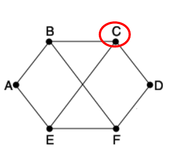
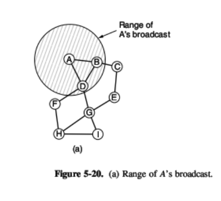

# REDES DE DATOS - Banco de ejercicios

**Comisión 403**

**Segundo parcial: práctica (Baró) y teoría (Medín)**

## Cómo usarlo

Tapá la respuesta e intentá resolver primero. Todas las respuestas están verificadas (las numéricas, con Python).

**Convención de la cátedra:** subredes válidas = 2ⁿ − 2. Se descartan la primera y la última subred, así como en cada subred se descartan la dirección de red y la de broadcast. "Subred N" = red base + N × salto.

## Direccionamiento IPv4 (práctica de la cátedra)

### Multiple choice

**1) Una red está dividida en 8 subredes de una clase B. ¿Qué máscara de subred se deberá utilizar si se pretende tener 2500 hosts por subred?**
a) 255.248.0.0 · b) 255.255.240.0 · c) 255.255.248.0 · d) 255.255.255.255 · e) 255.255.224.0 · f) 255.255.252.0 · g) 172.16.252.0

Respuesta: **b) 255.255.240.0** (/20). Con 4 bits de subred: 2⁴ − 2 = 14 subredes válidas (≥ 8). Con 12 bits de host: 2¹² − 2 = 4094 hosts (≥ 2500). La opción e) /19 da 2³ − 2 = 6 subredes válidas, que no alcanza; la c) /21 da 2046 hosts, que tampoco.

**2) ¿Cuáles de los siguientes direccionamientos son válidos en redes clase B?**
a) 10011001.01111000.01101101.11111000 · b) 01011001.11001010.11100001.01100111 · c) 10111001.11001000.00110111.01001100 · d) 11011001.01001010.01101001.00110011 · e) 10011111.01001011.00111111.00101011

Respuesta: **a, c y e**. En decimal son 153.120.109.194, 185.200.55.76 y 159.75.63.43: clase B es 1er byte entre 128 y 191, o sea que empieza con `10`. La b) es 89.x (clase A) y la d) es 217.x (clase C).

**3) ¿Cuál de las siguientes direcciones no pertenece a la misma subred si se usó la máscara 255.255.224.0?**
a) 172.16.66.24 · b) 172.16.65.33 · c) 172.16.64.42 · d) 172.16.63.51

Respuesta: **d)**. El salto es 256 − 224 = 32 en el 3er byte. 63 cae en la subred 172.16.32.0 (de .32 a .63); 64, 65 y 66 caen en 172.16.64.0.

**4) ¿Cuál es la dirección binaria correcta de 191.168.10.11?**
a) 10111001.10101000.00001010.00001011 · b) 11000001.10101100.00001110.00001011 · c) 10111111.10101000.00001010.00001011 · d) 10111111.10101001.00001010.00001011 · e) 01111111.10101000.00001011.00001011

Respuesta: **c)**. 191 = 10111111, 168 = 10101000, 10 = 00001010, 11 = 00001011.

**5) Convierta a decimal 00001010.10101001.00001011.10001011.**
a) 192.169.13.159 · b) 10.169.11.139 · c) 10.169.11.141 · d) 192.137.9.149

Respuesta: **b) 10.169.11.139**.

**6) ¿Cuál corresponde a una IP privada clase A?**
a) 00001010.01111000.01101101.11111000 · b) 00001011.11111010.11100001.01100111 · c) 00101010.11001000.11110111.01001100 · d) 00000010.01001010.01101001.11110011

Respuesta: **a)**, que es 10.120.109.248 (las privadas de clase A son 10.0.0.0 a 10.255.255.255). Las otras son 11.x, 42.x y 2.x: públicas.

**7) A partir de la IP 172.18.71.2 con máscara 255.255.248.0, ¿cuál es la dirección de subred y de broadcast?**
a) 172.18.64.0 / 172.18.80.255 · b) 172.18.32.0 / 172.18.71.255 · c) 172.18.32.0 / 172.18.80.255 · d) 172.18.64.0 / 172.18.71.255

Respuesta: **d)**. 255.255.248.0 es /21 y el salto es 8 en el 3er byte. 71 cae en [64, 72): red 172.18.64.0, broadcast 172.18.71.255.

**8) ¿Cuál de estas máscaras tiene prefijo de 24 bits?**
a) 255.0.0.0 · b) 224.0.0.0 · c) 255.255.0.0 · d) 255.255.255.0

Respuesta: **d)**.

**9) A partir de la IP 192.168.85.129 con máscara 255.255.255.192, ¿cuál es la dirección de subred y de broadcast?**
a) .85.128 / .85.255 · b) .84.0 / .92.255 · c) .85.129 / .85.224 · d) .85.128 / .85.191

Respuesta: **d)**. Salto 64; 129 cae en [128, 192).

**10) Una red clase C 192.168.1.0 con máscara 255.255.255.252 está dividida en subredes. ¿Cuántas subredes y cuántos hosts por subred hay?**
a) 62 subredes de 2 hosts · b) 126 de 4 · c) 126 de 6 · d) 30 de 6 · e) 2 de 62

Respuesta: **a)**. 6 bits de subred: 2⁶ − 2 = 62. 2 bits de host: 2² − 2 = 2.

**11) Tiene la IP 156.233.42.56 con una máscara de subred de 7 bits. ¿Cuántos hosts y cuántas subredes son posibles?**
a) 126 subredes con 510 hosts · b) 128 con 512 · c) 510 hosts con 126 subredes · d) 512 hosts con 128 subredes

Respuesta: **a)**. Es clase B (156): 7 bits de subred dan 2⁷ − 2 = 126, y quedan 9 bits de host: 2⁹ − 2 = 510. La máscara es 255.255.254.0.

**12) Una red clase B será dividida en subredes. ¿Qué máscara se debe usar para tener 500 hosts por subred?**
a) 255.255.224.0 · b) 255.255.248.0 · c) 255.255.128.0 · d) 255.255.254.0

Respuesta: **d)**. Se necesitan 9 bits de host (2⁹ − 2 = 510 ≥ 500), así que la máscara es /23.

**13) Si un nodo tiene la dirección 172.16.45.14/30, ¿a qué subred pertenece?**
A) 172.16.45.0 · B) .45.4 · C) .45.8 · D) .45.12 · E) .45.18 · F) 172.16.0.0

Respuesta: **D) 172.16.45.12** (de .12 a .15, con salto de 4).

**14) ¿Cuáles de estas direcciones se pueden asignar a nodos de la subred 192.168.15.19/28?**
A) .15.17 · B) .15.14 · C) .15.29 · D) .15.16 · E) .15.31 · F) ninguna

Respuesta: **A y C**. La subred va de .16 (red) a .31 (broadcast), así que los hosts asignables son de .17 a .30.

**15) A una empresa le asignaron una clase C y necesita 10 subredes, con la mayor cantidad posible de nodos en cada una. ¿Qué máscara usa?**
A) 255.255.255.192 · B) .224 · C) .240 · D) .248 · E) .242 · F) ninguna

Respuesta: **C) 255.255.255.240**. 2⁴ − 2 = 14 ≥ 10, mientras que con 3 bits 2³ − 2 = 6 no alcanza. Quedan 14 hosts por subred.

**16) ¿Cuántas subredes y nodos por subred se obtienen con /28 sobre la clase C 210.10.2.0?**
A) 30 y 6 · B) 6 y 30 · C) 8 y 32 · D) 32 y 8 · E) 14 y 14 · F) ninguna

Respuesta: **E) 14 subredes y 14 nodos** (con la convención −2).

**17) ¿Cuál es la dirección de subred del nodo 172.16.210.0/22?**
A) 172.16.42.0 · B) .107.0 · C) .208.0 · D) .252.0 · E) .254.0 · F) ninguna

Respuesta: **C) 172.16.208.0**. Salto 4 en el 3er byte; 210 cae en [208, 212).

**18) Convierta a decimal:** A) 01100100.00001010.11101011.00100111 · B) 10101100.00010010.10011110.00001111 · C) 11000000.10100111.10110010.01000101

Respuesta: **A = 100.10.235.39 · B = 172.18.158.15 · C = 192.167.178.69**.

**19) Sobre esas 3 direcciones, ¿qué afirmaciones son correctas?**
A) C es pública clase C · B) C es privada clase C · C) B es pública clase B · D) A es pública clase A · E) B es privada clase B · F) A es privada clase A

Respuesta: **A, D y E**. 192.**167** no es privada (el rango privado es 192.**168**); 172.18 sí cae en el rango privado 172.16–172.31.

**20) Si quisiera tener 12 subredes con un ID de red clase C, ¿qué máscara usaría?**
A) 255.255.255.252 · B) .248 · C) .240 · D) .255

Respuesta: **C) 255.255.255.240** (2⁴ − 2 = 14 ≥ 12).

**28) La red 172.30.0.0/16 tiene hoy 25 subredes con un mínimo de 1000 hosts cada una, y se proyecta llegar a 55 subredes. ¿Qué máscara usa?**
A) 255.255.240.0 · B) .248.0 · C) .252.0 · D) .254.0 · E) .255.0

Respuesta: **C) 255.255.252.0**. 2⁶ − 2 = 62 ≥ 55 y quedan 10 bits de host: 2¹⁰ − 2 = 1022 ≥ 1000.

### Desarrollo

**21) Se necesitan 6 subredes como mínimo. IP 180.10.1.0, máscara 255.255.254.0.**

Respuesta: la base es 180.10.0.0/23. Con 3 bits de subred, 2³ − 2 = 6, así que la máscara queda **/26 (255.255.255.192)**, con salto 64. Subredes válidas: **180.10.0.64 · 180.10.0.128 · 180.10.0.192 · 180.10.1.0 · 180.10.1.64 · 180.10.1.128**.

**22) Subredes de 120 hosts como mínimo. IP 172.15.35.0, máscara 255.255.255.0.**

Respuesta: hacen falta 7 bits de host, así que la máscara es **/25 (255.255.255.128)**. Subredes: **172.15.35.0/25** y **172.15.35.128/25**, de 126 hosts cada una. Con la regla 2ⁿ − 2, 1 bit de subred no da ninguna subred válida: en este ejercicio hay que usar las dos.

**23) Se necesitan 100 subredes como mínimo. IP 10.0.0.0, máscara 255.0.0.0. Obtener las subredes 39, 76, 87 y 99.**

Respuesta: 2⁷ − 2 = 126 ≥ 100, así que la máscara es **/15 (255.254.0.0)**, con salto 2 en el 2do byte. Subred 39 = **10.78.0.0** · 76 = **10.152.0.0** · 87 = **10.174.0.0** · 99 = **10.198.0.0**.

**24) Se necesitan 2000 hosts como mínimo por subred. IP 153.15.0.0, máscara 255.255.192.0. Obtener: a) el host 1312 de la subred; b) el host 287 de la subred 5; c) el host 1898 de la subred 6.**

Respuesta: la base es 153.15.0.0/18. Con 11 bits de host (2046 hosts) la máscara queda **/21 (255.255.248.0)**, con salto 8 en el 3er byte; salen 2³ − 2 = 6 subredes válidas.
- a) El enunciado no dice de qué subred. Tomando la 1: 153.15.8.0 + 1312 = **153.15.13.32** (1312 = 5 × 256 + 32).
- b) Subred 5 = 153.15.40.0; + 287 = **153.15.41.31**.
- c) Subred 6 = 153.15.48.0; + 1898 = **153.15.55.106**.

**25) Se necesitan 30 subredes como mínimo. IP 190.10.0.0, máscara 255.255.192.0. Obtener las subredes 15, 20 y 30.**

Respuesta: base /18. 2⁵ − 2 = 30, así que la máscara es **/23 (255.255.254.0)**, con salto 2 en el 3er byte. Subred 15 = **190.10.30.0** · 20 = **190.10.40.0** · 30 = **190.10.60.0**.

**26) Subredes de 500 hosts como mínimo. IP 172.15.0.0, máscara 255.224.0.0. Obtener: a) el host 254 de la subred 3854; b) el host 64 de la subred 198; c) el host 487 de la subred 2670.**

Respuesta: la base es 172.15.0.0 AND 255.224.0.0 = **172.0.0.0/11**. Con 9 bits de host la máscara queda **/23**, en bloques de 512 direcciones.
- a) **172.30.28.254**
- b) **172.1.140.64**
- c) **172.20.221.231**

Cómo se calcula: subred N empieza en N × 512 direcciones desde la base. Por ejemplo, 198 × 512 = 101.376 = 1 × 65.536 + 140 × 256, así que la subred 198 es 172.1.140.0.

**27) Subredes de 12 hosts como mínimo. IP 201.154.10.0, máscara 255.255.255.224. Obtener los hosts 4, 7 y 9 de la 1ª subred y los hosts 3, 8 y 11 de la 2ª.**

Respuesta: con 4 bits de host la máscara es **/28**, con salto 16; la 1ª subred es .0 y la 2ª es .16.
- 1ª subred: **201.154.10.4 · .7 · .9**
- 2ª subred: **201.154.10.19 · .24 · .27**

## Ruteo y servicios (práctica de la cátedra)

**1) a) Mencione dos aplicaciones donde sea más apropiado un servicio orientado a conexión. b) Dos donde convenga un servicio sin conexión.**

Respuesta: a) homebanking (no tolera pérdidas ni errores) y correo electrónico. b) transmisión de un partido en vivo (no hay tiempo para retransmitir) y videoconferencia o VoIP.

**2) Suponiendo que todos los routers y hosts funcionan bien, ¿puede un paquete ser entregado a un destino equivocado?**

Respuesta: sí. Una interferencia en el medio que no se pueda corregir puede alterar el campo de dirección destino.

**3) Vector distancia.** En la red de la figura, a C llegan los vectores (destinos A, B, C, D, E, F) desde B: (5, 0, 8, 12, 6, 2), desde D: (16, 12, 6, 0, 9, 10) y desde E: (7, 6, 3, 9, 0, 4). Los costos de C a B, D y E son 6, 3 y 5. Armá la nueva tabla de C, con línea de salida y costo.



Respuesta: para cada destino, mínimo de (costo al vecino + distancia que informa el vecino).
```
Destino   por B   por D   por E   Mejor
A         11      19      12      11 por B
B         6       15      11      6  por B
C         —       —       —       0
D         18      3       14      3  por D
E         12      12      5       5  por E
F         8       13      9       8  por B
```

**4) TTL.** En la figura, B se reinició y no tiene rutas, pero tiene que enviarle un paquete a H. Envía broadcasts con TTL = 1, 2, 3… ¿Con qué TTL alcanza?



Respuesta: TTL = 3 (B → D → F → H).

**5) Diseñe las direcciones IP de 5 máquinas en la red 111.159.35.0. ¿Qué máscara y qué prefijo tiene?**

Respuesta: 3 bits de host (2³ − 2 = 6 ≥ 5), máscara 255.255.255.248, prefijo /29. Máquinas: 111.159.35.1 a .5 (la .0 es la red y la .7 el broadcast).

## Parcial real: 2do parcial del 29/10/2024 (com. 403)

### Práctica (Baró)

**1) ¿Cuántas subredes distintas se pueden direccionar dentro de una red clase A con máscara 255.255.252.0?**

Respuesta: de /8 a /22 hay 14 bits de subred: 2¹⁴ = 16.384 bloques, **16.382 subredes válidas** (2¹⁴ − 2).

**2) Si se dispone de la IP 10.118.106.51, ¿qué máscara hay que usar para que esa dirección sea el host 42.51 de la subred 10.118.64.0?**

Respuesta: **255.255.192.0 (/18)**. Con salto 64 en el 3er byte, 106 cae en el bloque que empieza en 64, y 106.51 − 64.0 = 42.51. Con /19 (salto 32) caería en el bloque .96.

**3) Suponga una red IP 204.12.30.0 formada por 5 subredes. a) ¿Cuál es la máscara mínima que permite direccionarlas unívocamente? b) ¿Qué IP irá en el campo IP destino de un paquete enviado al host 14 de la subred 204.12.30.192? c) ¿Y al host 14 de las 5 subredes simultáneamente?**

Respuesta:
- a) **255.255.255.224 (/27)**, porque 2³ − 2 = 6 ≥ 5.
- b) **204.12.30.206** (.192 + 14).
- c) **204.12.30.238**: campo de subred en todos 1 ("todas las subredes", RFC 950) más el host 14, o sea 224 + 14. Es una interpretación propia; confirmar con Baró.

**4) Enuncie 4 ventajas de OSPF sobre RIP.**

Respuesta: converge rápido y no tiene cuenta a infinito (conoce la topología completa); usa una métrica por costo y ancho de banda, sin el límite de 15 saltos; escala con áreas; solo envía los cambios, no la tabla completa periódicamente. Además: balanceo ECMP y autenticación.

### Teoría (Medín)

**1) ¿Qué responsabilidades tiene la capa de transporte?**

Respuesta: comunicación extremo a extremo confiable y eficiente entre aplicaciones. Divide en segmentos y reensambla, garantiza entrega ordenada y confiable (TCP), hace control de errores y de flujo, multiplexa por puertos y controla la congestión (solo TCP).

**2) ¿Cómo controla la congestión el protocolo UDP?**

Respuesta: no la controla. No tiene control de congestión ni de flujo: envía al ritmo de la aplicación. Si hace falta control, lo implementa la aplicación.

**3) ¿Qué sucede si UDP detecta un error? ¿Y TCP?**

Respuesta: UDP no retransmite. El documento de preguntas de Medín dice que descarta el datagrama; la diapositiva de UDP de la cátedra dice que avisa a las capas superiores y deja que decidan (ver Unidad 3). TCP detecta el error y retransmite hasta recibir el ACK, manteniendo el orden.

**4) Grafique un ejemplo de conexión 3-way handshake.**

Respuesta:
```
Cliente                 Servidor
   | ---- SYN (seq=x) ------> |
   | <-- SYN+ACK (seq=y,      |
   |      ack=x+1) ---------- |
   | ---- ACK (ack=y+1) ----> |
   |   conexión establecida   |
```

**5) Enuncie diferencias entre TCP y UDP.**

Respuesta: TCP es orientado a conexión, confiable (retransmite y ordena), con control de flujo y de congestión, header de 20 B o más y flujo de bytes; se usa en web, correo y transferencias. UDP es sin conexión, sin garantías ni controles, con header de 8 B y mensajes individuales; se usa en voz y video en tiempo real, DNS y DHCP.

## Fragmentación y comandos de red (TP de Baró)

**1) Se deben transportar 1000 bytes de datos sobre una red que soporta como máximo 256 bytes por datagrama. El header IP es de 20 bytes y la Identificación vale 20. Determinar los campos de cada fragmento.**

Respuesta: entrarían 236 B de datos, pero tienen que ser múltiplo de 8, así que son 232 B (29 bloques). Salen 5 fragmentos:
```
Fragmento         1     2     3     4     5
Identificación    20    20    20    20    20
Long. total       252   252   252   252   92
Desplazamiento    0     29    58    87    116
MF                1     1     1     1     0
```
Viajan 1100 B en vez de 1020. El TP pone 72 como longitud del último fragmento: son los datos; la longitud total es 92.

**2) ¿Qué comando y opción usarías para: a) ver la tabla ARP; b) ver la tabla de rutas del host; c) renovar la IP obtenida por DHCP; d) hacer un ping que prohíba fragmentar; e) hacer un ping registrando la ruta?**

Respuesta: a) `arp -a` · b) `netstat -r` (o `route print`) · c) `ipconfig /renew` (solo si el equipo usa DHCP) · d) `ping -f` · e) `ping -r N`.

**3) Hacés ping y no hay respuesta. ¿Qué causas revisás?**

Respuesta: que la IP esté bien escrita; que esa IP esté configurada en el equipo destino; el cableado (probar con otro equipo del mismo segmento); y, si el destino está detrás de un router, que el host tenga configurado el gateway. Antes que nada, `ping 127.0.0.1` prueba la pila TCP/IP propia, aunque no la placa.
