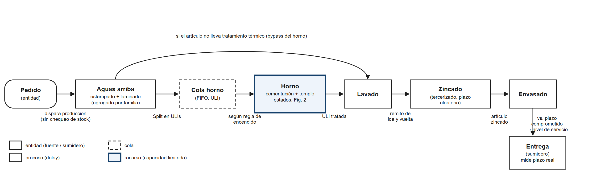
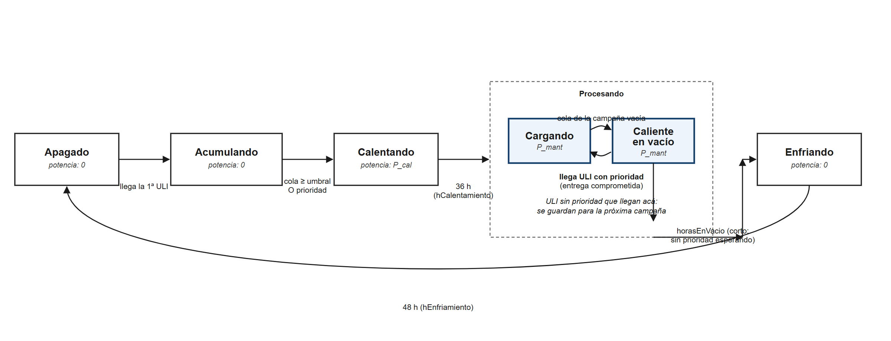

## Nota metodológica

El enunciado de esta entrega pide poder contestar, al finalizar el documento, si la especificación del
sistema está "suficientemente desarrollada" o si "todavía falta definir algún componente". Interpretamos
ese criterio como es habitual en la bibliografía de la materia para el pasaje del modelo conceptual al
modelo programado: **¿alcanzaría este documento para que otra persona —o nosotros mismos dentro de un
mes— construyera el modelo en cualquier herramienta de simulación, sin tener que volver a preguntarnos
nada?** Con esa vara medimos cada sección, y dejamos marcado explícitamente (📌) lo que todavía no llega a
ese nivel. La respuesta autoevaluada está al final del documento.

Por pedido de la empresa colaboradora, en todo el documento se usa únicamente su marca comercial, **Caser**,
y no la razón social real. Los valores monetarios se presentan tal como se relevaron — se convertirán a
números índice recién en el informe final, cuando el conjunto de datos esté cerrado.

Por el mismo motivo que la especificación se redacta independiente de la herramienta, no se detalla acá
cómo se implementa cada componente en un software puntual — eso es precisamente lo que corresponde a la
Etapa 2/2. La herramienta prevista para esa etapa es **AnyLogic 8 (Process Modeling Library)**, la de la
cátedra; se aclara solo a título informativo, sin que forme parte de la especificación conceptual en sí.

---

## 1. Sistema seleccionado

La cadena de producción interna de Caser, una PyME metalúrgica fabricante de tornillos y elementos
de fijación, acotada al subconjunto de artículos fabricados bajo la marca propia (no se incluyen accesorios
comprados a terceros ni artículos importados) y centrada en el recurso que gobierna el tiempo de entrega de
la mayoría de ellos: el horno de tratamiento térmico (cementación y temple).

## 2. Descripción del problema

Caser atraviesa una reestructuración financiera y opera con muy baja capacidad ociosa de capital: no
mantiene stock de seguridad reglado para prácticamente ningún artículo — la fabricación es, por decantación,
contra pedido. El horno de tratamiento térmico funciona de forma intermitente, no continua, porque
encenderlo tiene un costo fijo grande (36 h de calentamiento y 48 h de enfriamiento durante las cuales no
trata nada) frente a una capacidad de proceso relativamente chica (del orden de 17 unidades de transporte
interno —ULI— por día, en tres turnos de 8 h). Esa asimetría hace que la decisión de **cuándo lanzar una
campaña** sea determinante: encender temprano cuesta más energía por kilogramo tratado; esperar demasiado
extiende el tiempo de entrega y, con él, la probabilidad de perder la venta.

Un relevamiento histórico de 12 meses (reportes de presupuestado vs. facturado del sistema de gestión)
muestra un **fill rate global de 49-51 %**, con un 20 % de los artículos en entrega cero durante todo el
período. Consultado el encargado de producción, atribuye esas pérdidas a dos causas: **falta de stock y
plazo de entrega** — exactamente las dos variables que este modelo captura.

**Pregunta de decisión**: ¿qué regla de lanzamiento de campañas del horno minimiza el costo total (energía
incremental de operarlo más el costo financiero del capital inmovilizado en producto en proceso) sujeto a
mantener el nivel de servicio por encima de un mínimo aceptable, bajo distintos escenarios de demanda?

## 3. Límites del sistema

**Dentro del alcance**: demanda de un subconjunto de 10 a 30 artículos representativos de la marca propia;
producción agregada aguas arriba (estampado, laminado y lavado, sin distinguir máquina por máquina); el horno
de cementación y temple con su régimen de campañas; zincado tercerizado (modelado como una demora externa,
sin representar el proceso interno del tercero); envasado; entrega y medición del nivel de servicio.

**Fuera del alcance**, con la justificación de por qué:
- **Revenido**: es un tratamiento posterior a la cementación, realizado en un horno distinto y de mucha
  menor potencia, que no se aplica a todo el catálogo: lo llevan el 15 % de las ULI registradas entre 2023 y
  2026, concentradas en unos pocos artículos (todos de la familia CASER-Drill), que a su vez son el 22 % del
  volumen. Incorporarlo exigiría un segundo régimen de campaña, y el estudio varía la regla del horno de
  cementación, no la del de revenido. Para los artículos que lo llevan se modela como una demora aleatoria
  adicional con la distribución empírica observada (mediana 5 días, media 11,7, percentil 90 de 31), sin
  cola ni capacidad propia. Limitación: si la regla de cementación cambiara el ritmo con que llegan ULI al
  revenido, esa demora no se adaptaría.
- **Artículos importados**: no se tratan térmicamente, no interactúan con el recurso crítico del sistema.
- **Flujo de caja y rentabilidad global de la empresa**: exceden el objeto de un estudio de simulación de
  eventos discretos.
- **Dotación de personal y reinstalación de la línea de cincado propia**: no son preguntas que la empresa
  quiera resolver con este estudio, ni hay datos de inversión para la segunda.

## 4. Entidades

- **Pedido**: la unidad de demanda del cliente. Dispara la producción directamente, sin pasar por un
  chequeo de stock (no existe stock de seguridad reglado).
- **ULI (Unidad de Transporte Interno)**: el lote físico que circula por estampado, laminado, lavado, el
  horno, zincado y envasado. Es la entidad que efectivamente atraviesa la cola y el recurso críticos.

No se modela la pieza individual: no aporta al análisis y multiplicaría innecesariamente la cantidad de
agentes creados por corrida.

## 5. Recursos

| Recurso | Capacidad | Notas |
|---|---|---|
| Horno | 1 | Cementación + temple en un solo ciclo. Recurso crítico del sistema |
| Operador del horno | 1 | Disponible en **3 turnos de 8 h (24 h corridas)** durante la fase de procesamiento — corregido tras entrevista con el encargado (se asumía un turno diario) |
| Capacidad agregada aguas arriba | agregada por familia | Estampado, laminado y lavado tratados como un único recurso de capacidad agregada, no máquina por máquina |
| Zincado tercerizado | externo, no modelado | Se representa solo el tiempo de tránsito (demora), no la capacidad del tercero |

## 6. Procesos

Ver Figura 1. Secuencia: **pedido → producción aguas arriba (estampado, laminado y lavado, agregado) →
[horno, si el artículo lleva tratamiento térmico] → zincado tercerizado → envasado → entrega**. El lavado es
previo al horno: en el 99 % de las 11.461 ULI del seguimiento con ambas fechas, el lavado es del mismo día o
anterior al cementado. Los artículos que no requieren tratamiento térmico saltean el horno y siguen directo
al zincado. No hay una etapa de reposición de stock: cada pedido dispara su propia orden de producción.

## 7. Colas

- **Cola del horno**: FIFO, capacidad ilimitada. Es la única cola relevante del sistema — no existe una
  cola de "pedidos pendientes por falta de stock" porque no hay stock intermedio que agote.
- Puede existir contención en la capacidad agregada aguas arriba si varios pedidos coinciden, pero se
  modela como espera de recurso, no como una cola con lógica propia.

## 8. Variables

**De estado** (siguen la evolución de la corrida):
- Estado del horno: `Apagado` / `Acumulando` / `Calentando` / `Procesando` (`Cargando` / `Caliente en
  vacío`) / `Enfriando` (Figura 2).
- Tamaño de la cola del horno en el instante `t`.
- kWh acumulados de la campaña en curso.
- Marca de **prioridad**: indica si hay una ULI con entrega comprometida en camino que justifica adelantar
  el encendido o extender el tiempo en vacío.

**De decisión** (definen el escenario, se fijan por el experimento):
- `umbralULI`: cantidad de ULI acumuladas que dispara el encendido.
- `esperaMaxDias`: tiempo máximo de espera de la ULI más vieja antes de forzar el encendido (además del
  umbral).
- `horasEnVacio`: cuánto se sostiene el horno caliente con la cola vacía antes de empezar a enfriar.

**De seguimiento** (se miden, no se fijan):
- Tiempo de entrega por pedido (desde que se emite hasta que se despacha).
- Espera en cola de cada ULI antes de entrar al horno.

## 9. Parámetros

| Parámetro | Valor relevado | Fuente |
|---|---|---|
| Tiempo de calentamiento | 36 h | Relevamiento inicial de la empresa |
| Tiempo de enfriamiento | 48 h | Relevamiento inicial de la empresa |
| Tasa de procesamiento | ~17 ULI/día, 3 turnos de 8 h (≈85 min/ULI) | Relevamiento inicial de la empresa |
| Potencia instalada del horno | 145 kW | Planilla interna de costo energético |
| Costo de máquina | 0,665 USD/min a plena potencia (electricidad + aceite de temple + aire comprimido + gas del generador endotérmico + catalizador) | Planilla interna de costo energético |
| Consumo del generador de gases endotérmicos (GLP) | 📌 pendiente — factura de GLP a recibir de la empresa | Empresa |
| Potencia media del horno en operación | ≈102 kW (≈70 % de la instalada): 2.445 ± 179 kWh por día con cementado, medido sobre 28 meses (ene/2024-abr/2026) del medidor eléctrico exclusivo del horno. R² = 0,89 | Facturas de electricidad + `Seguimiento TR ulis` |
| Energía fija por encendido | Imprecisa con datos mensuales: 1.384 ± 1.288 kWh, unos 3 errores estándar por debajo del techo teórico de 36 h × 145 kW = 5.220 kWh. Caso base: la estimación; sensibilidad de 0 a 5.220 kWh | Planilla interna + facturas |
| Tarifa eléctrica y potencia contratada | Facturas de 2024 a agosto/2026 recibidas, tarifa 2 B1. Potencia convenida (pico/fuera de pico): horno 149/170 kW entre 2025 y abril/2026; fábrica 26-43/86-167 kW según el mes; servicio único 86/109 kW en junio y 156/180 kW desde julio/2026. Costo todo incluido ≈290 $/kWh en el medidor del horno en marzo/2025 | Empresa |
| Kg por ULI, por artículo | Resuelto (28/09/2026): 143 kg/ULI en promedio (mediana 136, rango 5,9-362,5 sobre 310 artículos). Medido mes a mes sobre el seguimiento: 31 t/mes en 2024-2025 y 20 t/mes en 2026, es decir 42 % y 26 % de los 60-90 t/mes de capacidad instalada (tomando 75 t), consistente con planta subutilizada | `Seguimiento TR ulis` |
| Precio de lista y costo índice por artículo | Precio: lista de precios oficial. Costo: precio de lista × 0,335 (fórmula provista por la empresa: 50 % de bonificación máxima, 33 % de rentabilidad bruta sobre el precio bonificado) | Lista de precios de la empresa |
| Tasa de costo del capital inmovilizado | 📌 pendiente, a definir con la empresa | — |

## 10. Eventos

Llegada de un pedido; ULI lista para tratamiento (fin de la etapa aguas arriba); ingreso a la cola del
horno; disparo del encendido (por umbral o por prioridad); fin del calentamiento; vaciamiento de la cola de
la campaña en curso; llegada de una ULI marcada con prioridad durante el estado "caliente en vacío"; fin
del tiempo en vacío sin prioridad pendiente (inicio del enfriamiento); fin del enfriamiento; retorno del
zincado tercerizado; entrega del pedido (medición del nivel de servicio).

## 11. Estados

Ver Figura 2. El horno se modela con un ciclo de cinco estados: `Apagado`, `Acumulando`, `Calentando`,
`Procesando` (con dos subestados, `Cargando` y `Caliente en vacío`) y `Enfriando`.

El punto que corrigió la entrevista con el encargado (27/09/2026), y que es el hallazgo más importante de
esta sección: **las ULI que llegan mientras el horno está prendido no se suman automáticamente a la campaña
en curso** — se guardan para la próxima. La única excepción es cuando se sabe, de antemano, que va a
ingresar pronto un artículo con una entrega comprometida que no puede esperar a la próxima campaña; en ese
caso se adelanta el encendido o se extiende el tiempo en vacío para esperarlo. Este mecanismo de prioridad
reemplaza al supuesto original (que asumía que toda ULI entrante se sumaba a la campaña) y es lo que hace
que `horasEnVacio` no sea un tiempo fijo, sino condicional a si hay o no una prioridad pendiente.

**Corrección confirmada (07/10/2026).** Al contrastar esa regla con el registro de producción de 2024 a
2026 (39 campañas, tomando como una misma campaña las fechas de cementado separadas por 3 días o menos), el
registro no coincide con una regla estricta de "las ULI que llegan se guardan para la próxima":
- La cola al encender tiene mediana de **77 ULI** (rango intercuartil 44-106), lo que confirma el umbral de
  70-80 ULI como disparador.
- Pero las campañas de 7 días o más (22 de 39) procesan una mediana de **186 ULI** y apagan con la cola casi
  vacía (mediana de 15 ULI esperando). Para tratar eso, las ULI que llegan con el horno prendido tienen que
  cargarse mientras haya cola. La campaña más larga duró 77 días sin apagar (757 ULI).
- Las otras 17 campañas son chicas (mediana de 5 ULI, cola al encender de 39): son los encendidos por
  prioridad, y son el 44 % de los encendidos, no un caso excepcional.

La lectura que mejor se ajusta a los datos es que el horno, una vez encendido, **procesa mientras haya cola y
apaga cuando se vacía**; lo que se guarda para la próxima son las ULI que llegan una vez iniciado el
apagado. **El encargado lo confirmó** ("las cargamos igual"): la regla de fin de campaña es procesar mientras
haya cola. La estructura de la Figura 2 no cambia; cambia solo la condición con la que `Procesando` sigue
cargando ULI nuevas. La excepción de prioridad se mantiene para los encendidos anticipados.

## 12. Relaciones entre componentes

El pedido dispara la creación de una o más ULI tras la etapa agregada de producción; cada ULI espera en la
cola del horno hasta que el estado del horno lo permite; el estado del horno depende tanto del tamaño de
esa cola como de la existencia de una prioridad conocida (una relación bidireccional: la cola alimenta la
decisión de encendido, y la decisión de encendido determina cuánto tiempo espera la cola). El tiempo total
en el sistema —desde la emisión del pedido hasta la entrega— es la variable que determina si esa venta se
concreta o se pierde, y es la salida que conecta el subsistema del horno con el indicador de negocio
(nivel de servicio) que motivó el estudio.

## 13. Datos de entrada

| Entrada | Estado | Fuente |
|---|---|---|
| Tiempo entre pedidos y tamaño de pedido, por artículo | Resuelto | Facturas de venta transaccionales, 12 meses, validadas de forma independiente contra la estadística mensual de la empresa |
| Demanda no atendida histórica (para validar nivel de servicio) | Resuelto | Reportes de presupuestado vs. facturado: fill rate 49-51 % |
| Tiempo de producción aguas arriba | Resuelto | Órdenes de fabricación desde 2020 |
| Tiempo entre arribos de ULI al horno | Resuelto | Registro de tratamiento térmico y tablero de seguimiento de ULI |
| Regla de encendido actual (umbral + excepción de prioridad) | Resuelto | Confirmación con encargado |
| Duración de campaña, cantidad de campañas | Parcial — el patrón real es más irregular de lo asumido; se derivó directamente del registro, no coincide con "una campaña semanal" limpia | Registro de tratamiento térmico |
| Plazo del zincado tercerizado | Resuelto, con dos fuentes cruzables | Tablero de seguimiento de ULI + registro de envasado |
| Precio y costo índice por artículo | Resuelto | Lista de precios de la empresa |
| Kg por ULI | Resuelto — 143 kg/ULI en promedio | Seguimiento TR ulis |
| Costo energético del horno | Electricidad resuelta: potencia media medida de ≈102 kW sobre 28 meses de facturas del medidor exclusivo del horno, con costo todo incluido consistente con la planilla interna (290 contra 277,7 $/kWh). 📌 GLP pendiente | Planilla interna de costo + facturas de electricidad (2024-2026) |
| Stock valorizado inicial | 📌 Pendiente | Empresa |
| Política de stock | Resuelto: no existe — todo contra pedido, salvo excepciones puntuales aún no identificadas | Confirmado por la empresa |

## 14. Indicadores de desempeño

| Indicador | Rol |
|---|---|
| Costo energético incremental por kilogramo tratado | Primario |
| Costo financiero del capital inmovilizado en producto en proceso | Primario |
| Nivel de servicio (proporción de pedidos servidos dentro del plazo comprometido) | Restricción |
| Tiempo de entrega (media y percentil 90) | Secundario |
| Espera en cola del horno (media y máxima) | Secundario |
| Campañas por mes, ULI por campaña, ocupación | Secundario / validación |
| Producto en proceso promedio (WIP) | Secundario |

## 15. Supuestos

- Un solo turno de trabajo aguas arriba; el horno opera en 3 turnos durante la fase de procesamiento
  (corregido).
- Capacidad agregada por familia de producto aguas arriba, no máquina por máquina.
- Precios y costos constantes en el horizonte simulado (en valores relevados; se indexan en el informe
  final).
- Zincado tercerizado modelado como una demora externa con plazo aleatorio; no se modela al tercero por
  dentro.
- El "horno" simulado es cementación y temple en un solo ciclo. El revenido queda fuera del modelo (otro
  equipo, no aplica a todo el catálogo) y, para los artículos que lo llevan, se modela como una demora
  aleatoria adicional con la distribución empírica observada, sin cola ni capacidad propia.
- No existe política de stock (s, Q): toda la producción es contra pedido, confirmado directamente por la
  empresa, salvo excepciones puntuales todavía sin identificar entre los artículos elegidos.
- Regla de fin de campaña (ver §11), **confirmada el 07/10/2026**: el horno procesa mientras haya cola,
  incluidas las ULI que llegan con el horno prendido, y apaga después de un tiempo con la cola vacía. Lo
  respalda el registro de producción (campañas de mediana 186 ULI que apagan con la cola casi vacía).
- El costo de la potencia eléctrica contratada es un costo fijo hundido para esta decisión de corto plazo:
  la comparación entre escenarios se hace sobre el consumo incremental de encender y operar el horno.
- El histórico de ventas refleja demanda atendida más una fracción medible de demanda no atendida (vía los
  reportes de presupuestado/facturado); esta última no distingue todavía el motivo puntual de cada pérdida
  más allá de la atribución general "stock y plazo" que dio el encargado.

## 16. Preguntas de simulación

1. ¿Qué regla de lanzamiento de campañas —umbral simple vs. umbral combinado con un tiempo máximo de
   espera— minimiza el costo relevante (energía incremental más costo financiero del capital inmovilizado),
   sujeto a un nivel de servicio mínimo aceptable?
2. ¿Esa conclusión cambia bajo distintos niveles de demanda (−20 %, actual, +20 %)?
3. ¿Existe una regla que reduzca significativamente el capital inmovilizado sin deteriorar el nivel de
   servicio de forma significativa, o el resultado es que no hay diferencia estadísticamente significativa
   entre las reglas evaluadas? (ambas conclusiones son válidas y se informan como tales).

## 17. Diagrama conceptual final

**Figura 1.** Flujo del sistema: entidades, colas, recursos y procesos.

*Fuente: elaboración propia.*

**Figura 2.** Estados del horno, con la regla de encendido y la excepción de prioridad confirmada el
27/09/2026.

*Fuente: elaboración propia.*

## 18. Autoevaluación

Volviendo a la pregunta de la nota metodológica — **¿alcanzaría este documento para construir el modelo sin
preguntar nada más?** La respuesta es **parcialmente sí**. El mecanismo del horno (Figura 2, sección 11) y
el flujo general (Figura 1, sección 6) están completamente especificados, con la corrección de la lógica de
prioridad ya incorporada, y la mayor parte de los datos de entrada está relevada y validada de forma
independiente (sección 13). Lo que todavía falta definir para llegar al 100 %:

- El costo del GLP del generador endotérmico, que la empresa todavía no entregó. La electricidad del horno
  ya está medida: el medidor era exclusivo del horno hasta abril de 2026 (confirmado por la empresa) y su
  consumo se explica por los días de operación con R² = 0,89. Lo que queda abierto de la energía es el
  costo fijo por encendido, que con datos mensuales solo se estima de forma imprecisa y se cubre con
  análisis de sensibilidad entre 0 y su techo teórico.
- Confirmar si alguno de los artículos elegidos es una de las excepciones que sí llevan stock.
- Confirmar la elección final de los 10 a 30 artículos representativos (hay una propuesta de 15 armada y
  pendiente de validar con la empresa).
- La tasa de costo del capital inmovilizado, que la empresa todavía no proveyó.

Ninguno de estos puntos cambia la estructura del modelo: son valores de parámetros, no componentes sin
definir. La regla de fin de campaña, que era el único punto capaz de cambiar la lógica del horno, quedó
confirmada con el encargado el 07/10/2026. Por eso se considera que la especificación conceptual está lista
para la construcción del modelo programado.
