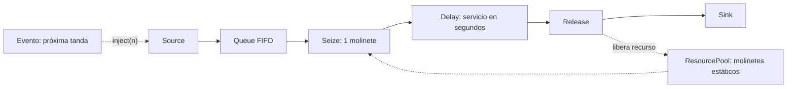
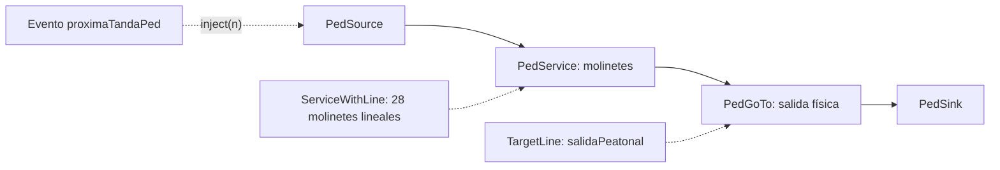
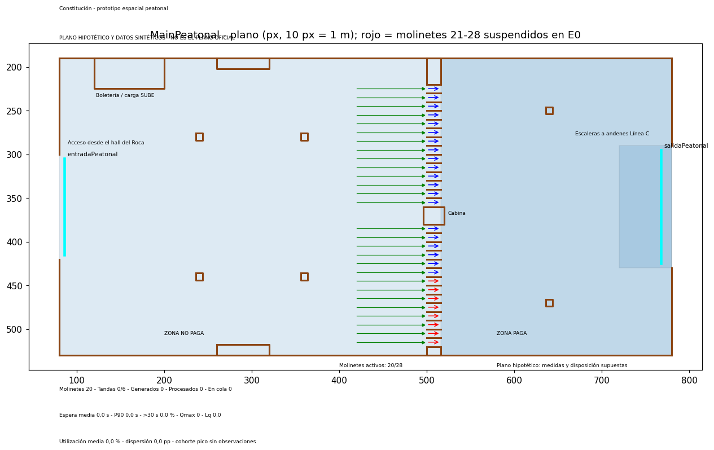

# TPI subte — primer modelo en AnyLogic

**2026-09-20 · preparación para el miércoles 23/09.**

Archivo: [`SubteConstitucion.alp`](SubteConstitucion.alp), formato **AnyLogic 8.9.9**. El 2026-09-24 el IDE local se
actualizó a 8.9.10: abre el modelo convirtiéndolo en memoria y deja una copia `*.original.alp` (ignorada
por Git). Si se guarda desde el IDE, el archivo pasa al formato 8.9.10.
Implementa el circuito y los escenarios de la [definición del caso](01-definicion-del-caso.md).
Es un **prototipo sin calibrar**: los parámetros de campo permanecen en `-1`.
El modo de demostración usa valores sintéticos explícitos; sus salidas no son resultados del TPI.

## 1. Abrir y ejecutar

1. Abrir el `.alp` en AnyLogic 8.9.9 o posterior.
2. En el árbol del proyecto, abrir `Main`: contiene los siete bloques, los parámetros y las funciones.
3. Ejecutar uno de los experimentos `E0`, `E1`, `E2` o `E3`. Cada experimento fija `escenario`;
   los demás parámetros heredan sus valores de `Main`, salvo que se sobrescriban en el experimento.
4. Mantener `modoDemo = true` para verificar inicialmente el circuito. Abrir la consola: al inicio
   imprime **DEMO SINTETICA - NO CALIBRADA** y al terminar imprime las medidas de la réplica.
5. Para cargar mediciones, completar los parámetros de la tabla siguiente y cambiar `modoDemo` a
   `false`. Si falta un dato necesario, la inicialización lanza un error explicativo.

**Verificación realizada:** XML, referencias de escenarios e identificadores; compilación de las
funciones Java contra la API local de AnyLogic 8.9.9; pruebas de lógica con trazas controladas.
**Verificado en el IDE el 2026-09-23:** el `.alp` completo compila correctamente en AnyLogic 8.9.9 y el
experimento `E0` inicia en modo demo, mostrando el aviso `DEMO SINTETICA - NO CALIBRADA E0`. La interfaz
actual es un tablero técnico provisorio; todavía no representa la geometría de la estación ni el movimiento
espacial de peatones.

Para repetir las verificaciones realizadas, desde la raíz del repositorio:

```sh
python3 materias/SIM/entregables/TPI/subte/verificar_modelo.py
```

El verificador usa el JDK y las bibliotecas de `/Applications/AnyLogic 8 PLE.app`; no modifica el modelo.

## 2. Circuito y unidades



Un agente representa **un pasajero**. `source` está en modo **Calls of inject() function**:
`proximaTanda` genera simultáneamente los pasajeros de una tanda mediante `source.inject(n)` y
programa la siguiente. No se usa una tasa Poisson individual ni se trata una tanda como un solo agente.

La unidad de tiempo del modelo es el **segundo**. `t = 0` representa las 07:00;
el pico 08:15–08:45 corresponde a `[4500, 6300)` y las 09:30 a `t = 9000`.
La primera tanda aparece en `primeraTandaSeg`, inicialmente cero.

`queue` es FIFO, sin abandono y de capacidad máxima. `seize` toma una unidad de `molinetes`;
su cola interna tiene capacidad **1**. Por eso la espera se registra desde `queue.onEnter` hasta
`seize.onSeizeUnit`, incluyendo ambas colas. La cola total se mantiene con `nEsperando`.
`delay` tiene capacidad máxima: la concurrencia la limita el ResourcePool, no otro servidor oculto.
`release` devuelve el recurso antes de destruir al pasajero en `sink`.

## 3. Parámetros expuestos

| Parámetro de Main | Inicial | Interpretación |
|---|---:|---|
| `escenario` | 0 | E0=0, E1=1, E2=2, E3=3; lo fija cada experimento |
| `modoDemo` | `true` | Usa valores sintéticos para revisar el funcionamiento |
| `molinetesBase` | 20 | Aproximación entera provisional; contrastar también 19 |
| `molinetesE1` | 28 | Hipótesis E1 de la definición del caso |
| `fraccionDesvioE2` | 0,15 | Fracción del flujo originalmente dirigido a Principal que se desvía; decisión de prueba |
| `servicioSUBESeg` | **-1** | **Completar en campo**: duración de servicio SUBE, segundos |
| `servicioEMVSeg` | **-1** | **Completar en campo**: duración EMV/QR, requerida en E3 |
| `tamanoTanda` | **-1** | **Completar en campo**: pasajeros por tanda a la intensidad de referencia |
| `intervaloTandaSeg` | **-1** | **Completar en campo**: intervalo entre tandas, segundos |
| `primeraTandaSeg` | 0 | Desfase de la primera tanda desde las 07:00 |
| `usarPerfilSBASE` | `true` | Modula el tamaño de las tandas con el perfil de diez ventanas |
| `perfil15min` | Diez medias del caso | `{1437,1578,1765,1824,1799,2054,2066,1742,1581,1636}` |
| `semilla` | 1 | Semilla del generador independiente usado para el desvío E2 |
| `horizonteSeg` | 9000 | Corte de arribos; para pruebas puede reducirse, hasta un máximo de 9000 |

En modo demo se usan **300 pasajeros por tanda de referencia, 150 s entre tandas, 3 s de servicio
SUBE y 2,5 s EMV/QR**. Son datos artificiales para ejercitar los bloques; no estimaciones ni mediciones.
Se ignoran los cuatro campos pendientes mientras `modoDemo` sea verdadero.

Con `usarPerfilSBASE = true`, en cada arribo:

```text
ventana = floor(t / 900)
tamaño generado = round(tamanoTanda × perfil15min[ventana] / 1748,2)
```

`1748,2 = 17482 / 10` es la intensidad de referencia del día hábil. El intervalo entre tandas sigue
siendo `intervaloTandaSeg`. **El perfil aporta la forma temporal, no impone 17.482 arribos exactos**:
el total depende del tamaño, intervalo, desfase y redondeo. Compararlo con el total observado es un
control de calibración. Si se mide una tanda solo en el pico, convertir su tamaño a la intensidad de
referencia antes de cargarlo, o desactivar el perfil para pruebas de una intensidad constante.

Los conteos SBASE son **validaciones**, no arribos observados. Usarlos para modular demanda es un
supuesto provisional, sujeto a verificar colas iniciales y censura por capacidad en campo.

Esta versión utiliza **duraciones e intervalos constantes** y tamaños modulados por ventana.
No se eligió una distribución estadística sin datos. Los puntos a extender tras medir son
`servicioSeg()`, `intervaloSeg()` y `tamanoActual()`: allí se incorporarán muestras empíricas o
distribuciones ajustadas. Repetir E0/E1/E3 con distintas semillas hoy da los mismos resultados;
todavía no corresponde realizar el test de medias del TPI.

## 4. E0–E3

| Experimento | Capacidad | Servicio | Desvío |
|---|---|---|---|
| E0 | `molinetesBase` | SUBE | 0 |
| E1 | `molinetesE1` | SUBE | 0 |
| E2 | `molinetesBase` | SUBE | `fraccionDesvioE2` |
| E3 | `molinetesBase` | EMV/QR | 0 |

**E0:** 19,5 es un promedio de molinetes con tráfico por ventana, no una capacidad fraccionaria.
La aproximación de 20 permite iniciar el modelo. Se debe verificar la disponibilidad y habilitación
real, y luego decidir entre capacidad constante o un horario de habilitaciones. La cola común y los
servidores intercambiables todavía no reproducen el reparto observado Turn14/Turn23.

**E1:** 28 conserva la hipótesis definida. Antes de interpretar la mejora hay que verificar que esos
28 sean utilizables para ingreso en Principal, respetando la exclusión del Turn07 declarada en el caso.
El modelo no convierte automáticamente identificadores registrados en capacidad operativa.

**E2:** antes de inyectar la tanda en Principal, se decide el desvío de cada pasajero con una Bernoulli.
Los desviados se cuentan en `nDesviados`; no entran en el circuito ni se computan como atendidos.
El 15 % inicial es una decisión de prueba, **no** el 15,3 % de participación histórica de Plaza.
Se consume un número aleatorio por pasajero en todos los escenarios, usando `semilla`.

Así se mide el alivio de **Principal**, bajo el supuesto de que Plaza acepta el flujo desviado. No se
modelan todavía el flujo propio, capacidad, caminata ni cola de Plaza. Por tanto, la espera de Principal
en E2 **no permite recomendar una mejora para todos los pasajeros de la estación**. Para esa comparación
se necesitará un segundo circuito para Plaza y medidas sobre la población completa.

**E3:** sustituye el servicio de todos los servidores por el parámetro EMV/QR y mantiene la capacidad
base. Es una hipótesis de conversión completa; no reproduce una mezcla de medios de pago ni implica
que contactless sea necesariamente más rápido. Una mezcla requiere medir su participación y asignar
el tipo de servicio por pasajero.

## 5. Salidas, corte y drenaje

Se generan arribos únicamente en `[0, 9000)`. A las 09:30 se fija el estado al cierre y se sigue
procesando hasta que sale el último pasajero de Principal. El modelo finaliza mediante
`getEngine().finish()`; el tiempo final muy grande del experimento es solo un límite técnico.

La consola imprime `resumen()` al finalizar. Las variables quedan disponibles en `Main`:

| Salida | Definición |
|---|---|
| `esperaMediaSeg`, `p90Seg`, `propMas30` | Cohorte de pasajeros ingresados a Principal dentro de la franja, con espera completa incluso si termina después de las 09:30 |
| `esperas` | Lista sin truncamiento de las esperas individuales; P90 usa rango más próximo: `ceil(0,9 n)` |
| `Lq` | Integral de la cola total dividida por 9000; excluye el período de drenaje |
| `qMax` | Máximo de pasajeros que deben esperar; descuenta lugares disponibles para transferencias instantáneas |
| `utilizacion` | Segundos ocupados en la franja / (9000 × capacidad) |
| `ocupacionPorUnidad` | Segundos ocupados de cada molinete dentro de la franja, incluyendo unidades nunca usadas |
| `desvioUtilizacionMolinetes` | Desvío poblacional de las utilizaciones individuales, al finalizar el drenaje |
| `procesadosFranja` | Pasajeros que salen antes de `t = 9000`; salida exactamente a las 09:30 queda fuera |
| `procesadosConDrenaje` | Pasajeros atendidos de toda la cohorte de Principal |
| `pendientes0930`, `cola0930` | Cohorte pendiente y cola al cierre, respectivamente |
| `disipaciones` | Para cada tanda con al menos un pasajero en Principal, tiempo hasta la siguiente cola total vacía |

Las tandas superpuestas comparten el siguiente instante de vaciado, cada una medida desde su arribo.
Si toda la tanda obtiene servicio inmediatamente, la disipación es cero. Se comprueba el vaciado en un
evento diferido `0,000001 s`, para evitar cierres falsos durante las transferencias de un mismo instante;
la duración se calcula con el instante del último cambio real de cola. La disipación significa **fin
de la espera**, no salida del último pasajero de la tanda.

La espera se mide en `onSeizeUnit`, y la ocupación termina en `onReleaseUnit`. Las áreas se actualizan
antes de cada cambio y se recortan al horizonte. Al terminar se exige:

```text
nGenerados = nDesviados + nProcesados
nProcesados = nPrincipal
```

No se interpretan pasajeros desviados como perdidos ni se omiten los pendientes a las 09:30.
La cola inicial es vacía, un supuesto pendiente de verificar a las 07:00; no se aplicó un calentamiento
arbitrario a este sistema de horizonte finito. Las salidas actuales agregan toda la franja: un reporte
separado de la cohorte del pico `[4500, 6300)` queda para la siguiente iteración.

## 6. Verificación y estrategia de calibración remota

El verificador reproduce una tanda de **5 pasajeros, 2 molinetes y servicio de 3 s** mediante trazas
explícitas: esperas `0, 0, 3, 3, 6`, media **2,4 s**, P90 **6 s**, cola máxima **3**, área de cola
**12 pasajero·s**, ocupación **15 molinete·s** y disipación **6 s**. Comprueba también el bloqueo por
parámetros faltantes, E0–E3, conservación y un servicio que cruza las 09:30. No es una simulación
alternativa al motor AnyLogic.

En la primera ejecución del IDE, verificar esa misma tanda (`modoDemo=false`, perfil desactivado,
`tamanoTanda=5`, `intervaloTandaSeg=150`, `servicioSUBESeg=3`, `molinetesBase=2`, `horizonteSeg=10`).
Después ejecutar los cuatro demos completos. Estos checks del motor siguen pendientes.

El grupo reside en Rosario y no puede realizar una medición presencial propia en Constitución. Para avanzar
sin presentar supuestos como observaciones:

- usar horarios oficiales del Ferrocarril Roca para aproximar los intervalos entre oleadas;
- solicitar a SBASE/Emova y Trenes Argentinos datos operativos de mayor granularidad;
- tratar los tiempos de servicio, tamaños de tanda y proporción de transferencia como factores
  experimentales dentro de rangos explícitos, sujetos a la conformidad del docente;
- validar el caudal agregado contra ventanas SBASE no usadas para parametrizar el modelo, dejando claro
  que el dataset disponible no permite validar la espera ni la cola real;
- Incorporar semillas independientes por fuente aleatoria y entradas comunes por réplica entre
  escenarios antes de calcular diferencias apareadas e intervalos de confianza.

## 7. Etapa peatonal incremental

El archivo incorpora una segunda raíz, `MainPeatonal`, tres experimentos espaciales de simulación
(`PeatonalDemo`, `PeatonalE0` y `PeatonalE1`) y dos de variación de parámetros para corridas apareadas
(`PeatonalCorridasDemo` y `PeatonalCorridasApareadas`, ver más abajo). Esta capa se mantiene separada de `Main` para conservar como referencia el
modelo lógico ya verificado y evitar que un error gráfico altere las métricas E0-E3. El tipo de agente
espacial es `Pasajero`.



`PedSource` crea tandas completas sobre la línea de acceso desde el hall del Ferrocarril Roca. Los peatones
se desplazan hasta `PedService`, eligen uno de los molinetes habilitados y esperan en la cola de ese
molinete. Después de validar, `PedGoTo` los conduce hasta
`salidaPeatonal`, al otro lado de los molinetes; recién allí `PedSink` los elimina del sistema. Así no se
cuenta como salida a quien sólo terminó el servicio. La velocidad confortable se genera entre 1,1 y 1,5
m/s y el diámetro se fijó en 0,5 m únicamente para comprobar la dinámica peatonal.

### Parámetros sintéticos de la demostración

| Parámetro | Valor inicial | Uso |
|---|---:|---|
| `tamanoTandaDemo` | 80 pasajeros | Fuerza una cola visible |
| `intervaloTandaDemoSeg` | 30 s | Separa las tandas de prueba |
| `cantidadTandasDemo` | 6 | Limita el experimento a 480 pasajeros |
| `servicioDemoSeg` | 3 s | Ejercita el servicio; no es una medición |
| `molinetesOperativosPed` | 20 o 28 | Única diferencia entre los experimentos espaciales E0 y E1 |
| `inicioPicoPedSeg`, `finPicoPedSeg` | 4500, 6300 s | Cohorte 08:15-08:45; queda vacía en la demo corta |
| `horizonteMetricasPedSeg` | 600 s | Corte de métricas de la demostración (en la franja se usa 9000 s) |
| `semillaPed` | 20260923 | Semilla efectiva: `inicializarPed()` reinicia con ella el generador del modelo |

El plano contiene 28 molinetes (`molinetePed01` a `molinetePed28`). En E0 se suspenden los molinetes 21 a
28 mediante la API de `ServiceWithLine`, de modo que quedan 20 disponibles; en E1 los 28 permanecen
activos. No se duplican colas ni geometrías: ambos escenarios atraviesan el mismo vestíbulo y el mismo
bloque `PedService`.

Las tandas de demostración se generan dentro de los primeros 600 s. `PeatonalDemo`, `PeatonalE0` y
`PeatonalE1` detienen el experimento a los 900 s para permitir el drenaje espacial (la demo general cortaba
antes a 600 s y quedaba sin drenar); E0 y E1 usan velocidad de animación 10x. Ambos usan la misma semilla
(`semillaPed = 20260923`) y los mismos parámetros de demanda y servicio. Desde el 2026-09-24 la semilla
efectiva es `semillaPed`: al arrancar, `inicializarPed()` ejecuta
`getDefaultRandomGenerator().setSeed(semillaPed)`, de modo que el valor escrito en la fila CSV es el que
realmente generó la corrida, cualquiera sea la configuración de aleatoriedad del experimento. Por lo tanto, cualquier
diferencia entre ellos proviene de la cantidad de molinetes habilitados dentro de esta demostración
controlada.

### Plano hipotético del vestíbulo (desde el 2026-09-24)

Mientras no llegue el plano oficial, la capa espacial usa un **plano inventado**, pensado para que el flujo
sea verosímil y no para reproducir Constitución. La vista lo indica con el aviso **PLANO HIPOTÉTICO Y DATOS
SINTÉTICOS - NO ES EL PLANO OFICIAL**. La geometría anterior tenía los 28 puestos apilados cada 0,8 m,
orientados en sentido contrario al flujo y con una sola cola compartida. Se reemplazó por esta disposición
(escala 10 px = 1 m):

| Elemento | Supuesto de diseño |
|---|---|
| Vestíbulo | 70 m × 34 m, con paredes físicas (`Wall`) |
| Acceso desde el Roca | Abertura de 12 m en la pared oeste (escaleras y rampa desde el hall ferroviario) |
| Zona no paga | 42 m de profundidad; boletería/carga SUBE, máquinas de carga y cuatro columnas como obstáculos |
| Línea de molinetes | En x = 42 m, perpendicular al flujo: dos bancos de 14 pasos de 1 m separados por una cabina de 2 m |
| Molinetes | Servicios **lineales** de 1,6 m que se atraviesan de oeste a este, de la zona no paga a la paga |
| Colas | Una por molinete, de 7,6 m, con la cabeza junto a la entrada del paso; si se llena, se extiende hacia el espacio libre |
| Zona paga | 26 m hasta las escaleras a andenes de la Línea C (abertura de 14 m en la pared este), con dos columnas |
| Molinetes cerrados en E0 | Los 8 del extremo sur (21-28) |



**Elección de cola.** `PedService` usa una regla propia (`elegirColaPed`): cada pasajero elige, entre los
molinetes habilitados, la cola que minimiza el desvío lateral recorrido a 1,3 m/s más la espera estimada por
las personas que ya están en ella (personas × tiempo de servicio). Es un supuesto de comportamiento: no
reproduce todavía el desbalance observado entre molinetes (Turn14 frente a Turn23). También evita que alguien
entre en la cola de un molinete suspendido.

**Medición de la espera.** Con un vestíbulo de 42 m hasta los molinetes, medir desde la entrada al bloque
`PedService` sumaba la caminata del hall a la espera. Desde ahora el reloj se reinicia en `onEnterQueue`,
es decir, al incorporarse a la cola de un molinete, y termina al comenzar la validación. El instante de
`onEnter` se conserva solo como respaldo.

No deben utilizarse sus valores para describir el desempeño actual de Constitución. Cuando se reciban
planos y datos operativos se reemplazarán las dimensiones, la cantidad y ubicación de molinetes, los tiempos
de servicio y la estructura de tandas.

### Métricas implementadas en la capa espacial

- peatones generados y procesados;
- procesados al corte (600 s en la demo, 09:30 en la franja) y procesados después del drenaje;
- cantidad actual en cola y máximo observado;
- espera media, máxima y percentil 90 desde el ingreso a `PedService` hasta el comienzo de la validación;
- proporción de peatones con espera superior a 30 s;
- $L_q$ temporal, integrando el número de peatones en cola;
- ocupación y utilización por cada posición de servicio, utilización media y dispersión poblacional;
- espera media y P90 de la cohorte que ingresa en `[4500, 6300)` cuando el horizonte incluya el pico;
- tiempo desde la última tanda hasta el drenaje completo del sistema.

La espera se guarda en cada `Pasajero` mediante `tEntradaColaPed`. Los callbacks `onEnterQueue` y
`onBeginService` actualizan la cola sin confundir peatones atendidos inmediatamente con peatones que sí
esperaron. `PedSource.onExit` fija el instante de ingreso y la pertenencia a la cohorte pico. Los callbacks
`onBeginService` y `onEndService` identifican el `ServiceUnit` concreto y acumulan sus segundos ocupados.
Al completar el horizonte, o al salir el último pasajero cuando el drenaje lo supera,
`resumenPeatonal()` imprime la cantidad de molinetes operativos, la utilización de cada puesto y las
medidas de espera. `filaResultadoPed()` arma una única línea separada por punto y coma, con escenario,
semilla y las métricas en el orden usado por la planilla de corridas. La capa E0-E1 escribe cero en
pasajeros desviados porque el desvío corresponde a E2.

El prefijo de la línea indica su origen y evita mezclar demostración con producción:

| Prefijo | Cuándo se emite | ¿Se carga en la planilla? |
|---|---|---|
| `CSV_PEATONAL_DEMO` | Demo sintética, al drenar la cohorte | No; solo en una copia de prueba con `--demo --salida` |
| `CSV_PEATONAL` | Modo franja, al drenar la cohorte | Sí, con `cargar_corridas.py` |
| `CSV_PEATONAL_INCOMPLETO` | La corrida terminó (tiempo final o cierre del IDE) sin drenar | No; bloquea la carga |

Antes de emitir se exige `inyectados = generados = procesados`; si no se cumple, la corrida se detiene con
un error de conservación en lugar de producir una fila. Si la inicialización falla (por ejemplo, franja sin
datos), no se escribe ninguna fila.

La utilización se define como segundos ocupados dentro de los primeros `horizonteCortePed` segundos
divididos por ese horizonte y por `molinetesOperativosPed`. `horizonteCortePed` vale
`horizonteMetricasPedSeg` (600 s) en la demo y `horizonteArribosPedSeg` (9000 s, 09:30) en la franja. Los
servicios que cruzan el corte se contabilizan solamente hasta ese instante y los iniciados después no
alteran esta medida. Los puestos habilitados que no atienden a nadie se incluyen con utilización cero. $L_q$ y el
throughput al corte se congelan con el mismo criterio; el total procesado se vuelve a leer al terminar el
drenaje. La cohorte pico usa el instante de salida de `PedSource`, no el instante de inicio de servicio,
para evitar seleccionar pasajeros según la propia congestión.

### Extensión a la franja 07:00-09:30 (preparada, pendiente de calibración)

`MainPeatonal` admite un segundo modo de demanda, `modoFranjaPed = true`, que reproduce el horizonte del
modelo lógico sin inventar la estructura de oleadas. Todos sus datos de campo arrancan en `-1` y la
inicialización lanza `IllegalArgumentException` si alguno sigue sin completar:

| Parámetro | Inicial | Contenido |
|---|---:|---|
| `modoFranjaPed` | `false` | `false` conserva la demo de seis tandas; `true` activa la franja |
| `horizonteArribosPedSeg` | 9000 | Cierre de arribos (09:30); admite `(0, 9000]` para pilotos |
| `tamanoTandaPed` | **-1** | Pasajeros por tanda a la intensidad media del perfil |
| `intervaloTandaPedSeg` | **-1** | Segundos entre tandas del Roca |
| `primeraTandaPedSeg` | **-1** | Desfase de la primera tanda desde las 07:00 |
| `servicioPedSeg` | **-1** | Tiempo de validación, segundos |
| `usarPerfilPed` | `true` | Modula el tamaño con el perfil SBASE |
| `perfilPed15min` | Diez medias SBASE | Igual a `perfil15min` de `Main`; el verificador controla que coincidan |
| `archivoSalidaPed` | `""` | Si no está vacío, agrega cada fila `CSV_PEATONAL*` a ese archivo |

La lógica de la franja es la misma que la del modelo lógico:

- las tandas se generan cada `intervaloTandaPedSeg` desde `primeraTandaPedSeg` mientras el instante sea
  menor que 9000 s; con el perfil activo, el tamaño es
  `round(tamanoTandaPed × perfil[ventana] / media(perfil))`, con `ventana = floor(t / 900)`;
- el corte de métricas coincide con el cierre de arribos: Lq, utilización, ocupación y procesados a las
  09:30 se congelan en `t = 9000`;
- el experimento sigue hasta que sale el último pasajero inyectado antes de las 09:30; entonces emite
  `CSV_PEATONAL`, escribe el archivo si corresponde y termina con `getEngine().finish()`;
- la cohorte pico 08:15-08:45 se define por el instante de ingreso (`PedSource.onExit`) y queda poblada
  cuando la franja incluye esa ventana;
- el tiempo de servicio se asigna a cada pasajero al ingresar (`servicioAsignadoPed`) y es el `delayTime`
  de `PedService`. Hoy es constante; si se incorpora una distribución, debe muestrearse en ese punto con un
  generador propio y en orden de llegada, para que E0 y E1 reciban los mismos valores.

El plano sigue siendo hipotético en este modo y la vista lo indica con el aviso
**PLANO HIPOTÉTICO - ENTRADAS PENDIENTES DE CALIBRACIÓN - NO ES EL PLANO OFICIAL**. Los perfiles SBASE son validaciones, no
arribos: la franja hereda los supuestos y controles de calibración de la sección 3.

Restricciones de AnyLogic PLE que condicionan la producción: la Pedestrian Library admite como máximo
**5 horas de tiempo de modelo** (por eso el experimento de producción termina a los 18.000 s: 9000 s de
arribos más hasta 9000 s de drenaje) y el modelo puede crear hasta **50.000 agentes dinámicos**. Una franja
de unos 17.500 pasajeros cabe en ese límite por corrida; debe confirmarse en la primera ejecución de
producción que el límite no se acumula entre las 60 corridas del experimento.

### Corridas apareadas automatizadas

`PeatonalCorridasApareadas` es un experimento de variación de parámetros en modo *freeform* con 60
corridas secuenciales. La corrida `index` usa `semillaPed = 20260923 + index / 2` y
`molinetesOperativosPed = index % 2 == 0 ? 20 : 28`: cada par consecutivo comparte semilla y difiere solo
en la cantidad de molinetes, con semillas 20260923-20260952 iguales a las de la planilla. Fija
`modoFranjaPed = true` y `archivoSalidaPed = "corridas_peatonales.csv"`. Mientras los cuatro parámetros de
campo sigan en `-1`, el experimento se detiene en la primera corrida con el error de calibración: es el
comportamiento esperado.

`PeatonalCorridasDemo` repite el circuito con tres pares de la demo sintética y escribe
`corridas_peatonales_demo.csv` (ignorado por Git). Sirve para comprobar la cadena completa sin producir
resultados.

El archivo se crea en el directorio de ejecución del modelo, que al lanzar desde el IDE es la carpeta del
`.alp`. Las filas se agregan al final: antes de relanzar un experimento completo hay que borrar o renombrar
el archivo anterior. El cargador rechaza una misma semilla y escenario con valores distintos y avisa si
encuentra filas idénticas repetidas. La transferencia a la planilla se hace con:

```sh
python3 materias/SIM/entregables/TPI/subte/cargar_corridas.py \
  materias/SIM/entregables/TPI/subte/corridas_peatonales.csv          # solo valida
python3 materias/SIM/entregables/TPI/subte/cargar_corridas.py \
  materias/SIM/entregables/TPI/subte/corridas_peatonales.csv --escribir
```

El cargador acepta también texto copiado de la consola. Rechaza filas demo en la planilla oficial, filas
incompletas, pares sin E0 o E1, pares con distinta cantidad de generados, semillas ajenas a la planilla,
violaciones de conservación y celdas ya cargadas con otro valor (salvo `--sobrescribir`). Antes de escribir
comprueba que los encabezados de la hoja `Corridas` sigan el orden de los 17 campos.

### Comparación espacial E0-E1

| Elemento controlado | `PeatonalE0` | `PeatonalE1` |
|---|---:|---:|
| Molinetes habilitados | 20 | 28 |
| Molinetes suspendidos | 8 | 0 |
| Semilla | 20260923 | 20260923 |
| Tandas, tamaño y servicio | iguales | iguales |
| Recorrido y salida | iguales | iguales |

La comparación es estructural y sirve para verificar la lógica de escenarios. No constituye todavía una
estimación del beneficio real de habilitar ocho molinetes adicionales, porque la demanda en tandas y el
tiempo de validación siguen siendo supuestos sintéticos. El P90 y la utilización ya están implementados;
la cohorte 08:15-08:45 queda sin observaciones porque la demostración termina antes de las 08:15 simuladas.

### Organización visual del modelo

Las presentaciones operativas de `Main` y `MainPeatonal` ocupan la zona izquierda del lienzo. Los
parámetros, variables, funciones y eventos se ordenaron en columnas técnicas a la derecha y se excluyeron
de la presentación en ejecución. Esta separación no cambia la lógica: evita que los iconos del editor se
superpongan al tablero, al vestíbulo o a los KPI. En la vista peatonal también se abreviaron las etiquetas a
`Molinetes activos: 20/28` y `Salida Línea C` para mantenerlas separadas.

`Main` conserva además un `Level` explícito para su presentación. Esto evita el error interno `null argument`
del editor de AnyLogic al recargar externamente un modelo cuyo `CurrentLevel` no tenía un nivel asociado.

### Próximas extensiones

1. Sustituir el plano hipotético por el plano o croquis de SBASE (la estructura de colas y molinetes lineales
   se conserva; cambian coordenadas, cantidad y obstáculos).
2. Reemplazar los 20/28 puestos provisionales por la cantidad, ubicación y disponibilidad real.
3. ~~Validar en el IDE el drenaje de `PeatonalE0` y `PeatonalE1`.~~ Hecho el 2026-09-24. La exportación de
   las corridas quedó automatizada el mismo día (`PeatonalCorridasApareadas` + `cargar_corridas.py`).
4. ~~Extender la capa espacial a la franja completa.~~ Preparado el 2026-09-24 (`modoFranjaPed`); resta cargar
   entradas calibradas o rangos aprobados y ejecutar un piloto de franja en el IDE.
5. Modelar Plaza como segundo circuito antes de interpretar E2 para toda la estación.
6. Ejecutar `PeatonalCorridasApareadas` (30 pares E0-E1 con semilla común) y cargar
   `corridas_peatonales.csv` con `cargar_corridas.py`. La plantilla ya calcula diferencias, intervalos y
   conclusiones; permanece vacía para no mezclar la demostración sintética con las corridas de producción.

## 8. Referencias técnicas

Propiedades contrastadas con `library.xml` de **ProcessModelingLibrary.jar 8.9.9**, instalado
localmente, y estructura del `.alp` basada en el modelo local `TP_Colas.alp`.

La etapa espacial también se contrastó con `PedestrianLibrary.jar` (8.9.9 y, desde el 2026-09-24, 8.9.10), con el tutorial local
`fuentes/Tutoriales/Airport/Airport.alp` de la cátedra y con el ejemplo instalado
`Subway Entrance Hall.alp`. La activación 20/28 usa `ServiceBase.setServiceSuspended(...)`, cuya firma se
verifica contra las bibliotecas instaladas antes de abrir el IDE.

- [Source — documentación oficial](https://anylogic.help/9/libraries/process-modeling/source.html): generación por llamadas a `inject(n)`.
- [Seize — documentación oficial](https://anylogic.help/9/libraries/process-modeling/seize.html): captura de recursos y cola interna.
- [Recursos — documentación oficial](https://anylogic.help/library-reference-guides/process-modeling-library/using-resources.html): unidades de recursos compartidos por procesos.
